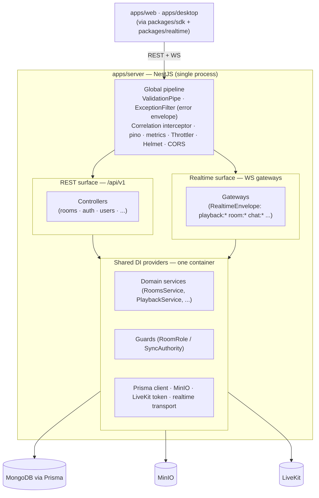

# ADR-002 — NestJS for the Backend (REST + WebSockets), Not Bare Express

> Choose NestJS as the backend application framework for Cowatch's API and realtime gateways, explicitly rejecting bare Express, and compare it against Fastify and tRPC.

**Status:** Accepted
**Date:** 2026-06-27
**Deciders:** Chief Architect, Backend Engineer, Realtime Engineer
**Related ADRs:** [ADR-001 — Monorepo (Turborepo + pnpm)](./ADR-001-monorepo.md), [ADR-003 — Prisma over MongoDB](./ADR-003-prisma-mongodb.md), [ADR-004 — Custom Realtime Abstraction](./ADR-004-realtime-abstraction.md), [ADR-008 — Auth / Token Model](./ADR-008-auth-tokens.md)
**Canon:** [Architecture Canon](../context/architecture.md) — see [§2 Canonical Decisions](../context/architecture.md#2-canonical-architecture-decisions-one-line--adr-id), [§3 Naming Conventions](../context/architecture.md#3-naming-conventions), [§5 Realtime Transport](../context/architecture.md#5-realtime-transport-abstraction-adr-004), [§8 Auth/Token Model](../context/architecture.md#8-auth--token-model-adr-008), [§10 Cross-Cutting Non-Negotiables](../context/architecture.md#10-cross-cutting-non-negotiables)
**Last updated: 2026-06-27**

---

## Context / Problem

Cowatch is a production SaaS, Discord-like watch-party platform whose backend (`apps/server`) must, on day one, host a substantial surface area inside **one** deployable Node process:

- **A versioned REST API** under `/api/v1` (auth, users, rooms, memberships, playlist, discovery, social, notifications, storage) with a uniform error envelope and ULID correlation propagation.
- **WebSocket gateways** speaking the canonical `RealtimeEnvelope` for `playback:*`, `room:*`, `chat:*`, `presence:*`, `social:*`, `notification:*`, `voice:*`, `system:*` — with the server holding **authority over playback** ([§7 Sync Algorithm](../context/architecture.md#7-sync-algorithm)).
- **A non-trivial auth stack**: JWT (RS256) access tokens, rotating refresh tokens with reuse detection, device sessions, Google OAuth, guest accounts, TOTP 2FA ([§8](../context/architecture.md#8-auth--token-model-adr-008)).
- **Thirteen bounded contexts** ([§3](../context/architecture.md#3-naming-conventions)): `AuthModule`, `UsersModule`, `RoomsModule`, `MembershipsModule`, `PlaylistModule`, `PlaybackModule`, `ChatModule`, `SocialModule`, `NotificationsModule`, `VoiceModule`, `DiscoveryModule`, `StorageModule`, `RealtimeModule` — each needing its own controllers, services, gateways, guards, and DTOs.
- **Cross-cutting non-negotiables** ([§10](../context/architecture.md#10-cross-cutting-non-negotiables)): `class-validator` DTO validation on every input, role/permission guards driving the [§6 permission matrix](../context/architecture.md#6-permission-model), structured pino logging, Prometheus metrics, `/health/live` + `/health/ready` probes, rate limiting, Helmet, strict CORS, and tracing spans that cross HTTP → service → WS.

The platform will be built incrementally by **specialized AI agent roles** (Backend, Realtime, Media, Voice, Social, ...) plus future human contributors, across a 12-phase roadmap. The framework choice therefore optimizes for **enforced structure, discoverability, and consistency at scale** as much as raw throughput. Two unbounded concerns sharing one process — a stateless REST API and a stateful realtime layer — must coexist cleanly under a single dependency-injection and lifecycle model, not as two ad-hoc subsystems wired together by hand.

The problem: **select the backend application framework** that makes the canon's structure the path of least resistance, gives first-class REST **and** WebSocket support in one runtime, and integrates cleanly with Prisma, MinIO, LiveKit token minting, and the custom realtime abstraction — without imposing an architecture that fights the canon.

---

## Options Considered

### Option A — NestJS (platform-agnostic adapter, REST + WS gateways) — **chosen**

A batteries-included, opinionated Node framework: modular DI container, decorator-driven controllers/providers, first-class WebSocket gateways, guards/interceptors/pipes/filters as composable cross-cutting primitives, and a platform abstraction (`@nestjs/platform-*`) so the HTTP engine is swappable underneath.

- **Pros:**
  - **DI + module system maps 1:1 onto the canon's bounded contexts** — each `XxxModule` is a real, encapsulated unit with explicit imports/exports; structure is enforced, not merely encouraged.
  - **First-class REST and WebSocket gateways in one process**, sharing the same providers, guards, and lifecycle — exactly the dual surface Cowatch needs; gateways can reuse `RealtimeGuard`, presence services, and the playback authority service directly.
  - **Cross-cutting concerns are framework primitives**: `ValidationPipe` (`class-validator` DTOs), `@UseGuards` (the permission matrix), exception filters (the standard error envelope), interceptors (correlation-id + pino + metrics) — wire once globally, apply everywhere.
  - **Platform-agnostic adapter** keeps the HTTP engine swappable (Fastify adapter available) without rewriting application code, hedging the throughput concern.
  - Mature ecosystem: `@nestjs/jwt`, `@nestjs/passport` (Google OAuth + guest strategies), `@nestjs/terminus` (health), `@nestjs/throttler` (rate limiting), `@nestjs/swagger` (OpenAPI) — directly serve [§8](../context/architecture.md#8-auth--token-model-adr-008) and [§10](../context/architecture.md#10-cross-cutting-non-negotiables).
  - **Consistency at scale across many authors** (AI agents + humans): conventions are structural, so generated code stays uniform and reviewable.
- **Cons:**
  - Heavier runtime and a real learning curve (decorators, DI, module wiring) versus a thin router.
  - More boilerplate per endpoint than tRPC's call-a-function ergonomics.
  - Default Express adapter carries Express's lower raw throughput (mitigated by the Fastify adapter).

### Option B — Bare Express

The de-facto minimal Node HTTP framework: a router plus middleware, no opinions on structure, DI, validation, or WS.

- **Pros:**
  - Smallest learning curve; ubiquitous; vast middleware ecosystem.
  - Maximum freedom — no imposed architecture.
- **Cons:**
  - **No structure, DI, modules, guards, or validation out of the box** — every cross-cutting concern in [§10](../context/architecture.md#10-cross-cutting-non-negotiables) (validation, error envelope, correlation propagation, permission guards) must be hand-built and hand-applied per route, which **decays into inconsistency** across 13 contexts and many authors — precisely the failure mode the canon exists to prevent.
  - **No first-class WebSocket model**; bolting on `ws`/`socket.io` yields a second, parallel subsystem with no shared lifecycle, DI, or guard story with the REST side.
  - **Explicitly forbidden by canon** ([§2, ADR-002](../context/architecture.md#2-canonical-architecture-decisions-one-line--adr-id)): "Express adapter is forbidden as an app framework — use Nest's platform." Express may exist only as an implementation detail underneath Nest's adapter, never as the application framework.

### Option C — Fastify (standalone)

A high-performance, schema-first Node framework with a plugin/encapsulation system and JSON-schema validation.

- **Pros:**
  - **Best raw HTTP throughput and lowest overhead** of the candidates; built-in JSON-schema validation and serialization.
  - Plugin encapsulation offers more structure than Express.
- **Cons:**
  - **No built-in DI/module model rich enough** to express the canon's bounded contexts the way Nest's container does; teams reinvent service wiring.
  - **WebSocket support is a plugin, not a first-class gateway model** — the same REST/WS-as-two-subsystems problem as Express, just with better perf.
  - Schema-first validation diverges from the canon's mandated **`class-validator` DTOs** ([§10](../context/architecture.md#10-cross-cutting-non-negotiables)), forcing a second validation idiom.
  - **Not wasted, though:** Nest ships a **Fastify adapter**, so we capture Fastify's performance *inside* Nest if/when needed — making standalone Fastify strictly dominated by Option A for this project.

### Option D — tRPC

End-to-end typesafe RPC: server procedures are TypeScript functions; the client gets inferred types with no schema/codegen step.

- **Pros:**
  - **Exceptional DX and end-to-end type safety** within a TS monorepo — zero client/server drift, no codegen.
  - Very low per-endpoint boilerplate.
- **Cons:**
  - **Not REST**: tRPC defines an RPC transport, conflicting with the canon's mandated **versioned, resource-nested REST routes** ([§3](../context/architecture.md#3-naming-conventions)) and **URI versioning** (`/api/v1` → `/api/v2`, [§10](../context/architecture.md#10-cross-cutting-non-negotiables)). It also can't serve non-TS or external clients (Electron auto-update endpoints, OAuth callbacks, webhooks, third parties) idiomatically.
  - **Realtime is limited to subscriptions**, not the canonical `RealtimeEnvelope` protocol with `playback:*` server-authority, resume handshakes, and presence ([§5](../context/architecture.md#5-realtime-transport-abstraction-adr-004), [§7](../context/architecture.md#7-sync-algorithm)) — it cannot host the custom transport abstraction.
  - **Couples API shape to the TS client**, undermining the canon's stable, versioned, client-agnostic contract and the typed `packages/sdk` boundary.
  - Best as a *complement* (it could ride on top of Nest later), never as the platform framework here.

---

## Decision

**Adopt NestJS as the backend application framework for `apps/server`,** serving both the `/api/v1` REST API and the WebSocket realtime gateways from a single process. Concretely:

1. **NestJS is the platform** ([ADR-002 canon line](../context/architecture.md#2-canonical-architecture-decisions-one-line--adr-id)). **Bare Express is forbidden as the application framework.** Express may appear only as an internal HTTP adapter beneath Nest; it is never imported, routed, or middleware-wired directly by application code.
2. **One Nest module per bounded context** ([§3](../context/architecture.md#3-naming-conventions)): `AuthModule`, `UsersModule`, `RoomsModule`, `MembershipsModule`, `PlaylistModule`, `PlaybackModule`, `ChatModule`, `SocialModule`, `NotificationsModule`, `VoiceModule`, `DiscoveryModule`, `StorageModule`, `RealtimeModule`, each at `apps/server/src/modules/<context>/` with mandated file suffixes (`.controller.ts`, `.service.ts`, `.gateway.ts`, `.guard.ts`, `.dto.ts`, `.module.ts`, `.spec.ts`).
3. **REST via controllers**, globally prefixed `/api/v1`, resource-nested and versioned per canon; **realtime via `@WebSocketGateway` classes** that speak the canonical `RealtimeEnvelope` and reuse the same DI providers and guards as the REST side. The server is authoritative for `playback:*` and stamps `serverEpochMs` ([§5](../context/architecture.md#5-realtime-transport-abstraction-adr-004), [§7](../context/architecture.md#7-sync-algorithm)).
4. **Cross-cutting concerns are global Nest primitives:** a global `ValidationPipe` (`class-validator` DTOs), a global exception filter emitting the [§10 error envelope](../context/architecture.md#10-cross-cutting-non-negotiables), a correlation-id interceptor propagating the ULID across HTTP header `x-correlation-id` and envelope `corr`, pino logging + Prometheus metrics interceptors, `@nestjs/throttler` rate limiting, Helmet, and strict CORS.
5. **HTTP adapter choice is deferred and reversible:** start on the default adapter; if profiling shows HTTP overhead matters, switch to Nest's **Fastify adapter** with no application-code rewrite. The platform-agnostic adapter ([ADR-004 spirit](./ADR-004-realtime-abstraction.md)) is the hedge that makes this a one-line change.
6. **Auth** ([§8](../context/architecture.md#8-auth--token-model-adr-008)) is implemented with `@nestjs/jwt` (RS256), `@nestjs/passport` strategies (Google OAuth, JWT, guest), and Nest guards enforcing the [§6 permission matrix](../context/architecture.md#6-permission-model) on both REST and WS surfaces.

---

## Consequences → Pros

- **Structure is enforced, not aspirational.** The module/DI system makes the canon's 13 bounded contexts first-class, encapsulated units, so code generated by many AI agents and humans stays uniform, discoverable, and reviewable.
- **One process, two surfaces, one model.** REST controllers and WebSocket gateways share the same DI container, guards, services, and lifecycle — the playback authority service, presence service, and permission guards are reused verbatim across HTTP and WS, eliminating the dual-subsystem drift that bare Express/Fastify would cause.
- **Cross-cutting non-negotiables wired once.** Global pipe/filter/interceptor/guard hooks deliver `class-validator` validation, the standard error envelope, correlation propagation, pino logs, metrics, health probes, rate limiting, Helmet, and CORS uniformly — satisfying [§10](../context/architecture.md#10-cross-cutting-non-negotiables) without per-route effort.
- **Auth maturity for free.** `@nestjs/jwt` + `@nestjs/passport` + guards cover RS256 JWTs, OAuth, guest, and the role matrix without bespoke plumbing ([§8](../context/architecture.md#8-auth--token-model-adr-008)).
- **Performance hedge retained.** The Fastify adapter is a drop-in, so we are not locked to Express's throughput; perf can be tuned later without architectural churn.
- **Testability.** Nest's DI makes unit and e2e tests straightforward (provider overrides, `Test.createTestingModule`), directly supporting the **90% coverage target** ([§10](../context/architecture.md#10-cross-cutting-non-negotiables)).
- **OpenAPI alignment.** `@nestjs/swagger` derives docs from the same DTOs that validate input, keeping `packages/sdk` and the API contract honest.

## Consequences → Cons

- **Heavier framework and learning curve.** Decorators, DI, and module wiring demand more upfront understanding than a thin router; onboarding (including agent prompt context) must cover Nest idioms.
- **More boilerplate per endpoint** than tRPC's plain functions — more files (module/controller/service/dto) for simple CRUD.
- **Runtime overhead vs. raw Fastify** on the default adapter; mitigated but not eliminated by the Fastify adapter option.
- **Some lock-in to Nest conventions.** Decorator/DI patterns are pervasive; moving off Nest later would be a substantial rewrite (judged acceptable given the structural payoff).
- **Two paradigms in one app** (REST decorators + WS gateways) — a richer surface to learn, though they share the same underlying primitives.

---

## Risks & Mitigations

| Risk | Likelihood | Impact | Mitigation |
|---|---|---|---|
| Default (Express) adapter throughput becomes a bottleneck under sync/chat fan-out | Medium | Medium | Adapter is swappable; profile early, switch to **Nest Fastify adapter** with no app-code change. Offload heavy realtime fan-out to the transport/LiveKit data channels per [ADR-004](./ADR-004-realtime-abstraction.md)/[ADR-005](./ADR-005-livekit.md). |
| Boilerplate slows feature velocity for AI agents | Medium | Low | Provide Nest schematics / generators and a canonical module template; agents scaffold from a fixed skeleton, keeping `.module/.controller/.service/.dto/.gateway` consistent. |
| Decorator/DI learning curve causes inconsistent patterns early | Medium | Medium | Bake Nest conventions into agent prompts and `docs/`; enforce via lint rules and a reference module (`RoomsModule`) as the gold-standard exemplar. |
| WS gateway and REST guards diverge (different auth paths) | Low | High | **Single source of truth**: one `JwtAuthGuard` + `RoomRoleGuard` + `SyncAuthorityGuard` reused by both controllers and gateways via shared DI providers; covered by e2e tests on both surfaces. |
| Over-engineering simple endpoints (module sprawl) | Medium | Low | Allow lean modules for trivial contexts; barrel/`index.ts` only per package ([§3](../context/architecture.md#3-naming-conventions)); avoid premature sub-module splitting. |
| Nest major-version upgrades introduce breaking changes | Low | Medium | Pin versions in the pnpm workspace ([ADR-001](./ADR-001-monorepo.md)); upgrade behind the Turborepo CI gate with the e2e suite green before merge. |

---

## Future Considerations

- **Fastify adapter promotion.** If load testing shows HTTP overhead is material, promote the Fastify adapter to default — a configuration change, not a redesign — capturing Option C's performance inside Option A.
- **Microservice / transport split.** Nest's `@nestjs/microservices` and the [custom realtime abstraction](../context/architecture.md#5-realtime-transport-abstraction-adr-004) leave room to extract the realtime layer (or playback authority) into a dedicated service or serverless adapter (Vercel Edge, Durable Objects, LiveKit data channels) without rewriting domain logic.
- **tRPC as an internal complement.** If a fully TS-internal, high-DX surface is ever wanted (e.g., an admin panel), tRPC could ride *on top of* Nest for that narrow audience — never replacing the public, versioned, client-agnostic REST contract.
- **Serverless deployment.** Per [ADR-010](./ADR-010-docker-first.md) (Docker-first; targets include Vercel), evaluate Nest serverless handlers / standalone bootstrap for edge targets, keeping the realtime transport pluggable per [ADR-004](./ADR-004-realtime-abstraction.md).
- **OpenAPI → SDK generation.** Drive `packages/sdk` partly from `@nestjs/swagger` output to keep client types and the REST contract automatically in lockstep.

---

*Supersedes: none. Amended by: none. See the [Architecture Canon §2](../context/architecture.md#2-canonical-architecture-decisions-one-line--adr-id) for the canonical one-line statement of this decision.*
