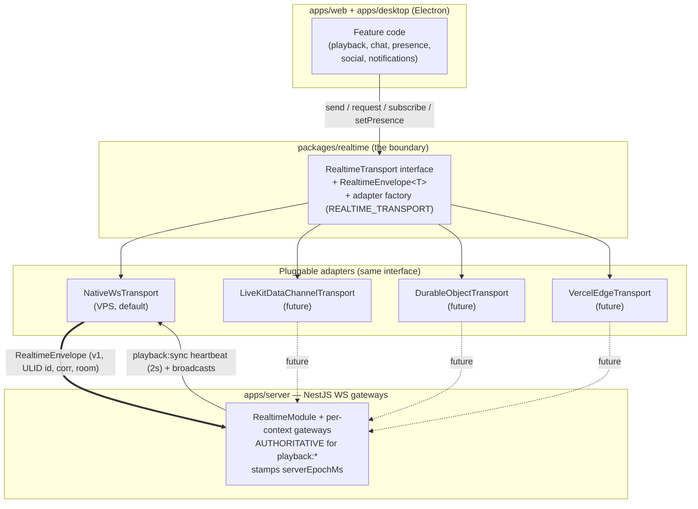

# ADR-004: Custom Realtime Abstraction with a Replaceable Transport

> One-line purpose: Define a single, transport-agnostic realtime layer (`packages/realtime`) — an envelope, a `RealtimeTransport` interface, and pluggable adapters — so Cowatch can run native WebSockets on a VPS today and swap to serverless/edge or LiveKit data channels later without rewriting application code.

- **Status:** Accepted
- **Owner agent:** Chief Architect
- **Date:** 2026-06-27
- **Deciders:** Chief Architect, Realtime Engineer, Backend Engineer, Frontend Engineer, DevOps Engineer
- **Related ADRs:** [ADR-001 (Monorepo)](./ADR-001-monorepo.md), [ADR-002 (NestJS backend)](./ADR-002-nestjs-backend.md), [ADR-005 (LiveKit voice/video)](./ADR-005-livekit.md), [ADR-006 (Electron desktop)](./ADR-006-electron-desktop.md), [ADR-007 (Server-authoritative playback sync)](./ADR-007-playback-sync.md), [ADR-008 (Auth / token model)](./ADR-008-auth-tokens.md), [ADR-010 (Docker-first delivery)](./ADR-010-docker-first.md)
- **Canon:** [Architecture Canon](../context/architecture.md) — primarily [§5 Realtime Transport Abstraction](../context/architecture.md#5-realtime-transport-abstraction-adr-004); also [§7 Sync Algorithm](../context/architecture.md#7-sync-algorithm), [§6 Permission Model](../context/architecture.md#6-permission-model), [§8 Auth / Token Model](../context/architecture.md#8-auth--token-model-adr-008), [§10 Cross-Cutting Non-Negotiables](../context/architecture.md#10-cross-cutting-non-negotiables)
- **Last updated: 2026-06-27**

---

## 1. Context / Problem

Cowatch is a Discord-like watch-party platform whose core value proposition is **synchronized media playback** with a sub-500 ms drift target ([Canon §7](../context/architecture.md#7-sync-algorithm), [ADR-007](./ADR-007-playback-sync.md)), layered with realtime chat, presence, typing indicators, social events, and notifications. Every one of these is a streaming, bidirectional, low-latency concern that flows through one logical channel multiplexed by room/topic.

These realtime concerns span **multiple clients and one server**:

- `apps/web` (React) and `apps/desktop` (Electron wrapping web, [ADR-006](./ADR-006-electron-desktop.md)) are the consumers.
- `apps/server` (NestJS WS gateways, [ADR-002](./ADR-002-nestjs-backend.md)) is the **authoritative producer** for `playback:*` and stamps `serverEpochMs` ([Canon §5](../context/architecture.md#5-realtime-transport-abstraction-adr-004), [§7](../context/architecture.md#7-sync-algorithm)).
- `packages/realtime` owns the contract; `packages/types` owns the payload types ([Canon §3](../context/architecture.md#3-naming-conventions)).

The deployment story is explicitly **multi-target and evolving** ([SPEC, Canon §10](../context/architecture.md#10-cross-cutting-non-negotiables), [ADR-010](./ADR-010-docker-first.md)): a self-hosted **VPS today** (where a single long-lived process can own native WebSocket connections), with **future targets including Vercel/edge and Cloudflare Durable Objects** (where long-lived sockets are constrained or billed differently), plus a future possibility of riding **LiveKit data channels** ([ADR-005](./ADR-005-livekit.md)) so that watch-party signaling shares the SFU mesh already open for voice.

**The core tension:** the transport that is correct on a VPS (one stateful WS server holding connections and a replay buffer) is *not* the transport that is correct on serverless/edge (stateless functions, no durable socket, connection state pushed to a managed pub/sub or a Durable Object). If application code — playback sync, chat, presence — is written directly against a concrete transport's API (e.g. `socket.emit`/`socket.on`, or an Ably/Pusher SDK), then **changing deployment topology means rewriting every feature**, re-testing the sub-500 ms sync loop, and re-validating authority enforcement. That is unacceptable lock-in for a platform that intends to move between hosting models.

**The problem to decide:** how do realtime features talk to the network such that (a) the **wire contract is stable and identical in both directions** (one envelope), (b) the **server stays authoritative** for playback ([Canon §7](../context/architecture.md#7-sync-algorithm)) and authority-gated for mutations ([Canon §6](../context/architecture.md#6-permission-model)), (c) the **transport is swappable per environment via config** with zero application-code change, and (d) reconnection/resume, presence, and request/ack semantics are solved **once** in the layer rather than re-implemented per feature?

Constraints inherited from canon that any solution must satisfy:

- **One envelope, every frame, both directions:** `RealtimeEnvelope<T>` with `v`, `id` (ULID), `type` (`namespace:entity:action`), optional `room`, `ts`, optional `corr`, and typed `data` ([Canon §5](../context/architecture.md#5-realtime-transport-abstraction-adr-004), [§10](../context/architecture.md#10-cross-cutting-non-negotiables)).
- **Namespaced events only:** `room`, `playback`, `chat`, `presence`, `social`, `notification`, `voice`, `system` ([Canon §3](../context/architecture.md#3-naming-conventions)).
- **Auth via short-lived JWT** passed to `connect({ url, token })`; the `sid`/`sub`/`roles` claims drive authority checks ([Canon §8](../context/architecture.md#8-auth--token-model-adr-008)).
- **Server authority + drift control** live above the transport ([Canon §7](../context/architecture.md#7-sync-algorithm)) and must not be coupled to any vendor's delivery semantics.
- **Reconnection** with exponential backoff + jitter (base 500 ms, cap 15 s), auto re-subscribe, and a **resume-by-`lastEnvelopeId`** handshake ([Canon §5](../context/architecture.md#5-realtime-transport-abstraction-adr-004)).

---

## 2. Options Considered

We evaluated four viable approaches. The decision is not "which network library is best in isolation" but "what is the right **boundary** between application features and the wire." Options A–C below are *direct-coupling* strategies (the app talks to the vendor); Option D is the *abstraction* strategy (the app talks to an interface, the vendor sits behind an adapter).

### Option A — Raw Socket.IO everywhere (no abstraction)

Use Socket.IO directly in `apps/server` (NestJS has a Socket.IO WS adapter) and in `apps/web`/`apps/desktop` via the `socket.io-client`. Features call `socket.emit('playback:play', …)` / `socket.on('playback:sync', …)` directly. Rooms map to Socket.IO rooms; reconnection and acks use Socket.IO's built-ins.

- **Pros:**
  - Fastest path to a working realtime layer; batteries-included reconnection, acknowledgements, room broadcast, and automatic transport fallback (WS → HTTP long-poll).
  - Large ecosystem, well-understood, first-class NestJS integration via `@nestjs/platform-socket.io`.
- **Cons:**
  - **Direct vendor coupling in every feature** — `playback`, `chat`, `presence`, etc. all bind to the Socket.IO client API. Migrating to edge/Durable Objects/LiveKit later means rewriting and re-testing all of them. This is exactly the lock-in the SPEC and [ADR-004 canon](../context/architecture.md#5-realtime-transport-abstraction-adr-004) forbid.
  - **Not serverless-native.** Socket.IO assumes a sticky, stateful server holding the connection; it does not fit Vercel functions or Durable Objects without a separate adapter layer anyway — so the abstraction we are trying to avoid reappears, just later and uglier.
  - Socket.IO imposes its **own non-standard framing/protocol** (engine.io) on the wire, conflicting with canon's requirement that *our* `RealtimeEnvelope` (with `v`, `corr`, ULID `id`) is the contract.
  - Bundle weight and a bespoke protocol the future LiveKit-data-channel/edge adapters would have to emulate or discard.

### Option B — Managed realtime SaaS: Pusher or Ably (direct SDK use)

Adopt a hosted pub/sub (Ably or Pusher Channels). Server publishes envelopes via the provider's REST/SDK; clients subscribe via the provider's client SDK. Presence and history (Ably) come as managed features.

- **Pros:**
  - **Zero socket infrastructure to operate** — no WS server, scaling, or connection-state management on our side; global edge PoPs, presence and message history (Ably) are managed.
  - Strong delivery guarantees, connection recovery, and rewind/history that map conceptually onto our resume-by-`lastEnvelopeId` need.
  - Fits serverless/edge naturally (publish over HTTP from stateless functions).
- **Cons:**
  - **Server authority becomes awkward.** Canon mandates the server is the single authority for `playback:*` and re-stamps `serverEpochMs` ([§7](../context/architecture.md#7-sync-algorithm)); with a SaaS broker, clients can publish directly to channels unless we lock every channel to server-only publish and proxy all mutations through our API — at which point the SaaS is doing less for us while still costing per-message.
  - **Per-message/per-connection cost at watch-party scale.** A 2 s `playback:sync` heartbeat ([§7](../context/architecture.md#7-sync-algorithm)) × every member × every active room, plus chat/presence/typing fan-out, makes metered pricing scale unfavorably and unpredictably.
  - **Hard third-party dependency & data residency.** Realtime is core to the product; an outage of the SaaS is a full product outage. Contradicts the self-hostable, Docker-first, "avoid lock-in" posture ([Canon §2/§10](../context/architecture.md#2-canonical-architecture-decisions-one-line--adr-id), [ADR-010](./ADR-010-docker-first.md)).
  - Still **vendor-coupled** if used directly: features bind to the Ably/Pusher SDK, recreating the migration problem.

### Option C — LiveKit data channels only (reuse the SFU for everything)

We already adopt LiveKit for voice/video/screen share ([ADR-005](./ADR-005-livekit.md)). Reuse its WebRTC **data channels** as the *sole* realtime transport: route playback sync, chat, presence, and notifications over the same LiveKit room/data-channel mesh.

- **Pros:**
  - **One connection mesh** for media + signaling; no second socket server to run.
  - Peer-distributed delivery via the SFU; data channels are low-latency and already authenticated by LiveKit access tokens.
  - Conceptually elegant for users *who are in a voice channel* — the pipe is already open.
- **Cons:**
  - **Couples realtime to voice presence.** Many watch-party participants are *not* in voice; forcing a LiveKit room join (and its token/PeerConnection cost) just to receive `playback:sync` or a chat message is wasteful and fragile. Watch sync must work with zero voice.
  - **Weak server authority.** Data channels are peer-oriented; making the server the authoritative, re-stamping clock source ([§7](../context/architecture.md#7-sync-algorithm)) over a P2P/SFU data mesh is unnatural and harder to guarantee than a server-owned WS.
  - **No durable replay buffer / resume** semantics for the resume-by-`lastEnvelopeId` handshake ([§5](../context/architecture.md#5-realtime-transport-abstraction-adr-004)); data channels are unreliable-or-reliable transport, not an event log.
  - **Total LiveKit coupling** for the whole product's realtime, contradicting "avoid lock-in" and making LiveKit a single point of failure for chat and presence, not just media.

### Option D — Custom realtime abstraction in `packages/realtime` with pluggable transport adapters (CHOSEN)

Define, in `packages/realtime`, a **stable contract** — the `RealtimeEnvelope<T>` and the `RealtimeTransport` interface ([Canon §5](../context/architecture.md#5-realtime-transport-abstraction-adr-004)) — and implement **interchangeable adapters** behind it. `NativeWsTransport` (a single multiplexed WS, default on VPS) ships first. Future adapters (`LiveKitDataChannelTransport`, `DurableObjectTransport`, `VercelEdgeTransport`) implement the *same* interface. Apps depend **only on the interface**; the concrete adapter is selected by the `REALTIME_TRANSPORT` config and apps are unaware of the choice. The NestJS WS gateways speak the **identical envelope** and remain authoritative for `playback:*`.

- **Pros:**
  - **Zero application-code change to swap transports** — features call `send`/`request`/`subscribe`/`setPresence` against the interface; VPS→edge→LiveKit migration is an adapter + config change, not a rewrite.
  - **Our envelope is *the* wire contract** (`v`, ULID `id`, `corr`, `type`, `room`), giving stable versioning and one correlation story across REST + realtime + logs ([Canon §10](../context/architecture.md#10-cross-cutting-non-negotiables)).
  - **Server authority and drift control sit cleanly above the transport** ([§7](../context/architecture.md#7-sync-algorithm)); the abstraction never dictates who owns the clock.
  - **Reconnection, resume, presence, and request/ack are solved once** in the layer and inherited by every feature and every future adapter.
  - **Best-of-both adoption of Options A–C as *adapters*, not architectures:** we can still implement a native WS (≈ what A wanted) and a LiveKit-data-channel adapter (≈ what C wanted) — without coupling the whole app to either.
  - **Directly mandated by canon** ([ADR-004 / §5](../context/architecture.md#5-realtime-transport-abstraction-adr-004)).
- **Cons:**
  - **We build and own the transport(s).** `NativeWsTransport` plus the resume buffer, backoff/jitter, multiplexing, and ack-correlation are our code to write, test, and operate — work that Options A/B hand off to a library/SaaS.
  - **Up-front interface design cost** and the discipline to keep features from leaking adapter-specific assumptions through the boundary.
  - **Each adapter must honor identical semantics** (ordering, at-least-once vs. exactly-once expectations, resume) or features behave subtly differently per environment — requires a shared conformance test suite.

---

## 3. Decision

**Adopt Option D: a custom realtime abstraction layer in `packages/realtime`, with a replaceable, config-selected transport**, exactly as mandated by [Canon §5 / ADR-004](../context/architecture.md#5-realtime-transport-abstraction-adr-004). Options A and C are **demoted to *adapters*** behind this interface, never used as the architecture; Option B is **rejected** as a primary dependency (optionally revisited as a future managed adapter, see §7).

Concretely:

- **The contract is canon-frozen.** `packages/realtime` exports `RealtimeEnvelope<T>`, `RealtimeTransport`, `ConnectionState`, `PresenceState`, and `Subscription` exactly as specified in [Canon §5](../context/architecture.md#5-realtime-transport-abstraction-adr-004). Apps (`web`, `desktop`) and the server gateways depend **only** on these types — never on a concrete adapter's API. Payload types (`PlaybackSyncEvent`, `ChatMessageNewEvent`, etc.) live in `packages/types` ([Canon §3](../context/architecture.md#3-naming-conventions)) and are the `T` in the envelope.

- **One envelope, both directions, versioned.** Every frame is a `RealtimeEnvelope` with `v: 1`, a ULID `id`, a `namespace:entity:action` `type`, optional `room` topic, sender `ts`, optional `corr` for request/ack/error pairing, and typed `data`. Breaking changes bump `v` ([Canon §10](../context/architecture.md#10-cross-cutting-non-negotiables)).

- **`NativeWsTransport` is the default and first shipped adapter** ([Canon §5](../context/architecture.md#5-realtime-transport-abstraction-adr-004)): a **single** WebSocket connection per client, **multiplexed by `room`** (one socket carries all of a user's rooms/topics). It owns reconnection (exponential backoff + jitter, **base 500 ms, cap 15 s**), automatic re-subscribe of all topics on reconnect, and the **resume handshake** replaying missed events by `lastEnvelopeId` from the server buffer; on buffer miss it requests a fresh `playback:sync` + room snapshot.

- **Adapter selection is config-driven via `REALTIME_TRANSPORT`** (e.g. `native-ws` | `livekit-data` | `durable-object` | `vercel-edge`). A small factory in `packages/realtime` resolves the env value to a concrete adapter at startup. **Apps are unaware of the choice** ([Canon §5](../context/architecture.md#5-realtime-transport-abstraction-adr-004)); switching environments is a config + Docker env change ([ADR-010](./ADR-010-docker-first.md)), not a code change.

- **Server side speaks the identical envelope.** NestJS WS gateways ([ADR-002](./ADR-002-nestjs-backend.md)) — one gateway per bounded context (`RealtimeModule` hosts the transport; `PlaybackModule`, `ChatModule`, `PresenceModule`, etc. own their events) — consume and emit the same `RealtimeEnvelope`. The server is **authoritative for `playback:*`**, validates the emitter's effective role against the room's `SyncAuthority` mode, applies the change, **re-stamps `serverEpochMs`**, and broadcasts ([Canon §6](../context/architecture.md#6-permission-model), [§7](../context/architecture.md#7-sync-algorithm)).

- **Request/ack and error semantics are first-class.** `send<T>()` is fire-and-forget; `request<TReq,TRes>()` is ack-correlated via `corr` with a timeout. Server-rejected mutations (e.g. unauthorized playback control) return a `system:error` envelope carrying the same SCREAMING_SNAKE `code` vocabulary as REST (e.g. `FORBIDDEN_SYNC`) with `corr` tying it to the originating request ([Canon §6](../context/architecture.md#6-permission-model), [§10](../context/architecture.md#10-cross-cutting-non-negotiables)).

- **Auth on connect.** `connect({ url, token })` carries the short-lived JWT access token ([Canon §8](../context/architecture.md#8-auth--token-model-adr-008)); the server authenticates the socket from `sub`/`sid`/`roles`/`kind`, binds the connection to the device session, and re-authorizes on token refresh. Guests connect with `Guest`-role defaults.

- **Presence is a transport capability, not a feature reimplementation.** `setPresence` / `onPresence` ([Canon §5](../context/architecture.md#5-realtime-transport-abstraction-adr-004)) carry `PresenceState` (`online`/`idle`/`dnd`/`offline` + optional in-room activity); `packages/social` consumes it rather than rebuilding socket plumbing.

- **A transport conformance suite is mandatory.** Every adapter (starting with `NativeWsTransport`) MUST pass a shared spec covering ordering within a topic, request/ack correlation, reconnect + auto re-subscribe, resume-by-`lastEnvelopeId`, presence propagation, and `system:error` mapping — guaranteeing behavioral parity across environments and protecting the 90% coverage gate ([Canon §10](../context/architecture.md#10-cross-cutting-non-negotiables)).

This decision is **canon-binding** ([Canon §5](../context/architecture.md#5-realtime-transport-abstraction-adr-004)): no app or package may import a concrete transport directly or bypass the `RealtimeEnvelope`/`RealtimeTransport` contract without a superseding ADR.

---

## 4. Consequences → Pros

- **No-rewrite portability.** Moving from VPS native WS to Vercel/edge, Cloudflare Durable Objects, or LiveKit data channels is an **adapter + `REALTIME_TRANSPORT` config change** — application features (the sub-500 ms sync loop, chat, presence) are untouched and their tests stay green ([Canon §5](../context/architecture.md#5-realtime-transport-abstraction-adr-004)).
- **Stable, versioned wire contract.** Our `RealtimeEnvelope` (with `v`, ULID `id`, `corr`, `type`, `room`) is the single source of truth on the wire, giving deterministic versioning and one `correlationId` story across REST + realtime + logs ([Canon §10](../context/architecture.md#10-cross-cutting-non-negotiables)).
- **Server authority is clean and uncompromised.** The clock/authority model ([§7](../context/architecture.md#7-sync-algorithm)) lives above the transport; the server validates `SyncAuthority`, re-stamps `serverEpochMs`, and broadcasts, regardless of which adapter carries the bytes.
- **Solve-once cross-cutting concerns.** Reconnection (backoff+jitter), auto re-subscribe, resume-by-`lastEnvelopeId`, presence, and request/ack live in the layer — every feature and every future adapter inherits them rather than re-implementing.
- **Self-hostable, no mandatory third party.** Realtime — the product's core — runs entirely on infrastructure we control (Docker-first, [ADR-010](./ADR-010-docker-first.md)), eliminating a SaaS as a single point of product failure and unbounded per-message cost.
- **Options A and C are not lost — they become adapters.** A native WS adapter captures Socket.IO's strengths without its protocol lock-in; a `LiveKitDataChannelTransport` can later ride the SFU mesh for voice-active users — both behind the same interface.
- **Testability + recoverability.** A shared conformance suite pins behavior across adapters (supports the 90% gate), and the entire contract lives in one versioned package (supports R2 recoverability, [Canon §10](../context/architecture.md#10-cross-cutting-non-negotiables)).

---

## 5. Consequences → Cons

- **We own the transport code.** `NativeWsTransport` and its resume buffer, multiplexing, backoff, and ack-correlation are ours to build, harden, scale, and operate — effort that Options A (library) and B (SaaS) would have offloaded.
- **Up-front and ongoing design discipline.** The interface must be carefully designed once and **policed** so features never leak adapter-specific assumptions (e.g. relying on native-WS ordering guarantees a future edge adapter cannot make).
- **Per-adapter semantic parity is non-trivial.** Each adapter must honor identical ordering/resume/ack semantics or features behave differently per environment; the conformance suite is mandatory overhead, not optional.
- **Server-side connection state is our problem on VPS.** Holding many long-lived WS connections, the replay buffer, and horizontal scale-out (sticky sessions / shared pub/sub backplane) is operational surface the native adapter introduces.
- **Abstraction can hide capability differences.** A uniform interface risks papering over genuine transport differences (e.g. presence semantics, max payload size, reliability) that features should sometimes know about; requires explicit capability flags rather than a lowest-common-denominator illusion.

---

## 6. Risks & Mitigations

| Risk | Likelihood | Impact | Mitigation |
|---|---|---|---|
| **Leaky abstraction** — feature code depends on `NativeWsTransport`-specific behavior (strict ordering, unbounded payloads), breaking a future edge/LiveKit adapter. | Medium | High | Lint/dependency rule forbidding imports of concrete adapters in apps; expose explicit `capabilities` flags on the transport; run the **conformance suite** against a deliberately weaker mock adapter in CI to surface hidden assumptions. |
| **Resume buffer gap** — a client reconnects after the server's `lastEnvelopeId` buffer has evicted its window, missing events. | Medium | Medium | Bounded, per-room replay buffer with a documented retention window; on buffer miss the client deterministically requests a fresh `playback:sync` + room snapshot ([Canon §5](../context/architecture.md#5-realtime-transport-abstraction-adr-004)); never silently drop. |
| **Horizontal scale-out** of the native WS server — connections on node A must receive broadcasts published on node B. | Medium | High | Stateless gateways + a shared **pub/sub backplane** (e.g. Redis/NATS) fanning envelopes by `room`; sticky sessions only for the socket, not for state; load-test the heartbeat fan-out before GA. |
| **Authority bypass** — a client emits a mutating `playback:*` without satisfying the room's `SyncAuthority` mode. | Low | High | Server-side validation is mandatory and transport-independent ([Canon §6](../context/architecture.md#6-permission-model)); unauthorized mutations are rejected with `system:error { code: "FORBIDDEN_SYNC" }`; never trust client-asserted role. |
| **Drift target regression** ([§7](../context/architecture.md#7-sync-algorithm)) on a new adapter with higher/variable latency (edge, data channels). | Medium | High | Clock-offset (ping/pong RTT) and drift-correction logic live **above** the transport; conformance suite asserts steady-state drift < 500 ms per adapter under simulated latency; gate adapter promotion on meeting the target. |
| **Interface churn** forcing breaking changes across all adapters/apps. | Low | Medium | Treat `RealtimeEnvelope`/`RealtimeTransport` as canon-frozen; additive evolution only; breaking changes bump envelope `v` and require a superseding ADR ([Canon §5/§10](../context/architecture.md#5-realtime-transport-abstraction-adr-004)). |
| **Token expiry on a long-lived socket** mid-session (15-min access token, [ADR-008](./ADR-008-auth-tokens.md)). | High | Medium | In-band re-auth: client refreshes via `/api/v1/auth/refresh` and re-presents the new access token over the socket; server re-binds the session without dropping the connection; on hard failure, close with a typed `system:error` and reconnect. |
| **Build-your-own bugs** in reconnection/backoff (thundering-herd reconnects after a server blip). | Medium | Medium | Mandated exponential backoff **with jitter** (base 500 ms, cap 15 s) per canon; server-side connection rate limiting; chaos test mass-reconnect scenarios. |

---

## 7. Future Considerations

- **`LiveKitDataChannelTransport`** ([ADR-005](./ADR-005-livekit.md)): once voice is live, offer an adapter that rides the already-open SFU data channels for users in a voice channel, falling back to native WS otherwise — reclaiming Option C's benefit without its coupling. Requires reconciling the server-authority clock with peer-distributed delivery.
- **`DurableObjectTransport` (Cloudflare) and `VercelEdgeTransport`**: when a serverless/edge deployment target is pursued ([ADR-010](./ADR-010-docker-first.md)), implement adapters where a Durable Object (or edge KV/pub-sub) holds per-room connection state and the replay buffer. The conformance suite gates their promotion to default in any environment.
- **Optional managed adapter (Ably/Pusher) — Option B as a plug-in, not a foundation.** If a future scale or geo-distribution need favors a managed backplane, it can be wrapped as just another adapter behind the same interface — without re-coupling features — provided server-authority and cost models are validated first.
- **Backpressure & flow control.** As rooms grow, define per-connection send-queue limits and coalescing of high-frequency events (e.g. `chat:typing`, presence churn) at the transport layer so a single noisy room cannot starve a client.
- **Binary framing / compression.** Evaluate a compact binary envelope encoding (e.g. CBOR/MessagePack) and per-frame compression for the 2 s heartbeat fan-out at scale, behind the same logical envelope (`v` bump if the wire format changes).
- **Delivery-guarantee tiers.** Consider per-`type` delivery semantics (e.g. best-effort for `presence:update`/`chat:typing`, at-least-once with resume for `playback:*`/`notification:new`) surfaced via the envelope/capabilities so adapters can optimize without features guessing.
- **Cross-device fan-out & multi-session presence.** With per-device sessions ([ADR-008](./ADR-008-auth-tokens.md)), formalize how presence aggregates across a user's multiple connected devices and how `notification:new` deduplicates across them.

---

_This ADR complies with and is governed by the [Cowatch Architecture Canon](../context/architecture.md). Any change to this decision requires a superseding ADR plus a history entry, context update, and repomix update (R3/R4)._
