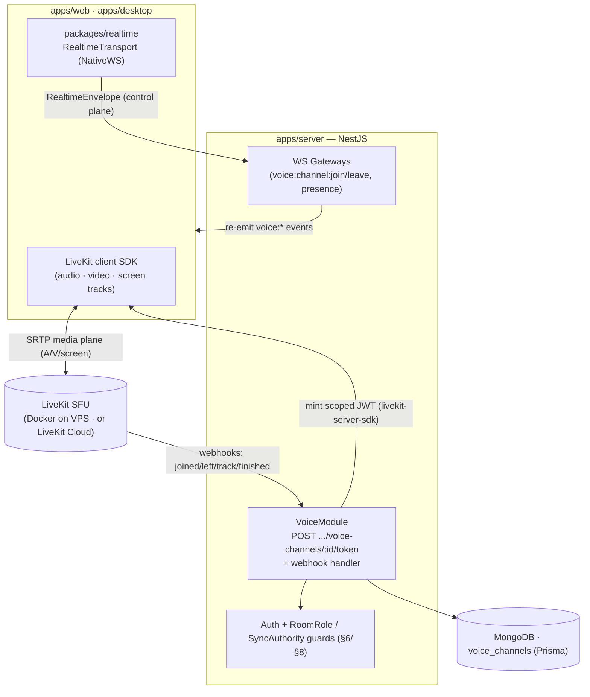

# ADR-005 — LiveKit for Voice / Video / Screen Share, Not Raw WebRTC, mediasoup, or Twilio/Agora

> Choose LiveKit as Cowatch's real-time audio/video/screen-share infrastructure (the `VoiceModule` backbone), explicitly rejecting a raw WebRTC mesh, self-hosted mediasoup, and managed CPaaS (Twilio/Agora), and explain how it slots in alongside the custom realtime abstraction.

**Status:** Accepted
**Date:** 2026-06-27
**Deciders:** Chief Architect, Voice Engineer, Realtime Engineer, DevOps Engineer
**Related ADRs:** [ADR-001 — Monorepo (Turborepo + pnpm)](./ADR-001-monorepo.md), [ADR-002 — NestJS Backend](./ADR-002-nestjs.md), [ADR-004 — Custom Realtime Abstraction](./ADR-004-realtime-abstraction.md), [ADR-008 — Auth / Token Model](./ADR-008-auth-tokens.md), [ADR-010 — Docker-First Delivery](./ADR-010-docker-first.md)
**Canon:** [Architecture Canon](../context/architecture.md) — see [§1 Glossary (VoiceChannel)](../context/architecture.md#1-glossary-of-core-domain-terms), [§2 Canonical Decisions](../context/architecture.md#2-canonical-architecture-decisions-one-line--adr-id), [§3 Naming Conventions](../context/architecture.md#3-naming-conventions), [§5 Realtime Transport](../context/architecture.md#5-realtime-transport-abstraction-adr-004), [§6 Permission Model](../context/architecture.md#6-permission-model), [§8 Auth/Token Model](../context/architecture.md#8-auth--token-model-adr-008), [§10 Cross-Cutting Non-Negotiables](../context/architecture.md#10-cross-cutting-non-negotiables)
**Last updated: 2026-06-27**

---

## Context / Problem

Cowatch is a Discord-like watch-party platform. Beyond synchronized YouTube playback, a `Room` owns one or more **`VoiceChannel`s** ([§1 Glossary](../context/architecture.md#1-glossary-of-core-domain-terms)): LiveKit-backed audio/video/screen-share channels with visibility `public` | `password`. The product spec (COMMUNICATION / VOICE) requires:

- **Multi-party voice** — many participants talking concurrently inside one channel, with several channels live per room.
- **Video channels** — camera tracks, toggleable per participant.
- **Screen sharing** — a participant shares a display/window as an additional track (used both for "watch my screen" and as a future media source).
- **Public and password-protected channels** — entry gated by the [§6 permission model](../context/architecture.md#6-permission-model) and channel visibility.
- **Production-grade media** — adaptive bitrate, congestion control, audio processing (echo cancellation, noise suppression), graceful degradation on poor networks, and the ability to scale to rooms far larger than a peer-to-peer mesh can sustain.

This is a **media-plane** concern (UDP/SRTP/WebRTC, jitter buffers, codecs, simulcast), architecturally distinct from Cowatch's **control/signaling plane** — the canonical `RealtimeEnvelope` over the custom [§5 realtime transport](../context/architecture.md#5-realtime-transport-abstraction-adr-004) that carries `playback:*`, `chat:*`, `room:*`, `presence:*`, and the `voice:channel:join` / `voice:channel:leave` events. The two planes must stay cleanly separated: the control plane is server-authoritative for the **clock** ([§7 Sync](../context/architecture.md#7-sync-algorithm)) and emits `voice:*` lifecycle events; the media plane moves actual audio/video bytes.

Key forces shaping the decision:

- **Scale topology.** A mesh's connection count grows O(n²) and uplink grows O(n); it collapses past ~4–6 active publishers. Cowatch rooms can be large, so a **Selective Forwarding Unit (SFU)** is mandatory: each client uploads once and the server forwards.
- **Self-host parity ([ADR-010](./ADR-010-docker-first.md)).** Everything runs in Docker across local / VPS / Vercel / production. The media server must be containerizable and runnable on our own VPS, not exclusively a third-party cloud.
- **Auth integration ([§8](../context/architecture.md#8-auth--token-model-adr-008)).** Channel entry must be minted by the NestJS `VoiceModule` as short-lived, scoped tokens derived from the user's session and room `Membership` role — never a static shared secret handed to clients.
- **Future transport reuse ([ADR-004](./ADR-004-realtime-abstraction.md)).** The canon names **`LiveKitDataChannelTransport`** as a planned adapter of `RealtimeTransport`. The media stack we pick should expose reliable data channels so it can *also* serve as a future realtime transport, not just A/V.
- **Build cost & focus.** Cowatch is built incrementally by specialized agent roles; WebRTC infra is a deep, error-prone domain (NAT traversal, TURN, simulcast, bandwidth estimation). We want a robust, well-trodden layer, not a research project.

The problem: **select the voice/video/screen-share media infrastructure** that gives us a scalable SFU, is self-hostable in Docker, mints per-channel scoped access tokens that compose with our auth and permission model, and offers data channels we can later adapt as a realtime transport — without locking us to a proprietary cloud or forcing us to build a media server from scratch.

---

## Options Considered

### Option A — LiveKit (open-source SFU + SDKs + server-minted JWT access tokens) — **chosen**

An open-source, WebRTC-based SFU written in Go, distributed as a Docker image, with first-class server SDKs (Node `livekit-server-sdk` for token minting and room/participant management via webhooks) and client SDKs for web/React and Electron. Rooms, participants, tracks (audio/video/screen), simulcast, adaptive streaming, selective subscription, and reliable/lossy **data channels** are built in. Self-hostable on our VPS or consumable as LiveKit Cloud, with the *same* SDKs and protocol either way.

- **Pros:**
  - **Purpose-built SFU** — scales to large rooms (each client publishes once; server forwards), with simulcast + adaptive bitrate + congestion control and selective subscription out of the box. Directly satisfies multi-party voice, video, and screen share.
  - **Self-hostable in Docker ([ADR-010](./ADR-010-docker-first.md))** — runs as a container on our VPS for full data-plane control and cost predictability, with an identical-API managed cloud as an escape hatch; no architecture change to migrate between them.
  - **Server-minted, scoped JWT access tokens** generated by the `VoiceModule` via `livekit-server-sdk`, encoding identity + room + grants (publish/subscribe, can-publish-data) with short TTLs — composes cleanly with [§8 auth](../context/architecture.md#8-auth--token-model-adr-008) and the [§6 permission matrix](../context/architecture.md#6-permission-model); password channels gate token issuance, never the client.
  - **Data channels enable the future `LiveKitDataChannelTransport`** named in [ADR-004](./ADR-004-realtime-abstraction.md) / [§5](../context/architecture.md#5-realtime-transport-abstraction-adr-004) — the same media session can later carry `RealtimeEnvelope` frames, a concrete strategic hedge no competitor offers as cleanly.
  - **Webhooks + server API** (participant joined/left, track published, room finished) let the `VoiceModule` mirror media-plane state into our control plane, emitting canonical `voice:channel:join` / `voice:channel:leave` events and updating `voice_channels` / presence.
  - **Strong React + Electron SDKs** (`@livekit/components-react`, hardware-accelerated rendering, PiP-friendly) align with [ADR-006](./ADR-006-electron.md) desktop needs and the web stack.
  - **No per-minute vendor billing** when self-hosted; predictable infra cost and no lock-in to a proprietary API surface.
- **Cons:**
  - **We operate media infrastructure** — TURN/STUN for NAT traversal, UDP port ranges, and SFU capacity become DevOps responsibilities (mitigated by the managed-cloud fallback).
  - **Media servers are CPU/bandwidth heavy**; horizontal scaling and region placement require planning at growth.
  - Smaller (though healthy and fast-moving) ecosystem than the largest CPaaS incumbents.

### Option B — Raw WebRTC peer-to-peer mesh

Browsers connect directly to each other via `RTCPeerConnection`; we build only the signaling (which the [§5 realtime transport](../context/architecture.md#5-realtime-transport-abstraction-adr-004) could carry) and run TURN for NAT fallback. No media server.

- **Pros:**
  - **No media server to run** for small calls; lowest server cost at tiny scale.
  - **Lowest latency** for 2–3 peers (direct paths, no forwarding hop).
  - Full control; no third-party SDK dependency.
- **Cons:**
  - **Does not scale** — connections grow O(n²) and each publisher's uplink grows O(n); a mesh degrades badly past ~4–6 active participants, which **fails the multi-party voice requirement** for Cowatch rooms.
  - **We would still build the hard parts ourselves**: simulcast, bandwidth estimation, audio processing, reconnection, screen-share track management, recording — i.e. re-implement an SFU eventually.
  - **TURN relay still required** and becomes the cost/scale bottleneck for symmetric-NAT clients anyway.
  - **No data-channel-as-transport story** unifiable with [ADR-004](./ADR-004-realtime-abstraction.md); each peer link is bespoke. High implementation risk for a non-core competency.

### Option C — Self-hosted mediasoup (low-level SFU library)

A powerful, low-level Node/C++ SFU **library** (not a turnkey server). We embed the worker/router/transport primitives and build our own signaling, room lifecycle, token/auth, scaling, and client integration on top.

- **Pros:**
  - **Excellent SFU performance and very granular control** over routers, transports, and codecs.
  - Fully self-hostable; no vendor; Node-native, fitting the backend language.
  - Battle-tested core used by many production systems.
- **Cons:**
  - **It is a library, not a product** — we must build room/participant lifecycle, access-token auth, signaling glue, reconnection, screen-share orchestration, webhooks, observability, and client SDK integration **ourselves**, duplicating most of what LiveKit ships.
  - **Significant ongoing engineering ownership** of a deep media domain — directly at odds with incremental, agent-driven delivery and the desire to keep media a robust dependency, not a research project.
  - **No batteries-included data-channel transport, React/Electron component SDKs, or managed-cloud escape hatch** — every integration point is bespoke.
  - Slower path to a production-grade voice MVP than LiveKit, for a marginal control gain we do not currently need.

### Option D — Managed CPaaS: Twilio Video / Agora

Fully managed, proprietary real-time A/V clouds with mature global SFU infrastructure and polished SDKs, billed per participant-minute.

- **Pros:**
  - **Zero media infrastructure to operate** — global edge, TURN, scaling, and reliability handled by the vendor.
  - Mature SDKs, strong docs, fast time-to-first-call.
  - Proven at very large scale.
- **Cons:**
  - **Proprietary and not self-hostable — violates the [ADR-010](./ADR-010-docker-first.md) Docker-first / self-host parity principle**; we cannot run it on our own VPS, and dev/prod parity in containers is impossible for the media plane.
  - **Per-minute billing** scales linearly and unpredictably with usage — punishing for an always-on watch-party product where users sit in voice for hours; poor unit economics versus a self-hosted SFU.
  - **Vendor lock-in** to a closed API and token model; no path to the [ADR-004](./ADR-004-realtime-abstraction.md) `LiveKitDataChannelTransport` reuse, and limited control-plane integration.
  - Twilio has signaled reduced investment in its Video product line, adding **roadmap/continuity risk**; Agora's free tier and data residency add commercial/compliance friction.

---

## Decision

**Adopt LiveKit as Cowatch's voice/video/screen-share media infrastructure,** self-hosted in Docker as the default deployment, fronted by the NestJS **`VoiceModule`** which owns token minting and control-plane mirroring. Concretely:

1. **LiveKit is the media plane** ([§2, ADR-005](../context/architecture.md#2-canonical-architecture-decisions-one-line--adr-id)). It runs as a **container** ([ADR-010](./ADR-010-docker-first.md)) on the VPS for local/VPS/production, with **LiveKit Cloud as a drop-in fallback** using the identical SDKs and protocol — switching is configuration, not redesign.
2. **The `VoiceModule` mints access tokens** ([§3](../context/architecture.md#3-naming-conventions), folder `apps/server/src/modules/voice/`). A client calls a REST endpoint, e.g. `POST /api/v1/rooms/:roomId/voice-channels/:channelId/token`; the module verifies the caller's [§8](../context/architecture.md#8-auth--token-model-adr-008) session + room `Membership` role + channel visibility (and password, if `password`), then issues a **short-lived LiveKit JWT** scoped to that channel with the correct publish/subscribe/data grants. **Clients never hold a long-lived or shared LiveKit secret**; the LiveKit API key/secret lives only in server env ([§10](../context/architecture.md#10-cross-cutting-non-negotiables)).
3. **Media plane and control plane stay separate.** LiveKit carries A/V/screen tracks. The canonical [§5 `RealtimeEnvelope`](../context/architecture.md#5-realtime-transport-abstraction-adr-004) carries `voice:channel:join` / `voice:channel:leave` and presence/activity. LiveKit **webhooks** (participant joined/left, track published, room finished) feed the `VoiceModule`, which reconciles the `voice_channels` collection and **re-emits the canonical `voice:*` events** so the rest of the system observes voice state through one consistent realtime vocabulary.
4. **Permissions derive from the [§6 matrix](../context/architecture.md#6-permission-model).** Grants encoded in the LiveKit token reflect role and channel state: a muted/timed-out membership receives a token without `canPublish` audio; password channels gate at token issuance; `Guest` access follows room config. The server is the single authority for what a participant may publish.
5. **Data channels are reserved for the future [`LiveKitDataChannelTransport`](../context/architecture.md#5-realtime-transport-abstraction-adr-004).** We do not route `playback:*` over LiveKit today (the [§7 server-authoritative clock](../context/architecture.md#7-sync-algorithm) stays on the native WS transport), but we keep the option open by ensuring tokens can grant `canPublishData` where appropriate.
6. **Synchronized playback is unaffected.** LiveKit handles *human* voice/video/screen; it is **not** the YouTube sync clock. Drift control, authority modes, and the `playback:sync` heartbeat remain entirely on the control plane per [§7](../context/architecture.md#7-sync-algorithm).

---

## Consequences → Pros

- **Scales past the mesh ceiling.** An SFU lets every client publish once and the server forward selectively (with simulcast/adaptive bitrate), so large multi-participant voice/video channels are feasible — the core requirement a raw mesh cannot meet.
- **Self-host parity preserved.** Running LiveKit in Docker on the VPS keeps full data-plane control, predictable cost, and dev/prod parity ([ADR-010](./ADR-010-docker-first.md)), while LiveKit Cloud remains an identical-API fallback — no lock-in either direction.
- **Auth & permissions compose cleanly.** Server-minted, short-lived, channel-scoped JWTs derived from [§8](../context/architecture.md#8-auth--token-model-adr-008) sessions and the [§6](../context/architecture.md#6-permission-model) role matrix mean media access is governed by the same authority as everything else; no shared client secret.
- **One consistent realtime vocabulary.** Webhook-driven reconciliation lets the `VoiceModule` re-emit canonical `voice:channel:join` / `voice:channel:leave` events, so voice state flows through the same [§5 envelope](../context/architecture.md#5-realtime-transport-abstraction-adr-004) the rest of the app already speaks.
- **Strategic transport hedge.** LiveKit's reliable data channels make the planned [`LiveKitDataChannelTransport`](../context/architecture.md#5-realtime-transport-abstraction-adr-004) a real future path — the media session can double as a realtime transport for serverless/edge topologies.
- **Build-vs-buy in our favor.** We get a production-grade SFU, TURN integration, screen-share track handling, reconnection, and React/Electron SDKs as a dependency, not as code we own — fitting incremental, agent-driven delivery.
- **Desktop alignment.** First-class React/Electron support with hardware-accelerated rendering and PiP suits [ADR-006](./ADR-006-electron.md) without a second integration effort.

## Consequences → Cons

- **We run media infrastructure.** Self-hosted LiveKit means owning TURN/STUN, UDP port ranges, SFU capacity, and region placement — real DevOps surface ([ADR-010](./ADR-010-docker-first.md)) absent from a pure CPaaS.
- **Resource-intensive.** Media forwarding is CPU- and bandwidth-heavy; capacity planning and horizontal scaling become first-order concerns at growth.
- **Two planes to reason about.** Media (LiveKit) and control (`RealtimeEnvelope`) are deliberately separate; keeping their state reconciled (via webhooks) adds a moving part versus a single subsystem.
- **SDK/version coupling.** LiveKit client/server SDK versions must stay compatible across web, desktop, and server; upgrades need coordination across the monorepo ([ADR-001](./ADR-001-monorepo.md)).
- **Ecosystem size.** Smaller community than the largest CPaaS incumbents, so some operational patterns are newer (mitigated by active upstream and the managed-cloud option).

---

## Risks & Mitigations

| Risk | Likelihood | Impact | Mitigation |
|---|---|---|---|
| NAT traversal failures (symmetric NAT) drop participants | Medium | High | Run a TURN server alongside LiveKit; verify relay candidates in CI/staging across network conditions; document the UDP/TCP fallback ports. |
| Self-hosted SFU saturates CPU/bandwidth under large rooms | Medium | High | Capacity-plan per node; enable simulcast + adaptive bitrate + selective subscription; add horizontal LiveKit nodes; keep **LiveKit Cloud** as an identical-API burst/fallback. |
| LiveKit access token leakage or over-broad grants | Low | High | Mint **short-TTL, channel-scoped** tokens in the `VoiceModule` only after [§6/§8](../context/architecture.md#6-permission-model) checks; never expose the API secret to clients ([§10](../context/architecture.md#10-cross-cutting-non-negotiables)); revoke via room/participant server API on mute/kick/ban. |
| Media-plane and control-plane state drift (ghost participants) | Medium | Medium | Treat LiveKit **webhooks** as the source of truth for media presence; reconcile `voice_channels` on every webhook; periodic background reconciliation re-emits canonical `voice:*` events. |
| DevOps complexity slows the Voice phase (Phase 8) | Medium | Medium | Ship a turnkey `docker/` LiveKit + TURN compose definition ([ADR-010](./ADR-010-docker-first.md)); start on LiveKit Cloud for the MVP if self-host hardening lags, switching later with no app-code change. |
| SDK breaking changes across web/desktop/server | Low | Medium | Pin LiveKit SDK versions in the pnpm workspace ([ADR-001](./ADR-001-monorepo.md)); upgrade behind the Turborepo CI gate with voice e2e tests green. |
| Confusing LiveKit with the YouTube sync clock | Low | Medium | Canon is explicit: LiveKit is **not** the playback authority; the [§7](../context/architecture.md#7-sync-algorithm) server clock and `playback:sync` stay on the native WS transport. Encode this in `VoiceModule` docs and tests. |

---

## Future Considerations

- **`LiveKitDataChannelTransport` ([ADR-004](./ADR-004-realtime-abstraction.md)).** Implement the named adapter so the existing LiveKit session can carry `RealtimeEnvelope` frames as an alternate transport — valuable for serverless/edge topologies where a separate WS server is undesirable.
- **Server-side recording / egress.** LiveKit Egress enables recording rooms or composing layouts (e.g. saving a watch-party session); evaluate for a future "session replay" feature with MinIO ([ADR-009](./ADR-009-minio.md)) as the sink.
- **LiveKit as a media ingest source.** Beyond YouTube, screen-share or RTMP/WebRTC ingest could let a host "broadcast" non-YouTube content into a room; the SFU already carries such tracks.
- **Managed-cloud migration toggle.** Keep the self-host ↔ LiveKit Cloud switch a single config flag so we can shift the media plane under load or for specific regions without touching application code.
- **Spatial / advanced audio.** Selective subscription and track metadata leave room for "proximity voice" or per-channel audio mixing experiences as the social product matures.
- **Adaptive scaling & region routing.** As usage grows, evaluate multi-node LiveKit with region-aware routing and autoscaling in the Docker/orchestration layer ([ADR-010](./ADR-010-docker-first.md)).

---

*Supersedes: none. Amended by: none. See the [Architecture Canon §2](../context/architecture.md#2-canonical-architecture-decisions-one-line--adr-id) for the canonical one-line statement of this decision, and [§1 Glossary — VoiceChannel](../context/architecture.md#1-glossary-of-core-domain-terms).*
