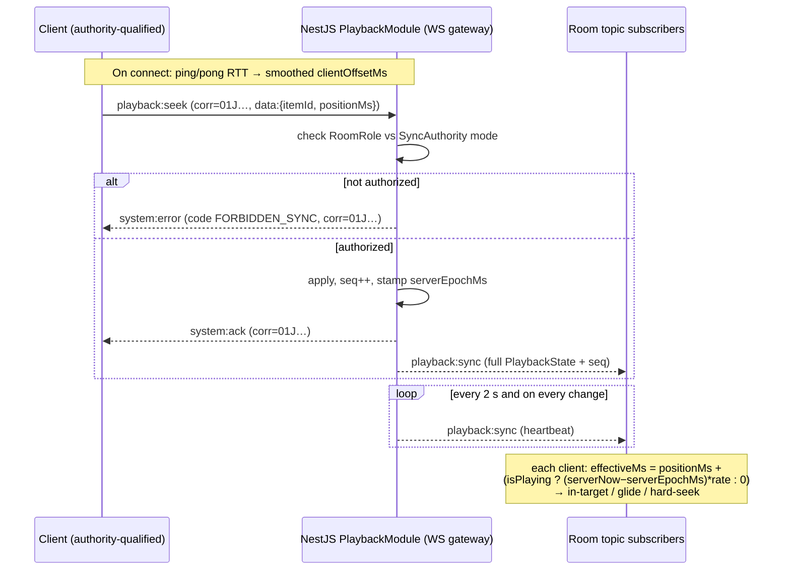
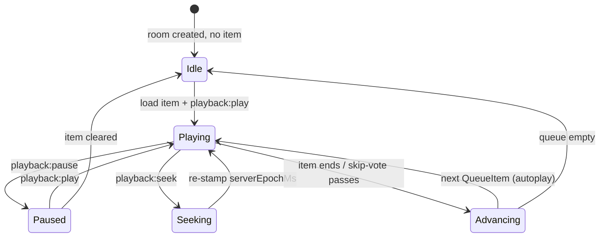

# ADR-007 — Server-authoritative playback synchronization (drift target < 500 ms)

> The Cowatch server holds the **single authoritative playback clock** for every room. Clients render an interpolated estimate of that clock, measure their own drift against a periodic server heartbeat, and self-correct via rate-glide or hard-seek — never trusting each other.

| | |
|---|---|
| **Status** | Accepted |
| **Date** | 2026-06-27 |
| **Deciders** | Chief Architect (owner), Realtime Engineer, Media Engineer, Backend Engineer |
| **Related ADRs** | [ADR-004 — Custom realtime abstraction](./ADR-004-realtime.md), [ADR-002 — NestJS backend](./ADR-002-nestjs.md), [ADR-005 — LiveKit voice/video](./ADR-005-livekit.md) |
| **Canon** | [Architecture Canon §7 Sync Algorithm](../context/architecture.md#7-sync-algorithm), [§5 Realtime Transport](../context/architecture.md#5-realtime-transport-abstraction-adr-004), [§6 Permission Model](../context/architecture.md#6-permission-model) |
| **Spec** | [SYNC.md](../docs/SYNC.md), [PERMISSIONS.md](../docs/PERMISSIONS.md) |
| **Supersedes** | — |
| **Last updated** | 2026-06-27 |

---

## Context / Problem

Cowatch's core promise is **watching media together, in sync**. The SPEC requires that play, pause, seek, rewind, fast-forward, playback speed, autoplay advance, and skip-vote outcomes all stay synchronized across every member of a room, with a **steady-state drift target under 500 ms** — close enough that a group reacts to the same on-screen moment together. Volume, subtitle/caption track, audio track, and video quality are explicitly **per-client local** and never synchronized. The first media provider is YouTube (via the IFrame Player API), so we control playback only through a constrained `play/pause/seekTo/setPlaybackRate/getCurrentTime` surface, not the raw media buffer.

The central design question is **who owns the canonical playback position and clock**, because that ownership dictates correctness, fairness, the permission model, and how we recover after a network blip. Three structurally different answers exist:

1. **Server-authoritative** — the backend holds `PlaybackState` and is the only writer of truth; clients converge to it.
2. **Peer-leader** — one client (e.g. the room owner's browser) is the timekeeper; others follow the leader's reported position.
3. **Fully client-driven** — every client broadcasts its own actions and applies others' actions optimistically, with no single clock.

This choice is **foundational and expensive to reverse**: it determines the shape of the `playback:*` realtime events, where authority is enforced (canon §6 `SyncAuthority` modes: `owner_only` / `owner_moderators` / `everyone`), how late joiners and reconnecting clients catch up, and how drift is measured and corrected. It must compose with the **custom realtime transport** (ADR-004, canon §5) whose envelope already reserves `playback:*` as server-stamped, and with the **server-authoritative mandate already recorded in the canon** (ADR-007, §7). This ADR exists to *justify and detail* that mandate against the alternatives, and to specify the clock/heartbeat/drift-correction mechanics precisely enough to implement and test against a measurable 90%-coverage bar (R5).

Constraints that shape the decision:

- **Untrusted, heterogeneous clients.** Web (Vite/React) and Electron, on varied networks and machine clocks. We cannot trust any client's wall clock or self-reported position.
- **Permission/authority is per-room and server-enforced.** Only members whose effective role satisfies the room's `SyncAuthority` mode may mutate playback (canon §6); a client-owned clock cannot enforce this.
- **Constrained provider control surface.** YouTube IFrame exposes coarse controls and a slightly laggy `getCurrentTime()`; correction must tolerate provider jitter.
- **Resilience to churn.** Owners disconnect (triggering ownership transfer, canon §6), clients reconnect with a resume handshake (canon §5); the clock must survive both without the room "stopping."

---

## Options Considered

### Option A — Server-authoritative clock *(chosen)*

The NestJS `PlaybackModule` WS gateway holds the authoritative `PlaybackState { itemId, positionMs, isPlaying, rate, serverEpochMs }` per room. Authority-qualified clients **request** mutations (`playback:play|pause|seek|rate`); the server validates against the room's `SyncAuthority` mode, applies the change, **re-stamps `serverEpochMs`**, and broadcasts. A `playback:sync` heartbeat carries the full state every 2 s and immediately on any change. Clients interpolate the server clock and self-correct.

- **Pros:** Single, trustworthy source of truth — deterministic and reproducible; authority/permission enforcement lives exactly where the canon puts it (server, §6); survives any client disconnecting (including the owner) because the clock is server-side; late joiners and reconnects get an immediate authoritative snapshot; fair (no client privileged by its local hardware/network); aligns 1:1 with canon §7 and the ADR-004 envelope (`playback:*` server-stamped).
- **Cons:** The server must run a lightweight per-room timekeeper and broadcast heartbeats (CPU + fan-out cost, mitigated by the 2 s cadence and event multiplexing); a small command round-trip latency on user actions (request → validate → broadcast); requires a robust client↔server clock-offset estimate (ping/pong RTT) to interpret `serverEpochMs` correctly.

### Option B — Peer-leader sync

One client — typically the room owner's session — is elected timekeeper and periodically reports its current position; followers seek/glide to the leader. The server only relays and handles leader re-election.

- **Pros:** Minimal server compute (server is a dumb relay); "natural" feeling because the leader is a real participant actually watching; low implementation cost for the happy path.
- **Cons:** The clock is only as good as the **leader's clock, network, and buffering** — a leader on a bad connection desyncs the whole room; **leader churn is constant** (owners disconnect → re-election storms; canon §6 ownership transfer would have to drive clock re-election too); **authority enforcement is awkward** — `SyncAuthority: everyone` has no single peer to lead, and the server still must referee who may control playback, so we'd need a server arbiter anyway; trust problem — a malicious/buggy leader can yank everyone's position; resume/late-join must round-trip to a possibly-offline leader. Fails the canon's server-authority mandate (§7).

### Option C — Fully client-driven (optimistic broadcast, no central clock)

Each client broadcasts its own `play/pause/seek` actions; every client applies incoming actions optimistically against its **own** local player position. No authoritative `PlaybackState` exists; "sync" is emergent from everyone applying the same event stream.

- **Pros:** Lowest server involvement and lowest action latency (no validation round-trip); simplest server; actions feel instant locally.
- **Cons:** **No source of truth → unbounded drift** — there is nothing to correct *toward*, so clock skew, variable buffering, and dropped/reordered events accumulate with no convergence guarantee; **no late-joiner or reconnect story** — a new client has no authoritative position to adopt; **conflicting concurrent actions** (two users seek at once) have no deterministic resolution; **authority/permission cannot be enforced** (any client can emit any action); event loss directly = desync. Cannot meet the < 500 ms target except by accident. Disqualified on correctness.

> The axis is **where the clock lives**. A puts it on the trusted server (correctness + enforceable authority, at modest server cost). B delegates it to an untrusted, churning peer (cheap server, fragile clock). C has no clock at all (cheapest, but no convergence and no authority). Only A satisfies the canon's server-authority mandate, the per-room `SyncAuthority` permission model, and the resilience requirements.

---

## Decision

**Adopt the server-authoritative playback clock (Option A)**, as already mandated by canon §7 (ADR-007) and detailed here. The NestJS `PlaybackModule` is the sole writer of each room's `PlaybackState`; clients are interpolating, self-correcting followers.

### Authoritative state & ownership

The server holds, per room, the canonical record:

```ts
// packages/types — canonical, consumed by server + web + desktop (canon §3)
export interface PlaybackState {
  itemId: string;        // current QueueItem id (the media being played)
  positionMs: number;    // authoritative position at serverEpochMs
  isPlaying: boolean;
  rate: number;          // playback speed multiplier, e.g. 1.0, 1.25, 2.0
  serverEpochMs: number; // server wall-clock (epoch ms) when this state was stamped
}

// The 2 s heartbeat / on-change broadcast payload (event "playback:sync").
export interface PlaybackSyncEvent extends PlaybackState {
  authority: 'owner_only' | 'owner_moderators' | 'everyone'; // current SyncAuthority mode
  seq: number;           // monotonically increasing per-room state version
}

// Client → server mutation requests (ack-correlated via envelope.corr, canon §5).
export interface PlaybackControlPayload {
  itemId: string;
  positionMs?: number;   // required for "playback:seek"
  rate?: number;         // required for "playback:rate"
}
```

The state is server-resident (in-memory authoritative timekeeper per active room, periodically persisted to the `rooms`/`playback` projection for recovery; canon §4). `serverEpochMs` is **always** stamped by the server — never accepted from a client.

### Authority enforcement (canon §6)

Mutating `playback:*` events (`playback:play`, `playback:pause`, `playback:seek`, `playback:rate`) are **requests**, not commands. On receipt the gateway:

1. Resolves the sender's effective `RoomRole` and the room's `SyncAuthority` mode.
2. If the role does **not** satisfy the mode (`owner_only` → Owner; `owner_moderators` → Owner/Moderator; `everyone` → any non-Guest member), it rejects with `system:error` code **`FORBIDDEN_SYNC`** (canon §6, §10 error vocabulary), correlated via `corr`.
3. Otherwise it applies the change, increments `seq`, re-stamps `serverEpochMs`, and broadcasts a fresh `playback:sync` to the room topic.

This makes authority **unforgeable** — exactly why Options B/C fail. Skip-vote outcomes and autoplay advance are server-decided state transitions that flow through the same `playback:sync` path.

### Clock model — measuring the client↔server offset

Because each client's wall clock differs from the server's, a client cannot interpret `serverEpochMs` directly. On connect (and periodically, e.g. every 30 s and after any reconnect) the client runs a **ping/pong RTT exchange** to estimate the offset:

```text
clientOffsetMs ≈ serverTime − (clientSendTime + RTT/2)
serverNow(localNow) = localNow + clientOffsetMs        // client's estimate of server epoch
```

We keep a smoothed offset (median/EWMA of several samples, discarding high-RTT outliers) to resist jitter. All position math below uses `serverNow(...)`, **not** the raw local clock.

### Effective position (interpolation)

At any client instant `localNow`, the target position is computed from the last `playback:sync`:

```text
effectiveMs = positionMs + (isPlaying ? (serverNow(localNow) − serverEpochMs) * rate : 0)
```

i.e. a paused clock is frozen; a playing clock advances at `rate` from the stamped origin. This is the canon §7 formula, with the clock-offset correction applied.

### Heartbeat

The server emits `playback:sync` **every 2 s** per active room, and **immediately** on any state change (play/pause/seek/rate/item-advance/skip-vote outcome). Late joiners and clients completing the canon §5 **resume handshake** receive an immediate `playback:sync` snapshot (plus a room snapshot) so they converge instantly rather than waiting up to 2 s.

### Drift correction (client-side, three-band, per canon §7)

Each tick, the client compares its actual player position (`getCurrentTime()` for YouTube) against `effectiveMs` to compute `drift = playerMs − effectiveMs`:

| Band | Condition | Action |
|---|---|---|
| **In-target** | `|drift| < 500 ms` | No action — within the steady-state target. |
| **Glide** | `500 ms ≤ |drift| < 2 s` | Nudge `playbackRate` by **±5–10 %** (faster if behind, slower if ahead) for a short window to smoothly converge, then restore `rate`. Avoids jarring jumps. |
| **Hard seek** | `|drift| ≥ 2 s` | `seek` directly to `effectiveMs` (and re-apply `isPlaying`/`rate`). Used for large gaps (tab throttle, buffering stall, fresh join). |

The glide band keeps small corrections imperceptible; hard-seek guarantees bounded re-convergence after big disruptions. Targeted **steady-state drift across clients is < 500 ms** (canon §7).

### Synced vs not-synced (canon §7, binding)

- **Synced (server-authoritative):** play, pause, seek, rewind, fast-forward, playback speed (`rate`), current item / autoplay advance, skip-vote outcomes.
- **NOT synced (per-client local, never in `PlaybackState`):** volume, subtitle/caption selection, audio track, video quality/resolution, picture-in-picture.

### Sequence (control + heartbeat)



### State machine (per-room playback)



Every transition re-stamps `serverEpochMs`, increments `seq`, and emits `playback:sync`.

---

## Consequences → Pros

- **Deterministic single source of truth.** One server-owned clock means there is always a well-defined target to converge to; "synced" is provable and testable, not emergent. Directly satisfies canon §7 / ADR-007.
- **Enforceable, unforgeable authority.** Per-room `SyncAuthority` (`owner_only` / `owner_moderators` / `everyone`) is checked server-side; unauthorized mutations are rejected with `FORBIDDEN_SYNC`. Impossible to express cleanly in peer-leader/client-driven designs.
- **Resilient to client churn — including the owner.** The clock is server-side, so an owner disconnecting (and triggering ownership transfer, canon §6) does **not** stop or reset playback. No leader-election storms.
- **Trivial late-join & reconnect.** A joining or resuming client adopts the authoritative `playback:sync` snapshot immediately (canon §5 resume handshake) and converges via the same drift bands — no special-casing.
- **Fair across heterogeneous hardware/networks.** No client is privileged as timekeeper; a user on a poor connection corrects toward the server rather than dragging everyone.
- **Clean fit with the realtime abstraction (ADR-004).** `playback:*` events and the server-stamped envelope already exist in canon §5; this decision needs no new transport concepts and is transport-agnostic (works on `NativeWsTransport` today, future adapters later).
- **Smooth UX via three-band correction.** Sub-500 ms gaps are ignored, mid-range gaps glide imperceptibly, large gaps hard-seek — balancing tightness against jarring jumps.

---

## Consequences → Cons

- **Server does real work per active room.** A per-room timekeeper + 2 s heartbeat fan-out consumes CPU and bandwidth that a dumb relay (Option B) or client-driven mesh (Option C) would not. Mitigated by the modest cadence, event multiplexing over one WS (canon §5), and on-change coalescing.
- **Action latency floor.** User controls round-trip through the server (request → validate → broadcast), adding one network hop of perceived latency versus optimistic local application. We mask this with optimistic local UI that reconciles to the next `playback:sync`.
- **Clock-offset estimation is essential and imperfect.** The whole model depends on a good `clientOffsetMs`; bad RTT samples or asymmetric routes degrade accuracy. Requires smoothing, outlier rejection, and periodic re-measurement.
- **Provider control surface limits precision.** YouTube IFrame `getCurrentTime()` is slightly laggy and `seekTo` quantizes; absolute precision below provider granularity is unattainable — the 500 ms target is set with this in mind.
- **More moving parts to implement and test.** RTT exchange, smoothing, three-band correction, authority checks, heartbeat scheduling, and resume snapshots are all server+client code that must hit the 90 % coverage bar (R5).

---

## Risks & Mitigations

| # | Risk | Likelihood | Impact | Mitigation |
|---|---|:--:|:--:|---|
| R1 | **Inaccurate client↔server clock offset** (bad RTT samples, asymmetric latency, NAT) → systematic drift. | Med | High | Multi-sample ping/pong with median/EWMA smoothing; discard high-RTT/outlier samples; re-measure on connect, periodically (~30 s), and after every reconnect; never use raw local wall clock for position math. |
| R2 | **Provider jitter / lag** — YouTube `getCurrentTime()` lag and `seekTo` quantization make small corrections noisy and overshoot. | High | Med | 500 ms in-target dead-band absorbs provider noise; glide band uses bounded ±5–10 % rate nudges over a short window (no oscillation); hysteresis so we don't flip bands every tick. |
| R3 | **Heartbeat fan-out cost** at scale (many rooms × many members). | Med | Med | 2 s cadence (not per-frame); coalesce on-change emits; multiplex over the single room-topic WS (canon §5); per-room timekeeper sleeps when `isPlaying=false` and no members; offload fan-out to the transport layer (ADR-004) so future adapters can scale it. |
| R4 | **Background-tab / throttled timers** — browsers throttle `setInterval` in hidden tabs, so a backgrounded client free-runs and drifts seconds. | High | Med | On tab `visibilitychange`→visible, force an immediate re-sync (request fresh `playback:sync`) and let the hard-seek band snap to target; rely on the next heartbeat regardless; document PiP/Electron as the "keep watching in background" path. |
| R5 | **Authority bypass / spoofed control** — a client forges `playback:*` or a stale role. | Low | High | Server is sole authority: re-resolve `RoomRole` × `SyncAuthority` on **every** mutation, reject with `FORBIDDEN_SYNC`; never trust client-supplied `serverEpochMs`/role; rate-limit control events per canon §10. |
| R6 | **Event loss / reordering** during transient network issues → client applies stale state. | Med | Med | Monotonic `seq` per room: clients ignore any `playback:sync` with `seq` ≤ last applied; the 2 s heartbeat is self-healing (next tick re-establishes truth); canon §5 resume handshake replays by `lastEnvelopeId` or falls back to a fresh snapshot. |
| R7 | **Thundering re-sync on owner disconnect / ownership transfer** (canon §6) restarting the clock. | Low | Med | Clock is server-resident and independent of any member; ownership transfer only re-derives *who may control*, never the `PlaybackState`; transfer emits `playback:sync` once to refresh authority, not to reset position. |
| R8 | **Server restart / failover loses in-memory timekeeper.** | Low | High | Periodically persist `PlaybackState` to the room projection (canon §4); on restart, rehydrate `positionMs`/`isPlaying`/`rate` and re-stamp `serverEpochMs`; clients hard-seek to the recovered snapshot. Supports the R2 recoverability mandate. |

---

## Future Considerations

- **Alternate providers beyond YouTube.** When direct/HTML5 `<video>` or other providers land (Media Engineer), the authority model is unchanged — only the client adapter's `getCurrentTime()/seek()/setRate()` surface differs. Keep the player-control behind a `MediaPlayerAdapter` interface so the sync engine stays provider-agnostic.
- **LiveKit data-channel transport for sync (ADR-005, ADR-004).** Once LiveKit is in a room for voice/video, its low-latency data channel could carry `playback:*` envelopes (the `LiveKitDataChannelTransport` adapter), potentially tightening drift below the WS path. Server remains authoritative; only the transport changes. Evaluate and, if adopted as architecture, record a follow-up ADR (R3).
- **Adaptive heartbeat cadence.** Consider dynamically tightening the heartbeat (e.g. 1 s) right after a control action or during high-churn moments, and relaxing it (e.g. 3–5 s) during steady playback, to trade bandwidth for tightness only when it matters.
- **Predictive seek compensation.** For hard-seeks, pre-compensate by the measured seek latency + half-RTT so the player lands *on* `effectiveMs` rather than behind it; gather telemetry to tune per provider.
- **Drift telemetry & SLOs.** Emit per-client drift metrics (Prometheus, canon §10) to verify the < 500 ms steady-state SLO in production and to alert on regressions; feed into QA's acceptance tests (R5).
- **Server-side timekeeper sharding.** If active-room count outgrows one server, partition per-room timekeepers across instances (sticky by `roomId`) behind the transport layer — an ops/scaling decision that does not change the client contract.

---

*Conforms to [Architecture Canon](../context/architecture.md). Any change to this decision requires a superseding ADR + `history/` entry + context update + repomix update (R3/R4).*
