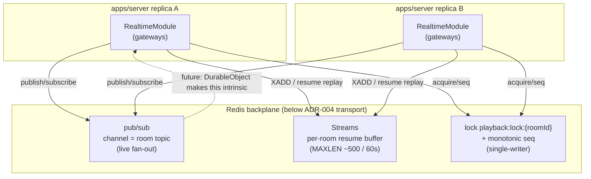

# ADR-011: Realtime Backplane — Redis pub/sub + Streams

> One-line purpose: Elevate the multi-instance realtime fan-out dependency from an unstated "implementation detail of ADR-004" to a first-class architecture decision — **Redis pub/sub for live cross-replica fan-out, Redis Streams for the per-room resume buffer, and a Redis per-room authority lock for single-writer `playback:*`** — sitting *below* the transport abstraction so future serverless adapters (Durable Objects) can replace it without touching feature code.

- **Status:** Accepted
- **Owner agent:** Realtime Engineer
- **Date:** 2026-06-27
- **Deciders:** Realtime Engineer, Chief Architect, Backend Engineer, DevOps Engineer
- **Related ADRs:** [ADR-002 (NestJS backend)](./ADR-002-nestjs.md), [ADR-004 (Realtime abstraction)](./ADR-004-realtime.md), [ADR-007 (Server-authoritative sync)](./ADR-007-sync.md), [ADR-008 (Auth / tokens)](./ADR-008-auth.md), [ADR-010 (Docker-first delivery)](./ADR-010-docker-first.md)
- **Canon:** [Architecture Canon](../context/architecture.md) — primarily [§5 Realtime Transport Abstraction](../context/architecture.md) and [§7 Sync Algorithm](../context/architecture.md); see also the decision ledger row **D-011**.
- **Last updated: 2026-06-27**

---

## 1. Context / Problem

[ADR-004](./ADR-004-realtime.md) defines a transport-agnostic realtime layer (`packages/realtime`): one envelope, one `RealtimeTransport` interface, and `NativeWsTransport` as the default VPS adapter. That ADR deliberately scoped itself to the **client↔server boundary** and left a load-bearing question to "implementation detail": once `apps/server` runs as **more than one replica** (the explicit Docker-first / VPS posture of [ADR-010](./ADR-010-docker-first.md)), a WebSocket connection for room R may be held on replica A while the mutating `playback:*` event for room R arrives on replica B. Three concerns then have no home:

1. **Cross-replica fan-out.** A broadcast produced on any replica must reach every subscriber of that `room` topic regardless of which replica holds their socket. `NativeWsTransport`'s in-process broadcast only covers connections on the same node.
2. **Resume buffer durability.** ADR-004 promises resume-by-`lastEnvelopeId` (replay missed frames on reconnect). An in-process ring buffer is lost when a replica restarts or when the client reconnects to a *different* replica — exactly when resume matters most.
3. **Single-writer authority for `playback:*`.** [ADR-007](./ADR-007-sync.md) makes the server the authoritative clock. With N replicas, two near-simultaneous authorized `playback:seek` events for the same room must be serialized to one monotonic `seq` so clients don't oscillate. ADR-004 says "the server is authoritative" but not *which replica* writes.

Reviewers flagged this directly: both `docs/ARCHITECTURE.md` (§Open Questions OQ-1) and `docs/REALTIME.md` (§12) call for promoting the backplane to its own decision, and `docs/DEPLOYMENT.md` (OQ-1) asks for the canonical multi-instance mechanism. Leaving it implicit risks each module inventing its own fan-out, and makes the serverless-migration story (a core ADR-004 goal) untestable because there is no named seam to replace.

**The problem to decide:** what shared infrastructure carries cross-replica realtime state — fan-out, resume buffer, and per-room write serialization — such that (a) it satisfies the sub-500 ms drift target ([ADR-007](./ADR-007-sync.md)) under the 2 s `playback:sync` heartbeat fan-out, (b) it is self-hostable and Docker-first ([ADR-010](./ADR-010-docker-first.md)), (c) it sits **below** the `RealtimeTransport` interface so it is invisible to feature code, and (d) a future `DurableObjectTransport` can drop it entirely without a feature rewrite?

---

## 2. Options Considered

### Option A — Sticky room→replica affinity only (no shared bus)
Pin every connection for a room to one replica (consistent-hash `roomId` at the load balancer); that replica owns the room's fan-out, buffer, and authority in-process.

- **Pros:** No new infrastructure; in-process broadcast is the lowest-latency path; single-writer is automatic (one owner).
- **Cons:** **Fragile under the operations we expect** — replica loss, rolling deploys ([ADR-010](./ADR-010-docker-first.md)), and autoscaling all force room migration, dropping the in-process buffer mid-session; the LB must understand room topology (hard with a single multiplexed socket carrying many rooms — ADR-004 §117); reintroduces exactly the stateful stickiness ADR-004 tried to avoid. Rejected as the primary mechanism.

### Option B — Redis pub/sub + Redis Streams + per-room lock (CHOSEN)
A shared Redis: **pub/sub** channels keyed by `room` topic for live fan-out; **Streams** (`XADD` with `MAXLEN ~`) as the durable per-room resume buffer; a short-TTL **lock key** (`playback:lock:{roomId}`) + a monotonic per-room `seq` for single-writer serialization.

- **Pros:** Battle-tested, low-latency, self-hostable in Docker ([ADR-010](./ADR-010-docker-first.md)); one dependency solves all three concerns; Streams give bounded replay (`60 s / 500 envelopes`, per the resume-buffer ruling) with `lastEnvelopeId` semantics; locks give clean single-writer without LB stickiness; already implied by ADR-004's "shared pub/sub backplane (e.g. Redis/NATS)" risk mitigation.
- **Cons:** A new operational dependency (HA/persistence/failover to run); Redis is a shared point of failure for realtime if not replicated; we own the fan-out/buffer/lock code.

### Option C — Dedicated broker: NATS (JetStream) or Kafka
A purpose-built messaging system: NATS subjects for fan-out, JetStream/Kafka topics for the durable log.

- **Pros:** Stronger delivery/ordering guarantees and horizontal throughput than Redis; JetStream replay maps cleanly to resume.
- **Cons:** Heavier to operate than a Redis we already want for the session denylist ([ADR-008](./ADR-008-auth.md) / AUTH OQ-1) and rate limits; over-engineered for launch scale; more moving parts against the "lowest ops cost VPS" posture. Reserved as a future swap if throughput demands it.

### Option D — MongoDB change streams as the primary bus
Reuse the existing MongoDB ([ADR-003]) — tail change streams to fan out events; no new dependency.

- **Pros:** Zero new infrastructure; naturally durable; useful as a **secondary** reconciliation signal (authoritative state already lives in Mongo).
- **Cons:** Change-stream latency and the write-then-tail round-trip are wrong for a 2 s high-frequency `playback:sync` heartbeat; couples ephemeral realtime fan-out to the system-of-record write path; not a pub/sub primitive. Kept as a **secondary** reconciliation signal only, not the live bus.

### Option E — Cloudflare Durable Objects now
Adopt a DO-per-room model immediately (one object owns a room's connections, buffer, and authority).

- **Pros:** Elegant — single-writer and fan-out are intrinsic; no separate bus; this is the long-term serverless answer.
- **Cons:** Not the **current** target ([ADR-010] ships VPS first); would force a serverless commitment before the platform is ready. Correct future direction, premature now — and ADR-004's abstraction means we can adopt it later as just another transport adapter.

---

## 3. Decision

**Adopt Option B: Redis is the realtime backplane**, sitting **below** the `RealtimeTransport` boundary ([ADR-004](./ADR-004-realtime.md)) and invisible to feature code. Concretely:

- **Live fan-out via Redis pub/sub.** Each replica publishes outbound envelopes to a channel keyed by `room` topic and subscribes to the topics for the rooms it holds connections for. The `RealtimeModule` owns the publisher/subscriber; per-context gateways (`PlaybackModule`, `ChatModule`, `PresenceModule`, …) never touch Redis directly.
- **Durable resume buffer via Redis Streams.** Every broadcast is also appended (`XADD`) to a per-room stream trimmed to **`MAXLEN ~ 500` and a 60 s retention window** (the resume-buffer bound, exposed as `RealtimeModule` config constants `resumeWindowMs` / `maxResumeFrames`, advertised in `system:hello`). Reconnect resume replays from the client's `lastEnvelopeId`; on buffer miss the client deterministically requests a fresh `playback:sync` + room snapshot ([ADR-004](./ADR-004-realtime.md) §114).
- **Single-writer `playback:*` via a per-room authority lock.** An authorized mutating playback intent acquires `playback:lock:{roomId}` (short TTL), applies the change, increments the monotonic per-room `seq`, re-stamps `serverEpochMs` ([ADR-007](./ADR-007-sync.md)), and broadcasts. This serializes concurrent authorized writers across replicas **without** room→replica stickiness.
- **MongoDB change streams are a secondary reconciliation signal only** — used to heal divergence against the system-of-record, never as the live heartbeat bus.
- **The backplane is a replaceable seam.** It is selected/configured alongside `REALTIME_TRANSPORT`; a future `DurableObjectTransport` provides fan-out + buffer + single-writer intrinsically and therefore runs **with no Redis backplane**, with zero change to feature code or the envelope contract. This decision does **not** alter the canon-frozen `RealtimeEnvelope`/`RealtimeTransport`.

This is **canon-binding**: no module may implement its own cross-replica fan-out or resume store outside `RealtimeModule`'s backplane without a superseding ADR.

---

## 4. Consequences → Pros

- **Correct multi-instance fan-out** ([ADR-010](./ADR-010-docker-first.md)): a broadcast on any replica reaches every subscriber of the `room` topic, surviving rolling deploys and autoscaling.
- **Durable, replica-independent resume** — the Stream buffer outlives any single replica, so reconnecting to a *different* node still replays correctly, fulfilling ADR-004's resume promise.
- **Clean single-writer authority** for `playback:*` across replicas without reintroducing room→replica stickiness, protecting the sub-500 ms drift target ([ADR-007](./ADR-007-sync.md)).
- **One dependency, reused** — the same Redis backs the session denylist ([ADR-008](./ADR-008-auth.md) / AUTH OQ-1) and API rate limits; no NATS/Kafka to operate at launch.
- **The serverless seam is now explicit and testable** — "remove Redis, the Durable Object provides these three primitives" is a concrete, named migration, not a vague aspiration.

## 5. Consequences → Cons

- **New operational surface:** Redis must be deployed HA (replication + failover/persistence) or it is a single point of realtime failure; this is DevOps work the sticky-only Option A avoided.
- **We own backplane code:** publisher/subscriber lifecycle, Stream trimming, lock acquisition/renewal, and seq monotonicity are ours to write and harden.
- **At-least-once + ordering nuances:** pub/sub is fire-and-forget and Streams are the durability path; reconciling the two (dedupe by envelope `id`, order by `seq`) is required so a replica restart doesn't drop or double-deliver.
- **A second hop** (publish→Redis→subscribe) adds small latency vs. in-process broadcast; must stay within the drift budget under heartbeat fan-out load.

---

## 6. Risks & Mitigations

| Risk | Likelihood | Impact | Mitigation |
|---|---|---|---|
| **Redis outage = realtime outage.** | Low | High | Run Redis replicated with failover (or managed) in VPS/prod; the transport degrades to a typed `system:error` + reconnect, never silent corruption; Mongo remains the system-of-record so state heals on recovery. |
| **Lock contention / stale lock holder** serializing `playback:*` stalls a room. | Low | Medium | Short lock TTL with renewal; lock acquisition is only on the (rare) mutating intent, not the 2 s heartbeat; fall back to last-writer-by-`seq` if the lock service is unavailable. |
| **Stream buffer miss** (client gap > 60 s / 500 frames). | Medium | Medium | Deterministic fresh `playback:sync` + snapshot on miss ([ADR-004](./ADR-004-realtime.md)); tune `resumeWindowMs`/`maxResumeFrames` from reconnect-gap telemetry in Phase 11. |
| **Heartbeat fan-out cost** (2 s × members × rooms through Redis) regresses drift. | Medium | High | Load-test the fan-out at the Phase 11 target (50 participants/room); coalesce/throttle low-value events; the seq+lock keeps `playback:*` cheap; promote to NATS/Kafka (Option C) only if telemetry demands. |
| **Backplane assumptions leak** into features, breaking the DO migration. | Medium | High | All Redis access is inside `RealtimeModule`; lint/dependency rule forbids Redis imports in feature modules; the ADR-004 conformance suite runs against a backplane-less mock to surface leaks. |

---

## 7. Future Considerations

- **`DurableObjectTransport` (Cloudflare):** one DO per room provides fan-out, the resume buffer, and single-writer intrinsically — adopting it **removes the Redis backplane** for that environment with no feature change. This is the canonical serverless endgame named in `docs/DEPLOYMENT.md` OQ-1.
- **NATS JetStream / Kafka swap:** if throughput or multi-region fan-out outgrows Redis, the same publish/subscribe + durable-log seam can be re-backed by a broker (Option C) behind `RealtimeModule`.
- **Redis Cluster / sharding by `roomId`** for horizontal backplane scale once a single Redis node's pub/sub fan-out becomes the bottleneck.
- **Per-`type` delivery tiers:** best-effort for `presence:update`/`chat:typing` vs. at-least-once-with-resume for `playback:*`/`notification:new`, optimized at the backplane without features knowing.
- **Cross-region replication** of the Streams buffer when a multi-region deployment is pursued ([ADR-010](./ADR-010-docker-first.md)).

---

_This ADR complies with and is governed by the [Cowatch Architecture Canon](../context/architecture.md). It refines, and is subordinate to, [ADR-004](./ADR-004-realtime.md) (the transport abstraction). Any change to this decision requires a superseding ADR plus a history entry, context update, and repomix update (R3/R4)._
