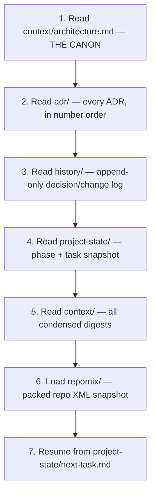

# RESTORE_CONTEXT — Cowatch Recovery Procedure

> One-line purpose: The **exact, ordered procedure** to reconstruct full working context after an AI context-window reset — the operational backbone of process rule **R2** (the project must be fully recoverable at any point).

**Status:** Canonical recovery procedure (Planning — Phase 0)
**Owner agent:** Documentation Engineer
**Last updated: 2026-06-27**

> Satisfies **R2**: *the project must be fully recoverable at any point despite AI context-window exhaustion.* Any agent — human or AI — resuming Cowatch with **zero prior memory** MUST follow this procedure top-to-bottom before touching any artifact. Do not skip steps; do not reorder.

---

## When to run this

- A fresh agent/session is starting work on Cowatch.
- An agent's context window was exhausted/reset mid-task.
- Onboarding a new contributor.
- Verifying recoverability as part of a process audit.

## The procedure (run in this exact order)

### Step 1 — Read the canon: `context/architecture.md`

Read [`./architecture.md`](./architecture.md) **first and in full**. It is the **single source of truth**. Every downstream artifact complies with it; on any conflict, the canon wins. Internalize: the glossary, the ten ADR decisions, naming conventions, data-modeling rules, the realtime envelope/interface, the permission model, the sync algorithm, the auth/token model, the path map, and the cross-cutting non-negotiables.

### Step 2 — Read every ADR: `adr/`

Read [`../adr/`](../adr/) in ascending number order (`ADR-001` → `ADR-NNN`). Each ADR is one architectural decision with rationale, alternatives, and consequences. ADRs are **immutable once accepted**; a reversal is a *new* ADR that supersedes the old one. This is **why** the architecture is the way it is — required before changing anything (R3/R4).

### Step 3 — Read the history log: `history/`

Read [`../history/`](../history/) — the **append-only** decision/change log. It is the chronological narrative: what changed, when, why, by which agent, and which ADR/spec it traces to. Read newest-relevant entries to understand recent direction and avoid re-litigating settled decisions.

### Step 4 — Read the project state: `project-state/`

Read [`../project-state/`](../project-state/) — the recoverable phase/progress snapshot. Establish **where the project is right now**:

- [`current-phase.md`](../project-state/current-phase.md) — active phase (`0 Architecture` → … → `12 Deployment`), status, gate.
- [`current-task.md`](../project-state/current-task.md) — what the team is actively doing.
- `blockers.md`, `completed.md` — what's blocking and what's done (consult if present).

### Step 5 — Read the condensed context: `context/`

Read the remaining files in [`./`](./) (this directory) — the **fast-load digests** that summarize each domain and point to the full docs. They exist precisely to rebuild a working mental model quickly without re-reading every `docs/` file:

- [`business.md`](./business.md) — product/market/goals.
- [`realtime.md`](./realtime.md) — realtime transport layer.
- [`permissions.md`](./permissions.md) — roles, matrix, sync authority, ownership transfer.
- [`social.md`](./social.md) — friends, presence, DMs, notifications, blocks, profiles.
- [`deployment.md`](./deployment.md) — Docker-first topology and targets.
- [`ui.md`](./ui.md) — web + desktop client stack and surfaces.

> These digests **point to** the authoritative docs under [`../docs/`](../docs/); follow the links when you need depth on the task at hand.

### Step 6 — Load the packed snapshot: `repomix/`

Load the latest packed repo XML from [`../repomix/`](../repomix/). This is the **machine-ingestible flattened snapshot** of the whole repository — ideal for loading a large slice of the codebase into a model context in one shot. Use it to recover file-level detail (specs, tasks, tests, code) beyond what the digests summarize. Every architectural change refreshes this snapshot (R3/R4).

### Step 7 — Resume work: `project-state/next-task.md`

Open [`../project-state/next-task.md`](../project-state/next-task.md) and **resume from exactly there**. This file names the next concrete unit of work (the per-feature workflow position: spec → tasks → tests → docs → ADR → implement → test → history → context → repomix → project-state). Pick up at the indicated step; do not start ahead of the gate (R1: planning artifacts precede code).

---

## Quick checklist (copyable)

- [ ] 1. Read `context/architecture.md` (canon) in full.
- [ ] 2. Read all `adr/ADR-*.md` in number order.
- [ ] 3. Read `history/` (append-only log), newest-relevant first.
- [ ] 4. Read `project-state/` (`current-phase.md`, `current-task.md`, blockers/completed).
- [ ] 5. Read the `context/` digests (`business`, `realtime`, `permissions`, `social`, `deployment`, `ui`).
- [ ] 6. Load the latest `repomix/` XML snapshot.
- [ ] 7. Open `project-state/next-task.md` and resume from there.

## Invariants this procedure protects

- **The canon wins.** If any digest, ADR summary, or memory conflicts with [`./architecture.md`](./architecture.md), the canon is correct.
- **No architecture change without R3/R4.** Any decision that alters architecture requires a **new ADR + history entry + context update + repomix refresh** — never a silent edit.
- **No code ahead of the gate (R1).** Resume only at the step named in [`../project-state/next-task.md`](../project-state/next-task.md).

## Sibling context digests

[business.md](./business.md) · [realtime.md](./realtime.md) · [permissions.md](./permissions.md) · [social.md](./social.md) · [deployment.md](./deployment.md) · [ui.md](./ui.md)
