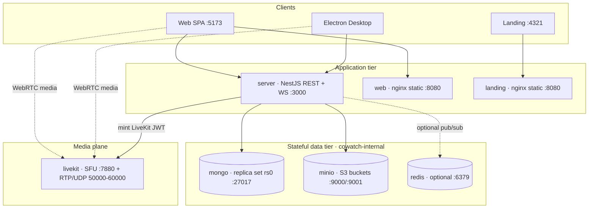

# Cowatch — Docker Topology & Local Workflow

> Operator guide for the Dockerized Cowatch stack: service topology, the local up/down workflow, env wiring, and how `local` maps onto the `vps` / `vercel` / `production` targets.

**Status:** Planning (Phase 0 — Architecture) — forward-looking skeleton
**Owner agent:** DevOps Engineer
**Last updated: 2026-06-27**

> **PLANNING NOTE.** The apps (`server`, `web`, `landing`) and their Dockerfiles described here are **forward-looking skeletons** — the application code does not exist yet (Phase 0). This document and the sibling artifacts pin the intended container topology so the stack is ready to stand up the moment the apps are scaffolded. Until then, `docker compose up` will not fully succeed.

Canonical source of truth: [Architecture Canon](../context/architecture.md). The authoritative deployment design is [docs/DEPLOYMENT.md](../docs/DEPLOYMENT.md); this README is its operator-facing companion for the `docker/` folder. On any conflict, the canon wins, then DEPLOYMENT.md.

---

## 1. What's in this folder

| File | Purpose | Status |
|---|---|---|
| [`docker-compose.yml`](./docker-compose.yml) | Local all-in-one service graph: `mongo`, `minio` (+ `minio-bootstrap`), `livekit`, `server`, `web`, `landing`, optional `redis`. Networks, volumes, healthchecks, env wiring. | skeleton |
| [`server.Dockerfile`](./server.Dockerfile) | Multi-stage NestJS (REST + WS) image skeleton. | skeleton |
| [`web.Dockerfile`](./web.Dockerfile) | Multi-stage Vite SPA → nginx static image skeleton; parametrized by `APP_NAME` to also build `landing`. | skeleton |
| [`../.env.example`](../.env.example) | The env-var **contract** — documented superset of every variable. Copy to `.env`. | contract |

**Planned (not yet created)** — see [DEPLOYMENT.md §2.3](../docs/DEPLOYMENT.md#23-docker-folder-artifacts):
`compose.vps.yml`, `compose.observability.yml`, `landing.Dockerfile`, `desktop.Dockerfile`, `nginx/`, `livekit/livekit.yaml`, `mongo/rs-init.js`, `minio/bootstrap.sh`, `traefik/`.

> **Naming.** DEPLOYMENT.md plans a base `compose.yml` + per-target overrides. This folder ships a single `docker-compose.yml` as the **local** realization (the developer `docker compose up` entrypoint). The override-file split (`compose.vps.yml`, `compose.observability.yml`) is the production-grade evolution — see [§6 Override strategy](#6-override-strategy).

---

## 2. Topology at a glance



- **Two networks** ([DEPLOYMENT §3.3](../docs/DEPLOYMENT.md#33-network--port-boundaries)): `cowatch-edge` (HTTP-facing) and `cowatch-internal` (data tier). `server` and `livekit` join both; `mongo`/`minio`/`redis` join only `internal`.
- **Durable state** lives in exactly two volumes — `cowatch-mongo-data`, `cowatch-minio-data`. Redis is ephemeral and tolerable to lose ([DEPLOYMENT §9.1](../docs/DEPLOYMENT.md#91-what-is-stateful)).
- **Server-authoritative sync** (ADR-007) makes `server` stateful for live WS connections; horizontal scaling needs Redis ([DEPLOYMENT §3.1, D3](../docs/DEPLOYMENT.md#31-logical-components)).

### Port map (local)

| Service | Host port | Container | Notes |
|---|---|---|---|
| web | `5173` | `8080` | nginx static (or Vite HMR under an override) |
| landing | `4321` | `8080` | nginx static |
| server | `3000` | `3000` | REST `/api/v1` + WS |
| mongo | `27017` | `27017` | **local only** — internal in vps/prod |
| minio API | `9000` | `9000` | pre-signed URL host |
| minio console | `9001` | `9001` | **local only** — bastion/SSH-tunnel in prod |
| livekit | `7880` | `7880` | signaling WS/HTTP |
| livekit TCP | `7881` | `7881` | WebRTC TCP fallback |
| livekit RTP | `50000-60000/udp` | same | WebRTC media (host-published) |
| redis | `6379` | `6379` | only with `--profile redis` |

---

## 3. Prerequisites

- Docker Engine 24+ with Compose v2 (`docker compose`, not `docker-compose`).
- A populated `.env` at the repo root (see [§4](#4-environment-wiring)).
- Free host ports per the map above (especially the `50000-60000/udp` LiveKit range).
- ~4 GB free RAM for the full stack.

---

## 4. Environment wiring

The compose file reads variables from the repo-root `.env` (via shell substitution `${VAR:-default}` and the `server` service's `env_file: ../.env`). **[`../.env.example`](../.env.example) is the single contract.**

```bash
# From the repo root:
cp .env.example .env
# Generate a real RS256 JWT keypair for JWT_PRIVATE_KEY / JWT_PUBLIC_KEY:
#   scripts/gen-keys.sh        (forward-looking helper)
# Fill in placeholders for: JWT keys, GOOGLE_OAUTH_*, LIVEKIT_API_SECRET, MinIO creds.
```

Wiring rules:

- **Hostnames flip in-network.** The `.env.example` defaults point at `localhost` (for host-side tools and clients). Inside compose, the `server` service overrides them to in-network DNS names (`mongo`, `minio`, `livekit`) — see the `environment:` block in [`docker-compose.yml`](./docker-compose.yml).
- **`VITE_*` are public and build-time.** `web`/`landing` inline `API_BASE_URL` / `WS_BASE_URL` / `LIVEKIT_URL` at build via build-args. **Never** pass secrets as `VITE_*`.
- **Secrets are runtime-only** ([DEPLOYMENT §5](../docs/DEPLOYMENT.md#5-environment--configuration-strategy)). `.env` is git-ignored; only `.env.example` is committed. The single typed config module (`packages/shared/config`) validates everything at boot and **fails fast** on a missing required var.

---

## 5. Local up / down workflow

```bash
# --- Bring the stack up (build images + start) -----------------------------
docker compose -f docker/docker-compose.yml up --build

# Detached:
docker compose -f docker/docker-compose.yml up -d --build

# Include the optional Redis (multi-instance fan-out testing):
docker compose -f docker/docker-compose.yml --profile redis up -d --build

# --- Inspect ----------------------------------------------------------------
docker compose -f docker/docker-compose.yml ps
docker compose -f docker/docker-compose.yml logs -f server web

# --- Tear down --------------------------------------------------------------
docker compose -f docker/docker-compose.yml down          # keep volumes
docker compose -f docker/docker-compose.yml down -v       # DESTRUCTIVE: wipe data
```

These map to the convenience scripts named in [DEPLOYMENT.md §4.1](../docs/DEPLOYMENT.md#41-commands) (forward-looking, in `scripts/` + root `package.json`):

| Script | Wraps |
|---|---|
| `pnpm dev:up` | `compose up -d` + tail server logs |
| `pnpm dev:down` | `compose down` (keeps volumes) |
| `pnpm dev:reset` | `compose down -v` + re-seed (**destructive**) |
| `pnpm dev:seed` | run the `packages/database` seed against local mongo |
| `pnpm dev:logs` | `compose logs -f server web` |

### Startup ordering (healthcheck-gated)

`server` declares `depends_on … condition: service_healthy` for `mongo` and `minio`, so it only boots once:

1. **mongo** is healthy — replica set `rs0` has elected a PRIMARY (Prisma transactions require a replica set, ADR-003).
2. **minio** is healthy — and `minio-bootstrap` has created the five buckets (`avatars`, `room-assets`, `uploads`, `thumbnails`, `caches`) and the scoped server service account (D4).
3. **livekit** has started (signaling reachable).

### First-run checklist ([DEPLOYMENT §4.4](../docs/DEPLOYMENT.md#44-first-run-developer-checklist))

1. `cp .env.example .env` and fill local values (keys, OAuth, LiveKit secret).
2. `docker compose -f docker/docker-compose.yml up -d --build`.
3. Wait for `mongo` + `minio-bootstrap` to go healthy/complete.
4. `pnpm dev:seed` (demo users/rooms).
5. Open `http://localhost:5173` (web) and `http://localhost:4321` (landing).

### Health endpoints (canon §10)

Every service exposes the canonical pair:

| Endpoint | Meaning | Probed by |
|---|---|---|
| `GET /health/live` | process up, no deps checked | Docker `HEALTHCHECK`, liveness |
| `GET /health/ready` | mongo + minio + redis + livekit reachable | load balancer readiness, deploy gate |

Static apps expose `GET /healthz` from nginx.

---

## 6. Override strategy

This local file is the base. Higher targets layer overrides (see [DEPLOYMENT.md §2.3 / §6](../docs/DEPLOYMENT.md#6-deployment-targets--the-replaceable-transport)):

```bash
# VPS (planned): add Traefik TLS, Redis, restart policies, resource limits.
docker compose -f docker/docker-compose.yml -f docker/compose.vps.yml up -d

# Observability (planned): Prometheus + Grafana + Loki + Promtail.
docker compose -f docker/docker-compose.yml -f docker/compose.observability.yml up -d
```

The override is expected to: **remove host port publishing** for `mongo`/`minio`/`redis` (internal only), add the `traefik` edge + `backup` sidecar, set `restart: always` + `deploy.resources.limits`, and require `redis` (drop the profile gate) for multi-instance `server`.

---

## 7. Target mapping (`local` → `vps` / `vercel` / `production`)

One image set, four targets. The **realtime transport** (`REALTIME_TRANSPORT`, ADR-004 / canon §5) is the hinge that lets the same backend run statefully on a VPS or split into serverless functions. Full matrix: [DEPLOYMENT.md §6.1](../docs/DEPLOYMENT.md#61-target-matrix).

| Concern | `local` (this file) | `vps` (default) | `vercel` | `production` |
|---|---|---|---|---|
| Compose | `docker-compose.yml` | `+ compose.vps.yml` | n/a (functions) + external data | orchestrator (Swarm/K8s), same images |
| `REALTIME_TRANSPORT` | `native-ws` | `native-ws` | `vercel-edge` / `durable-object` | `native-ws` (clustered) |
| `server` | 1 container | 1–N + Redis | edge functions + WS adapter | N replicas + Redis cluster |
| `web` / `landing` | nginx (or Vite HMR) | nginx behind Traefik | **Vercel CDN** | CDN + nginx origin |
| `mongo` | container (rs0) | container (replica set) | **Atlas / external** | managed replica set |
| `minio` | container | container | external S3 / MinIO cluster | distributed MinIO / S3 |
| `livekit` | container | container or **LiveKit Cloud** | **LiveKit Cloud** | LiveKit cluster / Cloud |
| TLS | none (host ports) | Traefik ACME | platform | managed |

Key point: `DATABASE_URL`, `MINIO_ENDPOINT`, `LIVEKIT_URL`, and `REDIS_URL` are **swappable by config**, so moving to Atlas / S3 / LiveKit Cloud is a config change, not a code change ([DEPLOYMENT §11 OQ-3](../docs/DEPLOYMENT.md#11-open-questions)).

---

## 8. Troubleshooting

| Symptom | Likely cause | Fix |
|---|---|---|
| `server` exits at boot, "config invalid" | a required env var is missing | `packages/shared/config` fails fast — compare `.env` to `.env.example` |
| Prisma "Transactions are not supported" | replica set not initiated | wait for `mongo` healthcheck; check `mongo/rs-init.js` ran |
| Pre-signed upload URL 403 | buckets/policy not bootstrapped | confirm `minio-bootstrap` completed; re-run it |
| WebRTC connects but no audio/video | UDP media range blocked | ensure `50000-60000/udp` is published and not firewalled |
| Multi-instance events not fanning out | Redis not enabled | start with `--profile redis` and set `REDIS_URL` |
| Port already in use | host port clash | override the `*_PORT` var in `.env` |

---

## 9. Cross-references

- **Canon:** [architecture.md](../context/architecture.md) — [§5 Realtime](../context/architecture.md#5-realtime-transport-abstraction-adr-004) · [§8 Auth](../context/architecture.md#8-auth--token-model-adr-008) · [§10 Non-negotiables](../context/architecture.md#10-cross-cutting-non-negotiables)
- **Deployment design:** [docs/DEPLOYMENT.md](../docs/DEPLOYMENT.md)
- **Architecture:** [docs/ARCHITECTURE.md](../docs/ARCHITECTURE.md) · **Security:** [docs/SECURITY.md](../docs/SECURITY.md)
- **ADRs:** [ADR-002 NestJS](../adr/ADR-002-nestjs.md) · [ADR-003 Prisma](../adr/ADR-003-prisma.md) · [ADR-004 Realtime](../adr/ADR-004-realtime.md) · [ADR-005 LiveKit](../adr/ADR-005-livekit.md)
- **Artifacts:** [`docker-compose.yml`](./docker-compose.yml) · [`server.Dockerfile`](./server.Dockerfile) · [`web.Dockerfile`](./web.Dockerfile) · [`../.env.example`](../.env.example)
