# Cowatch System Architecture

> System architecture for the Cowatch platform — C4 context/container diagrams, NestJS module/component breakdown, key data-flow sequences, the realtime abstraction layering, horizontal scaling strategy, cross-cutting concerns, and decision→ADR traceability. Expanded from the Architecture Canon.

**Status:** CANON-DERIVED (Planning — Phase 0: Architecture)
**Owner agent:** Chief Architect
**Last updated: 2026-06-27**

> Amended 2026-06-27: Resolved Open Questions §10 per Chief Architect rulings — backplane promoted to ADR-011 (B2), sharding/search deferred-to-Phase-7, sticky-or-pubsub + email-provider-interface + worker-isolation resolved.

> This document is **subordinate to the canon**. On any conflict, [`../context/architecture.md`](../context/architecture.md) wins. Every type name, event name, route shape, and ADR id below matches the canon verbatim. Architectural changes here require an ADR + history entry + context update + repomix update (R3/R4).

**Canon & cross-links**

- Architecture Canon (single source of truth): [`../context/architecture.md`](../context/architecture.md)
- Realtime abstraction: [`../context/architecture.md#5-realtime-transport-abstraction-adr-004`](../context/architecture.md#5-realtime-transport-abstraction-adr-004) · Sync algorithm: [`../context/architecture.md#7-sync-algorithm`](../context/architecture.md#7-sync-algorithm) · Permission model: [`../context/architecture.md#6-permission-model`](../context/architecture.md#6-permission-model) · Auth model: [`../context/architecture.md#8-auth--token-model-adr-008`](../context/architecture.md#8-auth--token-model-adr-008)
- Sibling docs: [PRD](./PRD.md) · [Domain model](./DOMAIN.md) · [Auth](./AUTH.md) · [Permissions](./PERMISSIONS.md) · [Sync](./SYNC.md) · [Voice/Video (LiveKit)](./LIVEKIT.md) · [Deployment](./DEPLOYMENT.md)

---

## Table of Contents

1. [Architectural Overview](#1-architectural-overview)
2. [C4 — System Context Diagram](#2-c4--system-context-diagram)
3. [C4 — Container Diagram](#3-c4--container-diagram)
4. [NestJS Module & Component Breakdown](#4-nestjs-module--component-breakdown)
5. [Realtime Abstraction Layering (ADR-004)](#5-realtime-abstraction-layering-adr-004)
6. [Key Data-Flow Sequences](#6-key-data-flow-sequences)
7. [Horizontal Scaling Strategy](#7-horizontal-scaling-strategy)
8. [Cross-Cutting Concerns](#8-cross-cutting-concerns)
9. [Decision → ADR Traceability](#9-decision--adr-traceability)
10. [Open Questions](#10-open-questions)
11. [Document Cross-Links](#11-document-cross-links)

---

## 1. Architectural Overview

Cowatch is a Discord-like social watch-party SaaS: users create rooms, watch synchronized media together (YouTube first), chat, voice/video/screen-share, and maintain a social graph (friends, presence, DMs, notifications). The platform ships as a web app, an Electron desktop app, and a marketing landing site, all backed by a single stateless API service.

The system is a **Turborepo + pnpm monorepo** (ADR-001) of four deployable apps (`apps/{web,desktop,server,landing}`) and eight shared packages (`packages/{ui,auth,database,realtime,social,sdk,shared,types}`). The runtime topology is:

- A **stateless NestJS server** (ADR-002) exposing a versioned REST API (`/api/v1`) and WebSocket gateways. Statelessness is the precondition for horizontal scaling (§7). The Express adapter is **forbidden as an app framework** — Nest's platform is used directly.
- A **server-authoritative realtime plane** built on a custom transport abstraction (ADR-004) — native WebSocket on a VPS today, pluggable serverless adapters later — that fans events across server replicas via a **Redis pub/sub backplane**.
- **MongoDB via Prisma** (ADR-003) as the document store, modeled document-first with embedded owned children and denormalized read-hot snapshots — no relational joins.
- **MinIO** (ADR-009) for S3-compatible object storage; **LiveKit** (ADR-005) as the WebRTC SFU for voice/video/screen share.
- **External providers**: Google OAuth (federated identity) and YouTube (media metadata + IFrame player), plus a swappable transactional-email provider.

The whole system is **Docker-first** (ADR-010) — identical images run local → VPS → Vercel → production. See [Deployment architecture](./DEPLOYMENT.md).

### 1.1 Architectural principles

| Principle | Consequence |
|---|---|
| **Server is the only source of truth for the playback clock** (ADR-007) | Clients never trust each other; the server stamps `serverEpochMs` and broadcasts `playback:sync`. See §5.2 and [SYNC.md](./SYNC.md). |
| **Stateless API tier** | No session affinity required for REST; any replica serves any request. Realtime fan-out is solved by a backplane, not by in-process state (§7). |
| **Transport-agnostic realtime** | Apps depend only on the `RealtimeTransport` interface and `RealtimeEnvelope`; the concrete transport is config-selected (`REALTIME_TRANSPORT`). |
| **Document-first data** | Embed owned/bounded children; reference unbounded/shared collections; denormalize small read-hot fields with the owning aggregate as the source of truth. See [DOMAIN.md](./DOMAIN.md). |
| **Bounded-context modules** | One NestJS module per domain; cross-module access only through injected services, never another context's repository. |
| **Types are single-sourced** | Domain/DTO/event types live in `packages/types`; never duplicated across apps. |
| **Process discipline (R2–R5)** | Planning artifacts precede code; every architectural change ⇒ ADR + history + context + repomix; recoverability is a first-class requirement. |

### 1.2 Quality attributes (drivers)

| Attribute | Target / driver | How the architecture delivers it |
|---|---|---|
| **Sync accuracy** | Steady-state drift **< 500 ms** across clients (ADR-007) | Server-authoritative clock + 2 s heartbeat + client-side rate-glide/hard-seek correction (§5.2). |
| **Scalability** | A single popular room may exceed one replica's capacity | Stateless REST + Redis pub/sub backplane decouples "socket owner" from "room owner" (§7.2). |
| **Availability** | No single in-process state to lose | Externalized state (Mongo, Redis, MinIO); replicas are cattle, restartable freely. |
| **Security** | Production SaaS handling credentials | RS256 JWT, rotating refresh w/ reuse detection, TLS, CSRF, Helmet, rate limiting (§8.5, [AUTH.md](./AUTH.md)). |
| **Recoverability (R2)** | Survive AI context-window exhaustion | All decisions externalized to `adr/`, `history/`, `context/`, `project-state/`; no architectural state lives only in code. |
| **Portability** | local → VPS → Vercel → prod | Docker-first images; transport abstraction; S3-compatible storage (§8.2). |

---

## 2. C4 — System Context Diagram

The outermost view: who uses Cowatch and which external systems it depends on.

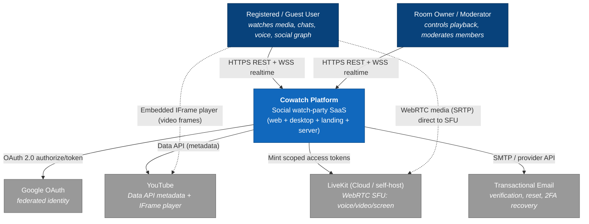

**Notes**

- Voice/video **media** flows **client ↔ LiveKit** directly (WebRTC SRTP); Cowatch only mints scoped LiveKit access tokens and tracks logical channel membership. Control-plane signaling that Cowatch cares about (who is in which `VoiceChannel`) rides the standard realtime envelope. See [LIVEKIT.md](./LIVEKIT.md).
- YouTube **video frames** render in the **client** via the IFrame Player API; the server never proxies video bytes. The server only stores/echoes `QueueItem` metadata (provider id, title, duration) and the authoritative `PlaybackState`. See [SYNC.md](./SYNC.md).
- The transactional-email provider is kept behind a `packages/shared` interface so it is swappable without an architectural change (§10, Open Question 5).

---

## 3. C4 — Container Diagram

The deployable units and the major datastores/services.

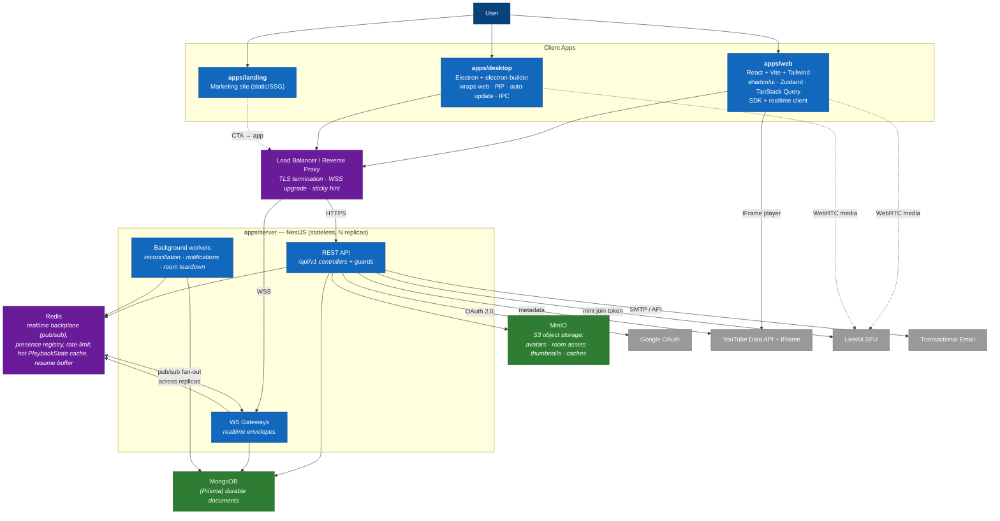

### 3.1 Container responsibilities

| Container | Responsibility | Key tech | State |
|---|---|---|---|
| `apps/web` | Primary UI; consumes `packages/sdk` (REST) and `packages/realtime` (WS); local YouTube player; client-side drift correction | React, Vite, Tailwind, shadcn/ui, Radix, Framer Motion, Zustand, TanStack Query | Client only |
| `apps/desktop` | Electron shell wrapping web; PiP, OS push notifications, hardware accel, auto-update, IPC bridge (ADR-006) | Electron, electron-builder | Client only |
| `apps/landing` | Marketing/SEO; no authenticated state; deep-links into the app | React/SSG | Static |
| `apps/server` | REST + WS gateways + background workers; the **only** writer to MongoDB; authority for playback | NestJS (ADR-002) | **Stateless** |
| Redis | Realtime pub/sub backplane across replicas; presence registry; distributed rate-limit counters; hot `PlaybackState` cache; per-room resume buffer | Redis | Ephemeral |
| MongoDB | Durable document store; single owner is the Prisma schema in `packages/database` | MongoDB + Prisma (ADR-003) | Durable |
| MinIO | Signed-URL uploads/downloads of avatars, room assets, thumbnails, caches | MinIO (ADR-009) | Durable |
| LiveKit | WebRTC SFU for `VoiceChannel` audio/video/screen | LiveKit (ADR-005) | Media |

> **Redis is an infrastructure dependency of ADR-004, not (yet) a standalone architectural decision.** It is the backplane that makes the custom realtime layer horizontally scalable, introduced here as an implementation detail of the realtime transport. If a future serverless adapter (Durable Objects, Vercel Edge, NATS) replaces it, that is an adapter swap under the existing abstraction. See §7 and Open Question 1.

### 3.2 Package → container mapping

The eight shared packages are consumed by the apps as follows (single source of truth in parentheses):

| Package | Consumed by | Role |
|---|---|---|
| `packages/types` | all apps + packages | **Source of truth** for domain, DTO, and event types. Never duplicated. |
| `packages/sdk` | web, desktop, landing | Typed REST client (consumes `types`). |
| `packages/realtime` | web, desktop, server | `RealtimeTransport` interface, `RealtimeEnvelope`, adapters. |
| `packages/auth` | web, desktop, server | Token/session client + guard helpers. |
| `packages/database` | server only | Prisma schema + re-exported generated client. |
| `packages/social` | web, desktop, server | Shared friends/presence/DM logic. |
| `packages/ui` | web, desktop, landing | Shared shadcn/Radix components. |
| `packages/shared` | all | Cross-cutting utils: ids (ULID), error codes, config schema. |

---

## 4. NestJS Module & Component Breakdown

One module per bounded context (canon §3). Modules live at `apps/server/src/modules/<context>/`. Cross-module collaboration is via injected **services** only; controllers and gateways never reach into another context's repository.

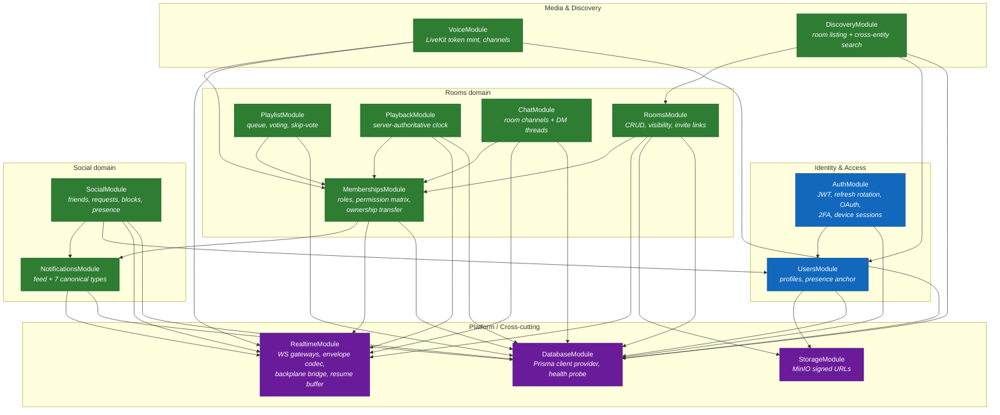

### 4.1 Module responsibilities & primary surfaces

Routes, event names, and DTO/type names below match the canon verbatim.

| Module | Owns | REST (representative) | Emits (realtime) |
|---|---|---|---|
| `AuthModule` | Login flows, JWT issue, refresh rotation + reuse detection, OAuth, TOTP 2FA, device sessions | `POST /api/v1/auth/refresh`, `GET/DELETE /api/v1/auth/sessions`, `POST /api/v1/auth/oauth/google` | — |
| `UsersModule` | Profiles, `GET /api/v1/me`, avatar binding, presence anchor | `GET /api/v1/users/:userId`, `GET /api/v1/me` | `presence:update` |
| `RoomsModule` | Room CRUD, visibility, invite links, settings, temporary/permanent lifecycle | `GET/POST /api/v1/rooms`, `POST /api/v1/rooms/:roomId/ownership/transfer` | `room:settings:update`, `room:ownership:transfer` |
| `MembershipsModule` | Join/leave, roles, kick/ban/mute/timeout, join approval, **ownership-transfer algorithm**, permission derivation | `GET /api/v1/rooms/:roomId/members` | `room:member:join`, `room:member:leave` |
| `PlaylistModule` | Queue items, reorder, add/remove, voting, skip-vote | `POST /api/v1/rooms/:roomId/playlist/items` | (queue updates over `room:*`) |
| `PlaybackModule` | Authoritative `PlaybackState`, sync heartbeat, drift contract, authority enforcement | (control via realtime) | `playback:play`, `playback:pause`, `playback:seek`, `playback:rate`, `playback:sync` |
| `ChatModule` | Room-channel + DM messages, reactions, typing, edit/delete, mentions | `GET /api/v1/rooms/:roomId/messages` | `chat:message:new`, `chat:message:edit`, `chat:message:delete`, `chat:typing`, `chat:reaction:add` |
| `SocialModule` | Friendships, friend requests, blocks, presence aggregation, activity feed | `POST /api/v1/friends/requests` | `social:friend:request`, `social:friend:accept`, `presence:update` |
| `NotificationsModule` | Notification feed + the seven canonical types | `GET /api/v1/notifications` | `notification:new` |
| `VoiceModule` | `VoiceChannel` lifecycle, LiveKit token mint, public/password channels | `POST /api/v1/rooms/:roomId/voice/:channelId/token` | `voice:channel:join`, `voice:channel:leave` |
| `DiscoveryModule` | Room listing + search across users/rooms/messages/videos/tags | `GET /api/v1/discovery/rooms`, `GET /api/v1/search` | — |
| `StorageModule` | MinIO signed PUT/GET, bucket least-privilege | (signed-URL grant endpoints) | — |
| `RealtimeModule` | WS gateways, envelope encode/decode, backplane publish/subscribe, resume buffer, presence | (WS only) | all namespaces (transport) |
| `DatabaseModule` | Prisma client provider, readiness probe | — | — |

### 4.2 Component layering inside a module

Every domain module follows the same internal layering so the codebase is uniform:

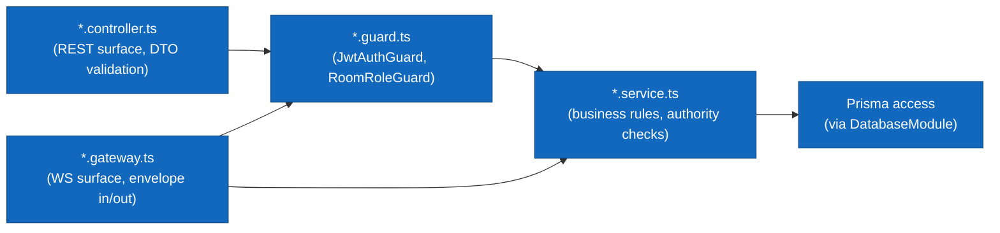

- **Controllers** map HTTP → service calls; validate inbound DTOs via `class-validator`; never contain business logic.
- **Gateways** map realtime envelopes → service calls; enforce that mutating `playback:*` arrive only from authority-qualified members (canon §6/§7) before delegating; validate `data` against the typed payload shape from `packages/types`.
- **Services** hold all rules and are the cross-module integration point (injected, never reaching into another context's repository).
- **Guards** (`JwtAuthGuard`, `RoomRoleGuard`) centralize auth + permission-matrix evaluation. See [PERMISSIONS.md](./PERMISSIONS.md).

### 4.3 Bootstrap & global providers

The Nest application root composes the modules and registers global cross-cutting providers once:

- **Global `ValidationPipe`** — `whitelist`, `forbidNonWhitelisted`, `transform` (§8.4).
- **Global exception filter** — maps domain errors → the canon REST error envelope, attaching `correlationId` (§8.3).
- **Global logging interceptor** — pino-based; binds `correlationId` (ULID) into the async context for the request/event lifetime (§8.1).
- **Global guards** are opt-out: `JwtAuthGuard` is applied app-wide and bypassed by a `@Public()` decorator on auth/landing routes.

---

## 5. Realtime Abstraction Layering (ADR-004)

The realtime plane is the spine of the product. Apps and the server speak the **identical `RealtimeEnvelope`** (canon §5) in both directions. Apps depend only on the `RealtimeTransport` interface, never a concrete transport.

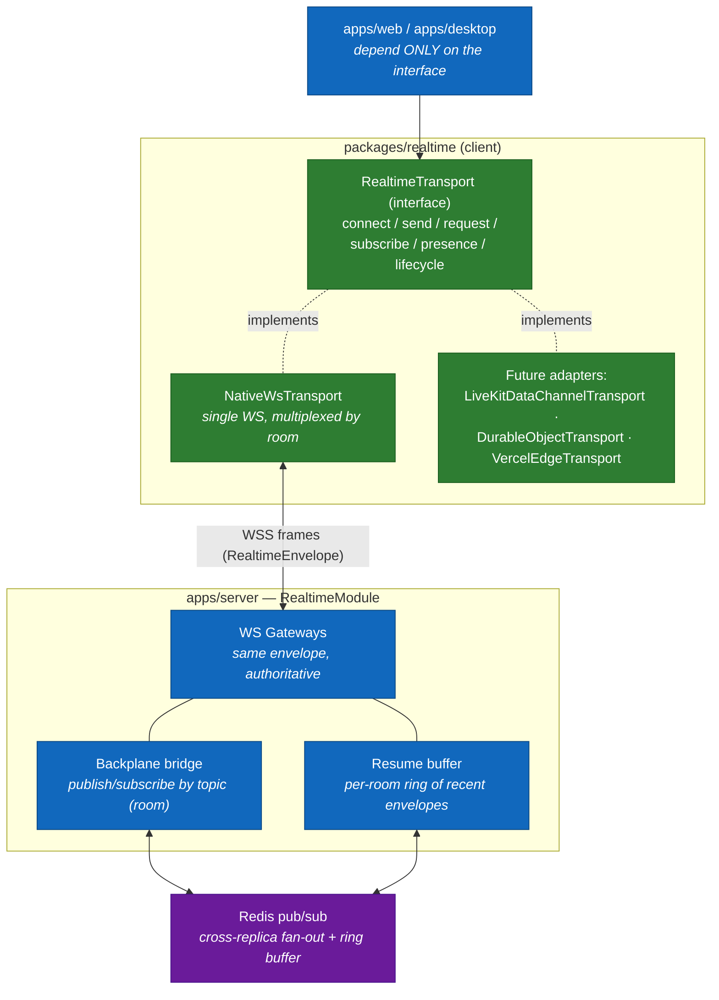

### 5.1 Layering contract

1. **Interface layer** (`RealtimeTransport`) — the only surface apps see. `connect / disconnect / send / request / subscribe / setPresence / onPresence / getState / onStateChange` (canon §5). Selection is config-driven via `REALTIME_TRANSPORT` (default `native-ws`); apps are unaware of the choice.
2. **Adapter layer** — concrete transports. `NativeWsTransport` (VPS default) wraps a single WS multiplexed by the envelope's `room` field. Future serverless adapters implement the same interface without app changes.
3. **Envelope layer** — every frame, both directions, is a `RealtimeEnvelope<T>` with `v: 1`, ULID `id`, namespaced `type`, optional `room` topic, `ts`, optional `corr`, and a typed `data` payload from `packages/types`.
4. **Server gateway layer** — NestJS WS gateways speak the identical envelope, are authoritative for `playback:*`, stamp `serverEpochMs`, and bridge to the backplane.

### 5.2 Connection lifecycle & resume

- **Backoff:** exponential with jitter, base 500 ms, cap 15 s (canon §5).
- **Auto re-subscribe:** on reconnect the transport replays all topic subscriptions.
- **Resume handshake:** the client presents `lastEnvelopeId`; if the server's per-room ring buffer still holds the gap, missed envelopes are replayed in `id` (ULID, sortable) order; otherwise the client requests a fresh `playback:sync` snapshot + room snapshot.
- **State machine:** `connecting → open → reconnecting → closed` (`ConnectionState`), surfaced via `onStateChange` so the UI can show a "resyncing" banner.

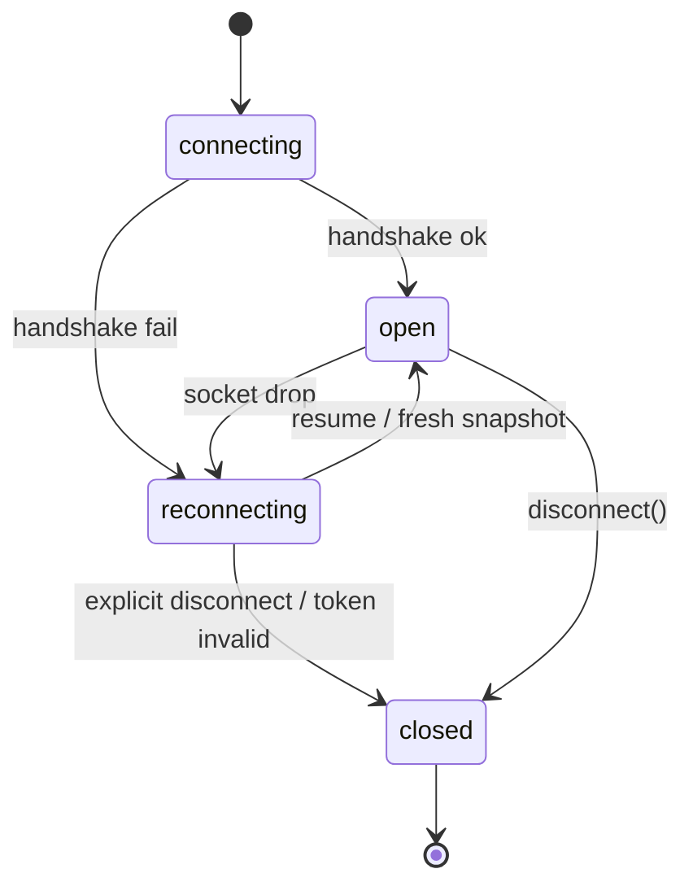

### 5.3 Play / Seek synchronization sequence

Server-authoritative clock (ADR-007, canon §7). Drift target steady-state **< 500 ms**. Full algorithm in [SYNC.md](./SYNC.md).

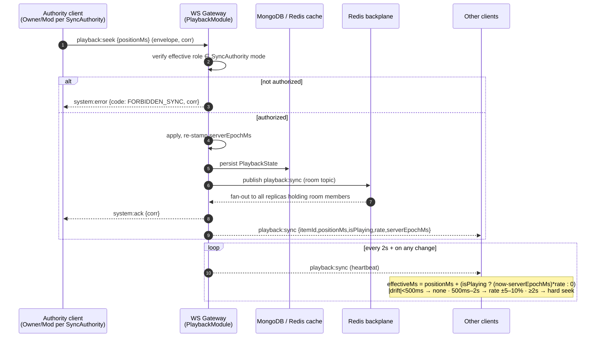

---

## 6. Key Data-Flow Sequences

### 6.1 Join room

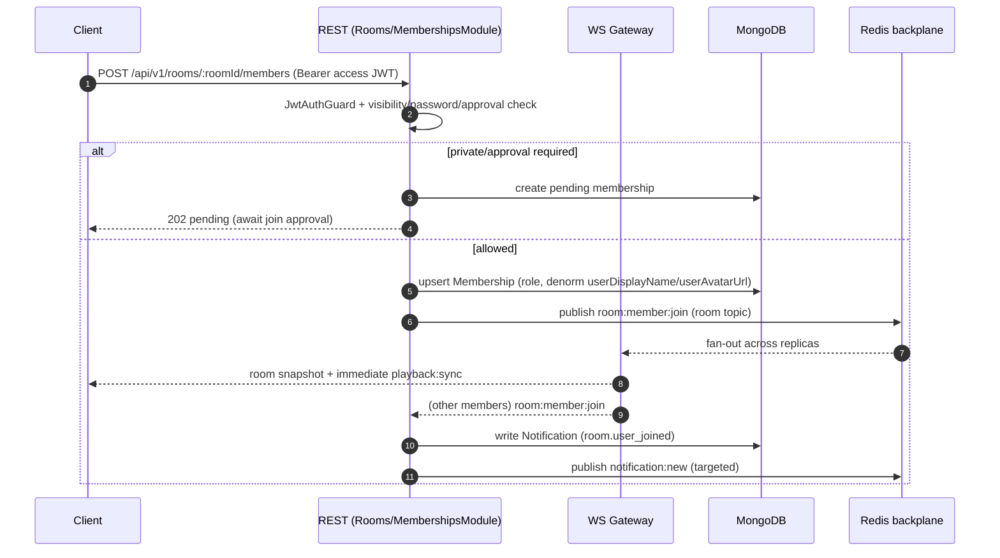

> The denormalized `Membership.userDisplayName/userAvatarUrl` snapshot is written here so member lists render without a per-member `users` lookup (canon §4). The owning `User` aggregate remains the source of truth and re-fans updates via realtime + background reconciliation.

### 6.2 Friend request

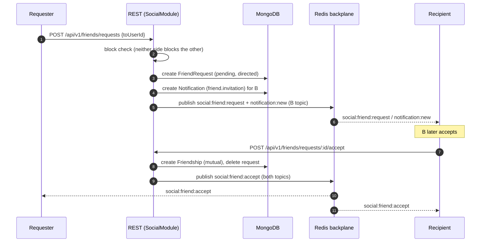

### 6.3 Voice channel join (LiveKit)

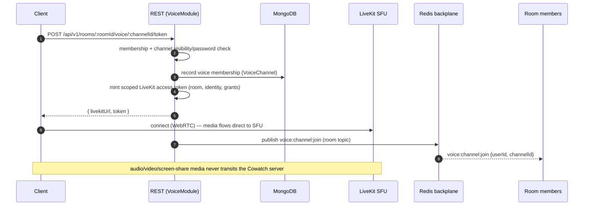

> Voice membership and the media plane are deliberately separate from the sync realtime plane. Cowatch tracks logical membership and mints tokens only; LiveKit owns the SFU media. See [LIVEKIT.md](./LIVEKIT.md).

### 6.4 Token refresh (rotation + reuse detection)

Included because the auth lifecycle crosses the stateless boundary and underpins every other flow.

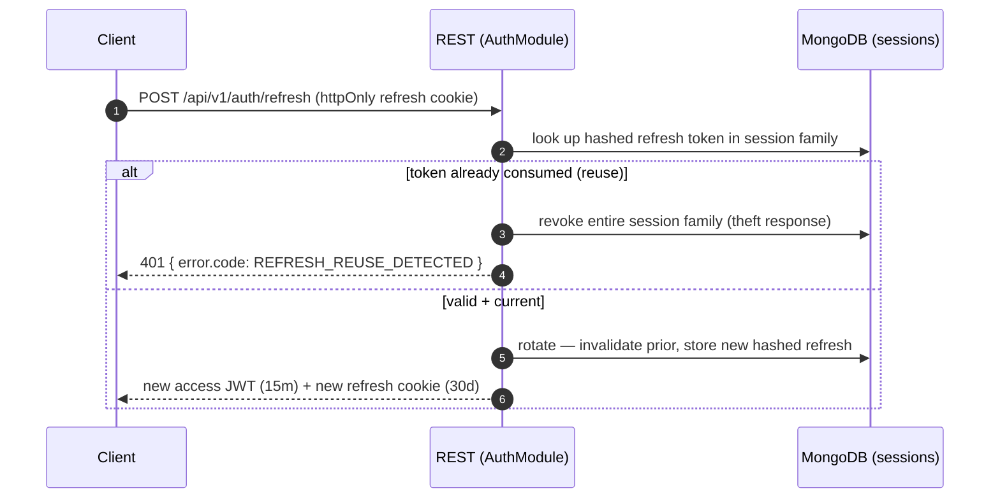

See [AUTH.md](./AUTH.md) and canon §8.

---

## 7. Horizontal Scaling Strategy

The scaling stance is **stateless API + backplane-fanned realtime**.

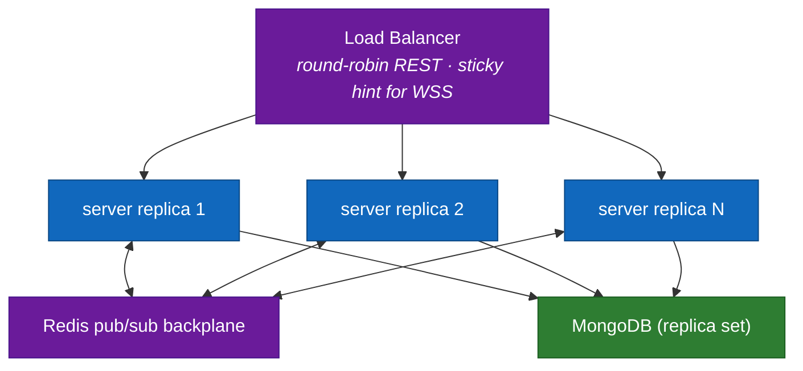

### 7.1 REST tier — fully stateless

- No in-process session state. The access JWT (ADR-008) carries `sub/sid/kind/roles`; any replica validates it with the RS256 public key. Refresh-token families and device sessions live in MongoDB, not memory.
- Rate-limit counters and CSRF/2FA challenge state live in **Redis**, not memory, so per-user/per-IP limits hold across replicas.
- Scale by adding replicas behind the load balancer; **round-robin** is sufficient for REST. Replicas are interchangeable and restartable freely (cattle, not pets).

### 7.2 Realtime tier — sticky-or-pubsub

A WebSocket is a long-lived connection pinned to one replica, but **room membership is spread across replicas**. Two cooperating mechanisms resolve this:

1. **Connection affinity (sticky hint):** the load balancer pins a given socket to a replica for the connection's life (a socket cannot migrate mid-connection). This is a transport detail, not application state.
2. **Pub/sub fan-out (authoritative path):** when any replica accepts a mutating event (e.g. `playback:sync`, `chat:message:new`), it **publishes to the Redis backplane on the room topic** (the envelope's `room` field). Every replica subscribed to that topic re-emits the envelope to its locally connected members. This decouples "which replica owns a socket" from "which replica owns the room," so a room's members can be split across all replicas.

| Concern | Mechanism |
|---|---|
| Socket → replica pinning | LB sticky session for the WSS connection lifetime |
| Cross-replica fan-out | Redis pub/sub, keyed by `room` topic (the envelope's `room` field) |
| Playback authority | Single logical `PlaybackState` per room, persisted (Mongo) + hot-cached (Redis); any replica applies + re-stamps then publishes |
| Presence | Redis-backed presence registry; `presence:update` fanned via backplane |
| Resume buffer | Per-room ring buffer of recent envelopes (Redis) keyed by `id` (ULID, sortable) for `lastEnvelopeId` replay |
| Rate limiting | Redis-backed per-user/per-IP counters shared across replicas |

> **Why a backplane and not sticky-only:** sticky routing alone would force every member of a room onto the same replica, capping a room's size at one machine and creating hotspots for popular rooms. The pub/sub backplane lets a single room scale across the whole fleet while keeping the server stateless.

### 7.3 Datastore scaling

- **MongoDB:** replica set for HA; read-heavy discovery/search served from secondaries where staleness is acceptable. Sharding key candidates (e.g. by `roomId` for room-scoped collections `messages`, `memberships`, `queue_items`) are an Open Question for later phases.
- **MinIO:** distributed / erasure-coded deployment; clients use signed URLs so object bytes never transit the API tier.
- **LiveKit:** scales independently as the SFU; Cowatch only mints tokens and tracks logical membership.
- **Redis:** single-primary with replicas at launch; Redis Cluster (sharded by room topic) is the scale-out path if backplane throughput becomes the bottleneck.

### 7.4 Background workers

Reconciliation, notification fan-out, and room teardown run as worker logic inside the same stateless image (selected by role/flag) so they share the codebase and config. Worker tasks are idempotent and pick up work from durable state (Mongo) or Redis queues, so any replica can run them and none holds unique state.

---

## 8. Cross-Cutting Concerns

Aligned with canon §10 (Non-Negotiables).

### 8.1 Logging & observability

- **Structured JSON logs** via **pino**. Every log line carries `correlationId` (ULID).
- **Correlation propagation:** one `correlationId` per logical operation, generated at the edge, carried in HTTP header `x-correlation-id` and realtime envelope `corr`, and threaded HTTP → service → WS → logs. Realtime errors echo the originating `corr`.
- **Metrics:** Prometheus-compatible counters/histograms (request latency, WS connection count, **drift histogram**, backplane publish rate, refresh-rotation/reuse counters).
- **Health:** `/health/live` and `/health/ready` on every service; `ready` gates on Mongo + Redis + MinIO reachability.
- **Tracing:** spans across HTTP → service → WS for a single operation.

### 8.2 Configuration

- All config via **env / secret store**, never committed; Docker-first parity across local/VPS/Vercel/production (ADR-010). See [DEPLOYMENT.md](./DEPLOYMENT.md).
- Realtime transport is selected by `REALTIME_TRANSPORT` (default `native-ws`); apps are unaware of the choice.
- Config schema is validated at boot (**fail-fast**) and surfaced through `packages/shared` config helpers, so a missing/invalid var stops the container rather than failing at runtime.

### 8.3 Error handling

- **REST error envelope** (every non-2xx) — exactly the canon shape:
  ```json
  { "error": { "code": "ROOM_NOT_FOUND", "message": "Human readable.",
    "details": {}, "correlationId": "01J...", "timestamp": "2026-06-27T..." } }
  ```
  Success envelope: bare resource, or `{ "data": ..., "meta": { "page": ... } }` for collections. `code` is a stable SCREAMING_SNAKE enum.
- **Realtime errors:** `system:error` envelope reusing the same SCREAMING_SNAKE `code` vocabulary, with `corr` tying it to the originating request (e.g. `FORBIDDEN_SYNC` for unauthorized playback mutation).
- A global Nest **exception filter** maps domain errors → stable codes; unmapped errors become `INTERNAL_ERROR` with the `correlationId` preserved for support lookup.
- **Versioning:** URI-versioned `/api/v1`; breaking changes go to `/api/v2`; the realtime envelope carries `v: 1`. Old versions are deprecated per policy, never silently mutated.

### 8.4 Validation

- All inbound REST bodies are `class-validator` DTOs (`CreateRoomDto`, etc.); a global `ValidationPipe` (`whitelist` + `forbidNonWhitelisted` + `transform`) rejects unknown fields.
- Realtime payloads are validated against the typed `data` shape from `packages/types` in the gateway before the service is invoked.
- DTOs and event payloads are defined once in `packages/types` and shared across server and clients; clients validate the same shapes optimistically before sending.

### 8.5 Security baseline

TLS everywhere; argon2/bcrypt password hashing; RS256 JWT; httpOnly + Secure + SameSite=Strict refresh cookie scoped to `/api/v1/auth`; CSRF protection on cookie-auth mutations; Helmet headers; per-IP + per-user rate limiting (Redis-backed) on auth and write endpoints; strict CORS allowlist; least-privilege MinIO buckets with signed URLs; secrets only via env/secret store, never committed. See [AUTH.md](./AUTH.md) and canon §8/§10.

### 8.6 Identity & correlation conventions

- Persistent entity ids = Mongo `ObjectId` (string in TS — never an `ObjectId` instance crosses the service boundary).
- Realtime/message ids and correlation ids = **ULID** (sortable), enabling resume-buffer ordering and log correlation.
- One `correlationId` per logical operation, shared across REST + realtime + logs.

### 8.7 Time

All timestamps are stored and transmitted in **UTC ISO-8601 / epoch ms**; clients localize for display only. The sync algorithm's clock math depends on a measured client↔server offset, not on client wall-clock trust (canon §7).

---

## 9. Decision → ADR Traceability

Every major architectural decision in this document traces to a canon ADR. ADR files live at [`../adr/ADR-NNN-kebab-title.md`](../adr/).

| Decision | ADR | This doc |
|---|---|---|
| Monorepo (Turborepo + pnpm), 4 apps + 8 packages | [ADR-001](../adr/ADR-001-monorepo-turborepo-pnpm.md) | §1, §3.2, §4 |
| NestJS for REST + WS gateways; Express forbidden as app framework | [ADR-002](../adr/ADR-002-nestjs-backend.md) | §3, §4 |
| Prisma ORM over MongoDB (document-first) | [ADR-003](../adr/ADR-003-prisma-mongodb.md) | §3, §7.3 |
| Custom realtime abstraction with replaceable transport | [ADR-004](../adr/ADR-004-realtime-abstraction.md) | §5, §7.2 |
| LiveKit for voice/video/screen share | [ADR-005](../adr/ADR-005-livekit-voice.md) | §3, §6.3 |
| Electron + electron-builder desktop app | [ADR-006](../adr/ADR-006-electron-desktop.md) | §3.1 |
| Server-authoritative playback sync (drift < 500 ms) | [ADR-007](../adr/ADR-007-server-authoritative-sync.md) | §5.3, §7.2 |
| JWT access + rotating refresh, device sessions, TOTP 2FA | [ADR-008](../adr/ADR-008-auth-tokens.md) | §6.4, §7.1, §8.5 |
| MinIO S3-compatible object storage | [ADR-009](../adr/ADR-009-minio-storage.md) | §3, §7.3 |
| Docker-first delivery | [ADR-010](../adr/ADR-010-docker-first.md) | §3, §8.2 |

> The Redis backplane (§3, §7.2) is treated as an **implementation detail of ADR-004**, not a standalone architectural decision. If a future review elevates it to a first-class decision (e.g. choosing Redis vs. NATS vs. a serverless Durable-Object bus), it must get its own ADR + history + context + repomix update (R3/R4). See Open Question 1.

---

## 10. Open Questions

1. **Backplane ADR.** Should the Redis pub/sub backplane be promoted from "ADR-004 implementation detail" to its own ADR? **Recommendation:** yes — author `ADR-011-realtime-backplane.md` documenting Redis as the default and NATS / Durable Objects as serverless-era alternatives, since it is a load-bearing infrastructure dependency that affects scaling.
   - **Resolution (2026-06-27):** Promote the Redis backplane to its own ADR — **ADR-011 = Redis pub/sub (fan-out) + Redis Streams (resume buffer), with Mongo change streams as secondary reconciliation**; it sits below ADR-004's transport abstraction so serverless adapters swap the bus without touching feature code. Ledger row **D-011** added (Architecture/Accepted). (ARCH OQ-1 → B2.) — **Status: Resolved.**
2. **MongoDB sharding key.** No sharding is needed at launch (replica set suffices). **Recommendation:** defer; revisit at the discovery/scale phase with `roomId`-based sharding for room-scoped collections (`messages`, `memberships`, `queue_items`) as the leading candidate.
   - **Resolution (2026-06-27):** Sharding deferred; shard key = `roomId` for room-scoped collections, with the sharding ADR authored at adoption. (ARCH OQ-2.) — **Status: Deferred to Phase 7.**
3. **WSS affinity vs. connection migration.** Sticky hint is sufficient today. **Recommendation:** keep sticky-or-pubsub; only invest in seamless connection migration if LB-level sticky proves unreliable, since the resume handshake already covers reconnects.
   - **Resolution (2026-06-27):** Keep sticky-or-pubsub; the resume handshake already covers reconnects, so seamless mid-connection migration is not pursued. (ARCH OQ-3.) — **Status: Resolved.**
4. **Search backend.** Discovery search currently relies on Mongo text/search indexes. **Recommendation:** acceptable for launch; if cross-entity ranking/relevance becomes a product requirement, evaluate a dedicated search engine in the Discovery phase (would require its own ADR).
   - **Resolution (2026-06-27):** Native Mongo text indexes ship first; an external search engine is adopted only if discovery acceptance fails, behind its own ADR. (ARCH OQ-4 → DB OQ-3 / PHASES-1.) — **Status: Deferred to Phase 7.**
5. **Transactional email provider.** The provider behind verification/reset/2FA-recovery is unspecified in canon. **Recommendation:** keep it behind a `packages/shared` interface so the concrete provider is swappable without an architectural change.
   - **Resolution (2026-06-27):** Email provider sits behind a `packages/shared` interface; the concrete provider is configuration, swappable without an architectural change. (ARCH OQ-5.) — **Status: Resolved.**
6. **Worker isolation.** Background workers (§7.4) currently share the server image and process role. **Recommendation:** keep co-deployed at launch for simplicity; split into a dedicated worker deployment only if CPU/GC contention with the request path is observed.
   - **Resolution (2026-06-27):** Workers stay co-deployed in the server image; split into a dedicated deployment only on observed contention. (ARCH OQ-6.) — **Status: Deferred to Phase 12.**

---

## 11. Document Cross-Links

- Canon (source of truth): [`../context/architecture.md`](../context/architecture.md)
- Product requirements: [`./PRD.md`](./PRD.md)
- Domain model: [`./DOMAIN.md`](./DOMAIN.md)
- Auth & token model: [`./AUTH.md`](./AUTH.md) · [`../context/architecture.md#8-auth--token-model-adr-008`](../context/architecture.md#8-auth--token-model-adr-008)
- Permission model: [`./PERMISSIONS.md`](./PERMISSIONS.md) · [`../context/architecture.md#6-permission-model`](../context/architecture.md#6-permission-model)
- Sync algorithm: [`./SYNC.md`](./SYNC.md) · [`../context/architecture.md#7-sync-algorithm`](../context/architecture.md#7-sync-algorithm)
- Voice / video: [`./LIVEKIT.md`](./LIVEKIT.md)
- Deployment: [`./DEPLOYMENT.md`](./DEPLOYMENT.md)
- Realtime transport: [`../context/architecture.md#5-realtime-transport-abstraction-adr-004`](../context/architecture.md#5-realtime-transport-abstraction-adr-004)
- ADRs: [`../adr/ADR-001-monorepo-turborepo-pnpm.md`](../adr/ADR-001-monorepo-turborepo-pnpm.md) · [`../adr/ADR-002-nestjs-backend.md`](../adr/ADR-002-nestjs-backend.md) · [`../adr/ADR-004-realtime-abstraction.md`](../adr/ADR-004-realtime-abstraction.md) · [`../adr/ADR-007-server-authoritative-sync.md`](../adr/ADR-007-server-authoritative-sync.md) · [`../adr/ADR-008-auth-tokens.md`](../adr/ADR-008-auth-tokens.md)
