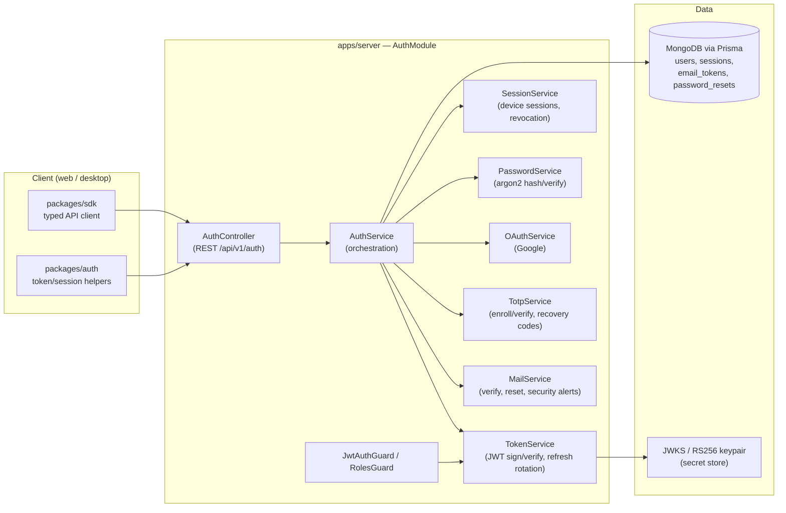
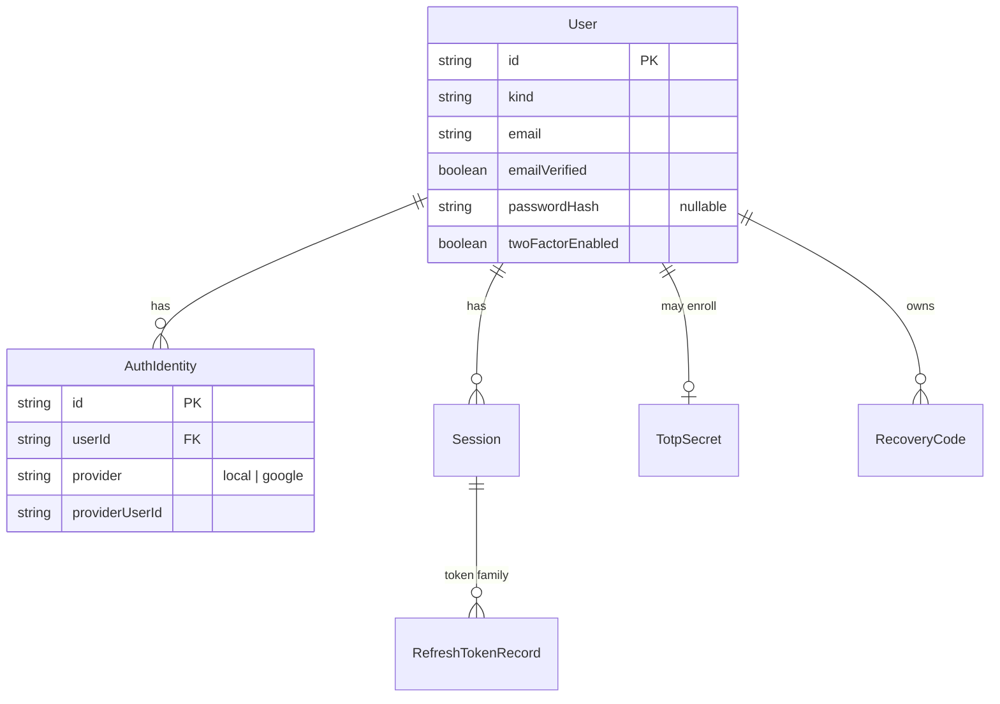
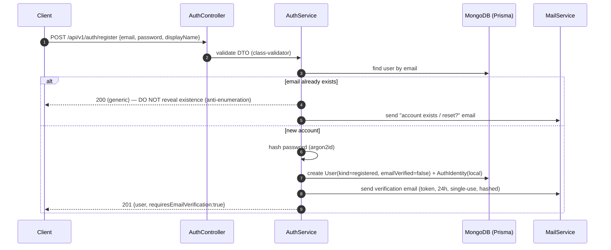
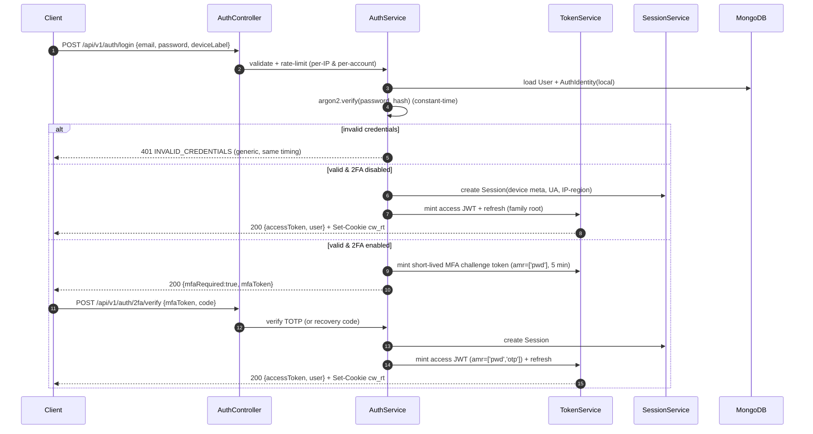
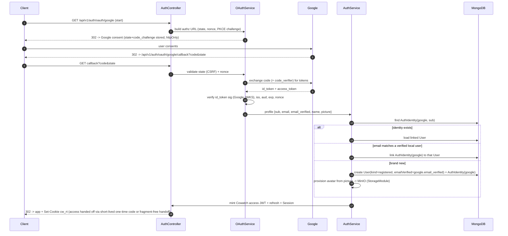
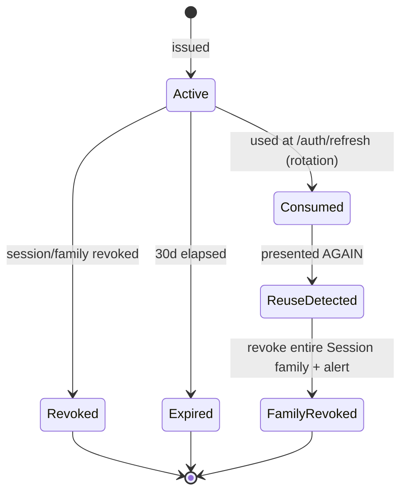
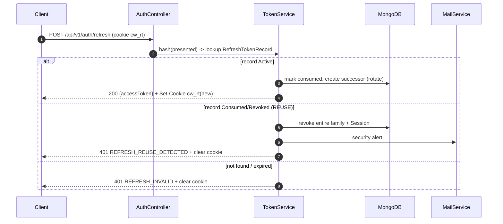

# Authentication & Session Architecture

> Definitive design for Cowatch identity: registration, login, token lifecycle, device sessions, email verification, password reset, and TOTP two-factor.

**Status:** Draft (Planning — Phase 1: Authentication)
**Owner agent:** Backend Engineer
**Last updated: 2026-06-27**

> Amended 2026-06-27: Resolved Open Questions §21 (OQ-1…OQ-6) per Chief Architect rulings — denylist store config-selectable, refresh cookie `Path=/api/v1/auth`, raw IP 30 d then region, guest 24 h browser-bound; magic-link and WebAuthn/passkeys deferred to Post-MVP.

> Canon compliance: this document implements [ADR-008 — Auth tokens](../adr/ADR-008-auth-tokens.md) and conforms to [Architecture Canon §8 Auth/Token Model](../context/architecture.md#8-auth--token-model-adr-008) and [§10 Cross-Cutting Non-Negotiables](../context/architecture.md#10-cross-cutting-non-negotiables). Security baseline is shared with [docs/SECURITY.md](./SECURITY.md). Type names, route shapes, and event names below match the canon verbatim.

---

## Table of Contents

1. [Scope & Goals](#1-scope--goals)
2. [Module & Component Map](#2-module--component-map)
3. [Identity Model & Account Subtypes](#3-identity-model--account-subtypes)
4. [Token Model](#4-token-model)
5. [Cookie vs Storage Strategy](#5-cookie-vs-storage-strategy)
6. [Flow — Email / Password Registration & Login](#6-flow--email--password-registration--login)
7. [Flow — Google OAuth](#7-flow--google-oauth)
8. [Flow — Guest & Upgrade-to-Registered](#8-flow--guest--upgrade-to-registered)
9. [Refresh Rotation & Reuse Detection](#9-refresh-rotation--reuse-detection)
10. [Device / Session Model & Revocation](#10-device--session-model--revocation)
11. [Email Verification](#11-email-verification)
12. [Password Reset](#12-password-reset)
13. [TOTP Two-Factor (Enroll & Challenge)](#13-totp-two-factor-enroll--challenge)
14. [REST API Surface](#14-rest-api-surface)
15. [Data Model (Prisma fragments)](#15-data-model-prisma-fragments)
16. [Shared Types & DTOs](#16-shared-types--dtos)
17. [Error Codes](#17-error-codes)
18. [Realtime Auth (WS handshake)](#18-realtime-auth-ws-handshake)
19. [Security Considerations](#19-security-considerations)
20. [Acceptance Criteria](#20-acceptance-criteria)
21. [Open Questions](#21-open-questions)

---

## 1. Scope & Goals

Cowatch authentication provides identity, credentials, and session lifecycle for every surface (web, desktop, realtime gateway). It MUST:

- Support **email/password**, **Google OAuth**, and **guest** account flows.
- Issue short-lived **JWT access tokens** + **rotating opaque refresh tokens** with theft detection (ADR-008).
- Track one revocable **Session** per device with full session-management UX.
- Support **email verification**, **password reset**, and **TOTP 2FA** with recovery codes.
- Keep refresh credentials out of JavaScript reach via an **httpOnly Secure SameSite=Strict** cookie.
- Be transport-agnostic for realtime: the same access token authorizes the WS handshake.

**Non-goals (this doc):** the social graph, room permissions, and presence are owned by their own specs. Authorization *inside a room* (the `RoomRole` matrix) is covered by [Architecture Canon §6](../context/architecture.md#6-permission-model); this doc only establishes *who the caller is* and which `kind` they are.

---

## 2. Module & Component Map

`AuthModule` lives at `apps/server/src/modules/auth/` per the canon module map. It depends on `UsersModule`, `StorageModule` (avatar on OAuth provisioning), and the cross-cutting mailer.



**Boundary rule (canon):** ids cross the service boundary as **strings** (never `ObjectId`); message/correlation ids are **ULID**. The `AuthModule` never imports a concrete realtime transport — it only mints the token the transport later presents.

---

## 3. Identity Model & Account Subtypes

A `User` carries `kind: UserKind` (canon glossary). Authentication behaviour differs by subtype:

| Subtype | `kind` | Credentials | Refresh persistence | Default room role | Notes |
|---|---|---|---|---|---|
| Registered (local) | `registered` | email + password (argon2id) | 30-day rotating cookie | per-room `Member`/`Guest` | email verification gates sensitive actions |
| Registered (OAuth) | `registered` | Google identity (no local password unless later set) | 30-day rotating cookie | per-room `Member`/`Guest` | email considered verified iff Google `email_verified=true` |
| Guest | `guest` | none (display name only) | **session-cookie lifetime only**, no durable refresh family | `Guest` | ephemeral; can upgrade to `registered` |

A single `User` may hold **multiple `AuthIdentity` rows** (e.g. local password *and* Google) keyed by `(provider, providerUserId)`. Linking is by verified email match or explicit in-session link. This keeps "Sign in with Google" and "email/password" pointed at one account rather than creating duplicates.



---

## 4. Token Model

### 4.1 Access token (JWT, RS256)

- **Lifetime:** 15 minutes (canon §8). Sent as `Authorization: Bearer <jwt>`.
- **Algorithm:** RS256. Public key published at a JWKS endpoint so the realtime gateway and any future service verify without the private key. Keys rotate via a `kid` header; the verifier selects the key by `kid`.
- **Stateless verification:** access tokens are NOT looked up per request. Revocation is bounded by the 15-minute window plus a `sid` denylist check for *immediate* kills (see §10.4).

**Claims:**

| Claim | Type | Meaning |
|---|---|---|
| `sub` | string | `User.id` |
| `sid` | string | `Session.id` (device session) |
| `kind` | `'registered' \| 'guest'` | account subtype |
| `roles` | string[] | global roles (e.g. `['user']`, `['admin']`) — NOT room roles |
| `amr` | string[] | auth methods satisfied, e.g. `['pwd']`, `['google']`, `['pwd','otp']` |
| `iat` | number | issued-at (epoch s) |
| `exp` | number | expiry (epoch s; `iat + 900`) |
| `iss` | string | `cowatch` |
| `aud` | string | `cowatch-api` |

> `roles` carries **global** roles only. Per-room authority (`RoomRole`, `SyncAuthority`) is derived server-side from `Membership` at access time — never baked into the JWT, because room roles change far faster than a 15-minute token.

### 4.2 Refresh token (opaque, rotating)

- **Lifetime:** 30 days (canon §8), per device session.
- **Format:** a high-entropy opaque secret (`ULID` jti + 256-bit random). Never a JWT.
- **Storage:** only the **hash** (argon2id or SHA-256-with-pepper) is persisted in `RefreshTokenRecord`; the plaintext lives solely in the client's httpOnly cookie.
- **Family:** all refresh records for one `Session` form a **token family**. Rotation chains them via `replacedById`.

### 4.3 Lifetime summary

| Token | Lifetime | Transport | Storage (client) | Storage (server) |
|---|---|---|---|---|
| Access JWT | 15 min | `Authorization` header | in-memory only | none (stateless) |
| Refresh | 30 days (rotating) | httpOnly cookie (`/api/v1/auth`) | httpOnly cookie | hashed record |
| Email-verify token | 24 h, single-use | email link | — | hashed |
| Password-reset token | 1 h, single-use | email link | — | hashed |
| TOTP code | 30 s window (±1 step) | manual entry | — | shared secret |
| Recovery code | until consumed | shown once at enroll | user-saved | hashed |

---

## 5. Cookie vs Storage Strategy

Decisive rule: **the access token lives only in JavaScript memory; the refresh token lives only in an httpOnly cookie.** Nothing sensitive touches `localStorage`/`sessionStorage`.

| Credential | Where it lives (client) | Why |
|---|---|---|
| Access JWT | In-memory variable in `packages/auth` (rehydrated on load via a silent `/auth/refresh`) | XSS cannot read a closure variable as trivially as `localStorage`, and a 15-min TTL bounds exposure. |
| Refresh token | **httpOnly, Secure, SameSite=Strict** cookie, `Path=/api/v1/auth` | `httpOnly` blocks JS access (XSS exfiltration), `SameSite=Strict` blocks CSRF on the refresh endpoint, narrow `Path` limits attachment to auth routes only. |
| CSRF token (double-submit) | non-httpOnly cookie + mirrored header | needed only for the few cookie-authenticated mutations; see §19. |

**Refresh cookie attributes (production):**

```
Set-Cookie: cw_rt=<opaque>; HttpOnly; Secure; SameSite=Strict;
            Path=/api/v1/auth; Max-Age=2592000
```

**Why memory over `localStorage` for the access token:** an in-memory token disappears on tab close and is invisible to other tabs/extensions; on reload the SPA performs a silent refresh (the cookie is sent automatically) to repopulate it. This is the standard "BFF-less SPA" pattern hardened by the short TTL.

**Desktop (Electron) note:** the renderer follows the identical strategy. Electron's `session` cookie jar is partitioned per app; the refresh cookie remains httpOnly. Access tokens never transit IPC to the main process unless a feature (e.g. background push) explicitly requires it, in which case the main process holds it in memory only. Detailed in [docs/ELECTRON.md](./ELECTRON.md).

---

## 6. Flow — Email / Password Registration & Login

### 6.1 Registration



Registration deliberately returns a **generic, non-enumerable** response for the "already exists" case (§19). The account is usable for read flows immediately, but **email verification is required before** creating rooms, sending DMs, or other write-heavy/social actions (gate enforced by a `@RequireVerifiedEmail()` guard).

### 6.2 Login (with optional 2FA branch)



The **MFA challenge token** is a separate, narrowly-scoped JWT (`aud: cowatch-mfa`, 5 min) that *only* authorizes `POST /auth/2fa/verify`. It cannot call any resource endpoint, so a stolen password alone yields nothing actionable.

---

## 7. Flow — Google OAuth

Authorization-Code flow with **PKCE**. The server is the confidential client; the client only ever sees Cowatch tokens, never Google tokens.



**Account-linking safety:** auto-linking by email is permitted **only when the existing local account's email is already verified**, preventing an attacker who pre-registers an unverified account from being silently merged with a Google identity. Otherwise the user is prompted to log in and link explicitly.

**Token handoff:** the callback never puts the access JWT in a redirect URL. The server completes the redirect to the SPA, which immediately calls `/auth/refresh` (cookie already set) to obtain the in-memory access token. This avoids tokens in browser history / referer.

---

## 8. Flow — Guest & Upgrade-to-Registered

```mermaid
sequenceDiagram
  autonumber
  participant C as Client
  participant API as AuthController
  participant AS as AuthService
  participant TS as TokenService

  Note over C,API: Guest creation (e.g. joining a public room via invite)
  C->>API: POST /api/v1/auth/guest {displayName}
  API->>AS: rate-limit per IP; sanitize displayName
  AS->>AS: create User(kind=guest, no credentials)
  AS->>TS: mint access JWT (kind=guest) + session-scoped token
  TS-->>C: 201 {accessToken, user} (NO durable refresh cookie)

  Note over C,API: Upgrade to registered (same User id preserved)
  C->>API: POST /api/v1/auth/guest/upgrade {email, password, displayName?}<br/>(Authorization: Bearer guest-access)
  API->>AS: verify caller is a guest session
  AS->>AS: hash password (argon2id)
  AS->>AS: mutate User.kind=registered; attach AuthIdentity(local); emailVerified=false
  AS->>TS: rotate to a durable refresh family + Set-Cookie cw_rt
  AS->>MailService: send verification email
  TS-->>C: 200 {accessToken (kind=registered)} + Set-Cookie cw_rt
```

**Guest properties (canon §8):** short-lived session, **no refresh-cookie persistence beyond the browser session**, and the `Guest` default permission set. Upgrading **preserves the `User.id`** so the guest's room membership, chat history, and presence carry over seamlessly — only the `kind`, credentials, and refresh persistence change.

---

## 9. Refresh Rotation & Reuse Detection

Every `POST /api/v1/auth/refresh` **rotates**: it consumes the presented refresh token and issues a brand-new access+refresh pair. The prior refresh is marked consumed (`usedAt`) and chained to its successor (`replacedById`).

### 9.1 State machine for a single refresh record



### 9.2 Reuse detection (theft response — canon §8)

A refresh token is single-use. If a **consumed or revoked** refresh token is presented:

1. Treat as token theft. **Revoke the entire Session family** (all chained refresh records + the `Session`).
2. The current legitimate device is also logged out (acceptable: both holder and thief lose access; user re-authenticates).
3. Emit a security event → `MailService` "new/abnormal sign-in or possible theft" alert + a `notification:new` if a live session exists.
4. Respond `401 REFRESH_REUSE_DETECTED`.



**Concurrency note:** legitimate near-simultaneous refreshes (e.g. two tabs racing on app load) can both present the same Active token. To avoid false-positive family revocation, the rotation is performed in a single atomic find-and-update (Prisma transaction / conditional update on `status=Active`); the loser of the race receives the *already-rotated* successor within a short **grace window** (default 10 s, `replacedById` lookup) rather than triggering theft response. Outside that window, reuse is treated as theft.

---

## 10. Device / Session Model & Revocation

### 10.1 Session = one device login

A `Session` (canon glossary "Session (Device Session)") is one authenticated login on one device. It holds the refresh-token family, device metadata, and `lastSeenAt`, and is **independently revocable**. A Session is NOT a watch room.

Captured device metadata: coarse `userAgent` (parsed to browser/OS), **IP region only** (city/country, never raw IP stored long-term beyond a short security window), user-set `label`, `createdAt`, `lastSeenAt`, `current` flag (the calling session).

### 10.2 Management endpoints (canon §8)

| Endpoint | Effect |
|---|---|
| `GET /api/v1/auth/sessions` | list this user's active device sessions |
| `DELETE /api/v1/auth/sessions/:id` | revoke one session (e.g. a lost device) |
| `DELETE /api/v1/auth/sessions` | revoke **all other** sessions (keep current) |
| `POST /api/v1/auth/logout` | revoke the **current** session |

### 10.3 Revocation lifecycle

```mermaid
sequenceDiagram
  autonumber
  participant U as User (Device A)
  participant API as AuthController
  participant SS as SessionService
  participant RT as RealtimeGateway

  U->>API: DELETE /api/v1/auth/sessions/:idB  (revoke Device B)
  API->>SS: mark Session B revoked + revoke its refresh family
  SS->>SS: add sid_B to short-TTL access denylist (15 min)
  SS->>RT: force-disconnect any live WS for sid_B (system:error AUTH_SESSION_REVOKED)
  API-->>U: 204
  Note over U: Device B next /auth/refresh -> 401 (cookie cleared); WS dropped immediately
```

### 10.4 Immediate access-token invalidation

Because access JWTs are stateless and live 15 minutes, a revoked session could otherwise keep calling APIs until expiry. To make revocation *immediate*:

- On revoke, the `sid` is written to a **session denylist** (Redis/in-memory, TTL = access-token lifetime = 15 min).
- `JwtAuthGuard` checks the `sid` against this denylist on each request (a single keyed lookup) and rejects with `401 AUTH_SESSION_REVOKED`.
- Live WS connections bound to that `sid` are force-closed (`system:error`, code `AUTH_SESSION_REVOKED`).

This keeps the common path stateless while guaranteeing prompt logout-everywhere.

---

## 11. Email Verification

```mermaid
sequenceDiagram
  autonumber
  participant C as Client
  participant API as AuthController
  participant AS as AuthService
  participant DB as MongoDB
  participant M as MailService

  Note over AS: on register / email change
  AS->>AS: generate token (ULID + 256-bit), hash it
  AS->>DB: store EmailToken{userIdHash?, tokenHash, type=verify, expiresAt=+24h, usedAt=null}
  AS->>M: email link /verify-email?token=<plaintext>

  C->>API: POST /api/v1/auth/email/verify {token}
  API->>AS: hash(token) -> lookup unexpired, unused EmailToken
  alt valid
    AS->>DB: User.emailVerified=true; mark token usedAt
    AS-->>C: 200 {verified:true}
  else invalid/expired/used
    AS-->>C: 400 EMAIL_TOKEN_INVALID
  end

  Note over C: resend
  C->>API: POST /api/v1/auth/email/resend  (rate-limited, generic response)
```

- Tokens are **single-use, 24 h, hashed at rest**. Re-issuing invalidates prior verify tokens for that user.
- Until verified, the `@RequireVerifiedEmail()` guard blocks sensitive writes (room creation, DMs, invite generation) with `403 EMAIL_NOT_VERIFIED`. Browsing/joining is allowed so the UX isn't a dead end.
- Changing email re-sets `emailVerified=false` and re-triggers verification; the old email receives a "your email was changed" security notice.

---

## 12. Password Reset

```mermaid
sequenceDiagram
  autonumber
  participant C as Client
  participant API as AuthController
  participant AS as AuthService
  participant DB as MongoDB
  participant M as MailService

  C->>API: POST /api/v1/auth/password/forgot {email}
  API->>AS: rate-limit (per IP & per email)
  AS->>DB: find user
  AS-->>C: 200 (ALWAYS generic — never reveal existence)
  opt user exists
    AS->>AS: generate reset token (single-use, hashed)
    AS->>DB: PasswordReset{tokenHash, expiresAt=+1h, usedAt=null}
    AS->>M: email reset link /reset-password?token=<plaintext>
  end

  C->>API: POST /api/v1/auth/password/reset {token, newPassword}
  API->>AS: hash(token) -> lookup valid PasswordReset
  alt valid
    AS->>AS: argon2id hash(newPassword); enforce strength policy
    AS->>DB: update passwordHash; mark token used
    AS->>SS: REVOKE ALL sessions (force re-login everywhere)
    AS->>M: "your password was changed" notice
    AS-->>C: 200 {reset:true}
  else invalid/expired/used
    AS-->>C: 400 RESET_TOKEN_INVALID
  end
```

Key decisions:

- `forgot` **always** returns 200 with a generic message (anti-enumeration), regardless of whether the email exists.
- Reset tokens are **single-use, 1 h, hashed**. The newest token invalidates older ones for the user.
- A successful reset **revokes every session** (refresh families across all devices) — a password change is a global logout, defeating an attacker who already had a session.
- Reset is offered even to OAuth-only accounts; completing it **adds** a local `AuthIdentity` so the user gains an email/password path alongside Google.

---

## 13. TOTP Two-Factor (Enroll & Challenge)

RFC 6238 TOTP (30-second step, 6 digits, SHA-1 for authenticator-app compatibility), with **one-step (±30 s) skew tolerance** and single-use **recovery codes**.

### 13.1 Enrollment

```mermaid
sequenceDiagram
  autonumber
  participant C as Client (authenticated, verified email)
  participant API as AuthController
  participant T as TotpService
  participant DB as MongoDB

  C->>API: POST /api/v1/auth/2fa/setup   (Bearer access, recent-auth required)
  API->>T: generate base32 secret + otpauth:// URI
  T->>DB: store PENDING TotpSecret (encrypted at rest), twoFactorEnabled=false
  T-->>C: 200 {secret, otpauthUri, qrPngDataUrl}

  C->>API: POST /api/v1/auth/2fa/enable {code}
  API->>T: verify TOTP against pending secret
  alt code valid
    T->>DB: twoFactorEnabled=true; activate secret
    T->>T: generate 10 recovery codes; store HASHED
    T-->>C: 200 {recoveryCodes:[... shown ONCE ...]}
  else invalid
    T-->>C: 400 TOTP_INVALID
  end
```

- Enrollment requires **recent authentication** (a fresh password/2FA within N minutes) — a "step-up" check so a hijacked idle session can't silently enable/disable 2FA.
- The TOTP secret is **encrypted at rest** (envelope-encrypted with a KMS/secret-store data key), not just hashed, because it must be recoverable to compute codes.
- Recovery codes are **hashed** like passwords; each is single-use; shown exactly once at enable time. `POST /api/v1/auth/2fa/recovery/regenerate` mints a fresh set and invalidates the old.

### 13.2 Challenge (login second factor)

Covered in the login flow (§6.2): after password success on a 2FA-enabled account, the server returns `mfaRequired:true` + a scoped `mfaToken`; the client posts the 6-digit code (or a recovery code) to `POST /api/v1/auth/2fa/verify`. On success the real Session + tokens are issued with `amr` including `otp`.

### 13.3 Disable

`POST /api/v1/auth/2fa/disable` requires step-up (current password **and** a valid TOTP/recovery code), clears the secret + recovery codes, sets `twoFactorEnabled=false`, and emails a security notice.

---

## 14. REST API Surface

All under base `/api/v1/auth` (canon §3 route conventions; verbs only as trailing action segments for non-CRUD). Errors use the canon error envelope (§17).

| Method & Path | Purpose | Auth |
|---|---|---|
| `POST /auth/register` | email/password registration | public |
| `POST /auth/login` | email/password login (may branch to MFA) | public |
| `POST /auth/2fa/verify` | submit second factor for a login challenge | `mfaToken` |
| `POST /auth/refresh` | rotate refresh, issue new access | refresh cookie |
| `POST /auth/logout` | revoke current session | access |
| `POST /auth/guest` | create guest account/session | public (rate-limited) |
| `POST /auth/guest/upgrade` | upgrade guest → registered | guest access |
| `GET /auth/oauth/google` | start Google OAuth (PKCE) | public |
| `GET /auth/oauth/google/callback` | OAuth callback | public (state-validated) |
| `POST /auth/email/verify` | verify email via token | public |
| `POST /auth/email/resend` | resend verification email | access (rate-limited) |
| `POST /auth/password/forgot` | request reset email | public (rate-limited) |
| `POST /auth/password/reset` | complete reset | public (token) |
| `POST /auth/2fa/setup` | begin TOTP enrollment | access (step-up) |
| `POST /auth/2fa/enable` | confirm TOTP, get recovery codes | access (step-up) |
| `POST /auth/2fa/disable` | disable TOTP | access (step-up) |
| `POST /auth/2fa/recovery/regenerate` | new recovery codes | access (step-up) |
| `GET /auth/sessions` | list device sessions | access |
| `DELETE /auth/sessions/:id` | revoke one session | access |
| `DELETE /auth/sessions` | revoke all other sessions | access |
| `GET /auth/.well-known/jwks.json` | public RS256 keys for verifiers | public |

`GET /api/v1/me` (canon) returns the current user profile and is served by `UsersModule` using the same `JwtAuthGuard`.

---

## 15. Data Model (Prisma fragments)

> Illustrative schema fragments for the auth collections only. The single owner of the full model is `packages/database/prisma/schema.prisma` (canon §4). Collections are `snake_case` plural via `@@map`; ids are `ObjectId` mapped to `_id`, strings in TS.

```prisma
// users — extends the canonical User with auth fields
model User {
  id               String        @id @default(auto()) @map("_id") @db.ObjectId
  kind             String        // "registered" | "guest"
  email            String?       @unique
  emailVerified    Boolean       @default(false)
  passwordHash     String?       // argon2id; null for OAuth-only / guests
  twoFactorEnabled Boolean       @default(false)
  roles            String[]      @default(["user"])  // GLOBAL roles only
  identities       AuthIdentity[]
  sessions         Session[]
  createdAt        DateTime      @default(now())
  updatedAt        DateTime      @updatedAt
  @@map("users")
}

model AuthIdentity {
  id             String   @id @default(auto()) @map("_id") @db.ObjectId
  userId         String   @db.ObjectId
  provider       String   // "local" | "google"
  providerUserId String   // google sub; for local = userId
  createdAt      DateTime @default(now())
  updatedAt      DateTime @updatedAt
  @@unique([provider, providerUserId])
  @@index([userId])
  @@map("auth_identities")
}

model Session {
  id           String               @id @default(auto()) @map("_id") @db.ObjectId
  userId       String               @db.ObjectId
  label        String?
  userAgent    String?
  ipRegion     String?              // coarse region, not raw IP long-term
  lastSeenAt   DateTime             @default(now())
  revokedAt    DateTime?
  refreshChain RefreshTokenRecord[]
  createdAt    DateTime             @default(now())
  updatedAt    DateTime             @updatedAt
  @@index([userId])                 // canon mandatory: sessions (userId)
  @@map("sessions")
}

model RefreshTokenRecord {
  id           String    @id @default(auto()) @map("_id") @db.ObjectId
  sessionId    String    @db.ObjectId
  tokenHash    String    @unique    // never store plaintext
  status       String    @default("active") // active | consumed | revoked
  usedAt       DateTime?
  replacedById String?   @db.ObjectId        // rotation chain
  expiresAt    DateTime
  createdAt    DateTime  @default(now())
  @@index([sessionId])
  @@map("refresh_tokens")
}

model EmailToken {
  id        String   @id @default(auto()) @map("_id") @db.ObjectId
  userId    String   @db.ObjectId
  tokenHash String   @unique
  type      String   // "verify" | "change_email"
  expiresAt DateTime
  usedAt    DateTime?
  createdAt DateTime @default(now())
  @@index([userId])
  @@map("email_tokens")
}

model PasswordReset {
  id        String    @id @default(auto()) @map("_id") @db.ObjectId
  userId    String    @db.ObjectId
  tokenHash String    @unique
  expiresAt DateTime
  usedAt    DateTime?
  createdAt DateTime  @default(now())
  @@index([userId])
  @@map("password_resets")
}

model TotpSecret {
  id           String    @id @default(auto()) @map("_id") @db.ObjectId
  userId       String    @unique @db.ObjectId
  secretEnc    String    // encrypted at rest (KMS data key)
  activatedAt  DateTime?
  createdAt    DateTime  @default(now())
  updatedAt    DateTime  @updatedAt
  @@map("totp_secrets")
}

model RecoveryCode {
  id        String    @id @default(auto()) @map("_id") @db.ObjectId
  userId    String    @db.ObjectId
  codeHash  String                // argon2id, single-use
  usedAt    DateTime?
  createdAt DateTime  @default(now())
  @@index([userId])
  @@map("recovery_codes")
}
```

---

## 16. Shared Types & DTOs

> Canonical TS lives in `packages/types` (canon §3 — source of truth, never duplicated). Sketches below; DTOs use `Dto` suffix.

```ts
// packages/types — auth domain
export type UserKind = 'registered' | 'guest';
export type AuthProvider = 'local' | 'google';

export interface AccessTokenClaims {
  sub: string;          // userId
  sid: string;          // sessionId
  kind: UserKind;
  roles: string[];      // global roles only
  amr: string[];        // ['pwd'] | ['google'] | ['pwd','otp'] ...
  iat: number;
  exp: number;
  iss: 'cowatch';
  aud: 'cowatch-api';
}

export interface SessionSummary {
  id: string;
  label?: string;
  browser?: string;
  os?: string;
  ipRegion?: string;
  lastSeenAt: string;   // ISO-8601 UTC
  current: boolean;
}

export interface LoginResult {
  accessToken: string;
  user: PublicUser;
}
export interface MfaChallenge {
  mfaRequired: true;
  mfaToken: string;     // scoped, 5-min
}
```

```ts
// DTOs (apps/server/src/modules/auth/dto)
export class RegisterDto {
  email!: string;        // @IsEmail
  password!: string;     // @MinLength(12) @Matches(strengthPolicy)
  displayName!: string;  // @Length(2,32)
}
export class LoginDto {
  email!: string;
  password!: string;
  deviceLabel?: string;
}
export class VerifyTotpDto {
  mfaToken!: string;
  code!: string;         // 6-digit TOTP or recovery code
}
export class ResetPasswordDto {
  token!: string;
  newPassword!: string;
}
```

---

## 17. Error Codes

All non-2xx responses use the canon REST error envelope (§10):

```json
{ "error": { "code": "INVALID_CREDENTIALS", "message": "Human readable.",
  "details": {}, "correlationId": "01J...", "timestamp": "2026-06-27T..." } }
```

Realtime auth failures use `system:error` with the same `code` vocabulary.

| Code | HTTP | When |
|---|---|---|
| `INVALID_CREDENTIALS` | 401 | wrong email/password (generic, constant-time) |
| `EMAIL_NOT_VERIFIED` | 403 | sensitive write before verification |
| `EMAIL_TOKEN_INVALID` | 400 | bad/expired/used verification token |
| `RESET_TOKEN_INVALID` | 400 | bad/expired/used reset token |
| `REFRESH_INVALID` | 401 | unknown/expired refresh token |
| `REFRESH_REUSE_DETECTED` | 401 | replayed consumed/revoked refresh → family revoked |
| `MFA_REQUIRED` | 401 | password ok, second factor needed |
| `TOTP_INVALID` | 400 | wrong/expired TOTP or recovery code |
| `STEP_UP_REQUIRED` | 401 | sensitive auth action lacks recent re-auth |
| `AUTH_SESSION_REVOKED` | 401 | token's session was revoked (denylist) |
| `OAUTH_STATE_INVALID` | 400 | OAuth state/nonce mismatch (CSRF) |
| `ACCOUNT_LINK_CONFLICT` | 409 | OAuth email collides with unverified local account |
| `RATE_LIMITED` | 429 | per-IP / per-account throttle tripped |
| `GUEST_FORBIDDEN` | 403 | action not allowed for `kind=guest` |

---

## 18. Realtime Auth (WS handshake)

The realtime gateway authenticates the **same access JWT** — no separate credential. Per canon §5, every frame is a `RealtimeEnvelope`.

```mermaid
sequenceDiagram
  autonumber
  participant C as Client
  participant WS as RealtimeGateway (NestJS WS)
  participant TS as TokenService

  C->>WS: connect(url, token=accessJWT)
  WS->>TS: verify RS256 (kid->JWKS), exp, aud, iss
  WS->>WS: check sid against session denylist
  alt valid
    WS-->>C: open  (bind userId=sub, sessionId=sid)
  else invalid/expired
    WS-->>C: system:error {code: AUTH_TOKEN_INVALID}; close
  end
  Note over C,WS: on access expiry mid-connection, client refreshes via REST then re-auths the socket (re-handshake or auth frame)
```

- The token is passed at connect time (`RealtimeTransport.connect({ url, token })`), not as a query string in logs where avoidable.
- When a session is revoked (§10.4), the gateway force-closes the matching `sid` with `system:error` code `AUTH_SESSION_REVOKED`.
- Access-token expiry mid-stream does not drop the socket immediately; the client silently refreshes and presents a fresh token (re-handshake or a `system` auth-refresh frame) before the grace window lapses.

---

## 19. Security Considerations

Consistent with [docs/SECURITY.md](./SECURITY.md) and [Architecture Canon §10](../context/architecture.md#10-cross-cutting-non-negotiables).

**Credential storage**
- Passwords hashed with **argon2id** (memory-hard; canon permits bcrypt/argon2 — argon2id is the default). Per-hash salt; tuned cost parameters; a server-side **pepper** from the secret store added before hashing.
- Refresh tokens, email/reset tokens, and recovery codes are **never stored in plaintext** — only hashes. TOTP secrets are **encrypted at rest** (reversible by design, KMS data key).

**Token handling**
- Access JWT **RS256** (canon §8); private key in the secret store, public key via JWKS. `kid` enables rotation; the verifier rejects unknown/`none` alg.
- 15-minute access TTL bounds the blast radius of a leaked access token; refresh rotation + reuse detection bounds refresh theft.
- `aud`/`iss` are validated on every verify; the **MFA token** and **access token** have distinct `aud` so one cannot substitute for the other.

**Cookies & CSRF**
- Refresh cookie is `HttpOnly; Secure; SameSite=Strict; Path=/api/v1/auth` — unreadable by JS, not sent cross-site, scoped narrowly.
- `SameSite=Strict` already blocks classic CSRF on `/auth/refresh`. For any *other* cookie-authenticated mutation, a **double-submit CSRF token** (non-httpOnly cookie mirrored in an `x-csrf-token` header) is required (canon §10 "CSRF protection on cookie-auth mutations").
- **CORS** is a strict allowlist (web + desktop origins only); credentials mode enabled only for those origins.

**Transport & headers**
- **TLS everywhere**; HSTS. **Helmet** security headers on every response.
- Tokens never placed in URLs (no access token in redirects, query strings, or logs) to avoid referer/history/log leakage.

**Anti-enumeration & timing**
- `register`, `password/forgot`, and `email/resend` return **generic, identical responses** whether or not the account exists.
- Login uses **constant-time** password comparison and a dummy-hash path for unknown emails so response timing doesn't reveal account existence.

**Rate limiting & abuse**
- **Per-IP and per-account** rate limiting on `login`, `register`, `refresh`, `2fa/verify`, `password/forgot`, `email/resend`, and `guest` (canon §10). Exponential backoff / temporary lockout on repeated login failures; CAPTCHA challenge escalation on abuse signals.
- Guest creation is IP-throttled to deter mass ephemeral-account abuse.

**2FA specifics**
- TOTP verification accepts **±1 time step** only; a used recovery code is invalidated; replayed TOTP within the same step window is rejected (last-used-counter / step memoization).
- Enabling/disabling 2FA, changing email/password, and revoking sessions require **step-up re-authentication** (recent auth), preventing an idle-session takeover from altering security settings.

**Session & revocation**
- Reuse detection revokes the **whole family** (theft response, canon §8).
- Session revocation is **immediate** via the `sid` denylist (TTL = access TTL) plus live-WS force-close — no waiting out the 15-minute JWT.
- Password reset and email change trigger **global session revocation** and a security-notice email.

**OAuth specifics**
- Authorization-Code **+ PKCE**; `state` (CSRF) and `nonce` (replay) validated; Google `id_token` signature/`iss`/`aud`/`exp` verified against Google JWKS.
- Auto-link by email **only** when the local account email is already verified; otherwise `ACCOUNT_LINK_CONFLICT` and an explicit-link prompt.

**Observability**
- Every auth request/event carries a ULID `correlationId` propagated via `x-correlation-id` and envelope `corr` (canon §10). Security events (login, failed login, refresh reuse, session revoke, 2FA change) are structured-logged (pino) and feed alerting — credentials/tokens are **never** logged.
- Secrets only from env/secret store; never committed.

---

## 20. Acceptance Criteria

- [ ] **AC-1** A registered user can log in with email/password and receive a 15-min RS256 access JWT (claims `sub,sid,kind,roles,amr,iat,exp,iss,aud`) plus an httpOnly Secure SameSite=Strict refresh cookie scoped to `/api/v1/auth`.
- [ ] **AC-2** `POST /auth/refresh` rotates the refresh token (new access+refresh), invalidates the prior, and chains via `replacedById`.
- [ ] **AC-3** Presenting a previously-consumed/revoked refresh token (outside the 10-s race grace window) returns `REFRESH_REUSE_DETECTED` and revokes the entire session family + clears the cookie + emits a security alert.
- [ ] **AC-4** Google OAuth uses Authorization-Code + PKCE with validated `state`/`nonce`; a verified-email collision auto-links, an unverified collision returns `ACCOUNT_LINK_CONFLICT`; the access token never appears in any redirect URL.
- [ ] **AC-5** A guest can be created without credentials (no durable refresh cookie) and can upgrade to registered while **preserving `User.id`** and gaining a durable refresh family + verification email.
- [ ] **AC-6** Email verification token is single-use, 24-h, hashed at rest; sensitive writes are blocked with `EMAIL_NOT_VERIFIED` until verified.
- [ ] **AC-7** Password reset uses a single-use, 1-h, hashed token; `forgot` is non-enumerable (always 200); a successful reset revokes all sessions and emails a notice.
- [ ] **AC-8** TOTP enrollment returns an `otpauth://` URI + QR and 10 hashed single-use recovery codes (shown once); login on a 2FA account requires a scoped `mfaToken` then `2fa/verify`; disable requires step-up.
- [ ] **AC-9** `GET/DELETE /auth/sessions(/:id)` list/revoke device sessions; revocation is immediate (denylist + WS force-close with `AUTH_SESSION_REVOKED`).
- [ ] **AC-10** Every auth endpoint enforces per-IP and per-account rate limits and emits non-2xx responses in the canon error envelope with a ULID `correlationId`.
- [ ] **AC-11** The realtime gateway authenticates the same access JWT; revoked `sid`s are force-closed; mid-stream expiry is handled by silent refresh + re-auth without dropping the room.
- [ ] **AC-12** No access token is ever stored in `localStorage`/`sessionStorage`; no token/credential is ever logged; ≥ 90% test coverage on `AuthModule`.

---

## 21. Open Questions

| # | Question | Recommendation |
|---|---|---|
| OQ-1 | Session denylist backing store — Redis vs in-process map? | **Redis** (shared across server replicas; canon is Docker/VPS-first and will scale horizontally). In-process is acceptable only for single-node dev. <br>**Resolution (2026-06-27):** Denylist store is **config-selectable** — `redis` for multi-node, in-process for single-node dev. — **Status: Resolved.** |
| OQ-2 | Refresh-cookie `Path` granularity — `/api/v1/auth` only, or also `/api/v1` for SSR? | Keep **`/api/v1/auth`** (tightest scope). Cowatch SPA refreshes explicitly, so no broader path is needed. <br>**Resolution (2026-06-27):** Refresh cookie stays at **`Path=/api/v1/auth`** (tightest scope). — **Status: Resolved.** |
| OQ-3 | Magic-link / passwordless login as a future flow? | Out of scope for Phase 1; revisit post-launch. The `EmailToken` model already generalizes to it. <br>**Resolution (2026-06-27):** Magic-link is out of Phase 1; the `EmailToken` model already generalizes to it. — **Status: Deferred to Post-MVP.** |
| OQ-4 | WebAuthn/passkeys as a stronger second factor than TOTP? | Phase-2 enhancement; design `AuthIdentity`/2FA tables to allow an additional `factor` type without migration churn. <br>**Resolution (2026-06-27):** WebAuthn/passkeys are post-MVP; keep `AuthIdentity`/2FA tables extensible to add a `factor` type without migration churn. — **Status: Deferred to Post-MVP.** |
| OQ-5 | How long to retain raw IP for security forensics before reducing to region? | Recommend **30 days** raw (security window) then coarsen to region; confirm with DevOps + privacy review in [docs/SECURITY.md](./SECURITY.md). <br>**Resolution (2026-06-27):** Retain raw IP **30 days** then coarsen to region. — **Status: Resolved.** |
| OQ-6 | Guest session hard-expiry duration? | Recommend **24 h absolute** + browser-session bound; tune against abuse metrics. <br>**Resolution (2026-06-27):** Guest session = **24 h absolute + browser-session bound**. — **Status: Resolved.** |

---

### Related documents

- [Architecture Canon](../context/architecture.md) — single source of truth
- [ADR-008 — Auth tokens](../adr/ADR-008-auth-tokens.md)
- [docs/SECURITY.md](./SECURITY.md) — security baseline
- [docs/ARCHITECTURE.md](./ARCHITECTURE.md) — system overview
- [specs/auth.md](../specs/auth.md) — feature spec & tasks (downstream)
