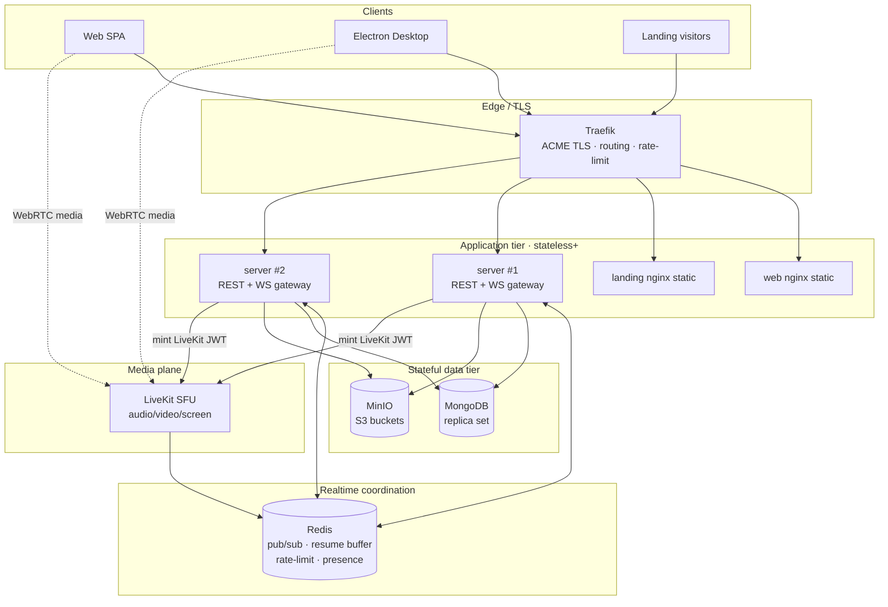
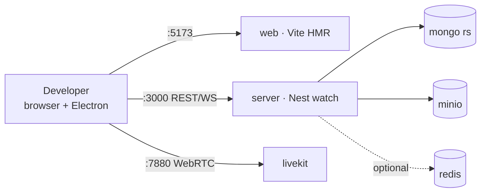
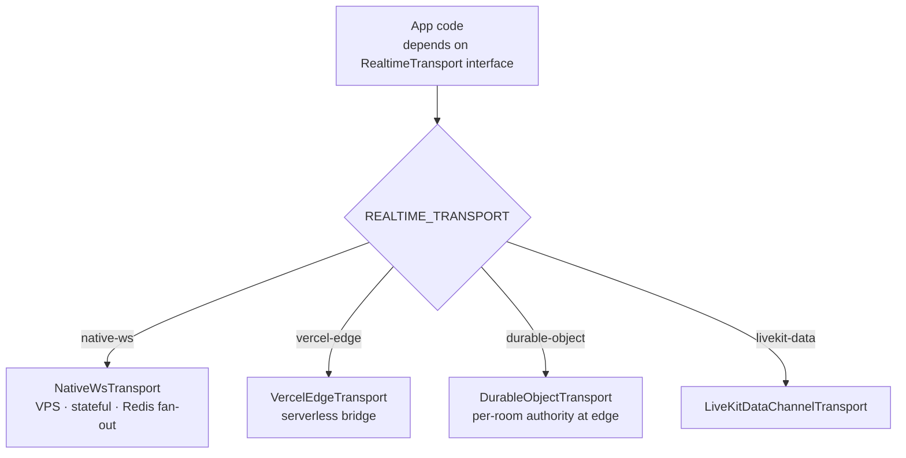
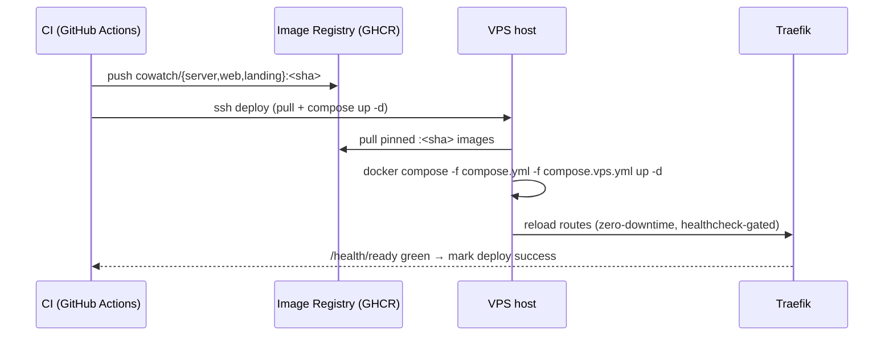
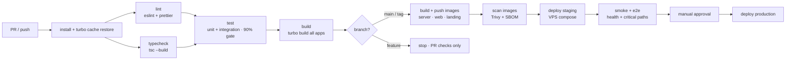
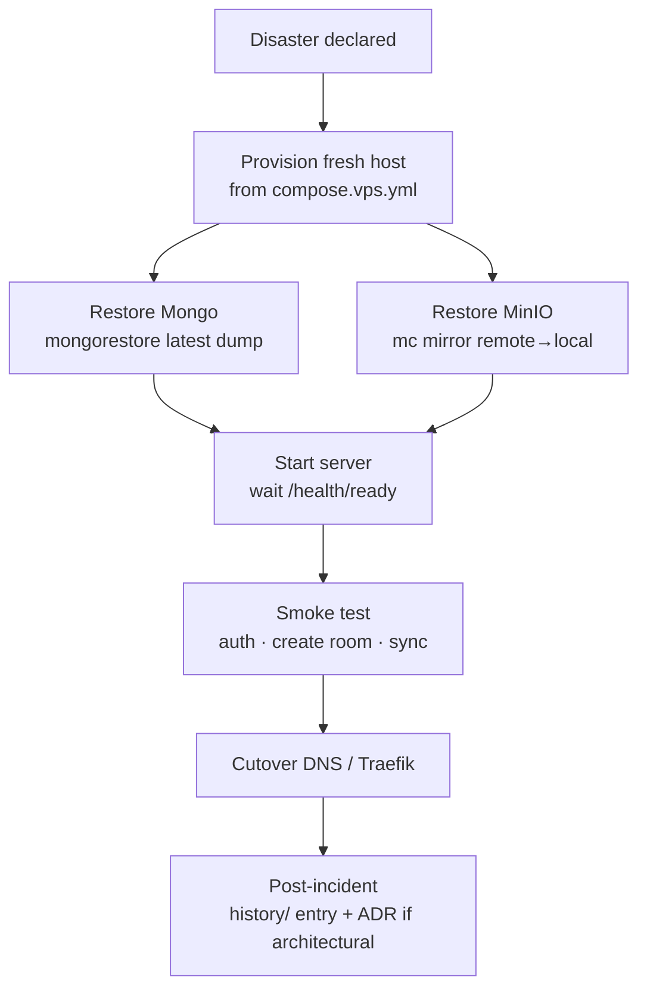

# Cowatch — Deployment Architecture

> Docker-first deployment topology, environment/config strategy, deployment targets, CI/CD pipeline, observability, and disaster recovery for the Cowatch platform.

**Status:** Planning (Phase 0 — Architecture)
**Owner agent:** DevOps Engineer
**Last updated: 2026-06-27**

Canonical source of truth: [Architecture Canon](../context/architecture.md). On any conflict, the canon wins. This document elaborates [ADR-010 (Docker-first delivery)](../adr/ADR-010-docker-first.md) and the deployment implications of [ADR-004 (Realtime transport abstraction)](../adr/ADR-004-realtime-abstraction.md), [ADR-005 (LiveKit)](../adr/ADR-005-livekit.md), and [ADR-009 (MinIO)](../adr/ADR-009-minio-storage.md).

---

## 1. Goals & Non-Negotiables

This document defines **how every Cowatch service is built, configured, shipped, and operated** across four targets: `local`, `vps`, `vercel`, `production`. It is a planning artifact only — no infrastructure is provisioned here.

Binding constraints inherited from the canon ([§2](../context/architecture.md#2-canonical-architecture-decisions-one-line--adr-id), [§10](../context/architecture.md#10-cross-cutting-non-negotiables)):

| # | Constraint | Source |
|---|---|---|
| D1 | **Docker-first** — every service runs in Docker across local / VPS / Vercel / production. Reproducible parity dev→prod. | ADR-010 |
| D2 | **Replaceable realtime transport** — deployment target selects the transport via `REALTIME_TRANSPORT`; apps are unaware. | ADR-004 |
| D3 | **Server-authoritative playback** — the realtime/sync tier is **stateful** and cannot be naively horizontally scaled without a shared coordination layer (Redis). | ADR-007 |
| D4 | **Secrets only via env / secret store**, never committed; least privilege on MinIO buckets (signed URLs). | §10 |
| D5 | **Observability everywhere** — pino JSON logs, Prometheus metrics, `/health/live` + `/health/ready` on every service, ULID `correlationId` propagated through `x-correlation-id` + envelope `corr`. | §10 |
| D6 | **TLS everywhere**, strict CORS allowlist, Helmet, per-IP + per-user rate limiting. | §10 |
| D7 | **Time in UTC** ISO-8601 / epoch ms; all containers run UTC. | §10 |

> **Cross-links:** [ARCHITECTURE.md](./ARCHITECTURE.md) · [OBSERVABILITY.md](./OBSERVABILITY.md) · [SECURITY.md](./SECURITY.md) · [auth spec](../specs/auth.md) · [realtime spec](../specs/realtime.md)

---

## 2. Docker-First Principle (ADR-010)

**Everything runs in Docker.** There is no "works on my machine" path: the same image that a developer runs locally is the same image promoted to VPS and production. The Electron desktop app is the sole exception — it ships as a native installer via `electron-builder`, but it is **built inside a Docker builder stage** so the build toolchain is reproducible.

### 2.1 Rules

1. **One Dockerfile per app**, multi-stage, deterministic. Build the whole monorepo dependency graph once, prune to the target app with `turbo prune`.
2. **Pinned base images** by digest (`node:22-alpine@sha256:...`), never floating `:latest`.
3. **Non-root runtime user** (`appuser`, uid 10001) in every final stage.
4. **Distroless or alpine** final stage; no build tools, no `pnpm`, no source maps shipped to prod images (uploaded to the error tracker instead).
5. **Healthcheck** baked into every image (`HEALTHCHECK` → `/health/live`).
6. **Read-only root filesystem** at runtime where possible; writable scratch via tmpfs.
7. **Build args carry no secrets.** Secrets are injected only at runtime via env / mounted secret files.
8. **Image labels** carry provenance: `org.opencontainers.image.revision` (git SHA), `.version`, `.created`, `.source`.

### 2.2 Canonical multi-stage Dockerfile shape (illustrative — `docker/server.Dockerfile`)

```dockerfile
# syntax=docker/dockerfile:1.7
# --- base: shared toolchain, pinned by digest ---
FROM node:22-alpine@sha256:<digest> AS base
RUN corepack enable && corepack prepare pnpm@9 --activate
WORKDIR /repo

# --- pruner: isolate the server app's subgraph ---
FROM base AS pruner
COPY . .
RUN pnpm dlx turbo prune @cowatch/server --docker

# --- deps: install only what the pruned subgraph needs (cached) ---
FROM base AS deps
COPY --from=pruner /repo/out/json/ .
RUN --mount=type=cache,id=pnpm,target=/pnpm/store \
    pnpm install --frozen-lockfile

# --- builder: compile + generate Prisma client ---
FROM base AS builder
COPY --from=deps /repo/ .
COPY --from=pruner /repo/out/full/ .
RUN pnpm dlx turbo run build --filter=@cowatch/server
RUN pnpm --filter @cowatch/database exec prisma generate

# --- runner: minimal, non-root, healthchecked ---
FROM node:22-alpine@sha256:<digest> AS runner
ENV NODE_ENV=production TZ=UTC
RUN addgroup -g 10001 app && adduser -u 10001 -G app -S appuser
WORKDIR /app
COPY --from=builder --chown=appuser:app /repo/apps/server/dist ./dist
COPY --from=builder --chown=appuser:app /repo/node_modules ./node_modules
USER appuser
EXPOSE 3000
HEALTHCHECK --interval=15s --timeout=3s --start-period=20s --retries=3 \
  CMD node dist/health-probe.js || exit 1
CMD ["node", "dist/main.js"]
```

> `web` and `landing` follow the same shape but their `runner` stage is an **nginx-unprivileged** image serving the Vite build output (`/usr/share/nginx/html`) with an SPA fallback and security headers. See [`docker/web.Dockerfile`](../docker/web.Dockerfile) and [`docker/landing.Dockerfile`](../docker/landing.Dockerfile).

### 2.3 `docker/` folder artifacts

| Artifact | Purpose |
|---|---|
| `docker/server.Dockerfile` | NestJS API + WS gateway image. |
| `docker/web.Dockerfile` | React/Vite SPA → nginx static image. |
| `docker/landing.Dockerfile` | Marketing site → nginx static image. |
| `docker/desktop.Dockerfile` | Reproducible `electron-builder` build stage (artifacts extracted, not run). |
| `docker/compose.yml` | Base compose: service graph + networks + named volumes. |
| `docker/compose.local.yml` | Local override: bind-mounts, hot reload, exposed ports, seed data. |
| `docker/compose.vps.yml` | VPS override: Traefik/Caddy TLS, restart policies, resource limits, Redis. |
| `docker/compose.observability.yml` | Optional Prometheus + Grafana + Loki + Promtail stack. |
| `docker/.env.example` | Documented superset of every env var (no real values). |
| `docker/nginx/` | nginx confs for `web`/`landing` (SPA fallback, gzip/brotli, headers). |
| `docker/livekit/livekit.yaml` | LiveKit server config (keys, TURN, ports) — values from env. |
| `docker/mongo/` | Mongo replica-set init script (`rs.initiate`) — Prisma requires a replica set for transactions. |
| `docker/minio/` | MinIO bucket bootstrap (`mc`) + bucket policies. |
| `docker/traefik/` | Reverse-proxy + ACME TLS config for VPS/production. |

---

## 3. Service Topology

### 3.1 Logical components

| Service | Image | Stateful? | Exposes | Scales |
|---|---|:--:|---|---|
| **server** | `cowatch/server` (NestJS) | Soft — holds WS connections + in-memory sync state | `:3000` REST + WS | Horizontal **with Redis** coordination (D3) |
| **web** | `cowatch/web` (nginx) | No | `:80` static | Horizontal / CDN-fronted |
| **landing** | `cowatch/landing` (nginx) | No | `:80` static | Horizontal / CDN-fronted |
| **mongo** | `mongo:7` (replica set) | **Yes** | `:27017` | Vertical + replica set |
| **minio** | `minio/minio` | **Yes** | `:9000` API, `:9001` console | Vertical / distributed mode |
| **livekit** | `livekit/livekit-server` | Soft — media sessions | `:7880` WS/HTTP, `:7881` TCP, `:50000-60000/udp` RTP | Horizontal (LiveKit cluster) |
| **redis** | `redis:7` | **Yes** | `:6379` | Sentinel/cluster (prod) |
| **traefik** | `traefik:3` | No (edge) | `:443/:80` | Edge / DaemonSet |

> **Redis is optional locally, required for multi-instance `server`.** It backs three concerns: (a) realtime **pub/sub fan-out** so events emitted on one `server` instance reach clients connected to another; (b) the **resume buffer** (recent envelopes per room, keyed by `lastEnvelopeId`, see [Realtime §5 of canon](../context/architecture.md#5-realtime-transport-abstraction-adr-004)); (c) **rate-limit counters** and ephemeral **presence**. A single `server` instance (local/small VPS) runs without Redis using in-process pub/sub and an in-memory ring buffer.

### 3.2 Topology diagram



### 3.3 Network & port boundaries

- **Public ingress** is only through Traefik on `443` (and `80`→`443` redirect). LiveKit's media ports (`7881/tcp`, `50000-60000/udp`) are published directly on the host for WebRTC.
- **Internal docker network** (`cowatch-internal`, bridge) carries `server↔mongo`, `server↔minio`, `server↔redis`, `server↔livekit-control`. None of `mongo`, `minio:9000`, `redis` are published to the host in `vps`/`production`.
- **Two networks**: `cowatch-edge` (Traefik + the HTTP-facing services) and `cowatch-internal` (data tier). `server` joins both; data services join only `internal`.
- MinIO console (`:9001`) and Mongo are reachable in `production` only via an SSH tunnel / bastion, never publicly.

---

## 4. Local Development Workflow (`docker-compose`)

**Goal:** one command brings up the full stack with hot reload, seed data, and no cloud dependencies.

### 4.1 Commands

```bash
# Bring up the full local stack (base + local override)
docker compose -f docker/compose.yml -f docker/compose.local.yml up --build

# Convenience scripts (scripts/ folder) wrap the above:
pnpm dev:up        # compose up -d + tail server logs
pnpm dev:down      # compose down (keeps volumes)
pnpm dev:reset     # compose down -v + re-seed (DESTRUCTIVE)
pnpm dev:seed      # run packages/database seed script against local mongo
pnpm dev:logs      # docker compose logs -f server web
```

### 4.2 What the local override (`compose.local.yml`) changes

- **Bind-mounts** repo source into `server`/`web` containers and runs `turbo dev` (Nest watch + Vite HMR) instead of the production `runner` command.
- **Publishes ports** to the host: `web :5173`, `landing :4321`, `server :3000`, `mongo :27017`, `minio :9000/:9001`, `livekit :7880`, `redis :6379`.
- **Seeds**: MinIO buckets (`avatars`, `room-assets`, `uploads`, `thumbnails`, `caches`) created and policy-applied by `docker/minio/bootstrap.sh`; Mongo replica set initiated by `docker/mongo/rs-init.js`; demo users/rooms via `pnpm dev:seed`.
- **`REALTIME_TRANSPORT=native-ws`**, `NODE_ENV=development`, verbose pino (`LOG_LEVEL=debug`, pretty transport).
- **No Traefik / no TLS** — direct host ports; CORS allowlist includes `http://localhost:5173`.
- **Single `server` instance, no Redis required** (in-process pub/sub). Redis is included but optional; enable multi-instance testing with the `--profile redis` profile.

### 4.3 Local stack diagram



### 4.4 First-run developer checklist

1. Copy `docker/.env.example` → `docker/.env.local`; fill local-only values (random JWT keypair via `scripts/gen-keys.sh`, dummy Google OAuth, LiveKit dev keys).
2. `pnpm install` (host-side, for IDE typings only — runtime uses container deps).
3. `pnpm dev:up`.
4. Wait for `mongo` replica set + MinIO bucket bootstrap (compose `depends_on: condition: service_healthy`).
5. `pnpm dev:seed`.
6. Visit `http://localhost:5173`.

---

## 5. Environment & Configuration Strategy

### 5.1 Principles

- **12-factor config.** All configuration comes from the environment. No environment-specific code branches beyond reading config.
- **Single typed config module.** `packages/shared/config` validates `process.env` at boot via a Zod/`class-validator` schema; the app **fails fast** (exits non-zero) on a missing/invalid required var. This is the only place env is read.
- **`.env.example` is the contract.** Every variable is documented there with type, required/optional, default, and which target(s) need it. CI asserts that every key referenced in the config schema exists in `.env.example`.
- **No secrets in images or git.** Build args are non-secret. Secrets are injected at runtime (compose `env_file` locally; Docker/Swarm secrets or the platform secret store in prod).

### 5.2 Configuration matrix (representative — full list in `docker/.env.example`)

| Variable | Scope | Required in | Notes |
|---|---|---|---|
| `NODE_ENV` | all | all | `development` \| `production` |
| `APP_BASE_URL` | server/web | all | Public origin, drives CORS + cookie domain |
| `API_BASE_URL` | web/desktop | all | `<host>/api/v1` |
| `REALTIME_TRANSPORT` | server/clients | all | `native-ws` \| `livekit-data` \| `durable-object` \| `vercel-edge` (D2) |
| `JWT_PRIVATE_KEY` / `JWT_PUBLIC_KEY` | server | all | **secret** · RS256 keypair (PEM) |
| `JWT_ACCESS_TTL` / `JWT_REFRESH_TTL` | server | all | `15m` / `30d` per [ADR-008](../adr/ADR-008-auth-tokens.md) |
| `REFRESH_COOKIE_DOMAIN` | server | all | Scoped to `/api/v1/auth` |
| `DATABASE_URL` | server | all | **secret** · Mongo SRV w/ `replicaSet` |
| `MINIO_ENDPOINT` / `MINIO_ROOT_USER` / `MINIO_ROOT_PASSWORD` | server/minio | all | **secret** (creds) · signed-URL config |
| `MINIO_BUCKET_*` | server | all | `avatars`/`room-assets`/`uploads`/`thumbnails`/`caches` |
| `LIVEKIT_URL` / `LIVEKIT_API_KEY` / `LIVEKIT_API_SECRET` | server/livekit | all | **secret** · server mints room JWTs |
| `REDIS_URL` | server | vps/prod (multi-instance) | pub/sub + resume buffer + rate-limit |
| `GOOGLE_OAUTH_CLIENT_ID` / `_SECRET` | server | all | **secret** |
| `SMTP_*` | server | vps/prod | email verification + password reset |
| `CORS_ALLOWLIST` | server | all | comma-separated origins |
| `RATE_LIMIT_*` | server | all | per-IP + per-user buckets |
| `LOG_LEVEL` / `LOG_PRETTY` | all | all | pino |
| `OTEL_EXPORTER_OTLP_ENDPOINT` | all | vps/prod | traces/metrics export |
| `SENTRY_DSN` | all | vps/prod | error tracking |

### 5.3 Secrets management per target

| Target | Secret source | TLS | Notes |
|---|---|---|---|
| `local` | `docker/.env.local` (git-ignored) | none | self-signed only if testing cookies |
| `vps` | **Docker secrets** (`/run/secrets/*`) or SOPS-encrypted `.env` decrypted at deploy | Traefik + ACME (Let's Encrypt) | secrets never in compose file; referenced via `secrets:` |
| `vercel` | Vercel encrypted env vars (Project → Settings → Environment Variables) | platform-managed | only `web`/`landing` + edge transport here |
| `production` | Cloud secret manager (Vault / AWS Secrets Manager / Doppler) injected as env or mounted files | managed cert / Traefik ACME | rotation policy; least-privilege IAM |

- **JWT keypair rotation:** publish new public key (JWKS) alongside old, sign with new private key, retire old after `max(access TTL)` window. Tracked in [SECURITY.md](./SECURITY.md).
- **MinIO least privilege (D4):** the `server` uses a scoped service account with `PutObject`/`GetObject` on the five buckets only; clients never receive MinIO root creds — uploads/downloads go through **pre-signed URLs** minted by `StorageModule`.

---

## 6. Deployment Targets & the Replaceable Transport

Four targets, one image set. The **realtime transport is the hinge** that lets the same backend run statefully on a VPS or split into serverless functions — see [ADR-004](../adr/ADR-004-realtime-abstraction.md) and [canon §5](../context/architecture.md#5-realtime-transport-abstraction-adr-004).

### 6.1 Target matrix

| Concern | `local` | `vps` (default) | `vercel` | `production` |
|---|---|---|---|---|
| Compose files | `compose.yml`+`compose.local.yml` | `compose.yml`+`compose.vps.yml` | n/a (functions) + external data | orchestrator (Swarm/K8s) from same images |
| `REALTIME_TRANSPORT` | `native-ws` | `native-ws` | `vercel-edge` / `durable-object` | `native-ws` (clustered) |
| `server` runtime | 1 container, watch | 1–N containers + Redis | edge functions + serverless WS adapter | N replicas + Redis cluster |
| Static apps | Vite dev / nginx | nginx behind Traefik | **Vercel CDN** (native fit) | CDN + nginx origin |
| Mongo | container | container (replica set) | **Atlas / external managed** | managed replica set |
| MinIO | container | container | external S3 / MinIO cluster | distributed MinIO / S3 |
| LiveKit | container | container or LiveKit Cloud | **LiveKit Cloud** | LiveKit cluster / Cloud |
| TLS | none | Traefik ACME | platform | managed |

### 6.2 How the abstraction enables serverless

The application code depends only on the `RealtimeTransport` **interface** (canon §5). Deployment chooses the adapter:

- **`native-ws` (VPS/production default):** a long-lived WS server inside the NestJS process, multiplexed by `room`. Requires a persistent process → Docker on a VPS or an orchestrator. Multi-instance fan-out via Redis pub/sub.
- **`vercel-edge` (future):** static apps on Vercel's CDN; realtime via an edge-function adapter that bridges to an external WS/pub-sub provider, because Vercel functions are short-lived and cannot hold WS state.
- **`durable-object` (future):** Cloudflare Durable Objects hold per-room sync state at the edge — a natural fit for the **server-authoritative clock** (one DO instance = one room's authority), eliminating the cross-instance fan-out problem entirely.
- **`livekit-data` (future):** reuse the LiveKit data channel as the realtime transport, collapsing media + signaling onto one connection.



> **Key constraint (D3):** because playback authority is server-side and stateful, `native-ws` deployments **must** route all sockets for a given `room` to instances that share Redis (sticky-by-room or shared pub/sub). The DO adapter is the cleanest long-term answer; until then, Redis pub/sub + a per-room authority lock is the canonical mechanism. Tracked in [Open Questions](#11-open-questions).

### 6.3 VPS deployment flow (default production-grade target)



- **Zero-downtime:** new `server` replicas start, pass `/health/ready`, Traefik shifts traffic, old replicas drain WS connections (graceful shutdown sends `system:reconnect`, clients reconnect + `resume`), then stop.
- **Rollback:** redeploy the previous immutable `:<sha>` tag (images are never mutated — versioned API per §10).

---

## 7. CI/CD Pipeline

**Platform:** GitHub Actions. **Registry:** GHCR (`ghcr.io/cowatch/*`). **Cache:** Turborepo remote cache + Docker layer cache (`type=gha`).

### 7.1 Pipeline stages



### 7.2 Stage detail

| Stage | Command (illustrative) | Gate |
|---|---|---|
| **lint** | `turbo run lint` | zero errors |
| **typecheck** | `turbo run typecheck` (`tsc --build --noEmit`) | zero errors |
| **test** | `turbo run test -- --coverage` against ephemeral `mongo`+`minio` service containers | **≥ 90% coverage** (canon §10) |
| **build** | `turbo run build` | success; artifacts cached |
| **build-images** | `docker buildx bake` over `docker/*.Dockerfile`, tag `:<sha>` + `:<semver>` + `:latest`(main) | multi-arch `linux/amd64,arm64` |
| **scan** | Trivy image scan + `syft` SBOM + `cosign` sign | no HIGH/CRITICAL unwaived CVEs |
| **deploy-staging** | ssh → `compose -f compose.yml -f compose.vps.yml up -d` on staging host | `/health/ready` green |
| **e2e/smoke** | Playwright against staging: auth flow, create room, playback sync, chat | all pass |
| **deploy-prod** | promote the **same** staging `:<sha>` image | manual approval + green staging |

### 7.3 Branch & release policy

- **PRs:** lint + typecheck + test + build (no image push, no deploy).
- **`main`:** full pipeline → auto-deploy to **staging**, manual approval → **production**.
- **Tags `v*.*.*`:** cut a release, build semver-tagged immutable images, changelog from `history/`.
- **Electron:** on tag, `docker/desktop.Dockerfile` builds installers (mac/win/linux), `electron-builder` publishes to the auto-update feed; artifacts attached to the GitHub Release.
- **Vercel (`web`/`landing`):** Vercel's Git integration builds preview deployments per PR and promotes `main` to production for the static apps when the Vercel target is active.

### 7.4 Pipeline secrets

CI secrets (GHCR token, SSH deploy key, registry signing key, Vercel token, staging `.env` SOPS key) live in **GitHub Actions encrypted secrets / OIDC**, never in the repo. Deploy uses short-lived OIDC where the target supports it.

---

## 8. Observability

Implements canon §10 and elaborated in [OBSERVABILITY.md](./OBSERVABILITY.md). Every service is observable by default.

### 8.1 Logs

- **pino** structured JSON to stdout; Docker log driver → **Promtail → Loki** (or the platform log sink).
- Every line carries `correlationId` (ULID), `service`, `env`, `level`, `sid`/`userId` when authenticated.
- **Correlation propagation:** ingress generates/accepts `x-correlation-id`; the same ULID flows HTTP → service → WS envelope `corr` → downstream logs, so one user action is traceable end to end across REST + realtime.
- Local: `LOG_PRETTY=true`. Prod: raw JSON, no PII beyond ids; secrets/tokens redacted by a pino redaction allowlist.

### 8.2 Metrics

- **Prometheus-compatible** `/metrics` on every service.
- Standard RED metrics (Rate/Errors/Duration) per HTTP route + WS event type.
- Domain metrics: `playback_drift_ms` histogram (target < 500 ms per [sync algorithm](../context/architecture.md#7-sync-algorithm)), `ws_active_connections`, `room_active_count`, `voice_channel_participants`, `refresh_token_reuse_detected_total` (security signal), `livekit_egress_*`.
- Dashboards in Grafana (`docker/compose.observability.yml` provisions Prometheus + Grafana + Loki).

### 8.3 Health checks

Every service exposes the canonical pair (canon §10):

| Endpoint | Semantics | Used by |
|---|---|---|
| `GET /health/live` | process is up (no deps checked) | Docker `HEALTHCHECK`, orchestrator liveness |
| `GET /health/ready` | dependencies reachable: Mongo ping, MinIO ping, Redis ping, LiveKit control reachable | Traefik / load balancer readiness, deploy gate |

- `compose` uses `depends_on: condition: service_healthy` so `server` only starts after `mongo`/`minio`/`redis` are healthy.
- A **degraded** ready state (e.g. LiveKit down) returns `503` with a body listing the failing dependency so the deploy gate and alerting can pinpoint it.

### 8.4 Tracing & alerting

- **OpenTelemetry** spans HTTP → service → WS, exported via OTLP (`OTEL_EXPORTER_OTLP_ENDPOINT`).
- **Sentry** for error tracking with source maps uploaded at build time (not shipped in images).
- **Alert rules** (Prometheus Alertmanager): `/health/ready` failing > 1 min, p99 latency, error rate spike, `playback_drift_ms` p95 > 500 ms sustained, refresh-token reuse spike, disk usage on `mongo`/`minio` volumes > 80%.

---

## 9. Backups & Disaster Recovery

### 9.1 What is stateful

Only three components hold durable state: **MongoDB** (all domain data), **MinIO** (uploads/avatars/assets/thumbnails/caches), and **Redis** (ephemeral — pub/sub, resume buffer, rate-limit counters, presence). **Redis loss is tolerable** (clients re-`resume` / request fresh `playback:sync` snapshots, presence rebuilds), so Redis is **not** part of the backup set — only Mongo and MinIO are.

### 9.2 Backup strategy

| Asset | Method | Cadence | Retention | Storage |
|---|---|---|---|---|
| **MongoDB** | `mongodump` (consistent, replica-set snapshot) via a `backup` sidecar / cron container | hourly incremental-style dump + nightly full | 7 daily, 4 weekly, 6 monthly | encrypted, pushed to **off-host** object storage (separate region/provider from MinIO) |
| **MinIO** | `mc mirror` to a remote S3 bucket + bucket **versioning** enabled | continuous mirror + nightly reconcile | versioned + 30-day lifecycle on deletes | off-host / cross-region |
| **Config/secrets** | SOPS-encrypted in a private ops repo; secret-manager native backup | on change | full history | secret manager |
| **Image artifacts** | immutable `:<sha>` tags in GHCR | per build | per registry policy | GHCR |

- Backups are **encrypted at rest** (age/GPG) and their **restore is tested** at least monthly (canon-aligned: untested backups are not backups).
- Cron is implemented as a dedicated `backup` service in `compose.vps.yml` (not a host crontab) to honor Docker-first (D1).

### 9.3 RPO / RTO targets

| Scenario | RPO (max data loss) | RTO (max downtime) | Recovery |
|---|---|---|---|
| Single `server` instance crash | 0 | seconds | orchestrator restarts; WS clients reconnect + `resume` |
| Redis loss | 0 durable | seconds | restart; clients request fresh `playback:sync` + room snapshot |
| Mongo node failure (replica set) | 0 | seconds–minutes | automatic primary election |
| Full Mongo loss | ≤ 1 h | ≤ 1 h | restore latest `mongodump` to a fresh replica set |
| Full MinIO loss | ≤ minutes | ≤ 1 h | re-mirror from remote versioned bucket |
| Full host / region loss | ≤ 1 h | ≤ 4 h | re-provision from images + restore Mongo/MinIO from off-host backups |

### 9.4 Restore runbook (outline)



> Every DR exercise and every architecture-affecting incident gets a `history/` entry (R3) and, if it changes the architecture, an ADR + context + repomix update.

---

## 10. Security Posture (deployment-scoped)

Reinforces canon §10; full detail in [SECURITY.md](./SECURITY.md).

- **TLS terminated at Traefik** (ACME/Let's Encrypt on VPS, managed certs in prod); HTTP→HTTPS redirect; HSTS.
- **Internal services not exposed:** Mongo, MinIO API, Redis bind to the internal docker network only.
- **Least-privilege MinIO** service account + pre-signed URLs (D4); no client ever holds storage root creds.
- **Rate limiting** at Traefik (per-IP) **and** in NestJS (per-user) on auth + write endpoints.
- **Image supply chain:** pinned digests, Trivy scan, SBOM, `cosign` signature verified at deploy.
- **Secrets** only via runtime injection; `docker/.env*` (except `.env.example`) is git-ignored; pre-commit secret scanner (gitleaks) in CI.
- **Non-root containers**, read-only root FS, dropped Linux capabilities, no `--privileged`.

---

## 11. Open Questions

| # | Question | Recommendation |
|---|---|---|
| OQ-1 | Multi-instance `native-ws` fan-out: Redis pub/sub + per-room authority lock, or sticky-by-room routing? | **Start with Redis pub/sub + a per-room authority lock** (works behind any LB); migrate hot rooms to the `durable-object` adapter when edge scale demands it. Needs an ADR before Phase 12. |
| OQ-2 | Orchestrator for `production`: Docker Swarm vs. Kubernetes vs. compose-on-a-bigger-VPS? | **Begin with Docker Compose on a VPS** (matches `vps` target exactly, lowest ops cost); adopt **K8s** only when horizontal `server`/LiveKit scaling is proven necessary. Defer; ADR at Phase 12. |
| OQ-3 | Managed vs. self-hosted Mongo/MinIO/LiveKit in `production`. | **Self-host on VPS for launch** (cost + data control), keep `DATABASE_URL`/`MINIO_ENDPOINT`/`LIVEKIT_URL` swappable so **Atlas / S3 / LiveKit Cloud** are a config change, not a code change. |
| OQ-4 | CI registry: GHCR vs. a self-hosted registry. | **GHCR** for launch (free, OIDC-native); revisit if egress/cost or air-gapped builds require a private registry. |
| OQ-5 | Backup destination provider (must be off-host & ideally off-provider). | Pick a **second, independent** object-storage provider/region for Mongo dumps + MinIO mirror; decide provider at Phase 12 budgeting. |

---

## 12. Cross-References

- Canon: [architecture.md](../context/architecture.md) — esp. [§2 ADRs](../context/architecture.md#2-canonical-architecture-decisions-one-line--adr-id), [§5 Realtime](../context/architecture.md#5-realtime-transport-abstraction-adr-004), [§7 Sync](../context/architecture.md#7-sync-algorithm), [§10 Non-negotiables](../context/architecture.md#10-cross-cutting-non-negotiables)
- ADRs: [ADR-004 Realtime](../adr/ADR-004-realtime-abstraction.md) · [ADR-005 LiveKit](../adr/ADR-005-livekit.md) · [ADR-008 Auth](../adr/ADR-008-auth-tokens.md) · [ADR-009 MinIO](../adr/ADR-009-minio-storage.md) · [ADR-010 Docker-first](../adr/ADR-010-docker-first.md)
- Docs: [ARCHITECTURE.md](./ARCHITECTURE.md) · [OBSERVABILITY.md](./OBSERVABILITY.md) · [SECURITY.md](./SECURITY.md)
- Artifacts: [`docker/`](../docker/) · [`scripts/`](../scripts/)
