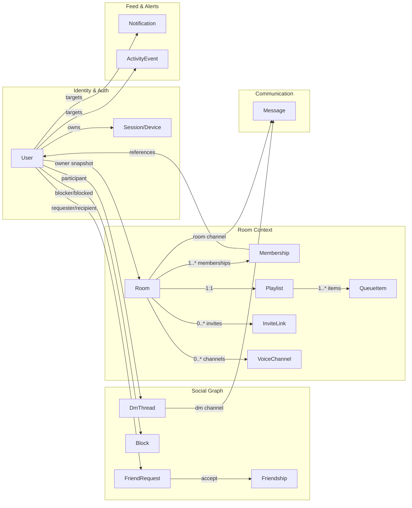
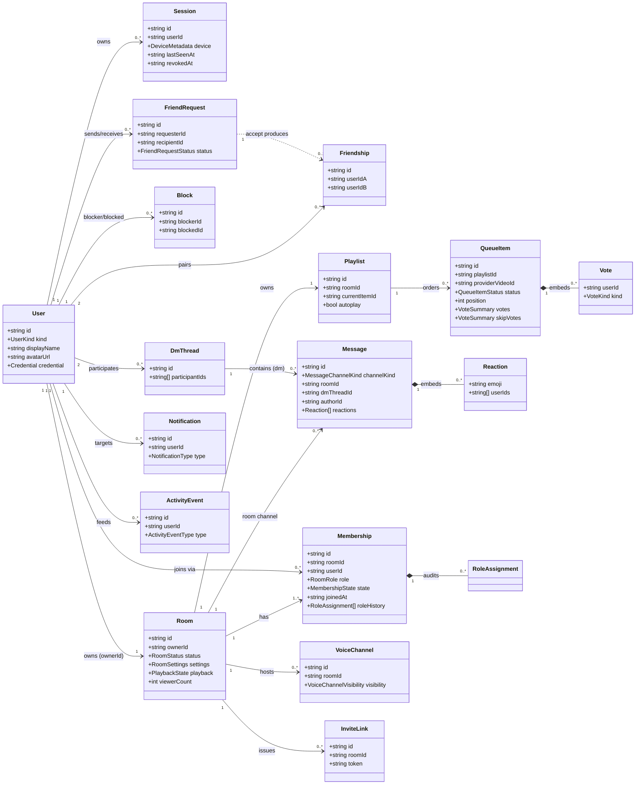
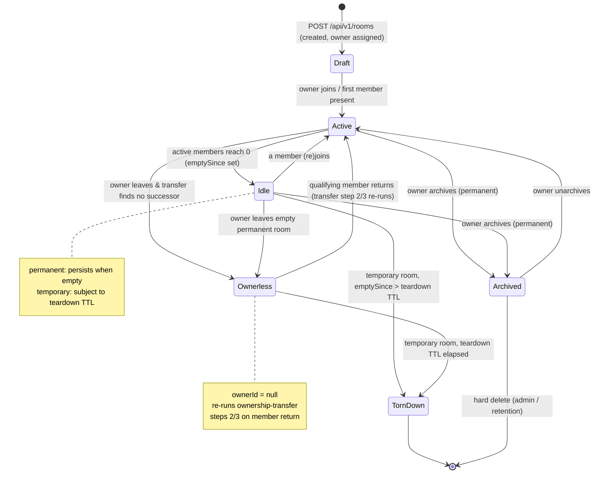
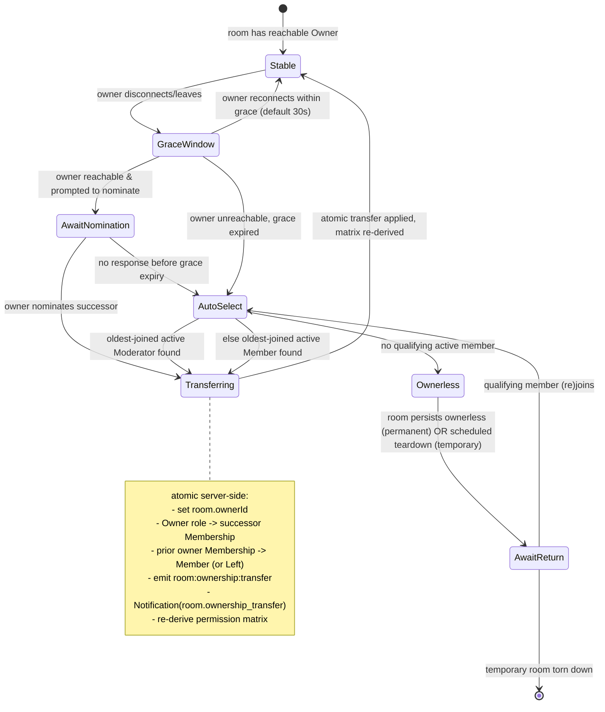
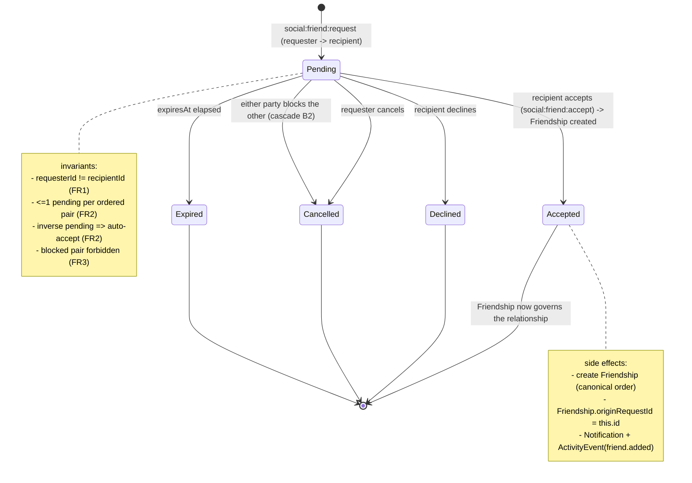
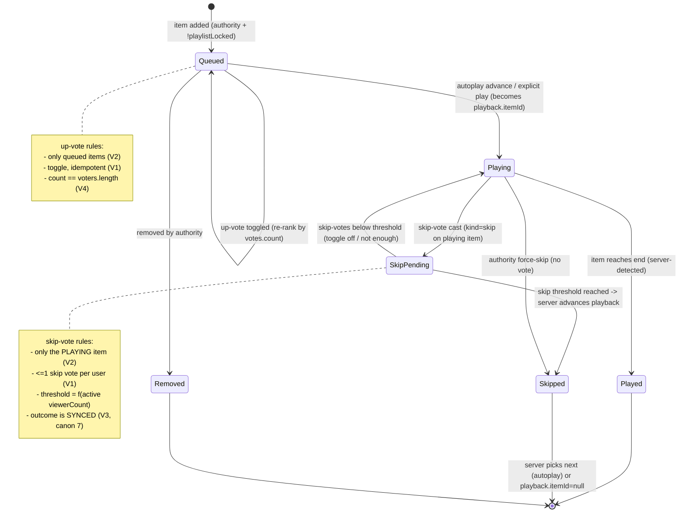

# Cowatch Domain Model

> The canonical domain model for Cowatch: aggregates, entities, relationships, invariants, and lifecycle state machines that every spec, schema, task, and test must conform to.

**Status:** CANON-DERIVED (Planning — Phase 0 Architecture; no implementation)
**Owner agent:** Backend Engineer
**Last updated: 2026-06-27**

---

## 0. Scope & Authority

This document models the **business domain** of Cowatch — the entities, the rules that bind them, and the legal transitions between their states. It is the bridge between the [Architecture Canon](../context/architecture.md) and the concrete Prisma schema (`packages/database/prisma/schema.prisma`) plus the shared TypeScript types (`packages/types`).

**Authority order on conflict:**

1. [Architecture Canon](../context/architecture.md) — wins on everything.
2. This document — wins on domain shape, aggregate boundaries, invariants, and lifecycle.
3. Downstream specs / tasks / tests / schema — must comply with both above.

This is a **planning artifact**. The TypeScript interfaces below are **illustrative shape sketches** that fix the domain vocabulary and field names; they are deliberately trimmed (no decorators, no Prisma attributes, no full method bodies). The authoritative persisted shape is the Prisma schema, which MUST be generated to match these aggregates, the [Data-Modeling Conventions](../context/architecture.md#4-data-modeling-conventions-mongodb--prisma), and the [Naming Conventions](../context/architecture.md#3-naming-conventions).

**Related documents:**

- [Architecture Canon](../context/architecture.md) — single source of truth.
- [System Architecture](./ARCHITECTURE.md) — containers, modules, data flows.
- [Permission & Roles Architecture](./PERMISSIONS.md) — role matrix, sync-authority, ownership transfer enforcement.
- [Sync Algorithm](./SYNC.md) — server-authoritative playback clock.
- [Auth Architecture](./AUTH.md) — Session / Device aggregate, token model.
- ADR-003 — [Prisma over MongoDB](../adr/ADR-003-prisma-mongodb.md) (embed/reference strategy).
- ADR-007 — [Server-authoritative playback sync](../adr/ADR-007-server-authoritative-sync.md).
- ADR-008 — [Auth / token model](../adr/ADR-008-auth-tokens.md) (Session/Device aggregate).
- Feature specs (planned): `specs/auth.md`, `specs/rooms.md`, `specs/social.md`, `specs/media.md`, `specs/chat.md`.

> Cross-links use the canonical paths per the [doc cross-link convention](../context/architecture.md#9-directory--path-map--doc-cross-links). Some ADR/spec targets are authored in later phases; links are forward-stable.

### 0.1 Conventions used in this document

- **Aggregate**: a consistency boundary. A single transaction (or single document write, MongoDB-native) mutates exactly one aggregate root. Cross-aggregate consistency is **eventual**, propagated via realtime events + background reconciliation (canon §4 denormalization policy).
- **Entity**: has identity (`id`) and a lifecycle; may be an aggregate root or a referenced/embedded child.
- **Value object**: identity-less, defined wholly by its fields (e.g. `RoomSettings`, `DeviceMetadata`, `PlaybackState`). Replaced wholesale, never patched field-by-field across the boundary.
- All `id` fields are **strings** in TypeScript (Mongo `ObjectId` serialized). Realtime/correlation ids are **ULID**. (canon §10)
- All timestamps are **UTC** ISO-8601 strings / epoch ms; `createdAt` + `updatedAt` exist on every collection; soft delete via `deletedAt?`.

---

## 1. Domain Glossary

This glossary refines the [canon glossary](../context/architecture.md#1-glossary-of-core-domain-terms) into modeling terms. Where a term also appears in canon, the definition here is **additive**, never contradictory.

| Term | Definition (modeling lens) | Aggregate role |
|---|---|---|
| **User** | An account (`registered` \| `guest`). Holds profile, presence pointer, credentials reference. Root of identity. | Aggregate root |
| **Session (Device)** | One authenticated login on one device; owns a refresh-token family + device metadata. Revocable independently. | Aggregate root |
| **Credential** | Embedded auth material on a `User`: password hash, OAuth identity links, TOTP secret, recovery codes. Never crosses the API boundary. | Embedded VO |
| **Friendship** | A mutual, accepted relationship between two distinct Users. Stored once with a canonical ordered pair. | Aggregate root |
| **FriendRequest** | A directed, pending invitation from a requester to a recipient. Resolves into a Friendship or terminal state. | Aggregate root |
| **Block** | A directed suppression: blocker hides/ignores blocked across social surfaces. | Aggregate root |
| **Room** | A persistent (`permanent`) or ephemeral (`temporary`) space for synchronized watching. Owns settings, playback authority config, lifecycle. | Aggregate root |
| **Membership** | The relationship of one User to one Room: role, join time, moderation state, denormalized user snapshot. The unit the permission model operates on. | Aggregate root |
| **RoleAssignment** | The act/record of granting or changing a Membership's `RoomRole` (e.g. promote to Moderator, ownership transfer). Modeled as an embedded audit entry on Membership + an event. | Embedded VO / event |
| **Playlist** | The ordered queue bound 1:1 to a Room. Logical aggregate root over its QueueItems; itself thin (ordering + lock + pointer). | Aggregate root |
| **QueueItem** | One YouTube media entry in a Playlist: provider id, title, duration, position, votes summary, addedBy snapshot. | Entity (child of Playlist) |
| **Vote** | A directed, single-valued reaction by one User to one QueueItem: an up-vote (queue ranking) or a skip-vote (skip the *currently playing* item). | Embedded VO (on QueueItem) |
| **PlaybackState** | Server-authoritative sync record for a Room: current item, `positionMs`, `isPlaying`, `rate`, `serverEpochMs`, authority mode. | Embedded VO (on Room) |
| **Message** | A chat message scoped to a Room channel or a DM thread. Carries embedded reactions, mentions, attachments. | Aggregate root |
| **Reaction** | An emoji reaction by a User to a Message. Capped, embedded. | Embedded VO (on Message) |
| **DmThread** | A direct-message conversation between two Users (or a small group, future). Container for DM-scoped Messages. | Aggregate root |
| **Notification** | A user-targeted feed item of a fixed `NotificationType`. Read/unread, dismissible. | Aggregate root |
| **ActivityEvent** | A chronological social event surfaced in a User's ActivityFeed (friend started a room, joined, came online…). | Aggregate root |
| **VoiceChannel** | A LiveKit-backed audio/video/screen-share channel inside a Room. Visibility `public` \| `password`. | Aggregate root |
| **InviteLink** | A shareable, optionally expiring / single-use token granting entry to a Room. | Aggregate root |
| **Presence** | A User's realtime status + current activity. Derived/ephemeral; authoritative copy lives in the realtime/presence plane, not a primary persisted aggregate. | Ephemeral projection |
| **RoomSettings** | Embedded value object on Room: visibility, password hash, sync-authority modes, locks, NSFW flag, tags, join-approval flag. | Embedded VO |

### 1.1 Enumerations (canonical)

These enums are owned by `packages/types` and cited verbatim by every downstream artifact (canon §3).

```ts
export enum UserKind { Registered = 'registered', Guest = 'guest' }

export enum PresenceStatus { Online = 'online', Idle = 'idle', Dnd = 'dnd', Offline = 'offline' }

export enum RoomVisibility { Public = 'public', Private = 'private', Password = 'password' }

export enum RoomLifetime { Permanent = 'permanent', Temporary = 'temporary' }

export enum RoomStatus { Draft = 'draft', Active = 'active', Idle = 'idle', Ownerless = 'ownerless', Archived = 'archived', TornDown = 'torn_down' }

export enum RoomRole { Owner = 'owner', Moderator = 'moderator', Member = 'member', Guest = 'guest' }

export enum SyncAuthority { OwnerOnly = 'owner_only', OwnerModerators = 'owner_moderators', Everyone = 'everyone' }

export enum MembershipState { Active = 'active', Left = 'left', Kicked = 'kicked', Banned = 'banned', Timeout = 'timeout', PendingApproval = 'pending_approval' }

export enum FriendRequestStatus { Pending = 'pending', Accepted = 'accepted', Declined = 'declined', Cancelled = 'cancelled', Expired = 'expired' }

export enum QueueItemStatus { Queued = 'queued', Playing = 'playing', Played = 'played', Skipped = 'skipped', Removed = 'removed' }

export enum VoteKind { Up = 'up', Skip = 'skip' }

export enum MessageChannelKind { Room = 'room', Dm = 'dm' }

export enum VoiceChannelVisibility { Public = 'public', Password = 'password' }

export enum NotificationType {
  FriendOnline = 'friend.online',
  FriendRoomStarted = 'friend.room_started',
  FriendInvitation = 'friend.invitation',
  Mention = 'mention',
  Dm = 'dm',
  RoomOwnershipTransfer = 'room.ownership_transfer',
  RoomUserJoined = 'room.user_joined',
}

export enum ActivityEventType {
  FriendOnline = 'friend.online',
  FriendRoomStarted = 'friend.room_started',
  FriendJoinedRoom = 'friend.joined_room',
  FriendAdded = 'friend.added',
}
```

> `NotificationType` values match the canon's [Notification types](../context/architecture.md#1-glossary-of-core-domain-terms) verbatim. `RoomStatus`, `MembershipState`, `FriendRequestStatus`, and `QueueItemStatus` are introduced here to model the lifecycle state machines in §6; they are domain-derived and additive.

---

## 2. Aggregate Map

Cowatch is partitioned into **aggregates** (consistency boundaries). Reads cross boundaries freely via denormalized snapshots; writes do not.



**Aggregate roots:** `User`, `Session`, `Friendship`, `FriendRequest`, `Block`, `Room`, `Membership`, `Playlist`, `Message`, `DmThread`, `Notification`, `ActivityEvent`, `VoiceChannel`, `InviteLink`.

**Embedded (non-root):** `Credential`, `RoomSettings`, `PlaybackState`, `DeviceMetadata`, `Reaction`, `Vote`, `RoleAssignment` (audit entry), denormalized snapshots.

> **Why `Playlist` and `Membership` are separate roots from `Room`.** Canon §4 forbids embedding unbounded growing lists (members, queue items, messages). `Membership` and `QueueItem` are therefore separate collections with back-reference ids + indexes. `Playlist` is 1:1 with `Room` but is its own root so QueueItem ordering and locks mutate without contending on the Room document.

---

## 3. Aggregates & Entities

Each subsection gives the **shape sketch**, the **collection** (canon §3 `snake_case` plural), embed/reference notes, and denormalization snapshots. Invariants are consolidated in §5.

### 3.1 User

- **Collection:** `users`. Root of identity. Subtyped by `kind`.
- **Embed:** `Credential` (password hash, OAuth links, TOTP), `profile`. **Reference:** none outbound for the social graph (Friendship/Block are their own roots) to keep the User document bounded.

```ts
interface User {
  id: string;
  kind: UserKind;                       // registered | guest
  email: string | null;                 // null for guests
  emailVerifiedAt: string | null;
  username: string;                     // unique, mutable handle
  displayName: string;                  // SOURCE OF TRUTH for denorm snapshots
  avatarUrl: string | null;             // MinIO signed-URL base; SOURCE OF TRUTH
  bio: string | null;
  credential: Credential;               // embedded, never serialized to clients
  presenceStatusDefault: PresenceStatus;
  createdAt: string;
  updatedAt: string;
  deletedAt: string | null;
}

interface Credential {                  // embedded VO — server-only
  passwordHash: string | null;          // argon2/bcrypt; null for OAuth-only/guest
  oauth: { provider: 'google'; subject: string; linkedAt: string }[];
  totpSecretEnc: string | null;         // encrypted at rest
  totpEnabledAt: string | null;
  recoveryCodeHashes: string[];         // single-use
}
```

- **Denorm sources:** `displayName`, `avatarUrl`, and (where snapshotted) `username` are the **source of truth** re-fanned to `Membership`, `Message`, `QueueItem`, `Room.ownerDisplayName`. (canon §4)
- **Indexes:** `email` unique (partial, where not null), `username` unique.

### 3.2 Session (Device)

- **Collection:** `sessions`. One per device. Owns a rotating refresh-token family. See [AUTH.md](./AUTH.md) and [canon §8](../context/architecture.md#8-auth--token-model-adr-008).

```ts
interface Session {
  id: string;                           // == JWT `sid`
  userId: string;                       // ref users
  device: DeviceMetadata;               // embedded VO
  refreshTokenFamily: { currentHash: string; rotatedAt: string; reuseDetectedAt: string | null };
  lastSeenAt: string;
  revokedAt: string | null;
  createdAt: string;
  updatedAt: string;
}

interface DeviceMetadata {              // embedded VO
  label: string | null;                 // user-facing ("Chrome on Mac")
  userAgent: string;
  ipRegion: string;                     // coarse region only (privacy)
  platform: 'web' | 'desktop';
}
```

- **Indexes:** `sessions (userId)`. (canon §4)

### 3.3 Friendship

- **Collection:** `friendships`. A single mutual record per pair. **Canonical ordering** prevents duplicates: store with `userIdA < userIdB` (lexicographic on ObjectId string).

```ts
interface Friendship {
  id: string;
  userIdA: string;                      // canonical: userIdA < userIdB
  userIdB: string;
  becameFriendsAt: string;
  originRequestId: string | null;       // the FriendRequest that produced this
  createdAt: string;
  updatedAt: string;
}
```

- **Indexes:** `friendships (userIdA, userIdB)` **unique**. (canon §4)

### 3.4 FriendRequest

- **Collection:** `friend_requests`. Directed, pending invitation. Resolves to a Friendship or a terminal status. Lifecycle in [§6.3](#63-friend-request-lifecycle).

```ts
interface FriendRequest {
  id: string;
  requesterId: string;                  // ref users
  recipientId: string;                  // ref users
  status: FriendRequestStatus;          // pending | accepted | declined | cancelled | expired
  message: string | null;               // optional note
  respondedAt: string | null;
  expiresAt: string | null;
  createdAt: string;
  updatedAt: string;
}
```

- **Indexes:** unique partial on `(requesterId, recipientId)` where `status = pending`; `(recipientId, status)` for inbox queries.

### 3.5 Block

- **Collection:** `blocks`. Directed suppression. Independent of Friendship; blocking auto-dissolves any Friendship/FriendRequest (§5.4).

```ts
interface Block {
  id: string;
  blockerId: string;                    // ref users
  blockedId: string;                    // ref users
  reason: string | null;
  createdAt: string;
  updatedAt: string;
}
```

- **Indexes:** `blocks (blockerId, blockedId)` unique; `(blockedId)` for "am I blocked by" filters.

### 3.6 Room

- **Collection:** `rooms`. Aggregate root over its settings, playback authority config, and lifecycle. Lifecycle in [§6.1](#61-room-lifecycle).
- **Embed:** `RoomSettings`, `PlaybackState`. **Reference (separate roots):** memberships, playlist, voice channels, invite links, messages — all unbounded or independently queried.

```ts
interface Room {
  id: string;
  slug: string;                         // url-safe unique
  name: string;
  description: string | null;
  lifetime: RoomLifetime;               // permanent | temporary
  status: RoomStatus;                   // draft|active|idle|ownerless|archived|torn_down
  ownerId: string | null;               // null only while `ownerless`
  ownerDisplayName: string | null;      // DENORM <- User.displayName
  settings: RoomSettings;               // embedded VO
  playback: PlaybackState;              // embedded VO (server-authoritative)
  playlistId: string;                   // 1:1 ref playlists
  // discovery denorm snapshots:
  viewerCount: number;                  // DENORM <- count(active memberships)
  currentVideoTitle: string | null;     // DENORM <- playing QueueItem.title
  tags: string[];
  isNsfw: boolean;
  lastActiveAt: string;                 // drives idle/teardown timers
  emptySince: string | null;            // set when active members reach 0
  createdAt: string;
  updatedAt: string;
  deletedAt: string | null;
}

interface RoomSettings {                // embedded VO — replaced wholesale
  visibility: RoomVisibility;           // public | private | password
  passwordHash: string | null;          // required iff visibility = password
  playbackAuthority: SyncAuthority;     // owner_only | owner_moderators | everyone
  playlistAuthority: SyncAuthority;     // separately configurable (canon §6)
  chatLocked: boolean;
  playlistLocked: boolean;
  joinApprovalRequired: boolean;
  ownershipGraceMs: number;             // default 30000 (canon §6)
}

interface PlaybackState {               // embedded VO — server-authoritative (canon §7)
  itemId: string | null;                // ref queue_items (currently playing)
  positionMs: number;
  isPlaying: boolean;
  rate: number;                         // 0.25..2.0
  serverEpochMs: number;                // server stamp at last state change
  updatedByUserId: string | null;
}
```

- **Denorm sources:** `ownerDisplayName ← User.displayName`; `viewerCount ← count(active Membership)`; `currentVideoTitle ← QueueItem.title` of the playing item. All eventually consistent; re-fanned via realtime (`room:settings:update`, `playback:sync`) + reconciliation. (canon §4)
- **Indexes:** `rooms (visibility, isActive)` for discovery — modeled here as `(visibility, status)`; `slug` unique; `tags` multikey; text search index on `name`/`tags`/`currentVideoTitle`.

> `isActive` in canon's mandatory discovery index maps to the derived predicate `status ∈ {active, idle}`. The Prisma schema MAY persist a boolean `isActive` denorm to satisfy the exact compound index `(visibility, isActive)`; this doc treats it as derived from `status`.

### 3.7 Membership

- **Collection:** `memberships`. The unit the permission model operates on ([PERMISSIONS.md](./PERMISSIONS.md)). One row per (User, Room). Lifecycle blends with room/permission state — see `MembershipState`.

```ts
interface Membership {
  id: string;
  roomId: string;                       // ref rooms
  userId: string;                       // ref users
  role: RoomRole;                       // owner | moderator | member | guest
  state: MembershipState;               // active|left|kicked|banned|timeout|pending_approval
  // denorm snapshot of the user (canon §4):
  userDisplayName: string;              // DENORM <- User.displayName
  userAvatarUrl: string | null;         // DENORM <- User.avatarUrl
  joinedAt: string;                     // drives ownership-transfer "oldest joined"
  lastActiveAt: string;
  timeoutUntil: string | null;          // set while state = timeout
  bannedReason: string | null;
  roleHistory: RoleAssignment[];        // embedded audit (bounded)
  createdAt: string;
  updatedAt: string;
}

interface RoleAssignment {              // embedded audit VO (RoleAssignment entity, recorded inline)
  fromRole: RoomRole | null;            // null for initial join
  toRole: RoomRole;
  assignedByUserId: string | null;      // null for system (transfer algorithm)
  reason: 'join' | 'promote' | 'demote' | 'ownership_transfer' | 'system';
  at: string;
}
```

- **Denorm sources:** `userDisplayName ← User.displayName`, `userAvatarUrl ← User.avatarUrl`. (canon §4, named explicitly in canon.)
- **Indexes:** `memberships (roomId, userId)` **unique**; `(roomId, state, role, joinedAt)` to support the ownership-transfer "oldest-joined active Moderator/Member" query; `(userId, state)` for "my rooms".

> **RoleAssignment** is listed as a distinct entity in the assignment. It has identity-less audit semantics, so it is modeled as an **embedded, bounded** `RoleAssignment[]` on Membership (the consistency boundary that owns `role`), plus a realtime event (`room:ownership:transfer`, future `social:role:change`). It is never a standalone collection.

### 3.8 Playlist

- **Collection:** `playlists`. 1:1 with Room. Thin root that owns ordering + lock + the playing pointer; QueueItems are separate (unbounded).

```ts
interface Playlist {
  id: string;
  roomId: string;                       // 1:1 ref rooms (unique)
  currentItemId: string | null;        // ref queue_items (playing pointer)
  autoplay: boolean;
  itemCount: number;                    // DENORM <- count(queue_items not removed)
  createdAt: string;
  updatedAt: string;
}
```

- **Indexes:** `playlists (roomId)` unique.

### 3.9 QueueItem

- **Collection:** `queue_items`. Child entity of Playlist; references it. Holds the embedded `Vote` summary + per-user vote records (capped/bounded by room size in practice; large rooms may externalize — see Open Questions). Lifecycle/voting in [§6.4](#64-queue-item-voting--skip-voting).

```ts
interface QueueItem {
  id: string;
  playlistId: string;                   // ref playlists
  roomId: string;                       // denorm ref for direct room-scoped queries
  provider: 'youtube';
  providerVideoId: string;
  title: string;
  channelTitle: string | null;
  durationMs: number;
  thumbnailUrl: string | null;
  position: number;                     // fractional/gap ordering for cheap reorders
  status: QueueItemStatus;              // queued|playing|played|skipped|removed
  addedByUserId: string;                // ref users
  addedByDisplayName: string;           // DENORM <- User.displayName
  votes: VoteSummary;                   // embedded aggregate of Vote[]
  skipVotes: VoteSummary;               // embedded; skip-vote tally for THIS item
  createdAt: string;
  updatedAt: string;
}

interface VoteSummary {                 // embedded VO
  count: number;                        // derived from voters length
  voters: Vote[];                       // bounded embedded list of per-user votes
}

interface Vote {                        // embedded VO — the Vote entity, inline
  userId: string;
  kind: VoteKind;                       // up | skip
  at: string;
}
```

- **Denorm sources:** `addedByDisplayName ← User.displayName` (canon §4, named). `votes.count`/`skipVotes.count` ← derived from `voters.length`.
- **Indexes:** `queue_items (playlistId, status, position)` for ordered render; `(roomId, status)` for the playing item; `(playlistId, providerVideoId)` to dedupe.

> **Vote** is listed as a distinct entity. It is single-valued per (User, QueueItem, kind) and read with its parent, so it is modeled **embedded** inside QueueItem's `VoteSummary`, never as a top-level collection. Up-votes influence **queue ranking**; skip-votes are scoped to the **currently playing** item only.

### 3.10 Message

- **Collection:** `messages`. Aggregate root, channel-scoped (Room channel **or** DM thread). Unbounded ⇒ separate collection with back-reference (canon §4). Reactions are embedded (capped).

```ts
interface Message {
  id: string;
  channelKind: MessageChannelKind;      // room | dm
  roomId: string | null;                // set iff channelKind = room
  dmThreadId: string | null;            // set iff channelKind = dm
  authorId: string;                     // ref users
  authorDisplayName: string;            // DENORM <- User.displayName
  authorAvatarUrl: string | null;       // DENORM <- User.avatarUrl
  body: string;
  mentions: string[];                   // userIds mentioned (drives `mention` notif)
  attachments: Attachment[];            // GIF/emoji/image refs (bounded)
  reactions: Reaction[];                // embedded, capped
  editedAt: string | null;
  createdAt: string;
  updatedAt: string;
  deletedAt: string | null;             // soft delete (chat:message:delete)
}

interface Attachment {                  // embedded VO
  kind: 'gif' | 'emoji' | 'image';
  url: string;                          // GIF provider URL or MinIO signed URL
  meta: Record<string, string | number>;
}

interface Reaction {                    // embedded VO — the Reaction entity, inline
  emoji: string;                        // unicode or :shortcode:
  userIds: string[];                    // who reacted with this emoji (capped)
}
```

- **Denorm sources:** `authorDisplayName`, `authorAvatarUrl ← User` (canon §4, named).
- **Indexes:** `messages (roomId, createdAt)` (canon mandatory); `(dmThreadId, createdAt)`; multikey `mentions`.

### 3.11 DmThread

- **Collection:** `dm_threads`. Container for DM-scoped Messages. Participant pair canonical-ordered like Friendship.

```ts
interface DmThread {
  id: string;
  participantIds: string[];             // 2 (group DMs future); canonical-sorted
  lastMessageAt: string | null;
  lastMessagePreview: string | null;    // DENORM <- latest Message.body (truncated)
  createdAt: string;
  updatedAt: string;
}
```

- **Indexes:** `dm_threads (participantIds)` multikey; unique on the sorted pair for 1:1 threads.

### 3.12 Notification

- **Collection:** `notifications`. User-targeted feed item of a fixed `NotificationType` (canon glossary, verbatim).

```ts
interface Notification {
  id: string;
  userId: string;                       // recipient, ref users
  type: NotificationType;               // friend.online | ... | room.user_joined
  actorId: string | null;              // who caused it (ref users)
  roomId: string | null;               // context room when applicable
  data: Record<string, unknown>;        // type-specific payload
  readAt: string | null;
  createdAt: string;
  updatedAt: string;
}
```

- **Indexes:** `notifications (userId, readAt, createdAt)` (canon mandatory) — supports unread-first feed.

### 3.13 ActivityEvent

- **Collection:** `activity_events`. Chronological social stream item for a User's ActivityFeed. Distinct from Notification: ActivityEvents are ambient feed (e.g. "friend started a room"); Notifications are actionable/alerting. Some events fan into both.

```ts
interface ActivityEvent {
  id: string;
  userId: string;                       // feed owner, ref users
  type: ActivityEventType;
  actorId: string;                     // friend who acted
  actorDisplayName: string;            // DENORM <- User.displayName
  roomId: string | null;
  data: Record<string, unknown>;
  createdAt: string;
  updatedAt: string;
}
```

- **Indexes:** `activity_events (userId, createdAt)`.

### 3.14 VoiceChannel

- **Collection:** `voice_channels`. LiveKit-backed channel inside a Room. See [LIVEKIT.md](./LIVEKIT.md).

```ts
interface VoiceChannel {
  id: string;
  roomId: string;                       // ref rooms
  name: string;
  visibility: VoiceChannelVisibility;   // public | password
  passwordHash: string | null;          // required iff visibility = password
  livekitRoomName: string;              // LiveKit room identifier
  allowVideo: boolean;
  allowScreenShare: boolean;
  participantCount: number;             // DENORM <- LiveKit webhook/state
  createdAt: string;
  updatedAt: string;
  deletedAt: string | null;
}
```

- **Indexes:** `voice_channels (roomId)`.

### 3.15 InviteLink

- **Collection:** `invite_links`. Shareable Room-entry token, optionally expiring / single-use.

```ts
interface InviteLink {
  id: string;
  roomId: string;                       // ref rooms
  token: string;                        // opaque, unique, url-safe (hashed at rest)
  createdByUserId: string;
  maxUses: number | null;               // null = unlimited
  useCount: number;
  expiresAt: string | null;
  revokedAt: string | null;
  createdAt: string;
  updatedAt: string;
}
```

- **Indexes:** `invite_links (token)` unique; `(roomId)`.

---

## 4. Entity Relationship Class Diagram



**Legend:** `*--` = composition (embedded value object, lives and dies with the parent aggregate). `-->` = reference by id (separate collection / back-reference). `..>` = transition/derivation (an accepted FriendRequest *produces* a Friendship; it does not contain it).

---

## 5. Invariants per Aggregate

Invariants are enforced **server-side** (NestJS services + DTO validation + Prisma constraints). Each is a MUST. Violations return the standard REST/realtime error envelope (canon §10) with the listed `code`.

### 5.1 User

- **U1** A `registered` User MUST have a unique `username` and (after verification) a unique `email`. `guest` Users MUST have `email = null` and `credential.passwordHash = null`. → `INVALID_USER_STATE`.
- **U2** A guest may upgrade to registered exactly once; upgrade sets `kind = registered`, attaches credentials, and preserves `id` (no new account). Downgrade is forbidden. → `GUEST_UPGRADE_INVALID`.
- **U3** `credential` (passwordHash, totpSecret, recovery codes) MUST NEVER cross the API/WS boundary or appear in any snapshot/event.
- **U4** `displayName` and `avatarUrl` are the **source of truth**; any change MUST enqueue a denorm re-fan to `memberships`, `messages`, `queue_items`, and `rooms.ownerDisplayName` (eventually consistent). → background reconcile.
- **U5** Soft delete (`deletedAt`) anonymizes denorm snapshots on next reconcile; the User row is retained for referential integrity of historical Messages/QueueItems.

### 5.2 Session (Device)

- **S1** A Session belongs to exactly one User and MUST carry exactly one **current** refresh-token hash (`refreshTokenFamily.currentHash`). → `SESSION_INVALID`.
- **S2** Presenting a **consumed** refresh token (hash mismatch after rotation) MUST set `reuseDetectedAt` and revoke the **entire family** for that Session (theft response, canon §8). → `REFRESH_REUSE_DETECTED`.
- **S3** A revoked Session (`revokedAt != null`) MUST reject all refresh/access derived from it; its access tokens are honored only until natural 15-minute expiry.
- **S4** Guests MUST NOT persist a refresh cookie beyond browser session (canon §8); a guest Session has no durable `refreshTokenFamily.currentHash`.
- **S5** "Revoke all others" preserves exactly the current Session; "logout" revokes the current Session only.

### 5.3 Friendship

- **FS1** A Friendship MUST be stored with `userIdA < userIdB` (canonical order) and MUST be unique on `(userIdA, userIdB)`. → `FRIENDSHIP_EXISTS`.
- **FS2** `userIdA != userIdB` — no self-friendship. → `INVALID_FRIENDSHIP`.
- **FS3** A Friendship MUST NOT exist if an active `Block` exists in either direction between the pair (§5.4 dissolves on block). → `BLOCKED`.
- **FS4** A Friendship is created **only** by accepting a `FriendRequest`; `originRequestId` points to it.

### 5.4 FriendRequest & Block

- **FR1** `requesterId != recipientId`. → `INVALID_FRIEND_REQUEST`.
- **FR2** At most **one** `pending` FriendRequest may exist for an ordered `(requesterId, recipientId)` pair. A reverse pending request that matches the inverse pair auto-accepts into a Friendship (mutual intent). → `FRIEND_REQUEST_EXISTS`.
- **FR3** A FriendRequest MUST NOT be creatable if either party `Block`s the other. → `BLOCKED`.
- **FR4** Transitions are terminal: `pending → {accepted | declined | cancelled | expired}`; no resurrection (a new request is a new document). (See [§6.3](#63-friend-request-lifecycle).)
- **B1** `blockerId != blockedId`. → `INVALID_BLOCK`.
- **B2** Creating a Block MUST atomically: cancel any pending FriendRequest in either direction, and dissolve any Friendship between the pair. (cascade)
- **B3** A Block is unique on `(blockerId, blockedId)`; the reverse direction is an independent Block.

### 5.5 Room

- **R1** `visibility = password` ⇒ `settings.passwordHash != null`; any other visibility ⇒ `passwordHash = null`. → `INVALID_ROOM_SETTINGS`.
- **R2** A Room has at most **one** Owner Membership at any instant, identified by `ownerId`. `ownerId = null` ⇔ `status = ownerless`. → `ROOM_OWNER_INVARIANT`.
- **R3** `status = active | idle` ⇒ at least the playlist exists and the room is discoverable per visibility; `status ∈ {archived, torn_down}` ⇒ no new joins accepted. → `ROOM_NOT_JOINABLE`.
- **R4** `playback.itemId` MUST reference a `queue_items` row whose `status = playing` and whose `playlistId = room.playlistId`, or be `null` when the queue is empty/idle. → `PLAYBACK_STATE_INVALID`.
- **R5** Only the server sets `playback.serverEpochMs`; mutating `playback:*` is accepted only from an authority-qualified member per `settings.playbackAuthority` (canon §6/§7), else `FORBIDDEN_SYNC`.
- **R6** `viewerCount` and `currentVideoTitle` are denorm projections; they MUST never be authoritative for permission or sync decisions.
- **R7** A `temporary` Room with `emptySince` older than the teardown TTL transitions to `torn_down` (see [§6.1](#61-room-lifecycle)); a `permanent` empty Room transitions to `idle`/`ownerless`, never auto-torn-down.

### 5.6 Membership & RoleAssignment

- **M1** Unique on `(roomId, userId)` — a User holds at most one Membership per Room. → `MEMBERSHIP_EXISTS`.
- **M2** Exactly one Membership in a Room has `role = Owner` while `room.status != ownerless`; that Membership's `userId = room.ownerId`. → `ROOM_OWNER_INVARIANT`.
- **M3** Role precedence for permission derivation is `Owner > Moderator > Member > Guest`; the effective permission set is computed from `role` + `RoomSettings` per [PERMISSIONS.md](./PERMISSIONS.md) / [canon §6](../context/architecture.md#6-permission-model). Membership state must be `active` for any action permission to apply.
- **M4** `state = banned` ⇒ the User MUST NOT re-join the same Room (re-entry blocked until unban). `state = timeout` ⇒ chat/mutating actions blocked until `timeoutUntil`. → `MEMBER_BANNED` / `MEMBER_TIMED_OUT`.
- **M5** Every `role` change appends a `RoleAssignment` audit entry (`roleHistory`) and emits the corresponding realtime event; ownership changes additionally emit `room:ownership:transfer` + `Notification(room.ownership_transfer)` (canon §6).
- **M6** `userDisplayName` / `userAvatarUrl` are denorm snapshots; never the source of truth.

### 5.7 Playlist & QueueItem

- **P1** Exactly **one** Playlist per Room (`playlists (roomId)` unique). → `PLAYLIST_INVARIANT`.
- **P2** At most **one** QueueItem per Playlist has `status = playing`; it equals `playlist.currentItemId` and `room.playback.itemId`. → `PLAYBACK_STATE_INVALID`.
- **P3** QueueItem `position` is unique-enough for deterministic order within `status = queued`; reorders update `position` only (gap/fractional indexing) and require `playlist`/room playlist-authority + `playlistLocked = false`. → `FORBIDDEN` / `PLAYLIST_LOCKED`.
- **P4** Adding/removing items requires playlist authority per `RoomSettings.playlistAuthority` and the playlist-control permission (canon §6); Guests cannot add. → `FORBIDDEN`.
- **P5** Terminal item statuses (`played`, `skipped`, `removed`) are immutable except by autoplay advance/reinsert flows; a `removed` item is excluded from `itemCount` and ordering.

### 5.8 Vote (embedded)

- **V1** At most **one** `Vote` per `(QueueItem, userId, kind)`; re-voting the same kind is a toggle (remove), not a duplicate. → idempotent.
- **V2** `kind = up` votes apply to `queued` items and influence ranking; `kind = skip` votes apply **only** to the `playing` item and tally toward the skip threshold.
- **V3** A skip-vote outcome (threshold reached) is a **synced** event (canon §7) and MUST be applied server-side, advancing playback; clients never decide skip locally. (See [§6.4](#64-queue-item-voting--skip-voting).)
- **V4** `VoteSummary.count` MUST equal `voters.length` after every mutation (derived invariant).
- **V5** A banned/timed-out or non-active Member's votes are rejected/ignored. → `FORBIDDEN`.

### 5.9 Message, Reaction, DmThread

- **MSG1** Exactly one channel target: `channelKind = room` ⇒ `roomId != null, dmThreadId = null`; `channelKind = dm` ⇒ `dmThreadId != null, roomId = null`. → `INVALID_MESSAGE_TARGET`.
- **MSG2** Room-channel sends require active Membership and `chatLocked = false` (or Owner/Moderator override); Guests gated by `chatLocked` (canon §6). → `CHAT_LOCKED` / `FORBIDDEN`.
- **MSG3** DM sends require the author be a `participantId` of the thread AND no active Block between participants. → `FORBIDDEN` / `BLOCKED`.
- **MSG4** `mentions` referencing valid co-members generate `Notification(mention)`; a DM generates `Notification(dm)`.
- **MSG5** `reactions` are capped (bounded embedded list); a User appears at most once per `emoji`. Edits set `editedAt`; deletes are soft (`deletedAt`).
- **DM1** `participantIds` is canonical-sorted and (for 1:1) unique; `participantIds.length >= 2`.

### 5.10 Notification & ActivityEvent

- **N1** `type` MUST be one of the canonical `NotificationType` values (canon glossary) — no ad-hoc types. → `INVALID_NOTIFICATION_TYPE`.
- **N2** `userId` is the recipient; `actorId`/`roomId` are populated per type. Notifications are append-only; only `readAt` mutates.
- **N3** Notifications/ActivityEvents MUST NOT be generated toward a User who `Block`s the actor.
- **AE1** ActivityEvents are ambient feed items; they MUST NOT be the sole transport for actionable alerts (those are Notifications). Some sources fan into both.

### 5.11 VoiceChannel & InviteLink

- **VC1** `visibility = password` ⇒ `passwordHash != null`. Joining requires room Membership (active) + channel password if set. → `INVALID_VOICE_SETTINGS` / `FORBIDDEN`.
- **VC2** `livekitRoomName` is unique per VoiceChannel; `participantCount` is a denorm projection from LiveKit webhooks, never authoritative for permissions.
- **IL1** An InviteLink is valid iff `revokedAt = null` AND (`expiresAt = null` OR now < `expiresAt`) AND (`maxUses = null` OR `useCount < maxUses`). Otherwise entry is rejected. → `INVITE_INVALID` / `INVITE_EXPIRED`.
- **IL2** Consuming a single-use link (`maxUses = 1`) MUST atomically increment `useCount` and reject concurrent second use.

---

## 6. State Machines

All transitions are **server-driven**. Each diagram is authoritative for the legal states/edges of its aggregate; specs and tasks MUST NOT introduce states absent here without an ADR.

### 6.1 Room Lifecycle



- **Guards:** `temporary` rooms are the only ones that reach `TornDown` automatically (R7). `permanent` rooms persist as `Idle`/`Ownerless`. `Archived` is an explicit owner action and blocks joins (R3).
- **Effects:** entering `Active` may emit `room:member:join`/presence updates; `TornDown` triggers cleanup of memberships, playlist, voice channels, invite links (cascade), and a teardown system event.

### 6.2 Ownership Transfer

Triggered on Owner disconnect/leave (canon §6 algorithm). This is a **sub-machine** of the Room while it resolves who holds `Owner`.



- **Algorithm mapping (canon §6):** step 1 = `GraceWindow → AwaitNomination → Transferring`; step 2 = `AutoSelect → Moderator`; step 3 = `AutoSelect → Member`; step 4 = `Ownerless` (temporary ⇒ teardown, permanent ⇒ `AwaitReturn`).
- **Atomicity:** `Transferring` is a single server-side critical section; `room:ownership:transfer` and the notification are emitted only after the role swap commits (M5).

### 6.3 Friend-Request Lifecycle



- **Terminal & non-resurrecting (FR4):** a request never returns to `Pending`; re-friending creates a **new** FriendRequest document.
- **Mutual-intent shortcut (FR2):** if `B` already has a `pending` request to `A` and `A` sends to `B`, the server auto-accepts both into one Friendship rather than creating a second pending request.

### 6.4 Queue-Item Voting & Skip-Voting

Two coupled lifecycles on `QueueItem`: its **playback status** and its **vote tallies**. Up-votes affect ranking of `queued` items; skip-votes affect only the `playing` item.



- **Authority:** entering `Playing`, `Skipped` (force), and any reorder requires playlist/playback authority per `RoomSettings` (P3/P4). Skip-vote **threshold outcome** is applied by the server and broadcast as a synced playback advance (V3).
- **Advance on terminal:** on `Played`/`Skipped`, the server consults `Playlist.autoplay` + ranking to select the next `queued` item (highest up-votes, then `position`), sets it `Playing`, updates `playback.itemId`/`serverEpochMs`, and emits `playback:sync`.

---

## 7. Denormalization Snapshot Registry

Single source of truth for every denormalized field (canon §4 requires each be documented at its definition). All are **eventually consistent**; the owning aggregate is authoritative.

| Snapshot field | Lives on | Source of truth | Re-fan trigger |
|---|---|---|---|
| `userDisplayName`, `userAvatarUrl` | Membership | User.displayName / avatarUrl | User profile update → reconcile |
| `authorDisplayName`, `authorAvatarUrl` | Message | User.displayName / avatarUrl | Profile update (historical msgs may lag) |
| `addedByDisplayName` | QueueItem | User.displayName | Profile update → reconcile |
| `ownerId`, `ownerDisplayName` | Room | Membership(Owner) / User.displayName | Ownership transfer / profile update |
| `currentVideoTitle` | Room | playing QueueItem.title | Playback advance |
| `viewerCount` | Room | count(active Membership) | Join/leave events |
| `isActive` (optional) | Room | derived from `status ∈ {active,idle}` | Status transition |
| `itemCount` | Playlist | count(queue_items ≠ removed) | Add/remove item |
| `votes.count`, `skipVotes.count` | QueueItem | `voters.length` | Each vote mutation (synchronous) |
| `participantCount` | VoiceChannel | LiveKit room state/webhook | LiveKit participant events |
| `lastMessagePreview`, `lastMessageAt` | DmThread | latest Message | New DM message |
| `actorDisplayName` | ActivityEvent | User.displayName | Snapshot at write (immutable feed) |

---

## 8. Cross-Aggregate Consistency Rules

- **Write isolation:** one logical operation mutates one aggregate root transactionally; cross-aggregate effects (denorm re-fan, notification/activity emission, playback broadcast) are **eventual**, carried by realtime events + a reconciliation job. (canon §4)
- **Correlation:** every operation carries one `correlationId` (ULID) across REST + realtime + logs (canon §10), enabling end-to-end tracing of an aggregate write and its downstream fan-out.
- **Ordering guarantees:** within a Room topic, the realtime layer preserves per-topic order; `playback:sync` is the periodic reconciler that corrects any client divergence (canon §7) — denorm drift never affects sync authority (R6).
- **Idempotency:** vote toggles (V1), invite consumption (IL2), friend mutual-intent (FR2), and ownership transfer (M5) are idempotent or atomically guarded against double-apply.

---

## 9. Mapping to Storage & Types

- **Collections (canon §3, `snake_case` plural):** `users`, `sessions`, `rooms`, `memberships`, `playlists`, `queue_items`, `messages`, `dm_threads`, `notifications`, `activity_events`, `voice_channels`, `friendships`, `friend_requests`, `blocks`, `invite_links`. Each Prisma model uses `@@map` to enforce these names.
- **Type ownership:** all interfaces/enums above are owned by `packages/types` and consumed (never duplicated) by `apps/server`, `packages/sdk`, `packages/realtime`, and the web/desktop apps (canon §3).
- **Schema authority:** `packages/database/prisma/schema.prisma` is the single owner of the persisted shape and MUST implement these aggregates, embed/reference choices, indexes (canon §4 mandatory set), `createdAt`/`updatedAt`, and `deletedAt?` soft-delete.
- **Realtime payloads:** mutations/state in §6 surface as canon §3 events (`room:*`, `playback:*`, `chat:*`, `social:*`, `notification:new`, `voice:*`) wrapped in the `RealtimeEnvelope` (canon §5); payload types suffix `Event`/`Payload`.

---

## 10. Open Questions

> Genuinely undecided items, each with a recommendation. Resolve via ADR before the dependent feature's implementation phase.

1. **Large-room vote storage.** Embedding `Vote[]` in `QueueItem` is bounded by room size; very large public rooms (thousands of viewers) could bloat the document.
   - **Recommendation:** keep embedded for v1 (typical rooms are small); add a `votes` overflow collection + a cap threshold (e.g. > 200 voters externalize) as a later ADR if discovery rooms scale.
2. **ActivityEvent vs Notification overlap.** Several sources (`friend.online`, `friend.room_started`) appear in both lists.
   - **Recommendation:** treat Notification as the actionable/alerting surface and ActivityEvent as the ambient feed; a single domain event fans into both via a `feed-projection` service. Document the fan-out matrix in `specs/social.md`.
3. **Group DMs.** `DmThread.participantIds` is modeled as an array to allow future group DMs, but the SPEC scopes DMs to 1:1.
   - **Recommendation:** ship 1:1 only (unique sorted-pair constraint); keep the array shape so group DMs need no migration. Gate behind an ADR when prioritized.
4. **Guest persistence & cleanup.** Guest Users/Sessions are ephemeral; retention of their Messages/QueueItems after session end is unspecified.
   - **Recommendation:** retain content with anonymized denorm snapshots (U5) and a TTL sweep on orphaned guest accounts; specify TTL in `specs/auth.md`.
5. **Room `slug` vs `id` in routes.** Canon routes use `:roomId`; a human `slug` is modeled for sharable URLs.
   - **Recommendation:** route on `:roomId` (canon-verbatim) and resolve `slug → id` at the edge for vanity URLs; do not change canonical route shapes.

---

_This document is subordinate to the [Architecture Canon](../context/architecture.md). Any change to an aggregate boundary, invariant, or state machine here that diverges from canon requires an ADR + history entry + context update + repomix update (R3/R4)._
