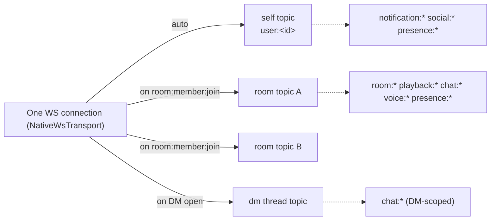
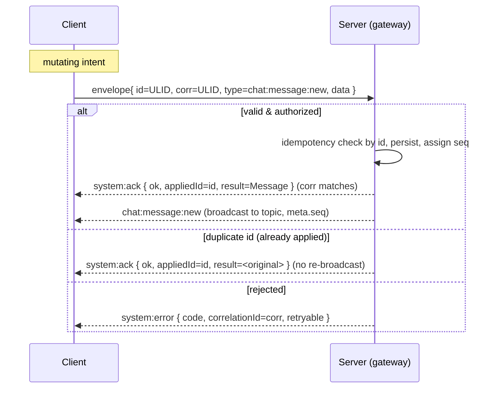
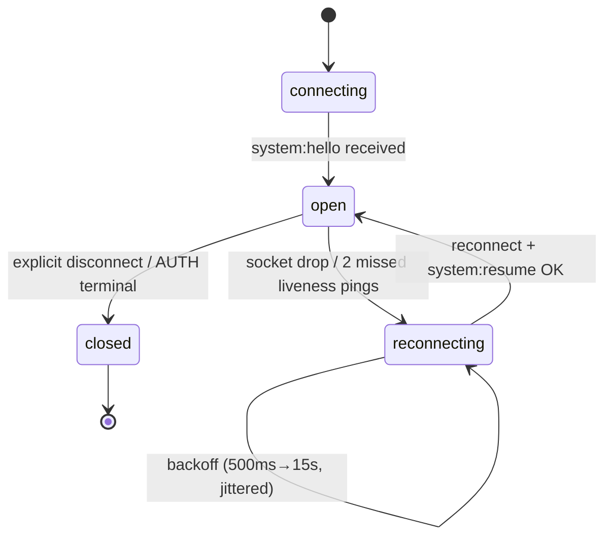
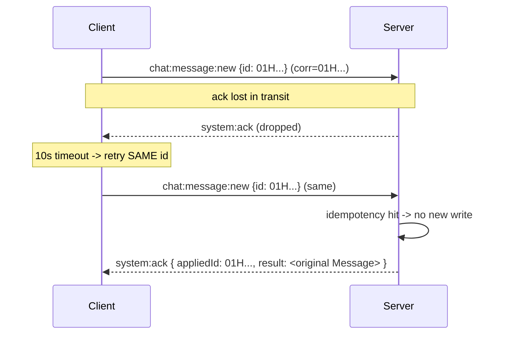

# WebSocket / Realtime Event Contract

> One-line purpose: The authoritative wire contract for every Cowatch realtime frame — namespace model, envelope, the full client↔server event catalog (rooms, playback, playlist, chat, presence/typing, voice signalling, notifications, moderation), ack semantics, reconnection/resume, ordering/idempotency, and rate limits.

- **Status:** Draft (Planning, Phase 0 → consumed by Phases 2–10)
- **Owner agent:** Realtime Engineer
- **Last updated: 2026-06-27**

**Canon & cross-links**

- [Architecture Canon](../context/architecture.md) — single source of truth ([§5 Realtime Transport](../context/architecture.md#5-realtime-transport-abstraction-adr-004), [§6 Permissions](../context/architecture.md#6-permission-model), [§7 Sync](../context/architecture.md#7-sync-algorithm), [§8 Auth](../context/architecture.md#8-auth--token-model-adr-008), [§10 Non-negotiables](../context/architecture.md#10-cross-cutting-non-negotiables))
- [ADR-004 — Custom realtime abstraction layer](../adr/ADR-004-realtime-abstraction.md)
- [ADR-007 — Server-authoritative playback sync](../adr/ADR-007-server-authoritative-playback-sync.md)
- [ADR-008 — Auth & token model](../adr/ADR-008-auth-tokens.md)
- Sibling docs: [Architecture](./ARCHITECTURE.md) · [Sync](./SYNC.md) · [Permissions](./PERMISSIONS.md) · [LiveKit / Voice](./LIVEKIT.md) · [Domain](./DOMAIN.md) · [Auth](./AUTH.md)

> **Conflict rule.** On any discrepancy between this document and the canon, the canon wins. The envelope shape, transport interface, event-name grammar, sync thresholds (2 s heartbeat; 500 ms / 2 s drift bands; 30 s ownership grace), and permission matrix referenced below are copied from canon and are **not** re-decided here.

> Amended 2026-06-27: reconciled `room:member:update` (S→C only) to the canonical B5 payload `{ roomId, userId, memberId, role?, moderationState?{ muted?, mutedUntil?, timeoutUntil? }, reason? }` with ack/ordering/idempotency notes (resolves PERM OQ-3); recorded EVENTS OQ-1 (queue mutations = `room:playlist:*` under `room`, no top-level `playlist` namespace) and EVENTS OQ-2 (moderation intents) as Resolved.

Owning NestJS module for the gateway substrate: **`RealtimeModule`** (`apps/server/src/modules/realtime/`). Domain modules (`RoomsModule`, `PlaybackModule`, `ChatModule`, `SocialModule`, `NotificationsModule`, `VoiceModule`, …) register their handlers through it. Canonical TypeScript payload types live in **`packages/types`**; the transport + envelope live in **`packages/realtime`**. No app redeclares these.

---

## 1. Scope & First Principles

This contract governs the **application realtime plane** only: the single multiplexed WebSocket carried by [`RealtimeTransport`](../context/architecture.md#5-realtime-transport-abstraction-adr-004) (default adapter `NativeWsTransport`). It does **not** govern the LiveKit A/V media plane — that is a separate connection with its own clock and authority; see [LIVEKIT.md](./LIVEKIT.md). Voice **signalling/control** events (`voice:*`) *are* in scope here because they ride the app plane; the encrypted RTP they coordinate is not.

Principles this contract commits to:

1. **One envelope, both directions.** Every frame — client→server and server→client — is a [`RealtimeEnvelope`](#3-the-standard-envelope). There are no bare/ad-hoc frames.
2. **Server is authoritative for truth, clients emit intent.** Clients send *intents* (`playback:play`, `chat:message:new`); the server validates, mutates state, and broadcasts *truth*. This is most strictly enforced for `playback:*` (canon §7) where only the server stamps `serverEpochMs`.
3. **Topic = room.** Multiplexing is by `envelope.room` (a Room id, DM thread id, or the synthetic `user:<userId>` self-topic). One physical socket, many logical topics, auto re-subscribed on reconnect.
4. **Acks are explicit and correlated.** Mutating intents use the request/ack pattern (`corr` id, `system:ack` / `system:error`). Fire-and-forget frames (`chat:typing`, `presence:update`) are never acked.
5. **Idempotency by id.** Every client-originated mutation carries a client-generated `id` (ULID). Re-delivery of the same `id` is a no-op that returns the original result. This is what makes at-least-once retransmission safe.
6. **Ordering is per-topic, server-sequenced.** The server assigns a monotonic `seq` per topic on outbound frames; clients use it to detect gaps and to drive resume.

---

## 2. Namespace / Channel Model

### 2.1 Namespaces (the `namespace` of `namespace:entity:action`)

Canon §3 fixes the eight namespaces. This contract assigns each an owning module and authority posture:

| Namespace | Owning module | Server-authoritative? | Topic dimension |
|---|---|---|---|
| `room` | `RoomsModule` / `MembershipsModule` | Yes (membership, settings) | Room id |
| `playback` | `PlaybackModule` | **Yes (hard)** — only server stamps `serverEpochMs` | Room id |
| `chat` | `ChatModule` | Yes (persistence, ordering) | Room id **or** DM thread id |
| `presence` | `SocialModule` | Mixed — client declares, server fans out | `user:<id>` + Room id |
| `social` | `SocialModule` | Yes | `user:<id>` (recipient self-topic) |
| `notification` | `NotificationsModule` | Yes | `user:<id>` (self-topic) |
| `voice` | `VoiceModule` | Yes (roster/authorization); media is LiveKit | Room id (+ channel id in payload) |
| `system` | `RealtimeModule` | Yes | n/a (connection-scoped) or echoes `room` |

> `system` is reserved for protocol-level frames: `system:ack`, `system:error`, `system:resume`, `system:hello`, `system:ping`/`system:pong`. It is not a domain.

### 2.2 Topics (channels)

A **topic** is the value of `envelope.room`. Three topic kinds exist:

| Topic kind | Format | Example | Joined by |
|---|---|---|---|
| Room topic | Room `ObjectId` | `665f0a1c2d4e6f8a1b2c3d4e` | `room:member:join` (server-side membership) |
| DM thread topic | `dm_threads` `ObjectId` | `66a1...` | Being a participant of the DM thread |
| Self topic | `user:<userId>` | `user:665f...` | Implicit on authenticated connect |

- A connection is **auto-subscribed** to its **self topic** (`user:<sub>`) at handshake — this carries `notification:*`, `social:*`, and friend `presence:*` fan-out targeted at this user.
- Room/DM topics require server-verified authorization (membership or thread participation). The client never "joins a topic" by asserting an id; it joins by performing the domain action (`room:member:join`) and the server adds it to the topic on success.
- **Topic membership is server-tracked** (in-memory roster keyed by `connectionId`), and is the basis for fan-out. A client receiving a frame for a topic it is not subscribed to is a server bug, never normal.



---

## 3. The Standard Envelope

Every frame is the canonical [`RealtimeEnvelope`](../context/architecture.md#5-realtime-transport-abstraction-adr-004) from `packages/realtime`. Repeated here verbatim for reference; **this file does not redefine it**:

```ts
// packages/realtime — SOURCE OF TRUTH (canon §5). Do not redeclare.
export interface RealtimeEnvelope<T = unknown> {
  v: 1;            // protocol version
  id: string;      // message id (ULID) — client-generated for intents, server for broadcasts
  type: string;    // namespaced event, e.g. "playback:sync"
  room?: string;   // target topic (room id | dm thread id | "user:<id>")
  ts: number;      // sender epoch ms (UTC)
  corr?: string;   // correlation id (request/ack/error pairing)
  data: T;         // typed payload from packages/types
}
```

### 3.1 Server-added transport metadata

Outbound (server→client) frames carry transport metadata in a reserved, additive `meta` block so the wire stays compatible with `v: 1`. `meta` is set **only** by the server and ignored on inbound:

```ts
// packages/types — RealtimeOutboundMeta (additive; absent on client→server frames)
export interface RealtimeOutboundMeta {
  seq: number;         // per-topic monotonic sequence (ordering + gap detection)
  origin?: string;     // userId that triggered this broadcast, if any (omitted for system)
  serverTs: number;    // server epoch ms at emit (authoritative time base)
}
```

> `meta` lives alongside the envelope, not inside `data`, so payload types in `packages/types` remain pure domain shapes. Clients MUST tolerate (and SHOULD use) `meta.seq` for resume; the transport layer reads it, not feature code.

### 3.2 Field rules

| Field | Inbound (client→server) | Outbound (server→client) |
|---|---|---|
| `v` | MUST be `1`; mismatched → `system:error PROTOCOL_VERSION_UNSUPPORTED`, connection closed | always `1` |
| `id` | client ULID; **idempotency key** for mutations | server ULID |
| `type` | MUST match `^[a-z]+(:[a-z_]+){1,2}$` and be in this catalog | from this catalog |
| `room` | required for topic-scoped events; rejected if not subscribed | the topic the frame belongs to |
| `ts` | client clock (advisory only; never trusted for sync) | server clock |
| `corr` | set when the client expects an ack; echoed on response | echoes the originating `corr` |
| `data` | validated against the typed payload via `class-validator` DTOs | typed payload |

Unknown `type` → `system:error UNKNOWN_EVENT`. Malformed `data` → `system:error VALIDATION_FAILED` with field `details`. Both carry `corr` if the inbound frame had one.

---

## 4. Event Naming Convention

Per canon §3: `namespace:entity:action`, lowercase, colon-delimited, 2–3 segments.

- **Direction is not encoded in the name.** The same `type` may be an inbound intent and the outbound truth (e.g. `chat:message:new` is sent by a client and re-broadcast by the server). The catalog below disambiguates with an explicit **Direction** column.
- **Server-only frames** (the client may never send them): all `playback:sync`, all `*:*` broadcasts that report committed state where a distinct intent exists, all `notification:*`, all `system:ack`/`system:error`/`system:resume`/`system:hello`, and presence fan-out. These are marked **S→C only**.
- **Intent vs. truth pairs.** Where an action mutates server state, the client sends an *intent* and receives a *truth* broadcast. Sometimes they share a `type` (chat); sometimes the intent has a verb-y action and the truth is a state event (e.g. intent `playback:play` → truth `playback:sync`). Each row states its pairing.

Direction legend: **C→S** client to server (intent), **S→C** server to client (broadcast/response), **C↔S** same `type` flows both ways.

Ack legend: **ack** = expects `system:ack`/`system:error` correlated by `corr`; **fire** = fire-and-forget, never acked; **n/a** = server-emitted, no ack.

---

## 5. Event Catalog

> Payload field types use TS shorthand. `Id` = Mongo ObjectId string; `Ulid` = ULID string; `EpochMs` = number; all timestamps UTC. Full interfaces live in `packages/types`; representative shapes are inlined where load-bearing.

### 5.1 Connection & system (`system`)

| Type | Direction | Ack | Purpose |
|---|---|---|---|
| `system:hello` | S→C | n/a | First frame after auth; advertises server limits, buffer depth, your `connectionId`. |
| `system:ping` | C↔S | fire | RTT/clock-offset probe (see §7). Either side may initiate. |
| `system:pong` | C↔S | fire | Reply to `system:ping`, echoes probe `corr`, stamps `serverTs`. |
| `system:resume` | C→S then S→C | ack | Resume handshake after reconnect (see §8). |
| `system:ack` | S→C | n/a | Positive ack for a correlated intent; `data` carries the committed result. |
| `system:error` | S→C | n/a | Negative ack / unsolicited error; `data` is the [error payload](#54-error-payload). |

```ts
// system:hello (S→C)
export interface SystemHelloEvent {
  connectionId: string;          // server-assigned, per-connection
  resumeWindowMs: number;        // how long the server buffers frames for resume
  maxResumeFrames: number;       // per-topic replay cap
  heartbeatIntervalMs: number;   // server→client liveness cadence (also playback when in room)
  serverTs: EpochMs;             // time base for offset bootstrap
  limits: { sendBurst: number; sendSustainedPerSec: number };
}

// system:ping / system:pong (C↔S)  — corr ties them together
export interface SystemPingEvent  { clientTs: EpochMs }
export interface SystemPongEvent  { clientTs: EpochMs; serverTs: EpochMs } // serverTs = receipt time
```

### 5.2 The `system:ack` envelope

```ts
// system:ack data — generic; the corr field of the envelope ties it to the intent.
export interface SystemAckEvent<TResult = unknown> {
  ok: true;
  appliedId: Ulid;     // the intent's envelope.id that was committed (idempotency anchor)
  seq?: number;        // per-topic seq assigned to the resulting broadcast, if any
  result?: TResult;    // canonical committed resource (e.g. the persisted Message)
}
```

A client that issued `request<TReq,TRes>()` (canon transport) resolves its promise when a `system:ack` (or `system:error`) with matching `corr` arrives, or rejects on timeout (default 10 s; `playback:*` 5 s).

### 5.3 Rooms (`room`)

| Type | Direction | Ack | Payload (`data`) | Notes |
|---|---|---|---|---|
| `room:member:join` | C→S | ack | `{ roomId: Id; password?: string; inviteToken?: string }` | Server verifies visibility/password/invite + join-approval; on success subscribes the connection to the room topic and returns a [room snapshot](#room-snapshot) in the ack. |
| `room:member:join` | S→C | n/a | `RoomMemberJoinEvent` | Broadcast to the topic: a member joined (denormalized identity). Triggers `notification:new (room.user_joined)` to owner/mods per settings. |
| `room:member:leave` | C→S | ack | `{ roomId: Id }` | Graceful leave; unsubscribes topic. (Disconnect is handled implicitly — see §8.) |
| `room:member:leave` | S→C | n/a | `{ roomId: Id; userId: Id; reason: 'left'\|'disconnected'\|'kicked'\|'banned' }` | Broadcast. |
| `room:member:update` | **S→C only** | n/a | `RoomMemberUpdateEvent` | Membership delta **without** join/leave (role change, mute, timeout, ban-side state). Server-emitted; no inbound intent (driven by `room:member:role\|mute\|ban` intents — see §5.11). Ordered per-topic by `meta.seq`, buffered in the resume ring, de-duped by envelope `id`. Resolves PERM OQ-3 / B5. |
| `room:ownership:transfer` | S→C | n/a | `RoomOwnershipTransferEvent` | Emitted by the [transfer algorithm](../context/architecture.md#6-permission-model); re-derives permission matrix for all members. Paired with `notification:new (room.ownership_transfer)`. |
| `room:ownership:transfer` | C→S | ack | `{ roomId: Id; nomineeUserId: Id }` | **Owner-only** explicit nomination (the action segment `POST /rooms/:id/ownership/transfer` has a realtime twin used during the grace prompt). |
| `room:settings:update` | C→S | ack | `UpdateRoomSettingsDto` (partial) | **Owner-only** (canon §6). Server validates and broadcasts the committed settings. |
| `room:settings:update` | S→C | n/a | `{ roomId: Id; settings: RoomSettings }` | Committed settings broadcast (includes `syncAuthority`, `chatLock`, `playlistLock`, visibility). |
| `room:presence:sync` | S→C | n/a | `{ roomId: Id; members: RoomPresenceEntry[] }` | Full room roster snapshot on join and on coarse changes; per-member deltas use `presence:update`. |

```ts
export interface RoomMemberJoinEvent {
  roomId: Id;
  userId: Id;
  role: RoomRole;                 // RoomRole enum: Owner | Moderator | Member | Guest
  // denormalized identity (canon §4) — avoids a profile fetch on render
  displayName: string;
  avatarUrl: string | null;
  joinedAt: EpochMs;
}

export interface RoomOwnershipTransferEvent {
  roomId: Id;
  previousOwnerId: Id | null;     // null if transferred from an ownerless room
  newOwnerId: Id;
  reason: 'owner_nominated' | 'owner_disconnect_grace_expired' | 'auto_oldest_moderator'
        | 'auto_oldest_member' | 'returned_member_claim';
  at: EpochMs;
}

// room:member:update (S→C only) — member-state change WITHOUT join/leave (B5 / PERM OQ-3).
// Canonical payload per RESOLUTIONS B5. Emitted by the moderation intents in §5.11
// (room:member:role | room:member:mute | room:member:ban); never sent by a client.
export interface RoomMemberUpdateEvent {
  roomId: Id;
  userId: Id;                     // the affected user
  memberId: Id;                   // the affected Membership document id (room-scoped)
  role?: RoomRole;                // present when this delta is a role change
  moderationState?: {             // present when this delta is a mute/timeout/ban-side change
    muted?: boolean;
    mutedUntil?: EpochMs | null;  // null => indefinite mute or cleared
    timeoutUntil?: EpochMs | null;// null => no/expired timeout
  };
  reason?: string;               // optional moderator-supplied reason (audit / surface to target)
}
```

> **Ack / ordering / idempotency for `room:member:update`.** Server-emitted, **no ack** (n/a — there is no `corr` to echo since the client never originates it). It is assigned a per-topic `meta.seq` like any other broadcast, so clients order it by `seq` (never `ts`) and detect gaps via §9. It **is** buffered in the per-topic resume ring (§8.3) — it is a discrete membership delta, not a self-superseding high-frequency frame like `playback:sync` — and is replayed on resume; clients de-dupe by envelope `id` (§9). Fields are a sparse delta: only the keys that changed are present (a role change carries `role`; a mute/timeout carries `moderationState`), and a single emit MAY carry both (e.g. a ban that also strips a moderator role). It supersedes the older flat `{ role?, muted?, timeoutUntil? }` shape; consumers read `moderationState.*` for mute/timeout state.

<a id="room-snapshot"></a>**Room snapshot** (returned in the `room:member:join` ack — the late-joiner bootstrap; see §8.4):

```ts
export interface RoomSnapshot {
  room: RoomSummary;              // name, visibility, settings (incl. syncAuthority), denorm owner
  membership: { role: RoomRole; muted: boolean; timeoutUntil: EpochMs | null };
  playback: PlaybackSyncEvent;    // immediate authoritative sync (canon §7 late-joiner rule)
  playlist: { items: QueueItem[]; activeItemId: Id | null };
  voice: { channels: VoiceChannelSummary[] };
  topicSeq: number;              // current per-topic seq — resume baseline for this client
}
```

### 5.4 Playback sync (`playback`) — server-authoritative

All mutating `playback:*` are **intents**; the server validates [`SyncAuthority`](../context/architecture.md#7-sync-algorithm) and re-stamps `serverEpochMs`. The single truth event is **`playback:sync`** (S→C only). See [SYNC.md](./SYNC.md) for the control loop.

| Type | Direction | Ack | Payload (`data`) | Notes |
|---|---|---|---|---|
| `playback:play` | C→S | ack | `{ roomId: Id; atPositionMs?: EpochMs }` | Intent. Authority-gated; on accept server sets `isPlaying=true`, restamps, broadcasts `playback:sync`. |
| `playback:pause` | C→S | ack | `{ roomId: Id; atPositionMs?: EpochMs }` | Intent. Freezes the clock. |
| `playback:seek` | C→S | ack | `{ roomId: Id; positionMs: EpochMs }` | Intent. Hard jump; server clamps to `[0, durationMs]`. |
| `playback:rate` | C→S | ack | `{ roomId: Id; rate: number }` | Intent. `rate ∈ {0.25,0.5,1,1.25,1.5,2}` (server-validated). |
| `playback:sync` | **S→C only** | n/a | `PlaybackSyncEvent` | **The only truth.** Emitted every **2 s** and immediately on any state change; full `PlaybackState`. Late joiners get one inline in the room snapshot. |
| `playback:item:change` | C→S | ack | `{ roomId: Id; itemId: Id }` | Intent: load a specific QueueItem (authority-gated). |
| `playback:item:advance` | S→C | n/a | `{ roomId: Id; fromItemId: Id\|null; toItemId: Id\|null; reason: 'ended'\|'skip_vote'\|'manual' }` | Server-decided autoplay/skip advance; always followed by a `playback:sync`. |

```ts
// playback:sync — the authoritative truth (data === PlaybackState + room id)
export interface PlaybackSyncEvent {
  roomId: Id;
  itemId: Id | null;
  positionMs: EpochMs;      // valid AS OF serverEpochMs (anchor pair — see SYNC.md)
  isPlaying: boolean;
  rate: number;
  serverEpochMs: EpochMs;   // stamped by server ONLY
  durationMs: number | null;
}
```

> **Authority rejection.** An intent from a member whose effective role does not satisfy the room's `SyncAuthority` is rejected with `system:error` code **`FORBIDDEN_SYNC`** (canon §6) — `corr`-tied, no state change, no broadcast.

### 5.5 Playlist / queue (`playlist` → realtime namespace `room` per canon? see note)

> **Naming note.** Canon §3 fixes the eight realtime namespaces as `room, playback, chat, presence, social, notification, voice, system` — there is **no** top-level `playlist` realtime namespace. Per canon, queue mutations are part of the Room aggregate and are carried under the **`room`** namespace with a `playlist` entity segment (`room:playlist:*`), keeping the 2–3-segment grammar (`namespace:entity:action`). REST routes still nest under `/rooms/:roomId/playlist/items` (canon §3). This is the only consistent reading of canon; flagged in [Open Questions](#11-open-questions).
>
> **Resolution (2026-06-27) — EVENTS OQ-1: Resolved.** Binding ruling: queue mutations live in the **`room`** namespace with a `playlist` entity segment (`room:playlist:add` / `room:playlist:reorder` / `room:playlist:remove`, plus `:vote` / `:skip_vote` / `:lock`). There is **no** top-level `playlist` realtime namespace. REST stays `/rooms/:roomId/playlist/items`. (RESOLUTIONS §6 EVENTS OQ-1; canon §3.)

| Type | Direction | Ack | Payload (`data`) | Notes |
|---|---|---|---|---|
| `room:playlist:add` | C→S | ack | `{ roomId: Id; provider: 'youtube'; providerId: string; position?: number }` | Intent. Playlist-control gated (canon §6 ◐). Server resolves title/duration, persists `QueueItem`, broadcasts committed item. |
| `room:playlist:add` | S→C | n/a | `{ roomId: Id; item: QueueItem }` | Committed item (denormalized `addedByDisplayName`). |
| `room:playlist:remove` | C→S | ack | `{ roomId: Id; itemId: Id }` | Intent. Gated. |
| `room:playlist:remove` | S→C | n/a | `{ roomId: Id; itemId: Id }` | Committed removal. |
| `room:playlist:reorder` | C→S | ack | `{ roomId: Id; itemId: Id; toPosition: number }` | Intent (drag-reorder). Server reconciles positions and broadcasts the canonical order. |
| `room:playlist:reorder` | S→C | n/a | `{ roomId: Id; order: Id[] }` | Authoritative ordered id list (avoids divergent fractional positions). |
| `room:playlist:vote` | C→S | ack | `{ roomId: Id; itemId: Id; direction: 'up'\|'down'\|'clear' }` | Intent. One vote per user per item (idempotent by `(userId,itemId)`). |
| `room:playlist:vote` | S→C | n/a | `{ roomId: Id; itemId: Id; score: number; voters: number }` | Committed aggregate (no per-user vote leak beyond own). |
| `room:playlist:skip_vote` | C→S | ack | `{ roomId: Id; itemId: Id; vote: boolean }` | Intent. Toggles this user's skip vote for the active item. |
| `room:playlist:skip_vote` | S→C | n/a | `{ roomId: Id; itemId: Id; votes: number; needed: number; passed: boolean }` | Aggregate; `passed:true` is immediately followed by `playback:item:advance` + `playback:sync`. |
| `room:playlist:lock` | C→S | ack | `{ roomId: Id; locked: boolean }` | Owner/Mod only (canon §6). Toggles `playlistLock`; mirrored in `room:settings:update`. |

### 5.6 Chat (`chat`)

Chat is server-persisted and server-ordered; the room/DM topic carries it. `chat:message:new` is a shared intent/truth `type`.

| Type | Direction | Ack | Payload (`data`) | Notes |
|---|---|---|---|---|
| `chat:message:new` | C→S | ack | `SendMessageDto` | Intent. Gated by `chatLock` for Guests (canon §6). Server persists, assigns `messageId`+`seq`, resolves mentions, broadcasts. Ack returns the committed `Message`. |
| `chat:message:new` | S→C | n/a | `MessageEvent` | Committed message (denormalized `authorDisplayName/authorAvatarUrl`). Mentions also fan out as `notification:new (mention)`. |
| `chat:message:edit` | C→S | ack | `{ roomId?: Id; threadId?: Id; messageId: Id; body: string }` | Intent. Author-only within edit window; mods cannot edit others' content (only delete). |
| `chat:message:edit` | S→C | n/a | `{ messageId: Id; body: string; editedAt: EpochMs }` | Committed edit. |
| `chat:message:delete` | C→S | ack | `{ messageId: Id; reason?: string }` | Intent. Author, or Owner/Mod (moderation). |
| `chat:message:delete` | S→C | n/a | `{ messageId: Id; deletedBy: Id; tombstone: true }` | Soft-delete tombstone (canon §4 `deletedAt`). |
| `chat:reaction:add` | C→S | ack | `{ messageId: Id; emoji: string }` | Intent. Idempotent per `(userId,messageId,emoji)`. |
| `chat:reaction:add` | S→C | n/a | `{ messageId: Id; emoji: string; userId: Id; count: number }` | Committed reaction delta (reactions are a capped embed, canon §4). |
| `chat:reaction:remove` | C→S | ack | `{ messageId: Id; emoji: string }` | Intent. |
| `chat:reaction:remove` | S→C | n/a | `{ messageId: Id; emoji: string; userId: Id; count: number }` | Committed delta. |
| `chat:typing` | C→S | **fire** | `{ roomId?: Id; threadId?: Id }` | Ephemeral. Never persisted, never acked. Server throttles + fans out. |
| `chat:typing` | S→C | n/a | `{ roomId?: Id; threadId?: Id; userId: Id; expiresAt: EpochMs }` | Fan-out; client auto-expires the indicator at `expiresAt`. |

```ts
export interface SendMessageDto {
  roomId?: Id;             // exactly one of roomId | threadId
  threadId?: Id;
  body: string;            // 1..4000 chars after trim; validated
  attachments?: { kind: 'gif' | 'emoji'; url?: string; providerId?: string }[];
  // client may include a clientNonce; but envelope.id (ULID) is the canonical idempotency key
}

export interface MessageEvent {
  messageId: Id;
  roomId?: Id; threadId?: Id;
  authorId: Id;
  authorDisplayName: string;     // denorm (canon §4)
  authorAvatarUrl: string | null;
  body: string;
  attachments: { kind: 'gif' | 'emoji'; url?: string; providerId?: string }[];
  mentions: Id[];
  createdAt: EpochMs;
  seq: number;                   // per-topic order (mirrors meta.seq; chat clients sort by this)
}
```

### 5.7 Presence & typing (`presence`)

Presence is declared by the client and fanned out by the server to (a) the room topic and (b) the self-topics of the user's friends (canon notification type `friend.online`).

| Type | Direction | Ack | Payload (`data`) | Notes |
|---|---|---|---|---|
| `presence:update` | C→S | **fire** | `PresenceState` (canon §5) | Client declares `status` + `activity`. Server validates `dnd`/`idle`/`online`/`offline`, stamps, fans out. `offline` is also implied on disconnect. |
| `presence:update` | S→C | n/a | `PresenceState` (single) **or** `PresenceState[]` (batch on resubscribe) | Fan-out to room topic + friend self-topics. Batched on (re)join (canon transport `onPresence`). |

> Per canon §5 the transport exposes `setPresence` / `onPresence`. Those map exactly to the `presence:update` C→S / S→C frames; feature code uses the transport methods, not raw envelopes.

### 5.8 Social (`social`)

Friend-graph events fan out to the **recipient's self-topic** (`user:<id>`), independent of any room.

| Type | Direction | Ack | Payload (`data`) | Notes |
|---|---|---|---|---|
| `social:friend:request` | C→S | ack | `{ toUserId: Id }` | Intent. Server checks blocks/dupes, creates `FriendRequest`, fans out to recipient + emits `notification:new (friend.invitation)`. |
| `social:friend:request` | S→C | n/a | `{ requestId: Id; fromUserId: Id; fromDisplayName: string; createdAt: EpochMs }` | Delivered to recipient self-topic. |
| `social:friend:accept` | C→S | ack | `{ requestId: Id }` | Intent. Creates `Friendship`; both parties receive the committed event. |
| `social:friend:accept` | S→C | n/a | `{ friendshipId: Id; userIdA: Id; userIdB: Id; at: EpochMs }` | Fan-out to both self-topics. |
| `social:friend:remove` | C→S | ack | `{ friendUserId: Id }` | Intent. Removes friendship (no notification to removed party). |
| `social:friend:remove` | S→C | n/a | `{ friendshipId: Id }` | Sent to the acting user's other sessions (multi-device sync). |
| `social:block:add` | C→S | ack | `{ userId: Id }` | Intent. Creates `Block`, severs presence/DM visibility. No event to blocked user. |

> DM message content uses the `chat:*` namespace on a **DM thread topic**, not `social:*`. `social:*` is graph mutations only.

### 5.9 Notifications (`notification`) — S→C only

The notification feed is delivered to the user's self-topic. Clients never *emit* notifications; they acknowledge reads via REST (`PATCH /api/v1/me/notifications/:id`), not realtime, to keep the feed's read-state authoritative in one place.

| Type | Direction | Ack | Payload (`data`) | Notes |
|---|---|---|---|---|
| `notification:new` | **S→C only** | n/a | `NotificationEvent` | One per notification. `type` ∈ canon set: `friend.online`, `friend.room_started`, `friend.invitation`, `mention`, `dm`, `room.ownership_transfer`, `room.user_joined`. |

```ts
export type NotificationType =
  | 'friend.online' | 'friend.room_started' | 'friend.invitation'
  | 'mention' | 'dm' | 'room.ownership_transfer' | 'room.user_joined';

export interface NotificationEvent {
  notificationId: Id;
  type: NotificationType;
  actorId: Id | null;             // who caused it (denorm display name below)
  actorDisplayName: string | null;
  targetRoomId?: Id;
  targetThreadId?: Id;
  targetMessageId?: Id;
  createdAt: EpochMs;
  readAt: EpochMs | null;         // null when freshly pushed
}
```

### 5.10 Voice signalling / control (`voice`)

Control-plane only. The actual A/V media is LiveKit (see [LIVEKIT.md](./LIVEKIT.md)); these frames coordinate *who is allowed* and *who is present*. The LiveKit access token is **never** sent over this socket as a broadcast — it is returned only in the **ack** to the joining client (point-to-point).

| Type | Direction | Ack | Payload (`data`) | Notes |
|---|---|---|---|---|
| `voice:channel:join` | C→S | ack | `{ roomId: Id; channelId: Id; password?: string }` | Intent. Server checks permission + channel password, mints a **scoped LiveKit token**, returns it in the ack (point-to-point), then broadcasts roster delta. |
| `voice:channel:join` | S→C | n/a | `{ roomId: Id; channelId: Id; userId: Id; displayName: string }` | Roster delta broadcast (no token). |
| `voice:channel:leave` | C→S | ack | `{ roomId: Id; channelId: Id }` | Intent. Server revokes/expires the LiveKit grant and broadcasts. |
| `voice:channel:leave` | S→C | n/a | `{ roomId: Id; channelId: Id; userId: Id }` | Roster delta. |
| `voice:channel:roster` | S→C | n/a | `{ roomId: Id; channelId: Id; members: VoiceRosterEntry[] }` | Full roster snapshot on join / coarse change. |
| `voice:channel:mute` | C→S | ack | `{ roomId: Id; channelId: Id; targetUserId: Id; muted: boolean }` | **Moderation** (Owner/Mod): force-mute a participant; server instructs LiveKit + broadcasts. |
| `voice:channel:mute` | S→C | n/a | `{ channelId: Id; userId: Id; muted: boolean; by: Id }` | Committed force-mute. |

```ts
// voice:channel:join ACK (point-to-point — token never broadcast)
export interface VoiceJoinAck {
  channelId: Id;
  livekitUrl: string;            // SFU ws endpoint
  livekitToken: string;          // short-lived, scoped to this channel/identity
  expiresAt: EpochMs;
}
```

### 5.11 Moderation (cross-namespace)

Moderation is not its own namespace; it is privileged use of `room:*`, `chat:*`, and `voice:*` gated by canon §6. Catalogued together for clarity. All require effective role **Owner** or **Moderator** (kick/ban/mute/timeout); **change room settings** and **assign moderators / transfer ownership** are **Owner-only**.

| Action | Intent type | Truth broadcast | Authority |
|---|---|---|---|
| Kick | `room:member:kick` (C→S, ack) | `room:member:leave` `{reason:'kicked'}` | Owner, Moderator |
| Ban | `room:member:ban` (C→S, ack) | `room:member:leave` `{reason:'banned'}` + `room:member:update` `{moderationState}` | Owner, Moderator |
| Mute / timeout | `room:member:mute` (C→S, ack) | `room:member:update` `{moderationState:{muted,mutedUntil,timeoutUntil}}` | Owner, Moderator |
| Delete others' message | `chat:message:delete` (C→S, ack) | `chat:message:delete` tombstone | Owner, Moderator |
| Toggle chat lock | `room:settings:update {chatLock}` (C→S, ack) | `room:settings:update` | Owner, Moderator |
| Toggle playlist lock | `room:playlist:lock` (C→S, ack) | `room:playlist:lock` + `room:settings:update` | Owner, Moderator |
| Force-mute voice | `voice:channel:mute` (C→S, ack) | `voice:channel:mute` | Owner, Moderator |
| Assign moderator | `room:member:role` (C→S, ack) | `room:member:update {role}` | **Owner only** |
| Change settings | `room:settings:update` (C→S, ack) | `room:settings:update` | **Owner only** |
| Transfer ownership | `room:ownership:transfer` (C→S, ack) | `room:ownership:transfer` | **Owner only** |

```ts
// room:member:kick / :ban / :mute / :role share a base
export interface ModerationActionDto {
  roomId: Id;
  targetUserId: Id;
  reason?: string;               // surfaced in audit log + optionally to target
  // mute-specific:
  timeoutMs?: number;            // omit/0 => indefinite mute; >0 => timed timeout
  // role-specific:
  role?: 'Moderator' | 'Member'; // promote/demote; Owner is set only via ownership transfer
}
```

### 5.12 Error payload

`system:error` `data` is the realtime mirror of the canon REST error envelope (canon §10), reusing the **same SCREAMING_SNAKE `code` vocabulary**, `corr`-tied to the originating intent:

```ts
export interface SystemErrorEvent {
  code: string;                  // stable SCREAMING_SNAKE (shared with REST)
  message: string;               // human-readable
  details?: Record<string, unknown>;
  correlationId: Ulid;           // === envelope.corr of the failed intent (when one existed)
  timestamp: EpochMs;
  retryable: boolean;            // hint: transient (true) vs. terminal (false)
}
```

Realtime-specific codes (in addition to REST codes like `ROOM_NOT_FOUND`, `FORBIDDEN`):

| Code | When | `retryable` |
|---|---|---|
| `PROTOCOL_VERSION_UNSUPPORTED` | `envelope.v !== 1` | false (connection closed) |
| `UNKNOWN_EVENT` | `type` not in catalog | false |
| `VALIDATION_FAILED` | DTO validation failed | false |
| `FORBIDDEN_SYNC` | playback intent fails `SyncAuthority` (canon §6) | false |
| `NOT_SUBSCRIBED` | frame for a topic the connection hasn't joined | false |
| `RATE_LIMITED` | bucket exhausted (see §10) | true (after `retryAfterMs` in details) |
| `RESUME_WINDOW_EXPIRED` | resume requested past buffer (see §8) | true (fall back to snapshot) |
| `DUPLICATE_IGNORED` | not an error per se — see §9 (returned as `system:ack` instead) | n/a |
| `AUTH_EXPIRED` | access token expired mid-connection | true (re-auth, then resume) |
| `TOPIC_FULL` | room/voice capacity reached | false |

---

## 6. Ack Semantics (summary)



- **Every mutating intent MUST carry `corr`.** The transport's `request()` sets it; `send()` (fire-and-forget) must not be used for mutations that need confirmation.
- **Fire-and-forget intents** (`chat:typing`, `presence:update`, `system:ping`) carry no `corr` and receive no ack. Loss is acceptable by design.
- **Broadcast ≠ ack.** The originator receives both its `system:ack` (point-to-point, with the committed result) and the topic broadcast (which it may de-dupe against `appliedId`). Clients SHOULD render from the ack and treat the self-broadcast as confirmation.
- **Ack timeouts:** default 10 s; `playback:*` 5 s; `voice:channel:join` 15 s (token mint + LiveKit). On timeout the transport rejects; the client MAY retry with the **same `id`** (idempotent — §9).

---

## 7. Clock Offset & Heartbeat

Two distinct heartbeats exist; do not conflate them:

| Heartbeat | Cadence | Direction | Purpose |
|---|---|---|---|
| **Connection liveness** | `heartbeatIntervalMs` (default 20 s) | S→C `system:ping`, C→S `system:pong` (and vice-versa) | Detect dead sockets; drive reconnect. Missing 2 consecutive → client reconnects. |
| **Playback sync** | **2 s** (canon §7) | S→C `playback:sync` | Authoritative `PlaybackState`. Only while the connection is in a room with active playback. |

**Clock offset** is bootstrapped at connect via `system:ping`/`system:pong` RTT exchange and refreshed periodically (canon §7): `offset ≈ ((serverTs - clientTs_send) + (serverTs - clientTs_recv)) / 2`, RTT-filtered (keep the lowest-RTT sample of a small window). `effectiveMs` is then computed per canon §7 using the offset-corrected `now`. The math lives in [SYNC.md §2](./SYNC.md); this contract only carries the frames.

---

## 8. Reconnection & Resume (Replay)

The transport owns reconnection (canon §5): exponential backoff with jitter, **base 500 ms, cap 15 s**, auto re-subscribe of all topics. This section specifies the *wire* handshake.

### 8.1 State machine



### 8.2 Resume handshake

On reconnect the client re-authenticates (fresh access token) and sends one `system:resume` carrying, per previously-subscribed topic, the **last `meta.seq` it observed**:

```ts
// system:resume (C→S)
export interface SystemResumeEvent {
  connectionId: string | null;          // prior connectionId, if known
  topics: { topic: string; lastSeq: number; lastEnvelopeId: Ulid | null }[];
}

// system:resume (S→C ack data)
export interface SystemResumeResultEvent {
  topics: {
    topic: string;
    status: 'replayed' | 'snapshot_required' | 'topic_gone';
    fromSeq?: number; toSeq?: number;    // inclusive replay range when status=replayed
  }[];
}
```

Server behavior per topic:

1. **Buffer hit** (`lastSeq` within `resumeWindowMs` / `maxResumeFrames`): server replays the missed frames **in `seq` order**, each with its original `id`/`seq`, then marks `status:'replayed'`. The client de-dupes by `id` (§9) against anything it already rendered.
2. **Buffer miss** (`RESUME_WINDOW_EXPIRED`): `status:'snapshot_required'`. The client discards local topic state and re-bootstraps: for rooms, re-issue `room:member:join` to get a fresh [`RoomSnapshot`](#room-snapshot) (which includes an immediate `playback:sync`); for DM threads, re-page via REST; for the self-topic, re-fetch notifications via REST.
3. **Topic gone** (room deleted, membership revoked): `status:'topic_gone'`; client drops it.

### 8.3 What the server buffers

The server keeps a bounded **per-topic ring buffer** of recently emitted frames keyed by `seq` (default `resumeWindowMs = 60 s`, `maxResumeFrames = 500` per topic — advertised in `system:hello`). `playback:sync` frames are **not** individually buffered for replay (they are high-frequency and self-superseding); instead a resumed client always receives one **fresh** `playback:sync` immediately, which fully re-establishes the clock. Chat/membership/playlist/notification frames **are** buffered because each is a discrete state delta.

### 8.4 Late joiner vs. resumer

| | **Late joiner** (new to a topic) | **Resumer** (was subscribed, dropped) |
|---|---|---|
| Trigger | `room:member:join` | `system:resume` after reconnect |
| Bootstrap | full `RoomSnapshot` (incl. `playback:sync`, playlist, voice roster) | replay from `lastSeq`, or snapshot fallback |
| Playback | one inline `playback:sync` | one fresh `playback:sync` regardless |
| De-dupe | none needed (first contact) | by `id` against already-rendered frames |

---

## 9. Ordering, Idempotency & Dedupe

**Ordering**
- The server assigns a **per-topic monotonic `seq`** (`meta.seq`) to every outbound frame on a topic. Within a topic, `seq` is the canonical order — clients render/sort by `seq`, never by `ts` (wall clocks drift).
- Cross-topic ordering is **not** guaranteed and is not needed (topics are independent aggregates).
- A client detecting a `seq` gap (received `seq > lastSeq + 1` without the intermediate) treats it as a missed-frame condition and triggers a `system:resume` for that topic (or a snapshot if the gap is large).

**Idempotency**
- Every client-originated **mutating** intent MUST set `envelope.id` to a fresh ULID and reuse the **same id** on retry. The server maintains a short-lived **idempotency cache** keyed by `(connectionId-or-userId, id)` (TTL ≥ ack timeout, default 5 min).
- A repeated `id` returns the **original** `system:ack` (with the original `result`/`seq`) and performs **no** new mutation and **no** new broadcast. This makes ack-timeout retries safe (at-least-once send, exactly-once effect).
- Domain-level idempotency also holds where natural: votes `(userId,itemId)`, reactions `(userId,messageId,emoji)`, friend requests `(from,to)` — re-issuing is a no-op returning current state.

**Dedupe (inbound, client side)**
- Because resume replays may re-deliver frames the client already saw, every client keeps a small **seen-set of frame `id`s per topic** (bounded LRU) and drops duplicates before rendering. The originator additionally suppresses the topic self-broadcast that matches an `appliedId` it already applied from its own ack.



---

## 10. Rate Limits

Per-connection token buckets, enforced server-side in `RealtimeModule`, layered on top of the global per-IP/per-user limits from canon §10. Exceeding a bucket → `system:error RATE_LIMITED` with `details.retryAfterMs`; the offending frame is dropped (mutations are **not** queued — the client retries with the same id after `retryAfterMs`). Repeated abuse escalates to a temporary send-block, then connection close (`system:error` then socket close), logged with `correlationId`.

| Event class | Burst | Sustained | Rationale |
|---|---|---|---|
| `chat:message:new` | 5 | 3 / s | Spam control; aligns with chat write limits. |
| `chat:typing` | 1 | 1 / 2 s (debounced) | Server coalesces; client must debounce before sending. |
| `chat:reaction:*` | 10 | 5 / s | Bursty but cheap. |
| `playback:*` (mutating) | 4 | 2 / s | Human control rate; prevents seek-spam fights. |
| `room:playlist:*` | 6 | 3 / s | Reorder/add are moderate-cost (provider lookups). |
| `presence:update` | 3 | 1 / 5 s | Status changes are infrequent; server coalesces. |
| `social:*` | 5 | 1 / s | Anti-harassment (friend-request spam). |
| `voice:channel:join` | 3 | 1 / 5 s | Token mint is costly; prevents churn. |
| `system:ping` | 4 | 1 / 5 s | Offset probes; extra are ignored, not errored. |
| Global (all frames) | 50 | 20 / s | Hard ceiling per connection irrespective of class. |

- **Connection limits:** max concurrent topics per connection = 50 (rooms+threads); max connections per user = bounded by active device sessions (canon §8). Joining beyond → `TOPIC_FULL` / session policy.
- **Server→client** frames are not rate-limited to the client but are **coalesced**: `playback:sync` is fixed at 2 s; presence/roster deltas are batched within a ~250 ms window per topic to avoid floods on mass join/leave.

---

## 11. Open Questions

1. **`playlist` namespace vs. `room:playlist:*`.** Canon §3 fixes exactly eight realtime namespaces and does **not** include `playlist`, yet lists `playlist` events informally only under REST. **Recommendation (adopted above):** carry queue mutations as `room:playlist:*` under the existing `room` namespace, preserving the 2–3-segment grammar and the eight-namespace rule. If a dedicated `playlist` namespace is desired, it requires a canon change + ADR (R3). *Owner: Chief Architect.*
   - **Resolution (2026-06-27): Queue mutations live in the `room` namespace with a `playlist` entity segment (`room:playlist:add` / `room:playlist:reorder` / `room:playlist:remove`); no top-level `playlist` namespace; REST stays `/rooms/:roomId/playlist/items` (EVENTS OQ-1). — Status: Resolved.**
2. **Moderation sub-actions naming.** This contract introduces `room:member:kick|ban|mute|role`. These conform to the grammar but are not enumerated in canon §3's examples. **Recommendation:** ratify them in a canon update (additive, non-breaking). *Owner: Chief Architect + Social Engineer.*
   - **Resolution (2026-06-27): `room:member:kick|ban|mute|role` C→S intents ratified (additive); the truth is `room:member:leave` (kick/ban) and `room:member:update` (mute/timeout/role) (EVENTS OQ-2 / B5). — Status: Resolved.**
3. **`meta` block vs. envelope extension.** Server attaches `seq`/`origin`/`serverTs` via an additive `meta` sibling rather than touching the canon envelope. **Recommendation:** keep `meta` out-of-band so `RealtimeEnvelope` stays canon-frozen at `v:1`; revisit only if a transport cannot carry side-band metadata (then bump `v`). *Owner: Realtime Engineer.*
4. **Read-receipt transport.** Notification/DM read-state is acknowledged via REST, not realtime, to keep one authoritative writer. Confirm this split is acceptable for the desktop app's offline-sync needs. *Owner: Notifications + Electron Engineers.*
5. **Per-topic vs. global resume window.** `resumeWindowMs`/`maxResumeFrames` are currently global. High-traffic rooms may need larger buffers than self-topics. **Recommendation:** keep global for v1; make per-namespace tunable if metrics show frequent `RESUME_WINDOW_EXPIRED`. *Owner: Realtime Engineer + DevOps.*

---

## 12. Acceptance Criteria

A realtime implementation satisfies this contract when:

1. **Envelope conformance.** Every inbound and outbound frame validates as `RealtimeEnvelope` (`v:1`); malformed frames yield the correct `system:error` code and never crash a gateway.
2. **Namespace/topic isolation.** A client never receives a frame for a topic it is not server-subscribed to; attempting to send to an unjoined topic yields `NOT_SUBSCRIBED`.
3. **Ack correctness.** Every mutating intent with a `corr` receives exactly one `system:ack` **or** `system:error` with matching `corr`; fire-and-forget frames receive none.
4. **Sync authority.** Playback intents from non-authorized members are rejected with `FORBIDDEN_SYNC`, cause no state change, and emit no broadcast; authorized intents result in a re-stamped `playback:sync` within one heartbeat.
5. **Idempotency.** Re-sending a mutating intent with the same `id` produces no duplicate write and no duplicate broadcast, and returns the original ack result.
6. **Ordering.** Within a topic, clients can fully reconstruct order from `meta.seq`; an injected gap triggers resume/snapshot recovery.
7. **Resume.** After a forced socket drop, a client within the resume window replays missed frames by `seq` with zero duplicates rendered; past the window it cleanly falls back to a fresh snapshot including an immediate `playback:sync`.
8. **Rate limits.** Exceeding any class bucket yields `RATE_LIMITED` with `retryAfterMs` and drops (not queues) the frame; the connection survives transient overage and closes only on sustained abuse.
9. **Heartbeats.** `playback:sync` arrives every 2 s during active playback; connection liveness pings detect a dead socket within 2 intervals and drive reconnection.
10. **No plane bleed.** No LiveKit media or token is ever broadcast over the app socket; `voice:channel:join` returns its token only in the point-to-point ack (consistent with [LIVEKIT.md](./LIVEKIT.md)).
