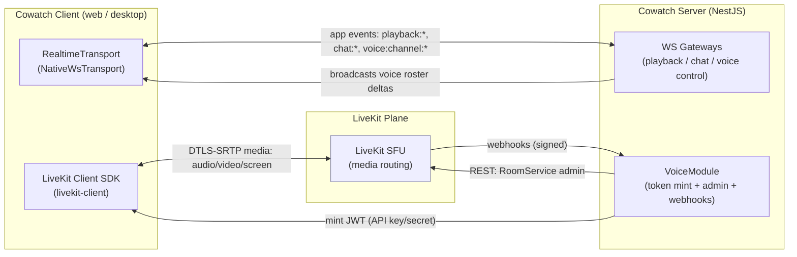
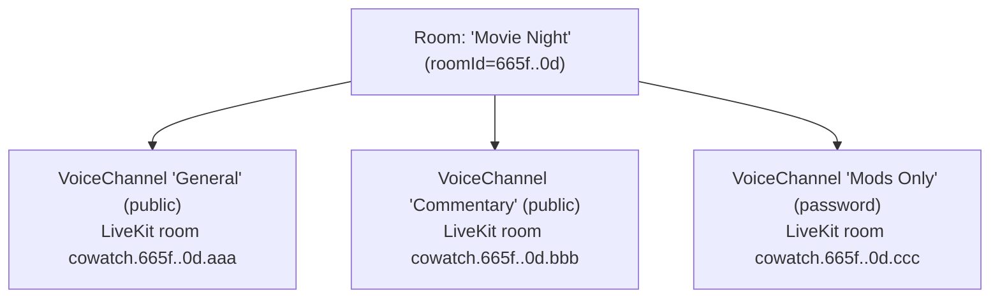
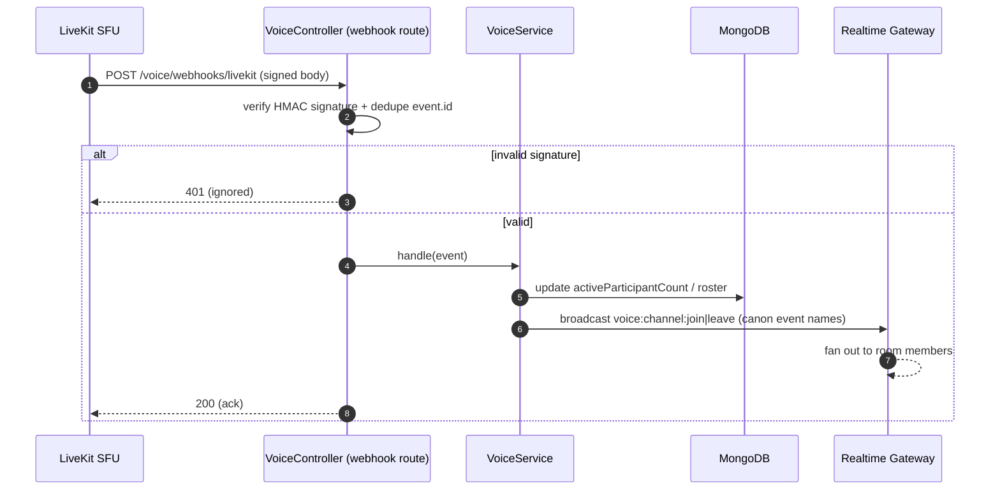

# Voice / Video Architecture (LiveKit)

> One-line purpose: Define how Cowatch maps voice channels to LiveKit rooms, mints scoped access tokens, supports multiple public/password-protected channels with video + screen share, and degrades gracefully — kept strictly separate from the media-sync realtime layer.

- **Status:** Draft (Planning, Phase 8 — Voice)
- **Owner agent:** Voice Engineer
- **Last updated: 2026-06-27**

> Amended 2026-06-27: Resolved Open Questions §13 per Chief Architect rulings — cheap token re-mint, concurrent web+desktop voice (distinct `sessionId`, UI dedupes by `userId`), screen-audio off by default, capacity audio 25 / video 15; data-channel transport, recording/egress, autoscaling/multi-region, and E2EE deferred (recording + E2EE behind future ADRs).

**Canon & cross-links**

- [Architecture Canon](../context/architecture.md) — single source of truth ([§5 Realtime](../context/architecture.md#5-realtime-transport-abstraction-adr-004), [§6 Permissions](../context/architecture.md#6-permission-model), [§8 Auth](../context/architecture.md#8-auth--token-model-adr-008), [§10 Non-negotiables](../context/architecture.md#10-cross-cutting-non-negotiables))
- [ADR-005 — LiveKit for voice/video/screen share](../adr/ADR-005-livekit-voice.md)
- [ADR-008 — Auth & token model](../adr/ADR-008-auth-tokens.md)
- [ADR-004 — Custom realtime abstraction](../adr/ADR-004-realtime-abstraction.md)
- Sibling specs: [Voice spec](../specs/voice.md) · [Rooms spec](../specs/rooms.md) · [Auth spec](../specs/auth.md)
- Implementation tasks: [tasks/voice.md](../tasks/voice.md)

---

## 1. Scope & First Principles

This document covers the **Voice/Video plane**: real-time audio, video (camera), and screen sharing inside Cowatch rooms, delivered by **LiveKit** (an SFU over WebRTC) per [ADR-005](../adr/ADR-005-livekit-voice.md).

Hard boundaries this document commits to:

1. **Voice transport is separate from media-sync realtime.** The LiveKit SFU plane carries *human* A/V media. The Cowatch [`RealtimeTransport`](../context/architecture.md#5-realtime-transport-abstraction-adr-004) (`NativeWsTransport`) carries *application* events — playback sync, chat, presence, voice **control-plane** events (`voice:channel:join`, `voice:channel:leave`). The two planes never share a connection, a clock, or an authority model. A YouTube playback heartbeat (`playback:sync`) is **never** sent over a LiveKit data channel today.
2. **The server is the only minter of LiveKit access tokens.** Clients never hold the LiveKit API secret. Token issuance is gated by Cowatch's own permission model ([§6](../context/architecture.md#6-permission-model)) and channel password policy.
3. **LiveKit is a replaceable concern, but not via `RealtimeTransport`.** `LiveKitDataChannelTransport` is listed in canon §5 as a *future* realtime adapter. That is an explicitly deferred, separate decision (see [Open Questions](#13-open-questions)). For Phase 8 voice, LiveKit is used **only** as the A/V media plane through its own client SDK, not as the app event bus.

### 1.1 Two-plane model



- **Control plane (Cowatch realtime):** join intent, roster broadcast, mute-for-all moderation, channel lifecycle. Authoritative for *who is allowed*.
- **Media plane (LiveKit):** the actual encrypted RTP. Authoritative for *what is flowing*.
- **Cross-plane truth:** LiveKit webhooks reconcile the control plane with reality (a participant who crashed without a graceful leave is reconciled via `participant_left`).

---

## 2. Domain Mapping: Cowatch ↔ LiveKit

Per canon glossary, a **VoiceChannel** is "a LiveKit-backed audio/video/screen-share channel inside a Room." A Cowatch **Room** ([§1](../context/architecture.md#1-glossary-of-core-domain-terms)) may contain **multiple** voice channels.

| Cowatch concept | LiveKit concept | Mapping rule |
|---|---|---|
| `Room` (watch room) | *(no direct object)* | A Room is a **namespace** of LiveKit rooms, not a single LiveKit room. |
| `VoiceChannel` | **LiveKit `Room`** | **1 VoiceChannel ⇒ exactly 1 LiveKit room.** This is the unit of SFU media isolation. |
| `Membership` (User in Room) | *(eligibility only)* | Room membership gates *which* voice channels a user may request a token for. |
| Active voice participant | **LiveKit `Participant`** | One per device-session that has published/subscribed. |
| Mic / camera / screen | **LiveKit `Track`** (`audio` / `video` source `camera` / `video` source `screen_share`) | Tracks are per-participant; screen share is a distinct track source. |
| `User.id` | Participant `identity` | See §2.2 — identity is namespaced and unique per device-session. |

### 2.1 LiveKit room naming convention

LiveKit room names are opaque strings; Cowatch encodes structure into them so admin/webhook code can route without a DB lookup, while still treating the DB as source of truth.

```
cowatch.<roomId>.<voiceChannelId>
        │           │
        │           └─ ObjectId of voice_channels document (canon §3 collections)
        └─ ObjectId of rooms document
```

- Example: `cowatch.665f1a2b3c4d5e6f7a8b9c0d.665f1a9988776655443322ff`
- Parsing is **advisory only**. The `voiceChannelId` segment is always re-validated against the `voice_channels` collection before any privileged action. We never trust the name alone for authz.
- This naming also lets a single LiveKit deployment host channels for every Cowatch room without collisions and makes Prometheus/Grafana labels readable.

### 2.2 Participant identity & metadata

LiveKit requires a unique `identity` per participant *within a room*. We make it globally meaningful and device-session-aware (canon §1 "Session"):

```
identity = "<userId>:<sessionId>"        // e.g. 665f...0d:01J9...ZK  (sessionId is the device session)
```

- **Why `sessionId` suffix:** a user may be joined from web and desktop simultaneously, or a guest may have multiple tabs. Each device-session is a distinct LiveKit participant. Reconnections from the *same* session reuse the same identity (LiveKit then replaces the stale participant — desired).
- **Name:** the LiveKit `name` field carries the denormalized `userDisplayName` (canon §4 denormalization policy). It is a display convenience, refreshed on each token mint; the DB membership remains source of truth.
- **Metadata (participant):** a small signed-by-trust JSON blob set **server-side** at token mint, never client-mutable:

```jsonc
{
  "userId": "665f...0d",
  "kind": "registered",          // registered | guest  (canon §1 User.kind)
  "roomRole": "Moderator",       // RoomRole at mint time (canon §6)
  "avatarUrl": "https://.../a.webp"
}
```

  Clients read other participants' metadata to render role badges and avatars without an extra API round-trip. Because `roomRole` is a *snapshot*, role changes mid-call are propagated by the control plane (see §6.3), and privileged actions are always re-checked server-side.

---

## 3. Access-Token Issuance Flow

### 3.1 Principles

- The server holds `LIVEKIT_API_KEY` + `LIVEKIT_API_SECRET` (canon §10: secrets only via env/secret store). Clients receive **only** a short-lived LiveKit JWT.
- LiveKit token TTL is **short** and **scoped**: default **10 minutes** of validity for the *initial join* grant. (LiveKit keeps a participant connected after the join token expires; TTL bounds only the join window, not call duration. A separate refresh path covers re-joins — §3.5.)
- Token issuance is a **REST** action under the `VoiceModule`, **not** a realtime event — it must ride the authenticated HTTP path so the standard auth guard, rate limiting, and CSRF posture apply (canon §10).
- A Cowatch access token (15-min JWT, canon §8) authenticates the *request*; the response is a *LiveKit* token. Two different tokens, two different audiences — never conflated.

### 3.2 REST contract

Resource-nested under the room, action segment for the non-CRUD mint (canon §3 routing rules):

| Method | Path | Purpose |
|---|---|---|
| `GET` | `/api/v1/rooms/:roomId/voice-channels` | List voice channels in a room (public always shown; password channels shown as locked). |
| `POST` | `/api/v1/rooms/:roomId/voice-channels` | Create a voice channel (Owner/Moderator per §6). |
| `PATCH` | `/api/v1/rooms/:roomId/voice-channels/:channelId` | Update name / visibility / password / limits. |
| `DELETE` | `/api/v1/rooms/:roomId/voice-channels/:channelId` | Delete channel (disconnects participants). |
| `POST` | `/api/v1/rooms/:roomId/voice-channels/:channelId/token` | **Mint a LiveKit join token.** Body: `JoinVoiceChannelDto`. |
| `POST` | `/api/v1/rooms/:roomId/voice-channels/:channelId/disconnect` | Admin: force-remove a participant (Owner/Mod). |

Request / response DTOs (canonical TS lives in [`packages/types`](../context/architecture.md#3-naming-conventions); shown here for the contract):

```ts
// POST .../token  — request
export interface JoinVoiceChannelDto {
  password?: string;          // required iff channel.visibility === 'password'
  publish: {                  // requested capabilities; server may down-scope
    audio: boolean;           // mic
    video: boolean;           // camera
    screen: boolean;          // screen share
  };
}

// POST .../token  — success response (bare resource per canon §10)
export interface VoiceTokenResponse {
  livekitUrl: string;         // wss://sfu.cowatch... (region-selected, §10)
  token: string;              // LiveKit JWT (AccessToken), TTL ~10m
  channelId: string;
  livekitRoom: string;        // "cowatch.<roomId>.<channelId>"
  identity: string;           // "<userId>:<sessionId>"
  grants: {                   // mirror of granted caps for client UI
    canPublishAudio: boolean;
    canPublishVideo: boolean;
    canPublishScreen: boolean;
    canSubscribe: boolean;
  };
  expiresAt: string;          // ISO-8601 UTC (canon §10 time rule)
}
```

Errors use the standard REST envelope (canon §10). Voice-specific `code` values:

| `code` | HTTP | Meaning |
|---|---|---|
| `VOICE_CHANNEL_NOT_FOUND` | 404 | No such channel in this room. |
| `VOICE_PASSWORD_REQUIRED` | 401 | Password channel, none supplied. |
| `VOICE_PASSWORD_INVALID` | 403 | Wrong password. |
| `VOICE_NOT_ROOM_MEMBER` | 403 | Caller lacks a Membership in the parent room. |
| `VOICE_CHANNEL_FULL` | 409 | Channel at `maxParticipants`. |
| `VOICE_FORBIDDEN_PUBLISH` | 403 | Requested publish capability denied (e.g. Guest camera). |
| `VOICE_PROVIDER_UNAVAILABLE` | 503 | LiveKit unreachable / token mint failed; client should fall back (§9). |

### 3.3 LiveKit grant (`VideoGrant`) derivation

The server computes the LiveKit `VideoGrant` deterministically from `(Membership.role, channel config, JoinVoiceChannelDto.publish)`:

```ts
// Conceptual derivation — illustrative, not implementation.
function deriveGrant(ctx: {
  role: RoomRole; channel: VoiceChannel; req: JoinVoiceChannelDto['publish'];
}): VideoGrant {
  const isGuest = ctx.role === RoomRole.Guest;
  return {
    room: livekitRoomName(ctx.channel),        // exact room — token is single-room scoped
    roomJoin: true,
    canSubscribe: true,                        // everyone admitted may listen/watch
    canPublish:  ctx.req.audio || ctx.req.video || ctx.req.screen,
    // Source-level publish control (LiveKit canPublishSources):
    canPublishSources: [
      ctx.req.audio  && 'microphone',
      ctx.req.video  && !isGuest && 'camera',          // Guests: no camera by default
      ctx.req.screen && !isGuest && 'screen_share',    // Guests: no screen share by default
    ].filter(Boolean),
    canPublishData: true,                      // small in-call signals (e.g. raise hand) — NOT playback sync
    hidden: false,
    // roomAdmin / roomCreate are NEVER granted to end-user tokens.
  };
}
```

Rules baked in:

- **Single-room scope.** Every user token names exactly one LiveKit room. A token for channel A cannot be replayed to join channel B.
- **Least privilege (canon §10).** `roomAdmin`, `roomCreate`, `roomList`, `ingressAdmin` are reserved for the **server admin token** (§7), never issued to clients.
- **Guest defaults** follow canon §6 / §8: Guests get audio + subscribe by default; camera and screen share are off unless room config explicitly opts Guests in (`channel.guestCanPublishVideo`).
- If a requested capability is denied, the server **down-scopes silently** (returns reduced `grants`) rather than failing the whole join — except when *all* requested publish sources are denied *and* the channel is publish-only by intent, in which case `VOICE_FORBIDDEN_PUBLISH`.

### 3.4 Sequence — mint & join (happy path, password channel)

```mermaid
sequenceDiagram
  autonumber
  participant C as Client (livekit-client)
  participant API as NestJS VoiceController
  participant SVC as VoiceService
  participant DB as MongoDB (Prisma)
  participant RT as Realtime Gateway
  participant LK as LiveKit SFU

  C->>API: POST /rooms/:roomId/voice-channels/:channelId/token<br/>Bearer <cowatch access JWT> + {password, publish}
  API->>API: AuthGuard verifies access JWT (sub, sid, kind, roles)
  API->>SVC: joinVoiceChannel(userId, sessionId, roomId, channelId, dto)
  SVC->>DB: load Membership(roomId,userId) + VoiceChannel(channelId)
  alt not a room member
    SVC-->>API: VOICE_NOT_ROOM_MEMBER (403)
    API-->>C: error envelope
  else password channel
    SVC->>SVC: argon2.verify(channel.passwordHash, dto.password)
    alt invalid / missing
      SVC-->>API: VOICE_PASSWORD_INVALID / VOICE_PASSWORD_REQUIRED
      API-->>C: error envelope
    end
  end
  SVC->>DB: count active participants (capacity check)
  alt channel full
    SVC-->>API: VOICE_CHANNEL_FULL (409)
  end
  SVC->>SVC: deriveGrant(role, channel, publish)
  SVC->>SVC: AccessToken(apiKey, secret).identity(uid:sid).metadata(...).grant(grant)<br/>ttl=10m  -> JWT
  SVC-->>API: VoiceTokenResponse
  API-->>C: 200 { livekitUrl, token, grants, ... }
  C->>LK: room.connect(livekitUrl, token)  [DTLS-SRTP]
  LK-->>C: connected; subscribe existing tracks
  LK->>API: webhook participant_joined (signed)
  API->>SVC: reconcile participant -> mark active
  SVC->>RT: broadcast voice:channel:join (roster delta)
  RT-->>C: voice:channel:join {channelId, participant}
```

Notes:
- Steps 1–13 are pure HTTP/REST (control). Step 14 onward is the **separate** LiveKit media plane.
- The **roster broadcast** (`voice:channel:join`, canon §3 event name) flows over the Cowatch realtime layer, *not* LiveKit — so non-voice members see who's talking without joining the SFU.
- The webhook (step 16) is the authoritative reconciliation: presence in the roster is confirmed by LiveKit, not merely by the client's claim.

### 3.5 Token refresh / re-join

- A LiveKit join token is single-use-ish: it authorizes one `connect`. On reconnect after a *short* drop, the LiveKit SDK reuses the existing session (no new token needed).
- On a *long* drop (token expired) or a *channel switch*, the client calls `POST .../token` again. This is cheap and idempotent; rate-limited per canon §10 (per-user + per-IP).
- We do **not** implement LiveKit's `tokenRefresh` long-lived pattern in Phase 8; short TTL + cheap re-mint is simpler and aligns with the rotating-token philosophy of [ADR-008](../adr/ADR-008-auth-tokens.md). Revisit if reconnect storms appear (§13).

---

## 4. Multiple Voice Channels per Room

A Room is a namespace; channels are independent LiveKit rooms. This is what makes Cowatch "Discord-like."



Rules:

- **One active media session per device-session.** A given device-session may be connected to **at most one** voice channel at a time (mirrors Discord). Switching channels = leave current LiveKit room, mint new token, connect new room. Enforced client-side and re-validated server-side (the webhook for the old room's `participant_left` must precede or accompany the new join; the new token's identity replaces any stale one).
- **Watching media is independent of voice.** A user can watch the synchronized YouTube playback (Cowatch realtime plane) while in *any* or *no* voice channel. The media-sync clock is never affected by voice channel membership.
- **Channel capacity:** each `VoiceChannel` carries `maxParticipants` (default 25, hard cap configurable, see §8 scaling). Enforced at token mint and re-checked by `participant_joined` webhook (race-safe ceiling).
- **Default channel:** every Room is created with one default public channel `General` (`isDefault: true`) so voice is one click away. Cannot be deleted while other channels reference it as fallback.

### 4.1 `VoiceChannel` data shape (planning)

Prisma owns the model ([`packages/database`](../context/architecture.md#4-data-modeling-conventions-mongodb--prisma)); collection `voice_channels` (canon §3). Interface for the contract:

```ts
export interface VoiceChannel {
  id: string;                       // ObjectId (string in TS, canon §4)
  roomId: string;                   // @db.ObjectId, indexed FK
  name: string;
  visibility: 'public' | 'password';// canon §1 — voice channels are public|password ONLY (no 'private')
  passwordHash?: string;            // argon2; present iff visibility==='password' (never returned to client)
  isDefault: boolean;
  maxParticipants: number;          // capacity ceiling
  guestCanPublishVideo: boolean;    // opt-in override of §3.3 guest defaults
  allowScreenShare: boolean;        // room-level toggle
  // denormalized read-hot snapshot (canon §4 denormalization policy):
  activeParticipantCount: number;   // source of truth = LiveKit webhooks; eventually consistent
  createdAt: string;                // ISO-8601 UTC
  updatedAt: string;
  deletedAt?: string | null;        // soft-delete (canon §4)
}
```

Indexes (canon §4 standard pattern): `voice_channels (roomId)` for listing, `voice_channels (roomId, isDefault)`.

---

## 5. Public vs Password-Protected Channels

Canon glossary: VoiceChannel visibility is **`public | password`** (note: unlike Rooms, voice channels have *no* `private` mode — privacy is achieved via the parent room's visibility + the password gate).

| Aspect | `public` | `password` |
|---|---|---|
| Listed in `GET .../voice-channels` | Yes, joinable | Yes, but shown **locked** (name visible, no roster to non-members) |
| Token mint requires password | No | **Yes** — `dto.password` verified (argon2) before grant |
| Roster visibility | Room members may see roster | Only participants who passed the gate see the full roster |
| Eligibility floor | Must be a room `Membership` | Must be a room `Membership` **and** pass password |

Password handling rules:

- Passwords are **hashed with argon2** server-side (canon §10 password hashing), never stored or logged in plaintext, never returned in any DTO.
- Password verification happens **only** during `POST .../token`. The plaintext password rides the authenticated TLS request body once and is discarded.
- A wrong password is rate-limited (per-IP + per-user, canon §10) with `VOICE_PASSWORD_INVALID`; repeated failures escalate to a short lockout to deter brute force.
- Changing a channel password (`PATCH`) does **not** disconnect current participants (their session is already established) but invalidates future joins; optionally Owner may force a `disconnect-all` to require re-auth.
- Password channels still respect the **room's** visibility ([§1](../context/architecture.md#1-glossary-of-core-domain-terms)): a private room's password voice channel is doubly gated (room ACL + channel password).

---

## 6. Video & Screen Sharing

### 6.1 Track sources

LiveKit exposes track *sources*; Cowatch maps each to a capability gate:

| LiveKit source | Cowatch capability | Default by role |
|---|---|---|
| `microphone` (audio) | voice | All admitted (incl. Guest) |
| `camera` (video) | webcam | Member+ ; Guest only if `guestCanPublishVideo` |
| `screen_share` (video) + `screen_share_audio` (audio) | screen share | Member+ if `channel.allowScreenShare`; Guest only via opt-in |

- **Screen share with audio:** LiveKit publishes screen video and (optionally) screen audio as two tracks. Both are gated by the screen-share capability.
- **Simulcast** is enabled for camera and screen-share video so the SFU can forward an appropriate layer per subscriber (low/med/high) based on bandwidth — central to drift-free, lag-tolerant video (§8).
- **Dynacast** (LiveKit) is enabled: the SFU stops forwarding unwatched layers, saving uplink — important when a screen share has many idle subscribers.

### 6.2 Screen share vs synchronized media — explicit non-overlap

This is the most important boundary to state plainly for downstream engineers:

- **Synchronized YouTube playback** is the *watch-party media* — driven by the server-authoritative clock ([canon §7 Sync](../context/architecture.md#7-sync-algorithm)) over the Cowatch realtime plane. It is **not** a LiveKit track. Nobody "screen shares the YouTube video" to sync it.
- **Screen share** is an *ad-hoc human stream* over LiveKit (e.g. someone shows their desktop). It is **not** synchronized, has no shared clock, and carries **no** `playback:*` semantics.
- A room can simultaneously run: (a) a synced YouTube video via the realtime/sync plane, and (b) a LiveKit screen share + voice — fully independent. Pausing the YouTube video does not pause a screen share, and vice-versa.

### 6.3 Mid-call permission changes & moderation

Moderation actions (canon §6: mute/timeout/kick/ban) interact with both planes:

| Action | Control plane (realtime) | Media plane (LiveKit) |
|---|---|---|
| **Server mute (mod mutes user)** | emit `voice:channel:mute` to roster | server admin calls LiveKit `MutePublishedTrack` (force-mutes the track at SFU) |
| **Kick from voice** | emit `voice:channel:leave` | server admin `RemoveParticipant` |
| **Ban from room** | revoke Membership; emit `room:member:leave` | `RemoveParticipant` + token mint will now fail `VOICE_NOT_ROOM_MEMBER` |
| **Role change (promote/demote)** | re-derive permission matrix; emit role update | next token mint reflects new `roomRole`; for immediate effect server may `UpdateParticipant` metadata |
| **Self mute** | optional roster hint `voice:channel:mute` (self) | client stops publishing audio track locally |

- **Force-mute is authoritative at the SFU**, so a malicious client cannot keep transmitting after a mod mute — LiveKit drops the track server-side. This is why mute is a *server admin* operation (§7), not a client courtesy.
- Role snapshots in participant metadata are refreshed via `UpdateParticipant` so other clients re-render badges without a re-join.

---

## 7. Server-Side Admin & Webhooks

The `VoiceModule` ([`apps/server/src/modules/voice/`](../context/architecture.md#3-naming-conventions)) owns all privileged LiveKit interaction. End-user clients never call LiveKit's admin REST.

### 7.1 Admin (`RoomServiceClient`)

Server holds an **admin-scoped** identity (token with `roomAdmin`, `roomCreate`, `roomList`) used only inside the server process:

| Operation | LiveKit API | Trigger |
|---|---|---|
| Create / ensure room | `createRoom` (lazy — LiveKit auto-creates on first join; we set `emptyTimeout`, `maxParticipants`) | Channel creation / first join |
| List participants | `listParticipants` | Roster reconciliation, admin UI |
| Force mute track | `mutePublishedTrack` | Mod mute (§6.3) |
| Remove participant | `removeParticipant` | Kick / ban (§6.3) |
| Update participant metadata | `updateParticipant` | Role change (§6.3) |
| Delete room | `deleteRoom` | Channel delete / room teardown |
| Update room metadata | `updateRoomMetadata` | Lock channel, set topic |

Room defaults set at creation: `emptyTimeout` (e.g. 120 s — SFU room auto-closes after last participant leaves), `maxParticipants` (= channel `maxParticipants`), `departureTimeout`.

### 7.2 Webhooks (signed, server-ingested)

LiveKit posts signed webhooks to a server endpoint. These are the **source of truth for participant lifecycle** (clients can lie or crash).

- **Endpoint:** `POST /api/v1/voice/webhooks/livekit` — a dedicated, **unauthenticated-by-JWT** route that instead verifies LiveKit's webhook signature (HMAC over body using the API key/secret). Mounted outside the standard `AuthGuard`; protected by signature + IP allowlist + raw-body checksum.
- **Idempotency:** each webhook has an event `id`; processed ids are deduped (short TTL store) so retries are safe.

| Webhook event | Server action |
|---|---|
| `room_started` | mark LiveKit room live (rarely needed; lazy create) |
| `participant_joined` | confirm roster entry, increment `activeParticipantCount`, broadcast `voice:channel:join`, enforce capacity ceiling |
| `participant_left` | remove from roster, decrement count, broadcast `voice:channel:leave` (handles crash/ungraceful exit) |
| `track_published` / `track_unpublished` | update participant's published-media flags for roster UI (e.g. "camera on") |
| `room_finished` | clear roster, zero `activeParticipantCount`, broadcast channel-empty |
| `egress_*` (future) | recording lifecycle (out of Phase 8 scope) |



### 7.3 Reconciliation job

A periodic background job (canon §4 background reconciliation) cross-checks `listParticipants` against the DB roster every N seconds to heal missed webhooks (network blips). This also corrects the eventually-consistent `activeParticipantCount` denorm field for discovery.

---

## 8. SFU Scaling Notes

LiveKit is an **SFU** (Selective Forwarding Unit): each participant uploads one copy of each track; the SFU forwards to subscribers. This is `O(n)` uplink per publisher and `O(n)` downlink fan-out per room — far cheaper than mesh (`O(n²)`).

Scaling levers and the plan:

- **Simulcast + Dynacast (enabled, §6.1):** publishers send multiple quality layers; the SFU forwards only the layer each subscriber can use, and stops forwarding entirely-unsubscribed layers. This is the primary defense for large screen-share audiences.
- **Per-channel ceilings:** `maxParticipants` caps any single LiveKit room. Audio-heavy channels can be larger (e.g. 50); video/screen channels smaller (e.g. 15–25) because video fan-out dominates. Default audio cap 25.
- **Room namespacing aids horizontal scale:** because each VoiceChannel is its own LiveKit room, a multi-node LiveKit cluster (with Redis-backed routing) can distribute rooms across SFU nodes; no single channel's load is split, but the *number* of channels scales out across nodes.
- **Region selection:** `livekitUrl` returned at mint can be region-aware (nearest SFU edge) once multi-region is deployed; clients always receive a URL, never hardcode one (canon §10 config).
- **Bandwidth budgeting:** audio ~32–48 kbps/track; camera with simulcast ~150 kbps–2.5 Mbps depending on layer; screen share up to ~3 Mbps. Capacity planning uses these to size SFU egress per channel cap.
- **Active speaker / audio-level:** LiveKit's audio-level + active-speaker detection lets clients subscribe attention to N loudest speakers in large audio rooms (reduces decode load), without server work.
- **Deployment:** LiveKit runs in Docker (canon ADR-010) alongside Cowatch services; production uses a LiveKit cluster + Redis for node coordination and TURN for NAT traversal. TURN/TLS on 443 ensures connectivity behind restrictive firewalls (ties to §9 fallback).

> SFU node autoscaling, multi-region mesh, and recording (egress) are deferred beyond Phase 8 — tracked in [Open Questions](#13-open-questions) and the [voice tasks](../tasks/voice.md).

---

## 9. Graceful Fallback & Error Handling

The voice plane must **never** break the watch-party. If voice fails, synchronized viewing and chat continue unaffected (the two-plane separation guarantees this).

### 9.1 Failure modes & responses

| Failure | Detection | Response |
|---|---|---|
| **LiveKit unreachable at mint** | token mint REST call to LiveKit fails / SFU health check down | `503 VOICE_PROVIDER_UNAVAILABLE`; client shows "Voice temporarily unavailable", retains full media-sync + chat. Retry with backoff. |
| **WebRTC connect fails (NAT/firewall)** | `livekit-client` `connect()` rejects / ICE fails | Client retries via TURN-over-TLS (443). If still failing, surface "Can't reach voice — check network"; **do not** disconnect from the room. |
| **Mid-call SFU drop** | LiveKit `Disconnected` / `Reconnecting` state | LiveKit SDK auto-reconnects (its own backoff). On hard failure, client re-mints token (§3.5) and rejoins. Roster shows "reconnecting…". |
| **Token expired before connect** | LiveKit rejects token | Client transparently re-mints (`POST .../token`) and reconnects. |
| **Webhook delivery lost** | reconciliation job finds drift (§7.3) | Roster healed from `listParticipants`; `activeParticipantCount` corrected. |
| **Channel full race** | `participant_joined` webhook exceeds cap | Server `removeParticipant` for the overflow joiner; client gets `VOICE_CHANNEL_FULL` via roster event; offered another channel. |
| **Permission revoked mid-call (ban)** | mod action (§6.3) | Server `removeParticipant`; client receives `voice:channel:leave` with reason; UI explains. |
| **Microphone/camera permission denied (browser)** | `getUserMedia` rejection client-side | Client joins as listen-only (subscribe), prompts to enable device; no server error. |

### 9.2 Reconnection ownership (who owns what backoff)

- **Media plane reconnection** is owned by the **LiveKit SDK** (its own ICE-restart + reconnect logic). Cowatch does not reimplement it.
- **Control plane reconnection** is owned by the **`RealtimeTransport`** (canon §5: exponential backoff base 500 ms, cap 15 s, auto re-subscribe). On realtime resume, the client requests a fresh voice roster snapshot (parallel to the `playback:sync` snapshot request).
- These two are **independent**: voice media can stay connected while the app realtime briefly reconnects, and vice-versa. Neither blocks the other.

### 9.3 Degradation ladder

1. Full A/V/screen.
2. Drop video/screen, keep audio (bandwidth pressure → SFU lowers simulcast layer; client may stop publishing camera).
3. Audio-only (listen + talk).
4. Listen-only (subscribe; e.g. mic permission denied).
5. Voice fully unavailable → **watch + chat continue** (core product preserved).

The client signals its current rung via the voice roster so others see "audio only" / "reconnecting" badges.

---

## 10. Client SDK Usage Plan

- **Library:** `livekit-client` (official JS SDK), wrapped in a Cowatch hook/store so the rest of the app never imports LiveKit types directly (mirrors the canon §5 philosophy of not leaking transport details — though this is a *separate* wrapper from `RealtimeTransport`).
- **Wrapper location:** `packages/realtime` exposes `RealtimeTransport` for the app event bus; the **voice** SDK wrapper lives alongside voice UI in `apps/web` (e.g. `useVoiceChannel.ts` hook + `voice.store.ts` Zustand store, canon §3 naming) and may share token-fetch helpers via the [`packages/sdk`](../context/architecture.md#9-directory--path-map--doc-cross-links) typed API client.
- **Desktop (Electron):** reuses the web voice wrapper; PiP and screen-share *source picker* use Electron's `desktopCapturer` IPC ([ADR-006](../adr/ADR-006-electron-desktop.md)) to enumerate windows/screens, then hand the chosen source to `livekit-client`. Auto-update and HW acceleration improve encode/decode for video.

```ts
// Illustrative client wrapper surface (NOT implementation) — apps/web voice hook.
export interface VoiceClient {
  join(channelId: string, opts: { password?: string;
        publish: { audio: boolean; video: boolean; screen: boolean } }): Promise<void>;
  leave(): Promise<void>;
  setMicEnabled(on: boolean): Promise<void>;
  setCameraEnabled(on: boolean): Promise<void>;
  startScreenShare(): Promise<void>;          // Electron: via desktopCapturer source
  stopScreenShare(): Promise<void>;
  onParticipants(cb: (p: VoiceParticipant[]) => void): () => void;
  onConnectionState(cb: (s: VoiceConnectionState) => void): () => void;
}

export type VoiceConnectionState =
  | 'idle' | 'connecting' | 'connected' | 'reconnecting' | 'failed';

export interface VoiceParticipant {
  identity: string;            // "<userId>:<sessionId>"
  userId: string;
  displayName: string;
  roomRole: RoomRole;          // from participant metadata snapshot (§2.2)
  isSpeaking: boolean;
  audioEnabled: boolean;
  cameraEnabled: boolean;
  screenSharing: boolean;
  connectionQuality: 'excellent' | 'good' | 'poor' | 'lost';
}
```

Client flow:

1. User clicks a channel → call `POST .../token` (via `packages/sdk`) → receive `VoiceTokenResponse`.
2. `room.connect(livekitUrl, token)`; on `connected`, publish requested tracks per granted caps.
3. Subscribe to remote tracks; render audio elements + video tiles; bind active-speaker highlight.
4. Map LiveKit `RoomEvent`s (`ParticipantConnected`, `TrackSubscribed`, `ActiveSpeakersChanged`, `ConnectionQualityChanged`, `Disconnected`) to `VoiceParticipant` state in the Zustand store.
5. Roster cross-checked against Cowatch realtime `voice:channel:*` events (authoritative for who *should* be present).

---

## 11. Security Summary (canon §10 alignment)

- API key/secret server-only; clients receive single-room, short-TTL, least-privilege LiveKit JWTs.
- Password channels: argon2 hashes, verified only at mint, rate-limited, never logged/returned.
- Webhook route: signature-verified (HMAC), IP-allowlisted, idempotent, raw-body checksum, outside JWT auth.
- All media is DTLS-SRTP encrypted end-to-SFU; signaling over WSS/TLS.
- `correlationId` (ULID, canon §10) attached to every token-mint request and propagated to logs + the resulting realtime `voice:channel:*` broadcast for traceability.
- Admin operations (mute/kick/ban) authorized against the live permission matrix (canon §6) on the server, never trusting client-asserted roles.
- TURN over TLS/443 for restrictive networks; strict CORS allowlist on REST.

---

## 12. Acceptance Criteria

1. A room member can mint a token and join a **public** channel; a non-member receives `VOICE_NOT_ROOM_MEMBER`.
2. A **password** channel rejects mint without/with-wrong password (`VOICE_PASSWORD_REQUIRED` / `VOICE_PASSWORD_INVALID`) and accepts a correct one; password is never returned or logged.
3. Issued LiveKit tokens are **single-room scoped**, ≤ 10-minute TTL, carry correct source-level publish grants, and never include `roomAdmin`/`roomCreate`.
4. A Room supports **multiple** voice channels; a device-session is in **at most one** at a time; switching cleanly leaves and rejoins.
5. **Guests** get audio + subscribe by default; camera/screen require explicit channel opt-in; denied capabilities are down-scoped, not silently granted.
6. Camera video and screen share publish as distinct track sources with simulcast + dynacast enabled.
7. Synchronized YouTube playback and chat are **provably independent** of voice: killing the LiveKit plane leaves sync + chat fully functional (degradation ladder rung 5).
8. Webhooks are signature-verified, idempotent, and reconcile roster + `activeParticipantCount`; a crashed participant is removed via `participant_left` without a client message.
9. Mod **force-mute** stops the track at the SFU (client cannot keep transmitting); kick/ban removes the participant and blocks re-mint.
10. On LiveKit outage, token mint returns `503 VOICE_PROVIDER_UNAVAILABLE`, the UI shows voice-unavailable, and the watch party is unaffected.
11. Every token-mint and webhook carries a `correlationId` traceable across REST → realtime broadcast → logs.
12. No `playback:*` event is ever transmitted over a LiveKit data channel in Phase 8.

---

## 13. Open Questions

| # | Question | Recommendation |
|---|---|---|
| 1 | Should `LiveKitDataChannelTransport` (canon §5 future adapter) ever carry app realtime events? | **Defer.** Keep planes separate for Phase 8. Revisit only if we need serverless/VPS-less realtime; gate behind a new ADR. |
| 2 | Long-lived token refresh vs cheap re-mint on reconnect? | **Cheap re-mint now** (§3.5); add LiveKit auto-refresh only if reconnect-storm metrics demand it. |
| 3 | Server-side **recording** (LiveKit Egress) for rooms? | Out of Phase 8 scope; design later with consent + storage in MinIO (canon ADR-009) + legal review. |
| 4 | Multi-region SFU + node autoscaling thresholds? | Single-region cluster for launch; region-aware `livekitUrl` field already reserved (§3.2/§8). Revisit with load data. |
| 5 | Per-user concurrent device-session voice (web + desktop simultaneously) — allow both in same channel? | **Allow** (distinct `sessionId` identities); UI dedupes display by `userId`. Confirm with product. |
| 6 | Should screen-share audio be on by default? | Default **off**; opt-in per share to avoid accidental system-audio leaks. |
| 7 | Capacity ceilings per channel type (audio vs video) — exact numbers? | Start audio 25 / video 15; tune against SFU egress metrics post-launch. |
| 8 | **LiveKit Cloud vs self-hosted SFU** for launch? | **Self-hosted in Docker** (canon ADR-010 Docker-first parity); keep the client `livekitUrl` config-driven so a managed/Cloud region can be swapped in later without client changes. |
| 9 | **Insertable-streams E2EE** for password channels? | Defer. DTLS-SRTP to the SFU is the baseline (§11); end-to-end (SFU-blind) encryption adds key-management cost and breaks server-side recording — revisit only if a true-private use case demands it, behind a new ADR. |

**Resolutions (2026-06-27)** — per Chief Architect rulings ([project-state/open-questions.md](../project-state/open-questions.md) §8):

- Resolution (2026-06-27): Q1 data-channel transport — **Deferred to Phase 8+** (media and app-event planes stay separate; future ADR only if adopted).
- Resolution (2026-06-27): Q2 token refresh — **Resolved**: cheap re-mint on reconnect (short ~10 min TTL); add LiveKit auto-refresh only if reconnect-storm metrics demand it.
- Resolution (2026-06-27): Q3 recording / Egress — **Deferred to Phase 8+** behind a future ADR (consent + MinIO storage + legal review).
- Resolution (2026-06-27): Q4 multi-region SFU + autoscaling — **Deferred to Phase 8+**; single-region cluster at launch (`livekitUrl` already region-ready).
- Resolution (2026-06-27): Q5 concurrent web+desktop voice — **Resolved**: allow both (distinct `sessionId`; UI dedupes by `userId`), pending product confirm.
- Resolution (2026-06-27): Q6 screen-share audio default — **Resolved**: off by default, opt-in per share.
- Resolution (2026-06-27): Q7 capacity ceilings — **Resolved**: audio 25 / video 15 to start, tuned by SFU egress metrics.
- Resolution (2026-06-27): Q8 Cloud vs self-hosted — **Resolved**: self-hosted SFU in Docker (ADR-010), `livekitUrl` config-swappable to managed/Cloud later.
- Resolution (2026-06-27): Q9 insertable-streams E2EE — **Deferred to Post-MVP** behind a future ADR (DTLS-SRTP-to-SFU baseline).

---

*This document complies with [Architecture Canon](../context/architecture.md). Any change to the two-plane boundary, token model, or LiveKit↔Cowatch mapping requires an ADR + history entry + context update + repomix update (canon §10 R3/R4).*
