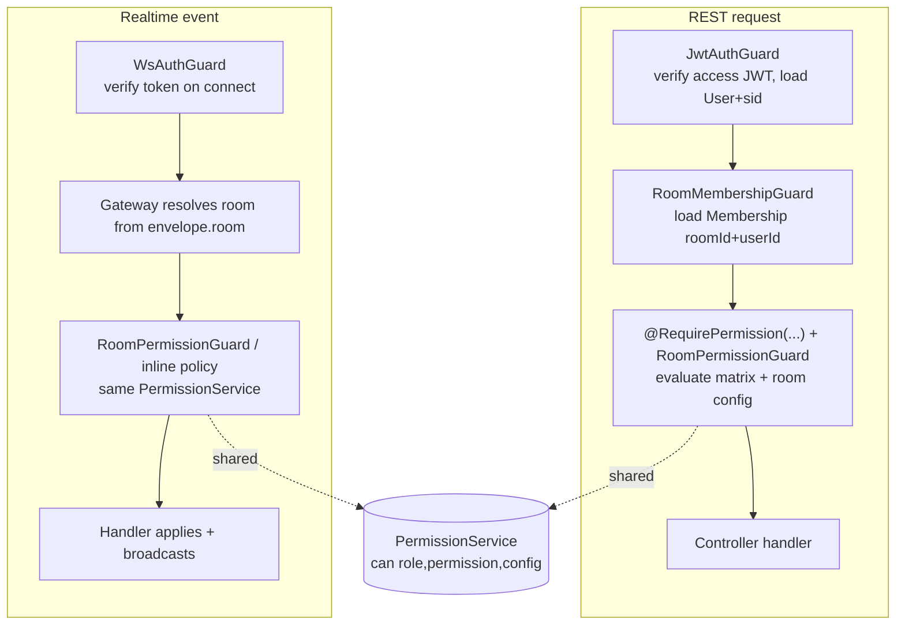
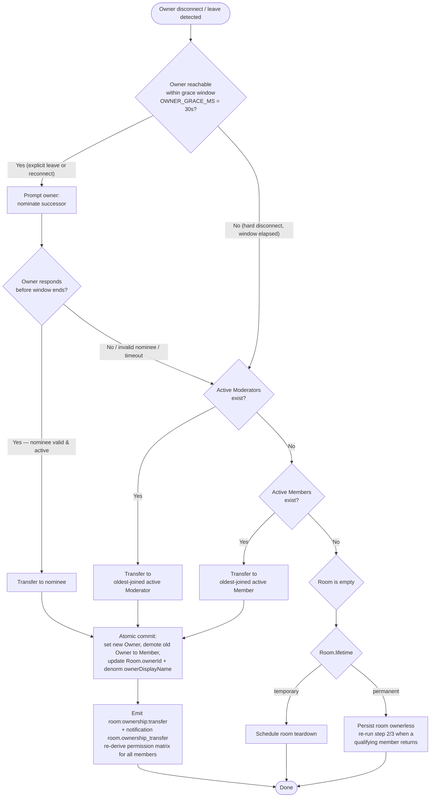

# Permission & Roles Architecture

> Authoritative design for Cowatch's room-scoped permission model: roles, the permission matrix, sync-authority modes, server-side enforcement, ownership transfer, join approval, and moderation semantics.

**Status:** Draft (Planning — Phase 0/2)
**Owner agent:** Backend Engineer
**Last updated: 2026-06-27**

> Amended 2026-06-27: Resolved all five Permissions Open Questions per Chief Architect RESOLUTIONS — OQ-1 (`chatLock` suppresses Guest + Member), OQ-2 (`room_bans` collection), OQ-3 (`room:member:update` event), OQ-4 (`join_requests` collection), OQ-5 (`playlistAuthority` first-class field).

---

## 0. Context & Sources

This document is downstream of and MUST comply with the [Architecture Canon](../context/architecture.md). On any conflict, the canon wins. Specifically it elaborates:

- [Canon §6 — Permission Model](../context/architecture.md#6-permission-model)
- [Canon §7 — Sync Algorithm](../context/architecture.md#7-sync-algorithm)
- [Canon §1 — Glossary](../context/architecture.md#1-glossary-of-core-domain-terms) (`Membership`, `Room`, `User`)

Related ADRs:

- [ADR-002 — NestJS platform](../adr/ADR-002-nestjs-backend.md) (guards/decorators are the enforcement substrate)
- [ADR-004 — Custom Realtime abstraction](../adr/ADR-004-realtime-abstraction.md) (WS gateway enforcement parity)
- [ADR-007 — Server-authoritative playback sync](../adr/ADR-007-server-authoritative-sync.md) (authority enforcement on `playback:*`)

Sibling specs:

- Rooms spec → [`../specs/rooms.md`](../specs/rooms.md)
- Playback/sync spec → [`../specs/playback-sync.md`](../specs/playback-sync.md)
- Auth spec → [`../specs/auth.md`](../specs/auth.md)

---

## 1. Design Principles

1. **Membership is the unit of authorization.** Permissions are never derived from the global `User`; they are derived from the `Membership` of that user **in a specific room**. A user may be `Owner` in one room and `Guest` in another. (Canon §1.)
2. **Server is the single source of truth.** No client decision grants access. The client renders affordances optimistically, but every mutation — REST or realtime — is re-validated server-side. Client-side gating is UX only.
3. **Two orthogonal axes.** Authorization is the product of:
   - **Role permissions** — static capabilities of a `RoomRole` (the matrix in §3).
   - **Room configuration** — per-room toggles (`SyncAuthority`, `chatLock`, `playlistLock`, `joinApproval`) that gate the conditional (◐) permissions.
   A permission is granted iff **both** axes allow it.
4. **Least privilege & explicit deny.** Absence of an explicit grant is a deny. Guests start with the narrowest defaults.
5. **Deterministic ownership.** Every active room has at most one `Owner`. Ownership transfer is atomic and deterministic (§6).
6. **Same rules everywhere.** REST controllers and WebSocket gateways enforce the *identical* permission core; there is no privileged backdoor transport.

---

## 2. The Four Roles

Enum `RoomRole` (canon §6) — `PascalCase` singular, `PascalCase` members.

```ts
// packages/types/src/permissions.ts (SOURCE OF TRUTH — canon §3)
export enum RoomRole {
  Owner = 'Owner',
  Moderator = 'Moderator',
  Member = 'Member',
  Guest = 'Guest',
}
```

| Role | Cardinality | How acquired | Intent |
|---|---|---|---|
| **Owner** | Exactly **1** per active room | Room creator; or via ownership transfer (§6) | Full administrative control: settings, role management, moderation, playback/playlist authority. The only role that can change room settings or manage roles. |
| **Moderator** | 0..N | Assigned by Owner | Trusted staff: full moderation (kick/ban/mute/timeout), playlist control, lock toggles, join approval. Cannot change room settings or manage roles. |
| **Member** | 0..N | A `registered` user who joins (and passes join approval if enabled) | Standard participant. Can chat and vote. Playback/playlist control only when room config opens it (◐). No moderation powers. |
| **Guest** | 0..N | A `guest`-kind `User` (canon §8) who joins | Ephemeral participant. View + (config-gated) chat only. No control, no moderation, no voting authority over outcomes beyond casting a vote. |

**Role ↔ account kind.** A `Guest`-role membership is the default for a `User.kind = 'guest'`. A `registered` user normally joins as `Member`. The `RoomRole` is a property of the **Membership**, not the account — but a `guest`-kind account can never be promoted above `Guest` without first upgrading to a registered account (auth canon §8, "guest upgrade-to-registered").

**Ordering (for "oldest-joined" and rank comparisons):** `Owner > Moderator > Member > Guest`. Rank is used by the ownership-transfer fallback (§6) and by the "cannot act on equal-or-higher rank" moderation rule (§7.5).

---

## 3. Role × Permission Matrix

Legend: ✓ = always allowed · ✗ = never allowed · ◐ = allowed **only if room configuration permits** (see §3.1).

This table is the canonical superset of [Canon §6](../context/architecture.md#6-permission-model), expanded to include **manage roles** and **transfer ownership** as required line items.

| Permission | Owner | Moderator | Member | Guest | Gating config (for ◐) |
|---|:--:|:--:|:--:|:--:|---|
| **kick** | ✓ | ✓ | ✗ | ✗ | — |
| **ban** | ✓ | ✓ | ✗ | ✗ | — |
| **mute** | ✓ | ✓ | ✗ | ✗ | — |
| **timeout** | ✓ | ✓ | ✗ | ✗ | — |
| **playback control** | ✓ | ◐ | ◐ | ✗ | `SyncAuthority` (§4) |
| **playlist control** (add / reorder / remove) | ✓ | ✓ | ◐ | ✗ | `playlistAuthority` + `playlistLock` |
| **chat lock** (toggle) | ✓ | ✓ | ✗ | ✗ | — |
| **playlist lock** (toggle) | ✓ | ✓ | ✗ | ✗ | — |
| **join approval** (approve/deny) | ✓ | ✓ | ✗ | ✗ | — |
| **manage roles** (assign/revoke Moderator) | ✓ | ✗ | ✗ | ✗ | — |
| **transfer ownership** | ✓ | ✗ | ✗ | ✗ | — |
| **send chat** | ✓ | ✓ | ✓ | ◐ | `chatLock` |

> Additional canon-derived rows (not in the required list but enforced by the same machinery): **change room settings** → Owner ✓, all others ✗; **vote / skip-vote** → all roles may cast a vote, but vote *eligibility weighting* and skip thresholds are a Rooms-spec concern.

### 3.1 What ◐ means, precisely

A ◐ cell is resolved at request time by combining role + room config:

| ◐ permission | Granted to a member when… |
|---|---|
| **playback control** (Moderator / Member) | the room's `SyncAuthority` mode (§4) includes the member's effective role. |
| **playlist control** (Member) | `playlistLock` is **off** AND `playlistAuthority` (same three modes as `SyncAuthority`, configured independently) includes `Member`. Owner & Moderator bypass `playlistAuthority` but Moderator is still blocked when… see §3.2. |
| **send chat** (Guest) | `chatLock` is **off**. (`chatLock` on ⇒ only Owner/Moderator may send; Member chat is also suppressed — see §3.2.) |

### 3.2 Lock interaction notes (resolving canon ambiguity)

The canon matrix shows `chat lock` and `playlist lock` as **toggle** permissions (who may flip the switch) and separately shows `send chat` / `playlist control` as the **gated capability**. We make the runtime effect explicit:

- **`chatLock = on`** → suppresses `send chat` for **Guest and Member**. Owner and Moderator may still send (they hold the toggle and need to coordinate). This is the standard "slow/lock the room" moderation move.
- **`playlistLock = on`** → suppresses `playlist control` for **Member** entirely, regardless of `playlistAuthority`. Owner and Moderator retain playlist control (per matrix `✓`).
- These are deliberately asymmetric with playback: playback authority is governed solely by `SyncAuthority` (there is no separate "playback lock"); a stricter `owner_only` mode is the equivalent of locking playback.

> **Open Question (OQ-1):** Should `chatLock = on` suppress Member chat, or only Guest chat? Canon marks Member `send chat = ✓` (unconditional) and Guest `= ◐`. **Recommendation:** lock suppresses both Guest *and* Member (matching Discord "lock channel" semantics); leave Owner/Moderator able to speak. Tracked in §9.
>
> **Resolution (2026-06-27):** `chatLock = on` suppresses chat for **both Guest and Member**; Owner and Moderator are exempt and may still speak (Discord lock semantics). Below-Moderator sends are rejected with `CHAT_LOCKED`. — Status: **Resolved**.

---

## 4. Sync-Authority Modes

Per-room enum (canon §6 / §7). Decides who holds the ◐ on **playback control**. A structurally identical, **independently configured** field governs **playlist control**.

```ts
// packages/types/src/permissions.ts
export enum SyncAuthority {
  OwnerOnly = 'owner_only',
  OwnerModerators = 'owner_moderators',
  Everyone = 'everyone',
}

export interface RoomPermissionConfig {
  syncAuthority: SyncAuthority;       // gates playback:* mutations
  playlistAuthority: SyncAuthority;   // gates playlist add/reorder/remove (separate knob)
  chatLock: boolean;                  // default false
  playlistLock: boolean;              // default false
  joinApproval: boolean;              // default false (true ⇒ §5 flow)
}
```

These fields are **embedded** in `Room.settings` (canon §4: room settings are embedded, owned, bounded, read-with-parent).

> **Resolution (OQ-5, 2026-06-27):** `playlistAuthority` is a **first-class, `SyncAuthority`-typed per-room field**, configured **independently** of `syncAuthority` (playback). It gates `room:playlist:*` for **Members** (Owner/Moderator bypass; Members are also blocked when `playlistLock = on`). Its three modes are identical to `SyncAuthority` (`owner_only` | `owner_moderators` | `everyone`). **Canonical field name = `playlistAuthority`** — `docs/DATABASE.md` renames the prior `syncAuthorityPlaylist` → `playlistAuthority` in `RoomSettings`. Per RESOLUTION B6 this is a data/contract-model change (history + context), **not an ADR**. — Status: **Resolved**.

### 4.1 Mode → eligible roles for playback control

| `SyncAuthority` | Owner | Moderator | Member | Guest |
|---|:--:|:--:|:--:|:--:|
| `owner_only` | ✓ | ✗ | ✗ | ✗ |
| `owner_moderators` | ✓ | ✓ | ✗ | ✗ |
| `everyone` | ✓ | ✓ | ✓ | ✗ |

- **Owner is always playback-eligible**, in every mode (the matrix `✓` is unconditional).
- **Guest is never playback-eligible**, in any mode (matrix `✗`).
- Members/Moderators are the only cells the mode actually moves.

### 4.2 Enforcement on the wire

Mutating playback events — `playback:play`, `playback:pause`, `playback:seek`, `playback:rate` — are accepted by the server **only** from a member whose effective role satisfies the room's `syncAuthority`. The server-authored heartbeat `playback:sync` is server-emitted and never accepted inbound.

On rejection the server emits `system:error` with code **`FORBIDDEN_SYNC`** (canon §6), correlating to the offending envelope via `corr` (canon §5 envelope):

```jsonc
// system:error envelope (data shape)
{
  "code": "FORBIDDEN_SYNC",
  "message": "You do not have playback authority in this room.",
  "details": { "requiredMode": "owner_moderators", "yourRole": "Member" },
  "correlationId": "01J...",          // mirrors originating envelope.corr
  "timestamp": "2026-06-27T..."
}
```

After applying any accepted mutation, the server re-stamps `serverEpochMs` and broadcasts the new `PlaybackState` (canon §7). The authority check happens **before** state mutation; rejected events never touch `PlaybackState`.

---

## 5. Server-Side Enforcement (NestJS — conceptual)

ADR-002 forbids Express as an app framework; enforcement is built on Nest guards, decorators, and DI. The **same permission core** is invoked from both REST controllers and WS gateways.

### 5.1 Enforcement layers



### 5.2 The shared core: `PermissionService`

A single pure-ish service computes effective permissions. Guards and gateways call it; nothing duplicates the matrix.

```ts
// apps/server/src/modules/memberships/permission.service.ts (conceptual)
export enum Permission {
  Kick = 'kick',
  Ban = 'ban',
  Mute = 'mute',
  Timeout = 'timeout',
  PlaybackControl = 'playback_control',
  PlaylistControl = 'playlist_control',
  ChatLock = 'chat_lock',
  PlaylistLock = 'playlist_lock',
  JoinApproval = 'join_approval',
  ManageRoles = 'manage_roles',
  TransferOwnership = 'transfer_ownership',
  SendChat = 'send_chat',
  ChangeSettings = 'change_settings',
}

export interface PermissionContext {
  role: RoomRole;
  config: RoomPermissionConfig;
}

export interface PermissionService {
  /** Pure decision: does this role+config grant this permission? */
  can(permission: Permission, ctx: PermissionContext): boolean;
  /** For target-scoped moderation: actor may act on target only if rank(actor) > rank(target). */
  canActOn(
    permission: Permission,
    actor: PermissionContext,
    target: { role: RoomRole },
  ): boolean;
}
```

`can()` encodes the matrix (§3) and the ◐ resolution (§3.1/§4.1) as a single deterministic function. It is unit-testable in isolation (coverage target 90%, canon §10).

### 5.3 Declarative permission requirement (decorator)

REST handlers declare their requirement; the guard reads metadata + the request's `Membership` and calls `PermissionService.can`.

```ts
// Usage on a controller
@UseGuards(JwtAuthGuard, RoomMembershipGuard, RoomPermissionGuard)
@RequirePermission(Permission.Kick)
@Post('rooms/:roomId/members/:memberId/kick')
kick(/* ... */) { /* handler only runs if guard passed */ }
```

- `@RequirePermission(...)` attaches metadata via `Reflector`.
- `RoomMembershipGuard` resolves `roomId` (route param) + `userId` (`req.user.sub`) → the actor's `Membership` (using the `memberships (roomId, userId)` unique index, canon §4). Missing membership ⇒ `403 FORBIDDEN` / `404 ROOM_NOT_FOUND` per resource exposure policy.
- `RoomPermissionGuard` builds `PermissionContext` from the membership role + `room.settings` and evaluates. For **target-scoped** actions (kick/ban/mute/timeout/manage-roles) it additionally loads the target membership and applies `canActOn` (rank rule §7.5).

### 5.4 Realtime parity

WS gateways (canon §5: "Server side — gateways speak the identical envelope") run the analogous check inside the handler or via a `@UseGuards` WS guard:

- `playback:*` mutating handlers → `PermissionService.can(PlaybackControl, ctx)` using `syncAuthority`. Reject ⇒ `system:error { code: FORBIDDEN_SYNC }`.
- `chat:message:new` → `can(SendChat, ctx)` honoring `chatLock`. Reject ⇒ `system:error { code: CHAT_LOCKED }` (or `FORBIDDEN`).
- `playlist:*` → `can(PlaylistControl, ctx)` honoring `playlistLock` + `playlistAuthority`. Reject ⇒ `system:error { code: FORBIDDEN_PLAYLIST }`.

### 5.5 Standard error codes (SCREAMING_SNAKE, canon §10)

| Code | When |
|---|---|
| `FORBIDDEN` | Generic role/permission denial (REST). HTTP 403. |
| `FORBIDDEN_SYNC` | Playback mutation by non-authority member (realtime). |
| `FORBIDDEN_PLAYLIST` | Playlist mutation blocked by lock/authority. |
| `CHAT_LOCKED` | Chat send while `chatLock` on and actor below Moderator. |
| `CANNOT_ACT_ON_EQUAL_OR_HIGHER` | Moderation target outranks or equals actor. HTTP 403. |
| `ROOM_NOT_FOUND` | Room missing or actor not a member (exposure-safe). HTTP 404. |
| `OWNER_REQUIRED` | Settings/role-management/transfer attempted by non-owner. HTTP 403. |
| `JOIN_PENDING_APPROVAL` | Join blocked pending moderator approval. HTTP 202/403 (see §5.6). |

### 5.6 Enforcement points summary

| Surface | Action | Guard / check |
|---|---|---|
| REST | `POST /rooms/:roomId/members/:memberId/kick` | `RequirePermission(Kick)` + `canActOn` |
| REST | `POST /rooms/:roomId/members/:memberId/ban` | `RequirePermission(Ban)` + `canActOn` |
| REST | `POST /rooms/:roomId/members/:memberId/mute` | `RequirePermission(Mute)` + `canActOn` |
| REST | `POST /rooms/:roomId/members/:memberId/timeout` | `RequirePermission(Timeout)` + `canActOn` |
| REST | `PATCH /rooms/:roomId/settings` | `RequirePermission(ChangeSettings)` (Owner only) |
| REST | `POST /rooms/:roomId/members/:memberId/role` | `RequirePermission(ManageRoles)` (Owner only) |
| REST | `POST /rooms/:roomId/ownership/transfer` | `RequirePermission(TransferOwnership)` (Owner only) |
| REST | `POST /rooms/:roomId/join-requests/:reqId/approve` | `RequirePermission(JoinApproval)` |
| REST | `POST /rooms/:roomId/playlist/items` | `RequirePermission(PlaylistControl)` + `playlistLock`/authority |
| Realtime | `playback:play\|pause\|seek\|rate` | `can(PlaybackControl)` via `syncAuthority` |
| Realtime | `chat:message:new` | `can(SendChat)` via `chatLock` |
| Realtime | `playlist:*` | `can(PlaylistControl)` via lock/authority |

---

## 6. Ownership-Transfer Algorithm

Triggered when the current `Owner` disconnects, leaves, or is otherwise no longer reachable. The algorithm (canon §6) is **atomic server-side** and emits `room:ownership:transfer` (realtime, canon §3) plus a `room.ownership_transfer` notification (canon §1) to affected members. After transfer, the permission matrix is **re-derived for every member**.

### 6.1 Definitions

- **Reachable owner:** owner still has a live WS connection, or reconnects within the **grace window** (`OWNER_GRACE_MS`, default **30 s**, canon §6).
- **Active member:** a member with a live presence in the room (`online`/`idle`/`dnd`, not `offline`).
- **Oldest-joined:** smallest `Membership.joinedAt` among the candidate set (ties broken by `Membership.id` ULID ordering for determinism).
- **Room durability:** `Room.lifetime ∈ { temporary, permanent }` (canon §1 "persistent or temporary").

### 6.2 Flow



### 6.3 Atomicity & consistency

- The transfer mutates: the **new** membership's `role → Owner`, the **old** owner's `role → Member` (if still present; if they left, just removed/marked), `Room.ownerId`, and the denormalized `Room.ownerDisplayName` (canon §4 denorm policy — `Room.ownerId/ownerDisplayName` is a canonical denorm snapshot).
- Performed under a single logical operation sharing one `correlationId` (canon §10) across DB write → realtime emit → notification → logs.
- **Idempotency / race safety:** if two triggers fire (e.g., owner disconnect *and* timeout), a guard checks `Room.ownerId` against the expected prior owner (compare-and-set); the second transfer becomes a no-op. The grace timer is cancelled on owner reconnect.
- **Guest exclusion:** Guests are never transfer candidates (they cannot hold any role above `Guest`; matrix denies `manage roles`/`transfer ownership` to all non-owners and Guests structurally). Fallback skips Guests entirely.
- **No eligible successor + permanent room:** room enters an explicit `ownerless` state; the first subsequently-returning Moderator (else Member) re-runs steps 2/3.

### 6.4 Manual transfer

A reachable Owner may proactively transfer via `POST /api/v1/rooms/:roomId/ownership/transfer` (canon §3 trailing-action route) with a target `userId`. Requires `TransferOwnership` (Owner only). Target must be an active member of rank `Member` or above. Same commit + emit path as 6.2's nominee branch.

---

## 7. Moderation Action Semantics

All four moderation verbs require `canActOn` (§7.5) in addition to the role permission. They are **room-scoped** unless stated otherwise.

### 7.1 Comparison table

| Action | Effect | Duration | Re-join allowed? | Scope | Reversible by |
|---|---|---|---|---|---|
| **Kick** | Force-remove the member from the room now; their `Membership` is removed and live WS room subscription dropped. | Instant, **no persistence** | **Yes** — may immediately re-join (subject to join approval / visibility). | This room, this session | n/a (member simply re-joins) |
| **Ban** | Remove member AND persist a deny record so they cannot re-enter. | **Persistent** until lifted (optionally expiring) | **No** | This room, all sessions, all future joins | Owner/Moderator via **unban** |
| **Mute** | Member stays in room but cannot **send chat** (and is muted in voice channels). Read/watch continues. | **Indefinite** until unmuted (no auto-expiry) | n/a (they remain) | This room (chat + voice) | Owner/Moderator via **unmute** |
| **Timeout** | Temporary, auto-expiring suppression: cannot send chat **and** cannot interact (vote, playlist, playback) for a fixed window. | **Time-boxed** (default options below); auto-lifts at expiry | n/a (they remain) | This room (chat + interactions) | Auto-expiry, or early lift by Owner/Moderator |

### 7.2 Key distinctions (decision guide)

- **Kick vs Ban:** kick is a "leave now," ban is a "stay out." Kick has no memory; ban is enforced on every future join attempt (and via invite-link entry). Banning a user who is currently in the room implies an immediate kick.
- **Mute vs Timeout:** mute is **indefinite + manual unmute**, scoped to *expression* (chat + voice). Timeout is **temporary + auto-expiring**, scoped more broadly to *all interaction* (chat, voice, voting, playlist, playback) — a "cool-down." A muted user can still vote/queue; a timed-out user cannot.

### 7.3 Durations

```ts
// packages/types/src/permissions.ts
export interface ModerationAction {
  type: 'kick' | 'ban' | 'mute' | 'timeout';
  roomId: string;          // ObjectId string
  targetUserId: string;    // ObjectId string
  actorUserId: string;     // ObjectId string
  reason?: string;
  expiresAt?: string | null; // ISO-8601 UTC; null/omitted = indefinite/persistent
  createdAt: string;         // ISO-8601 UTC
}
```

| Action | `expiresAt` |
|---|---|
| Kick | n/a (no record stored) |
| Ban | `null` (permanent) by default; MAY be set to a future timestamp for a temp-ban |
| Mute | `null` (indefinite) — lifted only by explicit unmute |
| Timeout | **required**, future timestamp. Suggested presets: **60 s, 5 m, 10 m, 1 h, 24 h** |

Timestamps are UTC ISO-8601 (canon §10). A background sweep (or lazy check on next action) lifts expired timeouts/temp-bans; lazy evaluation on access is authoritative, the sweep is for cleanliness + presence accuracy.

### 7.4 Persistence model (MongoDB, canon §4)

- **Mute / timeout state** is **embedded on the `Membership`** (the member stays in the room; this state is owned, bounded, read-with-the-parent — canon §4 "mute/ban/timeout state" is on `Membership`). Fields: `mutedAt`, `timeoutUntil`, `muteReason`.
- **Ban** is recorded so it survives the member leaving. Since the `Membership` is removed on ban, the deny record needs durability beyond it. **Recommendation:** an embedded `bans[]` snapshot on `Room` is rejected (unbounded growth violates canon §4 "never embed an unbounded growing list"). Instead, ban records live in a referenced collection.

> **Open Question (OQ-2):** Canon's collection list (§4) does not include a `room_bans` collection. Banning needs durable, queryable, independently-grown records ⇒ a separate collection is the canon-correct shape. **Recommendation:** add collection `room_bans` (`snake_case`, plural) with unique index `(roomId, userId)` and optional `expiresAt`; raise via ADR + history + context update (R3/R4) since it extends the canonical data model. Tracked in §9.
>
> **Resolution (2026-06-27):** Durable bans live in the new `room_bans` collection — unique `(roomId, userId)` with optional `expiresAt` TTL for temp-bans (indefinite when omitted). The collection outlives `Membership` removal so the deny survives the kick-on-ban. Added to canon §3 collection list; modeled in `docs/DATABASE.md`. Per RESOLUTION B3, this is a data/contract-model change (history + context), **not an ADR**. — Status: **Resolved**.

### 7.5 The rank rule (`canActOn`)

A moderator action is permitted **only if the actor strictly outranks the target**:

```
rank(Owner)=3 > rank(Moderator)=2 > rank(Member)=1 > rank(Guest)=0
allow ⇔ rank(actor) > rank(target)
```

- A Moderator **cannot** kick/ban/mute/timeout another Moderator or the Owner ⇒ `CANNOT_ACT_ON_EQUAL_OR_HIGHER`.
- The Owner can act on anyone except themselves (an Owner cannot ban/kick themselves; to leave, they trigger ownership transfer §6).
- This rule is enforced centrally in `PermissionService.canActOn` and applies to **manage roles** too (you cannot promote/demote an equal-or-higher rank).

### 7.6 Realtime side effects

On any moderation action the server emits the relevant canon events:

- Kick/Ban → `room:member:leave` (with `reason`) to the room; the target's transport is force-unsubscribed from the room topic. Ban additionally records the deny.
- Mute/Timeout → `room:settings:update` is **not** used; instead a `room:member:update` event is broadcast (server→client only, no ack) so clients re-render affordances. Voice mute additionally propagates to the LiveKit channel (canon §5 voice).
- Role change (manage roles) → `room:member:update` carrying the new `role` so all clients re-derive that member's affordances (without a join/leave).
- All carry the shared `correlationId`.

The canonical `room:member:update` payload (B5) covers member-state changes that are **not** a join/leave:

```jsonc
// room:member:update — server→client only, no inbound intent, no ack.
// Ordered per-topic by meta.seq; buffered in the resume ring.
{
  "roomId": "…",
  "userId": "…",
  "memberId": "…",
  "role": "Moderator",                 // optional — present on role change
  "moderationState": {                  // optional — present on mute/timeout change
    "muted": true,
    "mutedUntil": null,                 // ISO-8601 UTC or null (indefinite)
    "timeoutUntil": "2026-06-27T..."    // ISO-8601 UTC or null
  },
  "reason": "…"                         // optional
}
```

> **Open Question (OQ-3):** Canon §3's room events list `room:member:join`, `room:member:leave`, `room:ownership:transfer`, `room:settings:update` but no explicit `room:member:update` / `room:member:mute`. Mute/timeout need a member-state broadcast. **Recommendation:** add `room:member:update` to the `room` namespace via ADR/context update; until then, piggyback on a `room:member:leave`+`join` is incorrect — prefer the new event. Tracked in §9.
>
> **Resolution (2026-06-27):** Add `room:member:update` to the `room` namespace, **server→client only** (no inbound intent, no ack), for member-state changes without join/leave (mute, timeout, role change). Payload `{ roomId, userId, memberId, role?, moderationState?{ muted?, mutedUntil?, timeoutUntil? }, reason? }`; ordered per-topic by `meta.seq` and buffered in the resume ring. Added to canon §3 event catalog and `docs/EVENTS.md`; per RESOLUTION B5 this is a contract-model change (history + context), **not an ADR**. — Status: **Resolved**.

---

## 8. End-to-End: Join-Approval Flow

`joinApproval` (room config, §4) gates entry for **public/password rooms** when the Owner wants vetted entry. Owners and Moderators can approve/deny (matrix: `join approval` ✓ for both). Private rooms rely on invite links; password rooms require the password *and* (if `joinApproval` on) approval.

### 8.1 Flow

```mermaid
sequenceDiagram
  participant U as Joiner (User)
  participant API as REST: POST /rooms/:id/join
  participant SVC as RoomsService
  participant MOD as Owner/Moderator
  participant RT as Realtime

  U->>API: POST /api/v1/rooms/:roomId/join (+password if required)
  API->>SVC: validate visibility / password / ban check
  alt User is banned
    SVC-->>U: 403 FORBIDDEN (room_bans hit)
  else joinApproval = OFF
    SVC->>SVC: create Membership(role=Member|Guest)
    SVC-->>U: 200 + room snapshot
    SVC->>RT: emit room:member:join
  else joinApproval = ON
    SVC->>SVC: create JoinRequest(status=pending)
    SVC-->>U: 202 JOIN_PENDING_APPROVAL (waiting state)
    SVC->>RT: notify Owner/Mods (notification.new + room event)
    MOD->>API: POST /rooms/:roomId/join-requests/:reqId/approve|deny
    alt approved
      API->>SVC: create Membership; mark request approved
      SVC->>RT: emit room:member:join to room
      SVC->>RT: notify joiner (approved) -> client transitions in
    else denied
      API->>SVC: mark request denied (reason?)
      SVC->>RT: notify joiner (denied)
    end
  end
```

### 8.2 Rules & states

- `JoinRequest` status: `pending → approved | denied | expired`. Pending requests expire after a TTL (recommendation: 10 minutes) to avoid queue buildup.
- A **banned** user is rejected before a request is ever created (`room_bans` check, OQ-2).
- **Guests + join approval:** a guest-kind user is admitted as `Guest` role on approval; same flow.
- **Password rooms:** wrong password ⇒ `403 FORBIDDEN` before any approval step.
- Approval/deny require `JoinApproval` permission (`canActOn` not needed — the requester has no membership/role yet, so no rank comparison applies).
- Duplicate concurrent requests by the same user collapse to a single pending request (unique pending `(roomId, userId)`).

> **Open Question (OQ-4):** Canon's collection list does not name a `join_requests` collection. The waiting-room queue needs durable, independently-queried records ⇒ a separate collection. **Recommendation:** add `join_requests` (unique partial index on `(roomId, userId)` where `status = pending`); raise via ADR/context (R3/R4). Tracked in §9.
>
> **Resolution (2026-06-27):** The join-approval waiting queue persists in the new `join_requests` collection — partial-unique `(roomId, userId)` where `status = pending` (collapsing duplicate concurrent requests) plus an `expiresAt` TTL ≈ 10 min so stale pending requests auto-expire. Status lifecycle `pending → approved | denied | expired`. Added to canon §3 collection list; modeled in `docs/DATABASE.md`. Per RESOLUTION B3, this is a data/contract-model change (history + context), **not an ADR**. — Status: **Resolved**.

---

## 9. Open Questions (with recommendations)

> **All five resolved 2026-06-27** by Chief Architect RESOLUTIONS (blockers B3/B5/B6 + PERM OQ-1). None require an ADR — each is a data/contract-model change tracked via history + context (R3/R4). See the per-section Resolution notes (§3.2, §4, §7.4, §7.6, §8.2) for detail.

| # | Question | Resolution (2026-06-27) | Status |
|---|---|---|---|
| **OQ-1** | Does `chatLock` suppress Member chat or only Guest chat? | Suppress **both Guest and Member**; Owner/Moderator exempt (Discord "lock" semantics). Below-Mod sends rejected with `CHAT_LOCKED`. | **Resolved** |
| **OQ-2** | Where do durable **ban** records live? Canon §4 lists no ban collection. | New `room_bans` collection — unique `(roomId, userId)`, optional `expiresAt` TTL for temp-bans; outlives `Membership` removal (B3). No ADR. | **Resolved** |
| **OQ-3** | Need a realtime event for mute/timeout/role state changes (none in canon §3). | New `room:member:update` (server→client only, no ack) on the `room` namespace; payload `{ roomId, userId, memberId, role?, moderationState?, reason? }` (B5). No ADR. | **Resolved** |
| **OQ-4** | Where do **join requests** persist? Canon §4 lists no such collection. | New `join_requests` collection — partial-unique `(roomId, userId)` where `status = pending` + `expiresAt` TTL ≈ 10 min (B3). No ADR. | **Resolved** |
| **OQ-5** | Is `playlistAuthority` a real separate field, or does playlist control follow `playlistLock` only? | First-class `SyncAuthority`-typed `playlistAuthority` field, configured independently of `syncAuthority`; gates `room:playlist:*` for Members (B6). `DATABASE.md` renames `syncAuthorityPlaylist` → `playlistAuthority`. No ADR. | **Resolved** |

These items extend the canonical data/event model and were cleared via the R3/R4 process (history + context); per RESOLUTIONS §0.3 / PROC-2, adding a collection/field/event is a data/contract-model change and does **not** itself produce an ADR.

---

## 10. Acceptance Criteria

A correct implementation of this design satisfies:

1. **Matrix fidelity** — Given any (`RoomRole`, `RoomPermissionConfig`), `PermissionService.can()` returns exactly the §3 table result, including all ◐ resolutions (§3.1, §4.1). Unit-tested to ≥ 90% coverage (canon §10).
2. **Authority enforcement** — A non-authority member emitting `playback:play|pause|seek|rate` receives `system:error { code: FORBIDDEN_SYNC }` and `PlaybackState` is unchanged; an authority member's mutation is applied, `serverEpochMs` re-stamped, and broadcast (canon §7).
3. **Mode coverage** — For each `SyncAuthority` mode, exactly the §4.1 roles can control playback; Owner always can, Guest never can.
4. **Rank rule** — A Moderator acting on an equal-or-higher target is denied `CANNOT_ACT_ON_EQUAL_OR_HIGHER`; Owner can act on any non-self target.
5. **Moderation semantics** — Kick allows immediate re-join; Ban blocks re-join until lifted; Mute is indefinite (chat+voice) until unmuted; Timeout auto-expires at `expiresAt` and blocks all interaction; all timestamps UTC ISO-8601.
6. **Ownership transfer** — On owner loss the §6 algorithm selects nominee → oldest active Moderator → oldest active Member → (temporary: teardown | permanent: ownerless); transfer is atomic, idempotent under double-trigger, emits `room:ownership:transfer` + `room.ownership_transfer` notification, and re-derives every member's permissions.
7. **Join approval** — With `joinApproval` on, joiners enter a `pending` `JoinRequest`; Owner/Moderator approve/deny; banned users are rejected pre-request; approval creates the `Membership` and emits `room:member:join`.
8. **Transport parity** — REST and WS enforcement invoke the same `PermissionService`; no transport can bypass a permission.
9. **Error envelope conformance** — Every denial uses the canon error envelope (REST) or `system:error` (realtime) with a stable SCREAMING_SNAKE `code` and propagated `correlationId` (canon §10).
10. **Owner cardinality invariant** — At all times an active room has exactly one `Owner` (or an explicit `ownerless` state for permanent rooms); never two owners.

---

## 11. Cross-References

- Canon: [`../context/architecture.md`](../context/architecture.md) — §[6](../context/architecture.md#6-permission-model), §[7](../context/architecture.md#7-sync-algorithm), §[4](../context/architecture.md#4-data-modeling-conventions-mongodb--prisma), §[10](../context/architecture.md#10-cross-cutting-non-negotiables)
- ADRs: [ADR-002](../adr/ADR-002-nestjs-backend.md), [ADR-004](../adr/ADR-004-realtime-abstraction.md), [ADR-007](../adr/ADR-007-server-authoritative-sync.md)
- Specs: [Rooms](../specs/rooms.md), [Playback/Sync](../specs/playback-sync.md), [Auth](../specs/auth.md)
- Types: canonical enums/interfaces live in `packages/types` (`RoomRole`, `SyncAuthority`, `Permission`, `RoomPermissionConfig`, `ModerationAction`) — never duplicated (canon §3).
