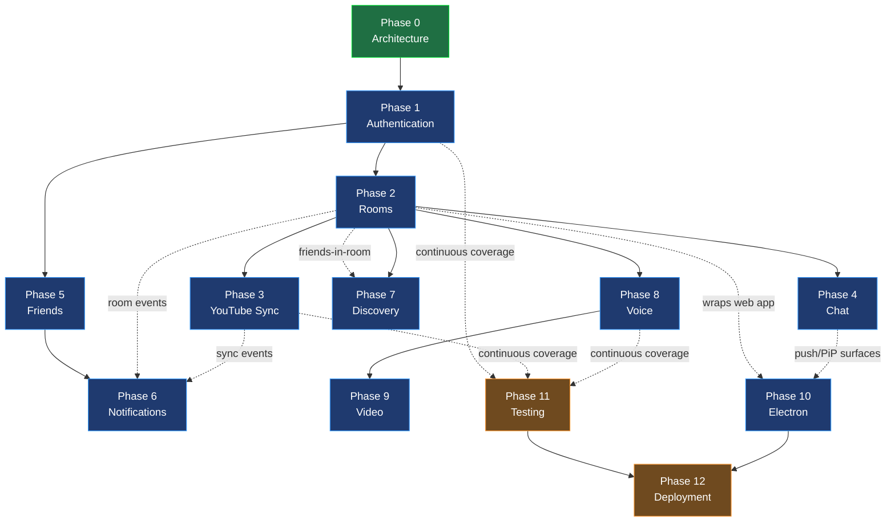
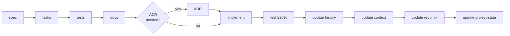

# Cowatch Development Phases (0 → 12)

> The end-to-end delivery plan for Cowatch: thirteen phases from Architecture to Deployment, each with goals, tasks, acceptance criteria, dependencies, risks, sizing, and documentation requirements. This is the master sequencing artifact that drives `tasks/`, `specs/`, and `project-state/`.

**Status:** CANON-DERIVED (Planning — Phase 0: Architecture)
**Owner agent:** Chief Architect / PM
**Last updated: 2026-06-27**

> Amended 2026-06-27: Resolved Open Questions per Chief Architect rulings — native Mongo text search first (Phase 7), DM threads as first slice of Phase 5, Phase 6 notifications in-app + realtime only, `apps/landing` parallel off-critical-path track, bounded 60 s/500-event resume buffer, and a 50-participants/room load-test target.

> This document is **subordinate to the canon**. On any conflict, [`../context/architecture.md`](../context/architecture.md) wins. Every type name, event name, route shape, role, and ADR id cited below matches the canon verbatim. Re-sequencing or scope changes here require a history entry + context update + repomix update (R3/R4); architectural changes require an ADR.

**Canon & cross-links**

- Architecture Canon (single source of truth): [`../context/architecture.md`](../context/architecture.md)
- Sibling docs: [System Architecture](./ARCHITECTURE.md) · [PRD](./PRD.md) · [Domain model](./DOMAIN.md) · [Database](./DATABASE.md) · [API](./API.md) · [Events](./EVENTS.md) · [Realtime](./REALTIME.md) · [Auth](./AUTH.md) · [Permissions](./PERMISSIONS.md) · [Sync](./SYNC.md) · [Social](./SOCIAL.md) · [Voice/Video (LiveKit)](./LIVEKIT.md) · [Security](./SECURITY.md) · [Testing](./TESTING.md) · [Deployment](./DEPLOYMENT.md)
- Recoverable state: [`../project-state/current-phase.md`](../project-state/current-phase.md) · [`../project-state/completed.md`](../project-state/completed.md)

---

## Table of Contents

1. [How to Read This Document](#1-how-to-read-this-document)
2. [Phase-Dependency Diagram](#2-phase-dependency-diagram)
3. [Per-Feature Workflow (applies inside every phase 1–12)](#3-per-feature-workflow-applies-inside-every-phase-112)
4. [Phase 0 — Architecture](#phase-0--architecture)
5. [Phase 1 — Authentication](#phase-1--authentication)
6. [Phase 2 — Rooms](#phase-2--rooms)
7. [Phase 3 — YouTube Sync](#phase-3--youtube-sync)
8. [Phase 4 — Chat](#phase-4--chat)
9. [Phase 5 — Friends](#phase-5--friends)
10. [Phase 6 — Notifications](#phase-6--notifications)
11. [Phase 7 — Discovery](#phase-7--discovery)
12. [Phase 8 — Voice](#phase-8--voice)
13. [Phase 9 — Video](#phase-9--video)
14. [Phase 10 — Electron](#phase-10--electron)
15. [Phase 11 — Testing](#phase-11--testing)
16. [Phase 12 — Deployment](#phase-12--deployment)
17. [Estimate Roll-Up & Critical Path](#estimate-roll-up--critical-path)
18. [Open Questions](#open-questions)
19. [Document Cross-Links](#document-cross-links)

---

## 1. How to Read This Document

Each phase entry uses the same fixed shape so it is machine- and human-scannable:

- **Goals** — the outcome the phase exists to produce.
- **Task list** — the concrete, orderable units of work (these seed `tasks/<phase>.md`).
- **Acceptance criteria** — binary, testable gates that must all be green to mark the phase **done**.
- **Dependencies** — which phases and which planning artifacts must precede it (R1/R5).
- **Risks** — the most likely ways the phase slips or ships broken, with the mitigation.
- **Estimate** — ideal engineering weeks **and** a relative T-shirt size; ideal weeks assume a focused engineer per area, not calendar time.
- **Documentation requirements** — the docs/ADRs/specs/state files that must be created or updated to satisfy R3–R5 before the phase is considered complete.

**Conventions used in estimates.** Sizes are `XS` (< 0.5 wk) · `S` (~1 wk) · `M` (~2 wk) · `L` (~3–4 wk) · `XL` (> 4 wk). Ideal-week ranges are deliberately conservative and assume the canon is stable; canon churn invalidates estimates.

**Hard gate (R1).** No application code is written until the Phase 0 artifacts are ratified and stakeholder approval is granted. We are currently paused at this gate — see [`../project-state/current-phase.md`](../project-state/current-phase.md).

---

## 2. Phase-Dependency Diagram

The graph below is the authoritative ordering. Solid arrows are **hard** dependencies (the upstream phase must be **done**); dashed arrows are **soft** dependencies (the downstream phase benefits from, but is not blocked by, the upstream one and can begin against stubs).

**Reading notes**

- **Phase 0 → Phase 1** is the only fully serial bottleneck; everything after the auth foundation can fan out.
- **Phase 2 (Rooms)** is the central hub: Sync, Chat, Discovery, Voice, and Electron all hang off it. Rooms is therefore on the critical path and gets the most scheduling protection.
- **Testing (11)** and **Deployment (12)** are drawn as terminal phases, but per the canon's process discipline they run **continuously** (90% coverage is enforced per-feature inside every phase). The terminal "Phase 11/12" work is the **hardening + release** push, not the first time we write tests or containers.

---

## 3. Per-Feature Workflow (applies inside every phase 1–12)

Per the canon ([§10 Cross-Cutting Non-Negotiables](../context/architecture.md#10-cross-cutting-non-negotiables)) and the SPEC, **every feature** inside a phase walks this pipeline before it is counted as done. A phase is done only when all its features have completed the full pipeline.

| Step | Artifact location | Gate (Rule) |
|---|---|---|
| spec | `specs/<feature>.md` | R5 |
| tasks | `tasks/<feature>.md` | R5 |
| tests | `specs/<feature>.md` acceptance + `*.spec.ts` plan | R5 |
| docs | `docs/*.md` | R5 |
| ADR (if architectural) | `adr/ADR-NNN-*.md` | R3 |
| implement | source (forbidden before R1 lifts) | R1 |
| test ≥ 90% | coverage report | R5 |
| update history | `history/decision-ledger.md`, `history/lessons-learned.md` | R3 |
| update context | `context/architecture.md` (+ notes) | R3/R4 |
| update repomix | `repomix/` snapshot | R3/R4 |
| update project-state | `project-state/*.md` | R2 |

> **R2 recoverability:** at the end of every task the `project-state/` files are updated so the project is fully restorable after a context-window reset.

---

## Phase 0 — Architecture

**Theme:** Establish the single source of truth and all foundational planning artifacts. **No application code.**

### Goals
- Ratify the Architecture Canon as the binding contract for all downstream work.
- Author ADR-001 … ADR-010 and the canon-derived design docs (architecture, domain, database, API, events, realtime, auth, permissions, sync, social, security, testing, deployment).
- Define the monorepo skeleton, directory/path map, naming conventions, and the realtime envelope/transport interface.
- Stand up the recoverability machinery (`history/`, `context/`, `project-state/`, `repomix/`) so R2–R5 are enforceable from day one.

### Task list
1. Ratify [`../context/architecture.md`](../context/architecture.md) as CANON.
2. Author all ADRs: monorepo ([ADR-001](../adr/ADR-001-monorepo.md)), NestJS ([ADR-002](../adr/ADR-002-nestjs.md)), Prisma/Mongo ([ADR-003](../adr/ADR-003-prisma.md)), realtime ([ADR-004](../adr/ADR-004-realtime.md)), LiveKit ([ADR-005](../adr/ADR-005-livekit.md)), Electron ([ADR-006](../adr/ADR-006-electron.md)), sync ([ADR-007](../adr/ADR-007-sync.md)), and the remaining canon ADRs (008 auth, 009 MinIO, 010 Docker).
3. Write canon-derived design docs in `docs/` ([ARCHITECTURE](./ARCHITECTURE.md), [DOMAIN](./DOMAIN.md), [DATABASE](./DATABASE.md), [API](./API.md), [EVENTS](./EVENTS.md), [REALTIME](./REALTIME.md), [AUTH](./AUTH.md), [PERMISSIONS](./PERMISSIONS.md), [SYNC](./SYNC.md), [SOCIAL](./SOCIAL.md), [SECURITY](./SECURITY.md), [TESTING](./TESTING.md), [DEPLOYMENT](./DEPLOYMENT.md), this PHASES doc).
4. Define the monorepo layout (`apps/{web,desktop,server,landing}`, `packages/{ui,auth,database,realtime,social,sdk,shared,types}`) and naming conventions.
5. Lock the `RealtimeEnvelope`, `RealtimeTransport`, and `PresenceState` interfaces in `packages/types` / `packages/realtime` (interface only).
6. Seed `history/`, `project-state/`, and `repomix/` baselines; define the per-feature workflow gates.
7. Draft the Phase 1 spec + tasks + acceptance criteria so coding can start immediately on approval (R5 lookahead).

### Acceptance criteria
- [ ] Canon ratified; every downstream doc cites it and matches type/event/route names verbatim.
- [ ] ADR-001 … ADR-010 exist at `adr/ADR-NNN-kebab-title.md` with rationale + consequences.
- [ ] Directory/path map and naming conventions documented and self-consistent with the canon.
- [ ] Realtime envelope/transport interfaces are defined and referenced identically across `packages/types`, `docs/REALTIME.md`, and the canon.
- [ ] `project-state/` is restorable (current-phase, completed, next-task, blockers populated).
- [ ] Phase 1 spec/tasks/acceptance drafted (R5 lookahead).
- [ ] **Stakeholder approval to begin coding (R1)** — BLOCKING.

### Dependencies
- **Phases:** none (root).
- **Artifacts:** the SPEC and canon inputs only.

### Risks
- **Canon drift after ratification** → downstream rework. *Mitigation:* freeze the canon; force all changes through ADR + history + context + repomix (R3/R4).
- **Over-design / analysis paralysis** → schedule slip with no code. *Mitigation:* timebox; defer non-blocking decisions to the Open Questions list with a recommendation.
- **Interfaces that look complete but are unbuildable** (e.g., realtime resume semantics). *Mitigation:* spike the resume handshake conceptually in [REALTIME.md](./REALTIME.md) before locking.

### Estimate
**~2 ideal weeks · M.** (Largely complete as of 2026-06-27 — see [`../project-state/completed.md`](../project-state/completed.md).)

### Documentation requirements
- **Create:** all `docs/*.md`, all `adr/ADR-00N-*.md`, `context/architecture.md`, this file.
- **Update:** `history/decision-ledger.md` (one entry per ADR), `project-state/current-phase.md`, `repomix/` baseline.

---

## Phase 1 — Authentication

**Theme:** Identity foundation. Everything downstream assumes an authenticated `User` and a `Session`.

### Goals
- Implement the full token model: RS256 JWT access (15 min) + rotating opaque refresh (30 d, httpOnly cookie scoped to `/api/v1/auth`).
- Support email/password, Google OAuth, guest accounts and guest→registered upgrade.
- Provide email verification, password reset, TOTP 2FA (enroll/verify/disable + recovery codes), and device-session management with revocation + refresh-reuse theft response.

### Task list
1. Scaffold `AuthModule`, `UsersModule`; Prisma models `users`, `sessions` ([DATABASE](./DATABASE.md)).
2. Implement RS256 JWT access tokens with claims `sub`, `sid`, `kind`, `roles`, `iat`, `exp`.
3. Implement rotating refresh-token family (hashed at rest) + reuse detection → revoke family.
4. `POST /api/v1/auth/register`, `/login`, `/refresh`, `/logout`; `GET /api/v1/me`.
5. Google OAuth flow at `/api/v1/auth/oauth/google`.
6. Guest accounts (`kind: guest`) + upgrade-to-registered path.
7. Email verification + password reset with single-use tokens.
8. TOTP 2FA enroll/verify/disable + recovery codes.
9. Device sessions: `GET /api/v1/auth/sessions`, `DELETE /api/v1/auth/sessions/:id`, `DELETE /api/v1/auth/sessions`.
10. Nest `JwtAuthGuard` + `packages/auth` client helpers; web auth flows + Zustand store.
11. Security middleware: Helmet, CSRF on cookie mutations, per-IP/per-user rate limiting on auth, strict CORS.

### Acceptance criteria
- [ ] Access token expires at 15 min; refresh rotates on every `POST /api/v1/auth/refresh` and the prior refresh is invalidated.
- [ ] Presenting a consumed refresh token revokes the **entire** session family and forces re-login.
- [ ] Refresh cookie is `httpOnly; Secure; SameSite=Strict` and scoped to `/api/v1/auth`.
- [ ] Google OAuth, guest creation, and guest→registered upgrade all succeed and produce a valid session.
- [ ] TOTP 2FA blocks login until verified; recovery codes are single-use.
- [ ] A user can list and revoke their own device sessions; revoke-all-others works.
- [ ] All inputs validated via `class-validator` DTOs; every error uses the standard REST error envelope.
- [ ] Coverage ≥ 90% on `AuthModule` + `packages/auth`.

### Dependencies
- **Phases:** Phase 0 (hard).
- **Artifacts:** [AUTH.md](./AUTH.md), [SECURITY.md](./SECURITY.md), [ADR-008](../adr/ADR-008-auth-tokens.md), [DATABASE.md](./DATABASE.md), `specs/auth.md`.

### Risks
- **Refresh-rotation race conditions** (parallel tabs) → false-positive family revocation. *Mitigation:* short grace/idempotency window on rotation; covered by concurrency tests.
- **OAuth redirect/callback misconfig across web + desktop**. *Mitigation:* document allowlisted redirect URIs per environment in [AUTH.md](./AUTH.md); test desktop deep-link flow early.
- **2FA recovery-code leakage / weak hashing.** *Mitigation:* argon2/bcrypt per canon §10; recovery codes hashed, shown once.

### Estimate
**~3 ideal weeks · L.** (Highest-risk foundation; do not compress.)

### Documentation requirements
- **Spec/tasks:** `specs/auth.md`, `tasks/auth.md`.
- **Docs:** [AUTH.md](./AUTH.md), [SECURITY.md](./SECURITY.md), [API.md](./API.md) (auth routes), [DATABASE.md](./DATABASE.md) (users/sessions).
- **ADR:** confirm [ADR-008](../adr/ADR-008-auth-tokens.md); new ADR only if the model deviates.
- **State/history:** `history/decision-ledger.md`, `project-state/*`, `repomix/` after merge.

---

## Phase 2 — Rooms

**Theme:** The central hub. Rooms own membership, the permission model, and ownership transfer.

### Goals
- Implement `Room`, `Membership`, roles (`Owner`/`Moderator`/`Member`/`Guest`), and the permission matrix.
- Support visibility `public`/`private`/`password`, permanent/temporary rooms, and `InviteLink`s.
- Implement the ownership-transfer algorithm and join-approval flow over realtime.

### Task list
1. `RoomsModule`, `MembershipsModule`; models `rooms`, `memberships`, `invite_links` with canon denorm fields (`Room.ownerId/ownerDisplayName`, `Membership.userDisplayName/userAvatarUrl`).
2. CRUD: `POST /api/v1/rooms`, `GET /api/v1/rooms`, `GET/PATCH /api/v1/rooms/:roomId`, `GET /api/v1/rooms/:roomId/members`.
3. Join flows: public join, password join, private + join-approval; `InviteLink` create/redeem (expiring/single-use).
4. Permission model + `RoomRole` guard deriving the canon matrix; mod actions: kick, ban, mute, timeout.
5. Room settings (chat lock, playlist lock, `SyncAuthority` mode) + `room:settings:update`.
6. Ownership transfer: grace window (30 s) → nominate → oldest active mod → oldest active member → teardown/persist; `POST /api/v1/rooms/:roomId/ownership/transfer`.
7. Realtime room events: `room:member:join`, `room:member:leave`, `room:ownership:transfer`, `room:settings:update`.
8. Web: room shell, member list, settings panel, role-gated UI.

### Acceptance criteria
- [ ] `memberships (roomId, userId)` is unique; a user cannot double-join.
- [ ] The permission matrix matches the canon exactly for all four roles, including `◐` gates.
- [ ] Password and private+approval joins are enforced server-side; guests get `Guest` defaults.
- [ ] Ownership transfer follows the canon order, is atomic, and emits `room:ownership:transfer` + a `room.ownership_transfer` notification.
- [ ] Temporary rooms schedule teardown when empty; permanent rooms persist ownerless and re-run transfer on return.
- [ ] Invite links honor expiry/single-use.
- [ ] Coverage ≥ 90% on `RoomsModule` + `MembershipsModule`.

### Dependencies
- **Phases:** Phase 1 (hard).
- **Artifacts:** [DOMAIN.md](./DOMAIN.md), [PERMISSIONS.md](./PERMISSIONS.md), [REALTIME.md](./REALTIME.md), [DATABASE.md](./DATABASE.md), `specs/rooms.md`.

### Risks
- **Ownership-transfer edge cases** (simultaneous disconnect, empty room, split-brain across server instances). *Mitigation:* model as a server-authoritative state machine; property-test the transition table.
- **Permission-matrix drift** between server guard and UI. *Mitigation:* single source in `packages/types`; UI derives from the same enum.
- **Denormalized display-name/avatar staleness.** *Mitigation:* realtime re-fan + background reconciliation per canon §4.

### Estimate
**~3–4 ideal weeks · L.** (Critical path — protect this slot.)

### Documentation requirements
- **Spec/tasks:** `specs/rooms.md`, `tasks/rooms.md`.
- **Docs:** [DOMAIN.md](./DOMAIN.md), [PERMISSIONS.md](./PERMISSIONS.md), [API.md](./API.md), [EVENTS.md](./EVENTS.md), [DATABASE.md](./DATABASE.md).
- **ADR:** only if visibility/transfer semantics deviate from canon §6.
- **State/history:** ledger + `project-state/*` + `repomix/`.

---

## Phase 3 — YouTube Sync

**Theme:** Server-authoritative synchronized playback (drift target < 500 ms).

### Goals
- Implement the `Playlist`/`QueueItem` model and `PlaybackState` server-authoritative clock.
- Implement the sync algorithm: 2 s heartbeat, effective-position math, drift correction tiers, authority enforcement.
- Support queue management (add, drag-reorder, remove), voting, skip-voting, and autoplay.

### Task list
1. `PlaylistModule`, `PlaybackModule`; models `playlists`, `queue_items` with `QueueItem.addedByDisplayName` denorm.
2. YouTube provider adapter (id/title/duration resolution) behind a `MediaProvider` interface (provider-agnostic for future sources).
3. Server `PlaybackState { itemId, positionMs, isPlaying, rate, serverEpochMs }`; authority modes `owner_only`/`owner_moderators`/`everyone`.
4. Mutating events `playback:play|pause|seek|rate`; authority validation → `FORBIDDEN_SYNC` on violation.
5. `playback:sync` heartbeat every 2 s + immediately on state change; clock-offset ping/pong on connect + periodically.
6. Client drift correction: `<500 ms` none; `500 ms–2 s` rate glide ±5–10%; `≥2 s` hard seek.
7. Queue: `POST /api/v1/rooms/:roomId/playlist/items`, reorder, remove; voting + skip-vote outcome → autoplay advance.
8. Late-joiner immediate `playback:sync` snapshot.

### Acceptance criteria
- [ ] Steady-state cross-client drift measures **< 500 ms** under the test harness.
- [ ] Only authority-qualified members can mutate playback; others receive `system:error` with `FORBIDDEN_SYNC`.
- [ ] Server re-stamps `serverEpochMs` on every applied mutation and broadcasts `playback:sync`.
- [ ] Drift tiers behave exactly per canon §7 (none / rate-glide / hard seek).
- [ ] Volume, subtitles, audio track, and quality are **NOT** synced (verified per-client).
- [ ] Skip-vote outcome and autoplay advance the queue and re-sync all clients.
- [ ] Late joiners converge to < 500 ms within one heartbeat cycle.
- [ ] Coverage ≥ 90% on playback/playlist modules.

### Dependencies
- **Phases:** Phase 2 (hard — rooms own playback), Phase 1 (hard).
- **Artifacts:** [SYNC.md](./SYNC.md), [ADR-007](../adr/ADR-007-sync.md), [REALTIME.md](./REALTIME.md), `specs/youtube-sync.md`.

### Risks
- **Clock-offset inaccuracy / RTT jitter** → false drift corrections. *Mitigation:* median-filter RTT samples; only correct on sustained drift.
- **YouTube IFrame API quirks** (buffering, ad interruptions, autoplay policies). *Mitigation:* treat player state as advisory; the server clock is authoritative; document known player states in [SYNC.md](./SYNC.md).
- **Rate-glide oscillation** at the 500 ms boundary. *Mitigation:* hysteresis band; cap correction magnitude.

### Estimate
**~3 ideal weeks · L.** (Algorithmically the hardest phase.)

### Documentation requirements
- **Spec/tasks:** `specs/youtube-sync.md`, `tasks/youtube-sync.md`.
- **Docs:** [SYNC.md](./SYNC.md), [EVENTS.md](./EVENTS.md), [REALTIME.md](./REALTIME.md), [DATABASE.md](./DATABASE.md).
- **ADR:** [ADR-007](../adr/ADR-007-sync.md) (confirm); new ADR if a second media provider lands.
- **State/history:** ledger + `project-state/*` + `repomix/`.

---

## Phase 4 — Chat

**Theme:** Room-scoped and DM text chat with reactions, mentions, typing, and attachments.

### Goals
- Implement `Message` (channel-scoped: room channel or DM thread) with edit/delete, reactions (capped, embedded), mentions, GIF/emoji attachments.
- Implement typing indicators and chat-lock enforcement; honor `Guest` chat gating.

### Task list
1. `ChatModule`; models `messages`, `dm_threads` with `Message.authorDisplayName/authorAvatarUrl` denorm and `messages (roomId, createdAt)` index.
2. Send/edit/delete: `chat:message:new|edit|delete`; soft-delete via `deletedAt`.
3. Embedded capped `reactions`; `chat:reaction:add`.
4. Mentions → emit `mention` notification (wires into Phase 6).
5. `chat:typing` indicator; chat-lock + `Guest` send-gating per permission matrix.
6. GIF/emoji attachments; MinIO signed-URL uploads where applicable.
7. Web chat UI: virtualized list, composer, reactions, typing, mention autocomplete.

### Acceptance criteria
- [ ] Messages are referenced (never embedded in room); `messages (roomId, createdAt)` index present.
- [ ] Edit/delete enforce authorship + moderator rights; delete is soft (`deletedAt`).
- [ ] Reactions are embedded and capped; over-cap is rejected gracefully.
- [ ] Chat lock blocks non-privileged sends; guest sends honor `chatLock`/`◐` gating.
- [ ] Mentions produce a `mention` notification payload (consumed in Phase 6).
- [ ] Typing indicator emits/expires correctly.
- [ ] Coverage ≥ 90% on `ChatModule`.

### Dependencies
- **Phases:** Phase 2 (hard — channels live in rooms), Phase 1 (hard). DM threads depend on Phase 5 friendship for friend-gating but can ship room chat first.
- **Artifacts:** [DOMAIN.md](./DOMAIN.md), [EVENTS.md](./EVENTS.md), [PERMISSIONS.md](./PERMISSIONS.md), `specs/chat.md`.

### Risks
- **Unbounded message growth** if accidentally embedded. *Mitigation:* canon hard rule — separate collection + back-reference; enforced in schema review.
- **Mention/notification coupling** before Phase 6 exists. *Mitigation:* emit a typed event now; buffer until the notification consumer lands.
- **Attachment abuse / unsafe uploads.** *Mitigation:* MinIO signed URLs, content-type allowlist, size caps (canon §10).

### Estimate
**~2 ideal weeks · M.**

### Documentation requirements
- **Spec/tasks:** `specs/chat.md`, `tasks/chat.md`.
- **Docs:** [DOMAIN.md](./DOMAIN.md), [EVENTS.md](./EVENTS.md), [DATABASE.md](./DATABASE.md), [API.md](./API.md).
- **State/history:** ledger + `project-state/*` + `repomix/`.

---

## Phase 5 — Friends

**Theme:** The social graph — friends, requests, presence, DMs, blocks, profiles.

### Goals
- Implement `Friendship`, `FriendRequest`, `Block`, presence (`online`/`idle`/`dnd`/`offline`), DM threads, and the activity feed.
- Implement user profiles and the social surfaces in `packages/social`.

### Task list
1. `SocialModule`; models `friendships` (unique `(userIdA, userIdB)`), `friend_requests`, `blocks`.
2. Request lifecycle: `social:friend:request`, `social:friend:accept`; decline/cancel.
3. Presence: `presence:update`, `PresenceState` with `activity { kind: 'room', roomId }`.
4. Blocks: directed suppression across social surfaces.
5. DM threads (`dm_threads`) building on Phase 4 message infra.
6. ActivityFeed stream; user profile read/update.
7. Web: friends panel, presence indicators, DM UI, block management.

### Acceptance criteria
- [ ] `friendships (userIdA, userIdB)` is unique and canonicalized (stable ordering) to prevent duplicates.
- [ ] Friend request → accept produces a mutual `Friendship`; decline/cancel clean up the `FriendRequest`.
- [ ] Presence transitions and in-room activity propagate via `presence:update`.
- [ ] Blocks suppress the blocked user across friends, presence, and DM surfaces (directed).
- [ ] DMs reuse the message model and are friend/block-gated.
- [ ] Coverage ≥ 90% on `SocialModule` + `packages/social`.

### Dependencies
- **Phases:** Phase 1 (hard). Phase 4 (soft — DM threads reuse chat infra). Phase 2 (soft — in-room presence activity).
- **Artifacts:** [SOCIAL.md](./SOCIAL.md), [EVENTS.md](./EVENTS.md), [DATABASE.md](./DATABASE.md), `specs/friends.md`.

### Risks
- **Bidirectional friendship duplication / asymmetry.** *Mitigation:* canonical `(userIdA < userIdB)` ordering + unique index.
- **Presence fan-out cost** at scale. *Mitigation:* presence is ephemeral, topic-scoped; debounce updates.
- **Block bypass** through DMs or room joins. *Mitigation:* enforce block checks at every social entry point, server-side.

### Estimate
**~2–3 ideal weeks · M/L.**

### Documentation requirements
- **Spec/tasks:** `specs/friends.md`, `tasks/friends.md`.
- **Docs:** [SOCIAL.md](./SOCIAL.md), [EVENTS.md](./EVENTS.md), [DATABASE.md](./DATABASE.md), [API.md](./API.md).
- **State/history:** ledger + `project-state/*` + `repomix/`.

---

## Phase 6 — Notifications

**Theme:** User-targeted notification feed across all canon notification types.

### Goals
- Implement the `Notification` feed and all canon types: `friend.online`, `friend.room_started`, `friend.invitation`, `mention`, `dm`, `room.ownership_transfer`, `room.user_joined`.
- Deliver via realtime (`notification:new`) and persist for the feed with read/unread state.

### Task list
1. `NotificationsModule`; model `notifications` with `notifications (userId, readAt, createdAt)` index.
2. Producer hooks: friends (Phase 5), rooms/transfer (Phase 2), mentions/DMs (Phase 4/5), `room.user_joined` (Phase 2).
3. `notification:new` realtime delivery; feed read endpoints + mark-read.
4. Per-user notification preferences (mute categories).
5. Web: notification bell, feed, unread badges.

### Acceptance criteria
- [ ] All seven canon notification types are produced and rendered.
- [ ] `notifications (userId, readAt, createdAt)` index present; feed paginates and marks read.
- [ ] `notification:new` fires in realtime and reconciles with the persisted feed.
- [ ] Preferences suppress muted categories without dropping persisted records.
- [ ] Coverage ≥ 90% on `NotificationsModule`.

### Dependencies
- **Phases:** Phase 5 (hard — friend events), Phase 2 (hard — room/transfer events), Phase 4 (hard — mentions/DM). Producers must exist to consume.
- **Artifacts:** [SOCIAL.md](./SOCIAL.md), [EVENTS.md](./EVENTS.md), `specs/notifications.md`.

### Risks
- **Duplicate/storm notifications** (e.g., friend online flapping). *Mitigation:* debounce + dedupe window per (type, actor, target).
- **Producer coupling** across many phases. *Mitigation:* a single typed event bus; producers emit, notifications consume.

### Estimate
**~1.5 ideal weeks · S/M.**

### Documentation requirements
- **Spec/tasks:** `specs/notifications.md`, `tasks/notifications.md`.
- **Docs:** [EVENTS.md](./EVENTS.md), [SOCIAL.md](./SOCIAL.md), [DATABASE.md](./DATABASE.md), [API.md](./API.md).
- **State/history:** ledger + `project-state/*` + `repomix/`.

---

## Phase 7 — Discovery

**Theme:** Room discovery + cross-entity search.

### Goals
- Implement room discovery (name, current video, viewer count, tags, NSFW flag, friends-inside) and search across users, friends, rooms, messages, videos, tags.

### Task list
1. `DiscoveryModule`; rely on `rooms (visibility, isActive)` index + discovery denorm (`Room.currentVideoTitle`, `Room.viewerCount`).
2. Discovery listing endpoint with filters (tags, NSFW, visibility) and friends-inside enrichment.
3. Search across users/friends/rooms/messages/videos/tags (text-eligible search index per canon §4).
4. Web: discovery grid, search UI, friend-presence overlays.

### Acceptance criteria
- [ ] Discovery shows name, current video, viewer count, tags, NSFW flag, and friends inside per room.
- [ ] Search returns results across all six entity classes with relevance ordering.
- [ ] Listing uses the `rooms (visibility, isActive)` index and discovery denorm fields (no fan-out joins).
- [ ] NSFW flag and visibility are honored (private rooms never leak).
- [ ] Coverage ≥ 90% on `DiscoveryModule`.

### Dependencies
- **Phases:** Phase 2 (hard — rooms/denorm), Phase 5 (soft — friends-inside enrichment), Phase 3 (soft — `currentVideoTitle`), Phase 4 (soft — message search).
- **Artifacts:** [DOMAIN.md](./DOMAIN.md), [DATABASE.md](./DATABASE.md), `specs/discovery.md`.

### Risks
- **Search index cost/complexity** on MongoDB. *Mitigation:* start with native text indexes; document an external-search escape hatch (ADR if adopted).
- **Stale discovery denorm** (viewer count / current video). *Mitigation:* realtime re-fan + reconciliation per canon §4; accept eventual consistency.

### Estimate
**~2 ideal weeks · M.**

### Documentation requirements
- **Spec/tasks:** `specs/discovery.md`, `tasks/discovery.md`.
- **Docs:** [DATABASE.md](./DATABASE.md), [API.md](./API.md).
- **ADR:** required only if an external search engine is adopted.
- **State/history:** ledger + `project-state/*` + `repomix/`.

---

## Phase 8 — Voice

**Theme:** LiveKit-backed audio channels inside rooms.

### Goals
- Implement `VoiceChannel` (visibility `public`/`password`) with LiveKit audio: multiple channels per room, join/leave, token minting, presence in channel.

### Task list
1. `VoiceModule`; model `voice_channels`; LiveKit server SDK + token minting service.
2. Channel CRUD; public + password-protected channels.
3. `voice:channel:join`/`voice:channel:leave`; participant presence.
4. LiveKit room mapping (room ↔ LiveKit room ↔ channel) and least-privilege grants.
5. Web: voice channel list, join UI, speaking indicators, mute/deafen.

### Acceptance criteria
- [ ] Multiple voice channels per room; public and password channels enforced server-side.
- [ ] LiveKit tokens are minted server-side with least-privilege grants and short TTL.
- [ ] `voice:channel:join`/`leave` reflect participant presence accurately.
- [ ] Channel password gating cannot be bypassed client-side.
- [ ] Coverage ≥ 90% on `VoiceModule` (token logic + state; media path verified via integration).

### Dependencies
- **Phases:** Phase 2 (hard — channels live in rooms), Phase 1 (hard).
- **Artifacts:** [LIVEKIT.md](./LIVEKIT.md), [ADR-005](../adr/ADR-005-livekit.md), `specs/voice.md`.

### Risks
- **LiveKit deployment/scaling + TURN/NAT traversal.** *Mitigation:* containerized LiveKit (canon §ADR-010); document TURN config in [DEPLOYMENT.md](./DEPLOYMENT.md).
- **Token-grant over-permissioning.** *Mitigation:* mint per-channel scoped grants; never reuse tokens across channels.

### Estimate
**~2–3 ideal weeks · M/L.** (External-infra integration risk.)

### Documentation requirements
- **Spec/tasks:** `specs/voice.md`, `tasks/voice.md`.
- **Docs:** [LIVEKIT.md](./LIVEKIT.md), [EVENTS.md](./EVENTS.md), [DEPLOYMENT.md](./DEPLOYMENT.md), [DATABASE.md](./DATABASE.md).
- **ADR:** [ADR-005](../adr/ADR-005-livekit.md) (confirm).
- **State/history:** ledger + `project-state/*` + `repomix/`.

---

## Phase 9 — Video

**Theme:** Camera video + screen sharing on top of the voice channels.

### Goals
- Add camera video and screen-share tracks to voice channels via LiveKit; manage layouts and active-speaker/screen focus.

### Task list
1. Extend `VoiceModule` for video + screen-share tracks (publish/subscribe grants).
2. Screen-share capture (web + Electron desktop-capturer path noted for Phase 10).
3. Layout management: grid, spotlight, active-speaker; screen-share focus.
4. Web: video tiles, screen-share controls, device selection.

### Acceptance criteria
- [ ] Users can publish camera and screen-share tracks within a channel.
- [ ] Layouts switch correctly (grid / spotlight / screen-focus); active speaker is highlighted.
- [ ] Track publish grants are scoped; subscribers see only permitted tracks.
- [ ] Per-client video quality remains **NOT** synced (independent of playback sync).
- [ ] Coverage ≥ 90% on the video-control logic.

### Dependencies
- **Phases:** Phase 8 (hard — extends voice channels).
- **Artifacts:** [LIVEKIT.md](./LIVEKIT.md), `specs/video.md`.

### Risks
- **Screen-share permissions differ web vs Electron.** *Mitigation:* abstract capture source; finalize Electron `desktopCapturer` path in Phase 10.
- **Bandwidth/CPU under many video publishers.** *Mitigation:* LiveKit simulcast + publisher caps; document limits.

### Estimate
**~2 ideal weeks · M.**

### Documentation requirements
- **Spec/tasks:** `specs/video.md`, `tasks/video.md`.
- **Docs:** [LIVEKIT.md](./LIVEKIT.md).
- **State/history:** ledger + `project-state/*` + `repomix/`.

---

## Phase 10 — Electron

**Theme:** Native desktop shell wrapping the web app.

### Goals
- Ship `apps/desktop` (Electron + electron-builder) with PiP, push notifications, hardware acceleration, auto-update, and IPC.

### Task list
1. Scaffold `apps/desktop` wrapping `apps/web`; main/preload/renderer split with contextIsolation.
2. Picture-in-picture (synced playback continues; PiP itself is per-client/local).
3. Native push notifications bridged from the notification feed (Phase 6).
4. Hardware acceleration + screen-share via `desktopCapturer` (completes Phase 9 path).
5. Auto-update via electron-builder; signed installers per platform.
6. Secure IPC contract (typed, least-privilege channels).

### Acceptance criteria
- [ ] Desktop app loads the web app with `contextIsolation` on and no remote module exposure.
- [ ] PiP works and playback stays server-synced while in PiP.
- [ ] Native push surfaces canon notification types from the feed.
- [ ] Auto-update delivers signed builds; rollback path documented.
- [ ] Screen-share via `desktopCapturer` integrates with Phase 8/9 channels.
- [ ] Coverage ≥ 90% on IPC/bridge logic (E2E for the shell).

### Dependencies
- **Phases:** Phase 2 (hard — wraps the functional web app); Phase 6 (hard — push needs notifications); Phase 9 (hard — desktop screen-share path).
- **Artifacts:** [ADR-006](../adr/ADR-006-electron.md), `specs/electron.md`, [DEPLOYMENT.md](./DEPLOYMENT.md).

### Risks
- **IPC security holes** (overexposed bridges). *Mitigation:* strict typed IPC allowlist; no `nodeIntegration` in renderer.
- **Code signing / notarization** per OS. *Mitigation:* document certificates + CI signing in [DEPLOYMENT.md](./DEPLOYMENT.md) early.
- **Auto-update channel mistakes** (shipping a broken update broadly). *Mitigation:* staged rollout + rollback.

### Estimate
**~2–3 ideal weeks · M/L.**

### Documentation requirements
- **Spec/tasks:** `specs/electron.md`, `tasks/electron.md`.
- **Docs:** [DEPLOYMENT.md](./DEPLOYMENT.md), [ADR-006](../adr/ADR-006-electron.md) (confirm).
- **State/history:** ledger + `project-state/*` + `repomix/`.

---

## Phase 11 — Testing

**Theme:** Hardening to the 90% coverage bar + E2E, load, and resilience suites. (Per-feature tests already exist from R5; this phase is the program-level hardening push.)

### Goals
- Reach and enforce the 90% coverage target across all apps/packages.
- Add cross-feature E2E (auth→room→sync→chat→voice), load/soak (sync drift at scale, presence fan-out), and chaos/reconnection tests.

### Task list
1. Coverage audit across all modules; close gaps to ≥ 90%.
2. E2E happy paths + critical edge cases (ownership transfer, refresh-reuse revocation, drift correction tiers).
3. Load tests: sync drift under N clients/room; presence + notification fan-out.
4. Resilience: realtime reconnection/resume handshake, transport failover.
5. CI gates: coverage threshold, lint, type-check, contract tests on the `RealtimeEnvelope` + REST envelopes.
6. Security tests: authz matrix, CSRF, rate limits, signed-URL scope.

### Acceptance criteria
- [ ] Aggregate coverage ≥ 90%; CI fails below threshold.
- [ ] E2E suite green across the full critical path.
- [ ] Measured sync drift stays < 500 ms at the target concurrency.
- [ ] Reconnection/resume converges without duplicate or lost events.
- [ ] Authz, CSRF, and rate-limit security tests pass.

### Dependencies
- **Phases:** all feature phases (1–10) for full E2E; runs continuously alongside them.
- **Artifacts:** [TESTING.md](./TESTING.md), every feature `specs/*.md`.

### Risks
- **Flaky realtime/timing tests.** *Mitigation:* deterministic virtual clock + controlled offset injection.
- **Coverage gaming** (tests without assertions). *Mitigation:* mutation testing on critical modules (auth, sync, permissions).

### Estimate
**~2–3 ideal weeks · M/L** for the dedicated hardening push (plus continuous effort folded into every phase).

### Documentation requirements
- **Docs:** [TESTING.md](./TESTING.md) (strategy, harnesses, coverage policy), per-feature acceptance updates.
- **State/history:** `history/lessons-learned.md`, `project-state/known-bugs.md`, ledger, `repomix/`.

---

## Phase 12 — Deployment

**Theme:** Docker-first delivery to local / VPS / Vercel / production, with observability and operational readiness.

### Goals
- Containerize every service; ship reproducible Docker Compose / orchestration across all targets per ADR-010.
- Wire MinIO, MongoDB, LiveKit, and the realtime transport for production; enable observability (pino logs, Prometheus metrics, health endpoints) and CI/CD.

### Task list
1. Dockerfiles for `apps/{web,server,landing}` + Compose for MongoDB, MinIO, LiveKit, realtime.
2. Environment matrix (local / VPS / Vercel / production); `REALTIME_TRANSPORT` selection per target.
3. Observability: pino JSON logs, `correlationId` propagation, Prometheus metrics, `/health/live` + `/health/ready` on every service.
4. Secrets via env/secret store; TLS everywhere; least-privilege MinIO buckets + signed URLs.
5. CI/CD pipeline: build → test (≥90%) → image push → deploy; auto-update artifact publishing for desktop.
6. Backups (MongoDB), MinIO lifecycle, runbooks + rollback.

### Acceptance criteria
- [ ] Every service runs in Docker with parity from local to production (ADR-010).
- [ ] `/health/live` and `/health/ready` respond on all services; metrics scrape successfully.
- [ ] `correlationId` propagates across HTTP → service → WS → logs.
- [ ] Secrets are never committed; TLS enforced; MinIO buckets least-privilege with signed-URL uploads.
- [ ] CI/CD blocks deploy on failing tests or sub-90% coverage.
- [ ] Documented backup + rollback runbook validated by a restore drill.

### Dependencies
- **Phases:** Phase 11 (hard — quality gate), Phase 10 (hard — desktop artifacts), and all services existing.
- **Artifacts:** [DEPLOYMENT.md](./DEPLOYMENT.md), [SECURITY.md](./SECURITY.md), [ADR-009](../adr/ADR-009-minio.md), [ADR-010](../adr/ADR-010-docker.md).

### Risks
- **Environment drift** (local works, prod breaks). *Mitigation:* Docker-first parity (ADR-010); identical images across targets.
- **Vercel vs VPS realtime transport mismatch.** *Mitigation:* config-driven `REALTIME_TRANSPORT`; adapters validated per target before cutover.
- **Secret leakage / misconfigured CORS or TLS.** *Mitigation:* security checklist in [SECURITY.md](./SECURITY.md); pre-prod audit.

### Estimate
**~2 ideal weeks · M** (assuming Docker hygiene maintained throughout earlier phases).

### Documentation requirements
- **Docs:** [DEPLOYMENT.md](./DEPLOYMENT.md), [SECURITY.md](./SECURITY.md), runbooks.
- **ADR:** [ADR-009](../adr/ADR-009-minio.md), [ADR-010](../adr/ADR-010-docker.md) (confirm); new ADR for any production topology decision.
- **State/history:** ledger + `project-state/*` + final `repomix/` snapshot.

---

## Estimate Roll-Up & Critical Path

| Phase | Name | Size | Ideal weeks | On critical path? |
|---|---|:--:|:--:|:--:|
| 0 | Architecture | M | ~2 | Yes (root) |
| 1 | Authentication | L | ~3 | **Yes** |
| 2 | Rooms | L | ~3–4 | **Yes (hub)** |
| 3 | YouTube Sync | L | ~3 | Yes |
| 4 | Chat | M | ~2 | No (parallel to 3) |
| 5 | Friends | M/L | ~2–3 | No (parallel after 1) |
| 6 | Notifications | S/M | ~1.5 | No |
| 7 | Discovery | M | ~2 | No |
| 8 | Voice | M/L | ~2–3 | Yes |
| 9 | Video | M | ~2 | Yes (after 8) |
| 10 | Electron | M/L | ~2–3 | Yes |
| 11 | Testing | M/L | ~2–3 | **Yes (gate)** |
| 12 | Deployment | M | ~2 | **Yes (gate)** |

- **Serial critical path (no parallelism):** ~28–33 ideal weeks.
- **With fan-out after Phase 1** (Chat ∥ Friends ∥ Notifications ∥ Discovery overlap with Sync; Voice/Video as a track): a 2–3 engineer team can realistically compress calendar time substantially. The hard sequence that cannot be parallelized away is **0 → 1 → 2 → {3 | 8→9} → 10 → 11 → 12**.
- **Protect Phase 2 (Rooms)** above all: it is the dependency hub. Any slip there cascades into Sync, Chat, Discovery, Voice, and Electron.

---

## Open Questions

> Genuinely undecided items, each with a recommendation. None block Phase 0 ratification; each must be resolved before its owning phase begins.

1. **Search backend (Phase 7).** Native MongoDB text indexes vs an external engine (e.g., a dedicated search service) for cross-entity search at scale.
   - *Recommendation:* ship native text indexes first (no new infra, satisfies canon §4); add an ADR + external engine only if discovery latency/recall fails the acceptance bar.
   - **Resolution (2026-06-27):** Ship native Mongo text indexes first; add an external engine + ADR only if discovery acceptance fails. (PHASES-1 / DB OQ-3.) — **Status: Deferred to Phase 7.**
2. **DM threads timing (Phase 4 vs Phase 5).** Room chat clearly lands in Phase 4; DM threads depend on friendship gating from Phase 5.
   - *Recommendation:* build the message/channel infra in Phase 4, land DM threads as the first slice of Phase 5 to keep friend/block gating coherent.
   - **Resolution (2026-06-27):** Build message/channel infra in Phase 4; land DM threads as the **first slice of Phase 5**. (PHASES-2.) — **Status: Resolved.**
3. **Notification delivery beyond in-app/desktop push (email/web-push).** The canon defines the in-app feed + `notification:new`; Electron adds native push (Phase 10).
   - *Recommendation:* scope Phase 6 to in-app + realtime; defer email/web-push to a post-MVP ADR.
   - **Resolution (2026-06-27):** Phase 6 = **in-app + realtime only**; email/web-push deferred to a post-MVP ADR. (PHASES-3.) — **Status: Resolved.**
4. **Landing site sequencing (`apps/landing`).** Not tied to a numbered phase.
   - *Recommendation:* treat as a parallel, low-dependency track owned by the Documentation/Frontend agents; ship before Phase 12 launch but do not place it on the critical path.
   - **Resolution (2026-06-27):** `apps/landing` is a **parallel low-dependency track**, before Phase 12, off the critical path. (PHASES-4.) — **Status: Resolved.**
5. **Resume-buffer retention window (Phase 3/realtime).** The canon allows resume "where the server buffer allows."
   - *Recommendation:* fix a bounded per-room event buffer (e.g., last N seconds / M events); on overflow, force a fresh `playback:sync` + snapshot. Finalize the bound in [REALTIME.md](./REALTIME.md) during Phase 3 and record it in the ledger.
   - **Resolution (2026-06-27):** Bounded per-room resume buffer = **60 s / 500 events**; overflow forces a fresh `playback:sync` + snapshot (tied to ADR-011). (PHASES-5.) — **Status: Resolved.**
6. **Target concurrency for the < 500 ms drift load test (Phase 11).** The drift target is fixed; the concurrency at which it must hold is not.
   - *Recommendation:* set an explicit per-room participant target (e.g., 50/room) and a total-rooms target in [TESTING.md](./TESTING.md) before Phase 11 load tests.
   - **Resolution (2026-06-27):** Load-test target = **50 participants/room** before Phase 11. (PHASES-6.) — **Status: Resolved.**

---

## Document Cross-Links

- **Canon:** [`../context/architecture.md`](../context/architecture.md)
- **Architecture & domain:** [ARCHITECTURE.md](./ARCHITECTURE.md) · [DOMAIN.md](./DOMAIN.md) · [DATABASE.md](./DATABASE.md)
- **Contracts:** [API.md](./API.md) · [EVENTS.md](./EVENTS.md) · [REALTIME.md](./REALTIME.md)
- **Feature docs:** [AUTH.md](./AUTH.md) · [PERMISSIONS.md](./PERMISSIONS.md) · [SYNC.md](./SYNC.md) · [SOCIAL.md](./SOCIAL.md) · [LIVEKIT.md](./LIVEKIT.md)
- **Cross-cutting:** [SECURITY.md](./SECURITY.md) · [TESTING.md](./TESTING.md) · [DEPLOYMENT.md](./DEPLOYMENT.md) · [PRD.md](./PRD.md)
- **ADRs:** [001](../adr/ADR-001-monorepo.md) · [002](../adr/ADR-002-nestjs.md) · [003](../adr/ADR-003-prisma.md) · [004](../adr/ADR-004-realtime.md) · [005](../adr/ADR-005-livekit.md) · [006](../adr/ADR-006-electron.md) · [007](../adr/ADR-007-sync.md) · [008](../adr/ADR-008-auth-tokens.md) · [009](../adr/ADR-009-minio.md) · [010](../adr/ADR-010-docker.md)
- **Recoverable state:** [`../project-state/current-phase.md`](../project-state/current-phase.md) · [`../project-state/completed.md`](../project-state/completed.md) · [`../project-state/next-task.md`](../project-state/next-task.md)
