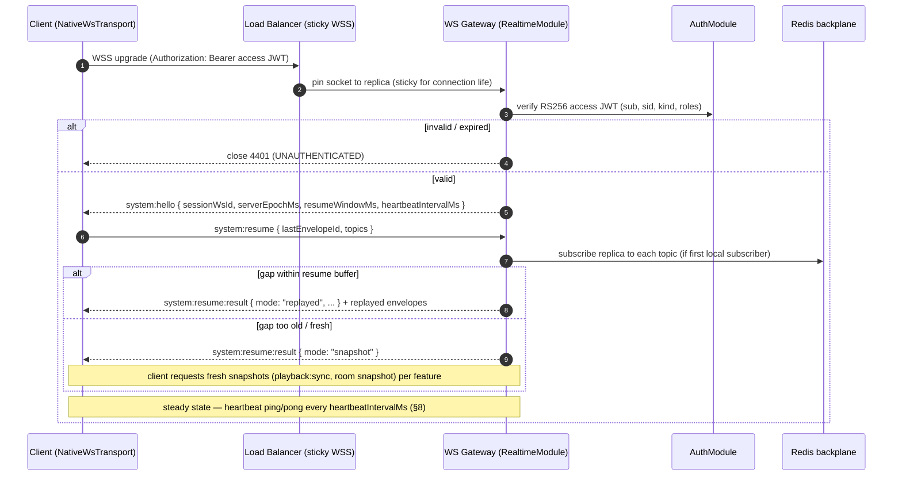
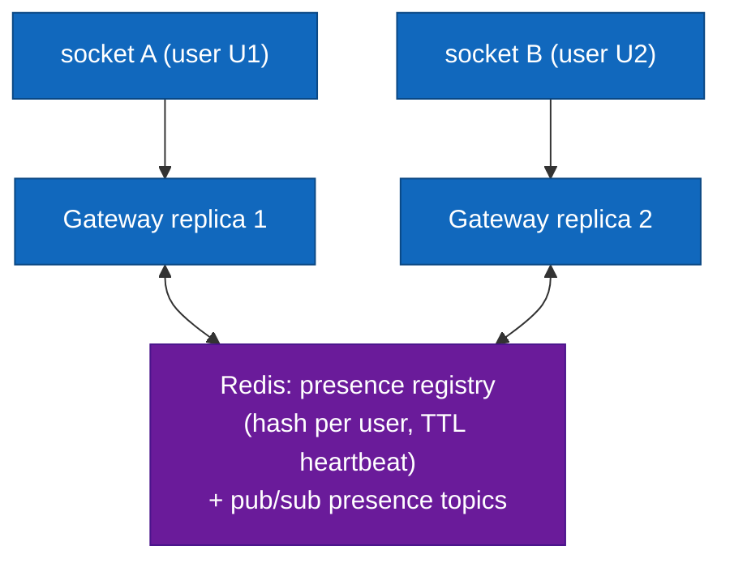
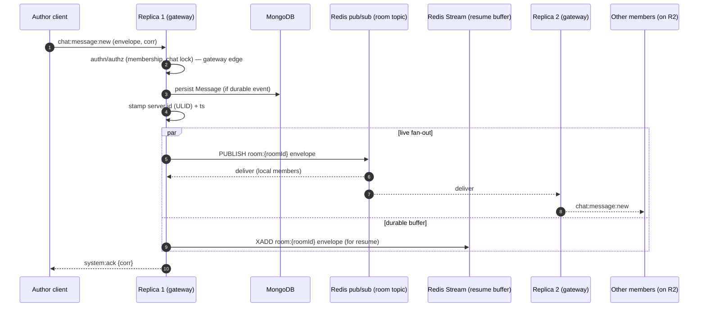
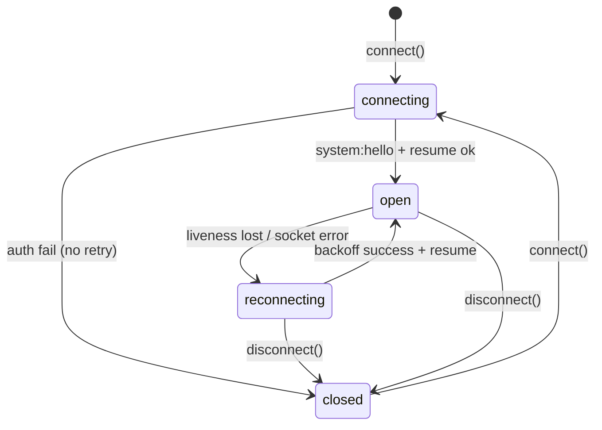
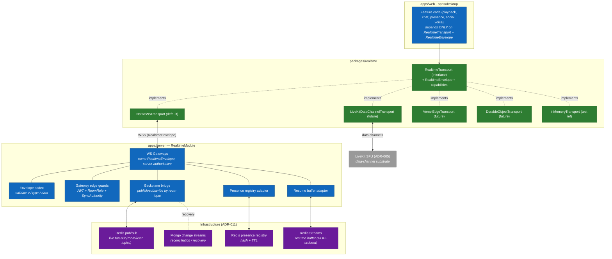

# Custom Realtime Abstraction Layer

> The transport-agnostic realtime plane for Cowatch: the `RealtimeTransport` interface and `RealtimeEnvelope`, the native-WebSocket VPS adapter, the pluggable serverless adapter contract, presence, horizontal fan-out, backpressure, heartbeat, and reconnection/resume. Engineering elaboration of canon §5.

**Status:** Draft — Planning (Phase 0 Architecture; consumed from Phase 1 onward)
**Owner agent:** Realtime Engineer
**Last updated: 2026-06-27**

> Amended 2026-06-27: Resolved Open Questions §12 per Chief Architect rulings — Redis backplane promoted to ADR-011 (D-011), resume buffer fixed at 60 s/500 envelopes, 15 s liveness cadence, Redis-lock + monotonic `seq` single-writer all confirmed; LiveKit data-channel transport and binary framing deferred.

---

## 0. Scope & Authority

This document specifies the `packages/realtime` package — the **custom realtime abstraction layer** mandated by [ADR-004](../adr/ADR-004-realtime-abstraction.md). It is the single design reference for: the wire envelope, the client `RealtimeTransport` interface, every concrete adapter, the NestJS server gateway side, presence, cross-replica fan-out, backpressure, heartbeat, and reconnection/resume.

It complies with and refers to:

- [Architecture Canon — §5 Realtime Transport Abstraction](../context/architecture.md#5-realtime-transport-abstraction-adr-004) (source of truth for the envelope + interface)
- [Architecture Canon — §10 Cross-Cutting Non-Negotiables](../context/architecture.md#10-cross-cutting-non-negotiables) (error vocabulary, correlation ids, observability)
- [Architecture Canon — §3 Naming Conventions](../context/architecture.md#3-naming-conventions) (event names `namespace:entity:action`)
- [ADR-004 — Custom Realtime abstraction layer](../adr/ADR-004-realtime-abstraction.md)
- Sibling docs: [System Architecture](./ARCHITECTURE.md) (scaling topology, §7), [Media Sync](./SYNC.md) (the `playback:*` control loop that rides this transport), [Permissions](./PERMISSIONS.md) (authority enforcement on mutating events), [Auth](./AUTH.md) (connection authentication).

> **Conflict rule.** On any discrepancy between this doc and the canon, the canon wins. The envelope shape, the `RealtimeTransport` interface, the backoff constants (base 500 ms, cap 15 s), the heartbeat cadence (2 s), and the event-name grammar are copied from canon §5/§7 verbatim and are **not** re-decided here.

> **Boundary with sibling docs.** This document owns the **transport mechanics** — how a frame gets from any client to every interested client, reliably, across replicas. It does **not** re-specify the playback control algorithm (that is [SYNC.md](./SYNC.md)) nor the permission matrix (that is [PERMISSIONS.md](./PERMISSIONS.md)); it only references where authority is enforced at the gateway edge.

Owning NestJS module: **`RealtimeModule`** (`apps/server/src/modules/realtime/`). It provides the WS gateways, the envelope codec, the backplane bridge, the resume buffer, and the presence registry to every other module.

---

## 1. Motivation — Why a Replaceable Transport

The naive choice would be to bind the whole product to Socket.IO or to raw `ws`. Canon ADR-004 deliberately rejects that. The realtime layer is the **spine** of a watch-party product — playback sync, chat, presence, voice signaling, notifications all ride it — so locking it to one transport at one deployment shape is an existential risk. The abstraction exists to satisfy four concrete forces:

| Force | Without abstraction | With `RealtimeTransport` abstraction |
|---|---|---|
| **Deployment portability** | A VPS WebSocket server cannot run on Vercel/Cloudflare edge (no long-lived sockets). Re-platforming = rewrite of every feature's realtime code. | Swap the adapter (`REALTIME_TRANSPORT` env). Feature code is untouched because it depends only on the interface. |
| **Multiple physical transports coexisting** | One transport for everything, even where a better channel exists. | `playback:sync` can ride the native WS today and migrate to **LiveKit data channels** (ADR-005) where a voice session already has a low-latency mesh — same envelope, different pipe. |
| **Testability** | Hard to unit-test features without a live socket server. | An `InMemoryTransport` adapter implements the same interface for deterministic tests; no network. |
| **Vendor / cost de-risking** | Pricing/availability changes force product changes. | Adapters for Durable Objects, Vercel Edge, NATS, etc. are isolated, swappable units behind one contract. |

**Design tenets that follow from this:**

1. **Apps depend on the interface, never a concrete transport.** `apps/web` and `apps/desktop` import `RealtimeTransport` + `RealtimeEnvelope` from `packages/realtime` and nothing else. The concrete class is chosen at composition root by config.
2. **The server speaks the identical envelope.** NestJS WS gateways encode/decode the same `RealtimeEnvelope` in both directions (canon §5). There is exactly **one** wire contract for the whole platform.
3. **The transport is dumb about domain meaning.** It routes by `type` (event name) and `room` (topic). It does not know what `playback:sync` *means*; domain semantics live in feature modules. This is what makes it swappable.
4. **Authority and persistence are server-side, above the transport.** The transport delivers frames; the gateway/service decides whether a mutating frame is allowed (canon §6/§7) and whether to persist. Swapping transports never changes authority logic.

---

## 2. The Message Envelope (`RealtimeEnvelope`)

Every frame in both directions is a `RealtimeEnvelope`. This is the canon §5 definition, reproduced verbatim as the contract this package owns; it is exported from `packages/types` and re-exported by `packages/realtime`.

```ts
// packages/types — SOURCE OF TRUTH. Re-exported by packages/realtime.
export interface RealtimeEnvelope<T = unknown> {
  v: 1;        // protocol version — bumped only on a breaking wire change
  id: string;  // message id (ULID) — unique, sortable; basis for resume + dedup
  type: string;// namespaced event, e.g. "playback:sync" (canon §3 grammar)
  room?: string;// target room/channel id (the fan-out topic); absent = user-scoped
  ts: number;  // sender epoch ms (UTC). Server re-stamps on authoritative frames.
  corr?: string;// correlation id (ULID) — pairs request↔ack↔error, threads logs
  data: T;     // typed payload from packages/types (never `any` at call sites)
}
```

### 2.1 Field semantics & invariants

| Field | Type | Rules |
|---|---|---|
| `v` | literal `1` | Protocol version. A frame with an unknown major `v` is **rejected** at the codec edge with `system:error { code: UNSUPPORTED_PROTOCOL }`; clients renegotiate on the handshake. |
| `id` | ULID string | Monotonic, time-sortable. Receivers **dedup** by `id` (idempotency) and the resume buffer is keyed by it. Generated by the sender for client→server, by the server for authoritative broadcasts. |
| `type` | string | Must match the `namespace:entity:action` grammar (canon §3). Unknown namespaces are dropped + logged. |
| `room` | string? | The fan-out topic. For room events it is the `roomId`; for DMs the `dmThreadId`; for purely user-targeted events (e.g. `notification:new`) it is omitted and routing uses the recipient's user topic (§6.2). |
| `ts` | number | UTC epoch ms (canon §10 — time). Client-stamped on intents; **server-stamped** on every authoritative broadcast (`serverEpochMs` for playback rides in `data`, but the envelope `ts` is also server time on broadcasts). |
| `corr` | string? | Present on `request()` frames and on the matching `ack`/`error`. Equals the operation's `correlationId`, so it threads through HTTP header `x-correlation-id` → service → WS → pino logs (canon §10). |
| `data` | `T` | The typed payload. Validated against the `packages/types` shape at the gateway before the service is invoked (canon — validation). |

### 2.2 Direction matrix

| Direction | `id` author | `ts` author | When `corr` set |
|---|---|---|---|
| Client → Server **intent** (fire-and-forget `send`) | client | client | optional (only if it expects a later correlated event) |
| Client → Server **request** (`request()`, ack-correlated) | client | client | **required** — server echoes it on ack/error |
| Server → Client **broadcast** (e.g. `playback:sync`, `chat:message:new`) | server | server | absent unless echoing an originating intent |
| Server → Client **ack** (`system:ack`) | server | server | **required** — equals the request's `corr` |
| Server → Client **error** (`system:error`) | server | server | echoes the originating request's `corr` (canon §10) |

### 2.3 Reserved system frames

The `system` namespace carries transport-level (not domain) frames. These are part of this package's contract:

```ts
// packages/types
export interface SystemAckPayload   { ok: true; }                    // type: "system:ack"
export interface SystemErrorPayload {                                  // type: "system:error"
  code: string;        // SCREAMING_SNAKE — shares the canon §10 vocabulary
  message: string;     // human-readable
  details?: Record<string, unknown>;
}
export interface SystemHelloPayload {                                  // type: "system:hello" (server→client, on open)
  sessionWsId: string;       // server-assigned connection id (ULID)
  serverEpochMs: number;     // for the very first clock estimate
  resumeWindowMs: number;    // how far back the resume buffer reaches (§9.3)
  heartbeatIntervalMs: number;// liveness ping cadence (§8)
}
export interface SystemResumePayload {                                 // type: "system:resume" (client→server, request)
  lastEnvelopeId: string | null; // last id the client durably applied; null = fresh
  topics: string[];              // rooms/threads to re-subscribe
}
export interface SystemResumeResultPayload {                          // type: "system:resume:result" (server→client)
  mode: 'replayed' | 'snapshot'; // replayed = gap was inside the buffer
  replayedCount?: number;        // when mode = replayed
  fromEnvelopeId?: string | null;
}
```

> The clock ping/pong frames (`system:clock:ping` / `system:clock:pong`) used for offset estimation are owned by [SYNC.md §3](./SYNC.md) but ride this transport via `request()`. They are listed here only as transport consumers, not redefined.

---

## 3. The `RealtimeTransport` Interface (full TypeScript)

This is the canon §5 interface — the **only** surface apps may import. Every adapter (§4, §5) implements it identically. Reproduced verbatim with the package's supporting types so it stands alone.

```ts
// packages/realtime/src/transport.ts  (interface re-exported from index barrel)

// ---- Wire & lifecycle types (canon §5) ----
export interface RealtimeEnvelope<T = unknown> {
  v: 1; id: string; type: string; room?: string; ts: number; corr?: string; data: T;
}

export type ConnectionState = 'connecting' | 'open' | 'reconnecting' | 'closed';

export interface PresenceState {
  userId: string;
  status: 'online' | 'idle' | 'dnd' | 'offline';
  activity?: { kind: 'room'; roomId: string } | null;
}

export interface Subscription { unsubscribe(): void; }

// ---- The contract ----
export interface RealtimeTransport {
  // Connection lifecycle
  connect(opts: { url: string; token: string }): Promise<void>;
  disconnect(): Promise<void>;

  // Messaging
  send<T>(envelope: RealtimeEnvelope<T>): void;            // fire-and-forget
  request<TReq, TRes>(                                      // ack/response-correlated
    envelope: RealtimeEnvelope<TReq>, timeoutMs?: number
  ): Promise<RealtimeEnvelope<TRes>>;
  subscribe<T>(
    type: string,
    handler: (e: RealtimeEnvelope<T>) => void,
    opts?: { room?: string }
  ): Subscription;

  // Presence
  setPresence(state: PresenceState): void;
  onPresence(handler: (states: PresenceState[]) => void): Subscription;

  // Lifecycle / reconnection
  getState(): ConnectionState;
  onStateChange(handler: (s: ConnectionState) => void): Subscription;
}
```

### 3.1 Method contracts (behavioral guarantees every adapter must honor)

| Method | Contract |
|---|---|
| `connect({ url, token })` | Establishes the connection, authenticates with the access JWT (`token`, §7), performs the `system:hello` handshake, and resolves once `getState() === 'open'`. Rejects on auth failure (`UNAUTHENTICATED`) without retrying. |
| `disconnect()` | Graceful close: flushes the send queue (best-effort), cancels timers, transitions to `closed`. Idempotent. |
| `send(envelope)` | Fire-and-forget. If not `open`, the frame is **queued** (bounded, §7.3 backpressure) and flushed on reconnect. No delivery guarantee beyond best-effort + resume; callers needing confirmation use `request()`. |
| `request(envelope, timeoutMs = 10_000)` | Sends with a fresh `corr`, returns a promise resolved by the correlated `system:ack`/response frame or the matching `system:error`, rejected on timeout (`REQUEST_TIMEOUT`). The transport maintains a pending-correlation map. |
| `subscribe(type, handler, { room })` | Registers a handler for frames whose `type` matches (and `room` matches if given). Returns a `Subscription`; `unsubscribe()` removes it. Subscriptions are **re-applied automatically on reconnect** (§9). Multiple handlers per `(type, room)` are allowed. |
| `setPresence(state)` | Declares this connection's presence; debounced and published to the server presence registry (§6). |
| `onPresence(handler)` | Receives presence snapshots/diffs for topics this connection cares about (rooms it is in, friends). |
| `getState()` / `onStateChange(h)` | Synchronous current state / change stream. The UI subscribes to drive "reconnecting…" banners. |

### 3.2 What the interface deliberately does **not** expose

- **No transport selection** — chosen at the composition root via `REALTIME_TRANSPORT`; apps never branch on it.
- **No raw socket / no `onmessage`** — all I/O is mediated by `send`/`request`/`subscribe` so every adapter can implement the same semantics (queueing, dedup, resume) uniformly.
- **No reconnection knobs** — backoff is owned by the transport (canon §5: base 500 ms, cap 15 s, jitter). Apps observe state, they do not drive reconnection.

This minimal surface is what guarantees a future adapter swap is a configuration change, not a code change.

---

## 4. Native WebSocket Adapter (`NativeWsTransport`) — VPS Default

The default transport (`REALTIME_TRANSPORT=native-ws`) for the VPS deployment. A **single** WebSocket per client, multiplexed across all rooms/channels by the envelope `room` field. One socket carries playback, chat, presence, notifications, and voice-control frames concurrently.

```ts
// packages/realtime/src/adapters/native-ws.transport.ts (shape, not implementation)
export class NativeWsTransport implements RealtimeTransport {
  // single WS; pending-correlation map; bounded outbound queue;
  // subscription registry; backoff timer; heartbeat timer; presence debouncer.
}
```

### 4.1 Multiplexing model

- **One physical WS, many logical topics.** The client opens one `WSS` connection to the gateway. Subscriptions to many rooms share it; the `room` field demultiplexes inbound frames to the right handlers. This minimizes connections (one per tab/app), simplifies auth, and matches the server's per-socket model.
- **Subscribe is logical, not a new socket.** `subscribe(type, handler, { room })` registers interest locally and, for room topics the client newly joins, sends a `room`-scoped subscribe frame so the **server** adds this socket to that room's local membership set (so the backplane fan-out reaches it). Leaving a room sends the inverse.
- **Server membership index.** The gateway keeps an in-memory `Map<roomId, Set<socket>>` for **locally connected** sockets only. Cross-replica reach is the backplane's job (§6).

### 4.2 Connection sequence



### 4.3 Authentication on the socket

- The access JWT (ADR-008) is presented on the **upgrade request** as `Authorization: Bearer <token>` (and, for browsers that cannot set WS headers, as a short-lived `?access_token=` query param minted for this purpose; never the refresh cookie).
- The gateway validates RS256, extracts `sub`/`sid`/`kind`/`roles`, and binds them to the socket. See [AUTH.md](./AUTH.md).
- **Token expiry on a live socket:** the access token is 15 min (canon §8) but the socket is long-lived. On expiry the server does **not** drop the socket; instead the client silently `request()`s a `system:reauth` with a freshly refreshed access token (obtained via the normal REST refresh flow), and the gateway re-binds claims. A socket that fails to reauth within a grace window is closed with `4401`.

### 4.4 Why native WS first

- The launch target is a **VPS** (canon ADR-010) where long-lived sockets are free and simplest.
- Raw `ws` (not Socket.IO) keeps the wire to exactly the `RealtimeEnvelope` JSON — no framing overhead, no protocol lock-in, full control over resume/backpressure semantics.
- NestJS WS gateways already speak this model (canon §5: "Server side — NestJS WS gateways speak the identical envelope").

---

## 5. Pluggable Serverless Adapter Contract

Future, config-selected adapters implement the **same** `RealtimeTransport` interface. Apps are unaware of the choice. This section is the **contract** each future adapter must satisfy so a swap stays a config change.

### 5.1 The adapter conformance contract

Every adapter MUST:

1. **Implement `RealtimeTransport` exactly** (§3) with the behavioral guarantees of §3.1 — including bounded send queueing, `request()` correlation + timeout, automatic re-subscribe on reconnect, and the `connecting→open→reconnecting→closed` state machine.
2. **Speak the `RealtimeEnvelope`** (§2) on the wire, unchanged. Adapters may compress/batch but the logical frame is identical.
3. **Own its own reconnection** with canon backoff (base 500 ms, cap 15 s, jitter) and the resume handshake (§9), degrading to a fresh snapshot when the server buffer cannot cover the gap.
4. **Preserve ordering per `room` topic** as observed by a single client (monotonic by `id`/ULID where the underlying transport allows; otherwise the client reorders by `id` within the resume window).
5. **Map its native auth to the access-JWT model** (§7) and surface `UNAUTHENTICATED` on failure.
6. **Emit identical `system:error` codes** (canon §10 vocabulary) so feature code handles errors transport-agnostically.

A shared **conformance test suite** in `packages/realtime` (an abstract spec run against each adapter, plus an `InMemoryTransport` reference) enforces this contract in CI.

### 5.2 Planned adapters

| Adapter | Underlying transport | Topic model | Fan-out / backplane | Notable constraint handled |
|---|---|---|---|---|
| `NativeWsTransport` *(default, §4)* | Raw WSS, one socket multiplexed | `room` field | Redis pub/sub (§6) | Long-lived sockets on VPS |
| `LiveKitDataChannelTransport` | LiveKit **data channels** (ADR-005) reusing an active voice session's WebRTC mesh | LiveKit room ≈ Cowatch room topic | SFU distributes; server still authoritative for `playback:*` via a server participant | Only available when a LiveKit session exists; falls back to WS otherwise. Great for ultra-low-latency `playback:sync` among voice participants. |
| `VercelEdgeTransport` | Edge runtime — **no durable sockets**; SSE/long-poll downstream + HTTP POST upstream, or Vercel's realtime primitive | Topic via subscription endpoint | External pub/sub (e.g. Upstash Redis / Ably-style) since edge functions are stateless and short-lived | No server-held socket; resume relies entirely on the buffer + snapshot, not in-memory connection state. |
| `DurableObjectTransport` | Cloudflare **Durable Objects** — one DO instance *is* the room's coordinator, holding the WS connections for that room | DO per `room` (the DO is the topic) | **No separate backplane** — the DO is the single point per room, so fan-out is in-DO; cross-room is DO-to-DO | Strong per-room serialization for free (single-threaded DO = natural single-writer for `playback:*`). |
| `InMemoryTransport` *(test only)* | In-process event bus | Map keyed by `room` | none | Deterministic unit/integration tests; the conformance reference. |

### 5.3 Transport capability descriptor

Because adapters differ in what the substrate can guarantee, each exposes a static capability descriptor so the server/feature layer can adapt (e.g. choose snapshot-only resume on edge). This is metadata, not a leak of transport identity into feature logic — features read **capabilities**, never the adapter name.

```ts
// packages/realtime/src/capabilities.ts
export interface TransportCapabilities {
  durableConnection: boolean;   // false for VercelEdge (no held socket)
  serverPush: boolean;          // true if server can push without client poll
  resumeBuffer: 'server' | 'none'; // VercelEdge → external/none → snapshot-only
  orderedPerTopic: boolean;     // false → client must reorder by ULID
  maxFrameBytes: number;        // for chunking large payloads
  binary: boolean;              // supports binary frames (e.g. LiveKit data)
}
```

### 5.4 Selection

```ts
// composition root (apps/*), config-driven — apps never import a concrete class directly
const transport: RealtimeTransport = createRealtimeTransport(env.REALTIME_TRANSPORT);
// 'native-ws' (default) | 'livekit-data' | 'vercel-edge' | 'durable-object' | 'in-memory'
```

`createRealtimeTransport` is the **only** place a concrete adapter is named. Everything downstream is interface-typed.

---

## 6. Presence Design

Presence is a realtime, eventually-consistent view of each user's `status` and current `activity` (canon §5 `PresenceState`; canon §1 Presence). It is intentionally **not** a durable record — it is reconstructed from live connections.

### 6.1 Sources of truth

- **Connection liveness is the ground truth for `online`/`offline`.** A user is `online` while ≥1 socket is alive and reachable (heartbeat passing, §8). `offline` is derived from *all* their sockets being gone (close or missed heartbeats).
- **`idle` / `dnd` are user-or-client asserted** via `setPresence()` (e.g. idle after inactivity, dnd manually). They override `online` for display but do not change liveness.
- **`activity` is set by feature context** — entering a room sets `activity = { kind: 'room', roomId }`; leaving clears it. This powers `friend.room_started` / "friends inside" in discovery (canon §1 notifications, discovery spec).

### 6.2 Topology — Redis-backed registry, two topic families



- **Registry:** Redis hash `presence:{userId}` holding `{ status, activity, lastBeat, connections }`, with a TTL refreshed on each heartbeat. If the TTL lapses (replica crash, network partition), the user decays to `offline` automatically — no orphaned "ghost online."
- **Two topic families for fan-out (canon §6.2 routing):**
  - **Room presence topic** (`presence:room:{roomId}`) — who is in a room; consumed by room member lists.
  - **Social presence topic** (`presence:user:{userId}`) — a user's friends subscribe to learn their online/idle/dnd transitions, driving `friend.online` notifications.
- `presence:update` envelopes are published to the relevant topics and fanned via the same backplane as every other event (§7). `onPresence(handler)` receives coalesced snapshots.

### 6.3 Coalescing & cost control

- Presence is **debounced** (e.g. 1–2 s) and sent as **diffs/snapshots**, never one frame per micro-change, to avoid storms when large rooms churn.
- A joining client gets one **full presence snapshot** for the topic, then diffs.
- Presence is explicitly **lossy and best-effort** — it is a soft signal; a missed presence diff self-heals on the next snapshot. It is **never** persisted to MongoDB as authoritative state (the `users` collection may cache a coarse `lastSeenAt`, but live status lives in Redis).

### 6.4 Block interaction

Presence fan-out respects `blocks` (canon §1): a blocked user does not receive the blocker's `presence:update` on the social topic, and vice-versa, enforced at the publish/subscribe filter in `SocialModule` (see [Social spec], not here).

---

## 7. Horizontal Scaling & Fan-Out

The realtime tier must let a **single room span multiple server replicas** while keeping the API tier stateless (canon: stateless NestJS server; [ARCHITECTURE.md §7](./ARCHITECTURE.md#7-horizontal-scaling-strategy)). This section details the transport-level mechanics; ARCHITECTURE.md gives the system-wide topology.

### 7.1 The core problem

A WebSocket is pinned to one replica for its life, but the members of one room connect to **different** replicas (the LB spreads them). When replica R1 accepts `chat:message:new` for room X, the members of X connected to R2 and R3 must also receive it. Two cooperating mechanisms solve this.

### 7.2 Sticky sessions vs. pub/sub — decision

| | **Sticky-only** (route all of a room to one replica) | **Pub/sub backplane** (chosen) |
|---|---|---|
| How | LB hashes `roomId` → replica; every member of a room lands on the same machine | Each replica publishes room events to a shared bus; all replicas re-emit to their local members |
| Room size cap | **One machine** — a viral room hotspots/overflows a single replica | **Whole fleet** — a room's members spread across all replicas |
| Statelessness | Breaks it — routing depends on room→replica mapping | Preserves it — any socket may land anywhere |
| Failure blast radius | Losing the room's replica drops the whole room | Losing a replica drops only its share of each room |
| **Verdict** | Rejected as the primary mechanism | **Adopted.** Sticky is used **only** to pin a socket to a replica for the *connection's* lifetime (a transport necessity), not to co-locate a room. |

**Decision (canon-aligned):** **sticky-or-pubsub.** Sticky session = connection-lifetime affinity for the WSS upgrade (so a socket doesn't migrate mid-connection). Pub/sub backplane = the authoritative fan-out path that decouples "which replica owns a socket" from "which replica owns the room."

### 7.3 Backplane: Redis pub/sub (default) vs. Mongo change streams

| Option | Latency | Fit | Verdict |
|---|---|---|---|
| **Redis pub/sub** | sub-ms, in-memory | Purpose-built ephemeral fan-out; already present for rate-limit + presence + hot `PlaybackState` cache | **DEFAULT.** Channel = `room` topic; payload = the `RealtimeEnvelope`. |
| **Redis Streams** | sub-ms + durable log | Same bus but with a replayable log — doubles as the **resume buffer** (§9.3) | **Adopted for the resume buffer** specifically (durable, bounded, ULID-ordered). Live fan-out stays on pub/sub for lowest latency. |
| **Mongo change streams** | tens–hundreds ms | Tails the oplog; fires on persisted writes only | **Rejected as the primary backplane** (too slow for 2 s playback heartbeat; only sees *persisted* events, but many realtime frames — typing, presence, heartbeats — are never persisted). **Retained** as a secondary reconciliation signal: a worker tails change streams to re-fan denormalized updates and to recover if a pub/sub publish was lost. |

> The backplane choice (Redis) is a load-bearing infrastructure dependency promoted to its own ADR per [ARCHITECTURE.md Open Question #1](./ARCHITECTURE.md#10-open-questions): see [ADR-011 — Realtime backplane](../adr/ADR-011-realtime-backplane.md). Serverless adapters (§5) substitute their native bus (Durable Objects in-instance, external pub/sub on edge) for Redis without touching feature code.

### 7.4 Fan-out path (write → every interested client)



Properties:

- **Author's replica persists once, publishes once.** Every replica (including the author's) re-emits from the backplane to its local sockets — so the author and remote members are served by the same path, no special-casing.
- **Self-publish dedup:** a replica ignores backplane messages it itself originated for sockets it already delivered to inline (tracked by envelope `id`), avoiding double-delivery.
- **Topic = `room` field.** Pure user-targeted events (`notification:new`, `social:friend:request`) publish to a `user:{userId}` topic instead; the recipient's replica subscribes to it while that user is connected.

### 7.5 Authoritative single-writer for playback

`playback:*` mutations need serialization (canon §7 / [SYNC.md §5.2](./SYNC.md)). With pub/sub, any replica can accept a mutating intent. Serialization is achieved by:

- A **per-room single-writer**: the replica accepting a playback intent takes a short **Redis lock** (`playback:lock:{roomId}`) (or, with `DurableObjectTransport`, the DO's natural single-threadedness) to read-modify-write the authoritative `PlaybackState` (hot in Redis, persisted to Mongo), re-stamp `serverEpochMs`, increment `seq`, then publish `playback:sync`. Last-writer-wins with a monotonic `seq` guarantees convergence even under contention.

---

## 8. Heartbeat & Liveness

Two distinct heartbeats exist; do not conflate them:

| Heartbeat | Layer | Cadence | Purpose | Owner |
|---|---|---|---|---|
| **Transport liveness ping/pong** | this package (transport) | `heartbeatIntervalMs` (default **15 s**), advertised in `system:hello` | Detect dead sockets, drive presence TTL, trigger reconnect | `packages/realtime` (this doc) |
| **Playback sync heartbeat** | domain (`PlaybackModule`) | **2 s** (canon §7) | Re-broadcast full `PlaybackState` for drift correction | [SYNC.md](./SYNC.md) — rides this transport, not redefined here |

### 8.1 Transport liveness mechanics

- The server sends a lightweight `system:ping` (or WS-level ping frame) every `heartbeatIntervalMs`; the client replies `system:pong`. Missing **2 consecutive** pongs marks the socket dead → server reaps it and decays presence; client transitions to `reconnecting` and starts backoff (§9).
- The liveness heartbeat **also refreshes the Redis presence TTL** (§6.2) so presence and liveness share one signal.
- On `DurableObjectTransport` / `VercelEdgeTransport`, the liveness probe maps to the substrate's keep-alive (DO alarms / SSE comment pings); the `heartbeatIntervalMs` contract is preserved via the capability descriptor (§5.3).

> The 15 s liveness cadence is independent of the 2 s playback heartbeat: a paused or chat-only room has no 2 s playback traffic but still needs liveness detection.

---

## 9. Reconnection & Resume

The transport **owns** reconnection (canon §5) — apps only observe `ConnectionState`. Goal: a transient disconnect is invisible to the user; the client returns to a correct, current state with no lost-message gap and no duplicate application.

### 9.1 Backoff (canon §5, verbatim)

- **Exponential with jitter**, base **500 ms**, cap **15 s**. Sequence (pre-jitter): 0.5s, 1s, 2s, 4s, 8s, 15s, 15s… Full jitter is applied (`delay = random(0, min(cap, base·2^n))`) to avoid thundering-herd reconnects after a server blip.
- Reconnection attempts stop only on explicit `disconnect()` or a non-retryable auth failure.

### 9.2 Connection state machine



`onStateChange` emits every transition so the UI shows a non-blocking "Reconnecting…" / "Resyncing…" banner; on return to `open` the banner clears.

### 9.3 Resume protocol

On every successful reconnect the client runs `system:resume` (§2.3) **before** resuming normal traffic:

1. **Auto re-subscribe.** The transport replays all live `subscribe()` registrations as `topics`, so the server re-adds the socket to each room's local membership and the replica (re)subscribes to the backplane topics.
2. **Gap replay by `lastEnvelopeId`.** The client sends the `id` (ULID) of the last envelope it durably applied per topic. The server checks the **per-room resume buffer** — a bounded, ULID-ordered **Redis Stream** (`room:{roomId}` stream, §7.3) holding the last `resumeWindowMs` (e.g. 60 s) / N envelopes. If the gap is inside the window, the server **replays** the missed envelopes in order (`mode: "replayed"`), and the client applies them, deduping by `id`.
3. **Snapshot fallback.** If `lastEnvelopeId` is older than the buffer (long disconnect) or the buffer is unavailable (e.g. edge adapter, `resumeBuffer: 'none'`), the server responds `mode: "snapshot"`; the client discards optimistic state and requests **fresh snapshots** per feature — at minimum an immediate `playback:sync` + room snapshot (canon §5; [SYNC.md §6](./SYNC.md) late-joiner path), plus a chat backfill via REST.

```mermaid
sequenceDiagram
  autonumber
  participant C as Client transport
  participant GW as Gateway
  participant ST as Redis Stream (resume buffer)
  C->>GW: (reconnect) system:resume { lastEnvelopeId, topics }
  GW->>ST: XRANGE room:{topic} from lastEnvelopeId
  alt gap within window
    ST-->>GW: missed envelopes (ULID-ordered)
    GW-->>C: system:resume:result { mode: "replayed", replayedCount }
    GW-->>C: <replayed envelopes...>
    Note over C: apply in order, dedup by id
  else gap too old / buffer absent
    GW-->>C: system:resume:result { mode: "snapshot" }
    Note over C: drop optimistic state; request playback:sync + room snapshot;<br/>REST backfill for chat history
  end
  Note over C,GW: normal traffic resumes; outbound queue flushed
```

### 9.4 Idempotency & ordering guarantees

- **Dedup by `id`.** Every receiver keeps a small recently-seen-`id` set (sized to the resume window). A frame whose `id` was already applied is dropped — so replay overlap or backplane self-publish never double-applies. This makes full-state events (`playback:sync`) and replays safe.
- **Order by ULID.** Within a topic, frames are applied in `id` (ULID, time-sortable) order; an out-of-order arrival is buffered briefly or, for full-state events carrying a domain `seq` (e.g. `playback:sync`), simply discarded if `seq` is stale ([SYNC.md §2.3](./SYNC.md)).
- **Outbound queue flush.** Frames queued during the outage (§7.3 below) are flushed after a successful resume, in order.

### 9.5 Backpressure (bounded queues both directions)

The transport must not become a memory leak or a DoS vector under slow consumers or slow networks.

**Client → Server (outbound), and the client's own send queue while disconnected:**
- The outbound queue is **bounded** (e.g. N frames or M bytes). On overflow, the policy is **type-aware**: drop **coalescible** ephemeral frames first (e.g. superseded `chat:typing`, stale `presence`, an older queued `playback:seek` made obsolete by a newer one — keep only the latest per `(type, room)`), and only as a last resort reject `send()` for durable intents with `BACKPRESSURE_DROP` so the caller can surface a retry.
- `request()` calls in flight during an outage reject with `REQUEST_TIMEOUT`; callers retry idempotently.

**Server → Client (inbound to each socket):**
- Each socket has a **bounded send buffer**. If a client is too slow to drain (`bufferedAmount` over WS exceeds a threshold), the server applies the same type-aware shedding: coalesce/drop ephemeral frames (presence diffs, typing, intermediate playback heartbeats — the **next** full-state `playback:sync` self-heals anyway), and never drops durable events silently (a dropped durable event forces a resume/snapshot for that socket).
- A persistently slow socket is **disconnected** (it will resume + snapshot on reconnect) rather than allowed to balloon server memory.

**Why full-state events make backpressure cheap:** because `playback:sync` is full-state and idempotent (§9.4, [SYNC.md §2.3](./SYNC.md)), shedding intermediate heartbeats is harmless — the next one fully corrects the client. Backpressure policy exploits this: ephemeral/self-healing frames are the first to go; durable, non-reconstructable frames (a chat message, a friend request) are never dropped — they trigger snapshot recovery instead.

---

## 10. Layering Diagram

The full realtime stack, client through backplane, showing where the interface boundary sits.



**Reading the diagram:** the **interface boundary** (`packages/realtime` → `RealtimeTransport`) is the swap point. Above it, feature code is identical across all deployments. Below it, an adapter binds to whatever substrate the deployment offers; the server gateway and the backplane (Redis today) provide authority, persistence, fan-out, presence, and resume. Replacing Redis with a serverless bus (DO/edge) is contained entirely within the bridge/resume/presence adapters.

---

## 11. Observability & Errors (binding to canon §10)

- **Correlation:** every `request()` carries `corr` = the operation's `correlationId` (ULID), identical to the REST `x-correlation-id`, so one operation is traceable HTTP → service → WS → pino logs. Broadcasts echo the originating `corr` where one exists.
- **Realtime errors** use the `system:error` envelope with the shared SCREAMING_SNAKE code vocabulary (canon §10). Transport-level codes owned here: `UNAUTHENTICATED`, `UNSUPPORTED_PROTOCOL`, `REQUEST_TIMEOUT`, `BACKPRESSURE_DROP`, `RESUME_WINDOW_EXCEEDED`. Domain codes (e.g. `FORBIDDEN_SYNC`) are emitted by feature gateways over this same channel.
- **Metrics** (Prometheus, canon §10): active WS connections per replica, backplane publish/deliver rate, resume `replayed` vs `snapshot` ratio, dropped-frame counters by type, heartbeat-miss rate, presence registry size.
- **Health:** `RealtimeModule` contributes to `/health/ready` by checking backplane (Redis) reachability; an unreachable backplane fails readiness (the replica can serve no cross-replica fan-out).

---

## 12. Open Questions

| # | Question | Recommendation |
|---|---|---|
| 1 | Resume buffer window size (`resumeWindowMs`, default 60 s) and Redis Stream max-len per room. | Start at **60 s / 500 envelopes per room**, tuned by reconnect-gap telemetry in Phase 11. Expose both as `RealtimeModule` config constants, not hard-coded. Most reconnects (Wi-Fi blips, tab wake) are well under 60 s. <br>**Resolution (2026-06-27):** Fix the bounded per-room resume buffer at **60 s / 500 envelopes**, exposed as `RealtimeModule` config constants; overflow forces a fresh `playback:sync` + snapshot; tuned in Phase 11. (RT resume buffer / PHASES-5.) — **Status: Resolved.** |
| 2 | Liveness heartbeat cadence (15 s) vs. mobile battery / background throttling. | Keep 15 s default; allow the client to negotiate a longer interval via `system:hello` echo when backgrounded, and lean on `visibilitychange` to force an immediate resume on foreground (mirrors [SYNC.md §3](./SYNC.md) clock re-handshake). <br>**Resolution (2026-06-27):** Liveness cadence stays **15 s default**, negotiable to a longer interval when backgrounded. (RT liveness cadence.) — **Status: Resolved.** |
| 3 | Promote the Redis backplane to its own ADR? | **Yes** — author [ADR-011](../adr/ADR-011-realtime-backplane.md) (already flagged in [ARCHITECTURE.md OQ#1](./ARCHITECTURE.md#10-open-questions)) documenting Redis pub/sub + Streams as the default and DO/edge buses as serverless-era alternatives. This doc assumes ADR-011 exists. <br>**Resolution (2026-06-27):** Promote to **ADR-011 = Redis pub/sub + Streams** (Mongo change streams as secondary reconciliation), below ADR-004's transport abstraction; ledger row **D-011** added. (RT OQ-1 → B2.) — **Status: Resolved.** |
| 4 | Should `LiveKitDataChannelTransport` carry `playback:*` automatically when a voice session is active, or stay opt-in? | **Opt-in behind a capability + room flag** for MVP. Auto-migration of the playback channel into the WebRTC mesh is a latency optimization to validate in the Voice phase (8/9), not a launch requirement; the WS path is always the dependable fallback. <br>**Resolution (2026-06-27):** LiveKit stays media-only; realtime uses native WS. The data-channel adapter is opt-in behind a capability + room flag and deferred. (RT OQ-2.) — **Status: Deferred to Phase 8+.** |
| 5 | Binary framing (MessagePack/CBOR) vs. JSON for the envelope. | **JSON for launch** (debuggability, canon shows JSON). Revisit binary only if frame-size/throughput telemetry warrants; the `binary` capability flag (§5.3) and `maxFrameBytes` already reserve the path without committing now. <br>**Resolution (2026-06-27):** **JSON for launch**; binary framing is gated behind a capability flag + a `v` bump. (RT binary framing.) — **Status: Deferred to Post-MVP.** |
| 6 | Cross-replica `playback:*` single-writer: Redis lock vs. routing all playback intents for a room to one "leader" replica. | **Redis lock + monotonic `seq`** (§7.5) for `native-ws`; the `DurableObjectTransport` gets single-writer for free. Avoids reintroducing room→replica stickiness. Re-evaluate if lock contention shows up under load test. <br>**Resolution (2026-06-27):** Single-writer = Redis lock `playback:lock:{roomId}` + monotonic `seq` (DO gets it for free), under ADR-011. (RT playback single-writer.) — **Status: Resolved.** |

---

## 13. Cross-References

- [Architecture Canon](../context/architecture.md) — §5 Realtime Transport, §6 Permission Model, §7 Sync Algorithm, §10 Non-Negotiables
- [ADR-004 — Custom Realtime abstraction layer](../adr/ADR-004-realtime-abstraction.md)
- [ADR-005 — LiveKit voice/video](../adr/ADR-005-livekit.md) (data-channel transport substrate)
- [ADR-007 — Server-authoritative playback sync](../adr/ADR-007-server-authoritative-playback-sync.md)
- [ADR-011 — Realtime backplane](../adr/ADR-011-realtime-backplane.md) (Redis pub/sub + Streams; to be authored)
- [System Architecture](./ARCHITECTURE.md) — §5 realtime layering, §7 horizontal scaling (system-wide topology)
- [Media Sync](./SYNC.md) — the `playback:*` control loop, clock handshake, and late-joiner snapshot that ride this transport
- [Permissions](./PERMISSIONS.md) — role matrix + `SyncAuthority` enforced at the gateway edge
- [Auth](./AUTH.md) — access-JWT authentication of the socket + live-socket reauth
