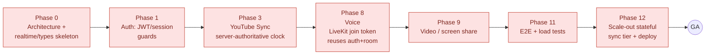
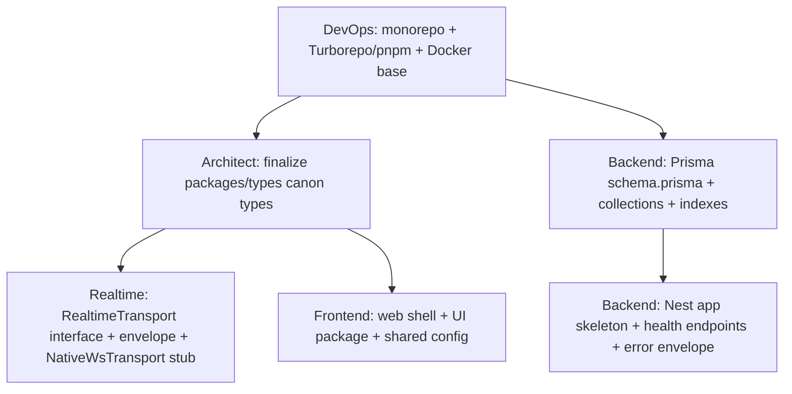
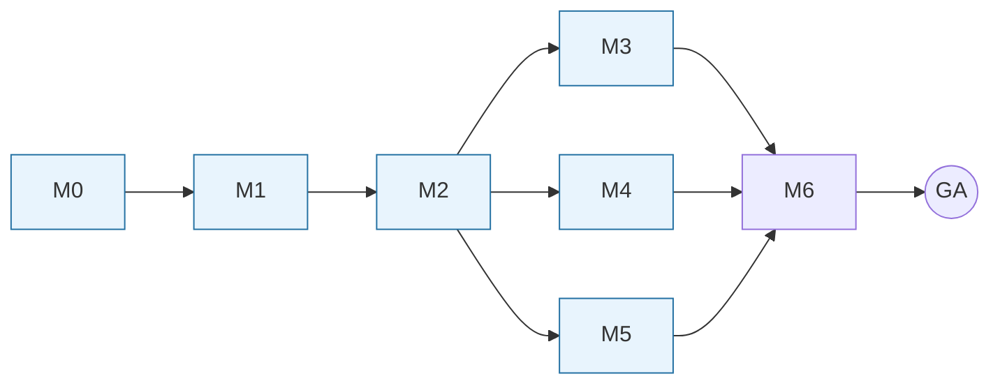

# Cowatch — Implementation Roadmap

> Sequences the 13 development phases into 6 delivery milestones (M1–M6), with a Gantt timeline, the critical path, milestone exit criteria, parallelizable workstreams across the agent system, and per-milestone risk registers.

**Status:** Planning (Phase 0 — Architecture)
**Owner agent:** Chief Architect / PM
**Last updated: 2026-06-27**

Canonical source of truth: [Architecture Canon](../context/architecture.md). On any conflict, the canon wins. This roadmap operationalizes the phase list and per-feature workflow defined in [PHASES.md](./PHASES.md) and inherits all decisions from [ADR-001](../adr/ADR-001-monorepo.md) … [ADR-007](../adr/ADR-007-sync.md) plus the canon-defined ADR-008 (auth), ADR-009 (MinIO), ADR-010 (Docker-first).

> **Cross-links:** [PHASES.md](./PHASES.md) · [ARCHITECTURE.md](./ARCHITECTURE.md) · [PRD.md](./PRD.md) · [AUTH.md](./AUTH.md) · [SYNC.md](./SYNC.md) · [REALTIME.md](./REALTIME.md) · [SOCIAL.md](./SOCIAL.md) · [LIVEKIT.md](./LIVEKIT.md) · [DEPLOYMENT.md](./DEPLOYMENT.md) · [TESTING.md](./TESTING.md) · [SECURITY.md](./SECURITY.md)

---

## 1. Purpose & Scope

This roadmap is the **delivery plan**: it answers *in what order, by whom, and against which exit gates* the Cowatch platform is built. It does **not** redefine product scope (see [PRD.md](./PRD.md)) or architecture (see [ARCHITECTURE.md](./ARCHITECTURE.md)). It maps the **13 canonical phases** (Phase 0–12) from [PHASES.md](./PHASES.md) onto **6 shippable milestones**, declares the **critical path**, and assigns **parallel workstreams** across the agent system so the team maximizes throughput without violating dependency order.

Binding constraints inherited from the canon:

| # | Constraint | Source |
|---|---|---|
| RM1 | **Plan before code (R1).** Every milestone's features carry spec → tasks → tests → docs → ADR(if needed) **before** implementation. This roadmap assumes Phase 0 planning artifacts exist or are in flight. | SPEC R1, R5 |
| RM2 | **Full recoverability (R2).** Each milestone updates `project-state/` and `history/` so the project resumes after context loss. Milestone boundaries are recovery checkpoints. | SPEC R2 |
| RM3 | **Architecture changes are gated (R3/R4).** Any new ADR within a milestone triggers history + context + repomix updates before the dependent code merges. | SPEC R3/R4 |
| RM4 | **90% coverage** is a milestone exit gate, not a final-phase afterthought. Tests ship with each feature. | Canon §10, SPEC |
| RM5 | **Server-authoritative, stateful sync tier** cannot be naively scaled; horizontal-scale work is explicitly milestoned (M6), not assumed. | ADR-007 |

---

## 2. Milestone Map (Phases → Milestones)

| Milestone | Theme | Phases folded in | Headline outcome |
|---|---|---|---|
| **M0** | Foundations | Phase 0 (Architecture) | Monorepo, CI, Docker baseline, Prisma schema, `packages/types` + `realtime` skeletons, the spine every later milestone builds on. |
| **M1** | Identity & Spaces | Phase 1 (Auth), Phase 2 (Rooms) | A user can register/login (incl. OAuth, 2FA, guest), create/join public/private/password rooms with roles & permissions. **No media yet.** |
| **M2** | The Watch-Party MVP | Phase 3 (YouTube Sync), Phase 4 (Chat) | **First demoable product.** Two clients watch a synchronized YouTube playlist (drift < 500 ms) and chat in real time. |
| **M3** | Social Layer | Phase 5 (Friends), Phase 6 (Notifications), Phase 7 (Discovery) | Friends/presence/DMs, the notification feed, and room discovery/search. Cowatch becomes a *network*, not a single room. |
| **M4** | Live Communication | Phase 8 (Voice), Phase 9 (Video/Screen-share) | LiveKit voice channels, then video + screen share inside rooms. |
| **M5** | Desktop | Phase 10 (Electron) | Packaged desktop app: PiP, native push, HW accel, auto-update, IPC bridge. |
| **M6** | Hardening & Launch | Phase 11 (Testing), Phase 12 (Deployment) | Full E2E/load coverage, horizontal-scale of the stateful sync tier, production Docker rollout, observability, DR. |

> **Why this folding?** M1 pairs Auth+Rooms because Rooms membership/permissions are meaningless without identity, and both are pure REST+DB work that share the same backend ramp. M2 pairs Sync+Chat because both ride the **same realtime transport** ([ADR-004](../adr/ADR-004-realtime.md)) and a chat-only or sync-only watch room is not a coherent demo; together they form the smallest *lovable* product. Social/Notifications/Discovery cluster in M3 because they share the social graph, presence, and the notification fan-out. Voice and Video are one provider (LiveKit, [ADR-005](../adr/ADR-005-livekit.md)) and cluster in M4. Electron (M5) deliberately follows a stable web app so it wraps a moving-but-not-thrashing target. Testing+Deployment harden last (M6), though tests are written continuously per RM4.

---

## 3. Timeline (Gantt)

Durations are **planning estimates in calendar weeks** for the founding agent team running parallel workstreams; they are indicative, not commitments. Week 0 = start of Phase 0.

```mermaid
gantt
    title Cowatch Delivery Timeline (indicative, weeks)
    dateFormat  X
    axisFormat  W%s

    section M0 Foundations
    Phase 0 Architecture & scaffolding      :m0, 0, 3

    section M1 Identity & Spaces
    Phase 1 Authentication                  :m1a, after m0, 4
    Phase 2 Rooms & permissions             :m1b, after m0, 4

    section M2 Watch-Party MVP
    Phase 3 YouTube Sync                     :crit, m2a, after m1a, 4
    Phase 4 Chat                             :m2b, after m1b, 3

    section M3 Social Layer
    Phase 5 Friends & presence               :m3a, after m2b, 3
    Phase 6 Notifications                    :m3b, after m3a, 2
    Phase 7 Discovery & search               :m3c, after m3a, 3

    section M4 Live Communication
    Phase 8 Voice channels                   :m4a, after m2a, 4
    Phase 9 Video & screen share             :m4b, after m4a, 3

    section M5 Desktop
    Phase 10 Electron app                    :m5, after m2a, 5

    section M6 Hardening & Launch
    Phase 11 Testing & coverage              :m6a, after m4b, 3
    Phase 12 Deployment & scale-out          :crit, m6b, after m6a, 3
```

> The Gantt shows **logical dependency ordering**, not a single-threaded schedule. Bars that start `after` the same predecessor and live in different sections run **in parallel** across agents (see [§5](#5-parallelizable-workstreams)). The `crit`-tagged bars trace the critical path.

---

## 4. Critical Path

The longest dependency chain that gates **General Availability** runs through the realtime/sync spine and the deployment hardening that makes it production-safe:

**Critical path =** `Phase 0 → Phase 1 (auth) → Phase 3 (sync) → Phase 8 (voice) → Phase 9 (video) → Phase 11 (testing) → Phase 12 (deploy/scale)`.

**Why these and not others:**
- **Phase 0 → 1 → 3** is irreducible: the realtime transport ([ADR-004](../adr/ADR-004-realtime.md)) and the server-authoritative clock ([ADR-007](../adr/ADR-007-sync.md)) both require authenticated WS connections (`sid` claim, session guards) which Phase 1 produces. Sync is the single hardest, highest-risk engineering problem and the product's reason to exist, so it sits on the spine.
- **Voice/Video (8→9)** depend on the same room/membership/permission context and on the realtime channel for signaling/presence; they share [ADR-005](../adr/ADR-005-livekit.md) and cannot start until rooms (M1) and a stable realtime layer (M2) exist.
- **Testing → Deployment (11→12)** is on the path because the **stateful sync tier scale-out** ([ADR-007](../adr/ADR-007-sync.md) drift target + multi-node coordination via Redis) is a non-trivial deployment problem that must be load-validated before GA. See [DEPLOYMENT.md §scaling](./DEPLOYMENT.md).

**Off the critical path (slack available):** Chat (Phase 4), Friends/Notifications/Discovery (Phases 5–7), and Electron (Phase 10) can all slip without moving the GA date *provided* they finish before M6 hardening absorbs them. They are nonetheless **required for launch scope** — "off critical path" means schedule-flexible, not optional.

**Critical-path protection rules:**
1. Staff the **Realtime + Media + Backend** agents on Phase 3 before pulling them onto parallel social work.
2. Stand up the **LiveKit dev cluster** ([ADR-005](../adr/ADR-005-livekit.md)) during M2 so M4 is not blocked on infra procurement.
3. Begin **load-test harness** design during M2 (against the sync tier), not M6, so Phase 11 validates rather than discovers.

---

## 5. Parallelizable Workstreams

Workstreams map to the agent roles defined in the SPEC AI Agent System. Within a milestone, lanes that share no write-path can proceed concurrently; cross-lane dependencies are called out as **gates**.

### Agent → primary surface

| Agent | Owns | Packages / apps |
|---|---|---|
| **Chief Architect** | Canon, ADRs, cross-cutting contracts, milestone gates | `context/`, `adr/`, `packages/types` review |
| **Backend Engineer** | NestJS modules, REST, Prisma data access | `apps/server`, `packages/database`, `packages/sdk` |
| **Realtime Engineer** | Transport, envelope, gateways, reconnection, scale-out | `packages/realtime`, server WS gateways |
| **Media Engineer** | YouTube provider, playback clock, queue/voting | `apps/server` (Playback/Playlist), `apps/web` player |
| **Voice Engineer** | LiveKit integration, voice/video/screen UI | `apps/server` (Voice), `apps/web` voice UI |
| **Social Engineer** | Friends, presence, DMs, notifications, discovery | `packages/social`, `apps/server` (Social/Notif/Discovery) |
| **Frontend Engineer** | Web app shell, routing, Zustand stores, TanStack Query | `apps/web`, `packages/ui` |
| **Electron Engineer** | Desktop shell, IPC, PiP, push, auto-update | `apps/desktop` |
| **DevOps Engineer** | Docker, CI, environments, MinIO, Redis, observability | `docker/`, CI, [DEPLOYMENT.md](./DEPLOYMENT.md) |
| **QA Engineer** | Test strategy, E2E, load, coverage gate | [TESTING.md](./TESTING.md), `*.spec.ts`, e2e suites |
| **Documentation Engineer** | Specs, docs, API reference upkeep | `specs/`, `docs/` |
| **Historian Engineer** | `history/`, `project-state/`, repomix snapshots (R2/R3) | `history/`, `project-state/`, `repomix/` |

### Per-milestone parallel lanes

**M0 — Foundations** (mostly serial; this is the bottleneck everyone waits on)

Gate: `packages/types` and the Prisma schema must freeze (v1) before M1 backend work begins, to avoid type churn downstream.

**M1 — Identity & Spaces** (two clean lanes after the auth core lands)
- **Lane A (Backend + Architect):** AuthModule → JWT RS256, rotating refresh, sessions, OAuth, TOTP, guest. *Gate for everything WS-authenticated.*
- **Lane B (Backend):** RoomsModule + MembershipsModule + permission matrix ([PERMISSIONS.md](./PERMISSIONS.md)), invite links, ownership-transfer algorithm. Depends on Auth user identity but can stub it early.
- **Lane C (Frontend):** auth screens, session manager UI, room create/join/list-shell, permission-aware components. Consumes `packages/sdk` contracts (can mock before backend lands).
- **Lane D (QA/Docs):** auth + rooms specs, acceptance tests, security review of token model ([SECURITY.md](./SECURITY.md)).

**M2 — Watch-Party MVP** (the highest-parallelism, highest-risk milestone)
- **Lane A (Realtime):** harden `NativeWsTransport`, reconnection/resume, room topic multiplexing, gateway auth handshake.
- **Lane B (Media):** PlaybackModule (server clock, `playback:sync` 2 s heartbeat, drift correction), PlaylistModule (queue, drag-reorder, voting, skip-vote), YouTube provider + web player. **Depends on Lane A's transport.**
- **Lane C (Social/Backend):** ChatModule — channel-scoped messages, reactions, typing, mentions. **Depends on Lane A**, independent of Lane B.
- **Lane D (DevOps):** stand up LiveKit dev cluster (pre-stage for M4) + Redis (pre-stage for M6 scale-out) + load-test harness skeleton.

**M3 — Social Layer** (three near-independent lanes on the social graph)
- **Lane A (Social):** SocialModule — friendships, friend requests, blocks, presence. Source of presence the realtime layer fans out.
- **Lane B (Social):** NotificationsModule — feed + the 7 canonical notification types; depends on A's events + Chat (mentions/DM) from M2.
- **Lane C (Social/Backend):** DiscoveryModule — room listing, search across users/rooms/messages/videos/tags; depends on denormalized discovery fields (`Room.currentVideoTitle`, `viewerCount`).
- **Lane D (Frontend):** friends panel, DM threads, notification center, discovery/search UI.

**M4 — Live Communication** (serialized within, parallel to M3/M5 across the org)
- **Lane A (Voice):** VoiceModule — LiveKit room mapping, join-token issuance (reuses auth+room permission), public/password channels, voice UI. → then video → then screen share.
- **Lane B (DevOps):** LiveKit prod topology, TURN, bandwidth/observability.
- M4 can run **concurrently with M3** (different agents, different modules) and overlap M5.

**M5 — Desktop** (single dedicated lane, late-binding to a stable web app)
- **Lane A (Electron):** shell, IPC bridge, PiP, native push, HW accel, electron-builder auto-update. Wraps `apps/web`; begins once M2 web app is stable, finalizes after M3 UI lands.

**M6 — Hardening & Launch** (QA + DevOps led, all agents support)
- **Lane A (QA):** raise coverage to **90%**, full E2E across watch-party + social + voice, load tests against the sync tier.
- **Lane B (Realtime + DevOps):** **stateful sync-tier scale-out** (Redis-backed coordination, sticky/aware routing), the on-critical-path scaling work.
- **Lane C (DevOps):** production Docker rollout across targets ([DEPLOYMENT.md](./DEPLOYMENT.md)), observability dashboards, DR runbook, secrets.
- **Lane D (Historian/Docs):** final history/context/project-state/repomix reconciliation for GA.

---

## 6. Milestone Exit Criteria

Each milestone exits only when **all** gates below are green. Gates marked **(R)** are recoverability/process gates from the SPEC and are non-waivable.

### M0 — Foundations
- [ ] Turborepo + pnpm workspace builds all `apps/*` + `packages/*` with cached task pipeline ([ADR-001](../adr/ADR-001-monorepo.md)).
- [ ] `packages/types` exports v1 canonical domain + DTO + event types; no duplication elsewhere.
- [ ] Prisma `schema.prisma` models every canon collection with mandatory indexes; generates client ([ADR-003](../adr/ADR-003-prisma.md)).
- [ ] `RealtimeTransport` interface + `RealtimeEnvelope` + `NativeWsTransport` stub compile against `packages/types` ([ADR-004](../adr/ADR-004-realtime.md)).
- [ ] Nest server boots with `/health/live`, `/health/ready`, standard REST error envelope, pino + ULID correlation.
- [ ] **(R)** Docker Compose runs server + MongoDB + MinIO locally with parity ([ADR-010](../adr/ADR-010-docker-first.md)); CI green; `project-state/` + `history/` initialized.

### M1 — Identity & Spaces
- [ ] Email/password, Google OAuth, guest, email verification, password reset, TOTP enroll/verify/disable all pass acceptance tests ([AUTH.md](./AUTH.md), [ADR-008]).
- [ ] Rotating refresh with **reuse detection revokes the session family**; device-session list + per/all revocation work.
- [ ] Rooms: create public/private/password, join (+ join-approval), invite links (expiring/single-use), permanent vs temporary.
- [ ] Permission matrix enforced server-side for all roles ([PERMISSIONS.md](./PERMISSIONS.md)); ownership-transfer algorithm passes its 4-branch test matrix.
- [ ] Security review of the token model signed off ([SECURITY.md](./SECURITY.md)).
- [ ] **(R)** ≥90% coverage on Auth + Rooms modules; specs/tasks/docs/history/context/repomix updated.

### M2 — Watch-Party MVP  *(primary demo gate)*
- [ ] Two+ clients in one room observe **steady-state drift < 500 ms** across play/pause/seek/rate/autoplay-advance ([SYNC.md](./SYNC.md), [ADR-007](../adr/ADR-007-sync.md)).
- [ ] Sync-authority modes (`owner_only`/`owner_moderators`/`everyone`) enforced; unauthorized mutation returns `system:error FORBIDDEN_SYNC`.
- [ ] Playlist: add single video, add YouTube playlist, manual queue, drag-reorder, voting, skip-vote outcome syncs.
- [ ] Chat: real-time messages, reactions, typing indicators, mentions; channel-scoped; reconnection replays/resyncs correctly.
- [ ] Realtime reconnection: backoff+jitter, auto re-subscribe, resume-by-`lastEnvelopeId` or fresh snapshot fallback ([REALTIME.md](./REALTIME.md)).
- [ ] **(R)** ≥90% coverage on Playback/Playlist/Chat/Realtime; **a non-technical user can run the demo end-to-end.**

### M3 — Social Layer
- [ ] Friend request → accept → friendship; blocks suppress across surfaces; presence (`online/idle/dnd/offline` + in-room activity) propagates < 2 s.
- [ ] DMs (threads) deliver in real time; the 7 canonical notification types fire and surface in the feed ([SOCIAL.md](./SOCIAL.md)).
- [ ] Discovery lists rooms (name, current video, viewer count, tags, NSFW, friends inside); search spans users/rooms/messages/videos/tags.
- [ ] Denormalized discovery fields stay eventually consistent via realtime + reconciliation (no stale viewer counts beyond reconcile window).
- [ ] **(R)** ≥90% coverage on Social/Notifications/Discovery; docs + history + context + repomix updated.

### M4 — Live Communication
- [ ] Multiple voice channels per room (public + password); join-token issuance honors room permissions ([LIVEKIT.md](./LIVEKIT.md), [ADR-005](../adr/ADR-005-livekit.md)).
- [ ] Video channels + screen sharing function; presence/speaking state reflected in realtime.
- [ ] Voice channel join/leave emits `voice:channel:join`/`leave`; failures map to standard error vocabulary.
- [ ] **(R)** ≥90% coverage on Voice module (incl. token/permission tests); load behavior characterized on the LiveKit dev cluster.

### M5 — Desktop
- [ ] electron-builder produces signed installers for the target OSes with working **auto-update**.
- [ ] PiP, hardware acceleration, native push notifications, and the IPC bridge verified ([ADR-006](../adr/ADR-006-electron.md)).
- [ ] Desktop reuses the web app with no auth/session divergence; refresh-cookie/token model works in the Electron context.
- [ ] **(R)** ≥90% coverage on desktop-specific (IPC/updater) logic; docs + history updated.

### M6 — Hardening & Launch
- [ ] Repo-wide coverage **≥ 90%**; full E2E suite green across watch-party + social + voice ([TESTING.md](./TESTING.md)).
- [ ] **Stateful sync tier scales horizontally** (Redis-coordinated) and holds < 500 ms drift under target load; load tests pass.
- [ ] Production Docker rollout across `local/vps/vercel/production` targets; TLS, strict CORS, Helmet, rate limits, MinIO least-privilege all verified ([DEPLOYMENT.md](./DEPLOYMENT.md), [SECURITY.md](./SECURITY.md)).
- [ ] Observability: dashboards, alerts, `/health/*`, ULID correlation traced HTTP→service→WS; DR runbook validated.
- [ ] **(R)** `project-state/` reflects GA; `history/`, `context/`, `repomix/` reconciled; all ADRs current.

---

## 7. Risks per Milestone

Severity = Likelihood × Impact on the **critical path / GA date**. Mitigations are preventive; triggers tell us when to escalate.

### M0 — Foundations
| Risk | Sev | Mitigation | Trigger |
|---|---|---|---|
| Prisma-over-MongoDB friction (document modeling, lack of true relations, migration story) | High | Spike `schema.prisma` against real queries early; codify embed-vs-reference rules from canon §4; keep ids as strings everywhere. | Any query needing a join Prisma can't express. |
| `packages/types` churn cascades to every app | High | Freeze v1 types as an M0 exit gate; Architect owns change control. | >1 breaking type change/week after freeze. |
| Monorepo/CI cache misconfig slows every later milestone | Med | Validate Turborepo remote cache + task graph in M0; document in [DEPLOYMENT.md](./DEPLOYMENT.md). | CI times grow superlinearly with packages. |

### M1 — Identity & Spaces
| Risk | Sev | Mitigation | Trigger |
|---|---|---|---|
| Refresh-token rotation + reuse-detection edge cases (races, multi-tab, cookie scope) | High | Model the token family state machine in [AUTH.md](./AUTH.md); exhaustive tests on reuse/theft; httpOnly+SameSite=Strict scoped to `/api/v1/auth`. | Family revoked on legitimate concurrent refresh. |
| Permission matrix drift between server enforcement and UI gating | Med | Single source: derive both from canon §6 table; server is authoritative, UI advisory. | Client allows an action server rejects. |
| Ownership-transfer algorithm correctness under concurrent owner-leave | High | Make transfer atomic server-side; test all 4 branches incl. empty-room temporary teardown. | Two members both believe they are owner. |

### M2 — Watch-Party MVP
| Risk | Sev | Mitigation | Trigger |
|---|---|---|---|
| **Drift target < 500 ms not met** (clock offset, RTT variance, YouTube IFrame API latency) | **Critical** | Ping/pong offset correction on connect + periodic; rate-glide for 0.5–2 s drift, hard-seek ≥ 2 s; 2 s heartbeat ([SYNC.md](./SYNC.md)). Build a multi-client drift harness in M2, not M6. | Drift > 500 ms sustained on 3+ clients. |
| Realtime reconnection/resume loses or duplicates events | High | ULID-ordered envelopes; resume-by-`lastEnvelopeId` with snapshot fallback; idempotent handlers ([REALTIME.md](./REALTIME.md)). | Duplicate chat/playback after reconnect. |
| YouTube IFrame API constraints (autoplay policies, hidden-tab throttling, rate limits) | Med | Encapsulate provider behind a media-provider interface; document quirks; degrade gracefully. | Autoplay blocked / throttled in background tabs. |
| Scope creep blurs the "smallest lovable demo" line | Med | M2 exit = *non-technical user runs the demo*; defer non-demo polish to M3+. | Backlog items added without demo justification. |

### M3 — Social Layer
| Risk | Sev | Mitigation | Trigger |
|---|---|---|---|
| Notification/presence fan-out storms (large friend graphs, room joins) | High | Batch + debounce presence; cap fan-out; background reconciliation for denorm fields (canon §4). | Event volume spikes on popular-room join. |
| Denormalized discovery fields go stale (viewer count, current video) | Med | Eventual-consistency contract + reconcile job; owning aggregate is source of truth. | Discovery shows wrong viewer counts. |
| Search across heterogeneous entities outgrows Mongo text indexes | Med | Launch on Mongo text/search indexes; flag a dedicated search engine as a future ADR (per [ARCHITECTURE.md](./ARCHITECTURE.md) open question). | Relevance/ranking complaints at scale. |

### M4 — Live Communication
| Risk | Sev | Mitigation | Trigger |
|---|---|---|---|
| LiveKit infra cost/ops (SFU, TURN, bandwidth) underestimated | High | Stand up dev cluster in M2; characterize cost/bandwidth before prod; DevOps owns topology ([LIVEKIT.md](./LIVEKIT.md)). | Bandwidth/cost projections exceed budget. |
| Voice permission desync with room roles (token grants ≠ room state) | Med | Issue LiveKit join tokens from the same permission source as rooms; re-issue on role change. | Muted/kicked user still in voice. |
| WebRTC NAT/firewall traversal failures for some users | Med | TURN fallback; connection diagnostics; document supported networks. | Connect-failure rate above threshold. |

### M5 — Desktop
| Risk | Sev | Mitigation | Trigger |
|---|---|---|---|
| Auto-update / code-signing pipeline complexity per OS | High | Spike electron-builder signing + update channel early in M5; CI-produce installers ([ADR-006](../adr/ADR-006-electron.md)). | Unsigned/failed update on any target OS. |
| Refresh-cookie/auth model breaks in Electron (cookie partitioning, custom protocol) | Med | Validate the [AUTH.md](./AUTH.md) cookie flow in Electron during M5 spike; adapt token storage if needed. | Session not persisted across app restart. |
| Web app still thrashing when Electron wraps it | Med | Bind M5 finalize **after** M3 UI lands; track web-app API stability. | Frequent breaking web changes during M5. |

### M6 — Hardening & Launch
| Risk | Sev | Mitigation | Trigger |
|---|---|---|---|
| **Stateful sync tier won't scale horizontally** (sticky routing, Redis coordination, shared clock) | **Critical** | Design Redis-backed coordination in M2/M6; load-test multi-node drift before GA; this is on the critical path (ADR-007 / [DEPLOYMENT.md](./DEPLOYMENT.md)). | Drift degrades when sync tier scales past 1 node. |
| 90% coverage gate missed because tests deferred (RM4 violated) | High | Enforce per-feature tests each milestone; coverage is a per-milestone gate, not an M6 sprint. | Coverage trending below 90% at M5 exit. |
| Deployment parity gaps across local/vps/vercel/production | Med | Docker-first parity from M0; serverless transport adapters validated late but interface-locked early ([ADR-004](../adr/ADR-004-realtime.md)). | A target-specific bug not reproducible locally. |
| MongoDB scaling (replica set → sharding) deferred too long | Med | Replica set for launch; revisit `roomId`-based sharding per [ARCHITECTURE.md](./ARCHITECTURE.md) open question; own ADR if adopted. | Hot room-scoped collections degrade. |

---

## 8. Sequencing Rules & Dependencies (summary)

Hard ordering constraints:
1. **M0 before all** — nothing compiles without the type/schema/transport/Docker spine.
2. **M1 before M2** — sync and chat require authenticated WS connections + room/membership context.
3. **M2 before M3/M4/M5** — social, voice, and desktop all assume a working watch room + realtime layer; M3, M4, M5 may then run **in parallel** across different agents.
4. **M3 + M4 + M5 before M6** — hardening and production scale-out absorb everything; the sync-tier scale-out specifically gates GA.

Soft (schedule-flexible) edges: Chat (Phase 4) and Discovery (Phase 7) carry slack; Electron (M5) and the social cluster (M3) overlap M4 freely.

---

## 9. Open Questions

> Per the planning rule, genuinely undecided items are listed here with a recommendation. None block M0; each must resolve before the milestone that consumes it.

1. **Milestone calendar commitment vs. estimate.** The Gantt weeks are indicative. *Recommendation:* keep this roadmap dependency-ordered and re-baseline durations at each milestone exit using actuals captured in `project-state/`; do not publish hard external dates before M2.
2. **Where does Redis enter the stack?** Scale-out needs it (M6), but presence/notification fan-out (M3) and resume-buffer (M2) could also use it. *Recommendation:* introduce Redis as a DevOps M2 pre-stage (resume buffer + presence), then reuse it for M6 sync-tier coordination; capture in a new ADR when first adopted (R3).
3. **Serverless transport adapter timing.** `LiveKitDataChannelTransport` / `VercelEdgeTransport` / `DurableObjectTransport` are interface-locked in M0 but unbuilt. *Recommendation:* defer concrete adapters until post-GA unless a deployment target demands one in M6; the abstraction ([ADR-004](../adr/ADR-004-realtime.md)) protects us.
4. **Electron start timing.** M5 could begin a thin spike during M2. *Recommendation:* run a 1-week Electron feasibility spike (signing, auto-update, cookie/auth in Electron) inside M2's DevOps lane to de-risk M5, but hold full M5 build until M3 UI stabilizes.
5. **Coverage gate strictness for spikes/skeletons.** M0 skeletons may not reach 90% meaningfully. *Recommendation:* apply the 90% gate to feature modules from M1 onward; exempt pure scaffolding in M0 with an explicit history note.

---

*This roadmap is a living planning artifact. Per R2/R3, every milestone boundary updates [`project-state/`](../project-state/) and [`history/`](../history/); any architectural change introduced mid-milestone requires an ADR + history + context + repomix update before the dependent code merges.*
