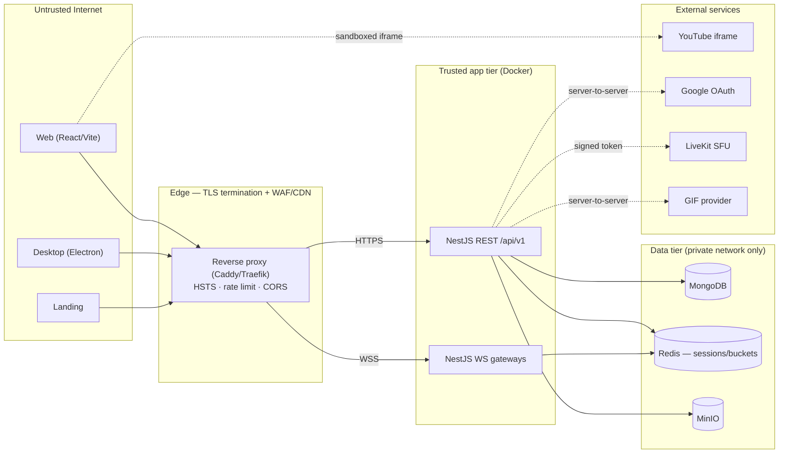
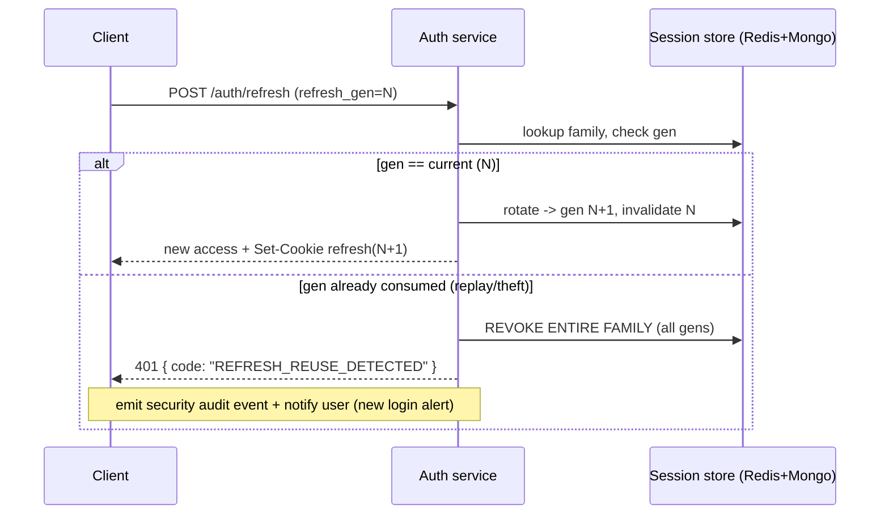

# Cowatch — Security Architecture

> Threat model, OWASP Top 10 mitigations, transport security, token/session hardening, rate limiting, input/output safety, CSP, cookie/CSRF/XSS posture, account security, media/embedding risk, and supply-chain hygiene for the Cowatch platform.

**Status:** Planning (Phase 0 — Architecture; revisited every feature phase)
**Owner agent:** DevOps / Security Engineer
**Last updated: 2026-06-27**

Canonical source of truth: [Architecture Canon](../context/architecture.md). On any conflict, the canon wins. This document operationalizes the [§10 Cross-Cutting Non-Negotiables — Security baseline](../context/architecture.md#10-cross-cutting-non-negotiables) and elaborates [ADR-008 (Auth tokens)](../adr/ADR-008-auth-tokens.md), [ADR-009 (MinIO storage)](../adr/ADR-009-minio-storage.md), and [ADR-010 (Docker-first delivery)](../adr/ADR-010-docker-first.md).

> **Cross-links:** [ARCHITECTURE.md](./ARCHITECTURE.md) · [AUTH.md](./AUTH.md) · [PERMISSIONS.md](./PERMISSIONS.md) · [DEPLOYMENT.md](./DEPLOYMENT.md) · [LIVEKIT.md](./LIVEKIT.md) · [canon §8 Auth](../context/architecture.md#8-auth--token-model-adr-008) · [canon §6 Permissions](../context/architecture.md#6-permission-model)

---

## Table of Contents

1. [Scope, Goals & Security Principles](#1-scope-goals--security-principles)
2. [Threat Model](#2-threat-model)
3. [Trust Boundaries & Data Classification](#3-trust-boundaries--data-classification)
4. [OWASP Top 10 (2021) Mapping](#4-owasp-top-10-2021-mapping)
5. [Transport Security (HTTPS / WSS / mTLS internal)](#5-transport-security-https--wss--mtls-internal)
6. [JWT Rotation & Refresh-Token Reuse Detection](#6-jwt-rotation--refresh-token-reuse-detection)
7. [Rate Limiting & Brute-Force Protection](#7-rate-limiting--brute-force-protection)
8. [Input Validation & Output Sanitization](#8-input-validation--output-sanitization)
9. [Content Security Policy & Security Headers](#9-content-security-policy--security-headers)
10. [Cookies, CSRF & XSS](#10-cookies-csrf--xss)
11. [Account Security (2FA, Sessions, Password Policy)](#11-account-security-2fa-sessions-password-policy)
12. [Media & Embedding Risks](#12-media--embedding-risks)
13. [Object Storage Security (MinIO)](#13-object-storage-security-minio)
14. [Realtime & Voice Security](#14-realtime--voice-security)
15. [Secrets Management](#15-secrets-management)
16. [Dependency & Supply-Chain Hygiene](#16-dependency--supply-chain-hygiene)
17. [Logging, Auditing & Incident Response](#17-logging-auditing--incident-response)
18. [Security Acceptance Criteria](#18-security-acceptance-criteria)
19. [Open Questions](#19-open-questions)

---

## 1. Scope, Goals & Security Principles

Cowatch is a production SaaS handling **user credentials, OAuth tokens, social graphs, private DMs, password-protected rooms, voice/video media, and user uploads**. This document is the authoritative security design that every feature phase (1–12) must satisfy before its code ships (process rule **R5**).

**Security principles (binding):**

| # | Principle | Manifestation |
|---|---|---|
| S1 | **Defense in depth** | No single control is load-bearing; edge + gateway + service + data layers each enforce. |
| S2 | **Server is authoritative** | Clients are untrusted. Permissions, playback authority, and ownership are decided server-side (see [PERMISSIONS.md](./PERMISSIONS.md), [canon §7](../context/architecture.md#7-sync-algorithm)). |
| S3 | **Least privilege** | Scoped JWTs, per-bucket MinIO policies, scoped DB credentials, scoped LiveKit grants. |
| S4 | **Secure by default** | Rooms default to least-exposing settings; new endpoints are deny-by-default until a guard is attached. |
| S5 | **Fail closed** | Auth/permission/validation failures reject the request; never degrade to "allow". |
| S6 | **No secrets in code** | Secrets only via env / secret store ([§15](#15-secrets-management)), never committed. |
| S7 | **Auditable** | Every security-relevant action carries a ULID `correlationId` and is logged (pino JSON). |
| S8 | **Validate at the boundary** | Every inbound payload (REST DTO + realtime envelope) is schema-validated before any handler logic. |

**Non-goals (this document):** physical datacenter security (delegated to VPS/cloud provider), full SOC2 control narrative (future), and end-to-end encryption of media (LiveKit SFU terminates DTLS-SRTP server-side; see [§14](#14-realtime--voice-security)).

---

## 2. Threat Model

We use a lightweight **STRIDE** decomposition against the principal actors and assets.

### 2.1 Actors

| Actor | Trust | Notes |
|---|---|---|
| Anonymous internet | Untrusted | Can hit public endpoints, discovery, landing. |
| Guest user | Low | Ephemeral `Guest` role; no durable credentials ([canon §8](../context/architecture.md#8-auth--token-model-adr-008)). |
| Registered user | Medium | Has account, sessions, social graph. |
| Room Member / Moderator / Owner | Scoped | Power is room-scoped per the [permission matrix](../context/architecture.md#6-permission-model). |
| Platform operator / DevOps | High | Access to secrets, infra; insider-risk surface. |
| Third-party services | External | YouTube (iframe), Google OAuth, LiveKit, GIF provider, SMTP. |

### 2.2 Key assets

Credentials & password hashes, refresh-token families, JWT signing keys (RS256 private key), TOTP secrets + recovery codes, OAuth client secrets, private/password rooms, DM content, social graph, uploaded media (avatars/room assets), MinIO credentials, and database connection strings.

### 2.3 STRIDE → Cowatch threats & primary mitigations

| STRIDE | Representative threat | Primary mitigation | Section |
|---|---|---|---|
| **Spoofing** | Stolen access token replayed; forged WS connection; account takeover via credential stuffing | Short-lived RS256 JWT, WS auth on connect, rate-limited login, TOTP 2FA | [§6](#6-jwt-rotation--refresh-token-reuse-detection) · [§7](#7-rate-limiting--brute-force-protection) · [§11](#11-account-security-2fa-sessions-password-policy) |
| **Tampering** | Client forges `playback:*` it isn't authorized for; mass-assignment of `role`/`ownerId`; NoSQL operator injection (`$gt`, `$where`) | Server-authoritative sync-authority check; allowlist DTOs (`whitelist + forbidNonWhitelisted`); Prisma typed queries (no raw `$where`) | [§8](#8-input-validation--output-sanitization) · [PERMISSIONS.md](./PERMISSIONS.md) |
| **Repudiation** | User denies a kick/ban/ownership transfer | Append-only audit log with `correlationId`, actor `sub`/`sid`, before/after state | [§17](#17-logging-auditing--incident-response) |
| **Information disclosure** | Private room/DM leak; IDOR on `/rooms/:id`; verbose stack traces; refresh token in JS | Object-level authz guards; generic error envelope; httpOnly refresh cookie | [§4 (A01)](#4-owasp-top-10-2021-mapping) · [§10](#10-cookies-csrf--xss) |
| **Denial of service** | WS connection flood; chat spam; large upload; expensive search | Connection caps, per-event token bucket, upload size/type limits, query pagination caps | [§7](#7-rate-limiting--brute-force-protection) · [§12](#12-media--embedding-risks) |
| **Elevation of privilege** | Guest performs Owner action; horizontal move to another room; refresh-token theft → full takeover | Per-request role re-derivation, room-scoped guards, refresh **reuse detection** revoking the family | [§6](#6-jwt-rotation--refresh-token-reuse-detection) · [PERMISSIONS.md](./PERMISSIONS.md) |

### 2.4 Top attack surfaces (ranked)

1. **Auth endpoints** (`/api/v1/auth/*`) — credential stuffing, token theft, reset-token abuse.
2. **Realtime gateway** — unauthenticated frames, authority bypass, flooding, topic snooping.
3. **User-generated content** — chat/DM (stored XSS), display names, room names/descriptions, GIF embeds, avatar uploads.
4. **Object storage** — unsigned access, public buckets, malicious upload content-type.
5. **Discovery/search** — IDOR, enumeration, NoSQL injection through filters.
6. **Third-party embeds** — YouTube iframe, OAuth redirect, GIF picker.

### 2.5 Out-of-scope / accepted risks (planning)

- LiveKit SFU sees decrypted media at the server (no client-side E2EE in v1). Accepted; documented in [§14](#14-realtime--voice-security).
- Determined screen-recording of synced media by an authorized viewer is not preventable (DRM out of scope; YouTube ToS governs).

---

## 3. Trust Boundaries & Data Classification



**Boundary rules:**

- The **data tier is never exposed publicly** — Mongo, Redis, MinIO bind to the private Docker network only ([DEPLOYMENT.md](./DEPLOYMENT.md)).
- All ingress crosses the **edge boundary** (TLS, HSTS, rate limit, CORS allowlist) before reaching the app tier.
- The app tier treats **every client payload as hostile** until validated (S8).

**Data classification:**

| Class | Examples | Handling |
|---|---|---|
| **Secret** | Password hashes, RS256 private key, TOTP secrets, recovery codes, OAuth client secret, refresh-token hashes | Encrypted at rest where supported; never logged; never returned by API. |
| **Sensitive** | DMs, private/password room content, email, IP-region, device labels | Access-controlled; redacted from logs; minimized in responses. |
| **Internal** | Denormalized display snapshots, room metadata | Authz-gated reads. |
| **Public** | Public room name/current video/viewer count/tags, public profile display name + avatar | Cacheable; still rate-limited. |

---

## 4. OWASP Top 10 (2021) Mapping

Each item lists the **Cowatch-specific** risk and the binding mitigation. This table is the audit checklist for every phase's security review.

| OWASP | Cowatch-specific risk | Mitigation (binding) |
|---|---|---|
| **A01 Broken Access Control** | IDOR on `GET /api/v1/rooms/:roomId`, DMs, sessions; Guest invoking Owner-only action; horizontal access to another user's notifications | **Object-level authz** on every resource: room-scoped `RoomRoleGuard` re-derives `Membership` from canon matrix per request; `@CurrentUser()` ownership checks on `/me/*`, `/sessions/:id`; deny-by-default — no controller method ships without an explicit guard. Sync-authority enforced server-side ([canon §6](../context/architecture.md#6-permission-model)). |
| **A02 Cryptographic Failures** | Weak password hashing; JWT signed with weak/symmetric key; secrets at rest; refresh token readable by JS | **argon2id** (preferred) / bcrypt(cost ≥ 12) for passwords; **RS256** asymmetric JWT (private key never leaves server); refresh token **opaque + hashed (SHA-256)** at rest; TLS 1.2+ everywhere; TOTP secrets encrypted at rest. |
| **A03 Injection** | NoSQL operator injection via JSON bodies/query (`{"$gt":""}`, `$where`, `$regex` DoS); template/log injection; OS command via upload filename | **Prisma typed client only** — no `$runCommandRaw` with user input, `$where` forbidden; `class-validator` + `class-transformer` coerce types so `$`-operator objects can't reach the driver; `regex` user input is escaped/anchored and length-capped; filenames are server-generated (never trusted). |
| **A04 Insecure Design** | Sync-authority bypass; ownership-transfer race; guest privilege creep; predictable invite tokens | Threat-modeled per feature (this doc + [PERMISSIONS.md](./PERMISSIONS.md)); **atomic** server-side ownership transfer ([canon §6](../context/architecture.md#6-permission-model)); invite tokens are **128-bit CSPRNG** (`crypto.randomBytes`), optionally single-use/expiring; abuse limits baked into design ([§7](#7-rate-limiting--brute-force-protection)). |
| **A05 Security Misconfiguration** | Default MinIO creds; permissive CORS `*`; Helmet disabled; debug stack traces; Mongo without auth | **Hardened defaults** ([DEPLOYMENT.md](./DEPLOYMENT.md)): strict CORS allowlist (no `*` with credentials), Helmet on, `NODE_ENV=production` suppresses stack traces, Mongo auth + private network, MinIO non-default creds + per-bucket policy. CI fails on misconfig (see [§16](#16-dependency--supply-chain-hygiene)). |
| **A06 Vulnerable & Outdated Components** | Transitive CVE in npm graph; abandoned realtime/GIF lib | **Renovate/Dependabot** PRs, `pnpm audit` gate in CI, lockfile committed & verified (`--frozen-lockfile`), SBOM generated, pinned base images ([§16](#16-dependency--supply-chain-hygiene)). |
| **A07 Identification & Authentication Failures** | Credential stuffing; weak passwords; missing 2FA on sensitive ops; session fixation | Rate-limited + lockout login ([§7](#7-rate-limiting--brute-force-protection)); password policy + breach check ([§11](#11-account-security-2fa-sessions-password-policy)); **TOTP 2FA**; new session id minted on every auth (no fixation); refresh **rotation + reuse detection** ([§6](#6-jwt-rotation--refresh-token-reuse-detection)). |
| **A08 Software & Data Integrity Failures** | Malicious dependency / build; unsigned Electron auto-update; tampered Docker image | Lockfile + integrity hashes; **code-signed** Electron builds with signed `electron-builder` auto-update feed (see [ADR-006]); pinned + digest-referenced base images; CI provenance/attestation ([§16](#16-dependency--supply-chain-hygiene)). |
| **A09 Security Logging & Monitoring Failures** | Undetected brute force / token theft; no audit trail for moderation | Structured pino logs + **security audit events** ([§17](#17-logging-auditing--incident-response)); auth anomalies alerted; every request/event carries ULID `correlationId` ([canon §10](../context/architecture.md#10-cross-cutting-non-negotiables)). |
| **A10 Server-Side Request Forgery (SSRF)** | Server fetching attacker-controlled URLs for YouTube metadata / GIF / thumbnails / avatar-by-URL | **No user-URL fetching** for media: YouTube data via the **official YouTube Data API** by video id only; GIFs via the provider's API (no arbitrary URL proxy); if any URL fetch is ever required, it goes through an **allowlist + private-IP/metadata-endpoint blocklist** egress proxy ([§12](#12-media--embedding-risks)). |

---

## 5. Transport Security (HTTPS / WSS / mTLS internal)

- **TLS everywhere** (canon §10). Public traffic terminates at the edge reverse proxy (Caddy or Traefik) which provisions/renews certificates (ACME/Let's Encrypt) and enforces **TLS 1.2+ (prefer 1.3)** with a modern cipher suite; TLS ≤ 1.1 and insecure ciphers disabled.
- **HSTS**: `Strict-Transport-Security: max-age=63072000; includeSubDomains; preload`. HTTP→HTTPS 301 redirect at the edge.
- **WebSocket** uses **WSS only**; the gateway rejects non-TLS upgrades. The realtime envelope and token are sent over the encrypted channel ([canon §5](../context/architecture.md#5-realtime-transport-abstraction-adr-004)).
- **WS authentication on connect**: the access token is presented at the WS handshake (subprotocol header or first-frame `connect` envelope, never in the query string — query strings leak to logs/proxies). The gateway validates the JWT, binds `sub`/`sid` to the connection, and rejects on failure with `system:error` `UNAUTHENTICATED`. Tokens are re-validated on reconnect/resume.
- **Internal service traffic** (app↔Mongo/Redis/MinIO/LiveKit) stays on the **private Docker network**; where the deployment spans hosts (VPS multi-node, LiveKit), enable **mTLS or TLS** on those links. Database connections require auth + TLS in `production`.
- **Certificate hygiene**: automated renewal, OCSP stapling at the edge, no wildcard private keys baked into images.

---

## 6. JWT Rotation & Refresh-Token Reuse Detection

This section is the security view of [canon §8](../context/architecture.md#8-auth--token-model-adr-008) and [AUTH.md §9](./AUTH.md#9-refresh-rotation--reuse-detection); on conflict, AUTH.md/canon win.

**Token shapes**

| Token | Type | TTL | Storage | Notes |
|---|---|---|---|---|
| Access | JWT RS256 | **15 min** | In-memory (web) / secure store (desktop) — **never localStorage** | Claims `sub, sid, kind, roles, iat, exp`. |
| Refresh | Opaque random (≥256-bit) | **30 days** | **httpOnly Secure SameSite=Strict** cookie scoped to `/api/v1/auth`; stored **hashed** server-side | One rotating family per `Session`. |

**Rotation invariant:** every `POST /api/v1/auth/refresh` issues a **new access + new refresh** and **invalidates the previous refresh**. A refresh token is single-use.

**Reuse detection (theft response):** each refresh token belongs to a per-session **token family** with a monotonically increasing generation. The server stores only the current valid hash (plus a short grace window for in-flight rotation). Presenting an **already-consumed** refresh token is treated as theft:



- **Replay window tolerance:** a single in-flight retry (network race) is allowed via a short reuse grace (e.g. 10 s same-gen) **only for the immediately previous gen by the same device fingerprint**; anything else triggers full-family revocation.
- **Logout** revokes the current session's family; **revoke-all** ([§11](#11-account-security-2fa-sessions-password-policy)) revokes every family except (optionally) the current.
- **Key management:** RS256 signing keys live in the secret store, support **kid-based rotation** (overlapping validity), and the private key never appears in logs, images, or client bundles. Access-token revocation between 15-min windows is achieved by `sid` lookup against the session store (a revoked `sid` is rejected even with a non-expired JWT).
- **Clock & replay:** JWTs validated for `exp`, `iat`, `iss`, `aud`; small clock skew tolerance only.

---

## 7. Rate Limiting & Brute-Force Protection

Layered limits, enforced at the **edge** (coarse, per-IP) and **app** (fine, per-user/per-route), backed by **Redis** so limits are shared across horizontally-scaled instances.

### 7.1 REST limits (representative — tune in DEPLOYMENT)

| Endpoint class | Key | Limit | On exceed |
|---|---|---|---|
| `POST /auth/login` | IP **and** account | 5 / 5 min / account, 20 / 5 min / IP | 429 + exponential backoff; progressive lockout |
| `POST /auth/refresh` | session | 60 / 15 min | 429 |
| `POST /auth/register`, `/auth/oauth/*` | IP | 10 / hour | 429 + optional CAPTCHA |
| `POST /auth/password/reset`, `/auth/verify/resend` | IP + email | 5 / hour / email | 429; **silent success** (no account enumeration) |
| 2FA verify | account | 5 / 5 min | 429 + step-up lockout |
| Write endpoints (rooms, chat, playlist, social) | user | per-route token bucket | 429 with `Retry-After` |
| Search / discovery | user/IP | bounded + pagination caps | 429 |

- **429 envelope** uses the standard error shape (canon §10) with `code: "RATE_LIMITED"` and a `Retry-After` header.
- **Account lockout** is **progressive** (increasing delay) rather than hard-permanent, to avoid attacker-driven lockout DoS; lockout state keyed per account in Redis with auto-expiry.
- **Anti-enumeration:** login, registration, password-reset, and email-verify responses are **uniform** (same status/timing/body) whether or not the account exists.

### 7.2 Realtime limits

- **Connection cap** per user and per IP; excess WS connections rejected.
- **Per-event token bucket** per connection (e.g. chat messages, typing, reactions, playback events) — flooding yields `system:error` `RATE_LIMITED` and, on repeat, connection close.
- **Authority-gated events** (`playback:*`) are additionally rejected with `FORBIDDEN_SYNC` if the sender's role doesn't satisfy the room's `SyncAuthority` ([canon §6/§7](../context/architecture.md#6-permission-model)).
- **Subscription authz:** subscribing to a `room` topic requires an active, non-banned `Membership`; the gateway validates before attaching the subscription (prevents topic snooping on private rooms/DMs).

### 7.3 Bot / automation friction

- CAPTCHA (hCaptcha/Turnstile) gate on registration and after repeated auth failures.
- Guest-account creation rate-limited per IP to curb throwaway-account abuse.

---

## 8. Input Validation & Output Sanitization

**Inbound (validate at the boundary — S8):**

- **REST:** every endpoint takes a `*.dto.ts` validated by a **global `ValidationPipe`** configured `whitelist: true, forbidNonWhitelisted: true, transform: true`. This strips unknown keys (defeats **mass assignment** of `role`, `ownerId`, `kind`) and rejects unexpected fields. Constraints via `class-validator` (`@IsString`, `@Length`, `@IsEnum(RoomRole)`, `@IsMongoId`, `@Matches`).
- **NoSQL-injection defense:** because DTOs `transform` to primitive types, a JSON value like `{ "$gt": "" }` fails type validation before reaching Prisma. Prisma's typed query API is used exclusively; **raw operators with user input are forbidden**, and any `regex`/`contains` search input is escaped, anchored, and length-capped to prevent **ReDoS**.
- **Realtime:** every `RealtimeEnvelope` is validated — `v === 1`, known `type`, well-formed `id`/`corr` (ULID), and a **per-`type` payload schema** (shared from `packages/types`) — before dispatch. Unknown/oversized frames are dropped with `system:error` `BAD_REQUEST`.
- **Size limits:** JSON body cap (e.g. 256 KB for normal routes), envelope payload cap, chat/DM length caps, and upload size caps ([§12](#12-media--embedding-risks)).

**Outbound (sanitize before render):**

- **No server-side HTML rendering of user content.** Chat/DM/profile text is stored and transmitted as **plain text**; the React client renders it as **text nodes (auto-escaped by JSX)** — never `dangerouslySetInnerHTML` on user content.
- Where rich rendering is needed (markdown-lite, links), parsing happens **client-side** through an allowlist sanitizer (e.g. DOMPurify) with a strict tag/attribute allowlist; `javascript:`/`data:` URLs and event handlers are stripped; links open with `rel="noopener noreferrer"`.
- **Mentions/links** are tokenized server-side into structured data (not raw HTML), so the client controls rendering.
- API responses **minimize fields** — secrets and sensitive internals are never serialized (DTO/serializer allowlists, not blocklists).

---

## 9. Content Security Policy & Security Headers

Set at the app (Helmet) and reinforced at the edge. The CSP is **strict** and must explicitly allowlist the YouTube iframe, LiveKit, OAuth, and GIF origins.

**Baseline CSP (web app):**

```http
Content-Security-Policy:
  default-src 'self';
  script-src 'self';                        /* no inline; use nonces/hashes if needed */
  style-src 'self' 'unsafe-inline';         /* tighten with nonces where feasible */
  img-src 'self' data: blob: https://*.minio.cowatch... https://i.ytimg.com https://*.giphy.com;
  media-src 'self' blob:;
  connect-src 'self' wss://realtime.cowatch... https://*.livekit.cloud https://oauth2.googleapis.com https://*.giphy.com;
  frame-src https://www.youtube-nocookie.com https://accounts.google.com;
  font-src 'self';
  object-src 'none';
  base-uri 'self';
  form-action 'self';
  frame-ancestors 'none';
  upgrade-insecure-requests;
  report-uri /api/v1/security/csp-report;
```

**Full header set:**

| Header | Value (intent) |
|---|---|
| `Strict-Transport-Security` | `max-age=63072000; includeSubDomains; preload` |
| `Content-Security-Policy` | strict, as above (report-only in staging first) |
| `X-Content-Type-Options` | `nosniff` |
| `X-Frame-Options` | `DENY` (plus CSP `frame-ancestors 'none'`) — Cowatch is not embeddable |
| `Referrer-Policy` | `strict-origin-when-cross-origin` |
| `Permissions-Policy` | allow `camera`, `microphone`, `display-capture` for voice/screen-share **on own origin only**; deny the rest |
| `Cross-Origin-Opener-Policy` | `same-origin` |
| `Cross-Origin-Resource-Policy` | `same-origin` (assets `same-site` where needed) |
| `Cache-Control` (auth responses) | `no-store` |

- **Electron:** the renderer enforces the same CSP, runs with `contextIsolation: true`, `nodeIntegration: false`, `sandbox: true`, a strict preload bridge, and blocks arbitrary `window.open`/navigation to non-allowlisted origins (see [ADR-006]).
- **CSP rollout:** ship `Content-Security-Policy-Report-Only` first, collect `/security/csp-report`, then enforce.

---

## 10. Cookies, CSRF & XSS

### 10.1 Cookie posture

| Cookie | Flags | Scope | Purpose |
|---|---|---|---|
| Refresh token | `HttpOnly; Secure; SameSite=Strict` | Path `/api/v1/auth` | Rotating refresh ([§6](#6-jwt-rotation--refresh-token-reuse-detection)) |
| CSRF token (double-submit) | `Secure; SameSite=Strict` (readable by JS by design) | `/` | CSRF defense for cookie-auth mutations |

- The access token is **not** in a cookie — it's a Bearer header from in-memory store, so XSS can't trivially exfiltrate a long-lived secret, and CSRF can't ride it (no ambient cookie auth on API mutations except the auth refresh path).
- **`SameSite=Strict`** on the refresh cookie already blocks cross-site automatic submission.

### 10.2 CSRF protection

- Cookie-authenticated mutations (the `/api/v1/auth` refresh/logout family) are additionally protected by a **double-submit CSRF token**: a non-httpOnly CSRF cookie + matching `X-CSRF-Token` header validated server-side (constant-time compare). `SameSite=Strict` is the primary defense; the token is defense-in-depth.
- **Origin/Referer check** on state-changing cookie-auth requests against the CORS allowlist.
- The main API is **Bearer-auth, not cookie-auth**, so it is inherently CSRF-resistant; CSRF guard is applied specifically to the cookie-bearing endpoints.
- **CORS:** strict origin allowlist (web, desktop custom scheme, landing); `Access-Control-Allow-Credentials: true` is **never** paired with `Origin: *`.

### 10.3 XSS protection (layers)

1. **Output encoding** — React auto-escapes; no `dangerouslySetInnerHTML` on user content ([§8](#8-input-validation--output-sanitization)).
2. **Sanitization** — DOMPurify allowlist for any rich text.
3. **CSP** — `script-src 'self'` (no inline scripts) blocks injected `<script>` and inline handlers ([§9](#9-content-security-policy--security-headers)).
4. **httpOnly refresh** — even on XSS, the refresh token isn't reachable from JS; access token is short-lived and in-memory.
5. **Trusted Types** (where supported) to harden DOM sinks.
6. **GIF/emoji** rendered as `` with fixed attributes from allowlisted hosts only — never as injected markup ([§12](#12-media--embedding-risks)).

---

## 11. Account Security (2FA, Sessions, Password Policy)

### 11.1 Password policy

- **Hashing:** argon2id (memory/time-cost tuned for ~250 ms) or bcrypt cost ≥ 12. Never store plaintext or reversible.
- **Strength:** minimum length **12**, enforce via a strength estimator (zxcvbn-style) rather than brittle composition rules; reject the username/email substring.
- **Breach check:** screen against known-breached passwords using **HIBP k-anonymity range API** (only a SHA-1 prefix is sent) on registration and password change.
- **No silent truncation**, no max length below ~128, full Unicode allowed.

### 11.2 TOTP two-factor ([canon §8](../context/architecture.md#8-auth--token-model-adr-008), [AUTH.md §13](./AUTH.md#13-totp-two-factor-enroll--challenge))

- RFC 6238 TOTP (30 s step, ±1 window skew). Secret generated server-side, shown once as QR + manual key, **stored encrypted at rest**.
- **Recovery codes**: 10 single-use codes, shown once, stored **hashed**; using one consumes it; regenerating invalidates old set.
- 2FA challenge is **rate-limited and lockout-protected** ([§7](#7-rate-limiting--brute-force-protection)); enabling/disabling 2FA and viewing recovery codes are **step-up** (re-auth) actions.
- 2FA enrollment binds to the account; backup-code use and 2FA disable raise a **security notification**.

### 11.3 Session management & revocation

- One `Session` per device (UA, IP-region, label, `lastSeenAt`) — [canon §8](../context/architecture.md#8-auth--token-model-adr-008).
- `GET /api/v1/auth/sessions` lists; `DELETE /api/v1/auth/sessions/:id` revokes one; `DELETE /api/v1/auth/sessions` revokes all others. Revocation invalidates the refresh family and rejects the `sid` immediately.
- **Forced global revocation** on: password change, 2FA disable, refresh-reuse detection, and user-initiated "log out everywhere".
- **Sensitive-action step-up:** password change, email change, 2FA changes, and session revoke-all require recent re-authentication.
- **Security notifications** ([canon notification types](../context/architecture.md#1-glossary-of-core-domain-terms)): new-device login, password/email change, 2FA change.

### 11.4 Guest accounts

- Ephemeral session, no persistent refresh cookie beyond the browser session, `Guest` role defaults (limited permissions). Guest creation is rate-limited ([§7](#7-rate-limiting--brute-force-protection)). Upgrade-to-registered re-issues a full session and links durable credentials.

---

## 12. Media & Embedding Risks

### 12.1 YouTube iframe

- Embed via **`youtube-nocookie.com`** privacy-enhanced domain inside an iframe whose origin is allowlisted in CSP `frame-src` and **sandboxed** (`sandbox="allow-scripts allow-same-origin allow-presentation"` — no `allow-top-navigation`, no `allow-popups` unless required).
- Cowatch interacts with the player **only via the official YouTube IFrame Player API** (`postMessage`); we validate the message origin and never `eval` player responses.
- Video **metadata** (title, duration) comes from the **official YouTube Data API by video id** — the server never fetches arbitrary user-supplied URLs (SSRF defense, **A10**). Only valid YouTube video ids (regex-validated) become `QueueItem`s.
- `frame-ancestors 'none'` + `X-Frame-Options: DENY` prevent Cowatch itself from being framed (clickjacking).

### 12.2 GIF / emoji

- GIFs are selected via the **provider's API** (Giphy/Tenor) and rendered as `` from the provider CDN (CSP `img-src` allowlist). **No arbitrary user URL** is proxied or embedded — defeats SSRF and tracking-pixel injection.
- Custom emoji (if added later) are uploaded through the same hardened upload path ([§12.3](#123-uploads-avatars--room-assets)).

### 12.3 Uploads (avatars / room assets)

- **Direct-to-MinIO via short-lived presigned PUT URLs** ([§13](#13-object-storage-security-minio)); the app never proxies raw bytes.
- **Validation:** allowlist MIME types (`image/png|jpeg|webp|gif`), enforce **max size**, and verify **magic-byte/content sniffing server-side** (don't trust the client `Content-Type` or extension).
- **Re-encode / transcode** images server-side (e.g. sharp) to strip EXIF/metadata and neutralize polyglot/embedded-payload files; generate thumbnails server-side.
- **Filenames are server-generated** (ULID/hash) — never derived from client input (path-traversal / injection defense).
- Stored objects are served with `Content-Disposition` and a **non-executable content type**; user content is served from a **separate origin/bucket** to isolate it from the app origin (no same-origin script execution from uploads).
- **Antivirus/content scan** hook on the ingest pipeline (ClamAV or provider) before an asset becomes referenceable.

### 12.4 NSFW handling

- Rooms carry an **NSFW flag** (discovery filter per SPEC). NSFW rooms are filtered from default discovery and gated behind an explicit opt-in/age-acknowledgement.
- Avatars/room assets pass an automated **NSFW image classifier** at ingest; flagged content is quarantined pending review.
- Moderation tooling (kick/ban/report) ties into the audit log; report endpoints are rate-limited to prevent harassment-by-report.

---

## 13. Object Storage Security (MinIO)

Per [ADR-009](../adr/ADR-009-minio-storage.md) and [canon §10](../context/architecture.md#10-cross-cutting-non-negotiables) (least privilege, signed URLs).

- **Buckets are private by default**; no public-read bucket policies. Access is exclusively via **short-TTL presigned URLs** (PUT for upload, GET for read) minted by the server after an authz check.
- **Per-bucket least-privilege policies** and **scoped service credentials** (e.g. separate read vs write credentials; the web app never holds MinIO root creds).
- **Bucket layout** segregates trust: `avatars/`, `room-assets/`, `thumbnails/`, `uploads-tmp/` (quarantine until scanned), `caches/`. User-supplied content lives apart from app static assets.
- **Server-side encryption at rest** (SSE) enabled; TLS in transit on the MinIO endpoint.
- **Lifecycle rules**: expire `uploads-tmp/` and orphaned objects; cap per-user storage quota.
- Presigned PUT URLs **constrain content-type and max size**; the upload is **re-validated and re-encoded server-side** ([§12.3](#123-uploads-avatars--room-assets)) before being promoted out of quarantine.

---

## 14. Realtime & Voice Security

- **WS auth** on connect, per-frame schema validation, per-event rate limits, and **subscription authz** (active membership required for room/DM topics) — see [§5](#5-transport-security-https--wss--mtls-internal), [§7](#7-rate-limiting--brute-force-protection), [§8](#8-input-validation--output-sanitization).
- **Server-authoritative everything**: clients cannot self-promote roles or forge `serverEpochMs`; the server stamps and validates ([canon §7](../context/architecture.md#7-sync-algorithm)).
- **LiveKit** ([ADR-005](../adr/ADR-005-livekit.md), [LIVEKIT.md](./LIVEKIT.md)): access is granted via **short-lived, room-scoped JWT access tokens** minted by the Cowatch server **only after** verifying the user's `Membership` and (for password channels) the channel password. Grants are least-privilege (publish/subscribe/screenshare per role). LiveKit API key/secret are server-only secrets.
- Media is **DTLS-SRTP encrypted** client↔SFU; the SFU sees plaintext media (no E2EE in v1 — documented accepted risk, [§2.5](#25-out-of-scope--accepted-risks-planning)).
- **Voice channel passwords** are verified server-side (never compared client-side); failed attempts are rate-limited.

---

## 15. Secrets Management

- **No secret in source, image, or client bundle** (S6). Secrets are injected via **environment / secret store** at runtime ([DEPLOYMENT.md](./DEPLOYMENT.md)).
- **Inventory:** RS256 private/public keys (with `kid` rotation), Mongo URI, Redis URL, MinIO access/secret keys, LiveKit API key/secret, Google OAuth client id/secret, SMTP creds, GIF provider key, CSRF/session signing secrets.
- **Per-environment isolation:** distinct secrets for `local`/`vps`/`vercel`/`production`; production secrets never reach dev.
- **Rotation:** documented rotation runbook per secret; JWT keys support overlapping validity for zero-downtime rotation.
- **Build hygiene:** `.env*` git-ignored; **secret scanning** (gitleaks/trufflehog) in CI and pre-commit to block accidental commits; Docker build args never carry secrets (use runtime env / mounts).
- **Least privilege:** each service gets only the credentials it needs (scoped DB user, scoped MinIO creds).

---

## 16. Dependency & Supply-Chain Hygiene

- **Lockfile-pinned** (`pnpm-lock.yaml`) and installed with `--frozen-lockfile`; integrity hashes verified.
- **Automated updates:** Renovate/Dependabot grouped PRs; `pnpm audit` (and Socket/Snyk where available) **gate CI** — high/critical vulns block merge.
- **SBOM** (CycloneDX) generated per release; vulnerabilities tracked against it.
- **Base images** pinned by **digest** and minimal (distroless/alpine where viable); rebuilt regularly for OS CVEs; image scanning (Trivy/Grobi) in CI.
- **Provenance/integrity (A08):** signed commits encouraged; CI build provenance/attestation; **code-signed Electron** artifacts with a **signed auto-update feed** ([ADR-006]) to prevent malicious-update injection.
- **Least third-party trust:** prefer well-maintained libraries; the custom realtime layer ([ADR-004](../adr/ADR-004-realtime-abstraction.md)) deliberately avoids transport lock-in and reduces reliance on a single realtime vendor.
- **Allowlist of licenses** checked in CI to avoid license/legal surprises.
- **Secret scanning** (see [§15](#15-secrets-management)) runs on every PR.

---

## 17. Logging, Auditing & Incident Response

- **Structured pino JSON logs**, every line carries the ULID `correlationId` ([canon §10](../context/architecture.md#10-cross-cutting-non-negotiables)); HTTP `x-correlation-id` and envelope `corr` propagate one id across REST + realtime + logs.
- **Redaction:** passwords, tokens, cookies, TOTP secrets, recovery codes, and PII are **never logged** (pino redaction paths + a logging allowlist).
- **Security audit events** (separate, append-only, tamper-evident stream) for: login success/failure, 2FA events, password/email change, session revoke, **refresh-reuse detection**, role/ownership changes, kick/ban/mute, permission denials, presigned-URL issuance, and admin actions. Each records actor `sub`/`sid`, target, before/after, `correlationId`, timestamp (UTC).
- **Detection & alerting:** alert on brute-force spikes, reuse-detection events, mass-revocation, anomalous geo logins, and error-rate surges. Health (`/health/live`, `/health/ready`) and Prometheus metrics on every service.
- **Incident response:** documented runbook — contain (revoke families/keys), eradicate, notify affected users, rotate compromised secrets, postmortem with an ADR + [history](../history/) entry (R3).

---

## 18. Security Acceptance Criteria

These are gating checks for **every** feature phase's security review (R5). A phase ships only when all relevant items pass.

- [ ] Every new REST endpoint has a validated DTO (`whitelist + forbidNonWhitelisted`) and an explicit authz guard (deny-by-default).
- [ ] Every new realtime `type` has a payload schema in `packages/types` and gateway-side validation + subscription authz.
- [ ] No user-controlled value reaches Prisma as a raw operator / `$where` / unescaped regex.
- [ ] No user content is rendered via `dangerouslySetInnerHTML`; rich text passes the sanitizer allowlist.
- [ ] Access tokens are not persisted to `localStorage`; refresh is httpOnly+Secure+SameSite=Strict and rotates with reuse detection.
- [ ] Auth, write, and search endpoints have per-IP and per-user rate limits; auth has progressive lockout + anti-enumeration.
- [ ] CSP enforced (not just report-only) with the minimal origin allowlist; full security header set present.
- [ ] Cookie-auth mutations carry CSRF + Origin checks; CORS allowlist excludes `*`-with-credentials.
- [ ] Uploads validated by magic bytes + size + MIME allowlist, re-encoded, served from an isolated origin with server-generated names; MinIO buckets private + presigned URLs.
- [ ] Secrets only via env/secret store; secret scanning + `pnpm audit` gates green in CI; base images pinned by digest.
- [ ] Security audit events emitted for all security-relevant actions; sensitive fields redacted from logs.
- [ ] Sensitive account actions (password/email/2FA/revoke-all) require step-up re-auth.
- [ ] Test coverage for the feature's security paths counts toward the **90%** target (canon §10); negative/abuse tests included.

---

## 19. Open Questions

| # | Question | Recommendation |
|---|---|---|
| Q1 | WAF/CDN provider (Cloudflare vs self-managed Traefik+CrowdSec) for edge rate limiting & bot mitigation? | **Cloudflare** in front of the VPS for DDoS/bot/WAF, with app-tier Redis limits as the authoritative backstop. Decide via ADR before Phase 12. |
| Q2 | CAPTCHA vendor — hCaptcha vs Cloudflare Turnstile? | **Turnstile** (privacy-friendly, no-interaction) if Cloudflare is the edge; otherwise hCaptcha. |
| Q3 | Upload AV/NSFW: self-host ClamAV + open NSFW model, or a managed moderation API? | Start with **ClamAV + an open NSFW classifier** self-hosted (cost/control); revisit a managed API at scale. |
| Q4 | Client-side E2EE for DMs/voice in a future version? | Out of scope v1; record as a future ADR. SFU media remains server-visible for now. |
| Q5 | Secret store: Docker secrets / SOPS+age / Vault? | **SOPS+age** in git for config-as-code parity now; graduate to **Vault** if the team/threat model grows. ADR required. |
| Q6 | Breach-password check provider availability (HIBP rate/quota)? | Use **HIBP k-anonymity** (free, privacy-preserving); cache negative results briefly; fail-open on provider outage (don't block registration), log the degradation. |

---

> **Maintenance (R3/R4):** any change that alters a security control here requires an ADR + [history](../history/) entry + context/repomix update. Security is re-reviewed at every phase gate against [§18](#18-security-acceptance-criteria).
