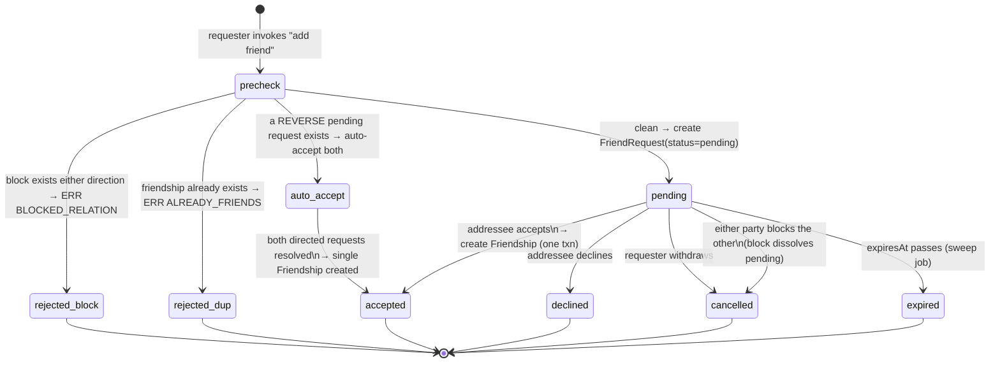
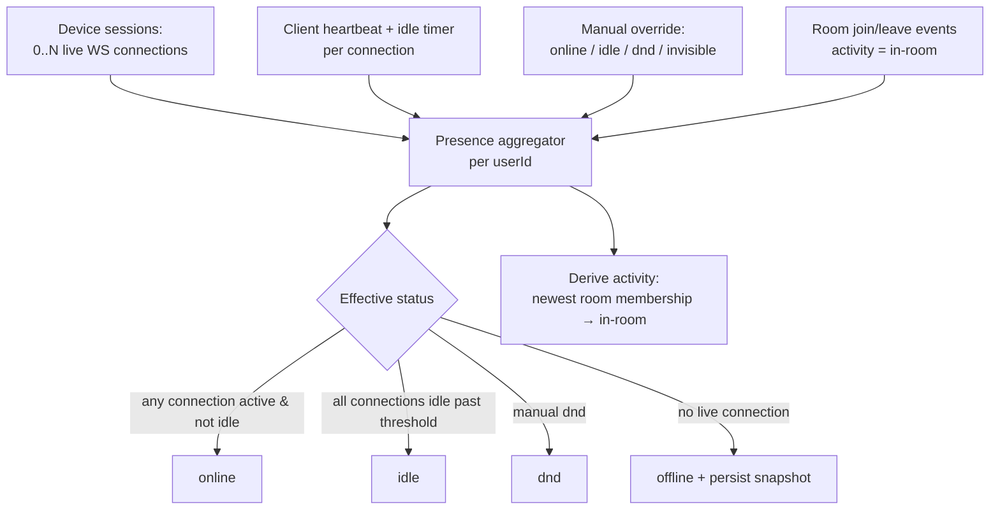
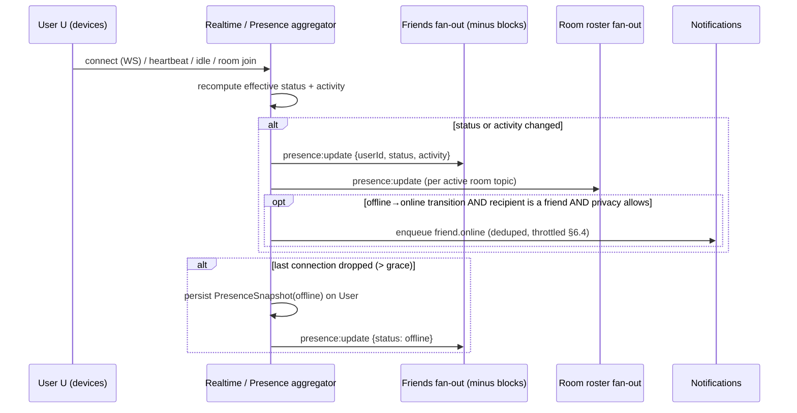
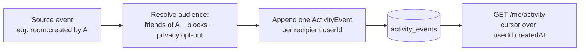
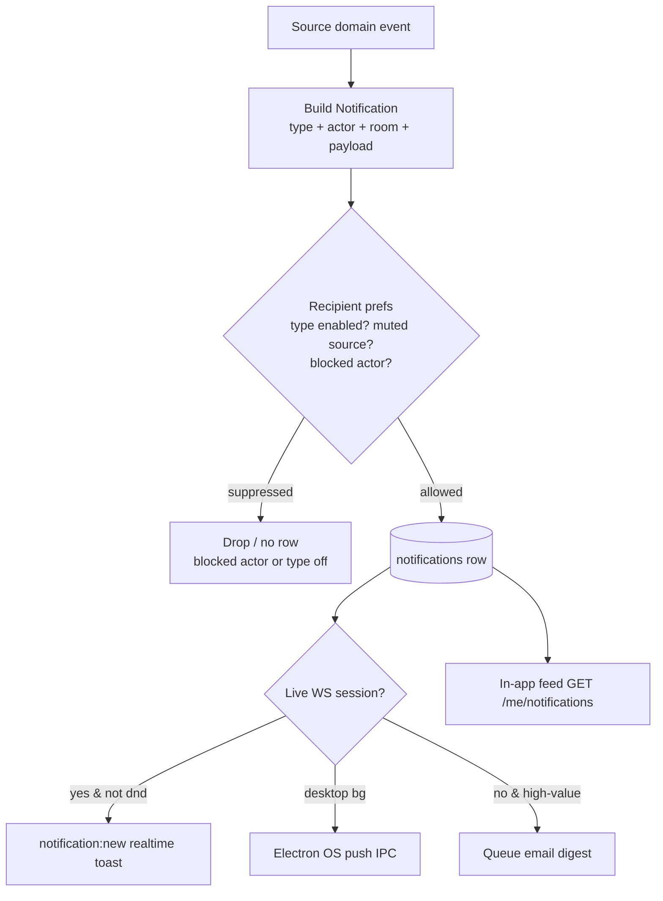

# Social System Architecture

> Definitive design for Cowatch's social graph: friends and friend requests, presence, the activity feed, direct messages, the full notification taxonomy, blocked-user semantics, and user profiles & privacy settings.

**Status:** Draft (Planning — Phase 5: Friends / Phase 6: Notifications)
**Owner agent:** Social Engineer
**Last updated: 2026-06-27**

> Canon compliance: this document is downstream of and MUST comply with the [Architecture Canon](../context/architecture.md). On any conflict, the canon wins. It elaborates the social aggregates defined in the [Domain Model](./DOMAIN.md) and reuses the enforcement substrate described in [Permissions](./PERMISSIONS.md). Type names, route shapes, event names, and collection names below match the canon and the [Domain Model](./DOMAIN.md) verbatim.

---

## 0. Context, Scope & Sources

The **social system** is the layer that makes Cowatch a *Discord-like* product rather than a bare watch-sync tool: the durable relationships between users (friends, blocks), the realtime sense of who is around (presence), the conversational surface outside rooms (direct messages), the awareness stream (activity feed), and the actionable alerts that pull users back in (notifications).

This document owns the design of **six bounded sub-domains**, each mapping to one or more aggregates in the [Domain Model](./DOMAIN.md):

| Sub-domain | Owning aggregate(s) | Collection(s) (canon §4) | Section |
|---|---|---|---|
| Friends & friend requests | `Friendship`, `FriendRequest` | `friendships`, `friend_requests` | [§2](#2-friends--friend-requests) |
| Presence | `PresenceSnapshot` (on `User`) + realtime | `users` (durable mirror) | [§3](#3-presence) |
| Activity feed | `ActivityEvent` | `activity_events` (see [OQ-1](#10-open-questions)) | [§4](#4-activity-feed) |
| Direct messages | `DmThread`, `Message` | `dm_threads`, `messages` | [§5](#5-direct-messages) |
| Notifications | `Notification` | `notifications` | [§6](#6-notification-taxonomy) |
| Blocks | `Block` | `blocks` | [§7](#7-blocked-users-semantics) |
| Profiles & privacy | `User`, `UserProfile`, `UserPrivacy` | `users` | [§8](#8-user-profiles--privacy-settings) |

Authority order on conflict: **[Architecture Canon](../context/architecture.md)** → **[Domain Model](./DOMAIN.md)** → this document → downstream specs/tasks/tests.

Related documents:

- [Architecture Canon](../context/architecture.md) — single source of truth (§[1 Glossary](../context/architecture.md#1-glossary-of-core-domain-terms), §[4 Data Modeling](../context/architecture.md#4-data-modeling-conventions-mongodb--prisma), §[5 Realtime](../context/architecture.md#5-realtime-transport-abstraction-adr-004), §[10 Non-Negotiables](../context/architecture.md#10-cross-cutting-non-negotiables)).
- [Domain Model](./DOMAIN.md) — social aggregate shapes, invariants ([§5.3](./DOMAIN.md#53-social-aggregates--friendship-friendrequest-block)–[§5.5](./DOMAIN.md#55-block)), and state machines ([§6.3](./DOMAIN.md#63-friend-request-lifecycle)).
- [Permissions](./PERMISSIONS.md) — role/permission core reused for DM and room-invite gating.
- ADR-004 — [Custom Realtime abstraction](../adr/ADR-004-realtime-abstraction.md) (presence + delivery transport).
- ADR-003 — [Prisma over MongoDB](../adr/ADR-003-prisma-mongodb.md) (embed/reference + denormalization).
- ADR-008 — [Auth / token model](../adr/ADR-008-auth-tokens.md) (`User.kind`, guest semantics).
- Sibling specs (planned): `../specs/social.md`, `../specs/notifications.md`, `../specs/dm.md`.

> This is a **planning artifact**. TypeScript interfaces are illustrative vocabulary sketches that extend the [Domain Model](./DOMAIN.md); the authoritative persisted shape is the Prisma schema in `packages/database/prisma/schema.prisma`, and the authoritative TS types live in `packages/types` (canon §3 — never duplicated).

---

## 1. Design Principles

1. **The social graph is its own set of aggregates, never embedded in `User`.** `Friendship`, `FriendRequest`, and `Block` are unbounded relational edges and live in their own collections with back-reference ids + indexes (canon §4 hard rule). `User` holds no edge arrays.
2. **Blocks are a delivery-time and read-time filter, applied everywhere.** A `Block` is never "stored into" the data it suppresses; it is evaluated as a predicate at every social surface (presence, DM, mentions, invites, feed, search, profile). One enforcement helper, reused on every surface (§7).
3. **Presence is realtime-owned, durably mirrored.** The authoritative status of an *online* user lives in the realtime layer (derived from live WS connections); a small `PresenceSnapshot` on `User` is a cold-read mirror for offline/last-seen (canon §1, [DOMAIN §3.1](./DOMAIN.md#31-user-aggregate)).
4. **Notification vs ActivityEvent are distinct read models.** A `Notification` is an *actionable alert* with read/seen state and delivery channels; an `ActivityEvent` is an *awareness item* in a chronological feed. They are stored, queried, and retained separately ([DOMAIN OQ-5](./DOMAIN.md#8-open-questions)).
5. **Canonical pair ordering for symmetric edges.** `Friendship` is stored once per unordered pair with `userIdA < userIdB`; `DmThread` participants are sorted canonically. Directed edges (`FriendRequest`, `Block`) keep their direction.
6. **Server is the single source of truth.** Every social mutation — REST or realtime — is re-validated server-side. Clients render optimistically but hold no authority (mirrors [Permissions §1](./PERMISSIONS.md#1-design-principles)).
7. **Eventual consistency via denormalized snapshots + realtime re-fan.** Read-hot identity fields (display name, avatar) are denormalized and re-fanned on profile change; the owning aggregate is the source of truth (canon §4, register in [§9](#9-denormalization--fan-out)).
8. **Every social event carries one `correlationId` (ULID).** Propagated across REST → service → WS → notification → logs (canon §10) for traceability of a single logical operation (e.g. "accept friend request" → friendship write → two `social:friend:accept` fans → two notifications).

---

## 2. Friends & Friend Requests

### 2.1 Model recap

The social edges are defined in [DOMAIN §3.3](./DOMAIN.md#53-social-aggregates--friendship-friendrequest-block) and bound by its invariants ([§5.3](./DOMAIN.md#53-friendship)–[§5.4](./DOMAIN.md#54-friendrequest)). Reproduced here for locality (authoritative shape is the Domain Model + Prisma schema):

```ts
// Canonical, unordered, accepted mutual edge — one row per pair.
interface Friendship {
  id: string;
  userIdA: string;            // INVARIANT: userIdA < userIdB (lexicographic ObjectId order)
  userIdB: string;            // INVARIANT: userIdA !== userIdB
  createdAt: string;          // = acceptance time
  updatedAt: string;
}

type FriendRequestStatus =
  | 'pending' | 'accepted' | 'declined' | 'cancelled' | 'expired';

// Directed, pending invitation; resolves into a Friendship or a terminal state.
interface FriendRequest {
  id: string;
  requesterId: string;
  addresseeId: string;        // INVARIANT: addresseeId !== requesterId
  status: FriendRequestStatus;
  message: string | null;     // optional note, length-capped, validated
  respondedAt: string | null;
  expiresAt: string | null;   // default now + FRIEND_REQUEST_TTL (recommend 30 days)
  createdAt: string;
  updatedAt: string;
}
```

**Indexes** (canon §4 — equality→sort→range; FK on every query filter):

| Collection | Index | Purpose |
|---|---|---|
| `friendships` | `(userIdA, userIdB)` **unique** | one row per pair; existence checks |
| `friendships` | `(userIdA)` and `(userIdB)` | list a user's friends from either side |
| `friend_requests` | `(addresseeId, status, createdAt)` | incoming pending list, newest first |
| `friend_requests` | `(requesterId, status, createdAt)` | outgoing pending list |
| `friend_requests` | `(requesterId, addresseeId)` **partial-unique** where `status = 'pending'` | at most one live request per directed pair |

> **Canonical-order helper.** Because friends must be queryable "from either side," every read of "friends of `U`" unions `{ userIdB : userIdA = U }` ∪ `{ userIdA : userIdB = U }`. A maintained convenience is acceptable but the unordered pair is the source of truth.

### 2.2 Friend-request state machine

Implements [DOMAIN §6.3](./DOMAIN.md#63-friend-request-lifecycle). Terminal states are immutable; a new request after a terminal state is a **new** `FriendRequest` row.



**Transition rules & guards**

| From → To | Trigger | Guards (server-enforced) | Side effects |
|---|---|---|---|
| ∅ → `pending` | `POST /friends/requests` | no `Block` either direction; no existing `Friendship`; no live pending in same direction; `addresseeId ≠ requesterId`; addressee's privacy allows requests from requester (§8.3) | persist request; `social:friend:request` → addressee; `notification.new (friend.invitation)` |
| ∅ → `accepted` (auto) | `POST /friends/requests` when a **reverse** `pending` exists | reverse request still `pending`; no block introduced meanwhile | mark reverse request `accepted`; create `Friendship`; `social:friend:accept` → both; one `friend.invitation`→`accepted` collapse |
| `pending` → `accepted` | `POST /friends/requests/:id/accept` (by addressee) | actor **is** the addressee; status still `pending`; no block now exists | create `Friendship` (canonical pair) in one txn; `social:friend:accept` → both parties; `notification.new` to original requester |
| `pending` → `declined` | `POST /friends/requests/:id/decline` | actor is addressee; status `pending` | mark `declined`; **no** notification to requester by default (avoid decline-shaming; configurable) |
| `pending` → `cancelled` | `DELETE /friends/requests/:id` (by requester) | actor is requester; status `pending` | mark `cancelled`; revoke addressee's pending notification |
| `pending` → `cancelled` | `POST /blocks` by either party | a `Block` is created in either direction | cascade from §7.1; request forced `cancelled` |
| `pending` → `expired` | sweep job | `now > expiresAt` | mark `expired`; clean addressee's stale notification |

**Acceptance atomicity.** Accepting (manual or auto) creates the `Friendship` **and** flips the `FriendRequest` to `accepted` in a single logical operation under one `correlationId`. The unique partial index on pending requests plus the unique `Friendship` pair index make the operation idempotent under double-submit (a second accept is a no-op).

**Unfriend** is not a `FriendRequest` transition — it deletes the `Friendship` row directly (`DELETE /friends/:userId`), emits `social:friend:remove` to both parties, and leaves no terminal request record. A subsequent re-add is a fresh `pending` request.

### 2.3 REST surface (canon §3 — versioned, plural, kebab, resource-nested)

| Method & path | Purpose | Permission / guard |
|---|---|---|
| `GET /api/v1/me/friends` | List accepted friends (paginated, presence-enriched) | self |
| `GET /api/v1/me/friends/requests?direction=incoming\|outgoing` | List pending requests | self |
| `POST /api/v1/friends/requests` | Send a request (`{ addresseeId, message? }`) | not blocked; privacy allows (§8.3) |
| `POST /api/v1/friends/requests/:requestId/accept` | Accept | actor is addressee |
| `POST /api/v1/friends/requests/:requestId/decline` | Decline | actor is addressee |
| `DELETE /api/v1/friends/requests/:requestId` | Cancel an outgoing request | actor is requester |
| `DELETE /api/v1/friends/:userId` | Unfriend | actor is in the friendship |

DTOs live in `packages/types` with the `Dto` suffix (`CreateFriendRequestDto`). All inputs validated via `class-validator` (canon §10). Errors use the standard envelope with stable SCREAMING_SNAKE codes (§2.4).

### 2.4 Realtime events (canon §3 — `social` namespace)

| Event | Direction | Payload (`data`) | Recipients |
|---|---|---|---|
| `social:friend:request` | server → client | `{ requestId, requester: UserCard }` | addressee |
| `social:friend:accept` | server → client | `{ friendshipId, friend: UserCard }` | both parties |
| `social:friend:decline` | server → client | `{ requestId }` | requester (if enabled) |
| `social:friend:cancel` | server → client | `{ requestId }` | addressee |
| `social:friend:remove` | server → client | `{ userId }` | both ex-friends |

`UserCard` is the denormalized public projection (§8.2). Every frame uses the canon [`RealtimeEnvelope`](../context/architecture.md#5-realtime-transport-abstraction-adr-004) (`v:1`, `type:"social:friend:accept"`, `corr`, ULID `id`).

**Error codes** (canon §10, SCREAMING_SNAKE): `BLOCKED_RELATION`, `ALREADY_FRIENDS`, `FRIEND_REQUEST_NOT_FOUND`, `FRIEND_REQUEST_NOT_PENDING`, `NOT_REQUEST_ADDRESSEE`, `NOT_REQUEST_REQUESTER`, `CANNOT_FRIEND_SELF`, `FRIEND_REQUESTS_BLOCKED_BY_PRIVACY`.

---

## 3. Presence

### 3.1 Model

`PresenceStatus = 'online' | 'idle' | 'dnd' | 'offline'` (canon §1, [DOMAIN §3.1](./DOMAIN.md#31-user-aggregate)). Presence has **two tiers**:

- **Realtime (authoritative while connected):** computed by the realtime layer from a user's live WS connections (`Session`s) across devices, plus heartbeat/idle signals. Exposed via the transport's [`PresenceState`/`setPresence`/`onPresence`](../context/architecture.md#5-realtime-transport-abstraction-adr-004) API.
- **Durable mirror (cold read):** `PresenceSnapshot` embedded on `User` — last known `status`, `activity`, and `lastActiveAt`. Read when the user is offline or for non-realtime contexts (profile cards, search results, SSR).

```ts
type PresenceStatus = 'online' | 'idle' | 'dnd' | 'offline';

interface PresenceActivity {
  kind: 'room';
  roomId: string;
  roomName: string;           // denorm ← Room.name (display convenience)
}

interface PresenceSnapshot {          // embedded VO on User (durable mirror)
  status: PresenceStatus;
  activity: PresenceActivity | null;  // current in-room activity, else null
  lastActiveAt: string;               // ISO-8601 UTC
}

// Wire shape, extends canon PresenceState with derived activity (§5 canon).
interface PresenceState {
  userId: string;
  status: PresenceStatus;
  activity?: PresenceActivity | null;
}
```

### 3.2 Status derivation

The realtime layer owns a per-user **presence aggregator** that folds signals from all of a user's active device sessions into a single effective status:



**Derivation rules**

| Effective status | Condition |
|---|---|
| `online` | ≥ 1 live connection AND not all connections past idle threshold AND no `dnd`/`invisible` override |
| `idle` | ≥ 1 live connection but **all** are past the idle threshold (`PRESENCE_IDLE_MS`, recommend 5 min of no input), or manual `idle` |
| `dnd` | manual `dnd` override (suppresses presence-driven notification pings, §6.4) — overrides derived status |
| `offline` | no live connection (after a short `PRESENCE_GRACE_MS` debounce to absorb reconnects, recommend 15 s) |

- **Activity** (`in-room`) is derived from the user's newest `active` `Membership` whose room they currently have a live subscription to. Leaving the room (or last connection drop) clears `activity` to `null`.
- **Invisible** is a privacy choice (§8.3): the aggregator treats the user as `online` internally (they receive presence of others) but **broadcasts** `offline` to everyone. It is a broadcast filter, not a real status.
- On the **last** connection dropping past `PRESENCE_GRACE_MS`, the aggregator persists the `PresenceSnapshot` (`status='offline'`, `lastActiveAt=now`, final `activity`) to `User` so cold reads are accurate. This is the only durable write in the steady-state presence loop.

### 3.3 Presence distribution & fan-out scope

Presence does **not** broadcast to the whole platform. A presence change for user `U` is fanned only to the set that is allowed to see it, in two channels:

1. **Friends channel** — `U`'s accepted friends (minus blocks, §7) receive `presence:update`. Drives the friends-list status dots and `friend.online` notifications (§6).
2. **Room channel** — co-members of any room `U` is currently in receive `presence:update` scoped to that room topic (drives the member roster).



- **Block filter:** a blocked relationship suppresses presence in *both* directions — blocker and blocked never see each other's `presence:update` (§7.2). Invisible suppresses outbound only.
- **Resume/reconnect:** on reconnect the transport re-subscribes topics and the server replays a presence snapshot of the user's friends + current room roster (canon §5 resume handshake) so the client converges without a full refetch.

### 3.4 Presence events (canon §3 — `presence` namespace)

| Event | Direction | Payload (`data`) | Notes |
|---|---|---|---|
| `presence:update` | server → client | `PresenceState` (or `PresenceState[]` on snapshot) | the only outbound presence event (canon §3) |
| — (presence input) | client → server | via `setPresence(state)` on the transport | manual override; server validates & re-derives |

Presence input from the client uses the transport's `setPresence` (canon §5), **not** a bespoke event; the server is authoritative and may reject/clamp (e.g. cannot force `online` while no connection exists).

---

## 4. Activity Feed

### 4.1 Purpose & boundary

The **activity feed** is a per-user **awareness stream** of social/room events relevant to that user — distinct from notifications (which are actionable alerts). It answers "what have my friends been up to?" not "what needs my attention?". Backed by the append-only `ActivityEvent` aggregate ([DOMAIN §3.10](./DOMAIN.md#310-notification--activityevent), [§5.15](./DOMAIN.md#515-activityevent)).

```ts
type ActivityEventType =
  | 'friend.added'        // U and someone became friends
  | 'friend.online'       // a friend came online (optional, throttled feed item)
  | 'room.created'        // a friend created a room
  | 'room.joined'         // a friend joined a room
  | 'room.left'           // a friend left a room
  | 'media.added'         // a friend queued media in a shared room
  | 'media.skipped';      // a skip-vote outcome in a shared room

interface ActivityEvent {
  id: string;
  userId: string;          // feed OWNER (the recipient of this awareness item)
  type: ActivityEventType;
  actorId: string | null;  // who did the thing (denorm card resolved at read)
  subjectId: string | null;// roomId / userId / queueItemId, type-dependent
  payload: Record<string, unknown>; // type-validated discriminated shape
  createdAt: string;       // append-only; no soft delete (canon: immutable stream)
}
```

**Indexes:** `activity_events (userId, createdAt)` for the reverse-chronological feed read (canon §4). The feed is paginated by `createdAt` cursor (ULID `id` as tiebreaker).

### 4.2 Generation (fan-out-on-write)

An `ActivityEvent` is written **per recipient** (fan-out-on-write) so the read path is a single-collection scan with no join. When a friend `A` performs a feed-worthy action, the service resolves `A`'s eligible audience (friends of `A`, minus blocks, minus privacy opt-outs §8.3) and appends one `ActivityEvent` row per recipient.



- **Block filtering** happens at **both** write time (audience resolution) and **read time** (defense-in-depth, since blocks can be created after the event) — see §7.2.
- **Retention:** the feed is a rolling window (recommend **90 days** or last **N=500** per user, whichever first); a sweep prunes older rows. Notifications have their own retention (§6.5).
- **Throttling:** noisy types (`friend.online`, `media.added`) are coalesced — at most one `friend.online` feed item per friend per `ACTIVITY_ONLINE_COALESCE_WINDOW` (recommend 1 h).

### 4.3 REST surface

| Method & path | Purpose |
|---|---|
| `GET /api/v1/me/activity?cursor=&limit=` | Reverse-chronological feed page (block- and privacy-filtered) |
| `DELETE /api/v1/me/activity` | Clear the caller's feed (does not affect others) |

There is **no realtime "feed event" namespace**; new feed items either surface on next fetch or piggyback on the relevant domain event the client already subscribes to (`social:*`, `room:member:join`). This keeps `ActivityEvent` a read model, not a transport.

> **Open Question (OQ-1):** Canon §4's collection list does not name `activity_events`. The feed needs durable, per-user, independently-queried, append-only rows ⇒ a separate collection is the canon-correct shape. **Recommendation:** add collection `activity_events` (`(userId, createdAt)` index) via ADR + history + context + repomix (R3/R4). Tracked in [§10](#10-open-questions).

---

## 5. Direct Messages

### 5.1 Model

DMs are conversations **outside** rooms, backed by `DmThread` + `Message` (channel-scoped, `channelKind = 'dm'`), per [DOMAIN §3.9](./DOMAIN.md#39-message-reaction-dmthread) and [§5.13](./DOMAIN.md#513-dmthread). v1 is **1:1 only** (`participantIds.length === 2`, sorted canonically); group DMs are deferred ([DOMAIN OQ-1](./DOMAIN.md#8-open-questions)).

```ts
interface DmThread {
  id: string;
  participantIds: string[];     // exactly 2 for v1, sorted canonically, distinct
  lastMessageAt: string | null; // denorm ← latest non-deleted Message.createdAt
  lastMessagePreview: string | null; // denorm, truncated
  // per-participant read cursors (bounded → embed is safe for 1:1)
  reads: { userId: string; lastReadMessageId: string | null; lastReadAt: string }[];
  createdAt: string;
  updatedAt: string;
}
```

`Message` reuses the canonical chat shape (same collection `messages`, `channelKind='dm'`, `channelId=dmThreadId`), so reactions, mentions, attachments (GIF/emoji), edit, and delete behave identically to room chat — one chat engine, two channel kinds. Indexes: `dm_threads` unique on the sorted participant pair; `messages (channelId, createdAt)` already mandated by canon §4 covers DM history.

### 5.2 Eligibility & gating

A DM may be **sent** only when delivery is permitted. The gate (`canDm(sender, recipient)`) is evaluated server-side on thread open and on every send:

| Condition | Result |
|---|---|
| A `Block` exists in **either** direction | `BLOCKED_RELATION` — no thread, no send (§7.2) |
| Recipient privacy `dmPolicy = 'friends'` and they are **not** friends | `DM_NOT_ALLOWED` |
| Recipient privacy `dmPolicy = 'none'` | `DM_NOT_ALLOWED` (closed inbox) |
| Recipient privacy `dmPolicy = 'everyone'` and not blocked | allowed |
| Sender or recipient is a `guest`-kind user | `DM_GUEST_FORBIDDEN` (guests have no durable DM inbox; auth canon §8) |

`dmPolicy` defaults to `'friends'` (§8.3). The gate is the **same** `Block` predicate used by presence, mentions, and invites (§7) — DRY enforcement.

### 5.3 Send flow & delivery

```mermaid
sequenceDiagram
  participant S as Sender
  participant API as REST / WS gateway
  participant SVC as DmService
  participant RT as Realtime
  participant N as Notifications

  S->>API: POST /dm/threads/:threadId/messages (or chat:message:new on dm topic)
  API->>SVC: canDm(sender, recipient)?  (block + dmPolicy + guest gate §5.2)
  alt blocked / not allowed
    SVC-->>S: 403 BLOCKED_RELATION | DM_NOT_ALLOWED
  else allowed
    SVC->>SVC: persist Message(channelKind=dm); update DmThread denorm (lastMessageAt/Preview)
    SVC->>RT: chat:message:new on dm:threadId topic → BOTH participants' live sessions
    SVC->>N: notification.new (dm) to recipient (deduped, mute-aware §6.4)
    SVC-->>S: 201 + message
  end
```

- **Realtime parity:** DM messages travel on the canonical `chat:message:new` event (canon §3) with the envelope `room` field set to the DM topic (`dm:<threadId>`), so the chat client is transport-agnostic between room and DM. Edits/deletes/reactions/typing reuse `chat:message:edit|delete`, `chat:reaction:add`, `chat:typing`.
- **Thread auto-creation:** sending to a user with no existing thread lazily creates the `DmThread` (idempotent on the canonical participant pair) — `POST /dm/threads` with `{ recipientId }` is the explicit form.
- **Read receipts / unread count** are driven by the per-participant `reads[]` cursor; `lastReadMessageId` advances on `POST /dm/threads/:id/read`. Unread badge = messages after cursor not authored by self.

### 5.4 REST surface

| Method & path | Purpose | Gate |
|---|---|---|
| `GET /api/v1/dm/threads` | List threads (denorm preview, unread counts), most-recent first | self |
| `POST /api/v1/dm/threads` | Open/get thread with `{ recipientId }` | `canDm` |
| `GET /api/v1/dm/threads/:threadId/messages?cursor=` | Paginated history | participant |
| `POST /api/v1/dm/threads/:threadId/messages` | Send | `canDm` |
| `POST /api/v1/dm/threads/:threadId/read` | Advance read cursor | participant |

**Error codes:** `BLOCKED_RELATION`, `DM_NOT_ALLOWED`, `DM_GUEST_FORBIDDEN`, `DM_THREAD_NOT_FOUND`, `NOT_THREAD_PARTICIPANT`.

---

## 6. Notification Taxonomy

### 6.1 The seven canonical types

Notifications are the **actionable alert** read model, backed by `Notification` ([DOMAIN §3.10](./DOMAIN.md#310-notification--activityevent), [§5.14](./DOMAIN.md#514-notification)). The type set is **fixed by canon §1** — adding a type requires an ADR.

```ts
type NotificationType =
  | 'friend.online'            // a friend transitioned offline → online
  | 'friend.room_started'      // a friend created/started watching in a room
  | 'friend.invitation'        // someone sent YOU a friend request OR room invite
  | 'mention'                  // you were @-mentioned in a room/DM message
  | 'dm'                       // you received a direct message
  | 'room.ownership_transfer'  // ownership of a room you're in transferred (to/among)
  | 'room.user_joined';        // a user joined a room you're in (owner/mod-relevant)

interface Notification {
  id: string;
  userId: string;              // RECIPIENT
  type: NotificationType;
  actorId: string | null;      // who triggered it (denorm card at read)
  roomId: string | null;
  payload: NotificationPayload;// discriminated by `type` (validated per type)
  seenAt: string | null;       // surfaced in the feed (badge cleared)
  readAt: string | null;       // opened/acknowledged (readAt ⇒ seenAt, DOMAIN §5.14)
  createdAt: string;
  updatedAt: string;
}
```

**Index:** `notifications (userId, readAt, createdAt)` — mandated by canon §4; serves "my unread, newest first" and the badge count.

### 6.2 Per-type contract

| Type | Trigger (source event) | `actorId` | `roomId` | Key `payload` fields | Recipients |
|---|---|---|---|---|---|
| `friend.online` | presence `offline→online` (§3.3) | the friend | — | `{ status }` | the user's friends (privacy + dnd aware) |
| `friend.room_started` | a friend creates/opens a room (`room.created`) | the friend | the room | `{ roomName, currentVideoTitle? }` | the friend's friends |
| `friend.invitation` | friend request **or** room invite sent to recipient | sender | room? (invite only) | `{ requestId? , inviteLinkId?, roomName? , message? }` | the targeted user |
| `mention` | `@user` parsed in a `chat:message:new` (room or DM) | message author | room? (room mentions) | `{ messageId, channelKind, channelId, excerpt }` | mentioned user(s) |
| `dm` | a DM message delivered (§5.3) | sender | — | `{ threadId, messageId, preview }` | recipient |
| `room.ownership_transfer` | ownership transfer commits ([PERMISSIONS §6](./PERMISSIONS.md#6-ownership-transfer-algorithm)) | previous owner / system | the room | `{ newOwnerId, previousOwnerId, reason }` | affected room members (esp. new owner) |
| `room.user_joined` | `room:member:join` commits | the joiner | the room | `{ joinerId, role }` | owner + moderators (configurable to all) |

**`friend.invitation` carries two sub-shapes** (friend request vs. room invite) discriminated within the payload; both are "someone wants to connect/bring you somewhere." This matches canon's single `friend.invitation` type while serving both UX entry points.

### 6.3 Delivery channels

A `Notification` is **persisted once** (the durable feed) and **fanned across channels** based on the recipient's privacy/notification preferences (§8.3) and presence. Channels:

| Channel | Mechanism | When used |
|---|---|---|
| **In-app feed** | the persisted `Notification` row, read via `GET /me/notifications` | always (durable record) |
| **Realtime toast** | `notification:new` envelope (canon §3) to live sessions | recipient has ≥ 1 live WS connection AND not suppressed |
| **Desktop / OS push** | Electron push via IPC bridge (ADR-006) | recipient on desktop app, app backgrounded; per-type opt-in |
| **Email (digest)** | batched email for high-value, missed alerts | recipient offline > threshold; opt-in; never for `friend.online`/`room.user_joined` |



- **`notification:new`** is the single canonical realtime delivery event (canon §3). Its `data` is the full `Notification` projection (with actor `UserCard` resolved).
- **DND** (`dnd` presence or quiet hours) suppresses **toast + push** but still writes the feed row and may still email per type. **Invisible** does not affect inbound notifications (only outbound presence).
- **Desktop push** uses the Electron push capability (ADR-006) over IPC; the web app uses Web Notifications where granted. Channel selection is per-type in preferences (§8.3).

### 6.4 Suppression, dedup & throttling

The notification builder applies a deterministic suppression chain **before** persisting:

1. **Block filter** — never notify a recipient about an `actorId` they have blocked, and never notify a blocked user about the blocker (§7.2). ([DOMAIN §5.14](./DOMAIN.md#514-notification): "not generated for an `actorId` the recipient has blocked".)
2. **Type preference** — recipient disabled this `type` (or this channel for the type) in privacy settings (§8.3) ⇒ skip the disabled channel(s); feed row still written unless the type is fully off.
3. **Mute scope** — recipient muted the source (e.g. muted a room ⇒ no `room.user_joined`/`mention` from it; muted a DM thread ⇒ no `dm`).
4. **Dedup window** — collapse repeats: a second `friend.online` for the same friend within `NOTIF_ONLINE_DEDUP_WINDOW` (recommend 30 min) is dropped; rapid `room.user_joined` are coalesced into a count (`"3 people joined"`).
5. **Self-exclusion** — never notify the actor about their own action.

### 6.5 REST surface & lifecycle

| Method & path | Purpose |
|---|---|
| `GET /api/v1/me/notifications?filter=unread&cursor=` | Paginated feed |
| `GET /api/v1/me/notifications/unread-count` | Badge count (unread = `readAt === null`) |
| `POST /api/v1/me/notifications/:id/read` | Mark one read (`readAt`, implies `seenAt`) |
| `POST /api/v1/me/notifications/read-all` | Mark all read |
| `POST /api/v1/me/notifications/seen` | Mark surfaced (clears badge without "opening") |

**Lifecycle:** `created → seen (badge cleared) → read (acknowledged)`. `readAt ⇒ seenAt` (canon-derived invariant). **Retention:** rolling **90 days**; read notifications older than retention are swept. Unread are retained longer (recommend 180 days) to avoid losing actionable items.

---

## 7. Blocked-Users Semantics

### 7.1 Model & cascade

`Block` is a **directed** suppression edge ([DOMAIN §3.3](./DOMAIN.md#53-social-aggregates--friendship-friendrequest-block), [§5.5](./DOMAIN.md#55-block)). Creating a block is a *destructive social action* with cascades:

```ts
interface Block {
  id: string;
  blockerId: string;
  blockedId: string;          // INVARIANT: blockedId !== blockerId
  createdAt: string;
  updatedAt: string;
}
```

**Index:** `blocks (blockerId, blockedId)` unique; plus `(blockedId)` to answer "who blocked me?" filtering. **Visibility note:** the *existence* of a block is never revealed to the blocked user — surfaces degrade silently (the blocked user sees the blocker as offline / unreachable, never "you are blocked").

**On `POST /api/v1/blocks` (`{ targetUserId }`)** the service performs, under one `correlationId`, atomically:

```mermaid
flowchart TD
  B[Create Block blocker→blocked] --> F1[Dissolve any Friendship for the pair\nsocial:friend:remove to both]
  B --> F2[Cancel any pending FriendRequest\nin EITHER direction → status cancelled]
  B --> P[Suppress presence both directions\npresence:update offline to each other]
  B --> N[Suppress future notifications between pair]
  B --> D[Leave DmThread intact but block delivery\n(history retained, new sends rejected)]
```

This realizes [DOMAIN §5.5](./DOMAIN.md#55-block): "creating a Block cancels any pending FriendRequest in either direction and dissolves any existing Friendship."

### 7.2 Effect matrix (the one enforcement helper)

A single predicate `isBlockedBetween(a, b)` (true if a `Block` exists in **either** direction) is the canonical gate, reused on every social surface. Effects:

| Surface | Effect when a block exists (either direction) |
|---|---|
| **Presence** | Neither sees the other's `presence:update`; each appears `offline`/absent to the other (§3.3). |
| **Direct messages** | `canDm` returns false ⇒ no new thread, no send (`BLOCKED_RELATION`); existing history retained but frozen (§5.2). |
| **Friend requests** | Cannot send in either direction (`BLOCKED_RELATION`); a block during pending cancels it (§2.2). |
| **Room invites** | Blocker cannot be invited by blocked and vice-versa; invite-link redemption by a blocked user into the blocker's owned room is allowed by default (room is a shared space) but the two are mutually invisible in roster/presence — see [OQ-2](#10-open-questions). |
| **Mentions** | `@`-mention of a blocked user produces **no** `mention` notification; the mention may render as plain text for the blocker. |
| **Activity feed** | Blocked actor's events are filtered from the blocker's feed at write **and** read time (§4.2). |
| **Search** | Blocked users are excluded from the blocker's user/friend search results (§8.4); a blocked user cannot find the blocker via handle search. |
| **Profile** | Blocked user cannot view the blocker's profile beyond the minimal public stub; blocker sees a "blocked" affordance, not the profile. |
| **Notifications** | No notification is generated whose `actorId`/recipient pairing crosses a block (§6.4). |

**Directionality nuance:** although `Block` is stored directed (who initiated), nearly all *suppression* effects are **symmetric** (either-direction predicate) to prevent the blocked party from circumventing via the reverse channel. The only asymmetric piece is the *affordance*: only the **blocker** sees "Unblock" and manages the block.

### 7.3 REST surface

| Method & path | Purpose |
|---|---|
| `GET /api/v1/me/blocks` | List users the caller has blocked |
| `POST /api/v1/blocks` | Block `{ targetUserId }` (runs cascade §7.1) |
| `DELETE /api/v1/blocks/:userId` | Unblock (does **not** auto-restore friendship — must re-request) |

**Error codes:** `CANNOT_BLOCK_SELF`, `BLOCK_NOT_FOUND`, `BLOCKED_RELATION` (raised by downstream surfaces, not by block creation itself).

---

## 8. User Profiles & Privacy Settings

### 8.1 Profile model

The profile is an embedded value object on `User` ([DOMAIN §3.1](./DOMAIN.md#31-user-aggregate)), extended here with a privacy value object:

```ts
interface UserProfile {            // embedded VO on User
  displayName: string;             // shown name, mutable, length-capped
  username: string;                // unique handle (lowercased index), immutable-ish per policy
  avatarUrl: string | null;        // MinIO-backed (ADR-009), signed URL at read
  bannerUrl: string | null;
  bio: string | null;              // length-capped, sanitized
  pronouns: string | null;
  accentColor: string | null;     // hex, cosmetic
}

type DmPolicy = 'everyone' | 'friends' | 'none';
type PresenceVisibility = 'everyone' | 'friends' | 'nobody'; // 'nobody' == invisible
type FriendRequestPolicy = 'everyone' | 'friends_of_friends' | 'none';
type ProfileVisibility = 'public' | 'friends' | 'private';

interface NotificationPrefs {       // per-type + per-channel toggles
  // each NotificationType → which channels are enabled
  perType: Record<NotificationType, { inApp: boolean; toast: boolean; push: boolean; email: boolean }>;
  dndUntil: string | null;          // quiet-hours / DND expiry (ISO-8601 UTC)
  mutedRoomIds: string[];           // suppress room.user_joined/mention from these (bounded; ref if it grows)
  mutedThreadIds: string[];         // suppress dm from these
}

interface UserPrivacy {             // embedded VO on User
  profileVisibility: ProfileVisibility;     // default 'public'
  dmPolicy: DmPolicy;                        // default 'friends'
  friendRequestPolicy: FriendRequestPolicy; // default 'everyone'
  presenceVisibility: PresenceVisibility;   // default 'everyone' ('nobody' ⇒ invisible)
  showActivityToFriends: boolean;           // default true (gates ActivityEvent fan-out §4.2)
  searchableByHandle: boolean;              // default true (gates user search §8.4)
  notifications: NotificationPrefs;
}
```

> `mutedRoomIds` / `mutedThreadIds` are embedded as bounded lists for v1. If they grow unbounded for power users they must move to a referenced collection (canon §4 hard rule) — tracked as [OQ-3](#10-open-questions).

### 8.2 Public projection (`UserCard`)

To avoid leaking sensitive fields (email, totp, privacy internals) and to honor `profileVisibility`, every cross-user read returns a **projection**, never the raw `User`. This is the denorm shape carried in `social:*`/`notification:*` payloads.

```ts
interface UserCard {                // safe public projection
  id: string;
  displayName: string;
  username: string;
  avatarUrl: string | null;
  presence: { status: PresenceStatus; activity: PresenceActivity | null } | null; // null if hidden
  isFriend: boolean;                // relative to the viewer
  // present only on full profile reads the viewer is allowed to see:
  bio?: string | null;
  bannerUrl?: string | null;
  pronouns?: string | null;
  mutualFriendCount?: number;
}
```

`presence` in a `UserCard` is `null` when the viewer is not allowed to see it (presence visibility `friends` and not a friend, `nobody`, or a block exists).

### 8.3 Privacy enforcement points

Privacy settings are **predicates evaluated at read/delivery time**, alongside the block predicate (§7.2):

| Setting | Gates | Enforced at |
|---|---|---|
| `profileVisibility` | who can fetch the full profile vs. the minimal stub | `GET /users/:id` projection |
| `dmPolicy` | who may open a thread / send a DM | `canDm` (§5.2) |
| `friendRequestPolicy` | who may send a friend request | friend-request precheck (§2.2). `friends_of_friends` requires ≥ 1 mutual friend |
| `presenceVisibility` | who sees `presence:update`; `nobody` ⇒ invisible | presence fan-out (§3.3) |
| `showActivityToFriends` | whether the user's actions fan into friends' feeds | activity audience resolution (§4.2) |
| `searchableByHandle` | whether the user appears in handle/name search | user search (§8.4) |
| `notifications.*` | per-type/channel delivery, DND, muted rooms/threads | notification builder (§6.4) |

**Precedence:** a `Block` always wins over any "allow" privacy setting (a block is a hard deny). Privacy settings then refine among non-blocked users. Guests (`User.kind='guest'`) get the most restrictive defaults and cannot relax DM/friend-request policies (auth canon §8).

### 8.4 Search interaction (Discovery boundary)

Cross-domain note: platform **search** (users, friends, rooms, messages, videos, tags) is owned by the Discovery domain, but the **social filters** are owned here. Any user-search result set MUST be filtered through: (1) the block predicate (§7.2), (2) `searchableByHandle`, and (3) `profileVisibility`. The Discovery service calls a shared `social` package helper (`filterVisibleUsers(viewerId, candidates)`) so the policy lives in one place (canon §3 — shared logic in `packages/social`).

### 8.5 REST surface

| Method & path | Purpose | Notes |
|---|---|---|
| `GET /api/v1/me` | Full self profile + privacy + prefs | self only (canon §3 `/me`) |
| `PATCH /api/v1/me/profile` | Update display name, bio, pronouns, colors | validated; re-fans denorm (§9) |
| `PUT /api/v1/me/avatar` | Upload avatar (MinIO signed URL flow, ADR-009) | re-fans `userAvatarUrl` denorm |
| `PATCH /api/v1/me/privacy` | Update privacy + notification prefs | validated discriminated DTO |
| `GET /api/v1/users/:userId` | Public profile projection (`UserCard`) | block + visibility filtered |
| `GET /api/v1/users?query=` | Handle/name search (social-filtered) | delegates filtering to `packages/social` |

---

## 9. Denormalization & Fan-Out

Per canon §4 every denormalized field names its source aggregate and is eventually consistent, re-fanned via realtime + background reconciliation. Social-domain register (extends [DOMAIN §7](./DOMAIN.md#7-denormalization-source-of-truth-register)):

| Denormalized field | Lives on | Source of truth | Refresh trigger |
|---|---|---|---|
| `UserCard.{displayName,avatarUrl}` in `social:*` / `notification:*` payloads | realtime payloads | `User.profile` | resolved at emit time (not stored) |
| `PresenceActivity.roomName` | `PresenceSnapshot` / `presence:update` | `Room.name` | room rename → presence re-derive |
| `lastMessageAt`, `lastMessagePreview` | `DmThread` | latest non-deleted `Message` | DM send / delete (canon §4) |
| `Message.authorDisplayName/authorAvatarUrl` (DM reuse) | `Message` | `User.profile` at send time | immutable snapshot (canon §4) |
| `Notification.payload` actor/room fields | `Notification` | `User.profile` / `Room` | resolved/refreshed at read for cards |

**Profile-change fan-out:** when `User.profile.displayName`/`avatarUrl` changes (`PATCH /me/profile`), the owning aggregate (User) emits a profile-update domain event that re-fans the denormalized snapshots on **Memberships**, and updates live `UserCard`s carried in friends-list/roster views via `presence:update` (re-emitted with fresh card) — consistent with [DOMAIN §7](./DOMAIN.md#7-denormalization-source-of-truth-register). Message/QueueItem author snapshots are **immutable** (reflect identity at the time of the action) and are not refreshed.

---

## 10. Open Questions

| # | Question | Recommendation | Process |
|---|---|---|---|
| **OQ-1** | Canon §4 lists no `activity_events` collection; the feed needs durable, append-only, per-user rows. | Add `activity_events` (`(userId, createdAt)` index, append-only, retention-swept). | ADR + history + context + repomix (R3/R4). |
| **OQ-2** | Should a `Block` prevent a blocked user from *entering a room* the blocker owns (vs. only suppressing presence/DM)? | **No hard exclusion in v1** — rooms are shared spaces; suppress mutual presence/roster visibility and DMs, but allow co-presence. Give room Owners a separate room-level ban (Permissions §7) for hard exclusion. Confirm with Chief Architect. | Rooms spec + Permissions cross-ref. |
| **OQ-3** | `NotificationPrefs.mutedRoomIds`/`mutedThreadIds` embedded vs. referenced. | Embed (bounded) for v1; if a power-user mutes hundreds, migrate to a `notification_mutes` referenced collection (canon §4 unbounded rule). | Revisit in `specs/notifications.md`. |
| **OQ-4** | Does declining a friend request notify the requester? | **No** by default (avoid decline-shaming); make it a privacy-respecting option. | Confirm in `specs/social.md`. |
| **OQ-5** | Should `friend.online` ever email? | **Never email** `friend.online`/`room.user_joined` (low value, high volume); email reserved for `friend.invitation`, `mention`, `dm`, `room.ownership_transfer` when offline. | Set defaults in `NotificationPrefs`. |
| **OQ-6** | `friend.invitation` covers both friend requests and room invites; does the room-invite half belong here or in Rooms? | Keep the **notification type** here (canon owns the taxonomy); the room-invite *trigger* is owned by Rooms and calls the shared notification builder. | Cross-ref Rooms spec. |

> Items OQ-1 and OQ-3 extend the canonical data model and therefore require the R3/R4 process (ADR + history + context + repomix) before implementation — they are **not** silently assumed.

---

## 11. Acceptance Criteria

A correct implementation of this design satisfies:

1. **Friend lifecycle fidelity** — The state machine (§2.2) is enforced exactly: terminal states immutable; reverse-pending auto-accepts into one `Friendship`; a block during `pending` forces `cancelled`; acceptance creates the canonical-pair `Friendship` atomically and is idempotent under double-submit.
2. **Pair-uniqueness invariants** — At most one `Friendship` per unordered pair (`userIdA < userIdB`); at most one live pending `FriendRequest` per directed pair; at most one `Block` per directed pair; at most one `DmThread` per participant pair.
3. **Presence derivation** — Effective status folds all device sessions (§3.2); `offline` only after `PRESENCE_GRACE_MS`; the durable `PresenceSnapshot` is persisted on last-connection drop; `invisible` broadcasts `offline` while still receiving others' presence; `presence:update` is fanned only to friends (minus blocks) and current room rosters.
4. **Block universality** — `isBlockedBetween` is enforced on presence, DM, friend requests, mentions, activity feed, search, profile, and notifications (§7.2), symmetric in suppression; block existence is never revealed to the blocked user; creating a block runs the full cascade (§7.1).
5. **DM gating** — `canDm` enforces the block predicate, `dmPolicy`, and the guest restriction (§5.2); DM messages travel on canonical `chat:message:new` over the `dm:<threadId>` topic; read cursors drive unread counts.
6. **Notification taxonomy completeness** — All seven canon types (§6.1) are produced with correct `actorId`/`roomId`/`payload` per §6.2; persisted once and fanned across in-app/toast/push/email per preferences + presence (§6.3); suppression chain (block → type pref → mute → dedup → self-exclusion) applied before persist (§6.4); `readAt ⇒ seenAt`.
7. **Activity vs notification separation** — `ActivityEvent` (awareness, append-only, no read state) and `Notification` (actionable, read/seen state) are distinct collections with distinct retention; the feed is block- and privacy-filtered at write and read.
8. **Privacy enforcement** — Each setting in §8.3 gates its surface; a `Block` always overrides an "allow"; cross-user reads return `UserCard` projections (never raw `User`); guests get the most restrictive defaults and cannot relax them.
9. **Denormalization consistency** — Profile changes re-fan `userDisplayName`/`userAvatarUrl` to Memberships and live cards (§9); message/queue author snapshots remain immutable; every denormalized field is documented at its source.
10. **Envelope & error conformance** — Every realtime social frame uses the canon `RealtimeEnvelope` (`v:1`, ULID `id`, `corr`); every denial uses the standard REST error envelope or `system:error` with a stable SCREAMING_SNAKE `code` and propagated `correlationId` (canon §10). Unit + integration coverage ≥ 90% (canon §10).

---

## 12. Cross-References

- Canon: [`../context/architecture.md`](../context/architecture.md) — §[1 Glossary](../context/architecture.md#1-glossary-of-core-domain-terms), §[3 Naming](../context/architecture.md#3-naming-conventions), §[4 Data Modeling](../context/architecture.md#4-data-modeling-conventions-mongodb--prisma), §[5 Realtime](../context/architecture.md#5-realtime-transport-abstraction-adr-004), §[10 Non-Negotiables](../context/architecture.md#10-cross-cutting-non-negotiables).
- [Domain Model](./DOMAIN.md) — social aggregates (§[3.3](./DOMAIN.md#53-social-aggregates--friendship-friendrequest-block), §[3.9](./DOMAIN.md#39-message-reaction-dmthread), §[3.10](./DOMAIN.md#310-notification--activityevent)), invariants (§[5.3](./DOMAIN.md#53-friendship)–§[5.15](./DOMAIN.md#515-activityevent)), state machines (§[6.3](./DOMAIN.md#63-friend-request-lifecycle)), denorm register (§[7](./DOMAIN.md#7-denormalization-source-of-truth-register)).
- [Permissions](./PERMISSIONS.md) — ownership-transfer notification trigger (§[6](./PERMISSIONS.md#6-ownership-transfer-algorithm)), room-level ban vs. social block (§[7](./PERMISSIONS.md#7-moderation-action-semantics)).
- ADRs: [ADR-003 Prisma/MongoDB](../adr/ADR-003-prisma-mongodb.md), [ADR-004 Realtime abstraction](../adr/ADR-004-realtime-abstraction.md), [ADR-006 Electron desktop](../adr/ADR-006-electron-desktop.md) (push), [ADR-008 Auth tokens](../adr/ADR-008-auth-tokens.md), [ADR-009 MinIO storage](../adr/ADR-009-minio-storage.md) (avatars).
- Types: canonical enums/interfaces (`Friendship`, `FriendRequest`, `Block`, `PresenceState`, `Notification`, `NotificationType`, `ActivityEvent`, `DmThread`, `UserCard`, `UserPrivacy`, `NotificationPrefs`) live in `packages/types`; shared social filters live in `packages/social` — never duplicated (canon §3).

---

*This document is downstream of and bound by the [Cowatch Architecture Canon](../context/architecture.md) and the [Domain Model](./DOMAIN.md). Any change to a social aggregate boundary, invariant, lifecycle, notification type, or the canonical collection set requires an ADR + history entry + context update + repomix update (canon §10, R3/R4).*
