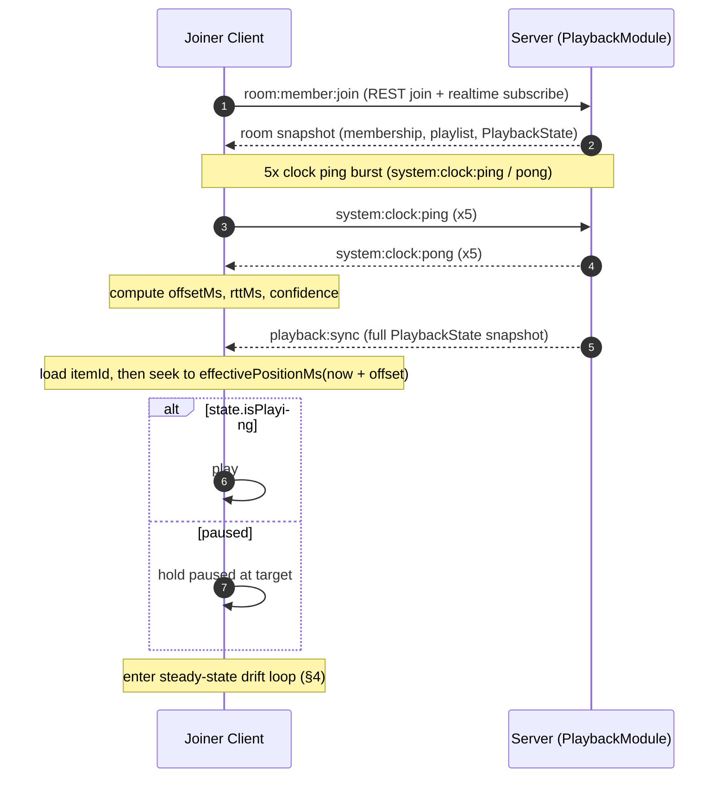

# Media Synchronization Architecture

> Server-authoritative playback synchronization for Cowatch rooms: the playback clock, client estimation of server time, drift measurement and correction, per-operation handling, late-joiner catch-up, buffering/stall recovery, and the explicit non-synced set.

**Status:** Draft — Planning (Phase 3, YouTube Sync)
**Owner agent:** Media Engineer
**Last updated: 2026-06-27**

---

## 0. Context & Sources

This document specifies *how* Cowatch keeps every member of a Room watching the same frame at the same wall-clock instant. It is the engineering elaboration of the canon **Sync Algorithm** and binds it to the **Permission Model** and the **Realtime Transport Abstraction**.

It is downstream of and MUST comply with the [Architecture Canon](../context/architecture.md). On any conflict, the canon wins. Specifically it elaborates:

- [Canon §7 — Sync Algorithm](../context/architecture.md#7-sync-algorithm) — source of truth for the clock + drift rules.
- [Canon §6 — Permission Model](../context/architecture.md#6-permission-model) — sync-authority modes.
- [Canon §5 — Realtime Transport Abstraction (ADR-004)](../context/architecture.md#5-realtime-transport-abstraction-adr-004) — envelope, transport interface, reconnection/resume.
- [Canon §10 — Cross-Cutting Non-Negotiables](../context/architecture.md#10-cross-cutting-non-negotiables) — error vocabulary, ULID correlation, UTC time.

Related ADRs:

- [ADR-007 — Server-authoritative playback sync](../adr/ADR-007-server-authoritative-playback-sync.md)
- [ADR-004 — Custom Realtime abstraction layer](../adr/ADR-004-realtime-abstraction.md)

Sibling docs:

- [`./PERMISSIONS.md`](./PERMISSIONS.md) — full role matrix, `SyncAuthority`, ownership-transfer detail (authority side of this doc).
- [`./ARCHITECTURE.md`](./ARCHITECTURE.md) — system overview and module map.
- [`./LIVEKIT.md`](./LIVEKIT.md) — voice/video transport (separate from media sync; future `LiveKitDataChannelTransport`).
- [`./DOMAIN.md`](./DOMAIN.md) — `PlaybackState`, `QueueItem`, `Room` domain definitions.

> **Conflict rule:** On any discrepancy between this doc and the canon, the canon wins. The numeric thresholds below (2 s heartbeat, 500 ms / 2 s drift bands, 30 s ownership grace) are copied verbatim from canon §7 and §6; they are not re-decided here.

Owning NestJS module: **`PlaybackModule`** (`apps/server/src/modules/playback/`). The server is authoritative for the `playback:*` namespace and is the only actor permitted to stamp `serverEpochMs`.

---

## 1. Design Principles

1. **One clock, server-owned.** The server holds the single `PlaybackState`. Clients are *renderers* that continuously steer their local YouTube player toward the server's computed target. Clients never trust each other and never trust their own player as the source of truth (ADR-007).
2. **Intent in, truth out.** A client emits an *intent* (`playback:play`, `playback:seek`, …). The server validates authority, mutates state, **re-stamps `serverEpochMs`**, and broadcasts the *truth* (`playback:sync`) to everyone — including the originator. The originator does **not** treat its own optimistic state as authoritative; it reconciles against the echoed sync.
3. **Continuous correction, not one-shot seeks.** Sync is a control loop running every 2 s, not a single jump. Small drift is glided away by nudging `playbackRate`; only large drift triggers a hard seek. This keeps playback visually smooth and avoids "rubber-banding."
4. **Authority is a permission, not a UI state.** Who may *mutate* playback is derived from the Room's `SyncAuthority` mode and the member's effective `RoomRole`. Enforcement is server-side; the client UI merely mirrors it (see [`./PERMISSIONS.md`](./PERMISSIONS.md)).
5. **Local comfort settings stay local.** Volume, captions, audio track, quality, and PiP are per-viewer and never enter `PlaybackState` (§9).
6. **Full-state, idempotent broadcasts.** Every sync carries the complete `PlaybackState`, never a delta. This makes reconnection, late-join, and out-of-order delivery trivially self-healing.

---

## 2. The Server-Authoritative Playback Clock

### 2.1 `PlaybackState` (canonical record)

`PlaybackState` is embedded on the Room's playback aggregate (see [canon §4 — embed when owned, bounded, read with parent](../context/architecture.md#4-data-modeling-conventions-mongodb--prisma)). The canonical TypeScript shape lives in `packages/types` and is the only definition any app may import.

```ts
// packages/types — source of truth; do not redeclare elsewhere (canon §3).

export type SyncAuthority = 'owner_only' | 'owner_moderators' | 'everyone';

export interface PlaybackState {
  itemId: string | null;   // QueueItem.id currently loaded; null = nothing playing (@db.ObjectId string)
  positionMs: number;      // authoritative position AS OF serverEpochMs
  isPlaying: boolean;      // true = clock advances; false = frozen
  rate: number;            // playback speed multiplier (e.g. 1, 1.25, 2)
  serverEpochMs: number;   // server wall-clock (UTC epoch ms) when this state was stamped
}
```

> **Anchor invariant.** `(positionMs, serverEpochMs)` form an *anchor pair*. `positionMs` is **only** valid as of `serverEpochMs`. The current position is always *derived*, never stored as a moving value. The server re-stamps the pair on every state change, on every transition between play/pause/seek/rate, and on every 2 s heartbeat tick.

### 2.2 Effective-position function

The single formula used identically on server and client (the `rate` factor and offset correction are mandatory):

```ts
// packages/shared (pure, no side effects) — imported by server AND clients.
export function effectivePositionMs(
  state: PlaybackState,
  nowServerMs: number,       // server time (already offset-corrected on clients)
  itemDurationMs?: number,   // optional: clamp to item end
): number {
  if (!state.isPlaying || state.itemId === null) return state.positionMs;
  const elapsed = (nowServerMs - state.serverEpochMs) * state.rate;
  const pos = state.positionMs + Math.max(0, elapsed);
  return itemDurationMs != null ? Math.min(pos, itemDurationMs) : pos;
}
```

- On the **server**, `nowServerMs = Date.now()` directly.
- On a **client**, `nowServerMs = Date.now() + clockOffsetMs` (offset measured per §3). This is the crux: a client must convert its own wall clock into *estimated server time* before evaluating the formula.

### 2.3 What `playback:sync` carries

Every heartbeat and every state change broadcasts the full state inside the standard envelope (canon §5). No partial/delta frames — full-state broadcasts are idempotent and self-healing, which makes reconnection and late-join trivial.

```ts
export interface PlaybackSyncEvent {           // envelope.type = "playback:sync"
  state: PlaybackState;
  // Advisory metadata (NOT authoritative for the clock):
  itemDurationMs?: number;   // for end-of-item handling / progress bars / clamp
  authority: SyncAuthority;  // current room mode (so clients render controls correctly)
  seq: number;               // monotonically increasing per-room sync sequence
}
```

`seq` lets a client discard out-of-order/stale syncs (only apply a sync whose `seq` is greater than the last applied). The envelope `type` is `playback:sync`; `ts` is the server stamp; `room` is the `roomId`; `v` is `1`.

---

## 3. Client Estimation of Server Time (Offset Handshake + RTT Compensation)

A client cannot evaluate `effectivePositionMs` without knowing how its local clock relates to the server's. We measure a **clock offset** using an NTP-style ping/pong over the realtime transport.

### 3.1 The handshake

Performed once on connect, then periodically (every **30 s**) and immediately after every reconnect and on tab re-foreground.

```ts
// Client → Server intent
export interface ClockPingPayload  { clientSentMs: number; }   // type: "system:clock:ping"
// Server → Client reply (ack-correlated via envelope.corr)
export interface ClockPongPayload  {
  clientSentMs: number;   // echoed back
  serverRecvMs: number;   // server time when ping arrived
  serverSentMs: number;   // server time when pong left
}                         // type: "system:clock:pong"
```

The client uses `RealtimeTransport.request()` (ack-correlated; canon §5) so each ping is paired with its pong by `corr`.

### 3.2 Offset & RTT math

Given a single round trip:

```
clientSentMs   = t0   (client clock)
serverRecvMs   = t1   (server clock)
serverSentMs   = t2   (server clock)
clientRecvMs   = t3   (client clock, measured on pong arrival)

rttMs    = (t3 - t0) - (t2 - t1)              // round trip minus server processing
offsetMs = ((t1 - t0) + (t2 - t3)) / 2        // estimated (serverClock - clientClock)
```

`offsetMs` is what we add to `Date.now()` to get estimated server time. `rttMs` is a quality signal. (This is the standard NTP four-timestamp estimator; it assumes a roughly symmetric path, which the lowest-RTT filtering below reinforces.)

### 3.3 Filtering for a stable offset

A single sample is noisy (variable queueing delay). We:

1. Send a **burst of 5 pings** on connect (200 ms apart).
2. Discard samples whose `rttMs` is above the **median + 1×IQR** (reject jittery outliers).
3. Take the offset from the sample with the **lowest `rttMs`** in the surviving set (lowest-latency sample is the least-skewed estimate — standard NTP heuristic).
4. Maintain a rolling EMA of the chosen offset across periodic single pings: `offset = 0.8·offset + 0.2·sample` to absorb slow clock drift without reacting to spikes.

```ts
export interface ClockSyncResult {
  offsetMs: number;           // serverClock - clientClock (add to Date.now())
  rttMs: number;              // best observed round trip
  confidence: 'high' | 'low'; // low when rttMs > 400ms or sample variance high
}
```

When `confidence === 'low'` (e.g. `rttMs > 400 ms`), the client **widens** its drift deadband (§4.4) to avoid over-correcting on a bad estimate, and schedules an early re-handshake.

> **Edge:** Mobile/background tabs throttle timers, corrupting offset. On `visibilitychange → visible` the client treats the offset as stale and re-runs the burst handshake **before** trusting any sync.

---

## 4. Drift Measurement & Correction

This is the per-client control loop. It runs on every `playback:sync` (so every ≤ 2 s) and on each local player `onStateChange` / `timeupdate` tick.

### 4.1 Computing drift

```ts
const nowServerMs = Date.now() + clock.offsetMs;
const targetMs    = effectivePositionMs(state, nowServerMs); // where we SHOULD be
const actualMs    = player.getCurrentTimeMs();               // where we ARE
const driftMs     = actualMs - targetMs;                     // + = ahead, - = behind
```

### 4.2 Correction bands (verbatim from canon §7)

| `|driftMs|`              | Action                                                              | Player API |
|--------------------------|---------------------------------------------------------------------|------------|
| `< 500 ms`               | **No action** — within target. (Steady-state goal.)                 | none |
| `500 ms ≤ |drift| < 2 s` | **Soft correction** — nudge `playbackRate` by ±5–10% to glide back. | `setPlaybackRate()` (temporary) |
| `|drift| ≥ 2 s`          | **Hard correction** — `seek` straight to target.                    | `seekTo(targetSeconds, true)` |

**Target:** steady-state drift **< 500 ms** across all clients (canon §7).

### 4.3 Soft-correction (rate-glide) detail

When `500 ms ≤ |drift| < 2 s`:

- If the client is **behind** (`drift < 0`): temporarily set local effective rate to `state.rate × 1.05–1.10` (catch up).
- If the client is **ahead** (`drift > 0`): temporarily set local effective rate to `state.rate × 0.90–0.95` (let target catch up).
- Choose the multiplier proportional to drift magnitude within the band (closer to 2 s → use the stronger ±10% end; closer to 500 ms → gentler ±5%).
- **Restore** to `state.rate` as soon as `|drift| < 200 ms` (hysteresis floor below the 500 ms entry threshold, so we don't oscillate at the boundary).

> Rate-glide is *local and cosmetic*: it changes only what this viewer sees/hears for a second or two and is **never** broadcast. It must not be confused with a `playback:rate` intent (an authoritative speed change for the whole room). The local glide ceiling is small (±10%) specifically so audio pitch artifacts stay imperceptible.

### 4.4 Adaptive deadband

The 500 ms entry threshold is the canon target, but a client with a poor clock estimate could *introduce* drift by correcting against a wrong target. The effective deadband is widened when confidence is low:

```
deadbandMs = 500 + (clock.confidence === 'low' ? min(rttMs, 500) : 0)
```

The hard-seek threshold (2 s) is **never** relaxed — a 2 s+ gap is always corrected regardless of confidence, because at that magnitude the user perceives desync.

### 4.5 Correction cadence & anti-thrash guards

- A **hard seek** sets a 1.5 s cooldown; no second hard seek within the cooldown (avoids seek storms while the player buffers the new position).
- After any seek, the client waits for the player's `playing` event before re-measuring drift (a seek transiently reports the old / `0` position).
- Soft corrections may apply every tick, but the rate multiplier is **recomputed, not stacked**.

---

## 5. Handling Each Synced Operation

All of the following are **server-mutating** and gated by sync authority (§7). The client sends an intent; the server validates, mutates `PlaybackState`, re-stamps `serverEpochMs`, increments `seq`, and broadcasts `playback:sync`.

| User action | Client intent event | Server mutation to `PlaybackState` |
|---|---|---|
| Play | `playback:play` | `isPlaying = true`; re-anchor `positionMs` to current effective pos; new `serverEpochMs` |
| Pause | `playback:pause` | `isPlaying = false`; freeze `positionMs` at current effective pos; new `serverEpochMs` |
| Seek (scrub) | `playback:seek` `{ positionMs }` | `positionMs = clamp(requested, 0, dur)`; new `serverEpochMs`; `isPlaying` unchanged |
| Rewind | `playback:seek` `{ positionMs = max(0, cur − stepMs) }` | same as seek (rewind is a relative seek; default step 10 s) |
| Fast-forward | `playback:seek` `{ positionMs = min(dur, cur + stepMs) }` | same as seek (FF is a relative seek; default step 10 s) |
| Playback speed | `playback:rate` `{ rate }` | re-anchor `positionMs` to effective pos, **then** `rate = requested`; new `serverEpochMs` |
| Item advance / autoplay | `playback:sync` (server-initiated) | `itemId = next`; `positionMs = 0`; `isPlaying = true` (or `false` if autoplay off) |
| Skip-vote outcome | `playback:sync` (server-initiated) | on quorum, behaves as item advance |

**Intent payload contracts** (`packages/types`):

```ts
export interface PlaybackPlayPayload  { /* no body */ }                 // type: "playback:play"
export interface PlaybackPausePayload { /* no body */ }                 // type: "playback:pause"
export interface PlaybackSeekPayload  { positionMs: number; }           // type: "playback:seek" — absolute
export interface PlaybackRatePayload  { rate: number; }                 // type: "playback:rate"
export interface PlaybackNudgePayload { deltaMs: number; }              // optional helper for rewind/FF → resolved to absolute seek server-side
```

Allowed `rate` values: `{0.25, 0.5, 0.75, 1, 1.25, 1.5, 1.75, 2}` (YouTube IFrame-supported set). The server rejects others with `system:error` code `INVALID_RATE`.

> **Re-anchoring on play/rate is mandatory.** Because position is derived as `positionMs + elapsed·rate`, you must collapse the moving clock into a fixed `positionMs` *before* changing `isPlaying` or `rate`, otherwise the old anchor would be extrapolated with the wrong multiplier. The server computes effective position, writes it to `positionMs`, then applies the new flag/rate, then re-stamps `serverEpochMs`.

### 5.1 Rewind / Fast-forward

Rewind and fast-forward are **not distinct sync primitives** — they are relative seeks resolved to an absolute `positionMs`. The client may send `playback:seek` with the computed absolute target (preferred, deterministic) or a `PlaybackNudgePayload` that the server resolves against the *authoritative* position (use when the client's local position may be stale). Both end as an absolute-seek broadcast. This keeps the synced set minimal and avoids ambiguity if two members nudge concurrently.

### 5.2 Boundary / clamping rules

| Condition | Server behavior |
|---|---|
| `seek` target `< 0` | clamp to `0` |
| `seek` target `> itemDurationMs` | clamp to `itemDurationMs`; if `isPlaying`, treat as end-of-item → autoplay advance |
| Effective position reaches `itemDurationMs` during play | server emits item-advance `playback:sync` (or pauses at end if autoplay off) |
| Intent references a stale `itemId` (item already advanced) | reject with `system:error` code `STALE_ITEM`; client reconciles from next sync |

### 5.3 Concurrency / last-writer-wins

Two authorized members may issue conflicting intents within the same heartbeat window. The server processes intents **serially per room** (single-writer per `roomId`, e.g. an in-process per-room async queue / actor) and applies last-writer-wins; each accepted intent yields exactly one broadcast with an incremented `seq`. Clients always converge on the highest `seq`. The originator's optimistic UI is reconciled by the echoed authoritative sync — there is no special path for the sender.

---

## 6. Late-Joiner Catch-Up

A member joining (or rejoining after a long disconnect) must land on the exact frame without a "scrub from zero" flash.



Sequence guarantees:

1. The join response **includes the current `PlaybackState`** (denormalized into the room snapshot) so there is no blank-player window.
2. The client runs the **clock handshake before applying the first sync** — otherwise the very first seek target is computed against an unknown offset.
3. The first correction for a late joiner is **always a hard seek** to target (we expect a large gap), then the normal soft-correction loop takes over.
4. If `isPlaying` is false, the joiner loads the item and seeks but stays paused, matching the room.

> Late joiners receive an immediate `playback:sync` snapshot (canon §7) regardless of the 2 s heartbeat phase.

---

## 7. Sync Authority (binding to the Permission Model)

Authority over playback mutation is governed by the room's `SyncAuthority` mode and the member's effective `RoomRole`, exactly as defined in [canon §6 — Permission Model](../context/architecture.md#6-permission-model) and elaborated in [`./PERMISSIONS.md` §4 — Mode → eligible roles for playback control](./PERMISSIONS.md).

| `SyncAuthority` mode | May emit mutating `playback:*` |
|---|---|
| `owner_only`        | `Owner` only |
| `owner_moderators`  | `Owner`, `Moderator` |
| `everyone`          | `Owner`, `Moderator`, `Member` (never `Guest`) |

Notes binding to canon §6 and `PERMISSIONS.md`:

- The mode decides who holds the `◐` on **playback control** in the canon §6 permission matrix. `Guest` **never** has playback control in any mode.
- **Playlist control** authority is configured *separately* (`playlistAuthority`, same enum semantics; see [`./PERMISSIONS.md`](./PERMISSIONS.md)), but uses the same `SyncAuthority` type. This doc governs only **playback** control.
- **Enforcement is server-side and mandatory.** Any mutating `playback:*` from a member whose effective role does not satisfy the room's mode is rejected with a realtime error using the canonical error vocabulary (canon §10), correlated by `corr` to the offending intent:

```jsonc
// system:error envelope payload — shape matches the canon error envelope (canon §10)
// and PERMISSIONS.md §4. corr ties back to the rejected intent (canon §5).
{
  "code": "FORBIDDEN_SYNC",
  "message": "You are not allowed to control playback in this room.",
  "details": { "requiredMode": "owner_moderators", "yourRole": "Member" }
}
```

The client must treat its optimistic UI as invalid and re-render from the next authoritative `playback:sync`.

- **Ownership-transfer interaction:** when ownership transfers (owner disconnect, 30 s grace; algorithm in [canon §6](../context/architecture.md#6-permission-model) / [`./PERMISSIONS.md`](./PERMISSIONS.md)), the permission matrix is re-derived for all members, so the *set of authorized playback controllers can change mid-session*. The playback clock itself is unaffected — `PlaybackState` is independent of who owns the room — but the new authority set takes effect immediately on the next intent validation.

---

## 8. Buffering & Stall Handling

The hard problem: one viewer's network stall must not silently desync them, but also must not drag the whole room backwards. Policy: **the room clock keeps moving; the stalled client catches up.**

### 8.1 Local stall (one viewer buffers)

1. The YouTube player fires `BUFFERING`. The client **does not** emit any `playback:*` intent — a local stall is not a room event.
2. The room clock continues advancing on the server (`isPlaying` stays true). When the viewer's buffer recovers, drift will be large and negative (behind).
3. On `PLAYING` resume, the client measures drift. It will almost always be `≥ 2 s` → **hard seek** to the now-current target, then resume the soft loop. The viewer "skips ahead" to rejoin the room rather than playing stale frames.
4. **Buffer-aware soft option:** if the recovered drift is in the soft band (short stall), use rate-glide instead of a jarring seek.

### 8.2 Authority-side stall (a controller buffers)

A controller's local stall still emits **no** intent (per §8.1), so it cannot stall the room. The only way the room pauses is an explicit `playback:pause` intent. This is deliberate: synchronized rooms prioritize the group over any single buffering member.

### 8.3 Optional "wait for everyone" (room setting, off by default)

For small/intimate rooms, an opt-in `pauseOnAnyBuffer` room setting may be offered: if **any** member buffers for `> 3 s`, the server auto-issues a `playback:pause`, then auto-`playback:play` when all members report `ready`. This requires clients to report buffer state:

```ts
export interface PlaybackReadinessPayload {   // type: "playback:client:ready"
  itemId: string;
  bufferedAheadMs: number;  // how much is buffered past current position
  state: 'ready' | 'buffering' | 'stalled';
}
```

This readiness signal is **advisory** — it never sets the authoritative clock directly; the server decides whether to issue pause/play. Default room behavior is **clock-keeps-moving** (§8.1). Whether to ship `pauseOnAnyBuffer` in Phase 3 vs. defer is an open question (§12).

### 8.4 Pre-buffering on item advance

On autoplay / item-advance, the server may broadcast the *next* `itemId` a short lead (e.g. 5 s before current item end) via an advisory `playback:item:preload` event so clients can pre-load the IFrame and reduce the gap at transition. Preload is advisory and does not change `PlaybackState` until the actual advance broadcast.

---

## 9. Explicitly NOT Synchronized

Per [canon §7](../context/architecture.md#7-sync-algorithm), the following are **per-client local** and must **never** appear in `PlaybackState`, in any `playback:*` payload, or in the realtime stream:

| Setting | Why local | Owned by |
|---|---|---|
| **Volume** (incl. mute) | Personal comfort; varies by environment/device | Client player + local store |
| **Subtitle / caption selection** (on/off + language) | Personal accessibility/language preference | Client player + local store |
| **Audio track** selection | Personal language preference | Client player + local store |
| **Video quality / resolution** | Bandwidth-dependent per device; the soft-correction loop already absorbs differing buffer behavior | Client player (auto/ABR or manual) |
| **Picture-in-picture** | Window/UX state (web + Electron shell) | Client / Electron shell |

These are persisted in a client-side Zustand store (e.g. `playerPreferences.store.ts`) and, where appropriate, synced to the user's *profile preferences* via REST — but that is a **user-preference** concern, entirely separate from room playback sync. A controller changing their own volume or captions produces **zero** realtime traffic.

---

## 10. End-to-End Sequence: Play / Seek Broadcast

```mermaid
sequenceDiagram
    autonumber
    actor U as Authorized Member (Owner/Mod/Member per mode)
    participant C as Controller Client
    participant S as Server (PlaybackModule, room writer)
    participant O as Other Clients (n)
    participant G as Guest / Unauthorized Client

    Note over C,S: Clock offset already established via system:clock:ping/pong (§3)

    U->>C: clicks Play (or scrubs to position P)
    C->>S: playback:play  (or playback:seek {positionMs: P})  [envelope.corr = X]

    alt sender satisfies room SyncAuthority
        Note over S: re-anchor positionMs = effectivePos(now)
        Note over S: apply isPlaying=true (or positionMs=clamp(P))
        Note over S: serverEpochMs = Date.now(); seq++
        S-->>C: system:ack {corr: X}
        par broadcast authoritative truth
            S-->>C: playback:sync (full PlaybackState, seq)
            S-->>O: playback:sync (full PlaybackState, seq)
            S-->>G: playback:sync (full PlaybackState, seq)
        end
        Note over C,O: each client computes target = effectivePositionMs(now + offset)
        Note over C,O: |drift| ≥ 2s → hard seek; 0.5–2s → rate-glide; <0.5s → no-op
    else sender NOT authorized
        S-->>C: system:error {code: FORBIDDEN_SYNC, corr: X, details:{requiredMode, yourRole}}
        Note over C: revert optimistic UI; await next playback:sync
    end

    Note over S,O: every 2s (and on every change) S re-emits playback:sync heartbeat
```

Key properties illustrated:

- The **originator is corrected by the same broadcast** as everyone else — no special-casing, so the originator can't diverge.
- The **ack** (`system:ack`, corr `X`) confirms acceptance; the **error** path (`FORBIDDEN_SYNC`, corr `X`) enforces authority *before* any state change.
- Guests and other clients are handled identically on the receive side; authority only gates the *send* side.

---

## 11. Acceptance Criteria

These are the testable conditions for Phase 3 sign-off (coverage target 90%, canon §10).

| # | Criterion |
|---|---|
| AC-1 | With 3+ clients on a healthy network, steady-state inter-client drift stays **< 500 ms** during continuous playback (canon §7 target). |
| AC-2 | A `playback:play`/`pause`/`seek`/`rate` intent from an authorized member mutates `PlaybackState`, re-stamps `serverEpochMs`, increments `seq`, and is broadcast to **all** members including the originator. |
| AC-3 | The same intent from a member who does **not** satisfy the room `SyncAuthority` is rejected with `system:error { code: FORBIDDEN_SYNC, details:{requiredMode, yourRole} }`; `PlaybackState` is unchanged. Guests are rejected in every mode. |
| AC-4 | Clock offset is established via a 5-ping burst before the first sync is applied; the lowest-RTT sample is selected; `confidence` downgrades when `rttMs > 400 ms`. |
| AC-5 | Drift in `[500 ms, 2 s)` triggers rate-glide (±5–10%, restored under 200 ms hysteresis, never broadcast); drift `≥ 2 s` triggers a hard seek with a 1.5 s cooldown. |
| AC-6 | A late joiner receives an immediate full `PlaybackState` snapshot, hard-seeks to the live frame, and matches `isPlaying` — no scrub-from-zero flash. |
| AC-7 | A single client's local `BUFFERING` emits **no** intent; the room clock keeps moving; on resume the client catches up via hard seek (or rate-glide for short stalls). |
| AC-8 | None of volume, subtitles, audio track, quality, or PiP ever appear in `PlaybackState` or any `playback:*` payload; changing them produces zero realtime traffic. |
| AC-9 | Concurrent intents from two authorized members are serialized per room (last-writer-wins); all clients converge on the highest `seq`. |
| AC-10 | An invalid `rate` (outside the allowed set) is rejected with `INVALID_RATE`; a stale `itemId` intent is rejected with `STALE_ITEM`. |

---

## 12. Open Questions

| # | Question | Recommendation |
|---|---|---|
| 1 | Ship `pauseOnAnyBuffer` (§8.3) in Phase 3 or defer? | **Defer** to a post-MVP polish task. Default clock-keeps-moving (§8.1) is simpler and matches large-room expectations; readiness signaling adds protocol surface. Spec the payload now, gate the feature behind a room setting later. |
| 2 | Heartbeat cost at scale — 2 s full-state broadcast per room × members. | Keep 2 s per canon, but evaluate **suppressing heartbeats while `isPlaying === false`** (paused rooms need only change-driven syncs) and coalescing per-room fan-out. Revisit under load test in Phase 11. |
| 3 | Should the server cap soft rate-glide centrally, or trust clients? | **Trust clients** for the local ±10% glide (it's cosmetic and unbroadcast). Only the authoritative `playback:rate` is server-validated against the allowed set. |
| 4 | YouTube IFrame `getCurrentTime()` granularity (~250 ms) vs. a 500 ms deadband. | Acceptable: the deadband (500 ms) is ~2× the API jitter. If real-world data shows boundary oscillation, raise the soft-band hysteresis floor (§4.3) from 200 ms. Validate in Phase 3 QA. |
| 5 | Clock re-handshake cadence (30 s) for high-churn mobile. | Tentatively 30 s + on `visibilitychange`. Tune with telemetry on offset variance; expose as a transport config constant, not hard-coded in `PlaybackModule`. |

> Amended 2026-06-27: Open Questions §12 resolved per Chief Architect rulings (adopting each item's recommendation; see [project-state/open-questions.md](../project-state/open-questions.md)).

**Resolutions (2026-06-27):**

- Resolution (2026-06-27): Q1 `pauseOnAnyBuffer` — **Deferred to Post-MVP**: spec the payload now, gate behind a room setting later (default clock-keeps-moving ships in Phase 3).
- Resolution (2026-06-27): Q2 heartbeat cost at scale — **Resolved** (default fixed; tuned Phase 11): keep the 2 s heartbeat; evaluate suppressing heartbeats while `isPlaying === false` and coalescing per-room fan-out under the Phase 11 load test.
- Resolution (2026-06-27): Q3 central rate-glide cap — **Resolved**: trust clients for the local ±10% cosmetic glide; only the authoritative `playback:rate` is server-validated against the allowed set.
- Resolution (2026-06-27): Q4 YouTube granularity vs 500 ms deadband — **Resolved**: acceptable (deadband ≈ 2× API jitter); raise soft-band hysteresis above 200 ms only if Phase 3 QA shows boundary oscillation.
- Resolution (2026-06-27): Q5 clock re-handshake cadence — **Resolved**: 30 s + on `visibilitychange`, exposed as a transport config constant; tune from offset-variance telemetry.

---

## 13. Cross-References

- [Architecture Canon](../context/architecture.md) — §5 Realtime Transport, §6 Permission Model, §7 Sync Algorithm, §10 Non-Negotiables.
- [ADR-007 — Server-authoritative playback sync](../adr/ADR-007-server-authoritative-playback-sync.md)
- [ADR-004 — Custom Realtime abstraction layer](../adr/ADR-004-realtime-abstraction.md)
- Sibling docs: [`./PERMISSIONS.md`](./PERMISSIONS.md) (authority + ownership transfer), [`./ARCHITECTURE.md`](./ARCHITECTURE.md) (system overview), [`./DOMAIN.md`](./DOMAIN.md) (entity definitions), [`./LIVEKIT.md`](./LIVEKIT.md) (voice/video transport).
