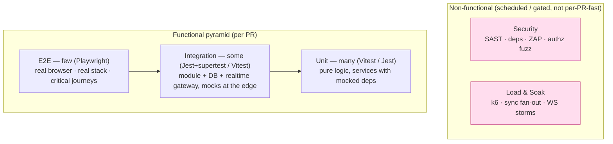
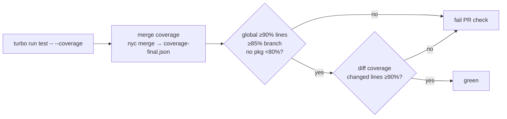
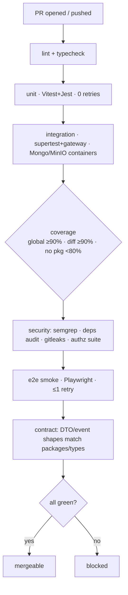

# Cowatch Testing Strategy

> The single quality plan for Cowatch: the test pyramid, every layer (unit · integration · e2e · load · security · regression) with chosen tooling, the 90% coverage contract and how it is gated, realtime/sync-specific test strategies (simulated clients, drift assertions, clock control), test data & fixtures, the flaky-test policy, and CI quality gates.

**Status:** Draft — Planning (Phase 11, Testing)
**Owner agent:** QA Engineer
**Last updated: 2026-06-27**

> This document is **subordinate to the canon**. On any conflict, [`../context/architecture.md`](../context/architecture.md) wins. Every type name, event name, route shape, and ADR id below matches the canon verbatim. Per **R5**, every feature must have a specification, implementation tasks, **tests**, documentation, and acceptance criteria *before coding*. This document defines what "tests" means for Cowatch and is the contract every per-feature test plan refines.

**See also:** [Architecture Canon](../context/architecture.md) · [ARCHITECTURE.md](./ARCHITECTURE.md) · [SYNC.md](./SYNC.md) · [AUTH.md](./AUTH.md) · [PERMISSIONS.md](./PERMISSIONS.md) · [DEPLOYMENT.md §7 CI/CD](./DEPLOYMENT.md#7-cicd-pipeline) · [Realtime abstraction](../context/architecture.md#5-realtime-transport-abstraction-adr-004) · [Sync algorithm](../context/architecture.md#7-sync-algorithm)

---

## 1. Goals, Scope & Binding Constraints

### 1.1 Goals

1. **Catch regressions before merge**, not in production. Every PR is provably as correct as `main` plus its intended delta.
2. **Make correctness cheap to assert.** The bulk of confidence comes from fast, deterministic, isolated tests; slow/brittle tests are minimized and quarantined.
3. **Guard the non-negotiables.** The canon's hard rules — server-authoritative sync (<500 ms drift), the permission matrix, refresh-token rotation + reuse detection, the standard error envelope, the realtime envelope shape — each have explicit, named tests that fail loudly if violated.
4. **Be recoverable (R2).** Tests double as executable specification: a fresh agent can read a layer's tests and reconstruct intended behavior.

### 1.2 Binding constraints inherited from the canon

| # | Constraint | Source |
|---|---|---|
| T1 | **90% coverage target**, gated in CI. | [canon §10](../context/architecture.md#10-cross-cutting-non-negotiables) |
| T2 | Steady-state **sync drift < 500 ms**; correction bands 500 ms / 2 s; 2 s heartbeat. | [canon §7](../context/architecture.md#7-sync-algorithm) |
| T3 | The **permission matrix** and **sync-authority modes** (`owner_only`/`owner_moderators`/`everyone`) are enforced server-side; unauthorized mutations return `FORBIDDEN_SYNC`. | [canon §6](../context/architecture.md#6-permission-model) |
| T4 | **Token model**: 15-min access, 30-day rotating refresh, reuse detection revokes the family. | [canon §8](../context/architecture.md#8-auth--token-model-adr-008) |
| T5 | **Standard error envelope** and **realtime envelope `v:1`** shapes are stable contracts. | [canon §5](../context/architecture.md#5-realtime-transport-abstraction-adr-004), [§10](../context/architecture.md#10-cross-cutting-non-negotiables) |
| T6 | Tooling is fixed: **Vitest** (web/packages), **Jest + supertest** (NestJS server), **Playwright** (e2e), **k6** (load). | this doc §3 |
| T7 | Everything runs in **Docker** with parity dev→CI→prod; tests run against ephemeral `mongo` + `minio` service containers. | [ADR-010](../context/architecture.md#2-canonical-architecture-decisions-one-line--adr-id), [DEPLOYMENT.md §7.2](./DEPLOYMENT.md#72-stage-detail) |

> **Conflict rule:** numeric thresholds (drift bands, token lifetimes, coverage %) are copied from the canon and are not re-decided here. If a number below disagrees with the canon, the canon is correct and this doc is a bug.

---

## 2. The Test Pyramid

Cowatch follows a classic pyramid: **many** fast unit tests, **fewer** integration tests, **few** end-to-end tests, plus orthogonal **non-functional** layers (load, security) that run on a different cadence.



### 2.1 Target distribution & budgets

| Layer | Share of test count | Runs where | Wall-clock budget (CI) | Determinism |
|---|---|---|---|---|
| **Unit** | ~70% | every PR, pre-commit (changed) | < 60 s whole suite | Must be 100% deterministic; no I/O, no real timers, no network. |
| **Integration** | ~22% | every PR | < 5 min | Deterministic; real DB/object-store in Docker, all external SaaS faked. |
| **E2E** | ~6% | every PR (smoke subset) + staging (full) | < 8 min PR / < 15 min staging | Tolerant retries (≤1) on network setup only; logic must be stable. |
| **Load** | n/a (scenarios) | nightly + pre-release + on perf-sensitive PRs (label) | per-scenario SLO | Asserts SLOs, not exact numbers. |
| **Security** | n/a (scans/suites) | every PR (fast) + nightly (deep) | < 3 min PR / nightly deep | Deterministic SAST/deps; DAST nightly against staging. |

> **Anti-hourglass rule:** if a behavior *can* be proven at a lower layer, it MUST be — an e2e test that only verifies a pure function is a code-review reject. E2E exists for cross-system journeys, not for branch coverage.

---

## 3. Tooling Matrix (fixed)

| Concern | Tool | Where | Notes |
|---|---|---|---|
| Unit/integration runner — web app, all `packages/*` | **Vitest** | `apps/web`, `packages/{ui,auth,database,realtime,social,sdk,shared,types}` | Native ESM/Vite parity with the app build; `vitest --coverage` (V8 provider). |
| Unit/integration runner — server | **Jest** (ts-jest/SWC) | `apps/server` | NestJS-idiomatic; `@nestjs/testing` `Test.createTestingModule`. |
| HTTP integration against Nest | **supertest** | `apps/server` | Drives the real Nest `INestApplication` (Fastify/Nest platform — **never** raw Express per ADR-002). |
| WS/gateway integration | **`ws`/`socket`-level client + in-process gateway** | `apps/server`, `packages/realtime` | A test `RealtimeTransport` and a raw frame client both speak the canon envelope. |
| Component/DOM testing | **Vitest + @testing-library/react + jsdom** | `apps/web`, `packages/ui` | User-centric queries; no shallow rendering. |
| E2E (browser) | **Playwright** | `tests/e2e` (root) | Chromium primary; WebKit/Firefox for cross-engine smoke. Multi-context = multiple users. |
| E2E (Electron) | **Playwright `_electron`** | `tests/e2e/desktop` | Drives the packaged shell: PiP, IPC, auto-update stub. |
| Load / soak | **k6** (+ `xk6-websockets`) | `tests/load` | REST + WS scenarios; thresholds = pass/fail SLOs. |
| Security — SAST | **`eslint-plugin-security`, `semgrep`** | CI | Ruleset for injection, unsafe regex, secrets. |
| Security — deps/SBOM | **`pnpm audit`, Trivy, `osv-scanner`** | CI | Aligns with [DEPLOYMENT.md §7.2 scan stage](./DEPLOYMENT.md#72-stage-detail). |
| Security — DAST | **OWASP ZAP** (baseline) | nightly vs staging | Auth, CSRF, headers, CORS allowlist. |
| Contract (types/DTO) | **Vitest + `zod`/`class-validator` reflection** | `packages/types`, `packages/sdk` | Asserts DTOs and event payloads match canon shapes. |
| Mock data | **`@faker-js/faker`** + typed factories | `packages/testing` (test-only) | Deterministic via fixed seed (§8). |
| Time control | **`vi.useFakeTimers` / `jest.useFakeTimers` + an injectable `Clock`** | all layers | Canonical for sync tests (§7). |
| Coverage merge/report | **V8 coverage + `nyc`/`istanbul` merge** | CI | Per-package + monorepo-merged report (§6). |

> Test-only helpers (factories, the fake realtime transport, the controllable clock, Mongo/MinIO test harness) live in a non-published internal package **`packages/testing`**. It is `private: true`, never shipped, and imported only by `*.spec.ts`/`*.test.ts`. This keeps fixtures single-sourced (mirrors the canon's "types single-sourced" rule).

---

## 4. Layer 1 — Unit Tests

**Definition.** A unit test exercises one module (a function, a service class, a hook, a store, a util) with **all collaborators replaced by test doubles**. No network, no database, no real timers, no filesystem. Fully deterministic and parallel-safe.

**Scope by area:**

| Area | Unit under test | Doubles |
|---|---|---|
| Server services | `RoomService`, `PlaybackService`, `MembershipService`, `AuthService`, `NotificationsService`, … | Prisma client (mock), `RealtimeTransport` (fake), `Clock` (fake), `StorageService` (mock). |
| Sync core | `playback-clock.util.ts` — `effectiveMs` derivation, drift band classification, rate-glide math | none (pure); fed an injected `now`. |
| Permission core | The permission resolver that maps `(RoomRole, SyncAuthority, room flags)` → allowed actions | none (pure). |
| Realtime | envelope (de)serialization, ULID id gen, backoff-with-jitter schedule, resume cursor logic | fake socket. |
| Web | Zustand stores (`*.store.ts`), hooks (`useCamelCase.ts`), pure UI logic, formatters | mocked SDK, mocked transport. |
| Packages | `packages/shared` (ids/errors/config), `packages/sdk` request builders, `packages/auth` token helpers | network mocked. |

**Canon-critical unit suites (must exist, named):**

- `playback-clock.spec.ts` — given `(positionMs, serverEpochMs, isPlaying, rate)` and a controlled `now`, asserts `effectiveMs` exactly (T2). Drift classifier returns `none | glide | seek` for the boundary values 0, 499, 500, 1999, 2000, 2001 ms.
- `permission-resolver.spec.ts` — exhaustively asserts the [canon §6 matrix](../context/architecture.md#6-permission-model): every `(role × permission)` cell, plus `◐` cells resolved against each `SyncAuthority` mode and `chatLock`. This is a **table-driven** test generated from the canon matrix so drift between code and canon fails the build.
- `refresh-rotation.spec.ts` — rotation issues a new pair and invalidates the prior; presenting a consumed token marks the family for revocation (T4 logic, no DB).
- `error-envelope.spec.ts` — the exception filter maps known errors to the exact `{ error: { code, message, details, correlationId, timestamp } }` shape with SCREAMING_SNAKE codes (T5).

**Example (illustrative — drift classifier):**

```ts
// apps/server/src/modules/playback/playback-clock.spec.ts
import { describe, it, expect } from 'vitest';
import { classifyDrift, effectiveMs } from './playback-clock.util';

describe('effectiveMs', () => {
  it('advances while playing at the given rate', () => {
    const state = { positionMs: 10_000, serverEpochMs: 1_000, isPlaying: true, rate: 2, itemId: 'q1' };
    // now = serverEpochMs + 3000ms → +6000ms of media at rate 2
    expect(effectiveMs(state, /* now */ 4_000)).toBe(16_000);
  });
  it('is frozen while paused', () => {
    const state = { positionMs: 10_000, serverEpochMs: 1_000, isPlaying: false, rate: 1, itemId: 'q1' };
    expect(effectiveMs(state, 9_999)).toBe(10_000);
  });
});

describe('classifyDrift (canon §7 bands)', () => {
  it.each([
    [0, 'none'], [499, 'none'], [500, 'glide'],
    [1_999, 'glide'], [2_000, 'seek'], [2_001, 'seek'],
  ])('|drift|=%dms → %s', (drift, expected) => {
    expect(classifyDrift(drift)).toBe(expected);
  });
});
```

**Rules:** no `sleep`/real `setTimeout`; one logical assertion-subject per test; AAA layout; names describe behavior not implementation; every bug fix lands a failing-then-passing unit test (regression, §10).

---

## 5. Layer 2 — Integration Tests

**Definition.** Multiple real in-process collaborators wired together — typically a **NestJS module + its real Prisma client against an ephemeral MongoDB**, or a **realtime gateway + a real WS client** — with only *external SaaS* faked (Google OAuth, YouTube Data API, LiveKit, email). They assert that the wiring, validation, persistence, indexing assumptions, and event emission actually work.

### 5.1 Infrastructure

- **MongoDB:** ephemeral container per CI job (`mongo:7` replica-set, required for Prisma transactions), seeded fresh per file via a truncate-and-factory reset. Mirrors the service-container approach in [DEPLOYMENT.md §7.2](./DEPLOYMENT.md#72-stage-detail). Local devs use `mongodb-memory-server` (replica-set mode) for speed; CI uses the real image for parity.
- **MinIO:** ephemeral container; buckets bootstrapped by the same `docker/minio/` policy used in dev. Storage integration tests assert signed-URL upload/read and least-privilege bucket policy.
- **External SaaS:** never hit. Google OAuth, YouTube, LiveKit, SMTP are replaced by in-process fakes/`msw` (Mock Service Worker) handlers that return canon-shaped responses. A nightly **contract canary** (§9.3) hits the real sandboxes to detect upstream drift.

### 5.2 HTTP integration (supertest)

Drives the real `INestApplication` (built from the production module graph minus external adapters) through HTTP, asserting status, the **success/error envelope**, headers (`x-correlation-id` echo, Helmet, CORS), validation rejections, authz guards, and DB side effects.

```ts
// apps/server/test/rooms.e2e-spec.ts  (Nest integration; jest + supertest)
it('POST /api/v1/rooms creates a room and persists owner membership', async () => {
  const res = await request(app.getHttpServer())
    .post('/api/v1/rooms')
    .set('Authorization', `Bearer ${ownerAccessToken}`)
    .send({ name: 'Movie Night', visibility: 'public' })
    .expect(201);

  expect(res.body).toMatchObject({ name: 'Movie Night', ownerId: owner.id });
  const membership = await prisma.membership.findFirst({ where: { roomId: res.body.id, userId: owner.id } });
  expect(membership?.role).toBe('Owner');           // RoomRole.Owner persisted
});

it('returns the canon error envelope for an unknown room', async () => {
  const res = await request(app.getHttpServer())
    .get('/api/v1/rooms/0000000000aaaaaa0000bbbb')
    .set('Authorization', `Bearer ${ownerAccessToken}`)
    .expect(404);
  expect(res.body.error).toMatchObject({ code: 'ROOM_NOT_FOUND' });
  expect(res.body.error.correlationId).toMatch(/^[0-9A-HJKMNP-TV-Z]{26}$/); // ULID
});
```

**Canon-critical HTTP integration suites:**

- **Auth lifecycle** (T4): register → login → `POST /auth/refresh` rotates the pair, sets httpOnly/Secure/SameSite=Strict cookie scoped to `/api/v1/auth`; **replaying a consumed refresh token revokes the whole session family** (assert subsequent refresh fails for all device sessions). TOTP enroll/verify/disable + recovery codes. Session list/revoke endpoints.
- **Permission enforcement** (T3): for each privileged route (kick/ban/mute, settings change, ownership transfer, playlist mutate) assert that each `RoomRole` either succeeds or gets `403 FORBIDDEN`/`FORBIDDEN_*` exactly per the matrix.
- **Validation**: every DTO rejects malformed input with `422`/`400` and field-level `details` (class-validator).
- **Discovery**: `GET /rooms?...` returns denormalized `currentVideoTitle`/`viewerCount` and respects `visibility`/`isActive` index assumptions.

### 5.3 Realtime gateway integration

A real WS client connects to the in-process NestJS WS gateway and exchanges canon envelopes (`v:1`, ULID `id`, `type`, `room`, `corr`, `data`). These tests verify the **server side** of the realtime contract — see §7 for the simulated-client sync harness.

- `playback:play|pause|seek|rate` from an authority-qualified member mutates `PlaybackState`, re-stamps `serverEpochMs`, and broadcasts `playback:sync` to all room subscribers; from an unqualified member returns `system:error` with `code: 'FORBIDDEN_SYNC'` and matching `corr` (T3).
- `room:member:join` updates membership + denormalized `viewerCount` and notifies subscribers; late joiners receive an immediate `playback:sync` snapshot.
- `request()`/ack correlation: a `request` envelope receives a response with the same `corr` within the timeout; `system:ack`/`system:error` paths covered.
- Resume handshake: after a forced disconnect, re-subscribe replays buffered events by `lastEnvelopeId`, or falls back to a fresh `playback:sync` + room snapshot when the buffer has rolled.

---

## 6. The 90% Coverage Contract

### 6.1 What "90%" means

- **Metric:** **line + branch** coverage, collected with V8 (Vitest) and istanbul (Jest), **merged across the monorepo** into one report. The gate is on the **merged** number so a package can't be carried by another.
- **Target (canon §10): ≥ 90%** lines and **≥ 85%** branches global; **no single tracked package below 80%** lines (prevents a 99% package masking a 55% one).
- **Counts toward coverage:** unit + integration. **E2E does not count** toward the line number (it's journey assurance, measured by scenario pass/fail, not %).

### 6.2 What is excluded (with justification)

Coverage exclusions are explicit, reviewed, and listed in each package's config — never ad-hoc `/* istanbul ignore */` without a comment citing the reason:

| Excluded | Why |
|---|---|
| Generated code (`packages/database` generated Prisma client, `*.d.ts`) | not authored. |
| `*.module.ts` pure DI wiring, `main.ts` bootstrap | structural, asserted by integration boot. |
| `*.dto.ts`/`*.schema.ts` declarations with no logic | shapes asserted by contract tests, not lines. |
| Type-only files in `packages/types` | no runtime. |
| Migration/seed scripts | run in integration, not unit-measured. |
| Electron `main` process native bridges that require a real OS shell | covered by Electron e2e. |

> Excluding a file does **not** exclude its behavior — that behavior must be proven at another layer. Reviewers reject exclusions used to dodge writing a test.

### 6.3 How it is gated



- **Global gate:** the merged report must meet §6.1 thresholds. Implemented via Vitest `coverage.thresholds` + Jest `coverageThreshold` per package, and a top-level merge check in CI.
- **Diff/patch gate:** changed lines in a PR must be **≥ 90%** covered (so coverage can never *decrease*; new code carries its own weight). This is the day-to-day enforcer — the global number moves slowly, the diff gate bites immediately.
- **Ratchet:** the global threshold may be raised but never lowered without an ADR + history entry (R3). Lowering it is an architectural decision.
- This gate is the **`test` stage** already wired in [DEPLOYMENT.md §7.1](./DEPLOYMENT.md#71-pipeline-stages) ("test · 90% gate").

---

## 7. Realtime & Sync Testing (the hard part)

Sync is the product's defining feature and the most failure-prone to test because it couples **wall-clock time, network timing, and multiple clients**. The strategy: **eliminate real time and real network** from logic tests, and reserve real timing for a small set of load/e2e checks.

### 7.1 Principles

1. **Inject the clock; never read wall time.** All time-dependent code (the playback clock, heartbeat scheduler, backoff, token expiry, timeouts/grace windows) reads from an injected `Clock` interface, not `Date.now()`. Tests provide a `ControllableClock` they advance manually.
2. **Inject the transport.** Apps depend on `RealtimeTransport` (canon §5). Tests use an in-memory `FakeTransport` that delivers envelopes synchronously (or with scripted latency) — no sockets, no flakiness.
3. **Assert the invariant, not the wall-clock.** The canon's promise is "**steady-state drift < 500 ms**." Tests assert the *control-loop converges* under modeled conditions, deterministically.

```ts
// packages/testing/clock.ts — single source for controllable time
export interface Clock { now(): number; }
export class ControllableClock implements Clock {
  constructor(private t = 0) {}
  now() { return this.t; }
  advance(ms: number) { this.t += ms; }
  set(ms: number) { this.t = ms; }
}
```

### 7.2 Simulated multi-client harness

A `SimulatedRoom` spins up *N* in-memory `SimClient`s sharing one `FakeTransport` bus and one authoritative server `PlaybackService` driven by a `ControllableClock`. Each `SimClient` models a YouTube player as a number (its local position) plus a configurable **error model**: clock-offset, buffering stalls, and a steering response to `playback:sync`.

```ts
// tests harness (illustrative)
const clock = new ControllableClock();
const room = new SimulatedRoom({ clock, authority: 'owner_moderators' });
const owner = room.addClient({ role: 'Owner', clockOffsetMs: +120 });
const guest = room.addClient({ role: 'Guest', clockOffsetMs: -340, stalls: [{ atMs: 4000, durationMs: 800 }] });

owner.emit('playback:play', { positionMs: 0 });
room.runFor(30_000, { tickMs: 250 }); // advance clock + deliver heartbeats deterministically

// Invariant: every client converges within the canon target
for (const c of room.clients) {
  expect(c.maxSteadyStateDriftMs({ afterMs: 5_000 })).toBeLessThan(500); // T2
}
```

### 7.3 Sync scenarios (must-cover matrix)

| Scenario | Setup | Assertion |
|---|---|---|
| Steady-state convergence | 5 clients, mixed clock offsets ±400 ms | steady-state |drift| < 500 ms for all (T2). |
| Glide band | inject 800 ms drift on one client | client uses **rate adjustment** (no hard seek), converges. |
| Hard-seek band | inject 3 s drift (post-stall) | client issues a **seek** to target, then holds < 500 ms. |
| Pause freezes clock | owner pauses at t=10 s | `effectiveMs` constant across wall-clock advance for all. |
| Late joiner | client joins at t=20 s | receives immediate `playback:sync`, lands within target on first correction. |
| Authority denied | Guest emits `playback:seek` in `owner_only` | server replies `system:error code FORBIDDEN_SYNC`, **state unchanged** (T3). |
| Authority allowed | Member emits `playback:play` in `everyone` | accepted, `serverEpochMs` re-stamped, broadcast to all. |
| Rate change | authority sets `rate=1.5` | `effectiveMs` advances at 1.5× for all clients; converges. |
| Clock-offset correction | client with +500 ms skew | ping/pong RTT offset applied; effective target matches server. |
| Reconnect + resume | client drops 5 s, reconnects | resume replays by `lastEnvelopeId` **or** fresh snapshot; ends < 500 ms. |
| Skip-vote outcome | quorum votes skip | autoplay advances item; all clients load new `itemId` and resync. |
| NOT-synced isolation | client changes volume/quality/captions | **no** `playback:*` emitted; no other client affected. |

### 7.4 Realtime transport tests (`packages/realtime`)

- **Envelope contract:** round-trip serialize/deserialize preserves `v:1`, ULID `id`, `type`, `room`, `corr`; rejects malformed/`v≠1` frames.
- **Backoff:** the reconnection schedule is exponential with jitter, base 500 ms, cap 15 s — asserted by advancing the `ControllableClock` and recording attempt timestamps (deterministic, no real waiting).
- **Re-subscribe:** after reconnect, all prior topic subscriptions are re-established.
- **Resume cursor:** missed-event replay by `lastEnvelopeId`; fallback path when the server buffer has rolled.
- **`request()` timeout:** unanswered request rejects after `timeoutMs`; answered request resolves on matching `corr`.
- **Presence:** `setPresence`/`onPresence` propagate `online|idle|dnd|offline` + activity.

### 7.5 Real-timing e2e (small, in Playwright)

A *single* end-to-end sync check runs in real browsers with two contexts (two users) playing a short real/stubbed YouTube embed; it asserts the two players stay within a **relaxed e2e tolerance (≤ 1 s, accounting for real player jitter)** after a play and a seek. This validates the *integration with the real IFrame player*, which the deterministic harness deliberately abstracts away. Tight numeric proof stays in the unit/harness layer.

---

## 8. Test Data, Fixtures & Factories

### 8.1 Principles

- **Factories over fixtures.** Test objects come from typed builder functions (`buildUser`, `buildRoom`, `buildMembership`, `buildQueueItem`, `buildPlaybackState`, `buildMessage`) in `packages/testing`, not from static JSON. Builders accept partial overrides and fill canon-valid defaults (string ObjectIds, ULID message ids, UTC timestamps, denormalized snapshot fields).
- **Deterministic randomness.** `@faker-js/faker` is seeded (`faker.seed(1337)`) per test file so runs are reproducible; CI prints the seed on failure.
- **Canon-shaped ids.** Entity ids are 24-hex ObjectId strings; realtime/message/correlation ids are ULIDs. A shared `objectId()`/`ulid()` helper guarantees valid shapes so id-format assertions are meaningful.
- **Isolation.** Each integration test file gets a clean database state (truncate collections + reseed) inside a per-file setup; tests within a file must not depend on order. Parallel jobs use **separate Mongo databases** (DB-per-worker), not shared collections.

```ts
// packages/testing/factories/room.factory.ts (illustrative)
export const buildRoom = (over: Partial<Room> = {}): Room => ({
  id: objectId(),
  name: faker.lorem.words(2),
  visibility: 'public',
  isActive: true,
  ownerId: objectId(),
  ownerDisplayName: faker.internet.username(),      // denormalized (canon §4) — source: User
  currentVideoTitle: null,                          // denormalized for discovery
  viewerCount: 0,                                   // denormalized for discovery
  createdAt: new Date('2026-06-27T00:00:00.000Z'),
  updatedAt: new Date('2026-06-27T00:00:00.000Z'),
  ...over,
});
```

### 8.2 Seeded scenarios

A small set of named, composed scenarios (built from factories) cover recurring stage setups so tests read intent, not plumbing:

| Scenario | Contents |
|---|---|
| `seedRoomWithRoles()` | one room with an Owner, two Moderators, three Members, one Guest — for permission-matrix tests. |
| `seedActivePlayback()` | room + 3-item playlist + a playing `PlaybackState` at a known anchor — for sync tests. |
| `seedFriendGraph()` | users with accepted friendships, a pending `FriendRequest`, and a `Block` — for social tests. |
| `seedSessionFamily()` | a user with two device sessions + a valid/consumed refresh pair — for auth-rotation tests. |

### 8.3 External-provider stubs

- **YouTube:** canned video metadata + a fake IFrame player API surface; no quota usage.
- **Google OAuth:** a fake authorization-code exchange returning a canon-shaped profile.
- **LiveKit:** token minting is verified against the real SDK signer; the SFU itself is stubbed (a `FakeRoom`); real-SFU coverage lives in voice e2e/load.
- **SMTP:** an in-memory mailbox asserts verification/reset/2FA emails (subject, single-use token).

---

## 9. Layers 3–6 — E2E, Load, Security, Regression

### 9.1 E2E (Playwright)

**Scope:** a small set of **critical user journeys** through the *real* stack (web app → NestJS → Mongo/MinIO/LiveKit-stub), in a real browser. Multi-user journeys use multiple browser **contexts**.

Canonical journeys (the PR smoke subset is a tagged slice of these; staging runs all):

1. **Auth:** register → verify email → login → enroll TOTP → logout → login-with-TOTP.
2. **Room lifecycle:** create room → invite-link join (second context) → role shows correctly.
3. **Sync:** owner plays/pauses/seeks a video; the second user's player follows (relaxed tolerance, §7.5).
4. **Permissions:** Moderator kicks a Member; Member loses access; Guest blocked from a gated action.
5. **Chat:** send message, reaction, typing indicator visible to the other context; mention raises a `notification:new`.
6. **Social:** send/accept friend request; presence flips to `online`; DM round-trips.
7. **Ownership transfer:** owner disconnects → ownership moves to oldest Moderator; `room.ownership_transfer` notification fires.
8. **Discovery:** new public room appears in the list with `currentVideoTitle` + `viewerCount`.

The PR/staging e2e set is the same one referenced in [DEPLOYMENT.md §7.2](./DEPLOYMENT.md#72-stage-detail) ("auth flow, create room, playback sync, chat"). **Electron e2e** (`_electron`) additionally covers PiP, IPC bridge, push-notification surface, and the auto-update flow against a stub feed (Phase 10).

### 9.2 Load & Soak (k6)

Validates the canon's performance promises under concurrency. Thresholds are pass/fail SLOs (k6 `thresholds`), not vanity numbers.

| Scenario | Models | SLO (threshold) |
|---|---|---|
| **Room fan-out** | 1 authority + N viewers; authority emits play/seek; measure broadcast latency | p95 server→client `playback:sync` fan-out < 250 ms at N=200/room. |
| **WS connection storm** | ramp 5k concurrent WS connections | < 1% connect failures; heartbeat continues. |
| **Sync accuracy under load** | many rooms, measured drift sample | p95 cross-client drift < 500 ms (T2) holds under target load. |
| **REST hot paths** | discovery list, room read, auth refresh | p95 < 200 ms; error rate < 0.5%. |
| **Soak** | steady realistic load for 1–2 h | no memory growth/FD leak; latency flat (catches leaks the short tests miss). |
| **Rate-limit correctness** | burst auth/write endpoints | limiter returns `429` per policy; legit traffic unaffected. |

Load runs **nightly** + **pre-release** + on PRs labeled `perf`. Regressions vs the stored baseline (>10% p95) fail the gate.

### 9.3 Security

Layered, aligned with [canon §10 security baseline](../context/architecture.md#10-cross-cutting-non-negotiables):

- **SAST (per-PR, fast):** `semgrep` + `eslint-plugin-security` — injection, unsafe regex, eval, hardcoded secrets, missing authz decorators on controllers.
- **Dependency/SBOM (per-PR):** `pnpm audit` + `osv-scanner`; image scan via Trivy + `syft` SBOM + `cosign` (shared with [DEPLOYMENT.md §7.2](./DEPLOYMENT.md#72-stage-detail)); no unwaived HIGH/CRITICAL.
- **Authz suite (per-PR, integration):** every privileged route/event is hit by an under-privileged principal and **must** be denied — this is the negative-space of the permission matrix (T3) and is mandatory, not optional.
- **Auth security suite:** refresh reuse → family revocation (T4); access-token expiry honored at 15 min; expired/forged/`alg:none` JWT rejected (RS256 only); CSRF token required on cookie-auth mutations; rate-limit lockout on auth brute force.
- **DAST (nightly vs staging):** OWASP ZAP baseline — security headers (Helmet), CORS allowlist, cookie flags (httpOnly/Secure/SameSite=Strict), TLS, common injection probes.
- **Storage:** signed-URL-only uploads; least-privilege MinIO bucket policy asserted in integration.
- **Secrets:** `gitleaks` in CI blocks committed secrets; `.env.example` is the only committed config contract.

### 9.4 Regression

- **Bug-to-test rule (hard):** no bug fix merges without a test that **fails on the old code and passes on the fix**, linked to the issue id. These accumulate as a living regression net at the lowest layer that reproduces the bug.
- **Canon-guard tests:** the permission matrix, drift bands, error/realtime envelopes, and token rules are encoded as table-driven tests derived from the canon (§4–§6). If a code change diverges from the canon, these fail — making the canon executable.
- **Snapshot discipline:** snapshots are allowed only for **stable serialized contracts** (error envelope, event payload shapes), never for rendered DOM trees or anything churny. Every snapshot update is reviewed as a deliberate contract change.
- **Visual regression (web/ui):** Playwright screenshot diffs for a few key surfaces (room shell, player controls, auth) on the smoke set; masked for dynamic regions.

---

## 10. Flaky-Test Policy

Flakiness is treated as a **defect in the test (or the code's nondeterminism)**, never as noise to retry away.

```mermaid
flowchart LR
  F[Test fails intermittently] --> Q[Auto-detected: CI re-run history / fails-on-retry]
  Q --> QU[Quarantine within 24h<br/>tag @flaky · open tracking issue]
  QU --> RC{Root cause}
  RC -->|test nondeterminism| FIX1[Fix: inject clock/seed,<br/>await real condition, remove sleep]
  RC -->|product nondeterminism| FIX2[Fix the code<br/>(real race/bug)]
  FIX1 & FIX2 --> V[Pass 50× consecutive locally + CI]
  V --> UN[Un-quarantine within 7 days]
```

- **Zero tolerance for `sleep`-based waiting.** No `setTimeout`/`page.waitForTimeout`-to-stabilize. Wait on **conditions** (Playwright auto-wait/`expect.poll`, explicit event awaits, the `ControllableClock`).
- **Quarantine, don't ignore.** A flaky test is tagged `@flaky`, excluded from the **blocking** gate, but still runs (non-blocking) and **must** have a tracking issue. Quarantine has a **7-day SLA**; an un-fixed `@flaky` after 7 days fails the build until fixed or deleted with justification.
- **Retries are diagnostic, not a fix.** CI allows **at most 1 retry** for e2e (to absorb genuine infra blips), **0 retries** for unit/integration. A test that needs retries to pass is by definition quarantined and investigated. Retry counts are surfaced as a metric; rising retries are a release-quality signal.
- **Determinism budget:** seeded faker, injected clock, fixed timezone (`TZ=UTC`), DB-per-worker isolation, no shared global state, no order dependence (Vitest/Jest run in randomized order in CI to surface coupling).

---

## 11. CI Quality Gates

These refine the **`test`** stage of the pipeline in [DEPLOYMENT.md §7.1](./DEPLOYMENT.md#71-pipeline-stages); ordering, branch policy, and image/scan stages are owned by that document — this section owns the **test gates** themselves.

### 11.1 Per-PR gates (all blocking, must be green to merge)



| Gate | Tool | Pass condition |
|---|---|---|
| lint / typecheck | eslint+prettier, `tsc --build` | zero errors (DEPLOYMENT.md §7.2). |
| unit | Vitest / Jest | all pass, **0 retries**, < 60 s. |
| integration | Jest+supertest, gateway client, Mongo+MinIO containers | all pass. |
| **coverage** | merged V8/istanbul | global ≥90% lines / ≥85% branch · **diff ≥90%** · no package <80% (T1, §6). |
| security (fast) | semgrep, `pnpm audit`/osv, gitleaks, authz integration suite | no findings above threshold; every authz-negative test passes (T3). |
| e2e smoke | Playwright (tagged subset) | all pass, ≤1 retry. |
| contract | Vitest reflection over `packages/types` | DTO/event payloads match canon shapes (T5). |
| flaky audit | retry-metric check | no un-quarantined flaky; no `@flaky` past 7-day SLA. |

### 11.2 Post-merge / scheduled gates

| Cadence | Suite | Gate |
|---|---|---|
| `main` merge | full e2e (all journeys) vs **staging**, full integration | blocks promotion to production (manual approval after green — DEPLOYMENT.md §7.3). |
| nightly | k6 load + soak, OWASP ZAP DAST, provider contract canary (§8.3), cross-browser e2e (WebKit/Firefox), Electron e2e | regressions open a P1 issue; load >10% p95 regression fails. |
| pre-release tag | full load + security + e2e + Electron installer e2e | release blocked until green. |

### 11.3 Coverage & quality reporting

- Merged coverage uploaded as a CI artifact + PR comment (delta vs base highlighted); the **diff gate** is the day-to-day enforcer.
- Test result trends (duration, retry rate, flake count) tracked over time; a rising retry/flake rate is a release-health signal reviewed at each phase gate.
- All gates run **inside Docker** against ephemeral service containers (T7), guaranteeing dev↔CI↔prod parity.

---

## 12. Ownership, Phasing & Process

- **Per-feature (R5):** every feature's `specs/<feature>.md` declares its acceptance criteria; its `tasks/<feature>.md` includes explicit **test tasks** authored *before* implementation; tests land in the same PR as the feature. A feature is "done" only when its layer tests exist, the diff-coverage gate passes, and docs/history/context/project-state are updated (canon §10 process discipline).
- **Phase 11 (Testing)** in the [development phases](../context/architecture.md#10-cross-cutting-non-negotiables) is not "write all tests at the end" — it is the **hardening pass**: fill coverage gaps, build the load/soak suites, run the full security sweep, and ratchet thresholds. Per-feature tests are written *during* phases 1–10.
- **Roles:** the **QA Engineer** owns this strategy, the harness (`packages/testing`), the e2e/load/security suites, and the gates. **Each domain engineer** owns the unit + integration tests for their module (Backend → server modules, Realtime → `packages/realtime` + sync harness, Media → sync scenarios, Voice → LiveKit suites, Frontend → web/component, Electron → desktop e2e). The **DevOps Engineer** owns CI wiring of the gates (DEPLOYMENT.md §7).

---

## 13. Open Questions

| # | Question | Recommendation |
|---|---|---|
| Q1 | Should the diff-coverage gate apply to test-only `packages/testing` changes? | **No** — exclude the test harness package from the diff gate to avoid circular pressure; cover it via use. |
| Q2 | Real LiveKit SFU in CI vs stub? | **Stub in CI** (token signing verified against the real SDK); run a **nightly** smoke against a real ephemeral LiveKit container to catch SFU-level regressions. |
| Q3 | `mongodb-memory-server` (fast, local) vs real `mongo:7` container everywhere? | **Real container in CI** for parity; memory-server allowed **locally** only, with a CI assertion that both produce identical results on the auth/rooms suites. |
| Q4 | E2E sync tolerance — fixed 1 s or adaptive to measured player jitter? | Start **fixed ≤1 s** (e2e only); keep tight <500 ms proof in the deterministic harness. Revisit if the real IFrame player proves noisier. |
| Q5 | Mutation testing (Stryker) to validate test *quality* beyond coverage %? | **Defer to Phase 11** on the canon-critical cores (sync, permissions, auth) only — coverage % proves execution, not assertion strength; a targeted mutation pass guards the highest-risk logic without monorepo-wide cost. |
| Q6 | Visual-regression hosting (Playwright local snapshots vs a service like Chromatic)? | **Local Playwright snapshots** for the smoke set initially (no external dependency); reconsider a hosted diff service if review churn grows. |

---

*This document is the testing contract for Cowatch. It complies with the [Architecture Canon](../context/architecture.md); on any conflict the canon wins, and a divergence here is a bug to be fixed via ADR + history entry (R3).*
