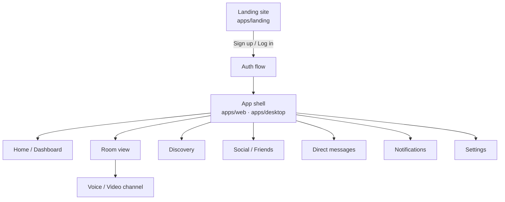
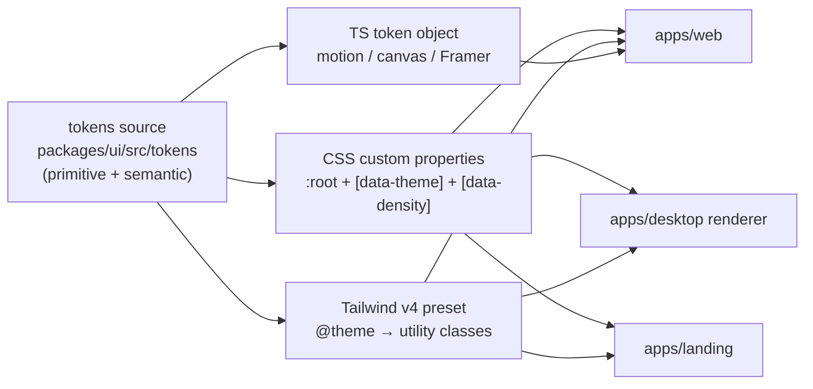

# Cowatch — UI/UX Architecture & Design System

> One-line purpose: Define the brand, design language, tokens, component library, key screens, and interaction/accessibility/motion standards for the Cowatch web + desktop clients — the visual and experiential contract every frontend feature builds on.

**Status:** Draft — Phase 0 (Architecture) planning artifact
**Owner agent:** Frontend Engineer / Design
**Last updated: 2026-06-27**

**Canon & cross-links**

- Architecture canon (single source of truth): [../context/architecture.md](../context/architecture.md)
- Product requirements (personas, scope, acceptance): [./PRD.md](./PRD.md)
- System architecture (apps, packages, data flows): [./ARCHITECTURE.md](./ARCHITECTURE.md)
- Domain model (entities this UI renders): [./DOMAIN.md](./DOMAIN.md)
- Permission model (role-gated UI): [../context/architecture.md#6-permission-model](../context/architecture.md#6-permission-model)
- Sync algorithm (player UX): [../context/architecture.md#7-sync-algorithm](../context/architecture.md#7-sync-algorithm)
- Auth/token model (session UX): [../context/architecture.md#8-auth--token-model-adr-008](../context/architecture.md#8-auth--token-model-adr-008)
- Voice (LiveKit room UX): [./LIVEKIT.md](./LIVEKIT.md)

> This document is **subordinate to the canon**. On any conflict, [`../context/architecture.md`](../context/architecture.md) wins. All entity names (`Room`, `Membership`, `QueueItem`, `PlaybackState`, `RoomRole`, `Presence`, …), event names (`playback:sync`, `room:member:join`, …), and route shapes referenced here match the canon verbatim. Changes that introduce or alter an architectural decision (a new dependency, a new app boundary, a token-platform shift) require an ADR + history entry + context update + repomix update (R3/R4).

**Scope.** This document governs `apps/web`, the Electron renderer in `apps/desktop` (which wraps the web app — ADR-006), the marketing `apps/landing`, and the shared component package `packages/ui`. It does **not** redefine business logic, API contracts, or realtime semantics — those are owned by the canon and the engineering docs above. Per **R1**, this is a planning artifact: it specifies *what the UI is* and *how it should feel*, not its implementation.

---

## Table of Contents

1. [Brand Identity](#1-brand-identity)
2. [Design Principles](#2-design-principles)
3. [Design Tokens](#3-design-tokens)
4. [Component Library Plan (`packages/ui`)](#4-component-library-plan-packagesui)
5. [Information Architecture & Navigation](#5-information-architecture--navigation)
6. [Key Screens & Wireframes](#6-key-screens--wireframes)
7. [Responsive & Adaptive Strategy](#7-responsive--adaptive-strategy)
8. [Accessibility (WCAG 2.2 AA)](#8-accessibility-wcag-22-aa)
9. [Motion & Animation Guidelines (Framer Motion)](#9-motion--animation-guidelines-framer-motion)
10. [State, Loading & Realtime UX Patterns](#10-state-loading--realtime-ux-patterns)
11. [Theming & Token Distribution](#11-theming--token-distribution)
12. [Open Questions](#12-open-questions)

---

## 1. Brand Identity

### 1.1 Name & one-line positioning

**Cowatch** — *"Watch together. Stay together."*

Cowatch is a Discord-shaped social watch-party platform: a persistent home where friends gather in rooms to watch synchronized media, talk over voice/video, and stay connected through a real social graph (per [PRD §1.1](./PRD.md)). The name is a literal compound (*co-* + *watch*); always written **Cowatch** — one word, capital C, no hyphen, no camel-case ("CoWatch" is wrong).

### 1.2 Brand pillars

| Pillar | What it means | How the UI expresses it |
|---|---|---|
| **Together-first** | The default unit is the group, not the individual. Presence, "who's here," and shared state are always visible. | Member rails, live viewer counts, presence dots, "friends inside" badges on every room card. |
| **In-sync** | Everyone sees the same frame within < 500 ms ([Sync §7](../context/architecture.md#7-sync-algorithm)). The product's magic is shared time. | A calm, always-present sync indicator; drift correction is invisible by default; "you're in sync" is the resting state. |
| **Effortless re-entry** | Coming back to your people takes one click ("The Regular" persona, [PRD §3](./PRD.md)). | Persistent left nav of rooms/friends; one-tap rejoin; sessions remembered. |
| **Calm, not loud** | A watch-party tool must recede during playback. The chrome dims; the media leads. | Theater/immersive modes, auto-dimming chrome, restrained color until something needs attention. |
| **Crafted** | Details signal trust for a SaaS that holds friendships and payments. | Consistent radii, optical alignment, real empty states, motion with intent. |

### 1.3 Voice & tone

Cowatch's voice is **warm, concise, and a little playful** — a friend who's good at hosting, never a corporate announcer and never trying too hard.

| Trait | Do | Don't |
|---|---|---|
| **Warm** | "Nobody's here yet — invite a friend?" | "0 active participants." |
| **Concise** | "Link copied." | "Your invite link has been successfully copied to your clipboard." |
| **Plain** | "You can't change playback right now." | "FORBIDDEN_SYNC: insufficient authority scope." |
| **Playful (sparingly)** | Empty queue: "The screen's blank. Drop in a video." | Jokes in error states that block a user. |
| **Honest under failure** | "Reconnecting…" with a live state, not a frozen spinner. | Silent failure or a spinner that never resolves. |

**Microcopy rules.** Sentence case everywhere (buttons, headings, menus) — never Title Case or ALL CAPS except the wordmark and small overline labels. Numbers are humanized in UI ("2.3K watching"), exact in tooltips. Errors map a canon `code` ([Canon §10](../context/architecture.md#10-cross-cutting-non-negotiables)) to a human sentence via a central `errorCopy` map in `packages/ui`; the raw `code` + `correlationId` are shown only in a collapsible "details" affordance for support.

### 1.4 Mood — Discord-inspired but distinct

Cowatch shares Discord's **dark-first, left-rail, room-centric, presence-saturated** spatial model because the audience already lives there. It is deliberately distinct on three axes:

1. **Media-led, not chat-led.** Discord centers the message stream; Cowatch centers the **player**, with chat as a docked companion that can collapse to nothing for theater mode. The center of gravity is the shared screen.
2. **A warm "cinema dusk" palette, not Discord blurple-on-slate.** Our neutrals lean a touch warmer (very slightly violet-tinted charcoal) and our accent is an **electric indigo→violet**, paired with a **warm amber** secondary for "live / on air" signals — evoking a dim room with a glowing screen rather than a productivity tool.
3. **Softer geometry & more air.** Larger corner radii on surfaces (cards, modals, the player frame), generous spacing, and an editorial type scale give a more premium, less utilitarian feel than Discord's tight 4px-grid density.

**Logo / wordmark (spec, not asset).** Wordmark "Cowatch" in the display family (Clash Display / fallback), with the "o"s optically tuned. App mark: two overlapping rounded play-triangles forming a subtle "eye"/"co" — used as the favicon, Electron tray/dock icon, and avatar fallback monogram background. Asset production is owned by Design tooling, not this doc; the mark must render legibly at 16px (favicon) through 1024px (Electron icon, [ADR-006](../context/architecture.md#2-canonical-architecture-decisions-one-line--adr-id)).

---

## 2. Design Principles

Cowatch's craft methodology is an explicit, **internally enforced** standard — the spirit of high-bar product design teams (Linear/Vercel/Stripe-grade restraint and rigor), expressed as testable rules so reviewers can hold the line. Each principle has a one-line litmus test used in design review.

| # | Principle | Litmus test (asked in review) |
|---|---|---|
| **P1** | **The media leads.** Chrome serves the shared screen and recedes during playback. | "When a video is playing, what is the brightest, largest, most central element?" → the player. |
| **P2** | **One primary action per surface.** Every screen has exactly one obvious next step. | "Squint — is there a single clear primary button?" |
| **P3** | **Show shared state, always.** Presence, sync status, and "who can do what" are never hidden. | "Can a user tell who else is here and whether they're in sync without clicking?" |
| **P4** | **Permission is visible, not surprising.** Disabled-by-role controls are present, dimmed, and explain themselves; we never hard-fail a click. | "Does the UI prevent the action *before* the server has to reject it (`FORBIDDEN_SYNC`)?" |
| **P5** | **Optimistic, then truthful.** Local actions feel instant; server truth reconciles silently; conflicts surface honestly. | "Does it feel instant, and does it self-correct without lying?" |
| **P6** | **Calm by default, loud on intent.** Color and motion are spent only where attention is earned (mentions, going live, errors). | "Is anything moving or colored that doesn't *need* attention right now?" |
| **P7** | **Density is a setting, not a default.** Comfortable spacing out of the box; a compact mode for power users. | "Does it breathe at default, and stay legible compact?" |
| **P8** | **Keyboard- and screen-reader-complete.** Every pointer action has a keyboard path; every state has an accessible name. | "Can I do this entire flow with the keyboard and hear what happens?" |
| **P9** | **Consistent geometry.** Radii, spacing, elevation, and motion come only from tokens — no magic numbers. | "Is every value traceable to a token?" |
| **P10** | **Real empty/error/loading states.** No blank screens, no dead spinners; every async surface has all four states designed (empty, loading, error, success). | "Did we design the empty and error states, not just the happy path?" |

**Methodology notes.**

- **Token-first.** Components consume semantic tokens (§3, §11), never raw hex/px. This is what makes theming, density, and dark/light swaps free.
- **Composition over configuration.** Build small primitives (Radix-backed) and compose; avoid mega-components with dozens of props.
- **Optical over mathematical.** Tokens give the rhythm; designers may nudge for optical balance (icon centering, text baselines) — documented when they do (P9 allows token-derived adjustments, not arbitrary ones).
- **Accessibility is a P0 acceptance gate**, not a pass at the end (§8).

---

## 3. Design Tokens

Tokens are the single source of visual truth, defined in `packages/ui/src/tokens/` and emitted to three consumers (Tailwind theme, CSS custom properties, and a TS object for Framer Motion / canvas) — see [§11](#11-theming--token-distribution). Tailwind v4's `@theme` maps these CSS variables to utility classes.

Two layers:

- **Primitive tokens** — raw scales (`--indigo-500`, `--space-4`). Never used directly by components.
- **Semantic tokens** — role-named aliases (`--color-bg-surface`, `--color-accent`, `--color-text-muted`). Components consume **only** these. Theme swaps re-point semantic → primitive.

### 3.1 Color — dark-first

Cowatch is **dark-first** (the default, designed-first theme); a light theme is a first-class alternate that re-points the same semantic tokens. All foreground/background pairings below are chosen to meet **WCAG AA** (≥ 4.5:1 body text, ≥ 3:1 large text & UI boundaries — verified in §8.2).

**Primitive neutral ramp (warm charcoal, dark theme base).** Subtly violet-tinted to differentiate from Discord's cool slate.

| Token | Hex (approx) | Typical role |
|---|---|---|
| `--neutral-0` | `#FFFFFF` | pure white (rare; on-accent text, light theme bg) |
| `--neutral-50` | `#F6F6F9` | light theme surface |
| `--neutral-200` | `#C9C9D4` | light theme borders / dark theme high text |
| `--neutral-400` | `#8B8B9A` | muted text |
| `--neutral-500` | `#6E6E80` | disabled / placeholder |
| `--neutral-700` | `#34343F` | dark borders / dividers |
| `--neutral-800` | `#23232B` | elevated surface |
| `--neutral-850` | `#1B1B22` | surface (cards, panels) |
| `--neutral-900` | `#141419` | app background |
| `--neutral-950` | `#0C0C10` | deepest (theater, player letterbox) |

**Primitive accent ramps.**

| Ramp | 300 | 500 (base) | 600 | 700 | Use |
|---|---|---|---|---|---|
| **Indigo (primary)** | `#A5B4FC` | `#6366F1` | `#5145E5` | `#4338CA` | primary actions, focus, brand |
| **Violet (primary→)** | `#C4B5FD` | `#8B5CF6` | `#7C3AED` | `#6D28D9` | gradient pair, "co" highlight |
| **Amber (secondary / live)** | `#FCD34D` | `#F59E0B` | `#D97706` | `#B45309` | "on air", live, voice-active, hosting |

**Status ramps (semantic intent).**

| Intent | Base | On-color text | Use |
|---|---|---|---|
| **Success** | `#22C55E` (emerald-500) | `--neutral-950` | confirmations, "in sync" |
| **Warning** | `#F59E0B` (amber-500) | `--neutral-950` | drift-correcting, weak password, NSFW |
| **Danger** | `#EF4444` (red-500) | `--neutral-0` | destructive, kick/ban, hard errors |
| **Info** | `#38BDF8` (sky-400) | `--neutral-950` | neutral notices, hints |

**Presence colors** (map `Presence.status` from [Realtime §5](../context/architecture.md#5-realtime-transport-abstraction-adr-004)):

| `Presence.status` | Token | Color |
|---|---|---|
| `online` | `--presence-online` | `#22C55E` (emerald) |
| `idle` | `--presence-idle` | `#F59E0B` (amber) |
| `dnd` | `--presence-dnd` | `#EF4444` (red) |
| `offline` | `--presence-offline` | `--neutral-500` (gray, hollow ring) |

> Presence is never communicated by **color alone** (P8 / WCAG 1.4.1): each status also has a distinct dot shape/fill (filled, filled, filled-with-bar, hollow ring) and an accessible label (`aria-label="Online"`).

**Semantic color tokens (the only ones components use).** Shown with their dark-theme source; the light theme re-points each.

| Semantic token | Dark source | Role |
|---|---|---|
| `--color-bg-app` | `--neutral-900` | app canvas |
| `--color-bg-surface` | `--neutral-850` | cards, panels, rails |
| `--color-bg-elevated` | `--neutral-800` | popovers, menus, dialogs |
| `--color-bg-theater` | `--neutral-950` | immersive/player letterbox |
| `--color-bg-inset` | `--neutral-950` | inputs, wells, code |
| `--color-border` | `--neutral-700` | dividers, default borders |
| `--color-border-strong` | `--neutral-500` | input borders, focus-adjacent |
| `--color-text` | `#ECECF1` | primary text |
| `--color-text-muted` | `--neutral-400` | secondary text |
| `--color-text-disabled` | `--neutral-500` | disabled |
| `--color-accent` | `--indigo-500` | primary action / brand |
| `--color-accent-hover` | `--indigo-600` | hover |
| `--color-accent-contrast` | `--neutral-0` | text/icon on accent |
| `--color-live` | `--amber-500` | on-air / voice-active / hosting |
| `--color-focus-ring` | `--indigo-300` | focus indicator (≥ 3:1 on all bgs) |
| `--color-success` / `-warning` / `-danger` / `-info` | status bases | intents |
| `--color-overlay` | `rgba(10,10,16,.72)` | modal/scrim backdrop |

### 3.2 Spacing — 4px base scale

Base unit **4px**. Named steps avoid magic numbers (P9).

| Token | px | rem | Typical use |
|---|---|---|---|
| `--space-0` | 0 | 0 | reset |
| `--space-1` | 4 | 0.25 | icon-to-label gap |
| `--space-2` | 8 | 0.5 | tight inner padding |
| `--space-3` | 12 | 0.75 | compact control padding |
| `--space-4` | 16 | 1 | **default** component padding |
| `--space-5` | 20 | 1.25 | comfortable padding |
| `--space-6` | 24 | 1.5 | card padding, section gap |
| `--space-8` | 32 | 2 | block separation |
| `--space-10` | 40 | 2.5 | major sections |
| `--space-12` | 48 | 3 | page gutters |
| `--space-16` | 64 | 4 | hero / landing rhythm |

**Density modes** (P7): `comfortable` (default) uses the scale as-is; `compact` (power-user / desktop dense lists) shifts component vertical padding down one step (e.g. list rows `--space-3` → `--space-2`). Density is a `data-density` attribute on `:root`, applied by a CSS layer — components don't branch.

### 3.3 Typography

**Families.**

| Role | Family | Fallback stack |
|---|---|---|
| **Display** (wordmark, hero, big numbers) | Clash Display | `"Clash Display", "Inter", system-ui, sans-serif` |
| **UI / body** | Inter (variable) | `Inter, system-ui, -apple-system, "Segoe UI", Roboto, sans-serif` |
| **Mono** (codes, ids, timestamps, `correlationId`) | JetBrains Mono | `"JetBrains Mono", ui-monospace, "SF Mono", Menlo, monospace` |

Fonts are **self-hosted** (woff2, `font-display: swap`) for privacy and offline Electron use; no third-party CDN (security baseline, [Canon §10](../context/architecture.md#10-cross-cutting-non-negotiables)).

**Type scale** (1.20 minor-third-ish, tuned). Tokens `--text-{name}`.

| Token | size / line-height | weight | Use |
|---|---|---|---|
| `--text-display` | 48 / 52 | 600 | landing hero |
| `--text-h1` | 32 / 40 | 600 | page titles |
| `--text-h2` | 24 / 32 | 600 | section headers |
| `--text-h3` | 20 / 28 | 600 | card titles, modal titles |
| `--text-lg` | 18 / 28 | 500 | emphasized body |
| `--text-base` | 16 / 24 | 400 | **body default** |
| `--text-sm` | 14 / 20 | 400 | secondary, chat, lists |
| `--text-xs` | 12 / 16 | 500 | labels, badges, metadata |
| `--text-overline` | 11 / 16 | 600, tracking +0.06em, uppercase | section overlines (the only uppercase) |

> Body text never renders below **14px** in interactive UI (chat is `--text-sm`/14); `--text-xs` is reserved for non-essential metadata and badges. Line length capped at ~70ch for prose (landing, docs, DMs).

### 3.4 Radius

Softer geometry than Discord (mood §1.4). Tokens `--radius-{name}`.

| Token | px | Use |
|---|---|---|
| `--radius-xs` | 4 | tags, inline chips |
| `--radius-sm` | 8 | inputs, small buttons |
| `--radius-md` | 12 | **default** buttons, menu items |
| `--radius-lg` | 16 | cards, panels, popovers |
| `--radius-xl` | 20 | modals, the player frame, room cards |
| `--radius-2xl` | 28 | hero media, landing surfaces |
| `--radius-full` | 9999 | avatars, pills, presence dots, FABs |

### 3.5 Elevation (shadow + surface)

Dark UIs convey depth primarily via **surface lightness step + border**, with shadow as a secondary cue (shadows read weakly on dark). Each elevation pairs a surface token with an optional shadow.

| Token | Surface | Shadow | Use |
|---|---|---|---|
| `--elevation-0` | `--color-bg-app` | none | base canvas |
| `--elevation-1` | `--color-bg-surface` | `0 1px 2px rgba(0,0,0,.24)` | cards, rails |
| `--elevation-2` | `--color-bg-elevated` | `0 4px 12px rgba(0,0,0,.32)` | dropdowns, popovers, toasts |
| `--elevation-3` | `--color-bg-elevated` | `0 16px 40px rgba(0,0,0,.44)` | dialogs, command palette |
| `--elevation-overlay` | `--color-overlay` scrim | backdrop-blur 8px | modal/sheet backdrops |

A subtle **accent glow** (`0 0 0 1px var(--color-accent) , 0 0 24px -8px var(--color-accent)`) is reserved for "live / on air" surfaces (active voice channel, room going live) — spent sparingly per P6.

### 3.6 Motion tokens

Durations and easings are tokens consumed by both CSS transitions and Framer Motion (§9).

| Token | Value | Use |
|---|---|---|
| `--motion-instant` | 80 ms | hover/active feedback, presence dot |
| `--motion-fast` | 140 ms | toggles, tooltips, small enters |
| `--motion-base` | 220 ms | **default** panel/menu/modal |
| `--motion-slow` | 360 ms | page/section transitions, theater toggle |
| `--motion-ease-standard` | `cubic-bezier(0.2, 0, 0, 1)` | most enters/exits (decelerate) |
| `--motion-ease-emphasized` | `cubic-bezier(0.3, 0, 0.1, 1)` | hero, going-live, large moves |
| `--motion-ease-exit` | `cubic-bezier(0.4, 0, 1, 1)` | accelerate out |
| `--motion-spring-soft` | `{ type: spring, stiffness: 320, damping: 30 }` | Framer presence, drag settle |

> All motion respects **`prefers-reduced-motion`** (§9.4): durations collapse toward `--motion-instant` and transform-based motion is replaced with opacity-only.

### 3.7 Z-index scale

| Token | Value | Layer |
|---|---|---|
| `--z-base` | 0 | content |
| `--z-sticky` | 100 | sticky headers, member rail |
| `--z-player-controls` | 200 | player overlay controls |
| `--z-dropdown` | 1000 | menus, popovers, tooltips |
| `--z-overlay` | 1100 | modal/sheet scrim |
| `--z-modal` | 1200 | dialogs, command palette |
| `--z-toast` | 1300 | toasts/notifications |
| `--z-max` | 9999 | dev/debug, screen-reader live regions |

---

## 4. Component Library Plan (`packages/ui`)

`packages/ui` is the shared component package (per the [directory map](../context/architecture.md#9-directory--path-map--doc-cross-links)) consumed by `apps/web`, `apps/desktop` (renderer), and `apps/landing`. It is built on **shadcn/ui generators over Radix UI primitives**, themed by the tokens in §3, animated per §9, and typed against `packages/types`.

### 4.1 Stack & rationale

- **Radix UI** — unstyled, accessible, WAI-ARIA-correct primitives (focus management, keyboard nav, portal/dismiss layers). Gives us §8 accessibility "for free" at the primitive layer.
- **shadcn/ui** — copy-in component recipes over Radix that we **own and theme**, not a black-box dependency. We vendor them into `packages/ui` and re-skin to Cowatch tokens.
- **Tailwind CSS v4** — utility styling bound to semantic tokens via `@theme`; `tailwind-variants`/`cva` for variant APIs.
- **Framer Motion** — declarative animation/gestures (§9).
- **lucide-react** — icon set (consistent 1.5px stroke, matches our geometry); custom glyphs (sync, on-air) added as React SVG components.

### 4.2 Package layout

```
packages/ui/
  src/
    tokens/          # primitive + semantic tokens (css vars, ts export, tailwind preset)
    primitives/      # thin Radix wrappers: Button, Dialog, Popover, Tooltip, Tabs, Menu,
                     #   Switch, Slider, Avatar, ScrollArea, Toast, Sheet, Command…
    patterns/        # composed app patterns: EmptyState, AsyncBoundary, FormField,
                     #   ConfirmDialog, PresenceDot, RoleBadge, UserChip, MediaThumb…
    motion/          # Framer variants + MotionConfig wrapper (§9)
    icons/           # lucide re-exports + custom Cowatch glyphs
    hooks/           # useMediaQuery, useReducedMotion, useToast, useHotkeys, useDensity
    theme/           # ThemeProvider (dark/light/system), density provider
    index.ts         # single barrel (per canon: one barrel per package)
```

> Domain-feature components (the actual `RoomView`, `PlayerSurface`, `ChatPanel`) live in **`apps/web`**, not `packages/ui`. The boundary: `packages/ui` holds **brand-aware but domain-agnostic** building blocks (a `UserChip` takes props, doesn't fetch); apps compose them with data via `packages/sdk` + TanStack Query.

### 4.3 Component inventory & status

Legend — **A**: adopt shadcn recipe + reskin · **C**: compose from primitives · **B**: build custom.

| Layer | Component | Source | Notes / a11y anchor |
|---|---|---|---|
| **Primitive** | `Button` (variants: primary/secondary/ghost/danger/link; sizes sm/md/lg; icon-only) | A | Loading & disabled states built-in; icon-only requires `aria-label`. |
| | `IconButton` | C | Wrapper enforcing `aria-label`. |
| | `Input`, `Textarea`, `Select`, `Checkbox`, `Radio`, `Switch`, `Slider` | A | Radix form parts; paired with `FormField`. |
| | `Tooltip`, `Popover`, `HoverCard` | A | Radix; ESC/dismiss handled. |
| | `DropdownMenu`, `ContextMenu`, `Menubar` | A | Roving tabindex from Radix. |
| | `Dialog`, `AlertDialog`, `Sheet` (drawer) | A | Focus trap, scroll lock, ESC; `Sheet` = mobile/side panels. |
| | `Tabs`, `Accordion`, `Collapsible` | A | |
| | `Avatar` (+ status ring), `AvatarGroup` | C | Fallback monogram; presence ring via `PresenceDot`. |
| | `Badge`, `Tag`, `Pill`, `Kbd` | B | |
| | `Toast`/`Toaster` | A | Polite live region; swipe-dismiss. |
| | `ScrollArea` | A | Custom scrollbar matching tokens; virtualization-friendly. |
| | `Skeleton`, `Spinner`, `Progress` | B | Loading states (P10). |
| | `Tooltip`-backed `Slider` for the **scrubber** | B | Used by player; keyboard seek. |
| **Pattern** | `EmptyState` | B | Illustration + headline + 1 primary action (P2/P10). |
| | `AsyncBoundary` | B | Unifies loading/empty/error/success around a query (P10). |
| | `ErrorState` | B | Maps canon `code`→copy; "details" reveals `correlationId`. |
| | `FormField` (label + control + hint + error + required) | C | Programmatic label/description/error association (§8). |
| | `ConfirmDialog` | C | Destructive confirm (kick/ban/leave/delete). |
| | `CommandPalette` (⌘K) | C | Global search/jump (rooms, friends, settings) over Radix `Command`. |
| | `PresenceDot` | B | Color + shape + label (never color-only). |
| | `RoleBadge` (`RoomRole`) | B | Owner/Mod/Member/Guest visual + label. |
| | `UserChip` / `UserCard` | C | Avatar + name + presence + role; opens profile HoverCard. |
| | `MediaThumb` | B | YouTube thumb + duration + provider badge + NSFW blur. |
| | `RoomCard` | C | Discovery/dashboard card (§6.4, §6.3). |
| | `Mention` / `Reaction` chips | B | Chat atoms. |
| | `SyncIndicator` | B | In-sync / correcting / out-of-sync states (P3). |
| | `ConnectionBanner` | B | Reflects `ConnectionState` (§10). |

### 4.4 Variant & API conventions

- Variant props are **token-named, not visual-literal**: `<Button variant="danger">`, never `variant="red"`.
- Every interactive component forwards `ref`, spreads `...props`, and accepts `className` (merged via `cn()` last-wins).
- Components expose **state via `data-*`** (`data-state`, `data-density`, `data-loading`) so styling is CSS-driven and testable.
- No component fetches data or imports `packages/sdk`; data flows in as props (keeps `packages/ui` framework-light and storybook-able).

---

## 5. Information Architecture & Navigation

### 5.1 Top-level surfaces



### 5.2 The app shell

A persistent three-zone shell wraps every authenticated route (P3 — shared state always visible):

- **Left global rail** (collapsible, 72px icon-only ↔ 240px labeled): app mark / Home, Discover, Friends, DMs, Notifications (badge), and a **rooms list** (rooms you're in / pinned), then your avatar + presence + status menu at the bottom. This is the "effortless re-entry" surface (§1.2).
- **Center workspace**: the routed surface (home, room, discovery, settings…). The only zone that scrolls/changes.
- **Right contextual rail** (route-dependent): in a room → member list + voice; on Home → friends-online / activity feed; elsewhere → hidden.

Global affordances mounted in the shell: **Command palette (⌘K / Ctrl-K)**, **global search**, **toaster**, **connection banner**, and the **theme/density** controls (via Settings).

---

## 6. Key Screens & Wireframes

Wireframes are structural (low-fidelity), annotated with the components (§4) and tokens (§3) they use. They establish layout and hierarchy, not pixel-final visuals.

### 6.1 Landing (`apps/landing`)

Marketing site; public, SSR-friendly, fast. Single clear primary CTA (P2): **Start watching**.

```
┌──────────────────────────────────────────────────────────────┐
│  ◐ Cowatch        Product   Pricing   Docs      [Log in] [Start]│  ← sticky nav, transparent→solid on scroll
├──────────────────────────────────────────────────────────────┤
│                                                                │
│        Watch together. Stay together.            ┌──────────┐  │
│        Sync video with friends in <500ms,        │  hero    │  │
│        talk over voice, never miss a moment.      │  product │  │  ← --text-display, indigo→violet gradient
│                                                   │  shot /  │  │     accent on "together"
│        [ Start watching → ]   [ Watch demo ]      │  loop    │  │
│                                                   └──────────┘  │
├──────────────────────────────────────────────────────────────┤
│   ⟲ In sync        💬 Talk over it      👥 Your people         │  ← 3 feature cards (RoomCard-like)
│   Sub-500ms        Voice, video,        Friends, presence,     │
│   server clock     screen share         DMs, notifications     │
├──────────────────────────────────────────────────────────────┤
│   [ Social proof / "rooms live now" counter ]                  │
│   Footer: product · company · legal · status · socials         │
└──────────────────────────────────────────────────────────────┘
```

- **Components:** marketing `Button`, `RoomCard`-style feature cards, `Badge` ("rooms live now"), footer nav.
- **Motion (§9):** hero headline + media reveal on load (`--motion-slow`, emphasized ease); feature cards stagger-in on scroll (IntersectionObserver, once). Reduced-motion → opacity only.
- **A11y:** semantic landmarks (`header`/`main`/`footer`), one `h1`, skip-link, all CTAs are real `<a>`/`<button>`.

### 6.2 Onboarding & Auth

Auth UX implements [AUTH.md](./AUTH.md) flows: email/password, Google OAuth, guest, email verification, password reset, **TOTP 2FA**, device sessions.

```
        Sign up                         2FA challenge                Guest quick-join
┌────────────────────────┐     ┌────────────────────────┐   ┌────────────────────────┐
│   ◐ Create your account │     │   Two-factor            │   │  Join "Movie Night"     │
│                         │     │                         │   │                         │
│  [ Continue with Google]│     │  Enter the 6-digit code │   │  Pick a name to join    │
│  ─────── or ───────     │     │  from your app          │   │  [ NightOwl________ ]   │
│  Email   [__________]   │     │   ┌─┐┌─┐┌─┐┌─┐┌─┐┌─┐     │   │  [ avatar picker ]      │
│  Password[__________]🛈  │     │   └─┘└─┘└─┘└─┘└─┘└─┘     │   │                         │
│  ▓▓▓▓░ strength: good   │     │  [ Verify ]             │   │  [ Join as guest → ]    │
│  [ Create account → ]   │     │  Use a recovery code    │   │  Have an account? Log in│
└────────────────────────┘     └────────────────────────┘   └────────────────────────┘
```

- **Onboarding stepper** (post-signup, skippable): choose display name + avatar → optional 2FA enroll → "find friends" → land on Home with an empty-state nudge to create/join a room.
- **Components:** `FormField` (label/hint/error association §8), password-strength `Progress`, segmented OTP input (6 single-char inputs, paste-aware, `aria-label` per box), `Button` loading state.
- **Session UX:** Settings → Security lists `Session` rows (device label, region, `lastSeenAt`) with **Revoke** / **Revoke all others** (maps `DELETE /api/v1/auth/sessions[/:id]`). **Reuse-detection** revocation surfaces a `danger` toast + forced re-auth.
- **Microcopy:** errors are humane ("That email or password didn't match.") and never leak which field failed for login (security baseline).

### 6.3 Dashboard / Home

The landing pad after login — "what are my people doing right now?"

```
┌─────┬──────────────────────────────────────────────┬────────────────┐
│ ◐   │  Home                              [ + New room ]│  Friends online │
│ ▓Hm │  ──────────────────────────────────────────────│  ● Sam   in room│
│ Disc│  Jump back in                                   │  ● Mia  online  │
│ Frnd│  ┌────────┐ ┌────────┐ ┌────────┐               │  ◐ Lee   idle   │
│ DMs●│  │Movie..▸│ │Anime..▸│ │Lo-fi ..│   (RoomCards) │  ─────────────  │
│ Notf│  │● 4 here│ │● 2 here│ │ empty  │               │  Activity        │
│ ─── │  └────────┘ └────────┘ └────────┘               │  Mia joined …   │
│ Rms │                                                 │  Sam started …  │
│ #mov│  Friends are watching                           │  Lee added 2…   │
│ #ani│  ┌──────────────────────────────────────────┐   │                 │
│ ─── │  │ 🎬 Sam's room · "Interstellar" · 4 watching│→ │                 │
│ ●you│  └──────────────────────────────────────────┘   │                 │
└─────┴──────────────────────────────────────────────┴────────────────┘
  left rail            center workspace                  right contextual rail
```

- **Primary action (P2):** **+ New room** (top-right; also ⌘K → "New room").
- **Sections:** *Jump back in* (your recent/pinned rooms), *Friends are watching* (joinable rooms with `friendsInside`), *Activity feed* (`ActivityFeed`), *Friends online* (right rail).
- **Components:** `RoomCard` (denormalized `Room.currentVideoTitle` + `viewerCount` + friends-inside `AvatarGroup`, per [data conventions §4](../context/architecture.md#4-data-modeling-conventions-mongodb--prisma)), `UserChip`, activity rows, `EmptyState` when no rooms ("Quiet here. Start a room or find one in Discover.").
- **Realtime:** presence dots + viewer counts update live via `presence:update` and `room:member:join/leave` (§10).

### 6.4 Room view (player + chat + member list + voice)

The product's core surface. Three nested zones; chat and member rail collapse for **theater** and fully for **immersive** mode (P1 — media leads).

```
┌─────┬───────────────────────────────────────────┬──────────────────────┐
│ rms │  Movie Night            🔒 private  ⟳in sync│  Members · 4         │
│ rail│ ┌───────────────────────────────────────┐ │  👑 You      Owner    │
│     │ │                                       │ │  🛡 Sam      Mod      │
│ #mov│ │            YOUTUBE PLAYER              │ │  ● Mia      Member   │
│ #ani│ │         (server-synced frame)         │ │  ◐ Lee      Member   │
│     │ │                                       │ │  ──────────────────  │
│     │ │                                       │ │  🔊 Voice — Lounge   │
│     │ └───────────────────────────────────────┘ │  ┌────────────────┐  │
│     │  ▶  ⏮  ⏭   ●━━━━━━━━━━━○──────  1:02 / 2:48 │  │ 🎙Sam  🎙You    │  │
│     │   1.0×  🔉──○  ⚙quality  ⛶theater  ⤢pip    │  │ 🔇Mia  📷Lee    │  │
│     │ ──────────────────────────────────────────│  │ [Join] [Mute]  │  │
│     │  Up next ▾   [+ Add video]   🔀 vote-skip  │  └────────────────┘  │
│     │  1. Interstellar — Trailer      ↑12  ⋮     │  ─────────────────   │
│     │  2. Dune — Featurette  (Lee)    ↑7   ⋮     │  Chat       💬 unlock │
│     │ ─────────────────────────────────────────┐│  Sam: this part!     │
│     │  (drag-reorder · role-gated · §6 perms)   ││  Mia: 😂 reacted     │
│     │                                           ││  > You: type…  [GIF] │
└─────┴───────────────────────────────────────────┴──────────────────────┘
```

Layout responsibilities mapped to canon:

- **Player surface (center, P1):** YouTube IFrame player, **server-authoritative** ([Sync §7](../context/architecture.md#7-sync-algorithm)). The transport channel is server-synced; the visible controls reflect `PlaybackState`. A persistent, low-key **`SyncIndicator`** (P3) shows *in sync* (resting), *correcting…* (during ±5–10% rate glide, 500 ms–2 s drift), or *out of sync → resyncing* (≥ 2 s hard seek). Drift correction is otherwise invisible.
- **Playback controls:** play/pause/seek/skip/rate are **synced**; **volume, quality, subtitles, audio track, PiP are local** (rendered visually distinct as "just for you", never broadcast). Controls a member may not use are **present-but-dimmed with a tooltip** ("Only the owner controls playback in this room") — P4: we prevent the click rather than let the server return `FORBIDDEN_SYNC`. Effective control set is derived from `RoomRole` × room `SyncAuthority` mode ([Permissions §6](../context/architecture.md#6-permission-model)).
- **Playlist / Up next:** ordered `QueueItem`s with title, `addedByDisplayName`, votes (↑), drag-reorder (role-gated by playlist control + `playlistLock`), **vote-skip** progress, **autoplay** advance. Add-video opens a YouTube search/paste dialog.
- **Member rail (right):** `Membership` list grouped by `RoomRole`, each `UserChip` with `PresenceDot` + `RoleBadge`; row overflow menu exposes moderation (kick/ban/mute/timeout/assign-mod/transfer-ownership) **only where the viewer's role permits** (P4). Live join/leave via `room:member:join/leave`.
- **Voice panel (right, above or below members):** LiveKit-backed `VoiceChannel`s ([LIVEKIT.md](./LIVEKIT.md)); per-participant mic/cam/screen state + speaking ring (`--color-live` glow). Join/leave maps `voice:channel:join/leave`. Password channels prompt for a password.
- **Chat (right, dockable):** `Message` stream (channel-scoped), reactions, GIF/emoji, mentions, typing indicator (`chat:typing`), edit/delete. **Chat lock** dims the composer with an explanation when locked. Virtualized list for long histories.
- **Header:** room name, visibility chip (`public`/`private`/`password`), `SyncIndicator`, invite (`InviteLink`), settings (owner-only), leave.

**Theater & immersive modes (P1).**

| Mode | Chat | Member rail | Player | Trigger |
|---|---|---|---|---|
| Default | docked | docked | constrained | — |
| Theater | overlay/collapsed | collapsed | max width, chrome dims | `T` / ⛶ |
| Immersive | hidden (toggle reveal) | hidden | full-bleed, `--color-bg-theater` | `F` / fullscreen |

> **Ownership transfer ([Permissions §6](../context/architecture.md#6-permission-model)):** on owner disconnect, a reachable owner sees a **"You're leaving — pick the next host"** modal (30 s grace); on timeout/handoff the room emits `room:ownership:transfer` and all clients re-derive their permission matrix live (controls dim/enable without reload). The new owner gets a `room.ownership_transfer` notification + toast.

### 6.5 Social / Friends

```
┌─────┬───────────────────────────────────────────┬──────────────────────┐
│ rail│  Friends   [ Online ] All  Pending  Blocked│  Friend requests · 2 │
│     │  ─────────────────────────────────────────│  ↪ Kira  [✓] [✕]    │
│     │  ● Sam     in "Movie Night"   [Join] [DM]  │  ↪ Theo  [✓] [✕]    │
│     │  ● Mia     online             [Invite][DM] │  ──────────────────  │
│     │  ◐ Lee     idle               [DM]         │  Add a friend        │
│     │  ○ Jordan  offline · 2h ago   [DM]         │  [ @username___ ][+] │
│     │  ─────────────────────────────────────────│                      │
│     │  (rows = UserCard; ⋮ = profile/block/remove)│                     │
└─────┴───────────────────────────────────────────┴──────────────────────┘
```

- **Tabs:** Online / All / Pending (`FriendRequest`) / Blocked (`Block`). Right rail: incoming requests + add-by-username.
- **Per-friend actions:** **Join** (if in a room), **Invite** (to your room), **DM**, and `⋮` → profile / remove / block.
- **DMs:** selecting DM opens a thread (`dm_threads`) in the center workspace — message stream + composer, reusing chat atoms.
- **Realtime:** `social:friend:request` / `social:friend:accept`, `presence:update` keep the list live; accepting a request animates the row from Pending → Friends (§9 layout animation).
- **A11y:** request accept/reject are labeled buttons (not icon-only without label); status changes announced via a polite live region.

### 6.6 Discovery

```
┌─────┬───────────────────────────────────────────────────────────────────┐
│ rail│  Discover     🔍 search rooms, people, videos, tags…      [Filters ▾]│
│     │  Tags: [Movies][Anime][Music][Chill][Gaming]      ☐ Show NSFW       │
│     │  ─────────────────────────────────────────────────────────────────│
│     │  ┌──────────┐ ┌──────────┐ ┌──────────┐ ┌──────────┐               │
│     │  │ thumbnail│ │ thumbnail│ │ thumbnail│ │ thumbnail│   (RoomCards)  │
│     │  │ Movie N. │ │ Lo-fi 24/│ │ Anime mar│ │ Chess... │               │
│     │  │ ● 4 ·👥2 │ │ ● 31     │ │ ● 12·🔞  │ │ ● 6      │               │
│     │  │ Interst… │ │ beats    │ │ One Piece│ │ live     │               │
│     │  └──────────┘ └──────────┘ └──────────┘ └──────────┘               │
│     │  Sort: Trending ▾   ·   ∞ infinite scroll                          │
└─────┴───────────────────────────────────────────────────────────────────┘
```

- **Card content (denormalized for cheap reads):** thumbnail (`currentVideoTitle`), name, **viewer count**, tags, **NSFW** flag (blurred thumb until opt-in), **friends inside** (`AvatarGroup`). Maps `rooms (visibility, isActive)` discovery index ([data §4](../context/architecture.md#4-data-modeling-conventions-mongodb--prisma)).
- **Search:** unified across users, friends, rooms, messages, videos, tags ([PRD §4](./PRD.md)) — tabbed results; also reachable via ⌘K.
- **States (P10):** loading → `Skeleton` cards; empty → `EmptyState` ("No rooms match. Try clearing filters or start one."); error → `ErrorState`.
- **NSFW & safety:** NSFW rooms are filtered out by default; opt-in toggle persists per-user; blurred thumbnails until revealed.

### 6.7 Settings

A left-nav settings layout (sections), center detail pane.

```
┌──────────────────────┬────────────────────────────────────────────┐
│  Settings              │  Appearance                                │
│  ▸ Account             │  Theme    ( Dark ● ) ( Light ) ( System )   │
│  ▸ Profile             │  Density  ( Comfortable ● ) ( Compact )     │
│  ▸ Appearance  ◀       │  Reduce motion         [ off ▷ on ]         │
│  ▸ Notifications       │  ──────────────────────────────────────    │
│  ▸ Voice & Video       │  Accent  ◐ Indigo (default)                 │
│  ▸ Security            │                                            │
│  ▸ Sessions/Devices    │                                            │
│  ▸ Privacy & Blocked   │                                            │
└──────────────────────┴────────────────────────────────────────────┘
```

- **Sections:** Account (email, password, delete), Profile (display name, avatar → MinIO signed-URL upload, bio), **Appearance** (theme dark/light/system, density, reduce-motion, accent), Notifications (per-type toggles for the 7 `Notification types`), Voice & Video (default mic/cam, devices, noise suppression), **Security** (2FA enroll/disable, recovery codes, password), **Sessions/Devices** (§6.2), Privacy & Blocked (`Block` management, who-can-DM/invite).
- **Avatar upload:** client requests a signed MinIO URL, uploads directly, then patches profile; shows crop + progress (least-privilege bucket, [Canon §10](../context/architecture.md#10-cross-cutting-non-negotiables)).
- **A11y:** settings nav is a labeled list with `aria-current`; toggles are real `Switch` with associated labels.

---

## 7. Responsive & Adaptive Strategy

### 7.1 Breakpoints

| Token | Min width | Target | Shell behavior |
|---|---|---|---|
| `base` | 0 | small phones | single column; rails become bottom tab bar + sheets |
| `sm` | 480 | large phones | as base, larger touch targets |
| `md` | 768 | tablets / small windows | left rail collapses to 72px icons; right rail → toggled `Sheet` |
| `lg` | 1024 | laptops | full three-zone shell; right rail visible in rooms |
| `xl` | 1280 | desktops / Electron default | comfortable; player gets more width |
| `2xl` | 1600 | large displays | max content width capped; extra space → gutters, not stretch |

### 7.2 Adaptive layouts per surface

- **App shell:** ≥ `lg` three zones; `md` collapses rails to icons + on-demand `Sheet`s; `< md` becomes a **bottom tab bar** (Home / Discover / Friends / DMs / Profile) with rails as full-screen sheets.
- **Room view (the hard case):**
  - ≥ `xl`: player + chat + member/voice all visible.
  - `lg`: player + one docked companion (chat **or** members) via a segmented toggle; the other is a `Sheet`.
  - `md`: player on top, a **tabbed panel** below (Chat | Members | Queue | Voice).
  - `< md` (mobile): **player pinned to top** (16:9, sticky), tabbed panel fills the rest; theater/immersive use native fullscreen; floating voice mini-bar when in a channel.
- **Discovery / Home grids:** responsive auto-fit grid (`minmax(260px, 1fr)`), 1→4 columns across breakpoints.

### 7.3 Input modality & platform adaptation

- **Touch vs pointer:** touch targets ≥ **44×44px** (WCAG 2.5.5); hover-only affordances (overflow menus on row hover) get an always-visible `⋮` button on touch. Detect via pointer media queries, not UA sniffing.
- **Electron desktop ([ADR-006](../context/architecture.md#2-canonical-architecture-decisions-one-line--adr-id)):** the renderer is the web app with desktop-only chrome: custom title bar / window controls, **PiP** (player pop-out via IPC), native notifications, global media keys, auto-update banner. These are **progressive enhancements** behind an `isDesktop` capability flag — the web build never depends on them. Detailed in the Electron Engineer's docs; this UI doc only reserves the seams (title-bar slot, PiP control, native-notification adapter).
- **Reduced data / offline:** Electron and PWA show a degraded-but-honest state when realtime is down (`ConnectionBanner`, §10).

---

## 8. Accessibility (WCAG 2.2 AA)

Accessibility is a **P0 acceptance gate** (P8) — features are not "done" until they pass the checklist below. Target conformance: **WCAG 2.2 Level AA**.

### 8.1 Standards & ownership

- Radix primitives provide correct roles, focus management, and keyboard interaction at the base layer (§4.1); we must not regress them with custom markup.
- Each `packages/ui` component ships with documented keyboard interactions and required ARIA props (e.g. `IconButton` *requires* `aria-label` at the type level).

### 8.2 Color & contrast

- Body text ≥ **4.5:1**; large text (≥ 24px or 18.66px bold) and UI component boundaries/icons ≥ **3:1** (WCAG 1.4.3 / 1.4.11). The dark-theme semantic pairings in §3.1 are chosen to satisfy this; **every new token pairing is contrast-checked in CI** (token test snapshot).
- **Never color-only** (1.4.1): presence, roles, NSFW, sync status, and intents all carry a second channel (icon/shape/label/text). Presence dots have distinct shapes + labels (§3.1).
- **Focus visible** (2.4.7 / 2.4.11): a 2px `--color-focus-ring` outline with ≥ 3:1 contrast against adjacent colors on **every** focusable element; never `outline: none` without a replacement.

### 8.3 Keyboard & focus

- **Full keyboard operability** (2.1.1): every pointer action has a keyboard path. Room shortcuts: `Space` play/pause (when authority-permitted), `←/→` seek ±5 s, `↑/↓` volume (local), `T` theater, `F` fullscreen, `M` mute mic, `/` focus chat, `⌘K` command palette, `Esc` closes the top layer.
- **No keyboard trap** (2.1.2): modals/sheets trap focus *intentionally* (Radix) and release on close, restoring focus to the trigger.
- **Logical focus order** + visible skip-link ("Skip to player" in a room, "Skip to content" elsewhere).
- **Hotkeys are discoverable** (a `?` shortcut help dialog) and **remappable-aware** (don't hijack keys while typing in inputs).

### 8.4 Screen readers & semantics

- Semantic landmarks (`banner`/`navigation`/`main`/`complementary`/`contentinfo`); one `h1` per view; headings nest correctly.
- **Live regions:** new chat messages and presence/role changes announce via **polite** `aria-live`; connection loss and errors via **assertive** where warranted (sparingly). Chat is a `log` role; the player exposes accessible state ("Playing, 1:02 of 2:48").
- Icon-only buttons have `aria-label`; decorative icons are `aria-hidden`. Avatars expose the user's name as accessible text.
- Forms: programmatic label association, `aria-describedby` for hints/errors, `aria-invalid` on error, errors announced and focus moved to the first invalid field (3.3.1 / 3.3.3).

### 8.5 Media, motion & misc

- **Captions/subtitles** are surfaced as a player control (YouTube tracks) — local, not synced.
- **`prefers-reduced-motion`** honored globally (§9.4); no content flashes more than 3×/s (2.3.1).
- **Target size** ≥ 24×24 minimum (2.5.8), 44×44 recommended for primary touch.
- **Zoom/reflow:** usable at 200% zoom and 320px reflow width (1.4.10) — layouts are fluid, not fixed-pixel.
- **Internationalization-ready:** `dir`-aware (logical CSS properties), no text baked into images; copy externalized for future localization. Default locale `en`; all stored time is UTC, localized for display only ([Canon §10](../context/architecture.md#10-cross-cutting-non-negotiables)).

### 8.6 Acceptance checklist (per feature)

- [ ] Keyboard-complete (every action reachable, focus visible, no trap)
- [ ] Screen-reader pass (names, roles, live announcements correct)
- [ ] Contrast AA (text 4.5:1, UI 3:1) — token check green
- [ ] Not color-only (second channel present)
- [ ] Reduced-motion variant designed
- [ ] All four async states (loading/empty/error/success) present (P10)
- [ ] 200% zoom / 320px reflow usable
- [ ] Touch targets ≥ 44px on touch surfaces

---

## 9. Motion & Animation Guidelines (Framer Motion)

Motion is **functional, fast, and frugal** (P6). It clarifies state change, spatial relationships, and feedback — never decoration for its own sake. Implemented with **Framer Motion**, driven by the motion tokens in §3.6.

### 9.1 Principles

1. **Motion explains, not entertains.** Every animation answers "what just changed / where did it go?" (a panel slides from the edge it lives on; an accepted friend row moves to its new group).
2. **Fast by default.** Most UI motion is `--motion-fast`/`--motion-base` (140–220 ms). Anything > `--motion-slow` (360 ms) needs justification.
3. **Enter decelerates, exit accelerates** (`ease-standard` in, `ease-exit` out). Spatial moves use `spring-soft`.
4. **Animate cheap properties** — `transform` and `opacity` only (GPU-friendly); avoid animating layout/`width`/`top` except via Framer's `layout` (FLIP) which we use deliberately for reorder/regroup.
5. **One thing moves at a time, mostly.** Avoid competing animations stealing attention from the media (P1).

### 9.2 Standard variants (in `packages/ui/src/motion`)

| Variant | Use | Spec |
|---|---|---|
| `fade` | tooltips, simple reveals | opacity 0→1, `--motion-fast` |
| `fadeScale` | menus, popovers, command palette | opacity + scale 0.96→1, transform-origin at trigger, `--motion-base` |
| `slideInRight` / `slideInBottom` | side sheets / bottom sheets | translate from edge, `--motion-base`, `ease-standard` |
| `dialogIn` | modals | scale 0.97→1 + fade + scrim fade, `--motion-base`, `spring-soft` |
| `listStagger` | feeds, discovery grids, member list | children stagger 24–40 ms, **once** (not on every re-render) |
| `presencePop` | presence dot status change | scale 1→1.15→1, `--motion-instant` |
| `goLive` | room going live / voice active | accent-glow pulse (single), `--motion-slow`, emphasized |
| `toastIn` | toasts | slide + fade from edge, swipe-dismiss |

Shared layout transitions (Framer `layout` / `AnimatePresence`): chat message insert, queue **drag-reorder**, member join/leave, friend Pending→Friends regroup, tab/route cross-fades.

### 9.3 Domain-specific motion rules

- **Player & sync:** drift correction (rate glide / hard seek, [Sync §7](../context/architecture.md#7-sync-algorithm)) is **not** dramatized — the `SyncIndicator` does at most a subtle state cross-fade; the video itself must never get a flashy "resync" animation that competes with content (P1).
- **Going live / voice:** the single most "expressive" moment — a one-shot accent glow (`goLive`), used sparingly (P6).
- **Mentions/DMs:** a brief highlight pulse on the new message + badge bump; no looping animation.
- **Drag-and-drop (queue):** lift (shadow + slight scale via `whileDrag`), live FLIP reorder of siblings, settle with `spring-soft`; role-forbidden drags are disabled (cursor + dimmed, P4).
- **Skeletons:** a slow shimmer (`--motion-slow`, opacity), disabled under reduced-motion (becomes a static muted block).

### 9.4 Reduced motion & performance

- **`prefers-reduced-motion: reduce`** (and the in-app Settings "Reduce motion" toggle, §6.7) → wrap the tree in Framer's `MotionConfig reducedMotion="user"`; transform/scale/slide animations degrade to **opacity-only or instant**, `layout` animations are disabled, shimmer/pulse stop. No essential information is conveyed by motion alone (8.5).
- **Budget:** keep concurrent animations minimal during playback; pause non-essential motion when the tab is hidden (`visibilitychange`). Virtualized lists animate only items entering the viewport. Respect a global "performance mode" that disables decorative motion on low-power/Electron-on-battery.

---

## 10. State, Loading & Realtime UX Patterns

The frontend is realtime-saturated; these patterns make async + live state feel calm and honest (P5, P10). They lean on TanStack Query (server cache) + Zustand (ephemeral UI/realtime state) + the `RealtimeTransport` ([Realtime §5](../context/architecture.md#5-realtime-transport-abstraction-adr-004)).

### 10.1 The four async states (P10)

Every data-bound surface uses `AsyncBoundary` to render exactly one of: **loading** (`Skeleton` matching final layout — no spinner-on-blank), **empty** (`EmptyState` with one primary action), **error** (`ErrorState` mapping canon `code`→copy + retry + `correlationId` reveal), **success**.

### 10.2 Optimistic updates & reconciliation (P5)

- Local actions (send message, add to queue, toggle reaction, vote) apply **optimistically** in the UI, then reconcile against the server broadcast / query invalidation.
- On conflict or rejection (e.g. `FORBIDDEN_SYNC`, rate limit), the optimistic change **rolls back** with a non-blaming toast ("Couldn't add that — playlist is locked.").
- **Server is truth for playback** — the player never optimistically changes the *shared* clock; it reflects `playback:sync`. Local-only controls (volume/quality) are instant and never reconciled.

### 10.3 Connection lifecycle UX

The shell subscribes to `ConnectionState` (`connecting | open | reconnecting | closed`) and renders a `ConnectionBanner`:

| State | UX |
|---|---|
| `connecting` (initial) | subtle top loading strip; content shows skeletons |
| `open` | no banner; everything live |
| `reconnecting` | amber banner "Reconnecting…", inputs stay usable (queued), presence shown as stale |
| `closed` | red banner "Disconnected" + Retry; mutating controls disabled (prevent doomed clicks, P4) |

On resume, the transport replays missed events or the client requests a fresh `playback:sync` + room snapshot ([Realtime §5](../context/architecture.md#5-realtime-transport-abstraction-adr-004)); the UI reconciles silently — no jarring full re-render.

### 10.4 Notifications & toasts

- **Toasts** (transient): action confirmations, optimistic rollbacks, connection changes. Polite live region; auto-dismiss (longer for errors); swipe/Esc dismiss.
- **Notification feed** (durable): the 7 canon `Notification types` rendered in the feed + left-rail badge; `notification:new` updates live. `mention` and `dm` also fire a toast when the user is elsewhere; Electron escalates to native notification (§7.3).

---

## 11. Theming & Token Distribution



- **Single source:** tokens authored once in `packages/ui/src/tokens`, emitted to three artifacts (CSS vars, Tailwind preset, TS object). No app redefines a color/space/radius (P9). This mirrors the canon's "types are single-sourced" discipline, applied to design tokens.
- **Theme switching:** `ThemeProvider` sets `data-theme="dark|light"` (default `dark`, plus `system`) on `:root`; semantic tokens re-point — components don't change. SSR-safe (landing reads a cookie/prefers-color-scheme to avoid flash).
- **Density:** `data-density="comfortable|compact"` (§3.2) layered the same way.
- **Accent personalization (future):** semantic `--color-accent` could re-point to alternate ramps per-user; out of MVP scope (see Open Questions).
- **No runtime theme objects in JS** for styling values — styling reads CSS vars so theme/density swaps are instant and free of re-render cost; the TS token object is only for things CSS can't reach (Framer springs, canvas).

---

## 12. Open Questions

> Decisions deferred or needing cross-role/founder sign-off. Each carries a recommendation. Per R3/R4, any of these that becomes an architectural decision (new dependency, new app boundary) requires an ADR + history entry.

1. **Display font licensing (Clash Display).** Premium display family adds polish but has licensing/self-host considerations. **Recommendation:** ship MVP with **Inter for everything** (display weight 600) to de-risk; introduce a distinct display face post-MVP once brand is validated. Self-host either way (no CDN).
2. **Custom accent personalization.** Per-user accent re-pointing is cheap given semantic tokens but adds settings surface + contrast-validation cost. **Recommendation:** ship a single curated Indigo accent for MVP; expose a small curated palette (not a free color picker) later, each pre-validated for AA.
3. **Component documentation tooling (Storybook vs. a lightweight in-repo gallery).** **Recommendation:** Storybook for `packages/ui` (visual review, a11y addon, interaction tests feed the 90% coverage target); revisit if build cost is high.
4. **Animated illustration / brand motion system for landing.** Lottie vs. CSS/Framer vs. video loop. **Recommendation:** Framer/CSS + a single optimized video hero loop for MVP (no Lottie dependency); reduced-motion fallback to a static frame. Owned with the landing/marketing track.
5. **Mobile web vs. future native.** This doc fully specifies responsive mobile **web**; a native mobile app is out of scope. **Recommendation:** confirm mobile-web is the only mobile target for v1.0 so we don't over-invest in mobile-specific room ergonomics beyond responsive.
6. **Skip-vote / vote-skip exact UI affordance.** Threshold visualization (progress ring vs. "3/5 voted to skip") needs Media Engineer alignment with the sync/queue contract. **Recommendation:** progress chip on the player with a tooltip count; finalize with [Media spec](../specs/) when written.

---

**Downstream obligations.** Per the per-feature workflow (R5), each UI-bearing feature inherits from this doc: it must cite the tokens/components it uses, design all four async states, pass the §8.6 a11y checklist, and define its motion variants from §9 — before implementation. This document is updated (with a history entry) whenever a token platform, the component package boundary, or the brand system changes.
