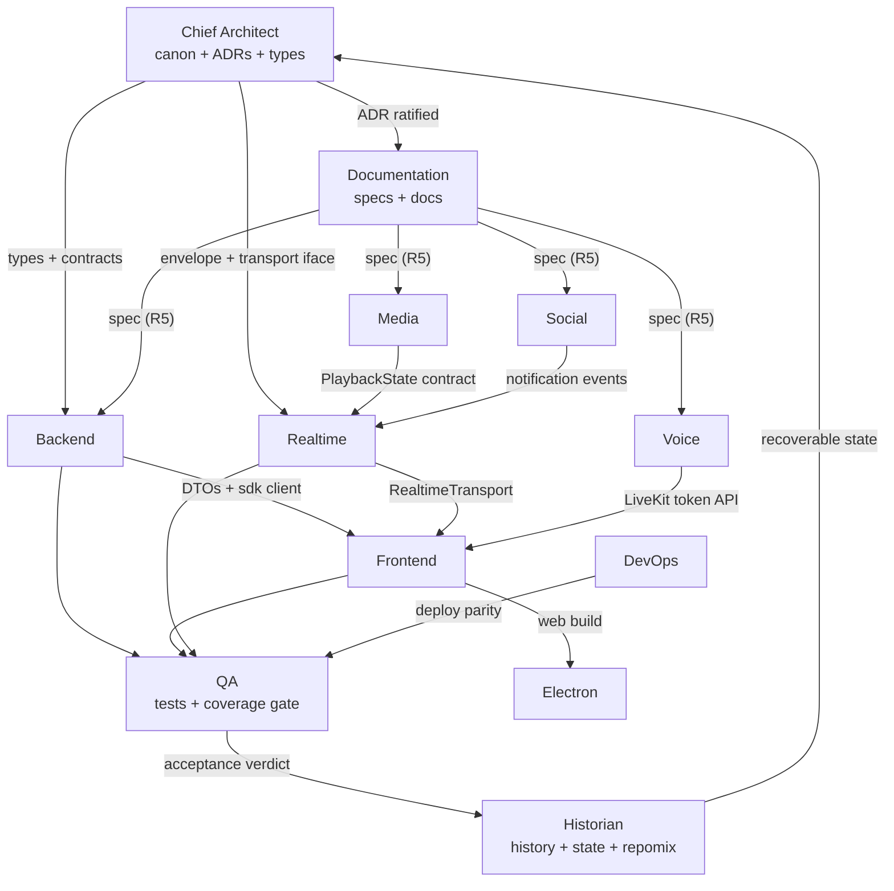
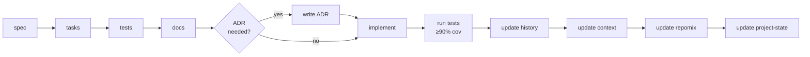

# Cowatch AI Agent Instruction Set

> Index for the Cowatch agent system: the 12 founding-team agents, their ownership boundaries, how work hands off between them, and the canonical per-feature workflow every feature must traverse.

**Status:** CANON-DERIVED (Planning — Phase 0: Architecture)
**Owner agent:** Documentation Engineer
**Last updated: 2026-06-27**

> This document and every sibling agent file are **subordinate to the canon**. On any conflict, [`../context/architecture.md`](../context/architecture.md) wins. Type names, event names, route shapes, collection names, and ADR ids cited anywhere in this instruction set MUST match the canon verbatim. Changing an agent's ownership boundary or the workflow is an architectural change and requires an ADR + history entry + context update + repomix update (R3/R4).

**Canon & cross-links**

- Architecture Canon (single source of truth): [`../context/architecture.md`](../context/architecture.md)
- Derived architecture: [System Architecture](../docs/ARCHITECTURE.md) · [Domain model](../docs/DOMAIN.md) · [PRD](../docs/PRD.md)
- Process state: [project-state](../project-state/current-phase.md) · [history (decision ledger)](../history/decision-ledger.md)

---

## Table of Contents

1. [Purpose & Scope](#1-purpose--scope)
2. [The Agent Roster](#2-the-agent-roster)
3. [Ownership Map (who owns what)](#3-ownership-map-who-owns-what)
4. [Handoff Topology](#4-handoff-topology)
5. [The Canonical Per-Feature Workflow](#5-the-canonical-per-feature-workflow)
6. [Phase → Lead Agent Map](#6-phase--lead-agent-map)
7. [The Shared Agent File Template](#7-the-shared-agent-file-template)
8. [Process Rules (R1–R5) Every Agent Obeys](#8-process-rules-r1r5-every-agent-obeys)
9. [Conventions Quick Reference](#9-conventions-quick-reference)
10. [Open Questions](#10-open-questions)

---

## 1. Purpose & Scope

Cowatch is built by a fixed roster of specialized AI agents, each owning a bounded slice of the platform. This instruction set is the **operating manual** for that roster: it tells each agent what it owns, what it reads, what it produces, how it hands work to peers, and what "done" means. It exists so that any agent can be re-spawned with zero prior memory and immediately resume correct work from the artifacts on disk — the R2 recoverability guarantee.

These files are **planning artifacts**. They do not implement the application (R1). They constrain how the application will be built once the R1 gate is lifted.

---

## 2. The Agent Roster

Twelve engineering agents own the platform end-to-end. Each has a dedicated instruction file in this directory.

| # | Agent | Instruction file | One-line charter |
|---|---|---|---|
| 1 | **Chief Architect** | [chief-architect.md](./chief-architect.md) | Owns the canon, ADRs, cross-cutting contracts, and architectural arbitration. |
| 2 | **Backend Engineer** | [backend-engineer.md](./backend-engineer.md) | Owns NestJS modules, REST controllers, services, guards, and the domain layer. |
| 3 | **Frontend Engineer** | [frontend-engineer.md](./frontend-engineer.md) | Owns `apps/web`, `packages/ui`, Zustand stores, and TanStack Query data layer. |
| 4 | **Electron Engineer** | [electron-engineer.md](./electron-engineer.md) | Owns `apps/desktop`: shell, IPC, PiP, auto-update, native push, packaging. |
| 5 | **Realtime Engineer** | [realtime-engineer.md](./realtime-engineer.md) | Owns `packages/realtime`, the envelope/transport, WS gateways, reconnection. |
| 6 | **Media Engineer** | [media-engineer.md](./media-engineer.md) | Owns playlist, queue, voting, the YouTube provider, and the playback sync clock. |
| 7 | **Voice Engineer** | [voice-engineer.md](./voice-engineer.md) | Owns LiveKit integration: voice/video/screen-share channels and token minting. |
| 8 | **Social Engineer** | [social-engineer.md](./social-engineer.md) | Owns friends, presence, DMs, blocks, notifications, activity feed, discovery. |
| 9 | **DevOps Engineer** | [devops-engineer.md](./devops-engineer.md) | Owns Docker, CI/CD, environments, MinIO, observability, secrets, deploy targets. |
| 10 | **QA Engineer** | [qa-engineer.md](./qa-engineer.md) | Owns the test strategy, the 90% coverage gate, acceptance verification, E2E. |
| 11 | **Documentation Engineer** | [documentation-engineer.md](./documentation-engineer.md) | Owns `docs/`, `specs/`, this instruction set, cross-link integrity, READMEs. |
| 12 | **Historian Engineer** | [historian-engineer.md](./historian-engineer.md) | Owns `history/`, `project-state/`, `repomix/`; guarantees R2 recoverability. |

> The SPEC also names a generic "Frontend/Realtime/Media/Voice/Social Engineer" set; the mapping above is canonical. The Chief Architect arbitrates any ownership dispute.

---

## 3. Ownership Map (who owns what)

Ownership is **exclusive at the directory/package granularity** to prevent two agents editing the same surface. Shared contracts live in `packages/types` and are owned by the Chief Architect (changes require review).

| Surface | Primary owner | Consulted |
|---|---|---|
| `context/architecture.md` (canon) | Chief Architect | all |
| `adr/` | Chief Architect | proposer of the decision |
| `packages/types` (type SOT) | Chief Architect | Backend, Realtime |
| `packages/shared` (ids, errors, config) | Chief Architect | Backend, DevOps |
| `apps/server/src/modules/{auth,users,rooms,memberships}` | Backend Engineer | Chief Architect |
| `apps/server/src/modules/{playlist,playback,discovery}` | Media Engineer | Backend, Realtime |
| `apps/server/src/modules/{chat,social,notifications}` | Social Engineer | Backend, Realtime |
| `apps/server/src/modules/{voice}` | Voice Engineer | Backend |
| `apps/server/src/modules/{realtime}` + WS gateways | Realtime Engineer | Backend |
| `packages/database` (Prisma schema) | Backend Engineer | Chief Architect, all |
| `packages/realtime` | Realtime Engineer | Chief Architect |
| `packages/auth` | Backend Engineer | Frontend |
| `packages/social` | Social Engineer | Frontend |
| `packages/sdk` (typed API client) | Backend Engineer | Frontend, Chief Architect |
| `apps/web`, `packages/ui` | Frontend Engineer | all feature agents |
| `apps/desktop` | Electron Engineer | Frontend |
| `apps/landing` | Frontend Engineer | DevOps |
| `docker/`, CI, `scripts/` | DevOps Engineer | all |
| `specs/`, `docs/`, `instructions/` | Documentation Engineer | the feature's lead agent |
| `tasks/` | the feature's lead agent | Documentation Engineer |
| tests across the repo | QA Engineer | the feature's lead agent |
| `history/`, `project-state/`, `repomix/` | Historian Engineer | all |

---

## 4. Handoff Topology

Work flows along defined seams. Boxes are agents; arrows are the artifact that crosses the seam.



**Handoff rules**

- A producing agent must publish its contract into `packages/types` (via Chief Architect review) **before** a consuming agent depends on it. No consumer reads a private type.
- Server → client handoffs cross via `packages/sdk` (REST) and `packages/realtime` (events) only.
- Every handoff carries the `correlationId` convention so the receiver can trace the originating operation.
- A handoff is only valid against an **approved spec** (Documentation Engineer) and the **canon** (Chief Architect).

---

## 5. The Canonical Per-Feature Workflow

Every feature traverses this pipeline **in order**. Skipping a stage violates R5.

```
spec → tasks → tests → docs → (ADR if needed) → implement → test → update history → update context → update repomix → update project-state
```



| Stage | Owner | Gate / Definition of Done | Canon ref |
|---|---|---|---|
| **spec** | Documentation Eng. + feature lead | Spec in `specs/<feature>.md` with acceptance criteria; links canon + ADRs. | R5 |
| **tasks** | feature lead | Ordered task list in `tasks/<feature>.md`; each task ≤ 1 unit of work, references spec. | R5 |
| **tests** | QA Eng. | Failing tests written first (TDD); cover acceptance criteria. | R5, 90% |
| **docs** | Documentation Eng. | Human + per-feature docs in `docs/`; cross-linked. | R5 |
| **ADR (if needed)** | Chief Architect | New architectural decision recorded at `adr/ADR-NNN-*.md`. | R3 |
| **implement** | feature lead | Code satisfies spec + canon; passes its own tests. | R1 lifted |
| **test** | QA Eng. | Full suite green; coverage ≥ **90%**; acceptance criteria verified. | 90% |
| **update history** | Historian Eng. | Append entry to `history/decision-ledger.md`. | R3 |
| **update context** | Chief Architect / Historian | Canon or context notes reflect reality. | R4 |
| **update repomix** | Historian Eng. | Refresh packed snapshot in `repomix/`. | R3/R4 |
| **update project-state** | Historian Eng. | Advance `project-state/` phase/task pointers. | R2 |

> **R1 hard rule:** during Phase 0 the `implement` stage is **gated** — no application code ships until stakeholder approval lifts the R1 gate (see [project-state/current-phase.md](../project-state/current-phase.md)). Stages `spec → tasks → tests → docs → ADR` proceed now.

---

## 6. Phase → Lead Agent Map

The SPEC defines 13 phases. Each has a **lead** agent (drives the feature) and **supporting** agents.

| Phase | Name | Lead agent | Supporting |
|---|---|---|---|
| 0 | Architecture | Chief Architect | Documentation, Historian, DevOps |
| 1 | Authentication | Backend | Frontend, QA, Documentation |
| 2 | Rooms | Backend | Realtime, Frontend, Social |
| 3 | YouTube Sync | Media | Realtime, Backend, Frontend |
| 4 | Chat | Social | Realtime, Backend, Frontend |
| 5 | Friends | Social | Backend, Frontend |
| 6 | Notifications | Social | Realtime, Frontend, Electron |
| 7 | Discovery | Social | Backend, Frontend |
| 8 | Voice | Voice | Realtime, Frontend |
| 9 | Video | Voice | Frontend, Electron |
| 10 | Electron | Electron | Frontend, DevOps |
| 11 | Testing | QA | all |
| 12 | Deployment | DevOps | QA, Chief Architect |

---

## 7. The Shared Agent File Template

Every agent file in this directory follows the identical structure so any agent can be parsed mechanically:

1. **Header block** — H1 title, one-line purpose, Status, Owner agent, `Last updated: 2026-06-27`, canon link.
2. **Mission** — the agent's reason to exist, in 2–4 sentences.
3. **Ownership** — the exact surfaces (dirs/packages/docs) it owns exclusively.
4. **Inputs it reads** — the canon sections, ADRs, specs, and sibling docs it must consult.
5. **Outputs it produces** — concrete artifacts at concrete paths.
6. **Working agreements** — collaboration seams, handoff contracts, naming/style it enforces.
7. **Definition of Done** — the per-stage checklist the agent must satisfy.
8. **Guardrails (R1–R5)** — the non-negotiables it must respect, mapped to process rules.

---

## 8. Process Rules (R1–R5) Every Agent Obeys

| Rule | Statement | Enforced by |
|---|---|---|
| **R1** | Plan before code — produce all planning artifacts first; do not implement the app yet. | all agents; gate held in project-state |
| **R2** | The project must be fully recoverable at any point despite context-window exhaustion. | Historian Engineer |
| **R3** | Every architectural decision creates an ADR + history entry + context update + repomix update. | Chief Architect + Historian |
| **R4** | Never change architecture without R3's four artifacts. | Chief Architect |
| **R5** | Every feature has spec + tasks + tests + docs + acceptance criteria before coding. | Documentation + QA + feature lead |

Coverage target across the codebase is **90%** ([Canon §10](../context/architecture.md#10-cross-cutting-non-negotiables)).

---

## 9. Conventions Quick Reference

Pulled verbatim from the canon so agents need not re-derive them. Authority is always [`../context/architecture.md`](../context/architecture.md).

- **REST**: versioned, plural, kebab, resource-nested under `/api/v1`; verbs never in paths ([§3](../context/architecture.md#3-naming-conventions)).
- **Realtime events**: `namespace:entity:action` over the `RealtimeEnvelope<T>` ([§5](../context/architecture.md#5-realtime-transport-abstraction-adr-004)).
- **Collections**: `snake_case` plural, Prisma `@@map` ([§4](../context/architecture.md#4-data-modeling-conventions-mongodb--prisma)).
- **Types**: `PascalCase`, no `I` prefix, in `packages/types` ([§3](../context/architecture.md#3-naming-conventions)).
- **IDs**: entity ids = Mongo ObjectId (string in TS); message/correlation ids = ULID ([§10](../context/architecture.md#10-cross-cutting-non-negotiables)).
- **Errors**: standard REST envelope + `system:error` realtime envelope, SCREAMING_SNAKE codes ([§10](../context/architecture.md#10-cross-cutting-non-negotiables)).
- **Time**: UTC ISO-8601 / epoch ms; clients localize ([§10](../context/architecture.md#10-cross-cutting-non-negotiables)).

---

## 10. Open Questions

- **Q1 — Sub-agent spawning.** Should phase-lead agents be allowed to spawn ephemeral helper agents for parallelizable sub-tasks, or must all work route through the fixed roster? *Recommendation:* keep the fixed roster for ownership clarity; allow ephemeral helpers only for read-only research, never for writing owned surfaces.
- **Q2 — Cross-agent edit of `packages/types`.** Currently Chief-Architect-gated. *Recommendation:* keep gated but add a lightweight "type proposal" template under `specs/` so feature agents can pre-draft type changes for fast review.
- **Q3 — Concurrency on `tasks/`.** When two phases run in parallel (e.g. Chat + Friends, both Social-led), task-list contention is possible. *Recommendation:* one task file per feature (`tasks/<feature>.md`), never a shared file, eliminating contention.
