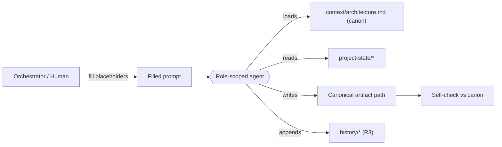
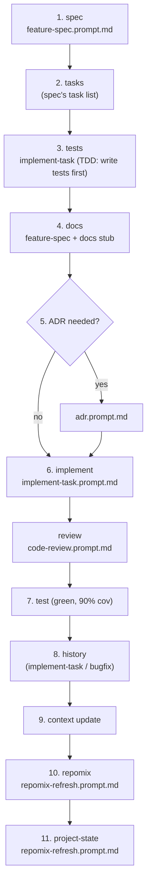

# Cowatch AI Prompt Library

> Index of reusable, parameterized prompt templates that drive the Cowatch AI agent system. Every template bakes in the Architecture Canon, naming conventions, and the R1–R5 process rules so any agent — fresh or context-exhausted — produces canon-compliant artifacts on the first pass.

**Status:** CANON-DERIVED (Planning — Phase 0: Architecture)
**Owner agent:** Documentation Engineer
**Last updated: 2026-06-27**

> This library is **subordinate to the canon**. On any conflict, [`../context/architecture.md`](../context/architecture.md) wins. Each template instructs the executing agent to load the canon first and to match every type name, event name, route shape, and ADR id **verbatim**.

**Canon & cross-links**

- Architecture Canon (single source of truth): [`../context/architecture.md`](../context/architecture.md)
- Phase plan: [`../docs/PHASES.md`](../docs/PHASES.md) · System architecture: [`../docs/ARCHITECTURE.md`](../docs/ARCHITECTURE.md)
- Decision ledger (R3/R4): [`../history/decision-ledger.md`](../history/decision-ledger.md)
- Project state (R2): [`../project-state/current-phase.md`](../project-state/current-phase.md)

---

## Table of Contents

1. [What this is](#1-what-this-is)
2. [The agent roster](#2-the-agent-roster)
3. [The template catalog](#3-the-template-catalog)
4. [How to use a template](#4-how-to-use-a-template)
5. [Placeholder convention](#5-placeholder-convention)
6. [The R1–R5 rules every template enforces](#6-the-r1r5-rules-every-template-enforces)
7. [The per-feature workflow these templates compose](#7-the-per-feature-workflow-these-templates-compose)
8. [Authoring / extending templates](#8-authoring--extending-templates)
9. [Open questions](#9-open-questions)

---

## 1. What this is

The Cowatch platform is built by a fleet of role-scoped AI agents (Chief Architect, Backend Engineer, … Documentation Engineer, Historian Engineer — see [§2](#2-the-agent-roster)). Those agents are stateless across context windows. To keep their output **consistent, canon-compliant, and recoverable** (process rule R2), every recurring action is driven by a **copy-paste-ready prompt template** stored in this directory.

Each `*.prompt.md` file is:

- **Parameterized** — placeholders in `«GUILLEMETS»` mark the only spots a human (or an orchestrating agent) must fill in. See [§5](#5-placeholder-convention).
- **Self-contained** — it re-states the relevant canon rules and the R1–R5 gates inline, so it works even when the executing agent has *zero* prior context.
- **Workflow-aware** — templates reference the per-feature workflow (`spec → tasks → tests → docs → ADR? → implement → test → history → context → repomix → project-state`) and only do their slice of it.
- **Output-shaped** — each ends with a precise "Deliverables" and "Self-check before you finish" block so output lands at the right canonical path in the right format.

> **Hard rule reminder (R1):** While the project is in the planning phase (`phase 0`, see [`../project-state/current-phase.md`](../project-state/current-phase.md)), the `implement-task`, `bugfix`, and `code-review` templates are authored and ready but MUST NOT be run against application code until the R1 gate (`BLK-001`) clears. They produce planning-only artifacts (test plans, review checklists) when invoked pre-approval.

---

## 2. The agent roster

Templates address agents by role. Pick the `«AGENT_ROLE»` whose ownership matches the work.

| Role | Owns | Typical templates |
|---|---|---|
| Chief Architect | Canon, ADRs, system design, cross-cutting decisions | `adr`, `feature-spec`, `code-review` |
| Backend Engineer | NestJS modules, REST, Prisma data model | `feature-spec`, `implement-task`, `code-review`, `bugfix` |
| Frontend Engineer | `apps/web` React/Zustand/TanStack Query | `implement-task`, `code-review`, `bugfix` |
| Electron Engineer | `apps/desktop` shell, IPC, auto-update | `implement-task`, `bugfix` |
| Realtime Engineer | `packages/realtime`, WS gateways, envelope | `feature-spec`, `adr`, `implement-task` |
| Media Engineer | YouTube provider, sync, playlist, voting | `feature-spec`, `implement-task`, `bugfix` |
| Voice Engineer | LiveKit voice/video/screen-share | `feature-spec`, `implement-task` |
| Social Engineer | friends, presence, DMs, notifications, blocks | `feature-spec`, `implement-task` |
| DevOps Engineer | Docker, CI, deploy targets, MinIO | `adr`, `implement-task`, `repomix-refresh` |
| QA Engineer | test plans, coverage (90%), acceptance criteria | `feature-spec`, `implement-task`, `code-review` |
| Documentation Engineer | `docs/`, `prompts/`, `instructions/` | `feature-spec`, `repomix-refresh` |
| Historian Engineer | `history/`, `project-state/`, `repomix/` | `restore-context`, `repomix-refresh`, `adr` |

---

## 3. The template catalog

| Template | Purpose | Primary owner | Produces (canonical path) |
|---|---|---|---|
| [`feature-spec.prompt.md`](./feature-spec.prompt.md) | Write a full feature specification with acceptance criteria (R5 gate 1) | Feature owner + QA | `specs/«feature».spec.md` |
| [`adr.prompt.md`](./adr.prompt.md) | Author an Architecture Decision Record for any architectural change (R3) | Chief Architect | `adr/ADR-NNN-«kebab-title».md` |
| [`implement-task.prompt.md`](./implement-task.prompt.md) | Implement one task TDD-first, respecting the per-feature workflow | Feature owner | source under `apps/*` or `packages/*` + tests |
| [`code-review.prompt.md`](./code-review.prompt.md) | Review a diff/PR against canon, security baseline, and coverage | Reviewer (peer role) | review comment / `docs` checklist |
| [`bugfix.prompt.md`](./bugfix.prompt.md) | Diagnose and fix a bug with a regression test, log it (R3) | Feature owner | patch + test + `history/bugs.md` row |
| [`restore-context.prompt.md`](./restore-context.prompt.md) | Rebuild working context after a window loss; drive `RESTORE_CONTEXT.md` (R2) | Historian | `project-state/RESTORE_CONTEXT.md` |
| [`repomix-refresh.prompt.md`](./repomix-refresh.prompt.md) | Re-pack the repo snapshot + sync project-state (R4) | Historian / DevOps | `repomix/*` + `project-state/*` |

---

## 4. How to use a template

There are two supported invocation paths.

### A. Human-driven (copy-paste)

1. Open the template file.
2. Copy its entire body into a fresh agent conversation.
3. **Replace every `«PLACEHOLDER»`** (see [§5](#5-placeholder-convention)). Search for `«` — if any remain, the prompt is incomplete.
4. Send. The template handles loading the canon, doing the work, and self-checking.

### B. Orchestrator-driven (agent fan-out)

An orchestrating agent (or workflow script) reads the template, fills the placeholders from the current `project-state/` and the task definition, and dispatches it to the role-scoped sub-agent named in the template header. The sub-agent returns the deliverable + a one-line manifest of files written.

---

## 5. Placeholder convention

- Placeholders are wrapped in **guillemets**: `«LIKE_THIS»`, SCREAMING_SNAKE inside.
- Optional placeholders are marked `«OPTIONAL: …»`; omit the whole line if not needed.
- Repeatable blocks are bounded by `«REPEAT_START» … «REPEAT_END»`.
- A literal guillemet is never used outside a placeholder, so a post-fill grep for `«` reliably finds anything you forgot.

Common placeholders shared across templates:

| Placeholder | Meaning | Example |
|---|---|---|
| `«AGENT_ROLE»` | The role the agent should adopt | `Backend Engineer` |
| `«FEATURE»` | Feature slug (kebab) | `room-membership` |
| `«PHASE»` | Development phase number + name | `2 — Rooms` |
| `«CANON_SECTIONS»` | Canon anchors that govern this work | `#6-permission-model, #8-auth--token-model-adr-008` |
| `«TASK_ID»` | Task identifier from `tasks/` | `P2-ROOMS-003` |
| `«ADR_NUMBER»` | Zero-padded ADR id | `011` |
| `«CORRELATION_ID»` | ULID for the logical operation | `01J9Z…` |

---

## 6. The R1–R5 rules every template enforces

Every template restates the subset of these it depends on, and refuses to proceed if a precondition is unmet.

| Rule | Statement | How templates enforce it |
|---|---|---|
| **R1** | Plan before code — produce planning artifacts first; do not implement yet. | `implement-task`/`bugfix` check the R1 gate (`BLK-001`) in [`../project-state/blockers.md`](../project-state/blockers.md) and refuse to write app code while planning. |
| **R2** | The project must be fully recoverable despite context-window exhaustion. | `restore-context` rebuilds state from `project-state/` + `history/`; every template writes to canonical paths so state is never in-conversation-only. |
| **R3** | Every architectural decision ⇒ ADR + history entry + context update + repomix update. | `adr` produces all four; `bugfix`/`implement-task` append to `history/` and flag when an ADR is required. |
| **R4** | Never change architecture without R3's artifacts. | `code-review` **fails** any diff that changes architecture without a linked ADR + ledger row. |
| **R5** | Every feature needs spec, tasks, tests, docs, and acceptance criteria **before** coding. | `feature-spec` produces them; `implement-task` refuses to start a feature whose R5 artifacts are missing. |

---

## 7. The per-feature workflow these templates compose

The canon's process discipline ([`../context/architecture.md#10-cross-cutting-non-negotiables`](../context/architecture.md#10-cross-cutting-non-negotiables)) defines one workflow per feature. Each template owns exactly one or two steps; chaining them end-to-end delivers a feature.

> If a window is lost at any node, run [`restore-context.prompt.md`](./restore-context.prompt.md) to re-enter the workflow at the correct step.

---

## 8. Authoring / extending templates

- File name: `«verb-noun».prompt.md`, kebab-case, in this directory.
- Start with the standard header block (H1 title, one-line purpose, Status, Owner agent, `Last updated`).
- Structure: **Role → Preconditions (R-gates) → Inputs (placeholders) → Canon context to load → Task → Constraints → Deliverables → Self-check**.
- Re-state canon rules inline; link the canon section anchors, never paraphrase a rule loosely.
- Add a row to the [catalog](#3-the-template-catalog) and announce the change in [`../history/decision-ledger.md`](../history/decision-ledger.md) if it changes process.

---

## 9. Open questions

- **Template versioning.** Templates currently inherit the repo's git history. *Recommendation:* once Phase 1 starts, stamp a `Template-Version:` line in each header and bump it in the ledger when behavior changes, so a cached agent can detect a stale copy.
- **Automated placeholder validation.** *Recommendation:* add a `scripts/check-prompts.mjs` that greps filled prompts for residual `«` before dispatch — deferred until the orchestrator exists.
- **Per-role prompt prefixes.** Whether to factor the shared "load canon, obey R1–R5" preamble into one `_preamble.prompt.md` include vs. keeping each template self-contained. *Recommendation:* keep self-contained (R2 favors zero-dependency prompts) until duplication becomes a maintenance burden.
