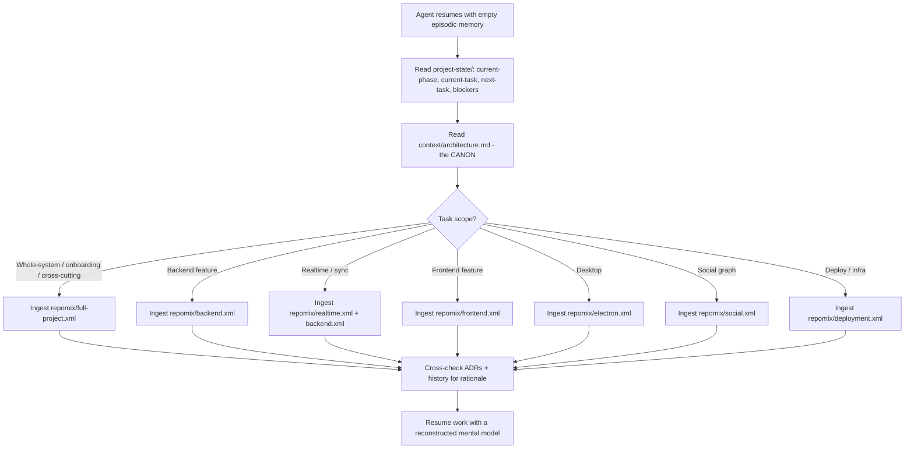

# Cowatch Repomix Manifest

> One-line purpose: Define the canonical set of Repomix bundles, exactly what each covers, when to regenerate them, and how to feed them into AI context restoration so the project stays fully recoverable (R2) under context-window exhaustion.

**Status:** Planning (Phase 0 — Architecture)
**Owner agent:** DevOps / Documentation Engineer
**Last updated: 2026-06-27**

Canonical source of truth: [Architecture Canon](../context/architecture.md). On any conflict, the canon wins. This document operationalizes the **process rules** in [Canon §10 (Process discipline, R2–R5)](../context/architecture.md#10-cross-cutting-non-negotiables): _"every architectural change ⇒ ADR + history + context + **repomix**"_, and the recoverability mandate (R2) that the project must be resumable at any point despite a lost chat transcript.

Related artifacts: [ADR-001 (Monorepo)](../adr/ADR-001-monorepo.md) · [ADR-004 (Realtime abstraction)](../adr/ADR-004-realtime.md) · [Deployment Architecture](../docs/DEPLOYMENT.md) · [Lessons Learned L-002](../history/lessons-learned.md).

> **This is a planning artifact only.** No `.xml` bundles are produced yet — the source apps (`apps/server`, `apps/web`, `apps/desktop`) and packages (`packages/realtime`, `packages/social`) **do not exist** during Phase 0. The generation scripts ([`../scripts/repomix.ps1`](../scripts/repomix.ps1), [`../scripts/repomix.sh`](../scripts/repomix.sh)) are authored now and **run later, once code exists** (from Phase 1 onward). Running them today would emit empty or near-empty bundles and is explicitly out of scope.

---

## 1. What Repomix Is and Why It Exists Here

[Repomix](https://github.com/yamadashy/repomix) packs a directory tree into a **single, AI-ingestible file** (we standardize on **XML** output) containing a directory map plus the concatenated, fenced contents of every in-scope file. One bundle = one self-contained snapshot an AI agent can paste into its context to "see" a slice of the codebase without crawling the filesystem file-by-file.

For Cowatch this serves two non-negotiables:

1. **Recoverability (R2).** A future agent resuming work has **no episodic memory** of prior sessions — only the files on disk ([Lessons Learned L-002](../history/lessons-learned.md)). A current, well-scoped Repomix bundle lets that agent reconstruct a working mental model of a subsystem in one read, rather than re-deriving it.
2. **Architectural change discipline (R3/R4).** Every architectural change must emit **ADR + history + context + repomix**. The repomix step means: regenerate the affected bundle(s) so the packed snapshot never lies about the current architecture. A stale bundle is worse than none — it silently feeds an agent an obsolete world model.

**Scope boundary.** Repomix bundles are a _restoration / review_ aid. They are **not** the source of truth — the canon, ADRs, Prisma schema, and `packages/types` are. Bundles are **regenerated, never hand-edited**, and are **git-ignored build outputs** (see [§7](#7-storage-git-and-naming)).

---

## 2. Bundle Catalog

Seven bundles are maintained under `repomix/`. Each has a fixed scope (the source root passed to Repomix), a fixed output filename, and a defined audience. The full-project bundle is the superset; the six scoped bundles are focused slices that fit a single agent's context budget.

| Bundle | Output file | Source scope (root) | Primary audience | Approx. role |
|---|---|---|---|---|
| **Full project** | `repomix/full-project.xml` | repo root (`.`) | Chief Architect, onboarding, cross-cutting refactors | Whole-monorepo superset snapshot |
| **Backend** | `repomix/backend.xml` | `apps/server` | Backend, Realtime, Media, Voice, Social, Auth engineers | NestJS REST + WS gateways + modules |
| **Frontend** | `repomix/frontend.xml` | `apps/web` | Frontend Engineer, QA | React + Vite + Zustand + TanStack Query app |
| **Electron** | `repomix/electron.xml` | `apps/desktop` | Electron Engineer | Desktop shell (PiP, IPC, auto-update) wrapping web |
| **Realtime** | `repomix/realtime.xml` | `packages/realtime` | Realtime Engineer, Backend, Frontend | `RealtimeTransport` + envelope + transport adapters |
| **Social** | `repomix/social.xml` | `packages/social` | Social Engineer | Friends / presence / DM shared logic |
| **Deployment** | `repomix/deployment.xml` | `docker/` + `scripts/` + root infra files | DevOps Engineer | Docker/compose, infra scripts, deploy config |

> **Note on coverage gaps.** The six scoped bundles deliberately **do not** individually cover `apps/landing` or the packages `ui`, `auth`, `database`, `sdk`, `shared`, `types`. Those are always available via **`full-project.xml`**. This is intentional: the scoped slices target the highest-churn, highest-context-cost subsystems (the realtime/sync core, the two big apps, the desktop shell, the social graph, and the deployment surface). `packages/types`, `packages/database`, and `packages/sdk` are small, stable, and best read whole from the full bundle or directly from source. See [Open Questions](#9-open-questions) for the dedicated `packages.xml` proposal.

### 2.1 Exact Coverage per Bundle

#### `full-project.xml` — Whole monorepo
- **Covers:** the entire repository tree from the root — all of `apps/{web,desktop,server,landing}`, all of `packages/{ui,auth,database,realtime,social,sdk,shared,types}`, plus top-level `adr/`, `context/`, `docs/`, `specs/`, `tasks/`, `history/`, `project-state/`, `docker/`, `scripts/`, `instructions/`, `prompts/`.
- **Excludes:** `node_modules/`, build outputs (`dist/`, `.turbo/`, `.next/`, `out/`), generated Prisma client, lockfiles, `repomix/*.xml` (never pack bundles into a bundle — see [§7](#7-storage-git-and-naming)), binaries, and anything in `.gitignore`. Repomix honors `.gitignore` by default; see script `--ignore` flags for the explicit additions.
- **When to use:** first-time onboarding of a new agent, cross-cutting changes that touch a shared contract (e.g. a new field on `PlaybackSyncEvent` propagating across producer + consumers per [ADR-001](../adr/ADR-001-monorepo.md)), or any audit that needs the planning corpus (canon + ADRs + specs) alongside code.
- **Cost caveat:** this is the largest bundle and may exceed a single context window once the codebase grows. Prefer a scoped bundle whenever the task is subsystem-local.

#### `backend.xml` — `apps/server`
- **Covers:** the NestJS application — `src/modules/<context>/` for every bounded context (`AuthModule`, `UsersModule`, `RoomsModule`, `MembershipsModule`, `PlaylistModule`, `PlaybackModule`, `ChatModule`, `SocialModule`, `NotificationsModule`, `VoiceModule`, `DiscoveryModule`, `StorageModule`, `RealtimeModule`), `main.ts`, app/bootstrap config, guards, interceptors, filters, REST controllers, WS gateways, DTOs, and `*.spec.ts` tests colocated in the server.
- **Does not re-pack:** `packages/*` source (the server _imports_ `packages/types`, `packages/database`, `packages/realtime`, etc.; their source is read from their own bundles or the full bundle). Excludes `node_modules`, `dist`, generated Prisma client.
- **When to use:** any backend feature work — REST route shapes (`/api/v1/...`), WS gateway envelopes, permission guards, sync-authority enforcement, auth/token flows.

#### `frontend.xml` — `apps/web`
- **Covers:** the React + Vite app — `PascalCase.tsx` components, `useCamelCase.ts` hooks, `camelCase.store.ts` Zustand stores, TanStack Query hooks, route tree, Tailwind/shadcn usage, Vite config, and colocated component tests.
- **Does not re-pack:** `packages/ui` (shared shadcn components), `packages/sdk`, `packages/realtime` source — consumed via imports.
- **When to use:** UI feature work, client-side sync player integration, presence/notification surfaces, discovery views.

#### `electron.xml` — `apps/desktop`
- **Covers:** the Electron + electron-builder shell that **wraps** `apps/web` ([ADR-006](../adr/ADR-006-electron.md)) — main process, preload/IPC bridge, picture-in-picture, push notifications, hardware-accel flags, auto-update wiring, `electron-builder` config, and packaging scripts.
- **Does not re-pack:** the web app it wraps (read `frontend.xml` for that). Excludes `node_modules`, `release/`, `out/`, packaged binaries.
- **When to use:** desktop-specific work — IPC contracts, native PiP, auto-update channels, OS push integration.

#### `realtime.xml` — `packages/realtime`
- **Covers:** the **custom realtime abstraction layer** ([ADR-004](../adr/ADR-004-realtime.md), [Canon §5](../context/architecture.md#5-realtime-transport-abstraction-adr-004)) — the `RealtimeTransport` interface, `RealtimeEnvelope`, `ConnectionState`, `PresenceState`, the reconnection/resume logic, and every transport adapter (`NativeWsTransport` today; `LiveKitDataChannelTransport`, `DurableObjectTransport`, `VercelEdgeTransport` later). Includes its `*.spec.ts`.
- **When to use:** transport/envelope changes, reconnection/backoff tuning, adding a new adapter, or any change to the wire protocol version (`v`). This package is the highest-leverage / highest-blast-radius unit — both `apps/server` and the clients depend on it identically, so its bundle is regenerated on **any** realtime-protocol change.

#### `social.xml` — `packages/social`
- **Covers:** shared friends / presence / DM domain logic ([Canon §1 social terms](../context/architecture.md#1-glossary-of-core-domain-terms)) — friendship + friend-request state machines, presence aggregation, DM thread helpers, block suppression rules, activity-feed shaping, and notification-type mapping shared across server and clients. Includes its `*.spec.ts`.
- **When to use:** any change to the social graph model, presence states (`online | idle | dnd | offline`), DM threading, or the notification-type set.

#### `deployment.xml` — `docker/` + `scripts/` + root infra
- **Covers:** the DevOps surface — `docker/` (Dockerfiles, compose files, per-target overrides for `local | vps | vercel | production`), `scripts/` (this folder, including the repomix scripts), root-level infra/config that is not secret (e.g. `turbo.json`, `pnpm-workspace.yaml`, `.dockerignore`, CI workflow files, `vercel.json`), and the [Deployment doc](../docs/DEPLOYMENT.md) context if colocated. **Never** packs `.env*`, secrets, certs, or signed-URL material ([Canon §10 security baseline](../context/architecture.md#10-cross-cutting-non-negotiables)).
- **When to use:** deployment topology changes, transport selection (`REALTIME_TRANSPORT`), scaling the stateful sync tier, MinIO bucket policy, or CI/CD pipeline edits.

---

## 3. When to Regenerate (R3 / R4 Trigger Table)

Regeneration is **event-driven**, not time-driven. The governing rule ([Canon §10](../context/architecture.md#10-cross-cutting-non-negotiables)): **every architectural change ⇒ ADR + history + context + repomix.** The repomix step of that quartet means regenerating the affected bundle(s) **in the same change/PR**, so a reviewer and any future agent see code and snapshot in lockstep.

| Trigger | Regenerate | Why |
|---|---|---|
| **Any merged ADR** (architecture change) | `full-project.xml` **+** the bundle(s) for the affected subsystem | R3/R4: the snapshot must reflect the new architecture before the change is "done". |
| Change to `packages/realtime` (envelope, transport, protocol `v`, reconnection) | `realtime.xml` + `backend.xml` + `frontend.xml` + `electron.xml` + `full-project.xml` | The transport contract is consumed identically across server + all clients ([Canon §5](../context/architecture.md#5-realtime-transport-abstraction-adr-004)). |
| Change to a shared contract in `packages/types` (entity/DTO/event type) | every scoped bundle whose code imports it + `full-project.xml` | `packages/types` is the single source of truth ([Canon §3](../context/architecture.md#3-naming-conventions)); consumers must be re-snapshotted. |
| Backend module/route/gateway change | `backend.xml` (+ `full-project.xml`) | Keep the REST/WS surface snapshot current. |
| Frontend feature/store/route change | `frontend.xml` (+ `full-project.xml`) | — |
| Desktop shell / IPC / auto-update change | `electron.xml` (+ `full-project.xml`) | — |
| Social graph / presence / DM / notification-type change | `social.xml` (+ `backend.xml` / `frontend.xml` if surfaced) + `full-project.xml` | — |
| Docker / compose / CI / deploy-target / transport-selection change | `deployment.xml` (+ `full-project.xml`) | — |
| **End of every development phase** (Phases 1–12) | **all bundles** | Phase boundaries are recovery checkpoints (R2); leave a clean, complete snapshot set for the next phase's agents. |
| Prisma `schema.prisma` change (new collection/index/denorm field) | `backend.xml` + `full-project.xml` (schema lives in `packages/database`) | The data model is architecturally significant ([Canon §4](../context/architecture.md#4-data-modeling-conventions-mongodb--prisma)). |

**Cardinal rule:** when in doubt, regenerate **`full-project.xml`** — it is always correct, only more expensive. The scoped bundles are an optimization, not a substitute for keeping the superset fresh.

**What does _not_ trigger regeneration:** pure documentation typo fixes, comment-only edits, and formatting that does not change file structure. (A new doc/spec file _does_ change `full-project.xml`'s map and should be re-packed at the next phase checkpoint or alongside its related code change.)

---

## 4. How to Regenerate

Both scripts produce **all seven** bundles into `repomix/` in one invocation. They are idempotent and overwrite prior bundles.

```bash
# POSIX (Linux/macOS, CI)
bash scripts/repomix.sh

# Windows (PowerShell)
pwsh scripts/repomix.ps1        # or: powershell -File scripts/repomix.ps1
```

Each script wraps `npx repomix` once per bundle, passing the scope root as the positional argument and `--output repomix/<name>.xml --style xml`. See [`../scripts/repomix.sh`](../scripts/repomix.sh) and [`../scripts/repomix.ps1`](../scripts/repomix.ps1) for the exact flags, ignore patterns, and the guard that **skips** any bundle whose source root does not yet exist (so the scripts are safe to run during early phases when, e.g., `apps/desktop` is not yet scaffolded).

**Prerequisites (later, when run):** Node.js + `npx` on PATH; run from the **repo root** (scripts resolve paths relative to their own location and `cd` to the root). No global install is required — `npx repomix` fetches on demand; pin a version via the `REPOMIX_VERSION` env var for reproducibility in CI.

**Do not run now (Phase 0).** Per the header banner, the source roots do not exist yet. The first real run happens in Phase 1 once `apps/server` and the auth slices are scaffolded.

---

## 5. How Bundles Feed Context Restoration (R2)

The recovery loop for an agent resuming cold:



**Restoration protocol (ordered):**

1. **State first.** Read [`../project-state/`](../project-state/current-phase.md) (`current-phase`, `current-task`, `next-task`, `blockers`, `known-bugs`) to learn _where_ work stopped.
2. **Canon next.** Read [`../context/architecture.md`](../context/architecture.md) — the binding rules. Bundles show _what the code is_; the canon shows _what it must be_.
3. **Pick the smallest sufficient bundle.** Use the [scope→bundle map](#11-recovery-quick-reference) below. Prefer a scoped bundle over `full-project.xml` to conserve context budget; escalate to full only for cross-cutting work.
4. **Verify freshness before trusting a bundle.** Check the bundle's `<generationHeader>`/timestamp (Repomix stamps generation time) and compare against the latest [history](../history/decision-ledger.md) / ADR date. **If a relevant ADR is newer than the bundle, regenerate before relying on it** — a stale snapshot is a correctness hazard, not a convenience. See [§6](#6-freshness--staleness-policy).
5. **Cross-check rationale.** Bundles carry code, not _why_. For intent, read the matching ADR(s) and [`../history/`](../history/decision-ledger.md) ledger. The canon's cross-link convention applies: type names, event names, and route shapes in any read MUST match the canon verbatim.

### 5.1 Recovery Quick Reference

| If the task is… | Ingest | Then cross-check |
|---|---|---|
| Onboarding / cross-cutting refactor | `full-project.xml` | All ADRs, canon |
| Auth / sessions / tokens | `backend.xml` | [Canon §8](../context/architecture.md#8-auth--token-model-adr-008) |
| Rooms / membership / permissions | `backend.xml` | [Canon §6](../context/architecture.md#6-permission-model) |
| Playback sync | `realtime.xml` + `backend.xml` | [Canon §7](../context/architecture.md#7-sync-algorithm), [ADR-007](../adr/ADR-007-sync.md) |
| Realtime transport / envelope | `realtime.xml` | [Canon §5](../context/architecture.md#5-realtime-transport-abstraction-adr-004), [ADR-004](../adr/ADR-004-realtime.md) |
| Chat / discovery UI | `frontend.xml` | Canon §1, §3 |
| Friends / presence / DMs / notifications | `social.xml` | Canon §1 |
| Desktop shell / IPC / auto-update | `electron.xml` | [ADR-006](../adr/ADR-006-electron.md) |
| Docker / CI / deploy / scaling | `deployment.xml` | [Deployment doc](../docs/DEPLOYMENT.md) |

---

## 6. Freshness / Staleness Policy

A bundle is **fresh** if no architecturally-significant change has merged to its scope since it was generated. Operationally:

- Every bundle is **regenerated within the same PR** as the change that affects its scope (R3/R4). This keeps freshness an invariant rather than a chore.
- At **every phase boundary**, all bundles are regenerated as a recovery checkpoint (R2).
- A CI check (added in Phase 11/12) **warns** if `git diff` touched a bundle's scope but the bundle file was not regenerated in the same change. (Hard-fail vs warn is an [open question](#9-open-questions).)
- **Trust rule for agents:** if a bundle's generation timestamp predates the newest ADR/history entry relevant to its scope, treat it as **stale** and regenerate (or fall back to reading source directly). Never silently build a mental model on a stale snapshot.

---

## 7. Storage, Git, and Naming

- **Location:** all bundles live in `repomix/` with the fixed filenames in [§2](#2-bundle-catalog). No subfolders, no per-date copies — a bundle is always the _current_ snapshot of its scope.
- **Git policy:** `repomix/*.xml` are **generated build outputs** and are **git-ignored**. They are produced on demand (locally or in CI) and are not part of the reviewed diff. This `manifest.md` and the generation scripts **are** committed; the `.xml` outputs are not. (Rationale: large, churny, machine-generated files bloat history and create noisy diffs. The _scripts_ are the reproducible source; the bundles are reproducible from them at any commit.) See [Open Questions](#9-open-questions) for the alternative (commit a single `full-project.xml` snapshot per phase tag).
- **Never pack a bundle into a bundle:** `repomix/*.xml` is excluded from all scopes (the scripts add `repomix/**` to `--ignore`). Packing prior outputs would recursively bloat the snapshot.
- **Never pack secrets:** `.env*`, certs, keys, and signed-URL material are excluded in every scope ([Canon §10](../context/architecture.md#10-cross-cutting-non-negotiables)). Repomix's secret-scanning is enabled (`--no-security-check` is **never** passed).

---

## 8. Bundle ↔ Owner ↔ ADR Traceability

| Bundle | Owning agent(s) | Governing ADR(s) / Canon section |
|---|---|---|
| `full-project.xml` | Chief Architect, DevOps | [ADR-001](../adr/ADR-001-monorepo.md), whole canon |
| `backend.xml` | Backend Engineer | [ADR-002 (NestJS)](../adr/ADR-002-nestjs.md), [ADR-003 (Prisma)](../adr/ADR-003-prisma.md), [ADR-008 (Auth)](../context/architecture.md#8-auth--token-model-adr-008) |
| `frontend.xml` | Frontend Engineer | Canon §3, §5 |
| `electron.xml` | Electron Engineer | [ADR-006 (Electron)](../adr/ADR-006-electron.md) |
| `realtime.xml` | Realtime Engineer | [ADR-004 (Realtime)](../adr/ADR-004-realtime.md), [ADR-007 (Sync)](../adr/ADR-007-sync.md) |
| `social.xml` | Social Engineer | Canon §1 |
| `deployment.xml` | DevOps Engineer | [ADR-010 (Docker-first)](../context/architecture.md#2-canonical-architecture-decisions-one-line--adr-id), [Deployment doc](../docs/DEPLOYMENT.md) |

---

## 9. Open Questions

> Genuinely undecided items, each with a recommendation. Resolution belongs in a future ADR or DevOps decision.

1. **Commit bundles or keep them git-ignored?**
   _Recommendation:_ keep `.xml` git-ignored (current policy in [§7](#7-storage-git-and-naming)); they are reproducible from the scripts. **Compromise option:** commit a single `full-project.xml` only at each phase **git tag** (e.g. `v-phase-1`) as a durable recovery anchor, so a tagged checkout carries a self-contained snapshot. Decide before Phase 12.

2. **Dedicated `packages.xml` for the un-scoped packages?**
   The six scoped bundles skip `ui`, `auth`, `database`, `sdk`, `shared`, `types` (covered only by `full-project.xml`). _Recommendation:_ **defer.** These are small/stable; add a `packages.xml` (scope `packages/`, minus `realtime`/`social`) only if `full-project.xml` outgrows a single context window. The assignment fixes the seven-bundle set, so this stays an Open Question, not a change.

3. **CI enforcement: warn vs hard-fail on stale bundle?**
   _Recommendation:_ **warn** in Phases 1–10, **hard-fail** from Phase 11 (Testing) onward, once the regeneration habit is established and bundles are git-ignored (the check would compare scope-diff against a regenerated bundle hash in CI rather than a committed file).

4. **Per-bundle token-budget caps?**
   Repomix can report token counts. _Recommendation:_ add `--token-count-encoding` reporting in CI and alert if any scoped bundle exceeds a threshold (e.g. 200k tokens), signaling it's time to split a bundle or trim includes.

5. **Output style — XML vs Markdown?**
   _Recommendation:_ standardize on **XML** (`--style xml`) as specified; XML's explicit `<file path>` boundaries are the most robust for AI parsing and least likely to collide with fenced code already inside source files.

---

## 10. Cross-Links

- Canon (source of truth): [../context/architecture.md](../context/architecture.md)
- Process rationale (R2 recoverability): [../history/lessons-learned.md](../history/lessons-learned.md) (L-002)
- Decision ledger: [../history/decision-ledger.md](../history/decision-ledger.md)
- Deployment architecture: [../docs/DEPLOYMENT.md](../docs/DEPLOYMENT.md)
- Generation scripts: [../scripts/repomix.ps1](../scripts/repomix.ps1) · [../scripts/repomix.sh](../scripts/repomix.sh)
- Recoverable state: [../project-state/current-phase.md](../project-state/current-phase.md)
