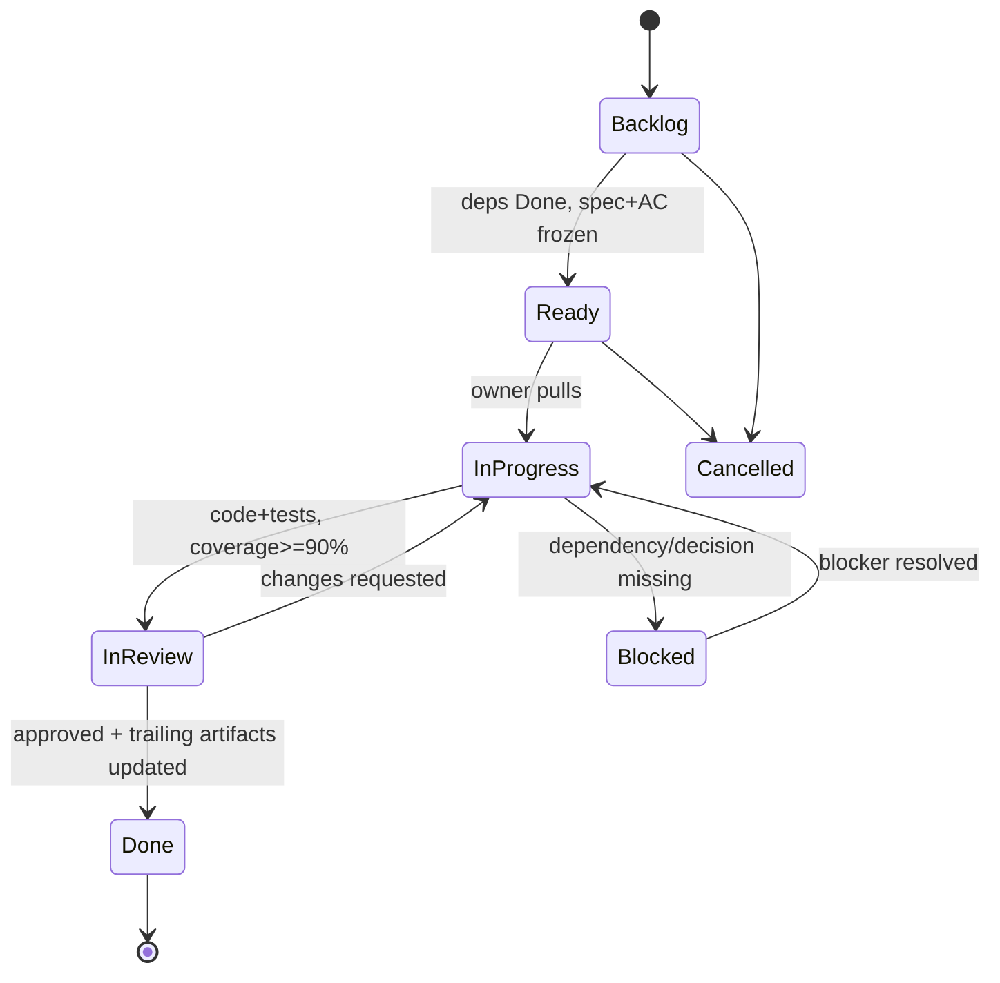

# Cowatch Task Breakdown — Overview & Conventions

> Single entry point for the engineering backlog: the task-ID scheme, task lifecycle states, ownership model, and how tasks map onto development phases and feature specs.

**Status:** CANON-COMPLIANT (planning artifact)
**Owner agent:** Chief Architect
**Last updated: 2026-06-27**

---

## 0. Purpose

This directory is the **execution plan** for Cowatch. It sits downstream of the [Architecture Canon](../context/architecture.md), the per-feature [specs](../specs/), and the [ADRs](../adr/). It exists to make the project **fully recoverable** (process rule R2) and to enforce the **per-feature workflow** (process rule R5): every feature flows `spec → tasks → tests → docs → ADR (if needed) → implement → test → history → context → repomix → project-state`.

Tasks never override the canon. On any conflict, the [Architecture Canon](../context/architecture.md) wins, then the relevant [ADR](../adr/), then the feature [spec](../specs/), and only then a task description.

### Files in this directory

| File | Granularity | Scope |
|---|---|---|
| [README.md](./README.md) (this file) | — | ID scheme, states, ownership, phase↔spec map |
| [backlog.md](./backlog.md) | Epic + Story | Every phase 0–12, each story with id, owner, deps, AC pointer |
| [phase-1-auth.md](./phase-1-auth.md) | Task (subtask) | Deep, ready-to-execute Phase 1 breakdown (the R5 reference standard) |

Each subsequent phase gets its own `phase-N-<slug>.md` deep breakdown **before** that phase begins implementation (R1: plan before code). Phase 1 is the worked example that sets the bar.

---

## 1. Task-ID Scheme

Every unit of work carries a stable, immutable id. Ids are **never reused or renumbered** — they are referenced from commits, PRs, tests, ADRs, the [history ledger](../history/decision-ledger.md), and [project-state](../project-state/).

### 1.1 Epics

```
E-<phase>            e.g. E-1  (the Authentication epic for Phase 1)
```

One epic per phase. The epic is the phase itself; it owns the phase's exit criteria.

### 1.2 Stories

```
S-<phase>-<n>        e.g. S-1-3  (Phase 1, story 3 = "Refresh rotation & reuse detection")
```

A story is a vertically sliced, demoable capability (a coherent slice of a feature). Stories are the unit listed in [backlog.md](./backlog.md). `<n>` is monotonic within a phase, starting at 1.

### 1.3 Tasks

```
T-<phase>-<n>        e.g. T-1-7  (Phase 1, task 7)
```

A task is a single PR-sized unit of implementation owned by exactly one agent, completable in one focused work session, with its own acceptance criteria, tests, and docs. Tasks are listed in the per-phase deep breakdown (e.g. [phase-1-auth.md](./phase-1-auth.md)). `<n>` is monotonic within a phase across **all** tasks (it does not restart per story); each task names its parent story.

> **Numbering rule:** within a phase, story numbers (`S-1-n`) and task numbers (`T-1-n`) are **independent sequences**. `S-1-3` and `T-1-3` are unrelated. A task always declares its parent story explicitly.

### 1.4 Subtasks / checklist items

```
T-<phase>-<n>.<m>    e.g. T-1-7.2  (the 2nd checklist item of task T-1-7)
```

Optional. Used only inside a task body as a checklist; never tracked independently in the backlog.

### 1.5 Cross-cutting and spike ids

```
X-<area>-<n>         cross-cutting/platform task   e.g. X-OBS-1 (observability bootstrap)
SPK-<phase>-<n>      timeboxed spike / research     e.g. SPK-3-1 (player drift measurement spike)
BUG-<phase>-<n>      defect discovered post-merge   e.g. BUG-1-2
```

Cross-cutting tasks (`X-*`) span phases (observability, CI, Docker baseline, security baseline) and are owned by DevOps/QA. Spikes are timeboxed, produce a written finding (often an ADR or an Open Question resolution), and never ship product code without a follow-up `T-*`.

### 1.6 Referencing convention

- Commits / PR titles: prefix with the id — `T-1-7: implement refresh rotation + reuse detection`.
- Branches: `t-1-7-refresh-rotation` (kebab, lowercased id + slug).
- Tests: each test file references the task id and the AC id it covers in a header comment.
- History ledger: every merged task appends one entry keyed by id (R3).

---

## 2. Task Lifecycle States

A task moves through a fixed state machine. The **current** state of in-flight work lives in [project-state/current-task.md](../project-state/current-task.md); the queue lives in [project-state/next-task.md](../project-state/next-task.md). This is what makes the project recoverable after a context-window reset (R2): any agent can read project-state + this scheme and resume deterministically.

| State | Meaning | Entry gate | Exit gate |
|---|---|---|---|
| `Backlog` | Identified, not yet ready to start | — | Spec + AC pointer exist; deps known |
| `Ready` | All dependencies satisfied; spec + AC frozen | Deps `Done`; spec merged | Pulled by an owner agent |
| `In Progress` | Actively being implemented | Owner assigned; branch cut | Code + tests written |
| `In Review` | PR open, CI green, awaiting review | Tests pass; coverage ≥ 90% on touched module | Approved |
| `Blocked` | Cannot proceed | A dependency/decision is missing | Blocker logged in [project-state/blockers.md](../project-state/blockers.md) and resolved |
| `Done` | Merged; docs + history + context + repomix + project-state updated | PR approved | All R5 trailing artifacts updated |
| `Cancelled` | Will not be done | Decision recorded | Reason logged in history |



### 2.1 Definition of Ready (DoR)

A task may enter `Ready` only when **all** hold:
1. Parent story and phase epic exist in [backlog.md](./backlog.md).
2. The feature **spec** exists and is frozen (R5), with an **acceptance-criteria pointer** the task can cite.
3. All dependency tasks are `Done` (or explicitly waived with a logged reason).
4. Owner agent is assignable and the task is PR-sized.

### 2.2 Definition of Done (DoD)

A task is `Done` only when **all** hold (this is the R5 trailing pipeline, non-negotiable):
1. Code merged behind passing CI.
2. Tests written and green; **coverage ≥ 90%** on the touched module(s).
3. Every acceptance criterion in the task is demonstrably met (test or documented manual check).
4. Feature **docs** updated under [docs/](../docs/).
5. **ADR** added/updated if the task changed architecture (R3/R4).
6. **History** entry appended to [history/decision-ledger.md](../history/decision-ledger.md) (R3).
7. **Context** updated if canon-adjacent ([context/architecture.md](../context/architecture.md)).
8. **repomix** snapshot regenerated under [repomix/](../repomix/) (R4).
9. **project-state** advanced ([current-task](../project-state/current-task.md), [next-task](../project-state/next-task.md), [current-phase](../project-state/current-phase.md)).

---

## 3. Ownership Model (Agent Roles)

Every task has exactly one **owner agent** (accountable) and may list **collaborators**. Roles map 1:1 to the AI agent system in the SPEC.

| Owner agent | Owns | Primary modules / packages |
|---|---|---|
| **Chief Architect** | Canon, ADRs, cross-cutting decisions, phase gates | `context/`, `adr/`, `packages/types` shape |
| **Backend Engineer** | NestJS modules, REST, persistence | `apps/server/src/modules/*`, `packages/database` |
| **Frontend Engineer** | Web app UI/UX, state, data fetching | `apps/web`, `packages/ui` |
| **Electron Engineer** | Desktop shell, IPC, PiP, auto-update | `apps/desktop` |
| **Realtime Engineer** | Transport abstraction, gateways, envelope, reconnection | `packages/realtime`, WS gateways |
| **Media Engineer** | Playback sync, YouTube provider, playlist, voting | `PlaybackModule`, `PlaylistModule`, `DiscoveryModule` (media side) |
| **Voice Engineer** | LiveKit voice/video/screen-share | `VoiceModule`, `apps/web` voice UI |
| **Social Engineer** | Friends, presence, DMs, notifications, blocks | `SocialModule`, `NotificationsModule`, `packages/social` |
| **DevOps Engineer** | Docker, CI/CD, MinIO, secrets, env, deploy targets | `docker/`, `scripts/`, infra |
| **QA Engineer** | Test strategy, coverage gates, e2e harness | `*.spec.ts`, e2e suites, [docs/TESTING.md](../docs/TESTING.md) |
| **Documentation Engineer** | Human docs, API docs, cross-links | `docs/` |
| **Historian Engineer** | History ledger, repomix, project-state hygiene | `history/`, `repomix/`, `project-state/` |

> Cross-cutting `X-*` tasks default to **DevOps** or **QA**; `SPK-*` spikes default to the **Chief Architect** unless a domain is named.

---

## 4. Phase ↔ Spec ↔ ADR ↔ Docs Map

The phase order follows the SPEC development phases (0–12). Each phase has one epic (`E-<phase>`), one or more frozen specs, the ADRs it depends on, and the human docs it must update on completion.

| Phase | Epic | Theme | Primary spec(s) | Governing ADRs | Docs touched |
|:--:|:--:|---|---|---|---|
| 0 | E-0 | Architecture & scaffolding | `specs/architecture.md` (canon-derived) | [001](../adr/ADR-001-monorepo.md) [002](../adr/ADR-002-nestjs.md) [003](../adr/ADR-003-prisma.md) [004](../adr/ADR-004-realtime-transport.md) [009](../adr/ADR-009-minio-storage.md) [010](../adr/ADR-010-docker-first.md) | [ARCHITECTURE](../docs/ARCHITECTURE.md) [DATABASE](../docs/DATABASE.md) [DEPLOYMENT](../docs/DEPLOYMENT.md) |
| 1 | E-1 | Authentication | `specs/auth.md` → [docs/AUTH.md](../docs/AUTH.md) | [008](../adr/ADR-008-auth-tokens.md) | [AUTH](../docs/AUTH.md) [SECURITY](../docs/SECURITY.md) [API](../docs/API.md) |
| 2 | E-2 | Rooms & memberships | `specs/rooms.md` | [002](../adr/ADR-002-nestjs.md) [003](../adr/ADR-003-prisma.md) | [DOMAIN](../docs/DOMAIN.md) [PERMISSIONS](../docs/PERMISSIONS.md) [API](../docs/API.md) |
| 3 | E-3 | YouTube sync | `specs/sync.md` | [004](../adr/ADR-004-realtime-transport.md) [007](../adr/ADR-007-playback-sync.md) | [SYNC](../docs/SYNC.md) [REALTIME](../docs/REALTIME.md) [EVENTS](../docs/EVENTS.md) |
| 4 | E-4 | Chat | `specs/chat.md` | [004](../adr/ADR-004-realtime-transport.md) | [EVENTS](../docs/EVENTS.md) [REALTIME](../docs/REALTIME.md) |
| 5 | E-5 | Friends & social graph | `specs/social.md` | [003](../adr/ADR-003-prisma.md) | [SOCIAL](../docs/SOCIAL.md) [DOMAIN](../docs/DOMAIN.md) |
| 6 | E-6 | Notifications | `specs/notifications.md` | [004](../adr/ADR-004-realtime-transport.md) | [SOCIAL](../docs/SOCIAL.md) [EVENTS](../docs/EVENTS.md) |
| 7 | E-7 | Discovery & search | `specs/discovery.md` | [003](../adr/ADR-003-prisma.md) | [DOMAIN](../docs/DOMAIN.md) [API](../docs/API.md) |
| 8 | E-8 | Voice channels | `specs/voice.md` | [005](../adr/ADR-005-livekit.md) | [LIVEKIT](../docs/LIVEKIT.md) |
| 9 | E-9 | Video & screen share | `specs/video.md` | [005](../adr/ADR-005-livekit.md) | [LIVEKIT](../docs/LIVEKIT.md) |
| 10 | E-10 | Electron desktop | `specs/desktop.md` | [006](../adr/ADR-006-electron.md) | [ARCHITECTURE](../docs/ARCHITECTURE.md) [DEPLOYMENT](../docs/DEPLOYMENT.md) |
| 11 | E-11 | Testing & hardening | `specs/testing.md` → [docs/TESTING.md](../docs/TESTING.md) | — | [TESTING](../docs/TESTING.md) [SECURITY](../docs/SECURITY.md) |
| 12 | E-12 | Deployment | `specs/deployment.md` → [docs/DEPLOYMENT.md](../docs/DEPLOYMENT.md) | [010](../adr/ADR-010-docker-first.md) | [DEPLOYMENT](../docs/DEPLOYMENT.md) |

> Specs marked `→ docs/X.md` are already drafted under [docs/](../docs/) and the `specs/*` file is the frozen requirements extract. Several ADRs (004, 007, 008, 009, 010) are **canonical** per [the canon §2](../context/architecture.md#2-canonical-architecture-decisions-one-line--adr-id) and are linked here at their canonical kebab paths; their files are authored in Phase 0.

### 4.1 Phase exit gate

A phase epic `E-<phase>` is `Done` only when: all its `Ready`-eligible stories are `Done`, the listed docs are updated, coverage ≥ 90% on the phase's modules, and [project-state/current-phase.md](../project-state/current-phase.md) is advanced. Phases are sequential by default; explicitly noted stories may run in parallel where dependencies allow (see [backlog.md](./backlog.md) dependency columns).

---

## 5. Acceptance-Criteria Pointers

Tasks do not restate acceptance criteria in full where a spec already owns them — they **point** to the canonical AC. The pointer format is:

```
AC-PTR: <doc-relative-path>#<anchor> :: <AC-id>[, <AC-id>...]
```

Example (Phase 1): `AC-PTR: ../docs/AUTH.md#20-acceptance-criteria :: AC-2, AC-3` ties a task to the refresh-rotation criteria in [docs/AUTH.md](../docs/AUTH.md#20-acceptance-criteria). When a task introduces criteria not yet in a spec, it lists them inline **and** the Documentation Engineer back-ports them into the spec before the task reaches `Done`.

---

## 6. How to use this directory (agent runbook)

1. Read [project-state/current-phase.md](../project-state/current-phase.md) → know the active phase.
2. Read [project-state/next-task.md](../project-state/next-task.md) → pull the next `Ready` task.
3. Open the per-phase breakdown (e.g. [phase-1-auth.md](./phase-1-auth.md)) → get description, deps, AC pointer, test + doc requirements.
4. Confirm DoR (§2.1). Cut branch `t-<phase>-<n>-<slug>`.
5. Implement → tests → docs. Drive to DoD (§2.2).
6. On merge, append history, regen repomix, advance project-state.

---

### Related documents

- [Architecture Canon](../context/architecture.md) — single source of truth
- [Backlog](./backlog.md) — all phases at epic+story granularity
- [Phase 1 — Authentication](./phase-1-auth.md) — the R5 reference breakdown
- [Decision ledger](../history/decision-ledger.md) — append-only history (R3)
- [project-state/](../project-state/current-phase.md) — recoverable phase/task state (R2)
