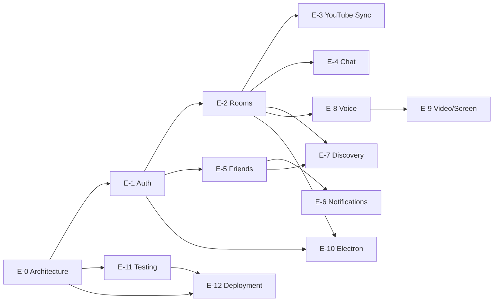

# Cowatch Backlog — All Phases (Epic + Story)

> The complete phased backlog (phases 0–12) at epic and story granularity. Each story carries an id, owner agent, dependencies, and an acceptance-criteria pointer. Task-level detail lives in the per-phase breakdowns.

**Status:** CANON-COMPLIANT (planning artifact)
**Owner agent:** Chief Architect
**Last updated: 2026-06-27**

---

## How to read this file

- **Id scheme** and **states** are defined in [README.md](./README.md). Epics are `E-<phase>`, stories `S-<phase>-<n>`.
- **Owner** is the single accountable agent (see [README §3](./README.md#3-ownership-model-agent-roles)).
- **Deps** lists blocking stories/epics (or `—` if none). Cross-cutting prerequisites are `X-*` ids.
- **AC pointer** uses the format from [README §5](./README.md#5-acceptance-criteria-pointers) and links into a frozen spec/doc.
- Default execution is **sequential by phase**; intra-phase stories run in parallel where deps allow.
- On any conflict the [Architecture Canon](../context/architecture.md) wins.

### Dependency overview

---

## Cross-cutting epic — X (spans all phases)

Owner: **DevOps** / **QA** unless noted. These underpin every phase and are referenced as dependencies.

| Story | Title | Owner | Deps | AC pointer |
|---|---|---|---|---|
| X-OBS-1 | Structured logging (pino), `x-correlation-id` propagation, ULID correlation | DevOps | E-0 | `../docs/ARCHITECTURE.md#observability` |
| X-OBS-2 | Health endpoints `/health/live` `/health/ready` + Prometheus metrics on every service | DevOps | X-OBS-1 | `../docs/DEPLOYMENT.md#health--metrics` |
| X-SEC-1 | Security baseline: Helmet, CORS allowlist, CSRF on cookie mutations, rate-limit middleware | Backend | E-0 | `../docs/SECURITY.md#baseline-controls` |
| X-SEC-2 | Secrets management via env/secret store; no secrets committed; MinIO least-privilege buckets | DevOps | E-0, [ADR-009](../adr/ADR-009-minio-storage.md) | `../docs/SECURITY.md#secrets` |
| X-CI-1 | CI pipeline: Turborepo cached lint/typecheck/test, 90% coverage gate | DevOps | E-0 | `../docs/TESTING.md#ci-gates` |
| X-ERR-1 | Canonical REST error envelope + `system:error` realtime envelope + `code` enum | Backend | E-0 | `../docs/API.md#error-envelope` |

---

## Phase 0 — Architecture & Scaffolding · `E-0`

**Goal:** stand up the monorepo, shared packages, Prisma/Mongo, realtime abstraction skeleton, Docker baseline. No product features. **Exit:** every app boots in Docker; `packages/types` compiles; CI green.

| Story | Title | Owner | Deps | AC pointer |
|---|---|---|---|---|
| S-0-1 | Turborepo + pnpm workspaces; `apps/{web,desktop,server,landing}`, `packages/{ui,auth,database,realtime,social,sdk,shared,types}` | Chief Architect | [ADR-001](../adr/ADR-001-monorepo.md) | `../docs/ARCHITECTURE.md#monorepo-layout` |
| S-0-2 | NestJS server skeleton (platform-native, **no Express adapter**), module map stubs, `/api/v1` global prefix | Backend | S-0-1, [ADR-002](../adr/ADR-002-nestjs.md) | `../docs/ARCHITECTURE.md#server-app` |
| S-0-3 | Prisma schema bootstrap over MongoDB; ObjectId+`@@map(snake_case)` conventions; client re-export from `packages/database` | Backend | S-0-1, [ADR-003](../adr/ADR-003-prisma.md) | `../docs/DATABASE.md#conventions` |
| S-0-4 | `packages/types`: canonical domain + DTO + event types (single source of truth) | Chief Architect | S-0-1 | `../context/architecture.md#3-naming-conventions` |
| S-0-5 | `packages/realtime`: `RealtimeEnvelope`, `RealtimeTransport` interface, `NativeWsTransport` skeleton, reconnection contract | Realtime | S-0-4, [ADR-004](../adr/ADR-004-realtime-transport.md) | `../docs/REALTIME.md#transport-interface` |
| S-0-6 | `packages/shared`: id utils (ULID), error classes, config loader | Backend | S-0-1 | `../docs/ARCHITECTURE.md#shared-utils` |
| S-0-7 | `packages/sdk`: typed API client scaffold consuming `packages/types` | Frontend | S-0-4 | `../docs/API.md#sdk` |
| S-0-8 | Web app scaffold (Vite + Tailwind + shadcn/ui + Zustand + TanStack Query) | Frontend | S-0-1 | `../docs/ARCHITECTURE.md#web-app` |
| S-0-9 | Landing site scaffold | Frontend | S-0-1 | `../docs/ARCHITECTURE.md#landing` |
| S-0-10 | Docker-first baseline: per-service Dockerfiles, `docker-compose` (server, mongo, minio), dev parity | DevOps | S-0-2, [ADR-010](../adr/ADR-010-docker-first.md), [ADR-009](../adr/ADR-009-minio-storage.md) | `../docs/DEPLOYMENT.md#local-docker` |
| S-0-11 | MinIO `StorageModule` + signed-URL upload contract | DevOps | S-0-10 | `../docs/DEPLOYMENT.md#object-storage` |
| S-0-12 | Author canonical ADRs not yet on disk: 004, 007, 008, 009, 010 | Chief Architect | — | `../context/architecture.md#2-canonical-architecture-decisions-one-line--adr-id` |

---

## Phase 1 — Authentication · `E-1`

**Goal:** full auth surface — email/password, Google OAuth, guests, JWT+rotating refresh, device sessions, email verification, password reset, TOTP 2FA, session revocation, WS handshake auth. **Exit:** all of AUTH `AC-1…AC-12` pass; coverage ≥ 90% on `AuthModule`.

> Deep task-level breakdown: **[phase-1-auth.md](./phase-1-auth.md)** (the R5 reference standard).

| Story | Title | Owner | Deps | AC pointer |
|---|---|---|---|---|
| S-1-1 | Identity model & account subtypes (`registered`/`guest`); `users`, `sessions`, `email_tokens`, `password_resets` Prisma models | Backend | E-0, [ADR-008](../adr/ADR-008-auth-tokens.md) | `../docs/AUTH.md#20-acceptance-criteria :: AC-1, AC-5` |
| S-1-2 | Token model: RS256 access JWT (15 min) + opaque rotating refresh (30 d); cookie strategy | Backend | S-1-1 | `../docs/AUTH.md#20-acceptance-criteria :: AC-1` |
| S-1-3 | Refresh rotation + reuse detection (family revoke on theft) | Backend | S-1-2 | `../docs/AUTH.md#20-acceptance-criteria :: AC-2, AC-3` |
| S-1-4 | Email/password registration & login (argon2) | Backend | S-1-2 | `../docs/AUTH.md#20-acceptance-criteria :: AC-1` |
| S-1-5 | Google OAuth (Auth-Code + PKCE, state/nonce, auto-link policy) | Backend | S-1-2, S-0-11 | `../docs/AUTH.md#20-acceptance-criteria :: AC-4` |
| S-1-6 | Guest accounts + upgrade-to-registered (preserve `User.id`) | Backend | S-1-2, S-1-4 | `../docs/AUTH.md#20-acceptance-criteria :: AC-5` |
| S-1-7 | Email verification (single-use, 24 h, hashed; block sensitive writes) | Backend | S-1-4 | `../docs/AUTH.md#20-acceptance-criteria :: AC-6` |
| S-1-8 | Password reset (single-use, 1 h, non-enumerable, revoke all sessions) | Backend | S-1-4 | `../docs/AUTH.md#20-acceptance-criteria :: AC-7` |
| S-1-9 | TOTP 2FA enroll/challenge/disable + recovery codes | Backend | S-1-4 | `../docs/AUTH.md#20-acceptance-criteria :: AC-8` |
| S-1-10 | Device sessions: list/revoke one/revoke others; immediate invalidation (denylist) | Backend | S-1-3 | `../docs/AUTH.md#20-acceptance-criteria :: AC-9` |
| S-1-11 | Auth guards (`JwtAuthGuard`, `RolesGuard`) + rate limiting + canon error envelope | Backend | S-1-2, X-SEC-1, X-ERR-1 | `../docs/AUTH.md#20-acceptance-criteria :: AC-10` |
| S-1-12 | Realtime WS handshake auth + mid-stream refresh + force-close on revoke | Realtime | S-1-3, S-1-10, S-0-5 | `../docs/AUTH.md#20-acceptance-criteria :: AC-11` |
| S-1-13 | Web auth UI + `packages/auth` client helpers (no token in `localStorage`) | Frontend | S-1-4, S-0-7 | `../docs/AUTH.md#20-acceptance-criteria :: AC-12` |
| S-1-14 | `AuthModule` test suite + 90% coverage; security hardening pass | QA | S-1-1…S-1-13 | `../docs/AUTH.md#20-acceptance-criteria :: AC-12` |

---

## Phase 2 — Rooms & Memberships · `E-2`

**Goal:** room lifecycle (public/private/password, permanent/temporary), memberships, roles, permission matrix, ownership-transfer algorithm, invite links. **Exit:** permission matrix enforced server-side; ownership transfer deterministic.

| Story | Title | Owner | Deps | AC pointer |
|---|---|---|---|---|
| S-2-1 | `rooms` + `memberships` models; visibility + permanence; denorm snapshots (`ownerId/ownerDisplayName`, `viewerCount`, `currentVideoTitle`) | Backend | E-1 | `../docs/DOMAIN.md#rooms` |
| S-2-2 | Room CRUD REST (`/api/v1/rooms`, nested members) | Backend | S-2-1 | `../docs/API.md#rooms` |
| S-2-3 | Join flows: public, password, private + join approval queue | Backend | S-2-2 | `../docs/PERMISSIONS.md#join-approval` |
| S-2-4 | Role model (`RoomRole`) + permission matrix enforcement (`PermissionsGuard`) | Backend | S-2-1 | `../docs/PERMISSIONS.md#matrix` |
| S-2-5 | Moderation: kick, ban, mute, timeout; mute/ban state on membership | Backend | S-2-4 | `../docs/PERMISSIONS.md#moderation` |
| S-2-6 | Ownership-transfer algorithm (grace window → moderator → oldest member; temp teardown) | Backend | S-2-4 | `../context/architecture.md#6-permission-model` |
| S-2-7 | Invite links (expiring / single-use tokens) | Backend | S-2-2 | `../docs/DOMAIN.md#invite-links` |
| S-2-8 | Realtime room events (`room:member:join/leave`, `room:ownership:transfer`, `room:settings:update`) | Realtime | S-2-2, E-1·S-1-12 | `../docs/EVENTS.md#room-namespace` |
| S-2-9 | Web room shell UI (member list, settings, roles) | Frontend | S-2-2 | `../docs/DOMAIN.md#rooms` |
| S-2-10 | Rooms test suite + 90% coverage | QA | S-2-1…S-2-9 | `../docs/TESTING.md#rooms` |

---

## Phase 3 — YouTube Sync · `E-3`

**Goal:** server-authoritative playback sync (drift < 500 ms), YouTube provider, playlist/queue, voting, skip-vote, autoplay. **Exit:** steady-state drift < 500 ms; sync-authority modes enforced.

| Story | Title | Owner | Deps | AC pointer |
|---|---|---|---|---|
| S-3-1 | `PlaybackState` model + server-authoritative clock; `serverEpochMs` stamping | Media | E-2 | `../docs/SYNC.md#server-authoritative-clock` |
| S-3-2 | `PlaybackModule` gateway: `playback:play/pause/seek/rate`, authority enforcement (`FORBIDDEN_SYNC`) | Media | S-3-1, [ADR-007](../adr/ADR-007-playback-sync.md) | `../docs/SYNC.md#authority-enforcement` |
| S-3-3 | `playback:sync` heartbeat (2 s + on-change); late-joiner snapshot | Media | S-3-2 | `../docs/SYNC.md#heartbeat` |
| S-3-4 | Client drift correction (rate-glide 5–10% / hard-seek thresholds) + clock-offset ping/pong | Media | S-3-3 | `../docs/SYNC.md#drift-correction` |
| S-3-5 | Sync-authority modes per room (`owner_only`/`owner_moderators`/`everyone`) | Media | S-3-2 | `../context/architecture.md#7-sync-algorithm` |
| S-3-6 | YouTube provider adapter + `queue_items`/`playlists` models | Media | E-2 | `../docs/DOMAIN.md#media` |
| S-3-7 | Playlist ops: add, drag-reorder, remove; playlist lock | Media | S-3-6 | `../docs/PERMISSIONS.md#playlist-control` |
| S-3-8 | Voting + skip-vote (synced outcome) + autoplay advance | Media | S-3-6, S-3-3 | `../docs/SYNC.md#synced-events` |
| S-3-9 | Web YouTube player integration (synced controls; local-only volume/quality/captions) | Frontend | S-3-4 | `../docs/SYNC.md#not-synced` |
| S-3-10 | Sync test suite (drift simulation) + 90% coverage | QA | S-3-1…S-3-9 | `../docs/TESTING.md#sync` |

---

## Phase 4 — Chat · `E-4`

**Goal:** room channel chat + reactions, mentions, typing indicators, GIF/emoji attachments, chat lock. **Exit:** messages persist + fan out via realtime; chat lock honors permissions.

| Story | Title | Owner | Deps | AC pointer |
|---|---|---|---|---|
| S-4-1 | `messages` model (referenced, indexed `(roomId, createdAt)`); denorm `authorDisplayName/authorAvatarUrl` | Backend | E-2 | `../docs/DOMAIN.md#messages` |
| S-4-2 | `ChatModule` gateway: `chat:message:new/edit/delete` | Realtime | S-4-1, E-1·S-1-12 | `../docs/EVENTS.md#chat-namespace` |
| S-4-3 | Reactions (capped, embedded) `chat:reaction:add` + mentions | Backend | S-4-1 | `../docs/DOMAIN.md#reactions` |
| S-4-4 | Typing indicators `chat:typing` | Realtime | S-4-2 | `../docs/EVENTS.md#chat-typing` |
| S-4-5 | GIF/emoji attachments (provider + MinIO caching) | Backend | S-4-1, S-0-11 | `../docs/DOMAIN.md#attachments` |
| S-4-6 | Chat lock toggle (Owner/Moderator); Guest gating | Backend | S-4-1, E-2·S-2-4 | `../docs/PERMISSIONS.md#chat-lock` |
| S-4-7 | Web chat UI (history, reactions, typing, mentions) | Frontend | S-4-2 | `../docs/DOMAIN.md#messages` |
| S-4-8 | Chat test suite + 90% coverage | QA | S-4-1…S-4-7 | `../docs/TESTING.md#chat` |

---

## Phase 5 — Friends & Social Graph · `E-5`

**Goal:** friends, friend requests, presence, activity feed, DMs, blocks, user profiles. **Exit:** mutual friendship + presence + DM threads functional; blocks suppress across surfaces.

| Story | Title | Owner | Deps | AC pointer |
|---|---|---|---|---|
| S-5-1 | `friendships` (unique `(userIdA,userIdB)`) + `friend_requests` models | Social | E-1 | `../docs/SOCIAL.md#friendship-model` |
| S-5-2 | Friend request lifecycle `social:friend:request/accept` | Social | S-5-1 | `../docs/EVENTS.md#social-namespace` |
| S-5-3 | Presence (`online/idle/dnd/offline` + activity) `presence:update` | Social | E-1·S-1-12 | `../docs/SOCIAL.md#presence` |
| S-5-4 | DM threads (`dm_threads`, `messages` DM-scoped) | Social | S-5-1, E-4·S-4-1 | `../docs/SOCIAL.md#direct-messages` |
| S-5-5 | Blocks (`blocks`, directed suppression across social surfaces) | Social | S-5-1 | `../docs/SOCIAL.md#blocks` |
| S-5-6 | User profiles + avatar upload (MinIO signed URL) | Social | E-1, S-0-11 | `../docs/SOCIAL.md#profiles` |
| S-5-7 | Activity feed | Social | S-5-2, S-5-3 | `../docs/SOCIAL.md#activity-feed` |
| S-5-8 | Web social UI (friends list, presence, DMs, profile) | Frontend | S-5-2 | `../docs/SOCIAL.md#friendship-model` |
| S-5-9 | Social test suite + 90% coverage | QA | S-5-1…S-5-8 | `../docs/TESTING.md#social` |

---

## Phase 6 — Notifications · `E-6`

**Goal:** notification feed for all canon types. **Exit:** every canon notification type emitted + persisted + delivered realtime.

| Story | Title | Owner | Deps | AC pointer |
|---|---|---|---|---|
| S-6-1 | `notifications` model + index `(userId, readAt, createdAt)` | Social | E-5 | `../docs/SOCIAL.md#notifications` |
| S-6-2 | Notification producers for all types (`friend.online`, `friend.room_started`, `friend.invitation`, `mention`, `dm`, `room.ownership_transfer`, `room.user_joined`) | Social | S-6-1, E-2, E-4, E-5 | `../context/architecture.md#1-glossary-of-core-domain-terms` |
| S-6-3 | `notification:new` realtime delivery + feed read/unread | Realtime | S-6-1, E-1·S-1-12 | `../docs/EVENTS.md#notification-namespace` |
| S-6-4 | Web notification UI (feed, badges, mark-read) | Frontend | S-6-3 | `../docs/SOCIAL.md#notifications` |
| S-6-5 | Notifications test suite + 90% coverage | QA | S-6-1…S-6-4 | `../docs/TESTING.md#notifications` |

---

## Phase 7 — Discovery & Search · `E-7`

**Goal:** room discovery list + unified search. **Exit:** discovery shows name/video/viewers/tags/NSFW/friends-inside; search spans users/friends/rooms/messages/videos/tags.

| Story | Title | Owner | Deps | AC pointer |
|---|---|---|---|---|
| S-7-1 | `DiscoveryModule`: room list using denorm fields + `rooms (visibility, isActive)` index | Backend | E-2 | `../docs/DOMAIN.md#discovery` |
| S-7-2 | Discovery metadata: tags, NSFW flag, friends-inside computation | Backend | S-7-1, E-5 | `../docs/DOMAIN.md#discovery` |
| S-7-3 | Unified search (users, friends, rooms, messages, videos, tags) + search indexes | Backend | S-7-1, E-4, E-5 | `../docs/API.md#search` |
| S-7-4 | Web discovery + search UI | Frontend | S-7-1, S-7-3 | `../docs/DOMAIN.md#discovery` |
| S-7-5 | Discovery test suite + 90% coverage | QA | S-7-1…S-7-4 | `../docs/TESTING.md#discovery` |

---

## Phase 8 — Voice Channels · `E-8`

**Goal:** LiveKit-backed multi-channel voice, public + password-protected. **Exit:** users join/leave voice channels; tokens minted server-side; events fan out.

| Story | Title | Owner | Deps | AC pointer |
|---|---|---|---|---|
| S-8-1 | `voice_channels` model (visibility `public`/`password`) | Voice | E-2 | `../docs/LIVEKIT.md#channel-model` |
| S-8-2 | `VoiceModule`: LiveKit token minting + join/leave authorization | Voice | S-8-1, [ADR-005](../adr/ADR-005-livekit.md) | `../docs/LIVEKIT.md#token-minting` |
| S-8-3 | Realtime `voice:channel:join/leave` events | Realtime | S-8-2, E-1·S-1-12 | `../docs/EVENTS.md#voice-namespace` |
| S-8-4 | Password-protected channel join flow | Voice | S-8-2 | `../docs/LIVEKIT.md#password-channels` |
| S-8-5 | Web voice UI (channel list, join, participant tiles, mute) | Frontend | S-8-2 | `../docs/LIVEKIT.md#client` |
| S-8-6 | Voice test suite + 90% coverage | QA | S-8-1…S-8-5 | `../docs/TESTING.md#voice` |

---

## Phase 9 — Video & Screen Share · `E-9`

**Goal:** video channels + screen sharing over LiveKit. **Exit:** camera + screen-share tracks publish/subscribe within a channel.

| Story | Title | Owner | Deps | AC pointer |
|---|---|---|---|---|
| S-9-1 | Video track publish/subscribe (camera) | Voice | E-8 | `../docs/LIVEKIT.md#video` |
| S-9-2 | Screen-share track + source selection | Voice | E-8 | `../docs/LIVEKIT.md#screen-share` |
| S-9-3 | Web video/screen UI (grid, pin, share picker) | Frontend | S-9-1, S-9-2 | `../docs/LIVEKIT.md#client` |
| S-9-4 | Video/screen test suite + 90% coverage | QA | S-9-1…S-9-3 | `../docs/TESTING.md#video` |

---

## Phase 10 — Electron Desktop · `E-10`

**Goal:** Electron shell wrapping the web app with PiP, push, HW accel, auto-update, IPC. **Exit:** signed installers build via electron-builder; auto-update channel works.

| Story | Title | Owner | Deps | AC pointer |
|---|---|---|---|---|
| S-10-1 | Electron shell loading `apps/web`; secure preload + IPC bridge | Electron | E-1, E-2, [ADR-006](../adr/ADR-006-electron.md) | `../docs/ARCHITECTURE.md#desktop-app` |
| S-10-2 | Picture-in-picture for synced player | Electron | S-10-1, E-3 | `../docs/ARCHITECTURE.md#desktop-pip` |
| S-10-3 | Native push notifications bridging notification feed | Electron | S-10-1, E-6 | `../docs/ARCHITECTURE.md#desktop-push` |
| S-10-4 | Hardware acceleration + perf flags | Electron | S-10-1 | `../docs/ARCHITECTURE.md#desktop-hwaccel` |
| S-10-5 | Auto-update via electron-builder + release channel | Electron | S-10-1 | `../docs/DEPLOYMENT.md#desktop-autoupdate` |
| S-10-6 | Desktop packaging (win/mac/linux) + signing | DevOps | S-10-5 | `../docs/DEPLOYMENT.md#desktop-packaging` |
| S-10-7 | Desktop test/smoke suite | QA | S-10-1…S-10-6 | `../docs/TESTING.md#desktop` |

---

## Phase 11 — Testing & Hardening · `E-11`

**Goal:** raise and enforce the 90% bar across the monorepo; e2e flows; load + drift + security tests. **Exit:** coverage ≥ 90% repo-wide; e2e green; security review passed.

| Story | Title | Owner | Deps | AC pointer |
|---|---|---|---|---|
| S-11-1 | Unit/integration coverage backfill to ≥ 90% per package | QA | E-0…E-10 | `../docs/TESTING.md#coverage-policy` |
| S-11-2 | E2e flows (auth → room → sync → chat → voice) | QA | E-1…E-9 | `../docs/TESTING.md#e2e` |
| S-11-3 | Sync drift / load test harness (< 500 ms under N clients) | QA | E-3 | `../docs/TESTING.md#load` |
| S-11-4 | Security review pass (authn/z, rate limits, CSRF, signed URLs) | QA | X-SEC-1, X-SEC-2, E-1 | `../docs/SECURITY.md#review-checklist` |
| S-11-5 | Realtime reconnection/resume test matrix | QA | E-0·S-0-5 | `../docs/REALTIME.md#reconnection` |

---

## Phase 12 — Deployment · `E-12`

**Goal:** Docker-first deploy across local / VPS / Vercel / production with parity. **Exit:** prod stack deploys reproducibly; health/metrics green; rollback documented.

| Story | Title | Owner | Deps | AC pointer |
|---|---|---|---|---|
| S-12-1 | Production compose / stack (server, mongo, minio, livekit, reverse proxy + TLS) | DevOps | E-0·S-0-10, [ADR-010](../adr/ADR-010-docker-first.md) | `../docs/DEPLOYMENT.md#production-stack` |
| S-12-2 | VPS deploy target (native WS realtime transport) | DevOps | S-12-1 | `../docs/DEPLOYMENT.md#vps` |
| S-12-3 | Vercel target for web/landing + serverless transport adapter config | DevOps | S-12-1, E-0·S-0-5 | `../docs/DEPLOYMENT.md#vercel` |
| S-12-4 | Secrets/env per environment; MinIO bucket policies | DevOps | X-SEC-2 | `../docs/SECURITY.md#secrets` |
| S-12-5 | Observability in prod (metrics, health, log shipping) | DevOps | X-OBS-2 | `../docs/DEPLOYMENT.md#observability` |
| S-12-6 | Release runbook + rollback + backup/restore (mongo, minio) | DevOps | S-12-1 | `../docs/DEPLOYMENT.md#runbook` |

---

## Backlog hygiene

- New work is appended with the next free id in its phase; ids are never recycled (see [README §1.6](./README.md#16-referencing-convention)).
- When a story is decomposed, its tasks live in the per-phase breakdown and reference the story id.
- Status of each story is **not** tracked here (this file is the static plan); live status lives in [project-state/](../project-state/current-phase.md) (R2).

### Related documents

- [Task scheme & states](./README.md)
- [Phase 1 deep breakdown](./phase-1-auth.md)
- [Architecture Canon](../context/architecture.md)
- [Decision ledger](../history/decision-ledger.md)
