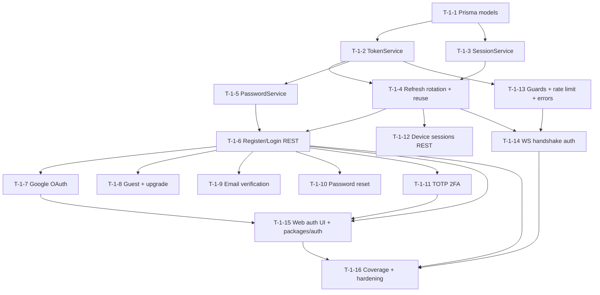

# Phase 1 — Authentication · Task Breakdown (`E-1`)

> Ready-to-execute, task-level decomposition of the Authentication phase. Each task carries an id, description, owner agent, dependencies, acceptance criteria (with pointer), test requirements, and doc requirements. This is the R5 reference standard every later phase breakdown follows.

**Status:** READY (planning artifact — implementation not started; R1)
**Owner agent:** Backend Engineer (phase lead) · Chief Architect (gate)
**Last updated: 2026-06-27**

---

## 0. Phase scope & exit criteria

Phase 1 delivers the full authentication surface defined by the [Architecture Canon §8](../context/architecture.md#8-auth--token-model-adr-008) and detailed in [docs/AUTH.md](../docs/AUTH.md), governed by [ADR-008 — Auth tokens](../adr/ADR-008-auth-tokens.md).

**In scope:** email/password (argon2), Google OAuth (Auth-Code + PKCE), guest accounts + upgrade, RS256 access JWT (15 min), opaque rotating refresh (30 d) with reuse detection, device sessions + revocation, email verification, password reset, TOTP 2FA + recovery codes, auth guards + rate limiting + canon error envelope, and realtime WS handshake auth.

**Out of scope (logged):** WebAuthn/passkeys, magic-link/passwordless — see [docs/AUTH.md §21 Open Questions](../docs/AUTH.md#21-open-questions) OQ-3/OQ-4.

### Exit gate (phase `E-1` is `Done` when)

1. AUTH acceptance criteria **AC-1 … AC-12** all pass ([docs/AUTH.md §20](../docs/AUTH.md#20-acceptance-criteria)).
2. `AuthModule` test coverage **≥ 90%** (canon §10; AC-12).
3. No access token in `localStorage`/`sessionStorage`; no token/credential ever logged (AC-12).
4. Trailing R5 artifacts updated: [docs/AUTH.md](../docs/AUTH.md) + [docs/SECURITY.md](../docs/SECURITY.md) current, history entry appended, repomix regenerated, [project-state/current-phase.md](../project-state/current-phase.md) advanced.

### Module map (canon-fixed)

All work lands in `apps/server/src/modules/auth/` (`AuthModule`), with client helpers in `packages/auth`, types in `packages/types`, and persistence in `packages/database`. Services per [docs/AUTH.md §2](../docs/AUTH.md#2-module--component-map): `AuthService`, `TokenService`, `SessionService`, `PasswordService`, `OAuthService`, `TotpService`, `MailService`, guards `JwtAuthGuard`/`RolesGuard`.

### Cross-cutting prerequisites (from [backlog.md](./backlog.md))

`X-SEC-1` (Helmet/CORS/CSRF/rate-limit middleware), `X-ERR-1` (canon error envelope + code enum), `X-OBS-1` (pino + ULID correlation) must be `Done` or co-delivered. Phase 0 `S-0-1…S-0-7`, `S-0-11`, `S-0-12` (ADR-008 authored) are hard deps.

### Conventions every task in this phase obeys

- Ids cross the service boundary as **strings**, never `ObjectId`; correlation/message ids are **ULID** (canon §10, [docs/AUTH.md §2 boundary rule](../docs/AUTH.md#2-module--component-map)).
- All DTOs validated with `class-validator`; non-2xx responses use the canon error envelope with a ULID `correlationId` (canon §10).
- Files follow canon naming: `*.controller.ts`, `*.service.ts`, `*.guard.ts`, `*.dto.ts`, `*.schema.ts`, `*.spec.ts` (canon §3).
- Shared types (entities, DTOs, event payloads) are defined **once** in `packages/types` and imported everywhere (canon §3).
- **Definition of Done** for every task = [README §2.2](./README.md#22-definition-of-done-dod) (code + tests ≥ 90% + docs + ADR-if-needed + history + context + repomix + project-state).

---

## Task index

| Task | Title | Owner | Story | Deps | AC pointer |
|---|---|---|---|---|---|
| [T-1-1](#t-1-1--identity--auth-data-model-prisma) | Identity & auth data model (Prisma) | Backend | S-1-1 | E-0 | AC-1, AC-5 |
| [T-1-2](#t-1-2--tokenservice-rs256-access--opaque-refresh) | TokenService (RS256 access + opaque refresh) | Backend | S-1-2 | T-1-1 | AC-1 |
| [T-1-3](#t-1-3--sessionservice-device-sessions--denylist) | SessionService (device sessions + denylist) | Backend | S-1-2 | T-1-1 | AC-1, AC-9 |
| [T-1-4](#t-1-4--refresh-rotation--reuse-detection) | Refresh rotation + reuse detection | Backend | S-1-3 | T-1-2, T-1-3 | AC-2, AC-3 |
| [T-1-5](#t-1-5--passwordservice-argon2) | PasswordService (argon2) | Backend | S-1-4 | T-1-1 | AC-1 |
| [T-1-6](#t-1-6--emailpassword-registration--login-rest) | Email/password registration & login REST | Backend | S-1-4 | T-1-4, T-1-5 | AC-1 |
| [T-1-7](#t-1-7--google-oauth-auth-code--pkce) | Google OAuth (Auth-Code + PKCE) | Backend | S-1-5 | T-1-6, S-0-11 | AC-4 |
| [T-1-8](#t-1-8--guest-accounts--upgrade-to-registered) | Guest accounts + upgrade-to-registered | Backend | S-1-6 | T-1-6 | AC-5 |
| [T-1-9](#t-1-9--email-verification) | Email verification | Backend | S-1-7 | T-1-6 | AC-6 |
| [T-1-10](#t-1-10--password-reset) | Password reset | Backend | S-1-8 | T-1-6 | AC-7 |
| [T-1-11](#t-1-11--totp-2fa-enroll--challenge--disable) | TOTP 2FA (enroll/challenge/disable) | Backend | S-1-9 | T-1-6 | AC-8 |
| [T-1-12](#t-1-12--device-session-management-rest) | Device-session management REST | Backend | S-1-10 | T-1-4 | AC-9 |
| [T-1-13](#t-1-13--guards-rate-limiting--error-envelope) | Guards, rate limiting & error envelope | Backend | S-1-11 | T-1-2, X-SEC-1, X-ERR-1 | AC-10 |
| [T-1-14](#t-1-14--realtime-ws-handshake-auth) | Realtime WS handshake auth | Realtime | S-1-12 | T-1-4, T-1-12, S-0-5 | AC-11 |
| [T-1-15](#t-1-15--web-auth-ui--packagesauth-helpers) | Web auth UI + `packages/auth` helpers | Frontend | S-1-13 | T-1-6, T-1-7, T-1-11 | AC-12 |
| [T-1-16](#t-1-16--coverage-gate--security-hardening) | Coverage gate + security hardening | QA | S-1-14 | T-1-1…T-1-15 | AC-12 |

> All AC pointers resolve to [docs/AUTH.md §20 Acceptance Criteria](../docs/AUTH.md#20-acceptance-criteria). Error codes referenced below are defined in [docs/AUTH.md §17 Error Codes](../docs/AUTH.md#17-error-codes) and the canon `code` enum ([canon §10](../context/architecture.md#10-cross-cutting-non-negotiables)).

---

## T-1-1 — Identity & auth data model (Prisma)

- **Story:** S-1-1 · **Owner:** Backend Engineer · **State:** Ready
- **Deps:** Phase 0 `S-0-3` (Prisma bootstrap), `S-0-4` (`packages/types`), `S-0-12` (ADR-008 authored)
- **AC pointer:** `AC-PTR: ../docs/AUTH.md#20-acceptance-criteria :: AC-1, AC-5`

**Description.** Define the Prisma models that back authentication in `packages/database/prisma/schema.prisma`: `User` (with `kind: registered|guest`, profile, denorm `displayName`/`avatarUrl`), `Session` (refresh-token family, device metadata, `lastSeenAt`), `EmailToken` (verification + a generalizable token table), `PasswordReset`, and the embedded TOTP/2FA fields + hashed recovery codes on `User` (or an `AuthIdentity` sub-doc per [docs/AUTH.md §15](../docs/AUTH.md#15-data-model-prisma-fragments)). Apply canon §4 rules: ObjectId strategy, `@@map` to `snake_case` plural collections (`users`, `sessions`, `email_tokens`, `password_resets`), mandatory `createdAt`/`updatedAt`, `deletedAt?` soft-delete, and the mandatory `sessions (userId)` index. Mirror every entity into `packages/types` as the source-of-truth TS interfaces.

**Acceptance criteria.**
1. Models compile; `prisma generate` succeeds; client re-exported from `packages/database`.
2. Collections map to canon snake_case plural names via `@@map`; all ids are `String @db.ObjectId`; FKs are `String @db.ObjectId`.
3. `Session` holds a per-device refresh-token **family** reference (hashed token, `replacedById` chain field present for T-1-4) plus UA / IP-region / label / `lastSeenAt`.
4. Index `sessions (userId)` exists; timestamps + `deletedAt?` present on every model.
5. Refresh tokens and recovery codes are **stored hashed** (field documented as hashed-at-rest); raw secrets never persisted.
6. Each denormalized field carries an inline `///` comment naming its source aggregate (canon §4 denormalization policy).
7. TS interfaces in `packages/types` match domain term names exactly (`User`, `Session`); no duplication.

**Test requirements.**
- Schema validation test: `prisma validate` in CI.
- Repository/integration test against a test Mongo (Docker) proving create/read of `User` (both `kind`s) and `Session`, unique/index behavior, and that ids surface as strings.
- Migration/`db push` smoke test in CI.

**Doc requirements.**
- Update [docs/DATABASE.md](../docs/DATABASE.md) auth-collections section + [docs/AUTH.md §15](../docs/AUTH.md#15-data-model-prisma-fragments) if fragments drift.
- History entry; no new ADR (covered by ADR-008) unless the model shape diverges from canon — then ADR + context update (R3/R4).

---

## T-1-2 — TokenService (RS256 access + opaque refresh)

- **Story:** S-1-2 · **Owner:** Backend Engineer · **State:** Ready
- **Deps:** T-1-1
- **AC pointer:** `AC-PTR: ../docs/AUTH.md#20-acceptance-criteria :: AC-1`

**Description.** Implement `TokenService` in `apps/server/src/modules/auth/token.service.ts`: RS256 sign/verify of the **15-minute** access JWT with canon claims `sub, sid, kind, roles, iat, exp` (plus `amr, iss, aud` per [docs/AUTH.md §4.1](../docs/AUTH.md#41-access-token-jwt-rs256)); generate/hash the **opaque 30-day** refresh token; manage the RS256 keypair / JWKS from the secret store (never committed). Define the httpOnly+Secure+SameSite=Strict refresh cookie scoped to `/api/v1/auth` ([docs/AUTH.md §5](../docs/AUTH.md#5-cookie-vs-storage-strategy)). Rotation logic itself is T-1-4; this task owns minting + verification primitives.

**Acceptance criteria.**
1. Access token is RS256, 15-min `exp`, carries exactly the canon claim set; signature verifies against published JWKS.
2. Refresh token is opaque, 30-day lifetime, returned only via the scoped httpOnly+Secure+SameSite=Strict cookie; never in a response body or URL.
3. Keys load from env/secret store; private key never logged or committed; key id (`kid`) present for rotation.
4. Tampered/expired access tokens fail verification with the canon `code` (`INVALID_TOKEN` / `TOKEN_EXPIRED`).
5. All token-mint paths emit a `correlationId` (ULID) on failure via the canon error envelope.

**Test requirements.**
- Unit: sign→verify round-trip; claim assertions; expiry boundary (14:59 valid, 15:01 invalid via fake timer).
- Unit: tamper test (mutated signature/claims rejected); wrong-`aud`/`iss` rejected.
- Negative: missing key / malformed key surfaces a controlled error, not a stack leak.
- No token value appears in any captured log (assert via log spy).

**Doc requirements.**
- Update [docs/AUTH.md §4](../docs/AUTH.md#4-token-model) only if claim set changes; update [docs/SECURITY.md](../docs/SECURITY.md) key-handling note. History entry.

---

## T-1-3 — SessionService (device sessions + denylist)

- **Story:** S-1-2 · **Owner:** Backend Engineer · **State:** Ready
- **Deps:** T-1-1
- **AC pointer:** `AC-PTR: ../docs/AUTH.md#20-acceptance-criteria :: AC-1, AC-9`

**Description.** Implement `SessionService` in `session.service.ts`: create a `Session` per device login (UA, IP-region, label, `lastSeenAt`), look up sessions by `userId`, update `lastSeenAt`, and maintain the **immediate-revocation denylist** of revoked `sid`s ([docs/AUTH.md §10.4](../docs/AUTH.md#104-immediate-access-token-invalidation)). Backing store for the denylist is **Redis** in multi-node, in-process map for single-node dev ([docs/AUTH.md §21 OQ-1](../docs/AUTH.md#21-open-questions)). Expose internal revoke primitives consumed by T-1-12 (REST) and T-1-14 (WS force-close).

**Acceptance criteria.**
1. A login creates exactly one `Session` with full device metadata; `GET` by `userId` returns it.
2. Revoking a `sid` adds it to the denylist within the access-token TTL window so guards reject it immediately.
3. Denylist entries expire no earlier than the access-token TTL (no premature re-validation of a revoked token).
4. Backing store is config-selectable (Redis vs in-process) without changing callers.
5. `lastSeenAt` updates on token refresh / activity.

**Test requirements.**
- Unit: create/list/revoke; denylist membership + TTL expiry (fake timer).
- Integration: revoked `sid` rejected by `JwtAuthGuard` (cross-checks T-1-13) before access-token natural expiry.
- Store-swap test: same assertions pass with in-process and Redis-backed adapters (Redis via Docker test container).

**Doc requirements.**
- Update [docs/AUTH.md §10](../docs/AUTH.md#10-device--session-model--revocation); resolve OQ-1 in [docs/SECURITY.md](../docs/SECURITY.md) if store decision finalizes. History entry.

---

## T-1-4 — Refresh rotation + reuse detection

- **Story:** S-1-3 · **Owner:** Backend Engineer · **State:** Ready
- **Deps:** T-1-2, T-1-3
- **AC pointer:** `AC-PTR: ../docs/AUTH.md#20-acceptance-criteria :: AC-2, AC-3`

**Description.** Implement the rotating-refresh state machine ([docs/AUTH.md §9](../docs/AUTH.md#9-refresh-rotation--reuse-detection)) behind `POST /api/v1/auth/refresh`. Each refresh issues a **new** access+refresh pair, invalidates the prior, and chains it via `replacedById`. Implement **reuse detection**: presenting a consumed/revoked refresh token (outside a short race-grace window, recommend 10 s per AUTH AC-3) revokes the **entire session family** (theft response), clears the cookie, and emits a security alert. Honor the family model so one device's rotation never invalidates a sibling device.

**Acceptance criteria.**
1. `POST /api/v1/auth/refresh` returns a fresh access JWT + new refresh cookie and invalidates the presented refresh (`replacedById` set).
2. Replaying a consumed refresh outside the grace window returns `REFRESH_REUSE_DETECTED`, revokes the full family, clears the cookie, and emits a security alert (mailer hook).
3. Within the ≤10 s race-grace window, a duplicate concurrent refresh from the same device is tolerated (no false-positive family revoke).
4. Rotation is per-session-family; other devices' sessions remain valid.
5. All responses use the canon success/error envelope with a ULID `correlationId`.

**Test requirements.**
- Unit: rotation chain (`replacedById`) correctness; old token invalid after rotation.
- Security test: reuse of consumed token → family revoked + cookie cleared + alert emitted (mailer spy).
- Concurrency test: two near-simultaneous refreshes within grace window both succeed without revoke; outside window → revoke.
- Coverage of the §9.1 state machine transitions.

**Doc requirements.**
- Keep [docs/AUTH.md §9](../docs/AUTH.md#9-refresh-rotation--reuse-detection) state diagram authoritative; update if grace window finalizes. [docs/SECURITY.md](../docs/SECURITY.md) theft-response note. History entry.

---

## T-1-5 — PasswordService (argon2)

- **Story:** S-1-4 · **Owner:** Backend Engineer · **State:** Ready
- **Deps:** T-1-1
- **AC pointer:** `AC-PTR: ../docs/AUTH.md#20-acceptance-criteria :: AC-1`

**Description.** Implement `PasswordService` (`password.service.ts`): argon2id hash + verify with tuned params (memory/time/parallelism), constant-time verify, and a password-policy validator surfaced via DTO. Canon §10 permits bcrypt/argon2; choose **argon2id** per [docs/AUTH.md §2](../docs/AUTH.md#2-module--component-map) and [docs/SECURITY.md](../docs/SECURITY.md).

**Acceptance criteria.**
1. Passwords hashed with argon2id; verify is constant-time; raw password never logged or stored.
2. Hash parameters configurable via env; rehash-on-login when params upgrade.
3. Policy validator rejects weak passwords with a DTO validation error in the canon envelope.

**Test requirements.**
- Unit: hash→verify success; wrong password fails; tampered hash fails; rehash-on-upgrade path.
- Assert no plaintext password in logs (log spy).

**Doc requirements.**
- [docs/SECURITY.md](../docs/SECURITY.md) password-hashing parameters table. History entry.

---

## T-1-6 — Email/password registration & login REST

- **Story:** S-1-4 · **Owner:** Backend Engineer · **State:** Ready
- **Deps:** T-1-4, T-1-5
- **AC pointer:** `AC-PTR: ../docs/AUTH.md#20-acceptance-criteria :: AC-1`

**Description.** Implement `AuthController` + `AuthService` registration and login endpoints ([docs/AUTH.md §6](../docs/AUTH.md#6-flow--email--password-registration--login)): `POST /api/v1/auth/register`, `POST /api/v1/auth/login`, `POST /api/v1/auth/logout`, plus `GET /api/v1/me`. On success, mint access+refresh (T-1-2/T-1-4), create the device session (T-1-3), and set the refresh cookie. Login must branch to the 2FA challenge when the account has TOTP enabled (issues a scoped `mfaToken`; full verify is T-1-11). All inputs are `class-validator` DTOs (`RegisterDto`, `LoginDto`) defined in `packages/types`.

**Acceptance criteria.**
1. `register` creates a `registered` `User`, hashes the password, sends a verification email (T-1-9 hook), and returns the user resource (no token in body except access via the documented response shape; refresh only via cookie).
2. `login` validates credentials, creates a device session, returns a 15-min access JWT + sets the refresh cookie; 2FA accounts receive a scoped `mfaToken` instead of full tokens until `2fa/verify`.
3. `logout` revokes the current session and clears the refresh cookie.
4. `GET /api/v1/me` returns the authenticated user; unauthenticated → `401` in canon envelope.
5. Verbs never appear in paths; routes are exactly the canon shapes; errors use canon `code`s (`INVALID_CREDENTIALS`, etc.).

**Test requirements.**
- E2e: register → verify-pending → login → `/me` → logout (cookie cleared).
- Unit: DTO validation rejects malformed input; login with bad password → `INVALID_CREDENTIALS`.
- 2FA branch: login on a TOTP account returns `mfaToken`, not full tokens.
- Rate-limit interplay smoke (full enforcement in T-1-13).

**Doc requirements.**
- Update [docs/API.md](../docs/API.md) auth routes + [docs/AUTH.md §14 REST surface](../docs/AUTH.md#14-rest-api-surface). History entry.

---

## T-1-7 — Google OAuth (Auth-Code + PKCE)

- **Story:** S-1-5 · **Owner:** Backend Engineer · **State:** Ready
- **Deps:** T-1-6, `S-0-11` (MinIO for avatar provisioning)
- **AC pointer:** `AC-PTR: ../docs/AUTH.md#20-acceptance-criteria :: AC-4`

**Description.** Implement `OAuthService` + routes ([docs/AUTH.md §7](../docs/AUTH.md#7-flow--google-oauth)): `GET /api/v1/auth/oauth/google` (start) and callback, using **Authorization-Code + PKCE** with validated `state` and `nonce`. Provision/auto-link accounts: a **verified-email** collision auto-links to the existing user; an **unverified-email** collision returns `ACCOUNT_LINK_CONFLICT`. Fetch and store the Google avatar to MinIO (signed URL). The access token must **never** appear in a redirect URL — exchange happens server-side and the SPA receives tokens via the standard cookie + post-redirect bootstrap.

**Acceptance criteria.**
1. Flow uses Auth-Code + PKCE; `state` and `nonce` generated, persisted, and validated; CSRF on the callback.
2. Verified-email collision auto-links the provider identity to the existing `User`; unverified collision → `ACCOUNT_LINK_CONFLICT`.
3. No access/refresh token ever appears in any redirect URL or query string.
4. Avatar provisioned to MinIO via signed URL; `User.avatarUrl` denorm updated.
5. New OAuth users get the same session + cookie treatment as email/password.

**Test requirements.**
- Integration (mocked Google token/userinfo): happy path new user; auto-link verified; `ACCOUNT_LINK_CONFLICT` unverified.
- Negative: bad/missing `state` or `nonce` → rejected; replayed code rejected.
- Assert no token in any 3xx `Location` header.

**Doc requirements.**
- Update [docs/AUTH.md §7](../docs/AUTH.md#7-flow--google-oauth) link policy + [docs/API.md](../docs/API.md). History entry. ADR only if linking policy diverges from canon.

---

## T-1-8 — Guest accounts + upgrade-to-registered

- **Story:** S-1-6 · **Owner:** Backend Engineer · **State:** Ready
- **Deps:** T-1-6
- **AC pointer:** `AC-PTR: ../docs/AUTH.md#20-acceptance-criteria :: AC-5`

**Description.** Implement guest creation and upgrade ([docs/AUTH.md §8](../docs/AUTH.md#8-flow--guest--upgrade-to-registered)): `POST /api/v1/auth/guest` mints a `guest` `User` + short-lived session with **no durable refresh cookie** (browser-session bound, 24 h absolute per OQ-6). `POST /api/v1/auth/upgrade` converts the guest to `registered` **preserving `User.id`**, attaching credentials, granting a durable refresh family, and sending a verification email. Guest permissions default to the `Guest` role (canon §6).

**Acceptance criteria.**
1. Guest creation requires no credentials and issues no durable refresh cookie; session is browser-bound with a 24 h absolute cap.
2. Upgrade preserves `User.id` (same document), adds password (or OAuth identity), promotes `kind` to `registered`, issues a durable refresh family, and triggers verification email.
3. Guests carry `Guest` role claims; permission model treats them per canon §6.
4. A guest that never upgrades expires per the absolute cap.

**Test requirements.**
- Unit/integration: guest create → upgrade preserves `id`; refresh cookie absent before upgrade, present after.
- Negative: upgrade with taken email → `EMAIL_TAKEN`/`ACCOUNT_LINK_CONFLICT`.
- Expiry: guest session invalid after absolute cap (fake timer).

**Doc requirements.**
- Update [docs/AUTH.md §8](../docs/AUTH.md#8-flow--guest--upgrade-to-registered); confirm OQ-6 in [docs/SECURITY.md](../docs/SECURITY.md). History entry.

---

## T-1-9 — Email verification

- **Story:** S-1-7 · **Owner:** Backend Engineer · **State:** Ready
- **Deps:** T-1-6
- **AC pointer:** `AC-PTR: ../docs/AUTH.md#20-acceptance-criteria :: AC-6`

**Description.** Implement verification via `EmailToken` + `MailService` ([docs/AUTH.md §11](../docs/AUTH.md#11-email-verification)): `POST /api/v1/auth/verify-email/request` and `POST /api/v1/auth/verify-email/confirm`. Token is **single-use, 24 h, hashed at rest**. Until verified, **sensitive writes are blocked** with `EMAIL_NOT_VERIFIED` (guard applied to flagged endpoints in T-1-13).

**Acceptance criteria.**
1. Verification token is single-use, expires in 24 h, stored hashed; raw token only in the email link.
2. Confirming flips `User.emailVerifiedAt`; reuse of a consumed/expired token → `INVALID_TOKEN`/`TOKEN_EXPIRED`.
3. Sensitive writes return `EMAIL_NOT_VERIFIED` until verification completes.
4. Re-request invalidates the prior outstanding token (single live token).

**Test requirements.**
- Unit/integration: request→confirm success; reuse fails; expiry fails; sensitive write blocked then allowed post-verify.
- Mailer spy asserts no raw token logged.

**Doc requirements.**
- Update [docs/AUTH.md §11](../docs/AUTH.md#11-email-verification) + list sensitive-write endpoints. History entry.

---

## T-1-10 — Password reset

- **Story:** S-1-8 · **Owner:** Backend Engineer · **State:** Ready
- **Deps:** T-1-6
- **AC pointer:** `AC-PTR: ../docs/AUTH.md#20-acceptance-criteria :: AC-7`

**Description.** Implement reset ([docs/AUTH.md §12](../docs/AUTH.md#12-password-reset)): `POST /api/v1/auth/password/forgot` (always 200, **non-enumerable**) and `POST /api/v1/auth/password/reset`. Reset token is **single-use, 1 h, hashed**. A successful reset **revokes all sessions** (family-wide) and emails a notice.

**Acceptance criteria.**
1. `forgot` always returns 200 regardless of account existence (no enumeration); timing kept uniform.
2. Reset token single-use, 1 h, hashed at rest; reuse/expiry → controlled error.
3. Successful reset updates the hash (argon2id), revokes **all** sessions, and emails a security notice.
4. Errors/responses use canon envelope.

**Test requirements.**
- Unit/integration: forgot for existing + non-existing both 200; reset success revokes all sessions; reuse fails; expiry fails.
- Enumeration test: response body + status identical for known/unknown email.

**Doc requirements.**
- Update [docs/AUTH.md §12](../docs/AUTH.md#12-password-reset) + [docs/SECURITY.md](../docs/SECURITY.md) non-enumeration note. History entry.

---

## T-1-11 — TOTP 2FA (enroll / challenge / disable)

- **Story:** S-1-9 · **Owner:** Backend Engineer · **State:** Ready
- **Deps:** T-1-6
- **AC pointer:** `AC-PTR: ../docs/AUTH.md#20-acceptance-criteria :: AC-8`

**Description.** Implement `TotpService` + routes ([docs/AUTH.md §13](../docs/AUTH.md#13-totp-two-factor-enroll--challenge)): `POST /api/v1/auth/2fa/enroll` (returns `otpauth://` URI + QR + 10 hashed single-use recovery codes, shown once), `POST /api/v1/auth/2fa/verify` (login second factor consuming the scoped `mfaToken` from T-1-6), `POST /api/v1/auth/2fa/disable` (requires step-up). Recovery codes are hashed at rest and single-use.

**Acceptance criteria.**
1. Enroll returns a valid `otpauth://` URI, a QR rendering payload, and 10 recovery codes shown exactly once (hashed at rest).
2. Login on a 2FA account requires the scoped `mfaToken` then a valid TOTP (or recovery code) at `2fa/verify`; only then are full tokens issued.
3. Each recovery code is single-use; consuming one marks it used.
4. Disable requires step-up re-authentication (fresh TOTP or password) and clears the secret + remaining codes.
5. TOTP secret + recovery codes never returned after enrollment or logged.

**Test requirements.**
- Unit: TOTP verify within ±1 time-step window; replay/old-code rejected.
- Integration: enroll→login→`mfaToken`→verify→full tokens; recovery-code single-use; disable requires step-up.
- Assert secret/codes absent from logs and from any response after enroll.

**Doc requirements.**
- Update [docs/AUTH.md §13](../docs/AUTH.md#13-totp-two-factor-enroll--challenge). History entry. Note OQ-4 (passkeys) deferral.

---

## T-1-12 — Device-session management REST

- **Story:** S-1-10 · **Owner:** Backend Engineer · **State:** Ready
- **Deps:** T-1-4
- **AC pointer:** `AC-PTR: ../docs/AUTH.md#20-acceptance-criteria :: AC-9`

**Description.** Expose session management ([docs/AUTH.md §10.2](../docs/AUTH.md#102-management-endpoints-canon-8)): `GET /api/v1/auth/sessions` (list devices), `DELETE /api/v1/auth/sessions/:id` (revoke one), `DELETE /api/v1/auth/sessions` (revoke all others). Revocation is **immediate** via the denylist (T-1-3) and triggers WS force-close (handed to T-1-14) with `AUTH_SESSION_REVOKED`.

**Acceptance criteria.**
1. `GET` lists the caller's sessions with device metadata + `lastSeenAt`, current session flagged.
2. `DELETE /:id` revokes a single session immediately (denylist); `DELETE` (collection) revokes all **except** the current.
3. A revoked session's access token is rejected by guards before natural expiry, and any live WS is force-closed with `AUTH_SESSION_REVOKED`.
4. A user cannot revoke another user's session (`403 FORBIDDEN`).

**Test requirements.**
- Integration: list/revoke-one/revoke-others; cross-user revoke forbidden.
- Cross-check with T-1-3 denylist + T-1-14 WS force-close (integration once T-1-14 lands).

**Doc requirements.**
- Update [docs/AUTH.md §10](../docs/AUTH.md#10-device--session-model--revocation) + [docs/API.md](../docs/API.md). History entry.

---

## T-1-13 — Guards, rate limiting & error envelope

- **Story:** S-1-11 · **Owner:** Backend Engineer · **State:** Ready
- **Deps:** T-1-2, `X-SEC-1`, `X-ERR-1`
- **AC pointer:** `AC-PTR: ../docs/AUTH.md#20-acceptance-criteria :: AC-10`

**Description.** Implement `JwtAuthGuard` (verify access JWT + denylist check), `RolesGuard` (claims-based), an `EmailVerifiedGuard` (enforces T-1-9 sensitive-write block), per-IP **and** per-account rate limiting on all auth endpoints, and the canon error-envelope exception filter ([docs/AUTH.md §17](../docs/AUTH.md#17-error-codes), [canon §10](../context/architecture.md#10-cross-cutting-non-negotiables)). Every non-2xx carries a ULID `correlationId`.

**Acceptance criteria.**
1. `JwtAuthGuard` rejects missing/invalid/expired/denylisted tokens with the correct canon `code`.
2. `RolesGuard` enforces required roles from claims; `EmailVerifiedGuard` blocks flagged writes with `EMAIL_NOT_VERIFIED`.
3. Per-IP and per-account rate limits active on every auth endpoint; breach → `RATE_LIMITED` (429) in canon envelope.
4. Every non-2xx response matches the canon error envelope exactly, including ULID `correlationId` and ISO timestamp, propagated from `x-correlation-id`.
5. No credential/token value ever appears in logs or error `details`.

**Test requirements.**
- Unit: guard accept/reject matrix (valid, expired, denylisted, wrong role, unverified).
- Integration: rate-limit triggers per-IP and per-account; 429 envelope shape asserted.
- Snapshot test of error-envelope shape across representative error codes.

**Doc requirements.**
- Update [docs/SECURITY.md](../docs/SECURITY.md) rate-limit policy + [docs/API.md](../docs/API.md) error envelope. History entry.

---

## T-1-14 — Realtime WS handshake auth

- **Story:** S-1-12 · **Owner:** Realtime Engineer · **State:** Ready
- **Deps:** T-1-4, T-1-12, Phase 0 `S-0-5` (`packages/realtime` skeleton)
- **AC pointer:** `AC-PTR: ../docs/AUTH.md#20-acceptance-criteria :: AC-11`

**Description.** Authenticate the realtime gateway with the **same** RS256 access JWT ([docs/AUTH.md §18](../docs/AUTH.md#18-realtime-auth-ws-handshake), [canon §5](../context/architecture.md#5-realtime-transport-abstraction-adr-004)): validate token + `sid` on connect, reject denylisted `sid`s, and **force-close** sessions revoked mid-stream with `AUTH_SESSION_REVOKED` (consumed from T-1-12). Handle **mid-stream access-token expiry** via silent client refresh + re-auth **without dropping the room** (re-subscribe topics on the same connection per the transport reconnection contract). Emit auth failures as `system:error` envelopes tying `corr` to the originating frame.

**Acceptance criteria.**
1. WS connect requires a valid access JWT; invalid/expired/denylisted → connection refused with `system:error` (`AUTH_*` code).
2. A `sid` revoked while connected is force-closed promptly with `AUTH_SESSION_REVOKED`.
3. Mid-stream expiry triggers silent refresh + re-auth; the client retains room subscriptions (no room drop, no missed `playback:sync` beyond the resume buffer).
4. Auth errors use the `system:error` envelope with matching `corr` and a canon `code`.
5. The gateway never imports a concrete transport beyond the `RealtimeTransport` contract (canon §5).

**Test requirements.**
- Integration: valid connect; invalid/expired/denylisted refused; mid-stream revoke force-closes.
- Resume test: token expiry → silent refresh → re-auth keeps subscriptions; buffered events replayed by `lastEnvelopeId`.
- Envelope-shape assertion for `system:error`.

**Doc requirements.**
- Update [docs/REALTIME.md](../docs/REALTIME.md) auth handshake + [docs/AUTH.md §18](../docs/AUTH.md#18-realtime-auth-ws-handshake) + [docs/EVENTS.md](../docs/EVENTS.md) `system:error`. History entry.

---

## T-1-15 — Web auth UI + `packages/auth` helpers

- **Story:** S-1-13 · **Owner:** Frontend Engineer · **State:** Ready
- **Deps:** T-1-6, T-1-7, T-1-11, Phase 0 `S-0-7` (`packages/sdk`), `S-0-8` (web scaffold)
- **AC pointer:** `AC-PTR: ../docs/AUTH.md#20-acceptance-criteria :: AC-12`

**Description.** Build the web auth surface (register, login, OAuth, guest, verify, reset, 2FA enroll/challenge, sessions management) using shadcn/ui + TanStack Query + Zustand, backed by the typed `packages/sdk` client and `packages/auth` helpers. **No access token in `localStorage`/`sessionStorage`** — access token held in memory; refresh handled by the httpOnly cookie + silent refresh. Implement silent-refresh on 401 and the 2FA challenge flow consuming `mfaToken`.

**Acceptance criteria.**
1. All auth flows reachable from the UI; forms validate client-side mirroring the DTO rules.
2. Access token lives only in memory (and is re-obtained via silent refresh); **nothing token-related is written to `localStorage`/`sessionStorage`** (assertable).
3. Silent refresh on 401 transparently retries the original request; reuse-detected family revoke logs the user out cleanly.
4. 2FA challenge UI consumes `mfaToken` then completes via `2fa/verify`.
5. Sessions screen lists devices and revokes one/all-others.

**Test requirements.**
- Component tests for each form (validation + submit).
- Integration test asserting storage APIs are never called with token material (storage spy).
- E2e (with backend) of login→silent-refresh→protected route; 2FA path.

**Doc requirements.**
- Update [docs/AUTH.md §5 storage strategy](../docs/AUTH.md#5-cookie-vs-storage-strategy) client note; document `packages/auth` helpers in [docs/API.md](../docs/API.md). History entry.

---

## T-1-16 — Coverage gate + security hardening

- **Story:** S-1-14 · **Owner:** QA Engineer · **State:** Ready
- **Deps:** T-1-1 … T-1-15
- **AC pointer:** `AC-PTR: ../docs/AUTH.md#20-acceptance-criteria :: AC-12` (and full AC-1…AC-12 verification)

**Description.** Own the phase-exit verification: drive `AuthModule` coverage to **≥ 90%**, run the full AC-1…AC-12 verification matrix, and execute the security hardening pass ([docs/AUTH.md §19](../docs/AUTH.md#19-security-considerations), [docs/SECURITY.md](../docs/SECURITY.md)): confirm no token in storage/logs, RS256 enforced, cookie flags correct, CSRF on cookie mutations, rate limits active, reuse-detection live, and all error envelopes canon-shaped.

**Acceptance criteria.**
1. `AuthModule` coverage ≥ 90% (lines + branches) enforced in CI (`X-CI-1`).
2. A traceability matrix maps each of AC-1…AC-12 to passing test(s); all green.
3. Security checklist passes: no token in `localStorage`/`sessionStorage`, no token/credential in logs, RS256-only, cookie `httpOnly+Secure+SameSite=Strict` scoped `/api/v1/auth`, CSRF on cookie-auth mutations, per-IP + per-account rate limits, refresh reuse-detection verified.
4. Negative/abuse tests present (brute force, token replay, enumeration, CSRF).

**Test requirements.**
- Aggregate coverage report gating CI.
- AC traceability matrix committed alongside the suite.
- Security regression suite (replay, CSRF, enumeration, brute-force lockout).

**Doc requirements.**
- Update [docs/TESTING.md](../docs/TESTING.md) auth coverage section; check off [docs/AUTH.md §20](../docs/AUTH.md#20-acceptance-criteria) AC boxes; append phase-completion history entry; regenerate repomix; advance [project-state/current-phase.md](../project-state/current-phase.md) to Phase 2.

---

## Open Questions (Phase 1)

These mirror [docs/AUTH.md §21](../docs/AUTH.md#21-open-questions); resolve before or during the noted task.

| # | Question | Recommendation | Resolve in |
|---|---|---|---|
| OQ-1 | Denylist store: Redis vs in-process map? | **Redis** for multi-node (Docker/VPS-first scales horizontally); in-process only for single-node dev. | T-1-3 |
| OQ-2 | Refresh-cookie `Path` granularity? | Keep **`/api/v1/auth`** (tightest scope); SPA refreshes explicitly. | T-1-2 |
| OQ-5 | Raw-IP retention before coarsening to region? | **30 days** raw then region; confirm with DevOps + privacy in [docs/SECURITY.md](../docs/SECURITY.md). | T-1-3 / T-1-16 |
| OQ-6 | Guest session hard-expiry? | **24 h absolute** + browser-session bound; tune against abuse metrics. | T-1-8 |
| OQ-7 | Refresh-reuse race-grace window length? | **10 s** to absorb double-submit; revoke family beyond it (AUTH AC-3). | T-1-4 |

---

### Related documents

- [Architecture Canon §8 — Auth/Token model](../context/architecture.md#8-auth--token-model-adr-008)
- [ADR-008 — Auth tokens](../adr/ADR-008-auth-tokens.md)
- [docs/AUTH.md](../docs/AUTH.md) — authentication architecture + acceptance criteria
- [docs/SECURITY.md](../docs/SECURITY.md) — security baseline
- [docs/API.md](../docs/API.md) · [docs/REALTIME.md](../docs/REALTIME.md) · [docs/EVENTS.md](../docs/EVENTS.md)
- [Task scheme & states](./README.md) · [Backlog](./backlog.md)
